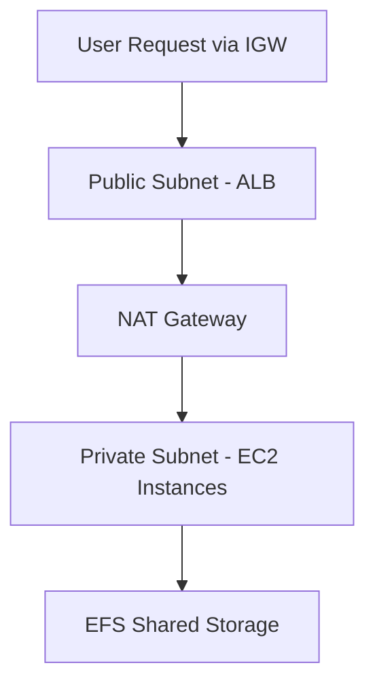
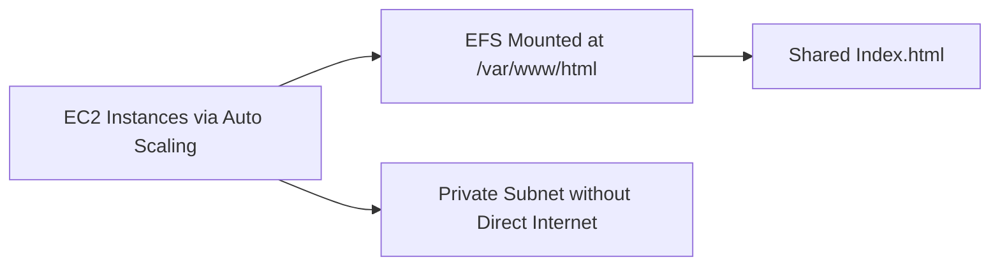
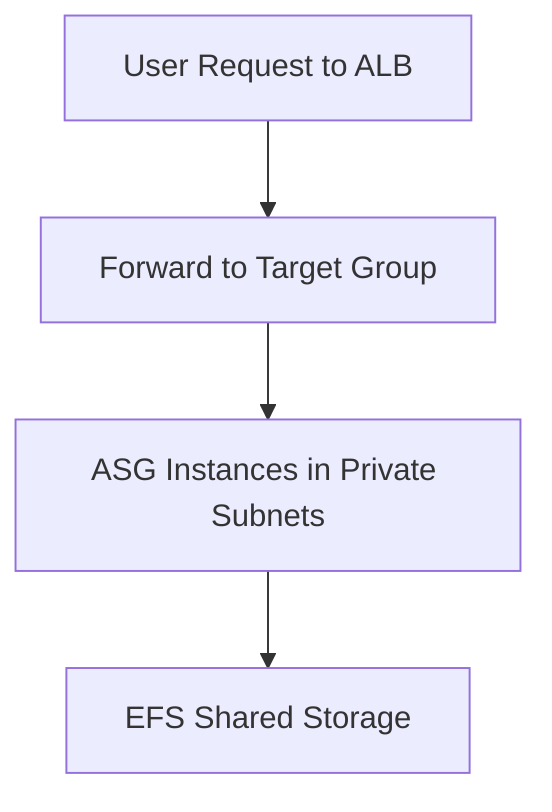

# Section 9: Introduction Of Project

<details open>
<summary><b>Section 9: Introduction Of Project (CL-KK-Terminal)</b></summary>

## Table of Contents

- [9.1 Introduction Of Project](#91-introduction-of-project)
- [9.2 Session - 2 Implementation Of VPC Design](#92-session---2-implementation-of-vpc-design)
- [9.3 Session- 3 Configure EFS & Setup Custom AMI For Auto Scaling](#93-session--3-configure-efs--setup-custom-ami-for-auto-scaling)
- [9.4 Session- 4 Set up And Test Auto Scaling & Deploy ALB](#94-session---4-set-up-and-test-auto-scaling--deploy-alb)
- [9.5 Session - 5 Setting Up Security Group](#95-session---5-setting-up-security-group)
- [9.6 Session - 6 Integrate Route 53 For Domain Management](#96-session---6-integrate-route-53-for-domain-management)
- [9.7 Session - 7 Testing and Optimization](#97-session---7-testing-and-optimization)
- [9.8 Session - 8 Project Documentation & Deliverables](#98-session---8-project-documentation--deliverables)

## 9.1 Introduction Of Project

### Overview
This transcript introduces the AWS Capstone Project, detailing the project's title, description, objectives, core AWS services utilized, project phases, and overall structure. The project focuses on building a resilient web application using AWS best practices, emphasizing scalability, high availability, and security. It serves as a comprehensive end-to-end deployment, preparing learners for real-world AWS implementations.

### Key Concepts
The project title is "Resilient and Scalable Web Application Deployment on AWS," involving the design and implementation of a highly available and scalable web application infrastructure on AWS. Key objectives include achieving fault tolerance across multiple availability zones, dynamic resource scaling based on traffic, and implementation of security measures with proper VPC design.

Core AWS services include VPC, EFS, EC2, Auto Scaling, Application Load Balancer, and Route 53. The project phases consist of design, implementation (VPC, EFS, custom AMI, Auto Scaling, ALB), testing/optimization, and documentation/deliverables, covering architecture, deployment, and maintenance.

> [!IMPORTANT]
> The project guarantees that upon completion, participants will gain deep AWS expertise, enabling success in exams and interviews.

### Key Takeaways
```diff
+ Project leverages AWS best practices for resilience, scalability, and security
+ Multiple phases ensure comprehensive understanding from design to testing
+ Serves as a foundation for advanced AWS projects and certifications
```

### Quick Reference
- **Project Title**: Resilient and Scalable Web Application Deployment on AWS
- **Services**: VPC, EFS, EC2, Auto Scaling, ALB, Route 53
- **Phases**: Design, Implementation, Testing/Optimization, Documentation

### Expert Insight
**Real-world Application**: This project simulates enterprise-level AWS deployments for web applications, ensuring resilience against failures and variable traffic loads.

**Expert Path**: Master AWS networking and scaling; focus on security group configurations and load balancing strategies.

**Common Pitfalls**: Skipping multi-AZ setups can lead to outages; avoid overly permissive security groups until final hardening.

## 9.2 Session - 2 Implementation Of VPC Design

### Overview
This transcript details the VPC implementation for the Capstone Project, starting with the creation of a custom VPC across two availability zones. It emphasizes security by separating public and private subnets, ensuring no inbound internet access to EC2 instances, and providing outbound internet via NAT Gateway. Availability is addressed through multi-AZ deployment.

### Key Concepts
The VPC design uses a 192.168.0.0/24 address space with four subnets: public subnets in AP-South-1A and AP-South-1B (192.168.0.0/26 and 192.168.0.64/26), and private subnets in the same AZs (192.168.0.128/26 and 192.168.0.192/26). Internet Gateway enables public access, while NAT Gateway (placed in a public subnet) provides outbound-only internet for private EC2 instances, preventing inbound risks.

Route tables are configured: a public route table (Pte for public) routes 0.0.0.0/0 to IGW, associated with public subnets; main route table includes NAT for private subnets. DNS hostnames and resolving are enabled for EFS mounting.

No diagrams in transcript, but high-level flow:



> [!NOTE]
> Deleting the default VPC isolates the project environment, preventing configuration conflicts.

### Lab Demos
- **Create VPC**: Use AWS Console to create VPC with specified IP range, add subnet tags (e.g., public-subnet-one-a), and associated AZs.
- **Setup IGW**: Attach Internet Gateway to VPC and update route tables.
- **Configure NAT**: Allocate EIP and create NAT Gateway in public subnet; update main route table with NAT target.
- **Verify**: Confirm NAT Gateway state as "available" for outbound connectivity.

### Key Takeaways
```diff
+ Multi-AZ VPC design ensures high availability and fault tolerance
+ NAT Gateway provides secure outbound internet without inbound exposure
+ Proper subnet separation enhances security and resource isolation
- Avoid direct EC2 instance exposure to internet for best practices
```

### Quick Reference
- **VPC CIDR**: 192.168.0.0/24
- **Route Table**: Public for IGW (public subnets), Main for NAT (private subnets)
- **NAT Setup**: Elastic IP required; place in public subnet.

### Expert Insight
**Real-world Application**: VPC designs like this underpin secure, scalable architectures in production, separating control and data planes.

**Expert Path**: Deep dive into VPC peering and transit gateways for complex networks; automate with CloudFormation.

**Common Pitfalls**: Forgetting DNS settings can break EFS mounts; ensure AZ balance for redundancy.

## 9.3 Session- 3 Configure EFS & Setup Custom AMI For Auto Scaling

### Overview
This transcript covers EFS configuration for shared storage and custom AMI creation for Auto Scaling. EFS acts as centralized storage for web applications, enabling easy updates across instances. A test EC2 instance is used to build and test the AMI, ensuring EFS mounting and web app persistence.

### Key Concepts
EFS provides pooled storage, ideal for shared workloads; selected over FSX for simplicity. Security groups allow all traffic initially (hardened later). VPC DNS settings ensure EFS accessibility. Custom AMI includes Apache, web app (index.html), and permanent EFS mount via /etc/fstab for reboots.

The AMI is built on a t2.micro in public subnet (for testing), terminated post-creation to maintain security. Auto Scaling uses this AMI to launch identical instances with pre-configured EFS access.

Storage flow:



> [!IMPORTANT]
> Permanent EFS mounting prevents disconnection on reboots, critical for stateful web apps.

### Lab Demos
- **EFS Setup**: Create regional EFS with custom security groups, mount targets in private subnets.
- **AMI Build**: Launch EC2 in public subnet, install Apache via `yum install httpd`, start/enable service.
- **Mount EFS**: Install Amazon-EFS-utils, create index.html, mount EFS to /var/www/html using mount command.
- **Permanent Mount**: Update /etc/fstab with EFS DNS and directory, verify with reboots.
- **Terminate Test Instance**: Post-AMI creation, ensure AMI availability before termination.

### Key Takeaways
```diff
+ EFS centralizes storage for seamless multi-instance updates
+ Custom AMI automates EFS integration for Auto Scaling
+ Reboot testing validates system stability
- Terminate public-facing instances to avoid security risks
```

### Quick Reference
- **EFS Commands**: `sudo mount -t efs <fs-id>:/ /var/www/html` (temporary); update `/etc/fstab`.
- **AMI Details**: Includes Apache, EFS mount, web app.
- **Termination**: Confirm AMI status as "available".

### Expert Insight
**Real-world Application**: EFS supports containerized apps and multi-instance WordPress deployments.

**Expert Path**: Implement EFS Access Points and policies for granular permissions.

**Common Pitfalls**: Incomplete fstab entries cause mount failures; test AMI thoroughly to avoid Auto Scaling issues.

## 9.4 Session- 4 Set up And Test Auto Scaling & Deploy ALB

### Overview
This transcript explains Auto Scaling Group (ASG) and Application Load Balancer (ALB) integration. ASG dynamically adjusts EC2 instances based on demand; ALB distributes traffic. A test app (port 8080) validates balancing, while production app runs on port 80. ASG is initially set to zero instances, scaled manually for testing.

### Key Concepts
Launch template uses custom AMI, t2.micro, private subnets. User data deploys test app on port 8080. ALB (internet-facing) with target groups (web-app on port 80, test-app on port 8080) in public subnets ensures fault tolerance.

ASG attaches to target groups; instances auto-register. Scaling policies ensure high availability. Test app reveals backend instance IPs for verification.

Deployment sequence:


> [!NOTE]
> Manual scaling tests functionality before dynamic policies.

### Lab Demos
- **Launch Template**: Select custom AMI, add user data script for test app, restrict to private subnets.
- **ASG Creation**: No initial instances; configure min/max (e.g., 0-5), attach ALB target groups.
- **ALB Setup**: Create ALB in public subnets, listeners for ports 80/8080 forwarding to respective target groups.
- **Manual Scale**: Increase ASG desired capacity to 2; verify instances in target groups.
- **Test Traffic**: Access ALB URL; refresh to see IP changes via test app (port 8080).

### Key Takeaways
```diff
+ ALB + ASG ensures automatic traffic distribution and scaling
+ Test app validates balancing; production on port 80
+ Multi-AZ setup prevents single-point failures
- Start with zero instances for controlled deployment
```

### Quick Reference
- **Ports**: Prod: 80; Test: 8080
- **ASG Scaling**: Manual (0 initial), target groups auto-register.
- **Verification**: Refresh test app URL for varying IPs.

### Expert Insight
**Real-world Application**: Powers high-traffic sites like e-commerce, handling demand spikes.

**Expert Path**: Integrate CloudWatch metrics for predictive scaling.

**Common Pitfalls**: Mismatched target studies/subnets cause unhealthy targets; test thoroughly.

## 9.5 Session - 5 Setting Up Security Group

### Overview
This transcript focuses on hardening security groups post-deployment. ALB allows HTTP/HTTPS publicly; web servers restrict to ALB traffic; EFS allows only web server access. This follows AWS best practices, ensuring secure communication without blocking functionality.

### Key Concepts
Initially permissive security groups are refined: ALB SG allows port 80 from anywhere, port 8080 from user's IP. Web server SG sources from ALB SG on ports 80/8080, allowing SSH for management. EFS SG permits NFS (2049) from web server SG, using security group references for policy enforcement.

Security matrix:

| Service | Inbound Rules |
|---------|---------------|
| ALB SG | Port 80: 0.0.0.0/0; Port 8080: User's IP |
| Web SG | Port 80/8080: ALB SG source |
| EFS SG | NFS (2049): Web SG source |

### Lab Demos
- **ALB SG**: Restrict inbound to HTTP (anywhere) and custom TCP 8080 (my IP).
- **Web SG**: Remove all traffic; add rules sourced from ALB SG on ports 80/8080.
- **EFS SG**: Update to NFS sourced from web SG.
- **Test**: Verify ALB URL works, test app restricted to user's IP.

### Key Takeaways
```diff
+ Security group references enable granular access control
+ ALB SG public-facing; others internal and restricted
+ Hardening prevents unauthorized access during traversal
```

### Quick Reference
- **ALB**: Public HTTP/HTTPS; restricted test app.
- **Web/EC2**: ALB-sourced only.
- **EFS**: NFS from EC2.

### Expert Insight
**Real-world Application**: Mimics enterprise security, using VPC endpoints for further isolation.

**Expert Path**: Implement WAF and Shield for ALB protection.

**Common Pitfalls**: Over-restricting blocks health checks; validate group references.

## 9.6 Session - 6 Integrate Route 53 For Domain Management

### Overview
This transcript integrates Route 53 for DNS management, setting up hosted zones and alias records. It allows custom domain usage instead of ALB URLs, enabling branded access. Works with external registrars; updates NS records for delegation.

### Key Concepts
Create public hosted zone matching domain (e.g., cloudfoxhub.com). Alias A record points ALB to custom subdomain. DNS propagation takes time; flush local DNS if needed. Supports both public and test apps.

Flow:


### Lab Demos
- **Hosted Zone**: Create with domain name, note NS records.
- **Registrar Update**: Replace NS in GoDaddy/etc. with AWS-provided ones.
- **Alias Record**: Point subdomain (e.g., learn.cloudfoxhub.com) to ALB ARN.
- **Test**: Access via DNS; verify propagation.

### Key Takeaways
```diff
+ Route 53 integrates seamlessly for custom domains
+ Alias records optimize AWS service lookups
+ Supports multiple subdomains and geo-routing
```

### Quick Reference
- **Hosted Zone**: Public, matches registrar.
- **Alias**: Target ALB ARN via Route 53 interface.

### Expert Insight
**Real-world Application**: Custom domains for APIs and sites, with health checks.

**Expert Path**: Use Route 53 for failover and latency-based routing.

**Common Pitfalls**: DNS caching delays; ensure client-side flush.

## 9.7 Session - 7 Testing and Optimization

### Overview
This transcript tests high availability, scalability, and resilience. It verifies ASG recreation on instance termination, dynamic scaling on CPU load, and load balancing. Test app confirms backend rotations.

### Key Concepts
Test high availability by terminating one instance; ASG recreates it. Scale-out: CPU >60% triggers new instances (up to 5). Scale-in: Load drop terminates excess. Target groups auto-update; logs track activities.

Load testing via browser-based CPU stressers validates scaling.

### Lab Demos
- **HA Test**: Terminate instance; verify ASG recreation and traffic continuity.
- **Scale-Out**: Increase CPU load on instances; monitor ASG add instances to target groups.
- **Scale-In**: Reduce load; confirm terminations via CloudWatch.
- **Validation**: Use test app refreshes to check IP rotations; review ASG activity logs.

### Key Takeaways
```diff
+ ASG ensures instance minimums and dynamic scaling
+ Load balanced traffic across healthy targets
+ Comprehensive logs aid troubleshooting
- Manual CPU load simulation mimics real load
```

### Quick Reference
- **Policies**: Scale-out on CPU >60%, scale-in on low load.
- **Logs**: View in ASG activity history.

### Expert Insight
**Real-world Application**: Essential for applications with variable traffic, preventing outages.

**Expert Path**: Fine-tune scaling metrics with CloudWatch dashboards.

**Common Pitfalls**: Over-aggressive policies can cause thrashing; test with replicas.

## 9.8 Session - 8 Project Documentation & Deliverables

### Overview
This transcript covers documentation and deliverables, including diagrams, design docs, implementation guides, performance reports, and presentation templates. Google Drive links provide editable templates for completion.

### Key Concepts
Deliverables: Architectural diagrams (flowcharts), design docs (VPC rationale), implementation configs (step-by-step), performance reports (baselines/metrics), PowerPoint presentation (agenda, challenges). Add custom data from project execution.

Templates structure professional delivery:
- Diagram: VPC design with data flow.
- Guide: Fill implementation steps (e.g., ASG setup).
- Report: Log performance benchmarks.

### Lab Demos
- **Download Templates**: Access Google Drive; fill sections like implementation steps.
- **Customize**: Add project-specific data (e.g., instance IDs, metrics).
- **Present**: Use PPT for deployment strategy explanation.

### Key Takeaways
```diff
+ Comprehensive docs essential for project presentation
+ Templates provide structure; customization shows expertise
+ Includes diagrams and guides for future reference
```

### Quick Reference
- **Deliverables**: Diagram, Design Doc, Config Guide, Perf Report, Presentation.
- **Source**: Google Drive link in video description.

### Expert Insight
**Real-world Application**: Professional docs satisfy compliance and stakeholder reviews.

**Expert Path**: Integrate with tools like Jenkins for CI/CD docs.

**Common Pitfalls**: Incomplete templates weaken presentations; ensure accuracy.

---

</details>
