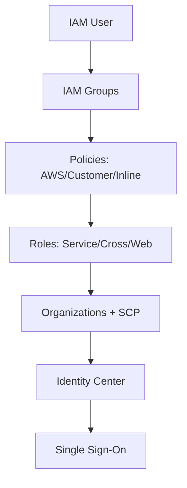

# Section 10: AWS Identity and Access Management (IAM)

<details open>
<summary><b>Section 10: AWS Identity and Access Management (IAM) (CL-KK-Terminal)</b></summary>

## Table of Contents
- [10.1 AWS Identity and Access Management (IAM)](10.1-aws-identity-and-access-management-iam)
- [10.2 IAM Policies - AWS Managed Policies (Hands-On)](10.2-iam-policies-aws-managed-policies-hands-on)
- [10.3 IAM Policies - IAM Customer Managed Policies  (Hands-On)](10.3-iam-policies-iam-customer-managed-policies-hands-on)
- [10.4 IAM Policies - Inline Policies  (Hands-On)](10.4-iam-policies-inline-policies-hands-on)
- [10.5 IAM Entities - IAM Users  (Hands-On)](10.5-iam-entities-iam-users-hands-on)
- [10.6 IAM Entities - IAM Groups  (Hands-On)](10.6-iam-entities-iam-groups-hands-on)
- [10.7 IAM Entities - IAM Roles Practical With AWS Best Practices](10.7-iam-entities-iam-roles-practical-with-aws-best-practices)
- [10.8 IAM Entities - IAM Roles AWS Account Assume Role](10.8-iam-entities-iam-roles-aws-account-assume-role)
- [10.9 IAM Entities - IAM Roles Assume Role Cross Account Access](10.9-iam-entities-iam-roles-assume-role-cross-account-access)
- [10.10 IAM Entities - IAM Roles Web Identity-SAML 2.0 Federation](10.10-iam-entities-iam-roles-web-identity-saml-2.0-federation)
- [10.11 IAM Roles Custom Trust Policy](10.11-iam-roles-custom-trust-policy)
- [10.12 IAM Root User Best Practices Part 1 Multi Factor Authentication (MFA)](10.12-iam-root-user-best-practices-part-1-multi-factor-authentication-mfa)
- [10.13 IAM Root User Best Practices Part 2 -- Never Use Root User --](10.13-iam-root-user-best-practices-part-2-never-use-root-user)
- [10.14 IAM Root User Best Practices Part 3 -- Root User Security](10.14-iam-root-user-best-practices-part-3-root-user-security)
- [10.15 IAM Reports Part 1 - IAM Credential Reports](10.15-iam-reports-part-1-iam-credential-reports)
- [10.16 IAM Reports Part 2 - IAM Advisor Reports](10.16-iam-reports-part-2-iam-advisor-reports)
- [10.17 IAM Reports Part 3 - IAM Access Analyzer](10.17-iam-reports-part-3-iam-access-analyzer)
- [10.18 AWS Organization Part 1](10.18-aws-organization-part-1)
- [10.19 AWS Organization Part 2 Practical - Consolidated Billing](10.19-aws-organization-part-2-practical-consolidated-billing)
- [10.20 AWS Organization -- Service Control Policies (SCP)](10.20-aws-organization-service-control-policies-scp)
- [10.21 AWS Organization Part 4 Service Control Policies (SCPs) Practical](10.21-aws-organization-part-4-service-control-policies-scps-practical)
- [10.22 AWS IAM Identity Center](10.22-aws-iam-identity-center)
- [10.23 AWS IAM Identity Center Practical   (Hands-On)](10.23-aws-iam-identity-center-practical-hands-on)

## 10.1 AWS Identity and Access Management (IAM)
### Overview
This module introduces AWS Identity and Access Management (IAM), explaining its fundamental purpose in securing access to AWS resources through users, groups, policies, and roles. It uses a real-world scenario to illustrate how IAM replaces insecure practices like sharing root user credentials, enabling fine-grained access control within organizations.

### Key Concepts and Deep Dive
#### Why AWS Developed IAM
- **Security Needs**: Large companies like Global Tech Solution migrate to AWS but require multiple people to manage resources without sharing root accounts, which poses risks.
- **Core Functionality**: IAM is a web service for securely controlling access to AWS resources via users, permissions, and credentials. It prevents unauthorized actions and ensures accountability.

#### Fundamental Components
- **Users**: Represent individual humans or applications needing AWS access. Each has unique credentials (username/password or access keys).
- **Groups**: Collections of users for simplified permission management. Policies attached to groups are inherited by members.
- **Policies**: Define permissions (what actions on which resources). Teach three types: AWS Managed, Customer Managed, and Inline Policies.
- **Roles**: Allow temporary access for users, services, or cross-account scenarios.

#### Lab Demo: Creating IAM Users and Login
- **Steps**:
  1. Create AWS account and log in as root user.
  2. Navigate to IAM console and create IAM user with AWS Management Console access.
  3. Set a custom password and provide permissions (e.g., AmazonEC2FullAccess).
  4. Use the provided sign-in URL to log in as the IAM user in an incognito browser.
  5. Observe that without permissions, users cannot access services like EC2.
- **Key Insight** ✅: IAM users start with no permissions; explicit policy attachment enables access.
- **Table: IAM Users vs. Root User**

  | Aspect        | Root User                          | IAM User                          |
  |---------------|------------------------------------|-----------------------------------|
  | Access Level  | Unrestricted (all services)       | Limited by attached policies     |
  | Security      | High risk if compromised          | Granular control                 |
  | Best Practice | Avoid for daily tasks             | Use for specific roles           |

#### Real-World Application Scenario
In a corporate environment, use IAM to create users for developers (e.g., EC2 management) and administrators (e.g., billing), replacing risky shared accounts.

#### Expert Path Tips
- 📝 Start with AWS Managed Policies for beginners, then create custom ones as needs grow.
- ⚠️ Regularly review user access and remove unused accounts to minimize attack surfaces.

#### Common Pitfalls
- ❌ Sharing root credentials: Leads to unauthorized changes.
- ❌ Over-permissive policies: Grant only necessary actions to follow least privilege.

#### Lesser-Known Facts
- 💡 IAM uses JSON-based policies, compatible with programming tools.
- 💡 Roles enhance security by providing temporary credentials, ideal for EC2 instances accessing S3.

## 10.2 IAM Policies - AWS Managed Policies (Hands-On)
This module delves into AWS Managed Policies, their benefits and limitations, and practical implementation. It explains how these predefined policies simplify permission management but may offer excessive access, leading to the need for custom policies.

It covers how policies define who can perform what actions on AWS resources, using JSON for visual editing or direct specification.

#### Policy Types and AWS Managed Policies
- **Managed Policies**: Predefined by AWS, reusable across users/groups/roles.
- **Advantages**: Easy to apply, auto-updated, follow best practices.
- **Disadvantages**: Cannot customize; may grant broader permissions (e.g., EC2 Full Access includes VPC access).
- **Use Case**: Quick setup for standard roles, but risky for granular control.

#### Hands-On Demo: Attaching Managed Policies
- **Steps**:
  1. Create IAM users (e.g., EC2 Mastermind, VPC Visionary) in AWS console.
  2. Attach "AmazonEC2FullAccess" to EC2 Mastermind and "AmazonVPCFullAccess" to VPC Visionary.
  3. Log in as each user; verify access to permitted services (denied for others).
  4. Note: Managed policies can overlap (e.g., EC2 access impacts VPC).

- **Table: Policy Types Comparison**

  | Policy Type      | Managed By | Reusable | Customizable | Best For |
  |------------------|------------|----------|--------------|---------|
  | AWS Managed     | AWS       | Yes     | No          | Simple scenarios |
  | Customer Managed| User       | Yes     | Yes         | Granular control |
  | Inline Policies | User       | No      | Yes         | Temporary/single-use |

#### Benefits and Limitations
- **Benefits**: Simplicity, automatic updates, predefined roles (e.g., ReadOnlyAccess).
- **Limitations**: Resource-level restrictions impossible; may include unintended permissions.

#### Expert Insight
- **Real-World Application**: Use for temporary teams; monitor via policy simulator.
- **Expert Path**: Transition to customer-managed for production.
- **Pitfalls**: Over-trusting defaults; always test permissions.

## 10.3 IAM Policies - IAM Customer Managed Policies  (Hands-On)
This module covers IAM Customer Managed Policies, which provide total control over permissions using JSON structures. It emphasizes creating tailored policies for specific needs, such as restricting access to certain EC2 instances, overcoming limitations of AWS Managed Policies.

#### Key Features of Customer Managed Policies
- **Control**: User-created and managed; not auto-updated by AWS.
- **Customization**: Resource-level control (e.g., specific EC2 instances).
- **Versioning and Rollback**: Track changes.
- **Use Case**: Fine-grained permissions, like allowing start/stop on two instances for EC2 Mastermind while denying termination.

#### Structure in JSON Format
- **Effect**: Allow/Deny.
- **Actions**: Specific actions (e.g., ec2:StartInstances).
- **Resources**: ARNs for exact resources.
- **Conditions**: Optional (e.g., IP restrictions).

#### Hands-On Demo: Creating Customer Policies
- **Steps**:
  1. In IAM, create policy via JSON editor (e.g., for EC2 management on specific instances).
  2. Attach to user (e.g., EC2 Mastermind).
  3. Test via policy simulator: Verify allows/denies.
  4. Log in and confirm actions (e.g., stop/terminate on allowed instances fail on others).

- **Code Block Example (Policy for Specific EC2 Instances)**:
  ```json
  {
    "Version": "2012-10-17",
    "Statement": [
      {
        "Effect": "Allow",
        "Action": [
          "ec2:StartInstances",
          "ec2:StopInstances",
          "ec2:TerminateInstances"
        ],
        "Resource": [
          "arn:aws:ec2:region:account-id:instance/i-123456789",
          "arn:aws:ec2:region:account-id:instance/i-987654321"
        ]
      }
    ]
  }
  ```

#### Limitations
- Size limit: 6144 characters.

#### Expert Insight
- **Real-World**: Use for compliance; audit via CloudTrail.
- **Pitfalls**: Incorrect ARNs lead to failures; use simulators.

## 10.4 IAM Policies - Inline Policies  (Hands-On)
Inline Policies are embedded directly into IAM users, groups, or roles, offering exclusive access without reusability. Ideal for temporary, sensitive roles.

#### Characteristics
- **1:1 Association**: Tied to one entity; deleted if entity removed.
- **No ARN**: Cannot be shared.
- **Use Cases**: Short-term projects, implied security (e.g., head of department access).

#### Demo: Attaching Inline Policies
- **Steps**: Create user, add inline policy via JSON, test access.

- **Comparison Table**

  | Aspect   | Inline       | Customer Managed |
  |----------|--------------|------------------|
  | Reusable | No          | Yes             |
  | ARN      | No          | Yes             |

## 10.5 IAM Entities - IAM Users  (Hands-On)
IAM Users represent individuals needing AWS access, with unique credentials and permissions defined by policies.

#### Key Properties
- **Credentials**: Username/password for console; access keys for programmatic access.
- **MFA**: Enforces security; required for best practices.
- **Permissions**: Via policies; use least privilege.
- **Password Policy**: Enforce complexity; customizable.

#### Hands-On: Creating Users
- **Steps**:
  1. Create user with console access.
  2. Generate access keys if needed.
  3. Attach policies (e.g., EC2 Full Access).
  4. Set up MFA via Google Authenticator.
  5. Test login and access.

#### Expert Insight
- **Pitfalls**: Avoid over-permissions; rotate keys regularly.

## 10.6 IAM Entities - IAM Groups  (Hands-On)
Groups streamline user permission management by inheriting policies. Users can belong to multiple groups.

#### Demo: Grouping Users
- **Steps**: Create group, add users, attach policies; test inheritance.

## 10.7 IAM Entities - IAM Roles Practical With AWS Best Practices
Roles provide temporary credentials, enhancing security. Use cases: AWS Service roles (e.g., EC2 to S3), Cross-Account, Web Identity/SAML.

#### Service Role Demo
- **Steps**:
  1. Create role for EC2.
  2. Attach policies (e.g., S3 Read).
  3. Assign to EC2 instance; test access without keys.

#### Best Practices
- No long-term credentials; least privilege.

## 10.8 IAM Entities - IAM Roles AWS Account Assume Role
Assume Role allows temporary access within accounts. Enhanced with MFA and conditions.

#### Demo
- **Steps**: Create role, set trust (user ARN), switch roles for temporary access (e.g., S3 admin).

## 10.9 IAM Entities - IAM Roles Assume Role Cross Account Access
Enables access between AWS accounts securely, replacing shared credentials.

#### Demo
- **Steps**: Create role in trusting account; assume from trusted account; test access.

## 10.10 IAM Entities - IAM Roles Web Identity-SAML 2.0 Federation
Supports single sign-on via OAuth/SAML, granting temporary AWS access post-third-party auth.

#### Providers
- Web Identity: OAuth (e.g., Facebook); SAML for corporate (e.g., AD FS).

#### Use Case Flow
- Authenticate via provider → Receive token → Assume role for AWS access.

## 10.11 IAM Roles Custom Trust Policy
Allows crafting Policies for specific assumptions (e.g., MFA-required).

#### Conditions**: IP, MFA, time-based.

## 10.12 IAM Root User Best Practices Part 1 Multi Factor Authentication (MFA)
Enable MFA on root for heightened security. Use apps like Google Authenticator; QR/OTP-based.

#### Demo
- **Steps**: Assign MFA in account settings; verify login requires OTP.

## 10.13 IAM Root User Best Practices Part 2 -- Never Use Root User --
Avoid root for daily tasks; use IAM users with minimal privileges. Root requires for account-level changes.

#### Demo
- Create admin user; attach AdministratorAccess; use for operations.

## 10.14 IAM Root User Best Practices Part 3 -- Root User Security
Secure root: Change alias; avoid programmatic keys; use admin roles.

#### Demo
- Configure password policy; enable MFA; rotate access keys.

## 10.15 IAM Reports Part 1 - IAM Credential Reports
Overview IAM user statuses via downloadable CSV: last login, MFA, keys.

#### Content**: Password/active keys; aging.

## 10.16 IAM Reports Part 2 - IAM Advisor Reports
Shows service access per IAM entity; identifies unused permissions.

#### Modes**: Grant scope; evolution.

## 10.17 IAM Reports Part 3 - IAM Access Analyzer
Identifies external/shared resources with unintended access (e.g., public S3). Free for external analysis; charged for unused.

#### Findings**: Patch via recommendations.

## 10.18 AWS Organization Part 1
Aims to manage multiple accounts centrally: Consolidated Billing, SCPs for cross-account governance.

#### Reasons for Multi-Account**: Security, compliance, cost tracking.

## 10.19 AWS Organization Part 2 Practical - Consolidated Billing
Demo: Invite accounts; accept; verify billing consolidation (volume discounts).

#### Flow**: Management account manages billing.

## 10.20 AWS Organization -- Service Control Policies (SCP)
Deny-type policies restricting account permissions hierarchically (OU/Account).

#### Evolution**: Aid rule; multipart.

#### Limitations**: Affects members; not root.

## 10.21 AWS Organization Part 4 Service Control Policies (SCPs) Practical
Demo: Create deny policies; attach at levels; test via user access.

#### Logic**: OR allow; AND for hierarchy.

## 10.22 AWS IAM Identity Center
SSO for workforce across accounts; integrates with AD/SAML; manages permissions centrally.

#### Components**: Users in Identity Center; permission sets; account assignments.

## 10.23 AWS IAM Identity Center Practical   (Hands-On)
Setup: Enable in Organizations; create users in directory; assign permission sets to accounts.

#### Demo**: Launch EC2/S3 via user switches; verify per-account limits.

### Graph: IAM Ecosystem




## Summary

```diff
+ IAM secures AWS by controlling who does what on which resources via users, groups, policies, and roles.
- Avoid root user for daily tasks; enable MFA and use managed accounts with least privilege.
! Remember SCP denies override IAM allows; organizations centralize multi-account management.
+ Key resources: Policies attach to entities; roles assume for temp access; reports audit security.
- Common pitfalls: Broad policies lead to breaches; forget to rotate keys or delete unused reports.
```

### Quick Reference
- **Create IAM User**: `aws iam create-user --user-name ec2-user`
- **Attach Policy**: `aws iam attach-user-policy --user-name ec2-user --policy-arn arn:aws:iam::aws:policy/AmazonEC2FullAccess`
- **Enable MFA (CLI)**: Use `aws iam enable-mfa-device`
- **Download Credential Report**: Via IAM console or `aws iam generate-credential-report`

### Expert Insight
- **Real-world Application**: Enterprises use Organizations + Identity Center for governance across 100+ accounts.
- **Expert Path**: Master custom policies/roles; automate via Terraform; integrate with CloudFormation for stacks.
- **Common Pitfalls**: Ignoring SCP inheritance; sharing credentials; no MFA on root.
- **Lesser-Known Facts**: Roles support external ID for Cross-Account; IAM is region-agnostic but MFA keys are global.
</details>
