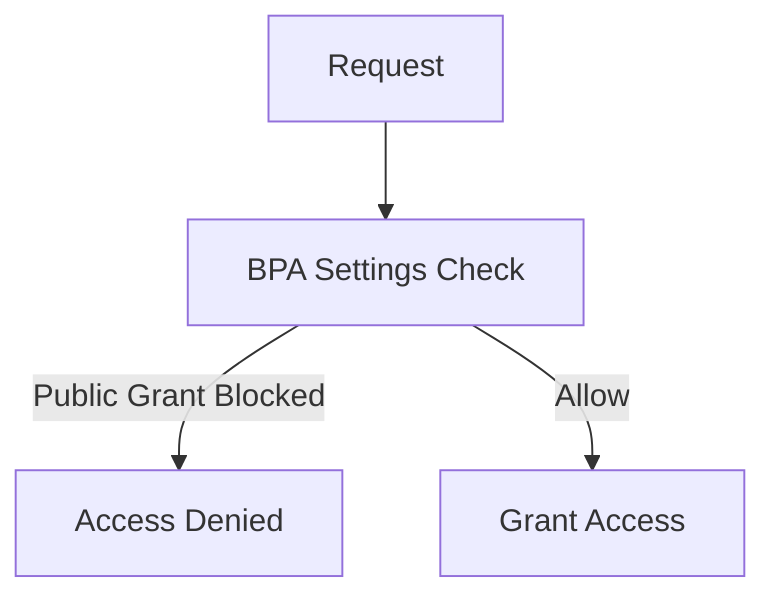
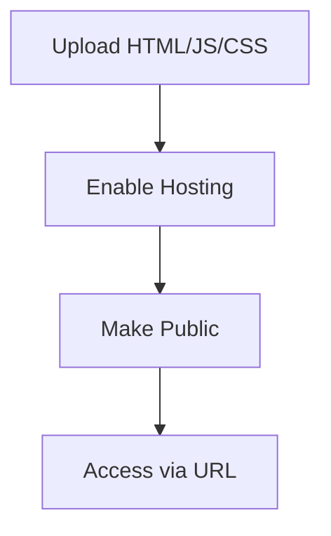

### Overview
Public access in S3 means allowing unauthenticated users (public) to read/download objects. Disabled by default for security—enable via bucket policies (preferred) or ACLs (legacy). Bucket policies use Principals like "*" for public; ACLs grant to "Everyone". Sensitive data should stay private; use pre-signed URLs for controlled sharing.

### Two Ways to Grant Public Access
1. **Bucket Policy**: Attach JSON to bucket (Perms tab). Defines access for principals (users/roles/"*" for public).
   - Pros: Granular/moerns; cross-account friendly.
   - Cons: JSON syntax; attaches to bucket.
   - Example: Public read on all objects.
     
     ```json
     {
       "Version": "2012-10-17",
       "Statement": [
         {
           "Effect": "Allow",
           "Principal": "*",
           "Action": "s3:GetObject",
           "Resource": "arn:aws:s3:::bucket/*"
         }
       ]
     }
     ```

2. **ACL (Legacy)**: List grants (bucket/object level).
   - Pros: Quick for public; object-specific.
   - Cons: Disabled by default; risky (easy to misconfigure); AWS discourages.
   - Steps: Enable ACLs in Properties > ACLs > Grant "read" to Everyone.

Both can expose data—audit first. Demo: ACLs require unblocking public access; bucket policy easier but test carefully.

```diff
+ Bucket policies: Modern, controllable
- ACLs: Legacy, low-control
! Risk: Accidental public data—use sparingly for static sites
```

> [!WARNING]
> Public access violates security best practices—only for public assets like images.

## 11.24 AWS S3 -- S3 Public Access Part 2 -- Block Public Access

### Overview
Block Public Access (BPA) protects S3 buckets(objects wire from accidental public exposure. Four settings: block new ACL/public policies, block any ACL/policy, ignore public ACL/policies, block cross-account access. Account-level overrides bucket-level; defaults allow BPA for new buckets secure data.

### Key Concepts
BPA Levels:
- **Account-Level**: Covers all S3 buckets (IAM console > Account settings > BPA). Highest priority.
- **Bucket-Level**: Per-bucket (Properties > BPA). Override account defaults if needed.

Settings Details:
1. **Block Public ACLs**: Prevents new public ACLs on buckets/objects. Doesn't affect existing.
2. **Block Any Public ACL**: Blocks all ACL-based public access, including existing.
3. **Block Public Policies**: Prevents policies allowing public access.
4. **Block Any Public Policy**: Blocks policies granting public access, even existing.
5. **Block Cross-Account Access**: Denies cross-account policies, even if public.

Workflow:
1. Enable BPA (simplest for all buckets).
2. Exceptions: Turn off specific BPA for public buckets (e.g., static sites).

Diagram:


> [!TIP]
> Enable BPA at account-level for defaults; customize per-bucket. Backup data before changes.

## 11.25 S3 Public Access Part 3 Make An S3 Bucket Or Object Public Using Bucket Policy

### Overview
Make S3 buckets/objects public via bucket policies: "Principal": "*" allows anonymous access. Tools: Console Policy Generator or JSON. For route 53 domain mapping (not GoDaddy), bucket name = domain for public access. Lab: Create bucket, disable BPA partially/test public access—host files like PDFs externally.

### Key Concepts
Policy Structure:
```json
{
  "Version": "2012-10-17",
  "Statement": [
    {
      "Sid": "PublicReadGetObject",
      "Effect": "Allow",
      "Principal": "*",
      "Action": ["s3:GetObject"],
      "Resource": ["arn:aws:s3:::bucket-name/*"]
    }
  ]
}
```

Publicity: Allows downloads; public write risky (use pre-signed URLs).

Hosting with Domain: Bucket name = domain.subdomain (e.g., "web.example.com"); map in route 53.

Pros/Cons: Easy pubic access; high risk if misconfigured.

```diff
+ Simple public hosting for assets
- Risk full exposure; BPA prevents accidents
! Use: Static websites, open data
```

## 11.26 AWS S3 -- AWS S3 Static Web Hosting

### Overview
Static web hosting hosts HTML/CSS/JS sites on S3 without servers. Enable via Properties > Static web hosting; bucket becomes website domain. Use cases: Portfolios, landing pages. Requires bucket naming matching domain (e.g., "example.com"); route 53 for custom domains. Limits no server-side (PHP); HTTPS via CloudFront.

### Key Concepts
Static Sites: Pre-built files; load via browser (no backend).

Host on S3:
1. Create bucket (name = domain if custom).
2. Upload site files (index.html root).
3. Enable static hosting (specify index/error files).
4. Set public access (bucket policy for "*" read).

Advantages: Scalable, low-cost (pay per GB/request); auto-SSL?domain via CloudFront.

Disadvantages: Static only; no dynamic content; no custom scripts.

Example Policy:
```json
{
  "Version": "2012-10-17",
  "Statement": [{
    "Sid": "AddPerm",
    "Effect": "Allow",
    "Principal": "*",
    "Action": ["s3:GetObject"],
    "Resource": ["arn:aws:s3:::bucket/*"]
  }]
}
```

Flow:


> [!NOTE]
> Combine with CloudFront for CDN/custom domain/HTTPS. No support for dynamic elements.

## 11.27 AWS S3 -- AWS S3 Static Web Hosting (Hands-On)

### Overview
Hands-on: Create bucket (name web.*.com), upload site files, enable hosting/index.html, set public policy. Maps to custom domain via DNS (route 53 or external). Result: Site accessible at s3-website-region.amazonaws.com/bucket-name. Errors: Public access blocked → disable BPA; versioning optional.

### Key Concepts
Steps:
1. Bucket Name: Match domain (e.g., web.site.com).
2. Upload Files: Index.html, CSS.
3. Properties > Static Web Hosting: Enable; set index。
4. Perms: Bucket policy "*" for s3:GetObject.
5. DNS: Point domain to S3 (CNAME or route 53 alias).

Publicity: Works; HTTPS needs CloudFront.

Test URL: http://bucket-name.s3-website-region.amazonaws.com

> [!TIP]
> Upload organized files; test post-policy attach. Custom domain requires DNSдела config.

## 11.28 AWS S3 -- AWS S3 Static Web Hosting With Route 53 (Hands-On)

### Overview
Hands-on route 53: Migrate domain from GoDaddy to route 53 (register if needed), create hosted zone, transfer NS servers, enable static hosting, map alias record for root/subdomain. Host site at custom URL, bypassing GoDaddy DNS limits.

### Key Concepts
Route 53 vs GoDaddy: Route 53 manages subdomain/domain records; GoDaddy limited for CNAME.

Steps:
1. Register domain?route 53 if possible.
2. Create hosted zone; get NS; update GoDaddy.
3. Bucket name = subdomain.domain.com.
4. Upload files; enable hosting/public policy.
5. Route 53: Alias A record (S3 static host endpoint).

Benefits: Full DNS control; easy sub/web routing.

Post-setup: Wait propagation (~30min); site live.

> [!IMPORTANT]
> NS change takes time; monitor via route 53 health checks.

## 11.29 AWS S3 -- AWS S3 Cross-Origin Resource Sharing (CORS) (Hands-On)

### Overview
CORS enables web apps in one domain to access S3 resources in another, avoiding browser blocks. Enable via bucket props: JSON specifying origins/methods. Hands-on: Separate buckets; upload files; set CORS; test iframe/plain requests—fix console errors by allowing origins/methods.

### Key Concepts
CORS Structure:
```json
[
  {
    "AllowedOrigins": ["*"],
    "AllowedMethods": ["GET", "PUT"],
    "AllowedHeaders": ["*"],
    "ExposeHeaders": ["x-amz-version-id"],
    "MaxAgeSeconds": 3000
  }
]
```

Workflow:
1. Web app site (e.g., bucket1).
2. Resources in bucket2.
3. Set CORS on bucket2.

Testing: Open site; access resources; CORS errors fixed with config.

> [!NOTE]
> Browsers enforce; client-side fix. Use specific origins for security.

## 11.30 AWS S3 -- AWS S3 Cross-Region Replication (CRR) (Hands-On)

### Overview
CRR: Auto-replicate objects/bucket creations to another region's bucket (single-way). Requires versioning (auto-enables). Excludes cross-account; Rules: Create via console/CLI; one-way (source → dest); costs for inter-region transfer. Use: DR, compliance, latency reduction.

### Key Concepts
Setup:
1. Source/dest buckets (diff regions; versioning needed).
2. IAM role for replication (auto-create).
3. Rules: Prefix/tag filters; storage class changes (e.g., IA → Std).
4. Exceptions: Delete markers; CrossAccount.

CLI Test: Upload to source; wait min; copy to dest.

Diagram:
```mermaid
flowchart LR
    A[Source Bucket (US-East)] -->|Replicate| B[Dest Bucket (EU)]
```

> [!TIP]
> Monitor via S3 console; delete actions conflicted (enable if needed).

## 11.31 AWS S3 -- AWS S3 Transfer Acceleration

### Overview
Transfer Acceleration: CloudFront edge locs accelerate uploads/downloads >50% (up to 500%) for long distances/large files. Free to enable; pay for accelerated transfer. S3 endpoint changes (e.g., s3-accelerate.amazonaws.com). Test via speedometer; CLI/SDK use dash—use-accelerate-endpoint.

### Key Concepts
Mechanism: Upload to nearest edge; optimized AWS network to bucket.

Flavors: Download/upload both; cuts time dramatically.

Test: https://s3-accelerate-speedtest.s3-accelerated.amazonaws.com/en/anonymous.html

CLI: aws s3 cp --use-accelerate-endpoint

> [!NOTE]
> Best for global users; no impact on small locale uploads.

## 11.32 AWS S3 -- AWS S3 Server Access Logging

### Overview
Access logging: Text-based logs of all bucket requests (except CloudTrail data events). Enabling: Target another bucket; logs delivered ~2hrs (batches). Use Athena/parsing for insights; complement IAM/bucket policies for audits.

### Key Concepts
Fields: Requester, time, action, response.

Enable: Bucket Properties > Server access logging > Target bucket.

Costs: Log storage/transfer.

> [!TIP]
> Filter via prefixes; not real-time—use for post-hoc analysis.

## 11.33 AWS S3 -- AWS S3 CloudTrail Data Events

### Overview
CloudTrail data events: Log object-level actions (API calls) in S3 (e.g., GetObject). Denser audits; JSON to CloudTrail (not S3). Enable trails/datatypes; vs access logging's summary plain text. For compliance/tracking user actions.

### Key Concepts
Comparison:
- Access Logging: Plain text summaries.
- CloudTrail: JSON details (e.g., userArn); integrated audit.

Enable: CloudTrail console > Trails > Data events > S3.

Pros: Detailed/centralized (CloudWatch/S3 delivery).

> [!NOTE]
> More comprehensive; pay for CloudTrail events.

## 11.34 AWS S3 -- AWS S3 Requester Pays

### Overview
Requester Pays: Bucket owner charges creators/downloaders for costs (transfer/requests)—storage free. Enable CLI/console (block ACL/policies first). Principals: AWS accounts only; CLI add x-amz-request-payer header. For shared datasets where owners aren't cheaper.

### Key Concepts
Workflow:
- Bucket owner: Sets flag.
- Requesters: Assume bills; include header/signature.

Use Cases: Public datasets; saves owner payouts for public downloads.

Enable: Properties > Requester pays.

Test: CLI with --request-payer flag.

> [!WARNING]
> Requesters need billing/alerts; unexpected costs possible.

## 11.35 AWS S3 -- AWS S3 Pre-signed URL

### Overview
Pre-signed URLs: Temporary URLs for actions (GET/PUT) without auth. Created via SDK/CLI/console; expire after set time. Secure file sharing/alternates public access. Hands-on: Generate for download (console); upload (toolkit/SDK).

### Key Concepts
Security: Abuses if leaked; short expiry.

Console: Right-click > Pre-signed URL > 5min.

Advanced: Python SDK for custom.

```python
import boto3
s3 = boto3.client('s3')
url = s3.generate_presigned_url('get_object', Params={'Bucket': bucket, 'Key': key}, ExpiresIn=3600)
```

> [!TIP]
> For sensitive shares; revoke by expiry only.

## 11.36 AWS S3 -- AWS S3 Multi Factor Authentication (MFA) Delete

### Overview
MFA Delete: Requires 6-digit code from authenticator on delete (protects against threats). Enable with versioning; guards objects for 30s-100s. Root/MFA-needed; irreversible; prevents accidental/dele apps.

### Key Concepts
Setup MFA: Account > MFA device (virt/phone).

Enable: Bucket versioning first; Properties > MFA delete require MFA.

Delete: CLI/AWS; code from app; deletes non-current if versioned.

Pros: Layered security.

Cons: Time-consuming for bulk.

> [!NOTE]
> For critical buckets; bypass cloud known attacks.

## 11.37 AWS S3 -- AWS S3 Event Notification

### Overview
Notifications trigger on bucket events (upload/delete/restore). Dest: SNS (emails), SQS (queues), Lambda (code). Enable console; use for automated workflows (e.g., resize images via Lambda).

### Key Concepts
Filters: Prefixes/tags/suffixes.

Example: Upload JPEG → Lambda resize → store new version.

> [!EXAMPLES]
> Real: OLX auto-watermarks; send alerts on big changes.

## 11.38 AWS S3 -- AWS S3 Multi-Part Upload (Hands-On)

### Overview
Multi-part upload splits files >5GB into <5GB parts; uploads parallel/assembles. Speeds/resumes; versioning required.

### Key Concepts
Steps:
1. Split file (7-Zip/Python).
2. Init upload: aws s3 multipart init.
3. Upload parts.
4. Assemble: aws s3 multipart complete.

Pros: Network resilience; faster for large files.

Cons: Complex; resume if interrupted.

> [!TIP]
> Use SDKs for auto-handling.

## 11.39 AWS S3 -- AWS VPC Gateway Endpoint For S3 (Hands-On)

### Overview
VPC Gateway Endpoint: Private routing to S3 within AWS network. Enable via Endpoints menu; auto-route table; saves NAT costs, secures traffic.

### Key Concepts
Setup:
- VPC > Endpoints > Create > Service: com.amazonaws.region.s3.
- VPC/select; route table policy full or restrictive.

Benefits: No IGW/NAT; fast/trusted routing.

Test: Traceroute inside EC2 → AWS backbone (no public IPs).

> [!NOTE]
> For BYOIP/public IPs to stay private.

## 11.40 AWS S3 -- AWS S3 Access Point Theory

### Overview
Access Points: Per-bucket/manageability/permission endpoints. Each with own policy/permissions/networks. Simplify multi-app access without bucket policies. Types: Internet-origin (allow/deny across internet) vs VPC (restrict to VPC).

WPs: Compound by complex bucket policies; easy delegation/per-app access.

Cons: More endpoints; quota 10k/bucket.

### Key Concepts
Apps: Create via bucket/S3 console.

Network-Origin: Choose internet (public) or VPC-restricted.

Protection: GrePred granular roles.

> [!TIP]
> For microservices; do not blend policies— use access points.

## 11.41 AWS S3 -- AWS S3 Access Point (Hands-On)

### Overview
Practical: Delegate access via "Delegate access control to access points". Create points for diff users (e.g., AP1 for user1/2 to AP folder). IAM policies needed so users'd see/िव use APs. Test via Incognito/console.

### Key Concepts
Steps:
1. Delegate BPA policy to bucket.
2. IAM users; grants "list access points".
3. Create APs; policies per user.
4. Users access specific folders via APs.

Challenges: BPA off; IAM grants sight use.

> [Buan !TIP]
> Ideal for multi-team concassage;audit, per-point access.

</details>
