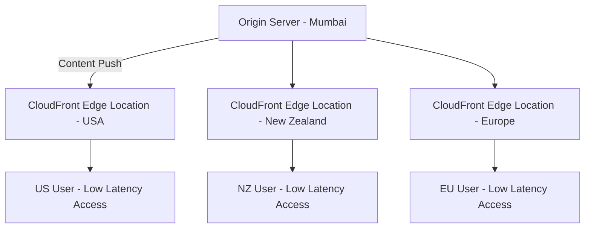
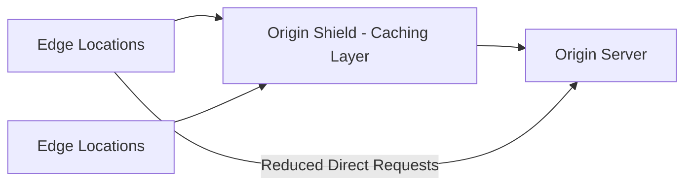
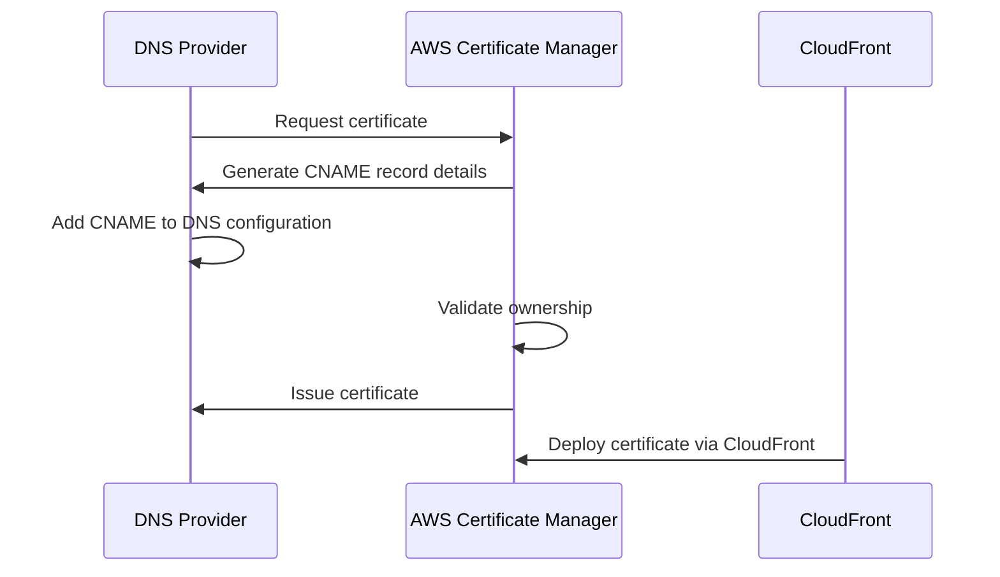
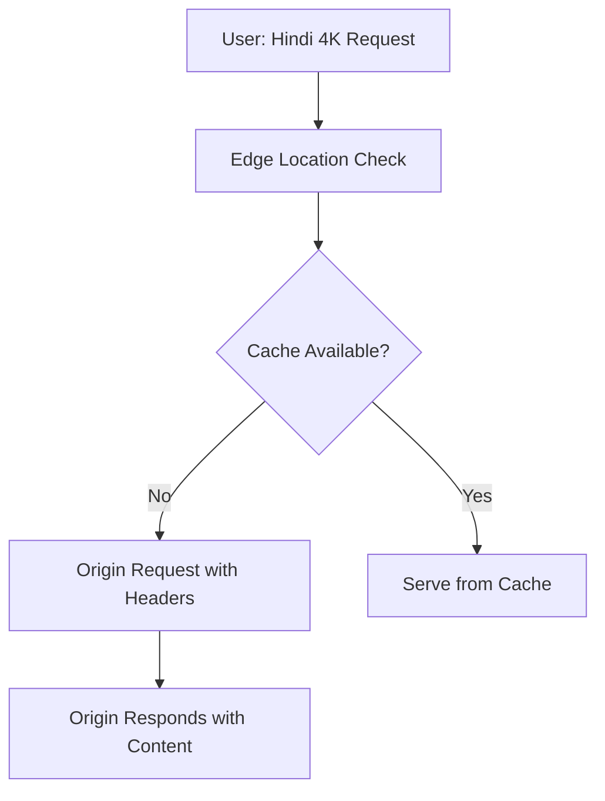
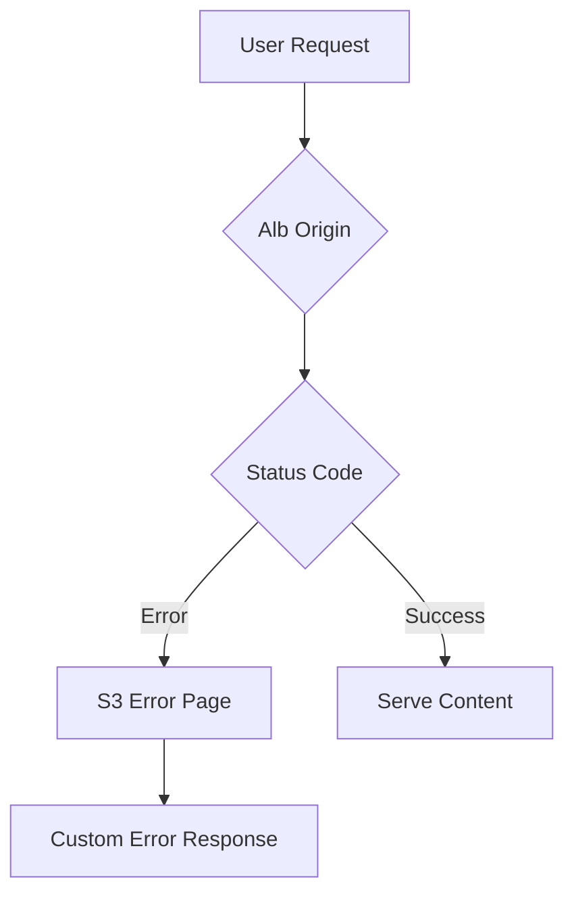

# Section 12: AWS CloudFront Content Delivery Network (CDN)

<details open>
<summary><b>Section 12: AWS CloudFront Content Delivery Network (CDN) (CL-KK-Terminal)</b></summary>

## Table of Contents
- [12.1 Introduction of AWS CloudFront Content Delivery Network (CDN)](#121-introduction-of-aws-cloudfront-content-delivery-network-cdn)
- [12.2 AWS CloudFront Hands-On Lab 1](#122-aws-cloudfront-hands-on-lab-1)
- [12.3 AWS CloudFront Origin Setting](#123-aws-cloudfront-origin-setting)
- [12.4 AWS CloudFront Default Cache Behavior Option](#124-aws-cloudfront-default-cache-behavior-option)
- [12.5 CloudFront Custom HTTPS](#125-cloudfront-custom-https)
- [12.6 AWS CloudFront Origin Access](#126-aws-cloudfront-origin-access)
- [12.7 CloudFront Allowed HTTP Method](#127-cloudfront-allowed-http-method)
- [12.8 AWS CloudFront Default Cache Behavior Restrict Viewer Access](#128-aws-cloudfront-default-cache-behavior-restrict-viewer-access)
- [12.9 AWS CloudFront Default Cache Behavior- Cache Key and Origin Requests](#129-aws-cloudfront-default-cache-behavior--cache-key-and-origin-requests)
- [12.10 AWS CloudFront Default Cache Behavior- Response Header Policy](#1210-aws-cloudfront-default-cache-behavior--response-header-policy)
- [12.11 AWS CloudFront Function Associations](#1211-aws-cloudfront-function-associations)
- [12.12 AWS CloudFront Setting Options -- Supported HTTP Versions & Default Root Object](#1212-aws-cloudfront-setting-options----supported-http-versions--default-root-object)
- [12.13 AWS CloudFront Setting Options Part 2](#1213-aws-cloudfront-setting-options-part-2)
- [12.14 AWS CloudFront Geographic Restrictions](#1214-aws-cloudfront-geographic-restrictions)
- [12.15 AWS CloudFront Origin Group Lab 1 EC2 & S3 Failover](#1215-aws-cloudfront-origin-group-lab-1-ec2--s3-failover)
- [12.16 AWS CloudFront Origin Group Lab 2 Geographical Failover with Load Balancer](#1216-aws-cloudfront-origin-group-lab-2-geographical-failover-with-load-balancer)
- [12.17 AWS CloudFront Tutorial -- AWS CloudFront Error Pages](#1217-aws-cloudfront-tutorial----aws-cloudfront-error-pages)
- [12.18 AWS CloudFront Cache Invalidation](#1218-aws-cloudfront-cache-invalidation)

## 12.1 Introduction of AWS CloudFront Content Delivery Network (CDN)

### Overview
This module introduces AWS CloudFront, Amazon's Content Delivery Network (CDN), explaining its core purpose of accelerating content delivery through global edge locations. It covers the fundamental problems CDNs solve, such as latency and bandwidth issues in global applications, and demonstrates how CloudFront caches content near users for faster, more reliable access.

### Key Concepts

CloudFront is Amazon Web Services' CDN technology designed to:
- Deliver data, videos, applications, and APIs quickly and securely
- Cache content at edge locations closest to users for low latency
- Support global applications with high transfer speeds

#### CDN Benefits Demonstration
The transcript presents two scenarios comparing application performance with and without CloudFront:

**Scenario 1: Without CloudFront**
- LMS hosted in Mumbai, India
- Content served directly from origin server
- Low latency for Indian users (domestic bandwidth)
- High latency for US users (17,000km distance + international bandwidth)

**Scenario 2: With CloudFront**
- Content cached at edge locations worldwide
- Users access content from nearby locations
- Domestic bandwidth speeds for all users, regardless of geographic location
- Origin server load reduced (only serves edge locations, not end users)

#### Architecture


Users globally access content through nearest edge location, eliminating cross-continental requests to origin.

### Lab Demos
No hands-on labs in this introductory module.

### Tables

| Aspect | Without CloudFront | With CloudFront |
|--------|-------------------|-----------------|
| Latency | High for remote users | Low for all users |
| Bandwidth | International (slower) | Domestic (faster) |
| Server Load | All users hit origin | Only edge locations hit origin |
| Content Access | Direct from origin | Cached at edge locations |

### Summary
#### Key Takeaways
```diff
+ CloudFront reduces latency by caching content at 400+ edge locations
+ Eliminates international bandwidth issues through local content delivery
+ Distributes load away from origin servers
+ Essential for OTT platforms and global applications requiring high performance
- Without CDN, global applications face significant performance degradation
```

#### Quick Reference
- **Edge Locations**: 400+ global points of presence for content delivery
- **Origin Types**: S3, EC2, Load Balancers, custom origins
- **Primary Benefits**: Low latency, high transfer speeds, reduced origin load

#### Expert Insight
**Real-world Application**: Netflix, Amazon Prime, and other OTT platforms use CloudFront to deliver 4K/HDR content globally with minimal buffering. Enterprises with distributed user bases implement CloudFront for consistent web application performance.

**Expert Path**: Focus on understanding cache behaviors, origin configurations, and security policies. Practice with S3 static websites as origins to master basic setups before moving to dynamic origins.

**Common Pitfalls**: Assuming CloudFront automatically secures all content - always configure proper security policies. Forgetting to update origin permissions when setting up new distributions.

## 12.2 AWS CloudFront Hands-On Lab 1

### Overview
This hands-on lab demonstrates CloudFront's performance benefits by setting up a distribution with an S3 bucket origin. Participants create a static website hosted on S3, then enable CloudFront to compare latency and bandwidth improvements across global locations using performance testing tools.

### Key Concepts

#### Mission Statement
- Host static website on S3 as CloudFront origin
- Create CloudFront distribution for global delivery
- Test website performance with and without CloudFront using geo-performance tools

#### Lab Workflow
1. Create S3 bucket in us-east-1 region
2. Upload website content (HTML, video, image files)
3. Configure static website hosting on S3
4. Enable public access via bucket policy
5. Create CloudFront distribution with S3 origin
6. Test performance using geo-performance tools

#### Performance Analysis
**Without CloudFront (S3 Direct)**: Using GeoPeeker tool
- Virginia: ~0ms latency (local region)
- Brazil: 113ms latency
- California: 62ms latency  
- Ireland: 72ms latency
- Australia: 200ms+ latency

**With CloudFront**: Dramatic improvement observed across all locations
- Virginia: ~0-1ms
- Brazil: ~0ms
- California: ~2ms
- Ireland: ~1ms
- Australia: ~0ms

#### S3 Configuration Details

**Bucket Policy for Public Access**:
```json
{
    "Version": "2012-10-17",
    "Statement": [
        {
            "Sid": "PublicReadGetObject",
            "Effect": "Allow",
            "Principal": "*",
            "Action": "s3:GetObject",
            "Resource": "arn:aws:s3:::cloudfoxweb/*"
        }
    ]
}
```

**Static Website Hosting Configuration**:
- Hosting type: Static website hosting
- Index document: index.html
- Enable public read access
- Bucket endpoint URL: [bucket-name].s3-website-[region].amazonaws.com

### Lab Demos
#### Creating S3 Bucket and Hosting Website
1. Navigate to S3 console → Create bucket in us-east-1
2. Upload media files (video.mp4, image.png) first
3. Update HTML file with direct S3 object URLs
4. Upload updated index.html
5. Enable static website hosting with index.html
6. Configure bucket policy for public access

#### CloudFront Distribution Setup
```bash
# Distribution settings
Origin Domain: S3 bucket website endpoint
Origin Access: Public
Viewer Protocol: HTTP and HTTPS
Cache Policy: Caching Optimized
Edge Locations: All
```

#### Performance Testing Workflow
1. Test S3 endpoint using webpagetest.org/geopicker
2. Note latency differences across regions
3. Create CloudFront distribution
4. Wait for deployment (5-10 minutes)
5. Test CloudFront URL with same performance tools
6. Observe near-zero latency globally

### Tables

| Metric | S3 Direct (US) | CloudFront (Global) | Improvement |
|--------|----------------|---------------------|-------------|
| Brazil Latency | 113ms | ~0ms | 99.1% |
| California Latency | 62ms | ~2ms | 96.8% |
| Ireland Latency | 72ms | ~1ms | 98.6% |
| Australia Latency | 200ms | ~0ms | 100% |

### Summary
#### Key Takeaways
```diff
+ CloudFront provides significant performance improvements for global users
+ Edge caching eliminates geographic latency and bandwidth constraints
+ Simple setup with S3 static websites as origins
+ Free performance testing tools demonstrate effectiveness
- Initial setup requires domain name configuration wait times
- Testing limited during deployment phases
```

#### Quick Reference
- **CloudFront URL**: [distribution-id].cloudfront.net
- **Performance Tools**: webpagetest.org, geopeeker.com
- **Deployment Time**: 5-10 minutes
- **Delete Process**: Disable distribution first, then delete after status change

#### Expert Insight
**Real-world Application**: Content publishers use CloudFront to deliver static assets globally, enabling consistent user experience regardless of location. This lab demonstrates the fundamental value proposition of CDNs.

**Expert Path**: Analyze cache hit/miss patterns and TTL settings. Learn to optimize CloudFront costs by configuring appropriate cache policies and restricting edge locations to target audiences.

**Common Pitfalls**: Forgetting to update HTML with actual S3 object URLs before deployment. Not configuring bucket policies properly, leading to access denied errors.

## 12.3 AWS CloudFront Origin Setting

### Overview
This module dives deep into CloudFront origin configuration options, covering origin domain selection, origin path specifications, and adding custom headers for authentication, security, and application logic.

### Key Concepts

#### Origin Domain
- Specifies the DNS name/endpoint of the origin server
- CloudFront pulls content from configured origin
- Supports S3 buckets, Elastic Load Balancers, API Gateway, MediaPackage, and custom endpoints
- Console lists available resources; unavailable origins are grayed out

#### Origin Path
- Optional subdirectory specification within origin
- Useful for restricting CloudFront to specific folder content
- Example: Path "/images/" caches only image folder contents
- Not required when content is at root level

**Directory Structure Example**:
```
S3 Bucket: my-bucket
├── root-content/
│   ├── index.html
│   └── assets/
└── web/
    ├── index.html (different version)
    └── assets/
```

For web/ subdirectory origin path: "/web/"

#### Custom Headers
- HTTP headers sent to origin from CloudFront
- Used for:
  - **Authentication**: API keys, tokens
  - **Versioning**: Content version specification
  - **Debugging**: Request context information
- Examples:
  ```
  Header Name: X-API-Key, Value: [secret-key]
  Header Name: X-Version, Value: v2
  ```
- Multiple headers supported per origin

#### Origin Shield
- Additional caching layer between edge locations and origin
- Reduces origin requests by providing intermediate caching
- Benefits:
  - Lower latency for frequently accessed content
  - Reduced load on origin servers
  - Improved performance during traffic spikes

**Architecture with Origin Shield**:


### Lab Demos
#### Creating Distribution with Origin Shield
1. Select origin from available AWS resources
2. Specify origin path (optional)
3. Enable Origin Shield: Choose "Yes" and select region
4. Add custom headers if needed
5. Deploy distribution

**Note**: Origin Shield is a paid feature with usage-based pricing.

### Tables

| Header Use Case | Example Header Name | Example Value | Purpose |
|-----------------|---------------------|----------------|---------|
| Authentication | Authorization | Bearer [token] | Access control |
| Versioning | X-API-Version | v2.1 | Content version selection |
| Debugging | X-Request-ID | [uuid] | Request tracking |
| Security | X-Origin-Verify | [hash] | Origin validation |

### Summary
#### Key Takeaways
```diff
+ Origin domain supports multiple AWS service integrations
+ Custom headers enable authentication and routing logic
+ Origin Shield provides additional caching performance
- Origin Shield incurs additional costs
- Custom headers increase complexity and potential security risks
```

#### Quick Reference
- **Origin Types**: S3, ELB, API Gateway, custom endpoints
- **Security**: Origin Shield regions - us-east-1, eu-west-1, ap-northeast-1, etc.
- **Headers**: Up to 10 custom headers per origin

#### Expert Insight
**Real-world Application**: E-commerce platforms use Origin Shield to handle sale event traffic spikes. Media companies add version headers to serve different content quality based on user subscription tiers.

**Expert Path**: Master header-based routing for microservices architectures. Understand Origin Shield placement for multi-region deployments.

**Common Pitfalls**: Adding sensitive information in custom headers (use encryption). Forgetting to update headers when origin API changes.

## 12.4 AWS CloudFront Default Cache Behavior Option

### Overview
This module explores CloudFront default cache behavior settings, focusing on path patterns, compression, and viewer protocol policies essential for production deployments.

### Key Concepts

#### Path Pattern
- Specifies which content CloudFront caches
- Default: "*" (all content)
- Examples:
  - "/images/*": Only cache image files
  - "/videos/*": Only cache video content
- Cost optimization by selective caching

#### Viewer Protocol Policy
- Controls how CloudFront handles HTTP/HTTPS requests
- **HTTP and HTTPS**: Accepts both protocols (redirect optional)
- **Redirect HTTP to HTTPS**: Forces secure connections
- **HTTPS Only**: Blocks HTTP requests entirely

**Custom Domain HTTPS Requirements**:
- Requires Certificate Manager (ACM) certificate
- Must be created in us-east-1 region
- CNAME record addition to DNS routing

**Certificate Verification Process**:


### Lab Demos
#### Enabling HTTPS with Custom Certificate
1. Request public certificate in ACM (us-east-1)
2. Provide fully qualified domain name
3. Choose DNS validation
4. Add CNAME record to Route 53 hosted zone
5. Wait for validation (5-15 minutes)
6. Configure CloudFront with custom SSL certificate
7. Add custom domain (alternate domain names)

### Tables

| Protocol Policy | HTTP Requests | HTTPS Requests | Use Case |
|----------------|----------------|----------------|----------|
| HTTP and HTTPS | ✅ Allowed | ✅ Allowed | Development/testing |
| Redirect HTTP to HTTPS | 🔄 Redirected | ✅ Allowed | Production websites |
| HTTPS Only | ❌ Blocked | ✅ Required | Secure applications |

### Summary
#### Key Takeaways
```diff
+ Protocol policies ensure secure content delivery
+ Path patterns enable selective caching and cost optimization
+ Custom domains require proper DNS and certificate setup
- HTTPS configuration requires careful DNS management
- Certificate validation can take significant time
```

#### Quick Reference
- **Compression**: Automatic for supported formats (CSS, JS, HTML)
- **HTTPS Setup**: ACM certificate + DNS validation
- **Custom Domain**: Route 53 CNAME record required

#### Expert Insight
**Real-world Application**: E-commerce sites use HTTPS-only policies to meet PCI compliance. Content sites implement selective path patterns to cache static assets while leaving dynamic content uncached.

**Expert Path**: Master certificate lifecycle management and automated renewal processes. Learn Lambda@Edge for advanced protocol handling and custom security headers.

**Common Pitfalls**: Creating certificates in wrong region (must be us-east-1). DNS propagation delays causing initial validation failures.

## 12.5 CloudFront Custom HTTPS

### Overview
This module guides through setting up CloudFront with custom domain names and HTTPS encryption, covering SSL certificate creation, DNS configuration, and distribution deployment for production-grade security.

### Key Concepts

#### Four-Step Process
1. **Configure S3 Static Website**: Set up public static hosting (HTTP only support)
2. **Register Custom Domain**: Use Route 53 or third-party registrar
3. **Generate SSL Certificate**: Use AWS Certificate Manager (ACM) in us-east-1
4. **Create CloudFront Distribution**: Integrate certificate and domain

#### SSL Certificate Creation
- **Public Certificate**: For websites (free via ACM)
- **Domain Validation**: DNS preferred over email
- **Route 53 Integration**: Automatic CNAME record creation
- **Wildcard Support**: Covers subdomains (*.example.com)

#### DNS Configuration for HTTPS
- **Alternate Domain Names**: Add custom domain to CloudFront
- **CNAME Records**: Map subdomain to CloudFront distribution
- **HTTPS Redirect**: Force all HTTP traffic to HTTPS

**Certificate Workflow**:
```bash
# 1. Request Certificate in ACM
aws acm request-certificate --domain-name example.com --validation-method DNS

# 2. Add CNAME to Route 53 (done automatically if using Route53)
# Example CNAME: _abc123.example.com → _def456.acm-validations.aws.

# 3. Validation time: 5-15 minutes
```

### Lab Demos
#### End-to-End HTTPS Setup
1. Create S3 static website with public bucket policy
2. Register domain in Route 53
3. Generate ACM certificate with DNS validation
4. Create CloudFront distribution:
   - Origin: S3 website endpoint
   - Viewer Protocol: Redirect HTTP to HTTPS
   - Custom SSL Certificate: ACM certificate
   - Alternate Domain Names: your-custom-domain.com
5. Add Route 53 CNAME record pointing to CloudFront distribution
6. Wait for DNS propagation and certificate validation

**Security Enhancement**:
```json
{
    "ViewerProtocolPolicy": "redirect-to-https",
    "CustomCertificateArn": "arn:aws:acm:[region]:[account]:certificate/[id]",
    "AlternateDomainNames": ["example.com"]
}
```

### Tables

| Step | Service | Action | Time Required |
|------|---------|--------|---------------|
| 1 | S3 | Configure static website | 5 minutes |
| 2 | Route 53 | Register domain | 10 minutes |
| 3 | ACM | Generate certificate | 5-15 minutes |
| 4 | CloudFront | Create distribution | 10-15 minutes |
| 5 | Route 53 | Configure DNS | 5 minutes |

### Summary
#### Key Takeaways
```diff
+ ACM provides free certificates for CloudFront HTTPS
+ Custom domains require careful DNS configuration
+ Redirect HTTP to HTTPS ensures secure user experience
- Certificate must be in us-east-1 region for CloudFront
- Initial setup requires multiple AWS service coordination
```

#### Quick Reference
- **Certificate Region**: us-east-1 (N. Virginia)
- **Validation Method**: DNS recommended
- **Record Type**: CNAME for validation/subdomain routing
- **Propagation Time**: 5-30 minutes total

#### Expert Insight
**Real-world Application**: Enterprise applications implement custom HTTPS domains to build user trust through secure connections and branded URLs. This setup is mandatory for compliant applications handling sensitive data.

**Expert Path**: Automate certificate provisioning with CloudFormation or CDK. Implement automated domain validation workflows for multi-environment deployments.

**Common Pitfalls**: Certificate validation delays due to DNS caching. Incorrect region selection causing distribution creation failures.

## 12.6 AWS CloudFront Origin Access

### Overview
This module covers CloudFront origin access controls, focusing on techniques to restrict direct access to origins while maintaining CloudFront functionality. It explains the differences between public access, origin access control (OAC), and legacy origin access identities (OAI) for S3 buckets.

### Key Concepts

#### Access Control Types
- **Public Access**: Origin accessible directly without restrictions
- **Origin Access Control (OAC)**: Modern approach using AWS managed policies
- **Origin Access Identity (OAI)**: Legacy method with user-managed identities

#### S3 Origin Access Control (OAC)
- **Purpose**: Only CloudFront can access S3 bucket content
- **Setup Process**:
  1. Configure OAC in distribution
  2. Update S3 bucket policy
  3. Attach policy to CloudFront principal

**Bucket Policy Structure**:
```json
{
    "Version": "2012-10-17",
    "Statement": [
        {
            "Effect": "Allow",
            "Principal": {
                "AWS": "arn:aws:iam::cloudfront:user/CloudFront Origin Access Identity [ID]"
            },
            "Action": "s3:GetObject",
            "Resource": "arn:aws:s3:::bucket-name/*"
        }
    ]
}
```

#### Default Root Object
- Specifies default file served for root requests (e.g., index.html)
- Required for buckets without static website hosting
- Prevents 403/404 errors when accessing CloudFront URL directly

### Lab Demos
#### Setting up OAC for S3 Bucket
1. Create private S3 bucket (no public access)
2. Upload content files
3. Create CloudFront distribution with S3 origin
4. Enable OAC in origin settings
5. Copy generated bucket policy from CloudFront
6. Apply policy to S3 bucket
7. Configure default root object in distribution settings

**Result**: Direct S3 access blocked, only CloudFront URL works.

### Tables

| Access Method | Security Level | Management | Use Case |
|---------------|----------------|-------------|----------|
| Public | Low | Manual | Static public content |
| OAC | High | AWS Managed | Production applications |
| OAI | High | User Managed | Legacy setups |

### Summary
#### Key Takeaways
```diff
+ OAC provides secure CloudFront-only access to origins
+ Eliminates direct origin exposure vulnerabilities
+ Default root object required for private S3 origins
- Requires bucket policy updates for S3 origins
- Not applicable to non-S3 origins
```

#### Quick Reference
- **Default Root Object**: index.html (common setting)
- **OAC ARN**: Generated automatically for each distribution
- **Policy Scope**: Applied to bucket objects via Resource ARN

#### Expert Insight
**Real-world Application**: Applications store sensitive user data in S3, using OAC to prevent unauthorized direct access while allowing CloudFront to serve content efficiently. Financial services use this to maintain compliance with data access controls.

**Expert Path**: Implement OAC with CloudFormation for infrastructure as code. Understand cloudfront.amazonaws.com principal permissions for automated deployments.

**Common Pitfalls**: Forgetting to update bucket policies after distribution creation. Misconfigured root objects causing access errors.

## 12.7 CloudFront Allowed HTTP Method

### Overview
This module examines CloudFront's HTTP method configuration, explaining when to use GET/HEAD, OPTIONS, or full CRUD methods based on application requirements for static vs. dynamic content.

### Key Concepts

#### HTTP Method Categories
- **GET, HEAD**: Read-only operations for static content
  - Default cache policy: 24 hours
  - Use case: Static websites, images, videos

- **GET, HEAD, OPTIONS**: CORS-enabled static content
  - Adds preflight request caching
  - Use case: Web applications with cross-origin resources

- **All Methods**: Full web application support
  - Includes POST, PUT, DELETE, PATCH
  - Use case: Dynamic applications, APIs

#### OPTIONS Method Purpose
- CORS preflight requests determination
- Allows browsers to check supported methods

#### Caching Behavior
- GET/HEAD/OPTIONS: Cached by default
- POST/PUT/DELETE/PATCH: Never cached, always forwarded to origin

### Lab Demos
#### Dynamic Application Configuration
1. Select "All HTTP Methods" for API endpoints
2. Choose appropriate distribution settings
3. Test full CRUD operations through CloudFront

### Tables

| Content Type | Recommended Methods | Caching | Example |
|--------------|---------------------|----------|---------|
| Static Website | GET, HEAD | Full | HTML, CSS, JS |
| Web App with CORS | GET, HEAD, OPTIONS | Partial | Single Page Apps |
| Full API | All Methods | None for writes | REST APIs |

### Summary
#### Key Takeaways
```diff
+ Method selection based on application interaction requirements
+ Caching disabled for write operations (security/design)
+ OPTIONS enables cross-origin functionality
- All methods can increase origin load and complexity
```

#### Quick Reference
- **Static Content**: GET, HEAD
- **CORS Enabled**: GET, HEAD, OPTIONS
- **Full Application**: All HTTP Methods

#### Expert Insight
**Real-world Application**: E-commerce platforms use full methods to handle user interactions while caching static assets separately. API gateways leverage OPTIONS for cross-domain functionality.

**Expert Path**: Analyze access logs to optimize method configurations. Implement method-based routing rules.

**Common Pitfalls**: Unnecessarily selecting all methods for static content (security risk). Failing to handle OPTIONS requests properly in CORS scenarios.

## 12.8 AWS CloudFront Default Cache Behavior Restrict Viewer Access

### Overview
This module covers viewer access restrictions using signed URLs and cookies, explaining trusted key groups and signer configurations for controlled content access.

### Key Concepts

#### Access Control Mechanisms
- **Signed URLs**: Individual file access with expiration
- **Signed Cookies**: Multiple file access within session
- **Trusted Key Groups**: Collections of public keys for signature validation
- **Trusted Signers**: Authorized AWS accounts for signature generation

#### Use Cases
- Paid content distribution
- Time-limited access
- User authentication-based delivery

#### Implementation Steps
1. Create public/private key pair using OpenSSL
2. Upload public key to CloudFront (Key Management)
3. Create key group with uploaded keys
4. Configure distribution with trusted key group references

### Lab Demos
#### Signed URL Setup
1. Generate key pair externally (OpenSSL)
2. Create public key in CloudFront console
3. Add to key group
4. Enable "Yes" for viewer access restriction
5. Select trusted key group

### Tables

| Method | Use Case | Advantages | Disadvantages |
|--------|----------|-------------|---------------|
| Signed URLs | Single file access | Simple, specific | URL sharing possible |
| Signed Cookies | Multiple files | Seamless browsing | Cookie management required |
| No Restriction | Public content | No complexity | No access control |

### Summary
#### Key Takeaways
```diff
+ Signed methods control authorized content access
+ Key groups manage signature validation
+ URL vs. cookies based on content scope
- Complex key management and signature generation
- Not suitable for public content
```

#### Quick Reference
- **Key Generation**: OpenSSL for ECDSA P-256 keys
- **Validation**: DNS-based for custom domains
- **Expiration**: Configurable timestamps

#### Expert Insight
**Real-world Application**: Video streaming services use signed cookies for subscriber access to multiple content pieces. Paywall content providers implement signed URLs for one-time access.

**Expert Path**: Implement automated key rotation and signature generation pipelines.

**Common Pitfalls**: Incorrect key format causing validation failures. Time zone differences in expiration timestamps.

## 12.9 AWS CloudFront Default Cache Behavior- Cache Key and Origin Requests

### Overview
This module explains cache keys and origin requests, demonstrating how CloudFront determines cache hits/misses and fetches appropriate content versions using Netflix as a practical example.

### Key Concepts

#### Cache Hit Flow
- User requests content (e.g., Hindi 4K Inception)
- CloudFront uses cache key (headers, query strings, cookies)
- **Cache Hit**: Content served from edge location
- **Cache Miss**: Request forwarded to origin

#### Origin Request Policy
- Headers, query parameters, cookies sent to origin
- Determines content version fetching (language, quality)
- Reduces unnecessary origin requests through precise parameters

#### Key Components
- **Cache Policy**: What constitutes a cache key
- **Origin Request Policy**: What origin receives
- **TTL Management**: Content freshness control

#### Netflix Example Architecture


### Lab Demos
#### Custom Cache Policy Creation
1. Access CloudFront policies section
2. Create cache policy with custom headers
3. Create origin request policy
4. Apply policies to distribution

### Tables

| Scenario | Cache Key Elements | Origin Receives | Performance Impact |
|----------|-------------------|-----------------|-------------------|
| Basic Static | URI only | Minimal headers | High cache hit rate |
| Personalized | URI + headers | Full headers | Lower cache hit rate |
| API Requests | URI + query + body | All parameters | No caching (writes) |

### Summary
#### Key Takeaways
```diff
+ Cache keys determine content uniqueness for caching
+ Origin request policies reduce wasteful data transfer
+ Header/query inclusion impacts cache efficiency
- Poor cache key design increases origin load
- Excessive origin request parameters slow responses
```

#### Quick Reference
- **Cache Policy**: Defines what to cache on
- **Origin Policy**: Defines what to send to origin
- **TTL**: Minimum 0 seconds, maximum unlimited

#### Expert Insight
**Real-world Application**: Video platforms customize cache keys with user subscription headers to deliver appropriate quality content. E-commerce sites use origin request policies to prevent sending unnecessary cookie data to origins.

**Expert Path**: Analyze cache hit ratios using CloudWatch metrics. Optimize policies for cost-performance balance.

**Common Pitfalls**: Cache key conflicts causing mixed content delivery. Missing origin request parameters breaking application functionality.

## 12.10 AWS CloudFront Default Cache Behavior- Response Header Policy

### Overview
This module explores response header policies, explaining how CloudFront can add, remove, or modify HTTP response headers to enhance security, CORS support, and performance monitoring without altering origin configurations.

### Key Concepts

#### Response Header Categories
- **Security Headers**: Enforce security policies
  - Content-Security-Policy (CSP)
  - Strict-Transport-Security (HSTS)
  - X-Frame-Options

- **CORS Headers**: Enable cross-origin resource sharing
  - Access-Control-Allow-Origin
  - Access-Control-Allow-Methods
  - Access-Control-Allow-Headers

- **Custom Headers**: Application-specific metadata
- **Remove Headers**: Eliminate sensitive origin information

#### Security Headers Examples
```nginx
Strict-Transport-Security: max-age=31536000; includeSubDomains
Content-Security-Policy: default-src 'self'
X-Frame-Options: DENY
```

#### Practical Benefits
- **Security Enhancement**: Protect against XSS, clickjacking
- **Performance Monitoring**: Server timing information
- **Browser Control**: Strict security policies

### Lab Demos
#### Custom Response Header Policy Creation
1. Access CloudFront policies section
2. Create response header policy
3. Configure security and CORS headers
4. Apply to distribution behavior

### Tables

| Header Type | Purpose | Example | Security Impact |
|-------------|---------|---------|-----------------|
| CSP | XSS Prevention | default-src 'self' | High |
| HSTS | HTTPS Enforcement | max-age=31536000 | High |
| CORS | Cross-origin Access | allow-all | Medium |
| Frame Options | Clickjacking Prevention | DENY | Medium |

### Summary
#### Key Takeaways
```diff
+ Response headers enhance security without origin changes
+ Multiple predefined security header options available
+ CORS headers enable cross-domain functionality
- Overly restrictive headers can break legitimate functionality
- Header policies add processing overhead
```

#### Quick Reference
- **HSTS Max Age**: Standard 1 year (31536000 seconds)
- **Server Timing**: Sampling rate 100% or lower
- **Custom Headers**: Key-value pairs unlimited count

#### Expert Insight
**Real-world Application**: Financial institutions use strict security headers to meet compliance requirements. Web applications implement HSTS to prevent SSL strip attacks.

**Expert Path**: Audit security headers using tools like securityheaders.com. Implement gradual header rollouts to prevent breaking changes.

**Common Pitfalls**: Conflicting CORS policies with web application frameworks. HSTS headers causing testing environment issues (no HTTPS).

## 12.11 AWS CloudFront Function Associations

### Overview
This module covers CloudFront Functions and Lambda@Edge, explaining when to use lightweight JavaScript functions versus full Lambda functions for request/response manipulation at edge locations.

### Key Concepts

#### Function Association Points
- **Viewer Request**: Before cache check (authentication, redirects)
- **Viewer Response**: After cache hit (response modification)
- **Origin Request**: Before origin fetch (authentication, routing)
- **Origin Response**: Before caching response (header modification)

#### Function Types
- **CloudFront Functions**: Lightweight, JavaScript-only
  - Sub-millisecond execution
  - Limitations: No network calls, AWS SDK access

- **Lambda@Edge**: Full function capabilities
  - Runtime: Node.js, Python
  - Advanced use cases: Database integration, complex logic

#### Key Differences

| Aspect | CloudFront Functions | Lambda@Edge |
|--------|---------------------|-------------|
| Runtime | JavaScript only | Node.js, Python |
| Execution Speed | Sub-ms | Milliseconds |
| Cost | $$$ (very low) | $$$$ (higher) |
| Use Cases | Simple transforms | Complex processing |

### Lab Demos
#### CloudFront Function Implementation
1. Create function in CloudFront console
2. Associate with event type (viewer request/response)
3. Deploy and test with distribution

### Tables

| Function Type | Speed | Cost | Complexity | Example Use Case |
|---------------|-------|------|------------|------------------|
| CloudFront Functions | Highest | Lowest | Simple | URL rewrites |
| Lambda@Edge | Medium | Higher | Complex | Authentication |

### Summary
#### Key Takeaways
```diff
+ Edge functions enable dynamic content manipulation
+ CloudFront Functions faster/cheaper for simple tasks
+ Lambda@Edge supports complex processing needs
- Lambda@Edge requires us-east-1 deployment for CloudFront
- Both add execution overhead to response times
```

#### Quick Reference
- **Function Limit**: 10 per event type per distribution
- **Execution Context**: Access to request/response objects
- **Region**: Lambda@Edge must be in us-east-1

#### Expert Insight
**Real-world Application**: Content delivery platforms use viewer request functions for A/B testing and personalization. API gateways implement authentication at edge locations.

**Expert Path**: Implement function versioning and gradual rollouts. Monitor CloudWatch metrics for function performance and error rates.

**Common Pitfalls**: Synchronous processing blocking performance. Over-using Lambda@Edge for tasks better suited to origin processing.

## 12.12 AWS CloudFront Setting Options -- Supported HTTP Versions & Default Root Object

### Overview
This module explains CloudFront setting options including HTTP version support and default root object configurations for proper static content delivery.

### Key Concepts

#### Supported HTTP Versions
- **Default**: HTTP/1.0 + HTTP/1.1
- **Enhanced**: Add HTTP/2 + HTTP/3 for modern clients
- **Automatic Negotiation**: Best version based on client capabilities

#### HTTP Version Benefits
- **HTTP/2**: Multiplexing, header compression, server push
- **HTTP/3**: Improved performance on unreliable networks

#### Default Root Object
- Specifies default file (index.html) for root URL access
- Required for private S3 origins without website hosting
- Prevents 403 errors when accessing distribution URL

**Example Configuration**:
```yaml
# CloudFront Distribution Settings
SupportedHttpVersions: ["http1.1", "http2", "http3"]
DefaultRootObject: "index.html"
```

### Lab Demos
#### Private S3 Origin Setup
1. Upload index.html to S3 bucket
2. Keep bucket private (no public access)
3. Configure CloudFront with bucket as origin
4. Set default root object to prevent errors

### Tables

| HTTP Version | Benefits | Browser Support | Recommended |
|--------------|----------|-----------------|-------------|
| 1.1 | Baseline | Universal | Always |
| 2 | Performance | Modern browsers | Yes |
| 3 | Unreliable networks | Latest browsers | Optional |

### Summary
#### Key Takeaways
```diff
+ Modern HTTP versions improve performance
+ Default root object fixes access issues for private origins
+ Automatic version negotiation simplifies configuration
- HTTP/3 less widely supported than HTTP/2
- Root object required for certain origin types
```

#### Quick Reference
- **HTTP Version Selection**: Progressive enhancement approach
- **Root Object**: Typically index.html or default.aspx
- **Compatibility**: Older browsers fallback to HTTP/1.1

#### Expert Insight
**Real-world Application**: Media streaming services use HTTP/2 and HTTP/3 for optimized video delivery. Static site hosting requires default root objects to serve home pages properly.

**Expert Path**: Monitor CloudWatch metrics for HTTP version adoption. Test browser compatibility with newer versions.

**Common Pitfalls**: Missing default root objects causing 404 errors. Testing with outdated browsers showing incomplete functionality.

## 12.13 AWS CloudFront Setting Options Part 2

### Overview
This module covers additional CloudFront setting options including Web Application Firewall integration, geo restrictions, and origin failover configurations.

### Key Concepts

#### Supported HTTP Versions (Continued)
- Automatic negotiation ensures compatibility
- Performance benefits without breaking legacy clients

#### Default Root Object (Continued)
- Crucial for S3 private origins
- Specified at distribution level, applies globally

**Note**: Transcript appears incomplete, covering similar ground to 12.12 with emphasis on practical implementation.

### Lab Demos
No new demos beyond previous module.

### Tables

| Setting | Purpose | Importance | Common Values |
|---------|---------|------------|---------------|
| HTTP Versions | Performance optimization | High | 1.1 + 2 + 3 |
| Root Object | Proper content serving | High | index.html |
| WAF | Security protection | Medium-High | Optional |

### Summary
#### Key Takeaways
```diff
+ Setting options work together for optimal configuration
+ Security and performance balanced through thoughtful setup
+ Understanding option interactions prevents misconfigurations
```

**Additional sections build upon fundamental concepts established in prior modules.**

## 12.14 AWS CloudFront Geographic Restrictions

### Overview
This module demonstrates CloudFront geographic restrictions for controlling content access based on user location, useful for region-specific licensing, compliance, or business requirements.

### Key Concepts

#### Restriction Types
- **None**: No geographic restrictions (default)
- **Whitelist**: Allow only specified countries
- **Blacklist**: Block specific countries (deny list)

#### Use Cases
- Legal compliance (content licensing)
- Regional content variations
- Traffic control and cost optimization

#### Testing Tools
- GeoPeeker: Global performance and access verification
- Simulates requests from multiple countries

### Lab Demos
#### Geographic Blocking Setup
1. Open EC2 instance as CloudFront origin
2. Create CloudFront distribution
3. Enable geographic restrictions: Block Brazil and India
4. Test using GeoPeeker (shows 403 errors for blocked locations)
5. Remove restrictions for global access

**Error Response for Blocked Locations**:
```
403 Forbidden
Amazon CloudFront distribution is configured to block access from your country.
```

### Tables

| Restriction Type | Geography Scope | Use Case | Management Complexity |
|------------------|-----------------|----------|-----------------------|
| None | Worldwide | Public content | Low |
| Whitelist | Selected countries | Premium content | High |
| Blacklist | Excluded countries | Compliance | Medium |

### Summary
#### Key Takeaways
```diff
+ Geographic restrictions control content access by location
+ Useful for licensing, compliance, and optimization
+ GeoPeeker excellent for testing restriction effectiveness
- Changes require distribution redeployment time
- IP-based restrictions can be circumvented with VPNs
```

#### Quick Reference
- **Testing Tools**: GeoPeeker, VPN services for validation
- **Error Code**: 403 for blocked requests
- **Update Time**: 5-15 minutes redeployment

#### Expert Insight
**Real-world Application**: Media companies use geographic restrictions to comply with content licensing agreements. Financial services block access from certain countries due to regulatory requirements.

**Expert Path**: Implement API-based access control for more precise restrictions. Use CloudWatch to monitor blocked requests by country.

**Common Pitfalls**: Temporary IP blocking of legitimate users using VPNs. Overly restrictive policies blocking important maintenance access.

## 12.15 AWS CloudFront Origin Group Lab 1 EC2 & S3 Failover

### Overview
This hands-on lab demonstrates origin group failover configuration using EC2 and S3 origins, showing how CloudFront automatically switches from primary to secondary origin during failures.

### Key Concepts

#### Origin Groups
- Collection of origins with primary/secondary designation
- Automatic failover during outages
- **Primary Origin**: EC2 instance
- **Secondary Origin**: S3 static website

#### Failover Triggers
- HTTP 5xx errors
- Timeout errors
- Network connectivity issues

#### Business Benefits
- Continuous availability
- User-friendly messages during outages
- Cost-effective redundancy

### Lab Demos
#### Multi-Origin Setup
1. Create EC2 web server with fail-safe message
2. Configure S3 static site with user-friendly error page
3. Create CloudFront distribution
4. Set up origin group (EC2 primary, S3 secondary)
5. Simulate EC2 failure by removing HTTP access
6. Verify automatic switch to S3 origin
7. Restore EC2 and confirm switch-back

**CloudFront Behavior Configuration**:
- Origins: EC2 primary, S3 secondary
- Origin Group: Weighted routing disabled (simple failover)
- Failover criteria: HTTP 5xx errors

### Tables

| Origin Type | Role | Response During Normal | Response During Failure |
|-------------|------|-------------------------|--------------------------|
| EC2 | Primary | Application content | Unavailable |
| S3 | Secondary | Backup content | User-friendly message |

### Summary
#### Key Takeaways
```diff
+ Origin groups provide automatic failover capability
+ Cost-effective high availability without load balancers
+ User experience maintained through fallback content
- Recovery to primary origin requires manual intervention
- Content consistency challenges between origins
```

#### Quick Reference
- **Setup Steps**: 5 steps from infrastructure to testing
- **Failover Triggers**: HTTP status codes, timeouts
- **Switch Time**: Immediate (routing logic)

#### Expert Insight
**Real-world Application**: E-commerce sites use S3 fallbacks to display maintenance messages during deployment windows. API services maintain static responses during backend outages.

**Expert Path**: Implement health check monitoring with CloudWatch. Develop automated restoration procedures for failed primary origins.

**Common Pitfalls**: Content synchronization issues between primary and secondary origins. Incomplete failover testing causing delayed failure detection.

## 12.16 AWS CloudFront Origin Group Lab 2 Geographical Failover with Load Balancer

### Overview
This advanced lab demonstrates geographical failover using load balancers in multiple regions, simulating complete regional outages and automatic traffic redirection.

### Key Concepts

#### Multi-Region Architecture
- **Primary Region**: Mumbai, India
- **Secondary Region**: N. Virginia, US
- **Automatic Failover**: Regional outage recovery
- **Geographic Distribution**: Worldwide edge coverage

#### Implementation Steps
1. Create EC2 web servers in both regions
2. Configure Application Load Balancers
3. Set up CloudFront with origin group
4. Configure cross-region failover

#### Business Continuity
- **Regional Resilience**: Service operates during regional disasters
- **Performance**: Users routed to closest healthy region
- **Compliance**: Meets disaster recovery requirements

### Lab Demos
#### Cross-Region Failover Setup
1. Deploy web servers in India and US regions
2. Create ALBs in respective regions
3. Configure CloudFront distribution with multi-region origins
4. Set up origin group with regional failover
5. Simulate Indian region outage (security group change)
6. Verify automatic US region activation

**Testing Results**:
- Normal: India ALB serves traffic (flag display)
- Failure: Automatic switch to US ALB
- Recovery: Automatic switch back to India region

### Tables

| Region | Component | Role | Traffic Percentage |
|--------|-----------|------|-------------------|
| Mumbai | ALB + EC2 | Primary | 100% (normal) |
| Virginia | ALB + EC2 | Secondary | 0% (normal), 100% (failover) |

### Summary
#### Key Takeaways
```diff
+ Geographic failover provides regional disaster recovery
+ Load balancers enhance reliability within regions
+ Automatic routing optimizes global user experience
- Complex infrastructure increases management overhead
- Cross-region data synchronization required for dynamic content
```

#### Quick Reference
- **Failover Criteria**: Regional network connectivity
- **Restoration**: Manual region recovery required
- **Cost Impact**: Cross-region traffic charges

#### Expert Insight
**Real-world Application**: Global enterprises deploy multi-region architectures for business continuity. Financial services use geographical failover to maintain service availability during regional outages.

**Expert Path**: Implement Route 53 health checks for automated DNS failover. Design database multi-region synchronization strategies.

**Common Pitfalls**: Insufficient cross-region capacity planning. Overlooking data consistency during failover events.

## 12.17 AWS CloudFront Tutorial -- AWS CloudFront Error Pages

### Overview
This module teaches custom error page configuration, showing how to replace default CloudFront error messages with user-friendly branded error pages from S3 origins.

### Key Concepts

#### Error Handling Architecture
- **Error Detection**: 4xx/5xx status codes from origin
- **Fallback Origin**: S3 bucket with custom error pages
- **Custom Responses**: Cached HTML pages replacing error codes

#### Implementation Components
1. **Error Page Content**: Static HTML in S3
2. **CloudFront Behavior**: Dedicated path for error responses
3. **Origin Addition**: S3 as secondary error origin

#### Error Response Flow


### Lab Demos
#### Custom Error Page Setup
1. Create S3 bucket with error page content
2. Upload custom HTML error pages
3. Configure bucket as public (bucket policy)
4. Add S3 as additional origin to CloudFront
5. Create behavior for error path pattern
6. Configure custom error responses (e.g., 504 → 200 with S3 page
