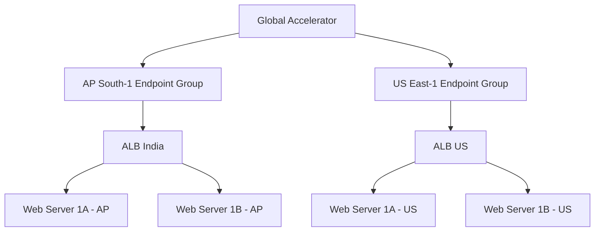

# Section 13: AWS Global Accelerator 

<details open>
<summary><b>Section 13: AWS Global Accelerator (CL-KK-Terminal)</b></summary>

## Table of Contents
1. [13.1 AWS Global Accelerator](#131-aws-global-accelerator)
2. [13.2 Introduction Of AWS Global Accelerator](#132-introduction-of-aws-global-accelerator)
3. [13.3 Key Features Of AWS Global Accelerator](#133-key-features-of-aws-global-accelerator)
4. [13.4 AWS Global Accelerator - Multi-Region EC2 Traffic Routing (Hands-On)](#134-aws-global-accelerator---multi-region-ec2-traffic-routing-hands-on)
5. [13.5 AWS Global Accelerator - Super Lab Introduction](#135-aws-global-accelerator---super-lab-introduction)
6. [13.6 AWS Global Accelerator- Super Lab Part 1](#136-aws-global-accelerator--super-lab-part-1)
7. [13.7 AWS Global Accelerator- Super Lab Part 2](#137-aws-global-accelerator--super-lab-part-2)
8. [13.8 AWS Global Accelerator- Super Lab Part 3](#138-aws-global-accelerator--super-lab-part-3)
9. [Summary](#summary)

## 13.1 AWS Global Accelerator

### Overview
This section provides an overview of AWS Global Accelerator and the learning roadmap for the topic.

### Key Concepts/Deep Dive

The instructor explains the importance of following a structured sequence in learning AWS services. The curriculum covers:
- Introduction of AWS Global Accelerator
- Key features and real-world use cases
- Comparison with CloudFront and Route 53
- Security considerations and cost analysis
- Two comprehensive labs (basic and advanced "Super Lab")

The sequence matters because infrastructure topics (like Global Accelerator) should be learned before security topics, similar to how VPC knowledge is prerequisite for understanding RDS security.

### Lab Information
Two labs are planned:
- Lab 1: Basic Global Accelerator setup
- Lab 2 (Super Lab): Multi-region web acceleration with high availability, including VPC, subnets, load balancers, and EC2 instances

The instructor emphasizes creating high-quality content and requests viewer support through subscriptions for expanded topics like Azure and GCP training.

## 13.2 Introduction Of AWS Global Accelerator

### Overview
Transcript not available for this section. The actual introduction content was not captured in the provided transcript files.

## 13.3 Key Features Of AWS Global Accelerator

### Overview
Transcript not available for this section. Key features content was not captured in the provided transcript files.

## 13.4 AWS Global Accelerator - Multi-Region EC2 Traffic Routing (Hands-On)

### Overview
Transcript not available for this section. The hands-on multi-region EC2 traffic routing lab content was not captured in the provided transcript files.

## 13.5 AWS Global Accelerator - Super Lab Introduction

### Overview
This section introduces the comprehensive Super Lab for AWS Global Accelerator, focusing on multi-region web acceleration with high availability.

### Key Concepts/Deep Dive

The Super Lab demonstrates AWS Global Accelerator in a real-world multinational scenario. Key objectives:

- Route users to the nearest web server for fastest access
- Set up web servers in two regions (India and USA) for high availability
- Handle region failures seamlessly
- Provide optimal performance for global users

### Lab Architecture

The lab spans two regions with the following components:


*Note: Diagram shows the complete lab architecture including VPCs, subnets, load balancers, EC2 instances, and Global Accelerator*

### High Availability Design

- **Multi-Region Setup**: India (Mumbai) and US East (Virginia) regions
- **Within-Region Redundancy**: Two web servers per region in different availability zones
- **Cross-Region Failover**: Global Accelerator automatically routes traffic to healthy regions if primary region fails
- **Best Practices**: EC2 instances in private subnets, ALB in public subnets for optimal security

### Prerequisites
- Willingness to perform comprehensive lab (approximately 1 hour total)
- Basic AWS knowledge (VPC, subnets, security groups already covered in series)
- Understanding that Global Accelerator is for large organizations requiring global traffic optimization

### Lab Structure
The lab is divided into three parts:
- Part 1: VPC, subnets, routing tables, Internet Gateway, NAT Gateway
- Part 2: Security groups, EC2 instances, Application Load Balancers
- Part 3: Global Accelerator setup and testing

## 13.6 AWS Global Accelerator- Super Lab Part 1

### Overview
Part 1 focuses on setting up the network infrastructure (VPC, subnets, routing, gateways) for both regions.

### Key Concepts/Deep Dive

### VPC Configuration
- **IP Address Range**: 192.168.0.0/24 series (India), 192.168.20.0/24 series (US)
- **Subnet Design**: Four subnets per region (2 public, 2 private)
- **Subnet Allocation**: Using consistent IP ranges across regions

| Region | Subnet Type | Subnet Name | CIDR Block |
|--------|-------------|-------------|------------|
| India | Public | Public Subnet 1A | 192.168.0.0/26 |
| India | Public | Public Subnet 1B | 192.168.0.64/26 |
| India | Private | Private Subnet 1A | 192.168.0.128/26 |
| India | Private | Private Subnet 1B | 192.168.0.192/26 |
| US | Public | Public Subnet 1A | 192.168.20.0/26 |
| US | Public | Public Subnet 1B | 192.168.20.64/26 |
| US | Private | Private Subnet 1A | 192.168.20.128/26 |
| US | Private | Private Subnet 1B | 192.168.20.192/26 |

### Routing Tables
- **Private Route Table**: Associated with private subnets, routes outbound traffic through NAT Gateway
- **Public Route Table**: Associated with public subnets, routes internet traffic through Internet Gateway

```diff
! Route Table Configuration:
+ Private RT: 0.0.0.0/0 → NAT Gateway
+ Public RT: 0.0.0.0/0 → Internet Gateway
```

### Gateways
- **Internet Gateway**: Attached to VPC for public subnet internet access
- **NAT Gateway**: Deployed in public subnets for private subnet outbound connectivity (critical for EC2 instance setup)

### Network Security Best Practices
✅ Use separate public/private subnets
✅ Deploy EC2 instances in private subnets for maximum security  
✅ Use NAT Gateway for outbound internet access in private subnets
✅ Never configure public IPs for private subnet instances

### Key Commands/Configurations

**VPC Creation**:
```
Name: VPC India / VPC USA
IPv4 CIDR: 192.168.0.0/24 for India
IPv4 CIDR: 192.168.20.0/24 for US
```

**Subnet Association**:
- Public subnets automatically associated with main route table initially
- Private subnets remain associated with main route table
- Create separate public route table for public subnets
- Update private route table with NAT Gateway route

> [!IMPORTANT]
> The NAT Gateway setup is critical - EC2 instances in private subnets require it to download web server packages during UserData script execution. Without NAT Gateway, instances will fail to initialize properly.

## 13.7 AWS Global Accelerator- Super Lab Part 2

### Overview
Part 2 covers security groups, EC2 instances as web servers, and Application Load Balancers for both regions.

### Key Concepts/Deep Dive

### Security Group Design

| Security Group | Purpose | Inbound Rules |
|----------------|---------|---------------|
| ALB SG | Application Load Balancer | HTTP (80) from 0.0.0.0/0 |
| Web Server SG | EC2 instances | HTTP (80) from ALB SG, SSH (22) from 0.0.0.0/0 |

> [!NOTE]
> Web servers only accept HTTP traffic from ALB and SSH for management, following least-privilege principles.

### EC2 Instance Configuration
- **AMI**: Amazon Linux 2 (latest version)
- **Instance Type**: t2.micro
- **Placement**: Private subnets (1A and 1B per region)
- **Auto-assign Public IP**: Disabled
- **UserData**: Automated web server setup script

### UserData Script Features
The provided UserData scripts automatically:
1. Install web server (Apache/Nginx)
2. Configure website content
3. Set region-specific welcome messages
4. Enable health checks at root path (/)

> [!TIP]
> UserData scripts eliminate manual server configuration. Each region uses customized scripts for different website content (India vs US versions).

### Application Load Balancer Setup
- **Type**: Application Load Balancer
- **Scheme**: Internet-facing
- **Network Mapping**: Public subnets across multiple AZs
- **Security Groups**: ALB SG only
- **Listeners**: HTTP:80
- **Target Groups**: HTTP:80 health checks on root path (/)

### Lab Verification Steps
1. **EC2 Availability**: Wait 2-3 minutes for instance status "running"
2. **Health Checks**: Verify target group healthy status
3. **Website Access**: Test ALB DNS name in browser
4. **Load Balancing**: Verify requests switch between Web Server 1 & 2

> [!WARNING]
> Unhealthy targets usually indicate:
> - NAT Gateway misconfiguration (missing default route)
> - Incorrect UserData script copy-paste
> - Security group rule errors

### High Availability Testing
Confirmed working load balancing between two EC2 instances per region using ALB DNS names.

## 13.8 AWS Global Accelerator- Super Lab Part 3

### Overview
Part 3 implements Global Accelerator and tests multi-region failover capabilities.

### Key Concepts/Deep Dive

### Global Accelerator Architecture



### Global Accelerator Configuration

**Accelerator Settings**:
- Type: Standard Accelerator
- IP Address Type: IPv4
- Name: Custom (e.g., "my-GA")

**Listener Configuration**:
- Port: 80
- Protocol: TCP
- Client Affinity: None

**Endpoint Groups**:
- One endpoint group per region (AP South-1, US East-1)
- Traffic Dial: 100% per group (no initial traffic splitting)

### Endpoint Registration
- **Endpoint Type**: Application Load Balancer
- **ARN Selection**: Choose ALBs created in Part 2
- **Health Checks**: Preserve client IP disabled
- **Weights**: Default (1.0)

### Global Traffic Routing

```diff
! Global Accelerator Routing Logic:
+ Nearest Region: Users get content from closest AWS region
+ Health-Based Routing: Automatic failover if regional endpoint unhealthy
+ Geolocation Intelligence: Based on client geographic location
```

### Testing Methodology

**Geographic Testing**:
Use geo-picker tools to simulate requests from different global locations:
- Users near India regions → Indian website content
- Users near US regions → US website content
- Automated routing based on latency proximity

**Failover Testing**:
1. Delete ALB in one region (simulates regional failure)
2. Monitor Global Accelerator endpoint health changes
3. Verify all traffic routes to remaining healthy region
4. Confirm no website downtime during failover

### Performance Results
- **Latency Optimization**: Users automatically directed to nearest region
- **Failover Time**: Sub-second failover detection
- **High Availability**: Zero-downtime regional failure handling

### Health Check Configuration
Endpoint groups monitor ALB health using:
- HTTP health checks (default)
- Configurable paths (/health, /, etc.)
- Default TCP connectivity checks

> [!IMPORTANT]  
> Ensure ALBs are healthy before endpoint group registration. Monitor health status in AWS Console for troubleshooting.

### Task Completion Requirements
To complete the superlab:
1. Create missing ALB in failed region
2. Register new ALB as endpoint in appropriate endpoint group
3. Verify traffic returns to multi-region balancing
4. Test geo-routing functionality

## Summary

### Key Takeaways
- Global Accelerator provides global traffic optimization for multinational applications
- Enables sub-second failover between regions for true high availability  
- Routes users to nearest AWS region based on geographic location and latency
- Integrates seamlessly with regional load balancers and EC2 instances

### Quick Reference

**Global Accelerator Commands**:
```
DNS Name: [auto-generated].awsglobalaccelerator.com
Global IPs: Two static IPv4 addresses for DNS configuration
```

**Regional Configuration**:
- India Region: ap-south-1 (Mumbai)
- US Region: us-east-1 (Virginia)
- Subnet CIDR: 192.168.X.0/26 ranges

**Security Groups**:
- ALB: HTTP from anywhere
- EC2: HTTP from ALB SG only

### Expert Insight

**Real-world Application**: 
Global Accelerator is ideal for global e-commerce sites, streaming services, and gaming platforms requiring consistent low-latency user experiences worldwide. It's perfect for applications serving audiences in multiple continents where regional outages cannot impact user accessibility.

**Expert Path**: 
Master Global Accelerator routing policies, health check customizations, and integration with CloudWatch for monitoring. Understand traffic dial adjustments for gradual rollouts and blue-green deployments across regions.

**Common Pitfalls**:
- ❌ Skipping NAT Gateway setup leads to UserData failures in private subnets
- ❌ Not verifying ALB health before Global Accelerator configuration
- ❌ Forgetting separate endpoint groups per region

**Lesser-Known Facts**: 
Global Accelerator operates at the edge using AWS's global network backbone, providing better performance than traditional DNS-based routing. It can handle TCP and UDP traffic, supports client IP preservation, and maintains the same two static IP addresses for the accelerator's lifetime.
</details>  

---  

🤖 Generated with [Claude Code](https://claude.com/claude-code)

Co-Authored-By: Claude <noreply@anthropic.com>
