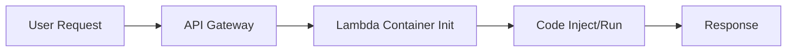
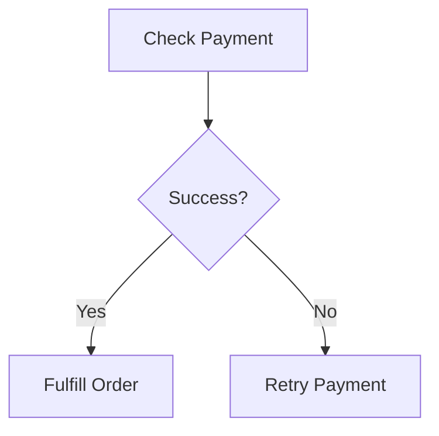

# Section 15: AWS Lambda

<details open>
<summary><b>Section 15: AWS Lambda (CL-KK-Terminal)</b></summary>

## Table of Contents
- [15.1 AWS Lambda Roadmap](#151-aws-lambda-roadmap)
- [15.2 Introduction Of AWS Lambda](#152-introduction-of-aws-lambda)
- [15.3 Serverless With Lambda](#153-serverless-with-lambda)
- [15.4 AWS Lambda Vs EC2 Instance](#154-aws-lambda-vs-ec2-instance)
- [15.5 Create Your First Lambda Function](#155-create-your-first-lambda-function)
- [15.6 Lambda Blueprints](#156-lambda-blueprints)
- [15.7 Lambda Container Images](#157-lambda-container-images)
- [15.8 Lambda Execution Role](#158-lambda-execution-role)
- [15.9 Lambda Execute & Validate EC2 Automation](#159-lambda-execute--validate-ec2-automation)
- [15.10 Lambda Trigger](#1510-lambda-trigger)
- [15.11 Introduction Of Amazon Q](#1511-introduction-of-amazon-q)
- [15.12 Amazon Q Developer](#1512-amazon-q-developer)
- [15.13 Amazon Q Vs ChatGPT](#1513-amazon-q-vs-chatgpt)
- [15.14 Lambda + Amazon Q](#1514-lambda--amazon-q)
- [15.15 AWS Lambda Execution Environment](#1515-aws-lambda-execution-environment)
- [15.16 Version Control In AWS Lambda](#1516-version-control-in-aws-lambda)
- [15.17 Aliases In AWS Lambda](#1517-aliases-in-aws-lambda)
- [15.18 Understanding AWS Lambda Concurrency](#1518-understanding-aws-lambda-concurrency)
- [15.19 Understanding Reserved Concurrency](#1519-understanding-reserved-concurrency)
- [15.20 Configure Provisioned Concurrency in Lambda](#1520-configure-provisioned-concurrency-in-lambda)
- [15.21 Lambda Layers](#1521-lambda-layers)
- [15.22 Lambda Layers Lab](#1522-lambda-layers-lab)
- [15.23 Lambda VPC Connectivity](#1523-lambda-vpc-connectivity)
- [15.24 AWS Step Functions](#1524-aws-step-functions)
- [15.25 Step Function Lab](#1525-step-function-lab)
- [15.26 AWS Step Function Type](#1526-aws-step-function-type)

## 15.1 AWS Lambda Roadmap

### Overview
This module introduces the AWS Lambda Roadmap, outlining the comprehensive series on AWS Lambda integrated with AI agents. It emphasizes practical, code-free learning for Solution Architect exam preparation and beyond basics to advanced cloud engineering concepts.

### Key Concepts
#### Module Structure
- **Module 1: AWS Lambda Basics for Solution Architect**
  - Introduction to Lambda, serverless concepts
  - EC2 vs. Lambda comparisons
  - Real-world use cases like photo watermarking on OLX (correcting "Ole" to "OLX" based on context)

- **Module 2: Building Your First Lambda Function**
  - Manual creation, runtime, IAM permissions
  - Config GUI exploration

- **Module 3: AI-Powered Development**
  - Amazon Q Developer for code generation
  - Benefits: Parameterization, testing, debugging, optimization

- **Module 4: Expanding Capabilities**
  - Lambda internals, performance optimization
  - Layers for reusability, VPC integration

- **Module 5: Workflow Automation**
  - Step Functions for multi-step processes
  - EventBridge for event-driven architecture

#### AI Integration
- **AI Agent Role**: Assists non-coders in development
- **Real-World Application**: Scalable, event-driven solutions for big companies like Netflix
- **Expert Path**: Master serverless fundamentals then advanced features

### Summary: Key Takeaways

```diff
+ Serverless computing revolutionized cloud with no server management
- Overlooked security can introduce risks in event-driven systems
! Lambda paired with AI agents enables accessible coding for beginners
```

**Quick Reference**:
- Run code without provisioning servers
- Event-driven triggers via S3, API Gateway, etc.

**Expert Insight**:
- **Real-world Application**: Event-driven photo processing in e-commerce prevents manual overhead
- **Expert Path**: Start with basics, incorporate AI tools for efficient debugging and optimization
- **Common Pitfalls**: Neglecting execution time limits (max 15 minutes); avoid underestimating cold starts

## 15.2 Introduction Of AWS Lambda

### Overview
This module explains AWS Lambda's core concept as serverless code execution without infrastructure management. It differentiates Lambda from EC2 and covers runtime support for multiple languages, using a real-world OLX photo watermarking example.

### Key Concepts
#### Definition and Benefits
- **Serverless Execution**: Run code without provisioning servers
- **Event-Driven**: Triggers via AWS services like S3, API Gateway, EventBridge, VPC

#### Run Code Anywhere
Run JavaScript, Python, Java, etc., without server provisioning.

#### OLX Example
- **Trigger**: User uploads photo to S3
- **Lambda Action**: Auto-add OLX watermark (corrected from "Ole" to "OLX" for accuracy)
- **Benefit**: Pay-as-you-go; only billed on executions, not idle time

#### Languages Supported
- Runtime includes Python, Node.js, Java, .NET, Ruby, Go

Experiment with pay-per-execution model in production.

### Code/Config Blocks
Example Lambda handler in Python:
```python
def lambda_handler(event, context):
    print("Hello from Lambda!")
    return {'statusCode': 200, 'body': 'Trigger successful'}
```

### Summary: Key Takeaways
```diff
+ Event-driven reduces operational overhead
- Ensure IAM roles for service integration
! Lambda scales automatically for high traffic
```

**Quick Reference**:
- Definition: Code execution without servers
- Triggers: S3, API Gateway, etc.

**Expert Insight**:
- **Real-world Application**: Real-time data processing in streaming platforms
- **Expert Path**: Deep dive into event patterns and custom runtimes
- **Common Pitfalls**: Underestimating VPC integration complexity; over-relying on default runtimes

## 15.3 Serverless With Lambda

### Overview
This module details serverless architecture, contrasting it with infrastructure-as-a-service (IaaS) like EC2 and managed services (PaaS) like RDS. It covers advantages, disadvantages, and Lambda's role as an event-driven serverless example.

### Key Concepts
#### Service Categories
- **IaaS (e.g., EC2)**: Manage servers, OS, scaling
- **PaaS (e.g., RDS)**: AWS manages OS/DB; still provision resources
- **Serverless (e.g., Lambda)**: AWS handles everything; no provisioning

#### Advantages
- **No Server Management**: Auto-scaling, high availability
- **Cost Efficiency**: Pay only for execution, not idle resources
- **Faster Deployment**: Direct code deployment

#### Disadvantages
- **Cold Starts**: Delay on first execution due to environment setup (100-300ms)
- **Limited Execution Time**: Max 15 minutes per invocation
- **Vendor Lock-In**: Code portability challenges
- **Less Control**: No underlying infrastructure access

Event-driven like Lambda suits short, sporadic tasks; long-running for EC2.

### Tables

| Aspect          | EC2 (IaaS)                  | Lambda (Serverless)       |
|-----------------|-----------------------------|---------------------------|
| Management     | Full control               | AWS managed              |
| Scaling        | Manual/Auto (ELB)          | Automatic                |
| Cost           | Hourly/constant            | Per execution            |
| Execution Limit| Indefinite                 | 15 minutes max           |

### Summary: Key Takeaways
```diff
+ Automatic scaling simplifies deployment
- Cold starts can impact performance
! Ideal for event-triggered tasks
```

**Quick Reference**:
- Cold start: Initial delay due to setup

**Expert Insight**:
- **Real-world Application**: API backends for mobile apps
- **Expert Path**: Optimize for cold starts via provisioned concurrency
- **Common Pitfalls**: Ignoring execution limits; forcing long-running code into Lambda

## 15.4 AWS Lambda Vs EC2 Instance

### Overview
This module compares Lambda and EC2 across 10 key factors: compute model, use cases, pricing, scaling, management, startup, networking, customizability, security, and execution time, guiding selection for long-running vs. short-lived tasks.

### Key Concepts
#### Key Differences
- **Compute Model**: IaaS (EC2) vs. Serverless (Lambda)
- **Use Cases**: Hosting/web apps (EC2); event-driven/microservices (Lambda)
- **Pricing**: Hourly for EC2; per execution for Lambda (cost-effective for sporadic tasks)
- **Scaling**: Manual for EC2; auto-instant for Lambda
- **Execution Time**: Indefinite for EC2; max 15 minutes for Lambda

Lambda offers cost savings for event-based workflows.

### Tables

| Factor             | EC2                         | Lambda                     |
|--------------------|-----------------------------|----------------------------|
| Provisioning      | Yes                        | No                        |
| Startups          | Minutes                    | Milliseconds              |
| Networking        | Full VPC control           | VPC attachable            |
| Customizability   | OS, software               | Predefined runtime        |
| Security          | User-managed patches       | AWS-managed, IAM roles    |

### Code/Config Blocks
Lambda trigger via API Gateway:
```json
{
  "statusCode": 200,
  "body": "Instance started"
}
```

### Summary: Key Takeaways
```diff
+ Lambda excels in short, event-driven tasks
- EC2 provides full infrastructure control
! Choose based on workload duration
```

**Quick Reference**:
- Lambda: Event-driven, pay-per-use
- EC2: Persistent, infrastructure-heavy

**Expert Insight**:
- **Real-world Application**: Real-time image processing
- **Expert Path**: Migrate legacy long-running processes to EC2
- **Common Pitfalls**: Misusing Lambda for >15min tasks; ignoring VPC costs

## 15.5 Create Your First Lambda Function

### Overview
This module walks through creating a first Python Lambda function in the AWS console, including runtime selection, IAM roles, and testing with console-created events. It focuses on event-driven architecture and basic handler functions.

### Key Concepts
#### Step-by-Step Creation
- **Author from Scratch**: New functions recommended
- **Runtime**: Python 3.11; x86_64 architecture
- **Execution Role**: Basic Lambda permissions for CloudWatch logging
- **Handler**: Default `lambda_handler` for event triggers

#### Event-Driven Nature
- Events trigger functions, not direct calls
- Test events simulate triggers

#### Lab Demo Steps
1. Access Lambda console
2. Create function with Python 3.11
3. Write/print code (return for response, print for logs)
4. Deploy and test with event
5. Verify CloudWatch logs

### Code/Config Blocks
Sample Python function:
```python
def lambda_handler(event, context):
    return {'key': 'Hello World'}
```

Test event:
```json
{
  "key1": "value1",
  "key2": "value2"
}
```

### Summary: Key Takeaways
```diff
+ Console simplifies initial creation
- Always deploy before testing
! Test events verify outputs
```

**Quick Reference**:
- Default handler: `lambda_handler(event, context)`

**Expert Insight**:
- **Real-world Application**: Basic API responses
- **Expert Path**: Implement custom handlers and event parsers
- **Common Pitfalls**: Forgetting to deploy changes; ignoring IAM basics

## 15.6 Lambda Blueprints

### Overview
This module introduces AWS Lambda Blueprints as pre-built templates for common use cases like DynamoDB integration or Hello World. It demonstrates creating functions from blueprints, passing parameters, and handling JSON inputs/outputs.

### Key Concepts
#### Blueprints Overview
- Ready-made code for frequent tasks (e.g., DynamoDB CRUD)
- Customize for specific needs (e.g., table names)

#### Creating from Blueprint
- Select Hello World blueprint
- Runtime auto-selected (e.g., Python)
- Pass JSON parameters in tests

#### Parameter Passing
- Test events include key-value pairs
- Function returns given keys/values

Blueprint reduces manual coding.

### Code/Config Blocks
Blueprint function example:
```python
def lambda_handler(event, context):
    key = event['key1']
    return {'value': key}
```

Test event:
```json
{
  "key1": "Cloud Folks"
}
```

### Summary: Key Takeaways
```diff
+ Blueprints accelerate development
- Customize before production use
! Useful for rapid prototyping
```

**Quick Reference**:
- Blueprints: Pre-coded functions

**Expert Insight**:
- **Real-world Application**: Quick API mockups
- **Expert Path**: Extend blueprints with custom logic
- **Common Pitfalls**: Over-relying on defaults; test parameter handling thoroughly

## 15.7 Lambda Container Images

### Overview
This module explains using container images for Lambda when runtimes aren't supported natively. It compares container image vs. OS-only runtime options, detailing benefits like full control vs. lightweight setups for unsupported languages.

### Key Concepts
#### Options for Unsupported Runtimes
- **Container Image**: Full Docker image with base OS, runtime; high control
- **OS-Only Runtime**: Base Amazon Linux; build-in runtime/custom libs

#### Differences
- **Base OS**: Customizable (Alpine, Ubuntu) vs. Fixed (Amazon Linux)
- **Runtime Inclusion**: Yes vs. Install needed
- **Use Cases**: ML models, specific Node.js versions
- **Deployment**: Requires Elastic Container Registry (ECR)

OS-only for faster, basic customizations.

### Tables

| Aspect              | Container Image             | OS-Only Runtime            |
|---------------------|-----------------------------|----------------------------|
| Control            | Full (OS, runtime)         | Runtime only              |
| Size               | Larger                     | Smaller                   |
| Setup              | Docker/dockerfile          | Manual in Lambda          |
| Languages          | Any                        | Amazon Linux supported    |

### Code/Config Blocks
Dockerfile example:
```dockerfile
FROM public.ecr.aws/lambda/python:3.9
COPY requirements.txt .
RUN pip install -r requirements.txt
COPY app.py .
CMD ["app.lambda_handler"]
```

### Summary: Key Takeaways
```diff
+ Supports any runtime flexibly
- Deployment more complex
! Ideal for advanced frameworks
```

**Quick Reference**:
- ECR for container images

**Expert Insight**:
- **Real-world Application**: Custom PyTorch models in Lambda
- **Expert Path**: Master Docker for serverless deployments
- **Common Pitfalls**: Size limits; ignore ECR pricing

## 15.8 Lambda Execution Role

### Overview
This module covers IAM execution roles for Lambda to grant permissions to AWS services like S3. It uses S3 watermarking as an example, explaining role creation, attachment, and why basic roles suffice for simple functions.

### Key Concepts
#### Why Execution Roles?
- Lambda isolated; needs IAM roles for service access
- Basic role: CloudWatch logging
- Custom roles: Specific permissions (e.g., EC2 start/stop)

#### Role Creation
- Trust policy for Lambda
- Attach policies (e.g., S3FullAccess)
- Basic Lambda policy for logging

#### Lab Demo Steps
1. Create IAM role with Lambda trust, S3 policy
2. Attach to Lambda function
3. Test; verify CloudWatch logs

### Code/Config Blocks
IAM policy example:
```json
{
  "Version": "2012-10-17",
  "Principal": {"Service": "lambda.amazonaws.com"},
  "Effect": "Allow",
  "Action": "sts:AssumeRole"
}
```

### Summary: Key Takeaways
```diff
+ Roles enable service interactions
- Basic roles limit to simple tasks
! Essential for multi-service workflows
```

**Quick Reference**:
- Basic role: Lambda basics + CloudWatch

**Expert Insight**:
- **Real-world Application**: Secure autoscaling triggers
- **Expert Path**: Implement least-privilege policies
- **Common Pitfalls**: Over-permissive roles; role recycling errors

## 15.9 Lambda Execute & Validate EC2 Automation

### Overview
This module demonstrates automated EC2 management via Lambda using Python and Boto3, including prerequisites like EC2 instances, IAM roles, VPC setup, and lab execution with CloudWatch validation.

### Key Concepts
#### Prerequisites
- EC2 instance in stopped state
- IAM role with EC2 permissions, Lambda basics

#### Boto3 Integration
- Python SDK for AWS service interactions
- `boto3.client('ec2')` to start instances

#### Lab Demo Steps
1. Create Lambda with Python, attach IAM role
2. Code to start EC2 by ID
3. Configure 10s timeout
4. Test; verify EC2 running
5. View CloudWatch logs

### Code/Config Blocks
Lambda function:
```python
import boto3

def lambda_handler(event, context):
    ec2 = boto3.client('ec2', region_name='ap-south-1')
    ec2.start_instances(InstanceIds=['i-12345678'])
    return {'status': 'Started'}
```

### Summary: Key Takeaways
```diff
+ Boto3 automates AWS operations
- Requires precise IAM permissions
! Foundation for DevOps automation
```

**Quick Reference**:
- Boto3: AWS API SDK for Python

**Expert Insight**:
- **Real-world Application**: Auto-scaling scripts
- **Expert Path**: Handle errors with retries
- **Common Pitfalls**: Region mismatches; missing instance IDs

## 15.10 Lambda Trigger

### Overview
This module explores Lambda triggers like API Gateway and EventBridge, demonstrating automatic EC2 management with manual/API triggers vs. scheduled EventBridge rules for multi-step workflows.

### Key Concepts
#### Trigger Types
- **API Gateway**: HTTP requests (e.g., web buttons)
- **EventBridge**: Scheduled/event-based rules

#### Setup Process
- Add triggers in Lambda console
- API: Open/create endpoint
- EventBridge: Cron expressions for automation

#### Lab Demo Steps
1. Attach API Gateway/EventBridge
2. Test manual API calls
3. Schedule via EventBridge (e.g., every 15min)
4. Verify auto-executions

### Code/Config Blocks
API Gateway URL example:
- POST to `https://api-id.execute-api.region.amazonaws.com/stage/` triggers Lambda

Cron for EventBridge:
```bash
*/15 * * * ? *
```

### Summary: Key Takeaways
```diff
+ Triggers enable automation
- Over-scheduling increases costs
! Integrate with multiple services
```

**Quick Reference**:
- API Gateway: HTTP endpoints
- EventBridge: Event scheduling

**Expert Insight**:
- **Real-world Application**: IoT event responses
- **Expert Path**: Complex rules with filters
- **Common Pitfalls**: Rate limits; incomplete IAM setups

## 15.11 Introduction Of Amazon Q

### Overview
This module introduces Amazon Q as an AI agent for generative assistance in AWS tasks, contrasting it with chatbots, and details capabilities for developers, DevOps, and business users.

### Key Concepts
#### AI Agent vs. Chatbot
- **Agent**: Performs AWS actions, not just advises
- **Features**: Integrated with console/IDE; learns continuously

#### Capabilities
- Code generation/troubleshooting
- AWS CLI/SDK help
- Infrastructure automation/security analysis

#### Versions for Users
- **Q Business**: Data analytics insights
- **Q Developer**: Coding/assistance (focus for cloud professionals)

Users must leverage AI for efficiency.

### Summary: Key Takeaways
```diff
+ AI agents augment productivity
- Select versions per role
! Integrated with AWS tools
```

**Quick Reference**:
- Amazon Q: AI-powered AWS assistant

**Expert Insight**:
- **Real-world Application**: Real-time code debugging
- **Expert Path**: Master natural language queries
- **Common Pitfalls**: Privacy concerns; context limits

## 15.12 Amazon Q Developer

### Overview
This module details Amazon Q Developer for coding, CLI help, and troubleshooting, comparing free vs. Pro tiers, and integration with AWS console/IDE for enhanced Lambda development.

### Key Concepts
#### Core Features
- Code suggestions/optimization for Lambda
- AI-driven IAM role recommendations
- Memory/timeout tuning

#### Tiers
- **Free**: Basic features, 50 conversations/month
- **Pro ($19/user/mo)**: Unlimited, advanced suggestions, code transformations

#### Integration
- AWS console chatbot
- IDE plugins (VS Code) for real-time help

Focus on practical use for non-programmers.

### Summary: Key Takeaways
```diff
+ Speeds up Lambda coding
- Free tier limits interactions
! Integrates seamlessly
```

**Quick Reference**:
- Pro feature: Unlimited code generation

**Expert Insight**:
- **Real-world Application**: Rapid prototyping
- **Expert Path**: Customize with enterprise data
- **Common Pitfalls**: Over-reliance; test AI suggestions

## 15.13 Amazon Q Vs ChatGPT

### Overview
This module compares Amazon Q with ChatGPT via practical troubleshooting and code generation, demonstrating Q's real-time AWS actions vs. ChatGPT's advice-only approach.

### Key Concepts
#### Comparison in Action
- **ChatGPT**: General advice; manual execution
- **Q**: Direct diagnosis (e.g., check security groups)

#### Results
- Q provides actionable, integrated insights
- Better for AWS-specific tasks

### Code/Config Blocks
Q-assisted code:
```python
import boto3

def lambda_handler(event, context):
    ec2 = boto3.client('ec2')
    response = ec2.describe_instances()
    return response
```

### Summary: Key Takeaways
```diff
+ Q excels in AWS integration
- ChatGPT lacks direct access
! Choose Q for cloud tasks
```

**Quick Reference**:
- Q: Performs AWS actions

**Expert Insight**:
- **Real-world Application**: Incident response
- **Expert Path**: Parametric queries
- **Common Pitfalls**: Ignoring tool-specific strengths

## 15.14 Lambda + Amazon Q

### Overview
This module demonstrates combining Lambda with Amazon Q for auto-suggestions, coding functions without manual work, and real-time debugging in the AWS console.

### Key Concepts
#### Integration Benefits
- Code generation on-the-fly
- Error resolution prompts

#### Lab Demo Steps
1. Enable Q in Lambda
2. Prompt for functions (e.g., start EC2)
3. Accept suggestions; deploy/test

### Code/Config Blocks
Q-generated code:
```python
def lambda_handler(event, context):
    print("EC2 started")
    return {'msg': 'Success'}
```

### Summary: Key Takeaways
```diff
+ Reduces coding effort
- Verify generated code
! Ideal for beginners
```

**Quick Reference**:
- Console Q: Tab for suggestions

**Expert Insight**:
- **Real-world Application**: Quick fixes in production
- **Expert Path**: Optimize prompts for accuracy
- **Common Pitfalls**: Blind adoption; security oversights

## 15.15 AWS Lambda Execution Environment

### Overview
This module explains Lambda's background execution, cold/warm starts, and scaling using Netflix's recommendation example, introducing containers, provisioned concurrency, and reduction strategies.

### Key Concepts
#### Execution Process
- **Containers**: Lightweight environments with CPU/memory
- **Cold Start**: 100-300ms delay for new instances
- **Warm Start**: Reuse for milliseconds response

#### Scaling
- Horizontal scaling per concurrent request
- Example: Netflix handles millions seamlessly

#### Reduction Techniques
- **Concurrency**: Pre-warm instances
- **Layers**: Cached dependencies
- **Memory Boost**: Faster starts

### Diagrams
Create images/diagram1.png for workflow:


### Summary: Key Takeaways
```diff
+ Scales for high-load apps
- Cold starts impact latencies
! Optimize for performance
```

**Quick Reference**:
- Cold start: First-run delay

**Expert Insight**:
- **Real-world Application**: Streaming services
- **Expert Path**: Monitor with CloudWatch
- **Common Pitfalls**: Ignoring concurrency limits; size balloons

## 15.16 Version Control In AWS Lambda

### Overview
This module covers Lambda versioning for rollback-safe deployments, using $LATEST for edits and published versions for stability, with aliasing for seamless code switches.

### Key Concepts
#### Version Creation
- Publish from $LATEST
- Immutable versions for rollbacks

#### Management
- Test in $LATEST; publish for production

#### Lab Demo Steps
1. Edit code
2. Publish multiple versions
3. Test versions

### Summary: Key Takeaways
```diff
+ Enables safe rollbacks
- $LATEST mutable
! Publish for stability
```

**Quick Reference**:
- Publish version: Console option

**Expert Insight**:
- **Real-world Application**: Canary deployments
- **Expert Path**: Integrate with CI/CD
- **Common Pitfalls**: Editing published versions

## 15.17 Aliases In AWS Lambda

### Overview
This module introduces aliases for Lambda to link versions without URL changes, enabling traffic splitting (e.g., 50/50), canary deployments, and seamless version switches.

### Key Concepts
#### Alias Benefits
- Point to versions/tags
- Weight for gradual rollouts

#### Lab Demo Steps
1. Create alias pointing to version
2. Attach API Gateway to alias
3. Update weights for testing

### Tables

| Version | Traffic % |
|---------|-----------|
| 1       | 50%       |
| 2       | 50%       |

### Summary: Key Takeaways
```diff
+ Simplifies deployments
- Requires version publishing
! Perfect for blue-green
```

**Quick Reference**:
- Alias: Version pointer

**Expert Insight**:
- **Real-world Application**: Feature flag rollouts
- **Expert Path**: Automate weights
- **Common Pitfalls**: Arn confusion; test splits

## 15.18 Understanding AWS Lambda Concurrency

### Overview
This module explains Lambda concurrency as simultaneous invocations, default 1000 limit, formula (req/sec * duration), and strategies for exceeding limits via account scaling or partitioned functions.

### Key Concepts
#### Calculation
- Concurrency = RPS * Duration (seconds)
- Monitor for bottlenecks

#### Limits and Solutions
- Reserve per function
- Global quota: 1000 (request increases up to 100K+)

> [!IMPORTANT]
> Exceed limits via support ticket for higher concurrency.

### Summary: Key Takeaways
```diff
+ Auto-manages scaling
- Throttles at limits
! Plan for peak loads
```

**Quick Reference**:
- Formula: RPS * Duration

**Expert Insight**:
- **Real-world Application**: Global events
- **Expert Path**: Reserve critical functions
- **Common Pitfalls**: Ignoring metrics; overuse

## 15.19 Understanding Reserved Concurrency

### Overview
This module details reserved concurrency to guarantee resources for critical Lambda functions, using an e-commerce example to protect order processing from noisy neighbor effects.

### Key Concepts
#### Setup
- Allocate fixed slots (e.g., 300/400 total)
- Prevents overload interference

#### Example
- Function A (critical): 300 reserved
- Others: 100 shared

> [!NOTE]
> 40 unreserved minimum for error prevention.

### Summary: Key Takeaways
```diff
+ Protects priority functions
- Consumes shared quota
! Configures in console
```

**Quick Reference**:
- Edit concurrency: Reserve slots

**Expert Insight**:
- **Real-world Application**: Payment gateways
- **Expert Path**: Dynamic allocations
- **Common Pitfalls**: Over-allocation; quota waste

## 15.20 Configure Provisioned Concurrency in Lambda

### Overview
This module covers provisioned concurrency for Lambda cold start elimination, setup for aliases/versions, monitoring via CloudWatch, and multi-day workflows at additional cost.

### Key Concepts
#### Benefits
- Pre-initialized containers
- Low-latency responses

#### Configuration
1. Publish version/alias
2. Set provisioned count
3. Disable for cost savings

#### Costs
- Pay per instance-minute

### Summary: Key Takeaways
```diff
+ Eliminates cold starts
- Incurs ongoing costs
! Monitor utilization
```

**Quick Reference**:
- Attach to aliases

**Expert Insight**:
- **Real-world Application**: Interactive apps
- **Expert Path**: Auto-scale via metrics
- **Common Pitfalls**: Unnecessary for low-traffic; over-provisioning

## 15.21 Lambda Layers

### Overview
This module explains Lambda layers for shared code/libraries (e.g., emoji Python lib), separating code from dependencies, enabling reuse across functions without duplicating packages.

### Key Concepts
#### Traditional vs. Layers
- **Traditional**: Zip code + libs (every function)
- **Layers**: Separate libs; attach to functions

#### Benefits
- Smaller function zips
- Faster updates
- Reusability

### Code/Config Blocks
Layer structure:
```
.
├── python/
│   ├── lib1/
│   └── lib2/
```

### Summary: Key Takeaways
```diff
+ Enables code sharing
- Requires storage management
! Builds cleaner functions
```

**Quick Reference**:
- Create layer: Zip libs; upload

**Expert Insight**:
- **Real-world Application**: Shared ML models
- **Expert Path**: Version layers
- **Common Pitfalls**: Size limits; dependency conflicts

## 15.22 Lambda Layers Lab

### Overview
This module provides a hands-on lab for creating/customizing layers using CloudShell, uploading to Lambda, and testing with emoji library, demonstrating reusability.

### Key Concepts
#### Step-by-Step Lab
1. Zip libraries
2. Create/upload layer
3. Attach to function
4. Test; reuse layer

#### Pro Tips
- Use CloudShell for cross-platform compatibility
- Dowload/upload zips

### Code/Config Blocks
Zip command:
```bash
zip -r emoji_layer.zip python/
```

### Summary: Key Takeaways
```diff
+ Practical layer creation
- Manual steps tedious
! Essential for complex apps
```

**Quick Reference**:
- Download/upload via console

**Expert Insight**:
- **Real-world Application**: Pillow for images
- **Expert Path**: Automate in CI/CD
- **Common Pitfalls**: Permission issues; test attachments

## 15.23 Lambda VPC Connectivity

### Overview
This module covers connecting Lambda to VPCs for private resource access, Eni creation, security groups, and considerations like NAT for internet egress, using subnets and groups.

### Key Concepts
#### Setup
- Attach subnets/groups in VPC settings
- Eni for networking

#### Benefits/Limits
- Access RDS/EC2 privately
- Lose default internet; add NAT if needed

### Summary: Key Takeaways
```diff
+ Connects to private resources
- Complicates networking
! Essential for data access
```

**Quick Reference**:
- Edit VPC: Select subnets/groups

**Expert Insight**:
- **Real-world Application**: Secure databases
- **Expert Path**: Firewall rules
- **Common Pitfalls**: Missing NAT; latency spikes

## 15.24 AWS Step Functions

### Overview
This module introduces Step Functions as serverless orchestration for Lambda workflows, using an e-commerce order processing example for sequences, decisions, and error handling.

### Key Concepts
#### Workflow Types
- Standard: Long-running; Express: Fast

#### Components
- States: Tasks, choices, waits
- Manage flows visually/JSON

### Diagrams
Create images/diagram2.png:


### Summary: Key Takeaways
```diff
+ Orchestrates complex flows
- Learning curve
! Visual/JSON options
```

**Quick Reference**:
- State machine: Workflow diagram

**Expert Insight**:
- **Real-world Application**: Order fulfillment
- **Expert Path**: Error retries
- **Common Pitfalls**: State complexity; debug overhead

## 15.25 Step Function Lab

### Overview
This module demonstrates a lab orchestrating Lambda functions via CloudFormation, sequencing EC2 start-ups with waits, and cleanup using functions to start AD, DB, App servers.

### Key Concepts
#### Demo Workflow
1. Setup via CloudFormation
2. Create state machine visually
3. Add Lambda tasks/waits
4. Execute; monitor

#### Cleanup
- Delete state machine/step function stack

### Summary: Key Takeaways
```diff
+ Automates sequences
- Setup-intensive
! CloudFormation simplifies
```

**Quick Reference**:
- CloudFormation: Quick start

**Expert Insight**:
- **Real-world Application**: ETL pipelines
- **Expert Path**: Parallel states
- **Common Pitfalls**: State timeouts; resource limits

## 15.26 AWS Step Function Type

### Overview
This module compares Standard vs. Express Step Functions: pricing, duration limits, concurrency, history, and use cases for long/complex or short/simple workflows.

### Key Concepts
#### Standard
- 1 year duration; higher cost; detailed history

#### Express
- 5min max; cheaper; basic trace

#### Selection
- Standard: Complex/long; Express: Fast/async

### Tables

| Feature       | Standard     | Express      |
|---------------|--------------|--------------|
| Max Duration  | 1 Year      | 5 Min       |
| Concurrency   | 2000/s      | 100,000/s   |
| History       | 90 Days     | CloudWatch   |
| Cost          | Per Transition| Per Req      |

### Summary: Key Takeaways
```diff
+ Choose per duration/cost
- Express lacks history
! Optimize for use case
```

**Quick Reference**:
- Standard: Historical flows

**Expert Insight**:
- **Real-world Application**: Batch jobs
- **Expert Path**: Mix types per step
- **Common Pitfalls**: Wrong type; cost overruns

## Summary

```diff
+ Lambda enables serverless, event-driven computing with AI assistance
- Cold starts, execution limits demand optimization strategies
! Master concurrency, layers, VPC for production-ready apps
! Integrate Step Functions for workflow orchestration
```

**Quick Reference**:
- Concurrency: RPS * Duration
- Layers: Zip libraries; attach to functions
- Cold start: Provisioned concurrency mitigates

**Expert Insight**:
- **Real-world Application**: Together, these enable autoscaling, secure APIs, orchestrated pipelines like Netflix recommendations
- **Expert Path**: Start basics, progress to multi-region serverless architectures with monitoring
- **Common Pitfalls**: Ignoring VPC costs/security groups; over-relying on blueprints; neglecting alias/version rollbacks

</details>
