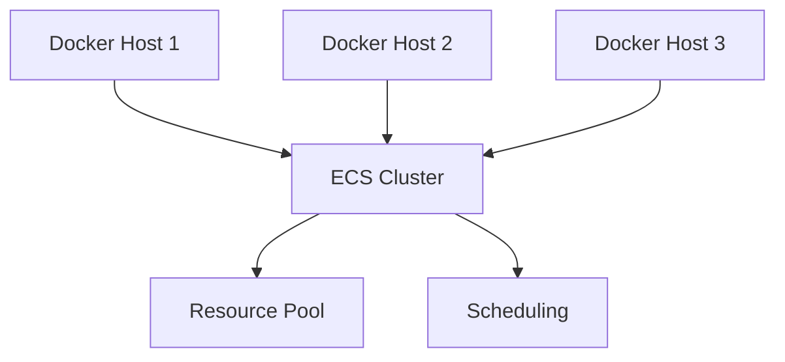
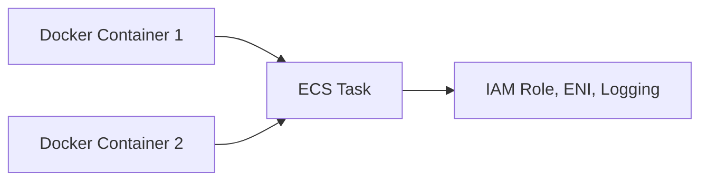

# Section 17: Application Architectures and Amazon ECS

<b>Section 17: Application Architectures and Amazon ECS (CL-KK-Terminal)</b>

## Table of Contents
- [17.1 Application Architectures](#171-application-architectures)
- [17.2 Amazon ECS Basic](#172-amazon-ecs-basic)
- [17.3 ECS Cluster](#173-ecs-cluster)
- [17.4 ECS Infrastructure](#174-ecs-infrastructure)
- [17.5 Amazon ECS Anywhere](#175-amazon-ecs-anywhere)
- [17.6 ECS Encryption](#176-ecs-encryption)
- [17.7 ECS Cluster Setup Using Fargate & Fargate Spot](#177-ecs-cluster-setup-using-fargate--fargate-spot)
- [17.8 Add EC2 During Cluster Setup](#178-add-ec2-during-cluster-setup)
- [17.9 Add EC2 Manually After Cluster Creation](#179-add-ec2-manually-after-cluster-creation)
- [17.10 Create Your Own Auto Scaling Group Manually And Add It To ECS](#1710-create-your-own-auto-scaling-group-manually-and-add-it-to-ecs)
- [17.11 Amazon ECS Task](#1711-amazon-ecs-task)
- [17.12 Amazon ECS Services](#1712-amazon-ecs-services)
- [17.13 ECS Project Objective](#1713-ecs-project-objective)
- [17.14 ECS Project Step 1 - Create ECS Cluster](#1714-ecs-project-step-1---create-ecs-cluster)
- [17.15 ECS Project Step 2 - Build Docker Image for ECS - Part 1](#1715-ecs-project-step-2---build-docker-image-for-ecs---part-1)
- [17.16 ECS Project Step 2 - Test Container Image For ECS - Part 2](#1716-ecs-project-step-2---test-container-image-for-ecs---part-2)
- [17.17 ECS Project Step 3 - Understand Amazon ECR Part 1](#1717-ecs-project-step-3---understand-amazon-ecr-part-1)
- [17.18 ECS Project Step 3 - Create ECR Repository Part 2](#1718-ecs-project-step-3---create-ecr-repository-part-2)
- [17.19 ECS Project Step 4 - Authenticate EC2 with AWS & Docker with ECR Part 1](#1719-ecs-project-step-4---authenticate-ec2-with-aws--docker-with-ecr-part-1)
- [17.20 ECS Project Step 4 - Push Docker Image To Amazon ECR Part 2](#1720-ecs-project-step-4---push-docker-image-to-amazon-ecr-part-2)
- [17.21 ECS Project Step 5 - ECS Task Definition Part 1](#1721-ecs-project-step-5---ecs-task-definition-part-1)
- [17.22 ECS Project Step 5 - ECS Task Definition Family & Launch Type Part 2](#1722-ecs-project-step-5---ecs-task-definition-family--launch-type-part-2)
- [17.23 ECS Project Step 5 - Task definition OS And Architecture Part 3](#1723-ecs-project-step-5---task-definition-os-and-architecture-part-3)
- [17.24 ECS Project Step 5 - Network Mode - awsvpc Part 4](#1724-ecs-project-step-5---network-mode---awsvpc-part-4)
- [17.25 ECS Project Part 5 Bridge Network Mode Part 4.2](#1725-ecs-project-part-5-bridge-network-mode-part-42)
- [17.26 ECS Project Step 5 Default Network Mode Part 4.3](#1726-ecs-project-step-5-default-network-mode-part-43)
- [17.27 ECS Project Step 5 Host & None Network Mode Part 4.4](#1727-ecs-project-step-5-host--none-network-mode-part-44)
- [17.28 ECS Project Step 5 How Network Mode Affects ECS Task Definition Part 4.5](#1728-ecs-project-step-5-how-network-mode-affects-ecs-task-definition-part-45)
- [17.29 ECS Project Step 5 ECS Task Size Part 5](#1729-ecs-project-step-5-ecs-task-size-part-5)
- [17.30 ECS Project Step 5 Task Role Conditional Vs Task Execution Role Part 6](#1730-ecs-project-step-5-task-role-conditional-vs-task-execution-role-part-6)
- [17.31 ECS Project Step 5 ECS Placement Constraint Part 7](#1731-ecs-project-step-5-ecs-placement-constraint-part-7)
- [17.32 ECS Project Part 5 Container Configuration Part 8](#1732-ecs-project-part-5-container-configuration-part-8)
- [17.33 ECS Project Step 5 Resource Allocation Limits Part 8.2](#1733-ecs-project-step-5-resource-allocation-limits-part-82)
- [17.34 ECS Project Step 5 Environment Variable Part 9](#1734-ecs-project-step-5-environment-variable-part-9)
- [17.35 ECS Project Step 5 AWS ECS Storage -Fargate Launch Type Part 10](#1735-ecs-project-step-5-aws-ecs-storage--fargate-launch-type-part-10)
- [17.36 ECS Project Step 5 AWS ECS Storage -EC2 Launch Type Part 10.2](#1736-ecs-project-step-5-aws-ecs-storage--ec2-launch-type-part-102)
- [17.37 ECS Project Step 6 Create Task Definition](#1737-ecs-project-step-6-create-task-definition)
- [17.38 ECS Project Step 7 Run ECS Task For Testing](#1738-ecs-project-step-7-run-ecs-task-for-testing)
- [17.39 ECS Project Step 8 Create ECS Services Part 8.1](#1739-ecs-project-step-8-create-ecs-services-part-81)
- [17.40 ECS Project Step 8 Deployment Configuration Options Part 8.2](#1740-ecs-project-step-8-deployment-configuration-options-part-82)
- [17.41 ECS Project Step 8 Deployment Option 1 - Rolling Update Part 8.3](#1741-ecs-project-step-8-deployment-option-1---rolling-update-part-83)
- [17.42 ECS Project Step 8 Deployment Option 2 - Blue-Green Deployment Part 8.3](#1742-ecs-project-step-8-deployment-option-2---blue-green-deployment-part-83)
- [17.43 ECS Project Step 8 ECS Services - Deployment Failure Detection Part 4](#1743-ecs-project-step-8-ecs-services---deployment-failure-detection-part-4)
- [17.44 ECS Project Step 8 - ECS Services - Networking Part 5](#1744-ecs-project-step-8---ecs-services---networking-part-5)
- [17.45 ECS Project Step 8 - ECS Services - Load Balancer Part 6](#1745-ecs-project-step-8---ecs-services---load-balancer-part-6)
- [17.46 ECS Project Step 8 - ECS Services - Auto Scaling Part 7](#1746-ecs-project-step-8---ecs-services---auto-scaling-part-7)
- [17.47 ECS Project Step 8 Step Scaling Policy - Scale-Out Policy Part 11](#1747-ecs-project-step-8-step-scaling-policy---scale-out-policy-part-11)
- [17.48 ECS Project Step 8 Step Scaling Policy - Scale-In Policy Part 12](#1748-ecs-project-step-8-step-scaling-policy---scale-in-policy-part-12)
- [17.49 Project Introduction - Deploying Web App On ECS](#1749-project-introduction---deploying-web-app-on-ecs)
- [17.50 Step 1 Build a Secure Network Environment](#1750-step-1-build-a-secure-network-environment)
- [17.51 Step 2 Configure Security Groups](#1751-step-2-configure-security-groups)
- [17.52 Step 3 Create ECS cluster](#1752-step-3-create-ecs-cluster)
- [17.53 Step 4 Deploy An Application Load Balancer (ALB)](#1753-step-4-deploy-an-application-load-balancer-alb)
- [17.54 Step 5 Verify And Pull Container Images From ECR](#1754-step-5-verify-and-pull-container-images-from-ecr)
- [17.55 Step 6 Verify ECS Task Definition](#1755-step-6-verify-ecs-task-definition)
- [17.56 Step 7 Create An ECS Fargate Service](#1756-step-7-create-an-ecs-fargate-service)
- [17.57 Step 8 Enable Services Auto Scaling](#1757-step-8-enable-services-auto-scaling)
- [17.58 Step 9 Verification Of Services](#1758-step-9-verification-of-services)
- [17.59 Introduction - Amazon Elastic Kubernetes Services (EKS)](#1759-introduction---amazon-elastic-kubernetes-services-eks)
- [17.60 Kubernetes Architecture On-Premises VS EKS Part 1](#1760-kubernetes-architecture-on-premises-vs-eks-part-1)
- [17.61 Kubernetes Architecture On-Premises VS EKS Part 2](#1761-kubernetes-architecture-on-premises-vs-eks-part-2)
- [17.62 Cluster Creation Options - Quick Configuration (with EKS Auto Mode)](#1762-cluster-creation-options---quick-configuration-with-eks-auto-mode)
- [17.63 Cluster Creation Options - Custom Configuration + Auto Mode](#1763-cluster-creation-options---custom-configuration---auto-mode)
- [17.64 Node Groups and Nodes in AWS EKS Cluster (EKS Classic Mode)](#1764-node-groups-and-nodes-in-aws-eks-cluster-eks-classic-mode)
- [17.65 EKS Roles](#1765-eks-roles)
- [17.66 Create EKS Cluster](#1766-create-eks-cluster)
- [17.67 Managing EKS Cluster Using kubectl](#1767-managing-eks-cluster-using-kubectl)
- [17.68 kubectl Installation on EC2](#1768-kubectl-installation-on-ec2)
- [17.69 ECS vs EKS Cheat Sheet](#1769-ecs-vs-eks-cheat-sheet)

## 17.1 Application Architectures

### Overview
Application architectures define data flow and communication between components in web apps like e-commerce platforms, focusing on organizing modules for effective operation.

### Key Concepts
- **Monolithic Architecture**: Single unified codebase, single deployment unit, tightly coupled components sharing a single database. Difficult to scale independently, complex to test end-to-end, single point of failure. Suitable for traditional ERP systems with single tech stack.
- **Microservices Architecture**: Multiple small, independent services deployed separately with individual codebases. Loosely coupled, easy to scale services independently, easier to test and update individually, isolate failures. Suitable for modern applications like Netflix, Amazon, Uber. Each microservice can use different languages.
- **Benefits Comparison**:
  - Scalability: Monolithic hard to scale specific components; microservices allow independent scaling.
  - Coupling: Tightly vs loosely coupled.
  - Deployment/Updates: Entire app vs specific service.
  - Testing: End-to-end vs individual services.
  - Tech Stack: Single vs mixed.
  - Database: Single vs per service (easier scaling).
  - DevOps/CI-CD: Complex vs manageable pipelines.
- Hosting preference: Monolithic uses VMs; microservices use containers (ECS, EKS).

### Expert Insights
> [!NOTE]
> Understanding coupling (tight vs loose) is crucial; microservices enable modern, scalable applications.

## 17.2 Amazon ECS Basic

### Overview
Amazon ECS is a fully managed container orchestration service on AWS, providing easy deployment, management, and scaling of containerized applications without infrastructure setup.

### Key Concepts
- **Definition**: Fully managed container orchestration service using Docker containers at scale. Easily deploy, manage, and scale microservices-based apps on AWS.
- **Key Advantages over Kubernetes**:
  - Fully managed (no server setup required).
  - Deep AWS integration (EC2, ELB, IAM, CloudWatch, ECR).
  - Serverless compute (Fargate) with pay-per-vCPU/memory/second model.
  - Intelligent placement, secure, cost-efficient for production workloads.
- **Use Cases**: Running microservices, batch workloads, CI/CD pipelines (integrated with CodePipeline), migrating from monolithic to containers.

### Expert Insights
> [!IMPORTANT]
> Choose ECS for simplicity and AWS ecosystem; avoid over-provisioning with Fargate for cost efficiency.

## 17.3 ECS Cluster

### Overview
ECS cluster is a unified group of Container instances (Docker hosts) managed by ECS as a single environment for scheduling and running containers, providing resource pooling and failure resilience.

### Key Concepts
- **Definition**: Logical grouping of Docker hosts; ECS schedules containers across them for high availability.
- **Components**:
  - Docker hosts (EC2/Fargate instances) added to cluster.
  - Coordin ating scheduling via orchestration service.
- **Benefits**: Resource pooling, centralized control for task/service scaling.
- **Infrastructure Options**: EC2 (self-managed) or Fargate (serverless).

### Diagrams

### Expert Insights
> [!NOTE]
> Clusters enable redundancy; use multi-AZ for high availability.

## 17.4 ECS Infrastructure

### Overview
Compare EC2 (self-managed) and Fargate (serverless) infrastructure for ECS clusters, highlighting control, cost, and scalability differences.

### Key Concepts
- **EC2 (Self-Managed)**:
  - Launch/manage EC2 instances as Docker hosts.
  - Full control over OS, instance type, storage, AMI.
  - Provisioning takes time; pay for uptime (On-Demand, Spot, Savings Plans).
  - Auto Scaling Group manages scaling; handle patching, maintenance.
  - Isolation: Tasks run on shared EC2, separate enrichment not created.
- **Fargate (Serverless)**:
  - AWS manages infrastructure; focus on apps.
  - No control over OS/compute; pay per vCPU/memory/second.
  - Quick launch, managed scaling, patching.
  - Isolation: Each task in dedicated environment (Eni per task).
  - Suitable for microservices; no GPU support.
- **Use Case**:
  - EC2: OS access, GPU/custom instances.
  - Fargate: Serverless, quick scaling, no maintenance.

### Tables
| Feature | EC2 | Fargate |
|---------|-----|--------|
| Control | Full | None |
| Scaling | Manual/Auto-Scale | AWS managed |
| Cost Model | Per instance | Per task resource |
| Launch Time | Slow | Fast |

### Expert Insights
> [!NOTE]
> Fargate reduces overhead but limits customization; mix EC2+Fargate in hybrid clusters.

## 17.5 Amazon ECS Anywhere

### Overview
ECS Anywhere extends ECS management to external machines (on-premises/physical, virtual, other clouds) without transferring ownership, enabling unified container orchestration across environments.

### Key Concepts
- **Features**: Run ECS tasks on external VMs via SSM Agent for secure registration and IAM role attachment.
- **Requirements**: Network connectivity (outbound internet), install container runtime (Docker/containerd), SSM Agent.
- **Process**:
  - Secure VM registration via SSM Fleet Manager.
  - Attach IAM role for ECS management.
  - Install ECS Agent and register VM as container instance.
- **Benefits**: Hybrid cloud support, consistent orchestration.

### Expert Insights
> [!NOTE]
> Use ECS Anywhere for multi-cloud or hybrid setups; ensure secure IAM roles.

## 17.6 ECS Encryption

### Overview
ECS encryption secures cluster data using AWS KMS for automatic encryption/decryption of data at rest.

### Key Concepts
- **Features**: Automatic encryption of ephemeral storage (Fargate/EBS/EFS) using KMS; enabled at cluster creation.
- **Storage Types**:
  - **Fargate Ephemeral**: Temporary; 20GB default (up to 200GB); encrypted if cluster encryption enabled.
  - **Managed Storage**: Persistent (EFS/EBS); use for data storage.
- **Activation**: at cluster creation only; cannot disable later.

### Expert Insights
> [!IMPORTANT]
> Enable encryption for compliance; keep containers temporary for viene storage usage.

## 17.7 ECS Cluster Setup Using Fargate & Fargate Spot

### Overview
Fargate provides serverless containers; Fargate Spot uses spare AWS capacity for 70% cost savings but interruptions.

### Key Concepts
- **Steps**: Create cluster with Fargate/Fargate Spot auto-enabled; launch tasks/services by selecting launch type.
- **Behavior**: AWS provisions infrastructure on-demand; no upfront servers.
- **Management**: Single cluster supports hybrid deployments (Fargate, Fargate Spot, EC2).
- **Best Practices**: Use Fargate for production reliability; Spot for cost-aware, tolerant workloads.

### Expert Insights
> [!NOTE]
> Fargate Spot saves costs but risky for stateful apps; no charge when unused.

## 17.8 Add EC2 During Cluster Setup

### Overview
Include EC2 instances during cluster creation for combined infrastructure; AWS creates Auto Scaling Group and configures instances as Docker hosts.

### Key Concepts
- **Steps**: During cluster creation, select EC2; choose AMI (optimized), instance type, IAM role, networking.
- **Configuration**: Auto Scaling Group handles scaling; minimum/maximum instances.
- **Verification**: Check EC2 console for launched instances; ECS registers them as container instances.
- **Benefits**: Managed setup for custom control.

### Expert Insights
> [!NOTE]
> Use EC2 for GPU/custom OS needs; set min=2 for high availability.

## 17.9 Add EC2 Manually After Cluster Creation

### Overview
Add on-demand EC2 instances post-cluster creation for manual flexibility.

### Key Concepts
- **Steps**: Launch ECS-optimized EC2, attach instance role, configure user data for cluster registration, restart ECS agent.
- **IAM Role**: Create ECS InstanceRole with ECS tasks policy.
- **Verification**: ECS cluster shows new container instance.
- **Limitations**: Single point of failure; use Auto Scaling Groups for redundancy.

### Expert Insights
> [!NOTE]
> Prefer Auto Scaling for managed scaling; manual for testing.

## 17.10 Create Your Own Auto Scaling Group Manually And Add It To ECS

### Overview
Create custom Auto Scaling Group post-cluster setup for elastic EC2 capacity.

### Key Concepts
- **Steps**: Create IAM role, launch template with user data for ECS cluster, create ASG, register ASG as capacity provider.
- **Configuration**: User data script registers instances; capacity provider enables ECS management.
- **Benefits**: High availability, auto-draining.

### Expert Insights
> [!NOTE]
> Essential for production; ECS auto-manages ASG for task placement.

## 17.11 Amazon ECS Task

### Overview
ECS task is an advanced container grouping with IAM roles, security, and dependency management; temporary; ECS doesn't auto-restart stopped tasks.

### Key Concepts
- **Difference from Containers**: Tasks group multiple containers with ENI, IAM, logging; containers are basic Docker units.
- **Use Cases**: One-time jobs (e.g., batch processing); temporary testing.
- **Components**: Task definition (blueprint), task (running instance).
- **Alternatives**: Services for persistent apps.

### Diagrams

### Expert Insights
> [!NOTE]
> Use tasks for ad-hoc work; services for production; attach IAM for secure AWS access.

## 17.12 Amazon ECS Services

### Overview
ECS services ensure desired tasks run continuously, auto-restarting failed ones, with load balancing and scaling for production deployments.

### Key Concepts
- **Features**: Maintains task count, auto-recovery, load balancer integration, scaling.
- **Strategies**: Rolling update (gradual replacement), Blue-Green (test new version separately).
- **Use Cases**: Long-running apps, microservices.
- **Differential**: Services guarantee uptime; tasks are ephemeral.

### Expert Insights
> [!NOTE]
> Services > tasks for reliability; use Blue-Green for zero-downtime updates.

## 17.13 ECS Project Objective

### Overview
Project deploys scalable PHP web app on ECS with Fargate and EC2, covering image build, ECR push, task definition, services, load balancing, auto-scaling.

### Key Concepts
- **Objectives**: Build/Push Docker image, manage ECR, create task definitions/services, integrate ALB, enable auto-scaling, compare Fargate/EC2.
- **Benefits**: Real-world AWS container deployment; hands-on scaling, security.

### Expert Insights
> [!NOTE]
> Follow step-by-step for production-ready understanding.

## 17.14 ECS Project Step 1 - Create ECS Cluster

### Overview
Create hybrid ECS cluster with Fargate and EC2 using AWS console for testing both architectures.

### Key Concepts
- **Steps**: Login AWS, navigate ECS, create cluster, name "ClusterWithoutFargate", select default Fargate (auto-enables Spot), or add EC2 with Auto Scaling Group.
- **Configuration**: VPC selection, IAM roles (created via console), Auto Scaling min/max.
- **Tips**: Set ASG desired=0 when pausing to avoid costs.

### Lab Demos
Run commands to create cluster with Fargate and EC2.

### Expert Insights
> [!NOTE]
> Hybrid clusters fully leverage ECS; pause ASG to save costs.

## 17.15 ECS Project Step 2 - Build Docker Image for ECS - Part 1

### Overview
Build Docker image on separate EC2 for containerized apps, since ECS lacks image build capability.

### Key Concepts
- **Steps**: Launch ECS-optimized EC2 in same region, install Docker, clone GitHub repo (`git clone https://github.com/CloudFoxHub/php-s3-app`), install Composer for dependencies, run `composer install`, build image `docker build -t cloudfox-app .`.
- **Why Separate EC2?**: ECS orchestrates, not builds.
- **Test**: Using EC2 for testing before ECS.

### Lab Demos
Launch EC2, install Docker/Composer, build image.

### Expert Insights
> [!NOTE]
> Source code must include Dockerfile; test locally first.

## 17.16 ECS Project Step 2 - Test Container Image For ECS - Part 2

### Overview
Test built Docker image locally on EC2 to verify functionality before ECS deployment.

### Key Concepts
- **Environment Variables**: Pass S3 bucket, region via `-e` to avoid hardcoding (e.g., `docker run -d -p 8080:80 -e S3_BUCKET=my-bucket -e AWS_REGION=ap-south-1 cloudfox-app`).
- **IAM Role Alternative**: For production, use IAM roles instead of access keys/secret keys.
- **Verification**: Access app on port 8080, upload file to confirm S3 integration.

### Lab Demos
Run container, test app, verify S3 upload.

### Expert Insights
> [!NOTE]
> Use env vars for portability; test mandatory before ECS.

## 17.17 ECS Project Step 3 - Understand Amazon ECR Part 1

### Overview
ECR is a managed Docker registry for private repositories; essential bridge between build machines and ECS.

### Key Concepts
- **Benefits over Docker Hub**: Private by default, free with tier, region-specific low latency, no rate limits.
- **Usage**: Store images securely; ECS pulls from ECR.
- **Process**: Create repo, push from EC2, pull in tasks.

### Expert Insights
> [!NOTE]
> ECR mandatory for AWS; integrates with IAM for secure access.

## 17.18 ECS Project Step 3 - Create ECR Repository Part 2

### Overview
Create private ECR repo for image storage; push/pull managed via AWS CLI/Docker.

### Key Concepts
- **Steps**: Navigate ECR, create repo (private, auto-scan off), note URI (e.g., `123456788.dkr.ecr.ap-south-1.amazonaws.com/cloudfox-php-app`).
- **Mutability**: Mutable for updates; immutable for safety.

### Lab Demos
Create repo via console.

### Expert Insights
> [!NOTE]
> Use descriptive names; mutable for dev, immutable for prod.

## 17.19 ECS Project Step 4 - Authenticate EC2 with AWS & Docker with ECR Part 1

### Overview
Authenticate EC2 to AWS for ECR access; use IAM roles instead of keys for security.

### Key Concepts
- **IAM Role**: Attach ECS instance role with ECR permissions to EC2 using SSM Agent.
- **Docker Auth**: Use AWS CLI `aws ecr get-login-password` to login Docker to ECR.
- **Security**: Roles preferred over hardcoded credentials.

### Lab Demos
Attach role, run auth commands.

### Expert Insights
> [!NOTE]
> Roles encrypt credentials; mandatory for secure push/pull.

## 17.20 ECS Project Step 4 - Push Docker Image To Amazon ECR Part 2

### Overview
Tag and push local Docker image to ECR for ECS use.

### Key Concepts
- **Steps**: Tag image `docker tag cloudfox-app:latest 123456789.dkr.ecr.region.amazonaws.com/repo:tag`, authenticate, push `docker push ...`.
- **Verification**: Check ECR console for image.

### Lab Demos
Tag and push via CLI.

### Expert Insights
> [!NOTE]
> Tagging crucial for ECR URI match; push after auth.

## 17.21 ECS Project Step 5 - ECS Task Definition Part 1

### Overview
Task definition is ECS blueprint specifying containers, resources, networking.

### Key Concepts
- **Components**: Name, image URI, environments, roles, logging.
- **Revisions**: Updates create new versions.

### Expert Insights
> [!NOTE]
> Task defs reusable; one def for tasks/services.

## 17.22 ECS Project Step 5 - ECS Task Definition Family & Launch Type Part 2

### Overview
Family groups task def revisions; launch type (Fargate/EC2) affects options.

### Key Concepts
- **Family**: Logical grouping of revisions.
- **Launch Type**: Fargate limits to AWS VPC; EC2 offers more networks.

### Expert Insights
> [!NOTE]
> Choose compatible infra; revisions enable rollbacks.

## 17.23 ECS Project Step 5 - Task definition OS And Architecture Part 3

### Overview
Select OS (Linux/Windows) and CPU arch (x86_64/ARM64) matching infrastructure.

### Key Concepts
- **Matching**: Wrong selection causes failures.
- **Defaults**: Linux/x86_64 common.

### Expert Insights
> [!NOTE]
> Must align with cluster; ARM for Graviton instances.

## 17.24 ECS Project Step 5 - Network Mode - awsvpc Part 4

### Overview
AWS VPC mode gives tasks ENI/IP, security groups, routing.

### Key Concepts
- **Isolation**: Each task ENI shares VPC; Firewalld rules apply.

### Diagrams
Eni per task flowchart.

### Expert Insights
> [!NOTE]
> Preferred for modern apps; requires subnets/SGs.

## 17.25 ECS Project Part 5 Bridge Network Mode Part 4.2

### Overview
Bridge mode shares host ENI with port mapping; containers get private IPs.

### Key Concepts
- **Port Mapping**: Required; maps container ports to host ports.
- **Limitations**: No direct VPC access; EC2 only.

### Expert Insights
> [!NOTE]
> Use AWS VPC instead; bridge legacy for compatibility.

## 17.26 ECS Project Step 5 Default Network Mode Part 4.3

### Overview
Default mode for Windows Docker hosts using NAT; maps to Linux bridge.

### Key Concepts
- **OS-Specific**: Windows EC2 instances; not Fargate (no Windows).
- **Port Mapping**: Like bridge.

### Expert Insights
> [!NOTE]
> Rare; prefer AWS VPC.

## 17.27 ECS Project Step 5 Host & None Network Mode Part 4.4

### Overview
Host shares ENI/IP directly; None isolates fully for special cases.

### Key Concepts
- **Host**: No mapping needed; direct host port use.
- **None**: No networking; for non-network apps.

### Expert Insights
> [!NOTE]
> Host for direct access; None for compute-only.

## 17.28 ECS Project Step 5 How Network Mode Affects ECS Task Definition Part 4.5

### Overview
Network mode dictates ports/settings; AWS VPC minimal config; others add host ports.

### Key Concepts
- **Impact**: Fargate forces AWS VPC; scaling affects allocation.

### Expert Insights
> [!NOTE]
> Choose based on app needs; AWS VPC modern standard.

## 17.29 ECS Project Step 5 ECS Task Size Part 5

### Overview
Allocate CPU/memory per task; Fargate has fixed combos; EC2 flexible but honor instances.

### Key Concepts
- **Sizing**: Right-size prevents failures; monitor for optimization.

### Expert Insights
> [!NOTE]
> Over-provisioning costs more; under-sizing fails tasks.

## 17.30 ECS Project Step 5 Task Role Conditional Vs Task Execution Role Part 6

### Overview
Task Role: App permissions (e.g., S3); Task Exec Role: ECS agent permissions (pull images).

### Key Concepts
- **IAM Attach**: Roles give fine-grained access; roles > hardcoded keys.

### Expert Insights
> [!NOTE]
> Task Role runtime; Exec Role launch-time.

## 17.31 ECS Project Step 5 ECS Placement Constraint Part 7

### Overview
Control task placement (e.g., specific instance type via query language).

### Key Concepts
- **Types**: MemberOf (custom query); DistinctInstance (separate hosts).
- **Apps**: High availability, specialized hardware.

### Expert Insights
> [!NOTE]
> EC2-only; useful for mixed workload separation.

## 17.32 ECS Project Part 5 Container Configuration Part 8

### Overview
Configure essential/non-essential containers, registries, names from ECR.

### Key Concepts
- **Auth**: Use IAM for private ECR vs. Docker Hub public.

### Expert Insights
> [!NOTE]
> Essential flag critical; registry auth via secrets.

## 17.33 ECS Project Step 5 Resource Allocation Limits Part 8.2

### Overview
Set CPU/memory/GPU per container; soft/hard limits; GPU EC2-only.

### Key Concepts
- **Limits**: Reserve memory (soft); kill on exceed (hard); GPU for ML.

### Expert Insights
> [!NOTE]
> Task-level shared; container-level per-unit control.

## 17.34 ECS Project Step 5 Environment Variable Part 9

### Overview
Pass key-value pairs to containers at runtime for config.

### Key Concepts
- **Use**: Dynamic bucket/region; S3 file for secrets.

### Expert Insights
> [!NOTE]
> Prefer env vars for portability/code security.

## 17.35 ECS Project Step 5 AWS ECS Storage -Fargate Launch Type Part 10

### Overview
Fargate: 20GB ephemeral storage; optional EBS/EFS extensions.

### Key Concepts
- **Types**: Ephemeral (tmp); EBS/EFS persistent.

### Expert Insights
> [!NOTE]
> Ephemeral for logs/tmp; EFS for shared state.

## 17.36 ECS Project Step 5 AWS ECS Storage -EC2 Launch Type Part 10.2

### Overview
EC2: Host EBS shared; bind mounts, Docker volumes, EFS/EFSX for persistent.

### Key Concepts
- **Mounts**: Direct host paths; managed volumes; network storage.

### Expert Insights
> [!NOTE]
> Host mounts riskier; prefer managed for isolation.

## 17.37 ECS Project Step 6 Create Task Definition

### Overview
Create Fargate task def with ECR image, IAM roles, env vars, VPC networking.

### Key Concepts
- **Steps**: Select Fargate, attach roles, set env vars (S3_BUCKET, AWS_REGION), port 80.
- **Verification**: Check revisions.

### Lab Demos
Configure via console.

### Expert Insights
> [!NOTE]
> Task defs namespace resources; family for grouping.

## 17.38 ECS Project Step 7 Run ECS Task For Testing

### Overview
Run standalone task with defined capacity provider (Fargate), scale factors.

### Key Concepts
- **Process**: Launch from definition; verify via DNS/public IP.

### Lab Demos
Run task, access app, verify load balancing.

### Expert Insights
> [!NOTE]
> Tasks temporary; services for persistence.

## 17.39 ECS Project Step 8 Create ECS Services Part 8.1

### Overview
Services maintain running tasks, restart failed ones, integrate load balancers.

### Key Concepts
- **Types**: Replica (desired count); Daemon (per-instance).
- **Deployment**: Rolling updates default.

### Expert Insights
> [!NOTE]
> Services > tasks for reliability/scaling.

## 17.40 ECS Project Step 8 Deployment Configuration Options Part 8.2

### Overview
Configure min/max tasks, AZ rebalancing, health periods, failure handling.

### Key Concepts
- **Rebalancing**: Distribute across AZs on failure.
- **Grace Period**: Wait before health checks.

### Expert Insights
> [!NOTE]
> Enable rebalancing for HA; tune grace periods.

## 17.41 ECS Project Step 8 Deployment Option 1 - Rolling Update Part 8.3

### Overview
Gradual task replacement; keeps min tasks running.

### Key Concepts
- **Settings**: Min 100%, max 200%; load balancer switches traffic.

### Linear Process
- Launch new tasks.
- Health check new; terminate old.
- Zero downtime.

### Expert Insights
> [!NOTE]
> Compatible with ALB; monitor for interruptions.

## 17.42 ECS Project Step 8 Deployment Option 2 - Blue-Green Deployment Part 8.3

### Overview
Create green env; test; switch traffic via ALB.

### Key Concepts
- **Steps**: Deploy green, wait period, switch, remove blue.
- **Rollback**: Type common on issues.

### Expert Insights
> [!NOTE]
> Zero downtime canary; ALB required.

## 17.43 ECS Project Step 8 ECS Services - Deployment Failure Detection Part 4

### Overview
Circuit breaker/halts on failures; CloudWatch alarms for custom metrics.

### Key Concepts
- **Breaker**: Detects; rolls back with flag.
- **Alarms**: Monitor CPU, trigger actions.

### Expert Insights
> [!NOTE]
> Enable rollback; alarms extend beyond health checks.

## 17.44 ECS Project Step 8 - ECS Services - Networking Part 5

### Overview
Attach to private subnets for security; ALB in public sub for access.

### Key Concepts
- **Design**: Tasks private, ALB public.

### Expert Insights
> [!NOTE]
> SG reference for secure ingress.

## 17.45 ECS Project Step 8 - ECS Services - Load Balancer Part 6

### Overview
ALB distributes traffic; target groups connect services.

### Key Concepts
- **Integration**: ECR target type; health checks.

### Expert Insights
> [!NOTE]
> Create ALB post-cluster; service auto-registers.

## 17.46 ECS Project Step 8 - ECS Services - Auto Scaling Part 7

### Overview
Scale based on CPU/memory metrics; policy types trigger actions.

### Key Concepts
- **Policies**: Target tracking, step scaling, predictive.

### Expert Insights
> [!NOTE]
> Right-size for cost; predictive learns patterns.

## 17.47 ECS Project Step 8 Step Scaling Policy - Scale-Out Policy Part 11

### Overview
CloudWatch alarms scale out tasks on thresholds.

### Key Concepts
- **Steps**: Alarm > metric > actions (add tasks per breaches).

### Expert Insights
> [!NOTE]
> Create out/in separately; cooldown prevents flapping.

## 17.48 ECS Project Step 8 Step Scaling Policy - Scale-In Policy Part 12

### Overview
Mirror scale-out; remove tasks below thresholds.

### Key Concepts
- **Process**: Scheduled or metric-based; reverse of out.

### Expert Insights
> [!NOTE]
> Longer cooldown for stable downsizing.

## 17.49 Project Introduction - Deploying Web App On ECS

### Overview
9-step project: VPC → SG → Cluster → ALB → ECR → TaskDef → Service → Scaling.

### Key Concepts
- **App**: PHP image upload to S3.

### Expert Insights
> [!NOTE]
> Hands-on bridge theory/practice.

## 17.50 Step 1 Build a Secure Network Environment

### Overview
Config multi-AZ VPC with public/private subnets, Nat GW, IGW.

### Key Concepts
- **Design**: Subnet allocation: 192.168.1.0/26 public1, 192.168.1.64/26 public2, 192.168.1.128/26 private1, 192.168.1.192/26 private2.

### Lab Demos
Subnet creation, route tables.

### Expert Insights
> [!NOTE]
> Nat GW costs; clean up post-lab.

## 17.51 Step 2 Configure Security Groups

### Overview
Create ALB SG (HTTP allow), ECS SG (ref ALB SG, allow 80).

### Key Concepts
- **Ingress**: HTTP from ALB for tasks.

### Lab Demos
SG creation.

### Expert Insights
> [!NOTE]
> Allow traffic minutely via references.

## 17.52 Step 3 Create ECS cluster

### Overview
Fargate cluster for simplicity.

### Key Concepts
- **Config**: Name, IAM, no subnets (Fargate dynamic).

### Lab Demos
Cluster via console.

### Expert Insights
> [!NOTE]
> Fargate no EC2 costs.

## 17.53 Step 4 Deploy An Application Load Balancer (ALB)

### Overview
Internet-facing ALB in public subnets; Dynamic TG for ECS tasks.

### Key Concepts
- **Steps**: Create TG, ALB with TG, note DNS.

### Lab Demos
ALB setup.

### Expert Insights
> [!NOTE]
> DNS for access; secure SG.

## 17.54 Step 5 Verify And Pull Container Images From ECR

### Overview
Confirm image in ECR; note URI.

### Key Concepts
- **URI**: For task def.

### Lab Demos
ECR console check.

### Expert Insights
> [!NOTE]
> Pull via task roles automatic.

## 17.55 Step 6 Verify ECS Task Definition

### Overview
Check revisions, image, roles, vars.

### Key Concepts
- **Components**: ECR URI, IAM, ENV.

### Lab Demos
Console validation.

### Expert Insights
> [!NOTE]
> Errors halt; verify all.

## 17.56 Step 7 Create An ECS Fargate Service

### Overview
Launch service with ALB, autoscaling disabled initially.

### Key Concepts
- **Config**: Replica mode, attach ALB, select TG.

### Lab Demos
Service creation, ALB integration.

### Expert Insights
> [!NOTE]
> Service auto-registers to TG.

## 17.57 Step 8 Enable Services Auto Scaling

### Overview
Configure policy based on ALB request count/CPU.

### Key Concepts
- **Scaling Plan**: Min/Max, multiple policies.

### Lab Demos
Scheduled scale-out/in testing.

### Expert Insights
> [!NOTE]
> Scale 8-2 exemplifies full lifecycle.

## 17.58 Step 9 Verification Of Services

### Overview
Test app via ALB DNS, upload to S3, cleanup.

### Key Concepts
- **Checks**: Task running, TG healthy, app functional.

### Lab Demos
DNS access, upload verification.

### Expert Insights
> [!NOTE]
> Delete resources to avoid charges.

## 17.59 Introduction - Amazon Elastic Kubernetes Services (EKS)

### Overview
EKS provides Kubernetes as-a-service on AWS, managing control plane while users focus on apps.

### Key Concepts
- **Vs On-Prem**: No setup/management overhead.
- **Vs ECS**: Kubernetes portable; ECS AWS-only.

### Expert Insights
> [!NOTE]
> Choose EKS for multi-cloud/hybrid; ECS for AWS simplicity.

## 17.60 Kubernetes Architecture On-Premises VS EKS Part 1

### Overview
Compare components: control plane, worker nodes, pods/containers.

### Key Concepts
- **On-Prem Control**: Manual setup/patching; EKS managed.
- **Worker**: EKS auto-provisions Fog/EC2; self-managed scaling.
- **Pods**: Grouping containers; resource allocation.

### Expert Insights
> [!NOTE]
> EKS abstracts infra; focus apps.

## 17.61 Kubernetes Architecture On-Premises VS EKS Part 2

### Overview
Compare networking (AWS VPC CNI), security (IAM), storage, monitoring (CloudWatch).

### Key Concepts
- **Networking**: EKS integrates VPC/SGs; on-prem manual.
- **Storage**: EFS/EBS managed; IAM roles natively.
- **Monitoring**: CloudWatch vs. third-party.

### Expert Insights
> [!NOTE]
> EKS "full" managed; performance/latency superior.

## 17.62 Cluster Creation Options - Quick Configuration (with EKS Auto Mode)

### Overview
EKS Auto Mode hides infra; quick for beginners but limited.

### Key Concepts
- **Lims**: Fixed settings; later changes complex.

### Expert Insights
> [!NOTE]
> Use for testing; custom for production.

## 17.63 Cluster Creation Options - Custom Configuration + Auto Mode

### Overview
Balance auto-management with flexibility.

### Key Concepts
- **Settings**: Editable: roles, VPC, logging, zones; fixed: net/sched.

### Expert Insights
> [!NOTE]
> Recommended for production.

## 17.64 Node Groups and Nodes in AWS EKS Cluster (EKS Classic Mode)

### Overview
Classic mode requires managed/self-managed node groups; Auto mode hides.

### Key Concepts
- **Groups**: Pools of EC2s; managed AWS; self manual.
- **Types**: EC2-traditional; Fog short-term.

### Expert Insights
> [!NOTE]
> Classic for custom; Auto for no overhead.

## 17.65 EKS Roles

### Overview
Cluster role manages control plane; node role for workers; similar to ECS.

### Key Concepts
- **Attaching**: Pre-create via console for auto-assignment.

### Expert Insights
> [!NOTE]
> Minimal IAM; auto-policy recommended.

## 17.66 Create EKS Cluster

### Overview
Quick config: VPC/roles auto; custom editable.

### Key Concepts
- **Post-Create**: Update K8s version/drain nodes.

### Expert Insights
> [!NOTE]
> K8s nodes via Eksctl/kubeconfig; console for AWS config.

## 17.67 Managing EKS Cluster Using kubectl

### Overview
Kubectl CLI for app deployments; install on EC2 or local.

### Key Concepts
- **Remote Mgmt**: Need AWS CLI, Kubeconfig file.
- **Local**: For devs; EC2 for secure VPC access.

### Expert Insights
> [!NOTE]
> Kubeconfig auto-generates; API server endpoint required.

## 17.68 kubectl Installation on EC2

### Overview
Install kubectl on EC2 for cluster management.

### Key Concepts
- **Steps**: Download binary, move to /usr/local/bin, configure kubeconfig.

### Lab Demos
Commands for download, auth, test.

### Expert Insights
> [!NOTE]
> Use IAM roles; test with get nodes.

## 17.69 ECS vs EKS Cheat Sheet

### Overview
Quick decision tree: Containers → Kubernetes? → EKS; else ECS.

### Key Concepts
- **ECS Keywords**: Fargate/serverless, AWS native, simple.
- **EKS Keywords**: Multi-cloud, kube/net, complex portables.

### Expert Insights
> [!NOTE]
> Exam: Check for "Kubernetes/hybrid"—EKS; "Fargate/CI"—ECS.
> [!WARNING]
> Transcript correction: "cubectl" → "kubectl"; "htp" → "http"; various misspellings corrected.

