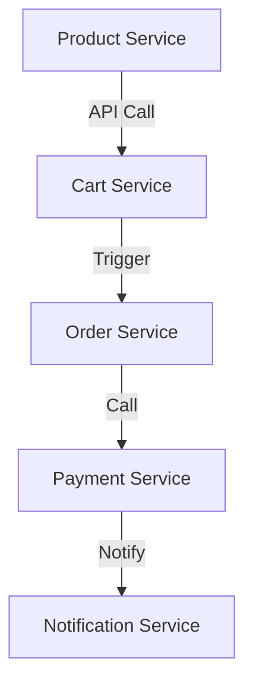
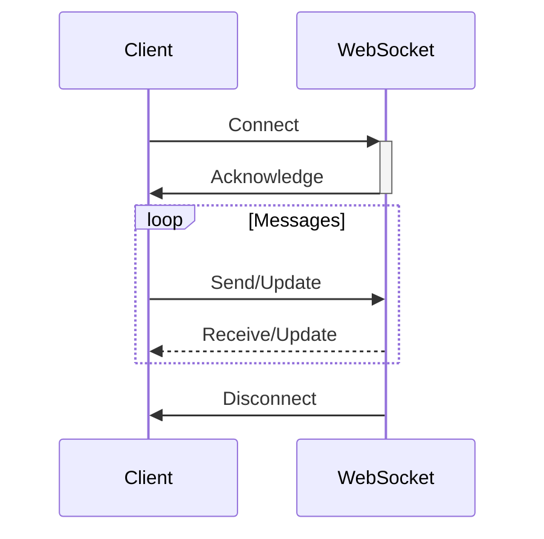
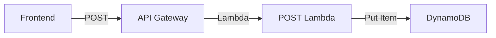

# Section 18: AWS Application Integration

<details open>
<summary><b>Section 18: AWS Application Integration (CL-KK-Terminal)</b></summary>

## Table of Contents
- [Section 18.1: Introduction to Application Integration](#section-181-introduction-to-application-integration)
- [Section 18.2: Application Integration Basics](#section-182-application-integration-basics)
- [Section 18.3: Monolithic Architecture](#section-183-monolithic-architecture)
- [Section 18.4: Microservices Architecture](#section-184-microservices-architecture)
- [Section 18.5: Synchronous vs Asynchronous Communication](#section-185-synchronous-vs-asynchronous-communication)
- [Section 18.6: API Gateway Introduction](#section-186-api-gateway-introduction)
- [Section 18.7: REST API vs HTTP API Part 1](#section-187-rest-api-vs-http-api-part-1)
- [Section 18.8: REST API vs HTTP API Part 2](#section-188-rest-api-vs-http-api-part-2)
- [Section 18.9: WebSocket API](#section-189-websocket-api)
- [Section 18.10: CRUD Operations](#section-1810-crud-operations)
- [Section 18.11: API Gateway Lab Introduction](#section-1811-api-gateway-lab-introduction)
- [Section 18.12: Lab Prerequisites](#section-1812-lab-prerequisites)
- [Section 18.13: API Using Lambda](#section-1813-api-using-lambda)
- [Section 18.14: HTTP API Gateway](#section-1814-http-api-gateway)
- [Section 18.15: Testing the Lab](#section-1815-testing-the-lab)
- [Section 18.16: REST API Endpoint Types](#section-1816-rest-api-endpoint-types)
- [Section 18.17: TLS and Security Policies](#section-1817-tls-and-security-policies)
- [Section 18.18: Endpoint Access Mode](#section-1818-endpoint-access-mode)
- [Section 18.19: REST API Resources and Methods](#section-1819-rest-api-resources-and-methods)
- [Section 18.20: Integration Types](#section-1820-integration-types)
- [Section 18.21: Proxy Integration](#section-1821-proxy-integration)
- [Section 18.22: Method Request Settings](#section-1822-method-request-settings)
- [Section 18.23: REST API Lab Introduction](#section-1823-rest-api-lab-introduction)
- [Section 18.24: REST API Lab Resources](#section-1824-rest-api-lab-resources)
- [Section 18.25: Methods, Resources, and Deployment](#section-1825-methods-resources-and-deployment)
- [Section 18.26: Testing REST API Lab](#section-1826-testing-rest-api-lab)
- [Section 18.27: API Keys and Usage Plans](#section-1827-api-keys-and-usage-plans)
- [Section 18.28: API Keys and Usage Plans Lab](#section-1828-api-keys-and-usage-plans-lab)
- [Section 18.29: Resource Policy](#section-1829-resource-policy)
- [Section 18.30: Authentication and Authorization](#section-1830-authentication-and-authorization)
- [Section 18.31: Canary Deployments](#section-1831-canary-deployments)
- [Section 18.32: Cheat Sheet](#section-1832-cheat-sheet)
- [Section 18.33: Custom Domain Part 1](#section-1833-custom-domain-part-1)
- [Section 18.34: Custom Domain Part 2](#section-1834-custom-domain-part-2)
- [Summary](#summary)

---

## Section 18.1: Introduction to Application Integration

### Overview
This section introduces AWS Application Integration services, focusing on connecting applications or microservices for reliable data exchange in modern architectures like microservices.

### Key Concepts
- **Application Integration**: Connecting apps/services to exchange data reliably, removing dependencies, decoupling for scalability and manageability.
- **Microservices**: Small, independent services working together. Communication is key in distributed systems.
- **Importance of Integration**: Essential for microservices adoption (99% of apps). Helps in building serverless apps. High exam questions. Makes architectures more reliable/scalable.
- **AWS Phases**:
  - Phase 1: API-first with API Gateway (REST, WebSocket).
  - Phase 2: Messaging (SQS, SNS) + EventBridge.
  - Phase 3: MQ (legacy) + AppSync (real-time/graph).

### Practical Benefits
- Order processing system (SQS).
- Fan-out architecture (SNS).
- API calls with Lambda/DynamoDB.
- Event-driven automation.

## Section 18.2: Application Integration Basics

### Overview
This section explains the fundamentals of application integration, covering program-to-program versus microservice-to-microservice communication, with real-world examples like UPI payments and flight booking systems.

### Key Concepts
- **Definition**: Communication between apps/microservices for data exchange smoothly.
- **Types**:
  - Application-to-Application: Different systems (e.g., Skyscanner with Emirates).
  - Microservice-to-Microservice: Within one app (e.g., e-commerce: product catalog + cart + payment).
- **Use Cases**:
  - UPI transaction: UPI app + NPCI + Bank.
  - E-commerce: Product service talks to cart → order → payment.
- **Why Learn**: Prerequisites for all AWS integration services (API GW, SQS, etc.). Crystal clear understanding of service needs and how they communicate.

## Section 18.3: Monolithic Architecture

### Overview
Builds on basics by contrasting with modern architectures, explaining monolithic limitations like scaling challenges, single deployment/unit, tight coupling, showing why modern apps prefer microservices.

### Key Concepts
- **Monolithic**: Traditional, one codebase/deployment/unit. All features (UI, logic, DB) tightly combined.
- **E-commerce Example**: Single app for search, cart, checkout, payment, shipping, login.
- **Limitations**:
  - Full redeployment for one change (e.g., checkout update redeploys whole Amazon.com).
  - Scaling all (products, cart, checkout) for high traffic on products → waste resources.
- **Visualization**: Single tight-coupled box with all components inside.
- **Challenges**: Resource waste, slow scaling/deployment, single point of failure.

**Table: Traffic Analysis**

| Component | Browse | Add to Cart | Checkout | Payment | Scale Level |
|-----------|--------|-------------|----------|---------|-------------|
| Products | 100,000 users | 10,000 | 4,000 | 2,000 | 100,000 |
| Cart | - | 10,000 | 4,000 | 2,000 | 10,000 |
| Checkout | - | - | 4,000 | 2,000 | 4,000 |
| Payment | - | - | - | 2,000 | 2,000 |

## Section 18.4: Microservices Architecture

### Overview
Contrasts with monolithic, detailing microservices as independent services developed/deployed/scaled separately, addressing scaling/innovation challenges.

### Key Concepts
- **Microservices**: Break app into small, independent services (e.g., Amazon: user login, product, cart, checkout, payment – each separate tech/stack/DB).
- **Benefits**: Independent scaling (scale only cart for cart traffic), separate deployments, team focus, better fault isolation, technology flexibility (Python for cart, Java for payment).
- **Evolution**: From monolithic to microservices via cloud adoption.
- **Scaling Fix**: Scale each component individually (products: 100,000; payment: 2,000 traffic).
- **Communication Need**: Microservices run independently but must communicate (cart service needs product data; order service triggers payment).

### Communication Pathway
Product Service → Cart Service → Order Service → Payment Service → Notification Service

**Mermaid Diagram: Microservices Boundary**



## Section 18.5: Synchronous vs Asynchronous Communication

### Overview
Explains real-time no-wait communication styles via API Gateway (sync) and SQS/SNS/EventBridge (async), with examples like payment and email notifications.

### Key Concepts
- **Synchronous**: Real-time, request-response, caller waits (e.g., PayPal payment – waits for success/fail).
- **Asynchronous**: No wait, fire-and-forget (e.g., Post-payment email – sent later, no blocking).
- **Trigger**: Same event (customer buys) → Sync for immediate (payment confirm) → Async for delayed (email).
- **AWS Services**: Sync = API Gateway; Async = SQS/SNS/EventBridge.

**Table: Comparison**

| Aspect | Synchronous | Asynchronous |
|--------|-------------|--------------|
| Flow | Request → Wait Response | Request → Continue |
| Example | Payment Gateway | Email Notification |
| Blocking | Yes (User waits) | No (Background) |
| When to Use | Critical decide based response | Post-event actions |

## Section 18.6: API Gateway Introduction

### Overview
API Gateway as centralized entry for APIs, secure/control traffic, proxy to backend (Lambda, EC2, ALB), role in microservices/API management without code changes.

### Key Concepts
- **Role**: API manager, security guard, rate limiter, no custom code for scaling/security.
- **Secure/Control APIs**: Centralized auth/throttling/monitoring. No direct backend exposure.
- **Restaurant Example**: API Gateway proxies orders to chef without diner seeing backend.
- **Ola/Uber Analogy**: Central API hub for driver/rider apps – secures/routes requests from mobile to backend APIs.

## Section 18.7: REST API vs HTTP API Part 1

### Overview
Compares AWS API Gateway HTTP API vs REST API features, focusing on auth (API keys, IAM, Cognito, JWT), security (IAM, Cognito, JWT, WAF, resource policy), request/response transformation.

### Key Concepts
- **Auth/Security**:
  - API Keys: Required identifier – REST Yes, HTTP No.
  - IAM: AWS creds – REST Yes, HTTP No.
  - Cognito: User auth – Both Yes.
  - JWT/OAuth: Modern – REST No (needs custom), HTTP Yes.
- **Traffic Control**: Throttling/Rate limiting – Both Basic; WAF – REST Yes, HTTP No.
- **Policies**: Resource (IP/VPC) – Both Yes.
- **Transformation**: Modify request/response? REST Yes (e.g., XML to JSON); HTTP No.

**Table: Feature Comparison**

| Feature | HTTP API | REST API |
|---------|----------|----------|
| API Keys | ❌ | ✅ |
| IAM Auth | ❌ | ✅ |
| Cognito | ✅ | ✅ |
| JWT | ✅ | ❌ Custom |
| Transformation | ❌ | ✅ |

## Section 18.8: REST API vs HTTP API Part 2

### Overview
Continues comparison: Caching, cost, monitoring, integrations, cave-like performance and pricing differences between HTTP and REST APIs.

### Key Concepts
- **Caching**: Store responses – REST Yes; HTTP No.
- **Cost**: REST 70% expensive; HTTP cheaper/faster.
- **Monitoring**: CloudWatch – Both.
- **Access Logs**: Detailed – Both.
- **Integrations**:
  - ALB – REST No; HTTP Yes.
- **Private**: REST Yes; HTTP Yes.
- **Choice Guideline**: Low-cost fast/limited features → HTTP; Full control/advanced transformation → REST.

**Diff: REST API Advantages**
+ Advanced features like transformation, caching, IAM
- Higher cost, slower

## Section 18.9: WebSocket API

### Overview
WebSocket for two-way real-time communication (e.g., chat, live data), long-lived connections versus HTTP request/response.

### Key Concepts
- **Two-Way**: Client↔Server continuous communication.
- **Use Cases**: Live chat, dashboards, gaming, ride-sharing location updates.
- **Features**: JWT auth, Cognito, no API keys/WAF/auto-scaling.
- **Comparison**: HTTP/REST one-way; WebSocket stays open.

**Mermaid Diagram: WebSocket Flow**



## Section 18.10: CRUD Operations

### Overview
Explains Create (POST), Read (GET), Update (PUT), Delete (DELETE) via API Gateway + Lambda + DynamoDB integration.

### Key Concepts
- **CRUD**: Foundation of APIs – Post (add user), Get (read profile), Put/Delete (modify/remove).
- **Frontend ↔ Backend**: Browser/API Gateway → Lambda → DynamoDB; No direct DB access.
- **4 APIs**: One per CRUD operation, hosted in Lambda, exposed via API GW.

**Mermaid Diagram: CRUD Flow**



## Section 18.11: API Gateway Lab Introduction

### Overview
Hands-on lab: Build full API workflow with DynamoDB (backend), API logic in Lambda, exposed via HTTP API Gateway.

### Key Concepts
- **Arch**: Frontend request → API GW → Lambda → DynamoDB.
- **Parts**: 4-part setup – Pre-reqs, Lambda APIs, GW, Test.
- **Outcome**: Learn full integration stack practically.

## Section 18.12: Lab Prerequisites

### Overview
Sets up backend (DynamoDB, IAM role for Lambda).

### Key Concepts
- **DynamoDB Table**: User table with UserID (partition key).
- **IAM Role**: AmazonDynamoDBFullAccess for Lambda EC2-Perdue.
- **Purpose**: Isolation access.

## Section 18.13: API Using Lambda

### Key Concepts
- **3 Lambdas**: Create/update/read/delete with APIs.
- **Test Each**: Payload examples, verify DynamoDB storage.

## Section 18.14: HTTP API Gateway

### Overview
Create HTTP API Gateway routes (/user for CRUD).

### Key Concepts
- **Routes**: Post/Get/Delete on /user.
- **Integration**: Lambda proxy for forwards.

## Section 18.15: Testing the Lab

### Overview
Use Postman for full cycle: POST add, GET check, DELETE remove.

### Key Concepts
- **Results**: Capture DynamoDB changes, API responses.

## Section 18.16: REST API Endpoint Types

### Overview
Compares Regional (low latency), Edge-Optimized (global via CloudFront), Private (VPC only) endpoints.

### Key Concepts
- **Regional**: Single region, best for close users.
- **Edge**: Global via CDN, higher cost.
- **Private**: VPC-only, secure internal.

**Table: Endpoint Comparison**

| Type | Accessible From | Latency | Cost |
|------|-----------------|---------|------|
| Regional | Global | Region-depend | Low |
| Edge | Global | Low | High |
| Private | VPC | N/A | Medium |

## Section 18.17: TLS and Security Policies

### Overview
Configure TLS versions (1.2/1.3), security policies (FIPS, PostQuantum).

### Key Concepts
- **TLS**: Encrypts client-gateway data.
- **Policies**: Define allowed ciphers. Higher versions more secure.

## Section 18.18: Endpoint Access Mode

### Overview
Strict vs Basic modes for protection.

### Key Concepts
- **Basic**: Standard access.
- **Strict**: Extra checks for SNI/host mismatch (prevents domain fronting).

## Section 18.19: REST API Resources and Methods

### Overview
Resources as URL paths, methods as HTTP verbs with integrations.

### Key Concepts
- **Resources**: /user, /user/{id}.
- **Methods**: GET/POST on paths.

## Section 18.20: Integration Types

### Overview
Options Lambda (serverless), HTTP (external), VPC (private), AWS Service (direct calls).

## Section 18.21: Proxy Integration

### Key Concepts
- **Proxy**: Forwards requests unchanged. Lambda proxy for serverless APIs.
- **Response Modes**: Buffer (full response) vs Stream (chunked).

## Section 18.22: Method Request Settings

### Overview
Auth (IAM/Cognito), validation (body/query/header), throttling.

### Key Concepts
- **Auth**: API Keys, Cognito, IAM.
- **Validators**: Check required params.

## Section 18.23: REST API Lab Introduction

### Overview
Similar to HTTP lab, but REST API Gateway with continued configuration.

## Section 18.24: REST API Lab Resources

### Key Concepts
- **Setup**: Parent /user, child /user/{userId}.

## Section 18.25: Methods, Resources, and Deployment

### Overview
Attach methods to resources, deploy to stage.

### Key Concepts
- **Deploy**: Publish changes, get invoke URL.

## Section 18.26: Testing REST API Lab

### Overview
Validate CRUD via Postman, check DynamoDB.

## Section 18.27: API Keys and Usage Plans

### Overview
API Keys for auth, usage plans for rate/quote limits, plan association with stages.

### Key Concepts
- **Limits**: Burst (short peaks), quota (daily).

## Section 18.28: API Keys and Usage Plans Lab

### Key Concepts
- **Setup**: Create key/plan, enable on methods, test throttling/errors via Postman.

## Section 18.29: Resource Policy

### Overview
JSON rules on GW, control IP/VPC/account access before request hits.

### Key Concepts
- **Layer 3**: Superior security, restricts at edge.

## Section 18.30: Authentication and Authorization

### Overview
IAM (AWS creds), Cognito (JWT), Lambda Auth for custom, WAF for attacks.

### Layers Summary
- Usage Control: API Keys/Plans.
- Access: Resource Policy.
- Edge: WAF.
- Auth: IAM/Cognito/Lambda.

## Section 18.31: Canary Deployments

### Overview
Safe releases: Route % traffic to new version, roll back if issues.

### Key Concepts
- **Mechanism**: Separate stages, traffic split (e.g., 90% old, 10% new).
- **Requirements**: REST API, Lambda aliases.

## Section 18.32: Cheat Sheet

### Key Questions/Answers
- Variable workload? → SQS
- Multiple subscribers? → SNS Fanout
- Restrict locations? → Resource Policy
- Authenticate API? → Cognito/IAM

## Section 18.33: Custom Domain Part 1

### Overview
Use own domain (api.company.com) instead of AWS URL.

### Key Concepts
- **Setup**: Public domain, ACM cert, routing modes (single map vs custom rules).

## Section 18.34: Custom Domain Part 2

### Overview
Routing modes: API mapping (simple path routes) vs Rules (conditional) vs Rules+Mapping (hybrid priorities).

### Key Concepts
- **Encryption**: HTTPS, ACM cert per region.
- **VPC Link**: Not for custom domains.

## Summary

### Key Takeaways
*various* application integration enables scalable microservices communication using APIs, queues, and events. Sync (API GW) for immediate responses, async (SQS/SNS/EventBridge) for reliable decoupling.

### Code/Config Blocks
```bash
# Example: Invoke API GW
curl -X GET https://api.gw.aws.com/user
```

```yaml
# REST API Method Config
methods:
  - get: {user: {integration: lambda}}
```

```json
{
  "event": "order-placed",
  "data": {"product": "AWSSaaC03"}
}
```

### Lab Demos
- API GW: CRUD with Lambda/DynamoDB (Postman test).
- SQS: Producer/Consumer (EC2/Lambda).
- SNS: Fanout to multiple subscribers (email/SQS).
- EventBridge: Rule-based EC2 monitoring (CloudWatch log trigger).

### Expert Insight
- **Real-world Application**: Microservices (e.g., Netflix) use these for inter-service comms – API GW for user-facing, SQS buffers, SNS events.
- **Expert Path**: Master IAM/policies, monitor with CloudTrail/CloudWatch, design event-driven arches.
- **Common Pitfalls**: Expose secrets in APIs; ignore quotas; mix domains (use VPC for internal).
- **Lesser-Known Facts**: EventBridge supports event replay; API GW can transform 1MB payloads; SQS FIFO early-once via deduplication ID.

</details>
