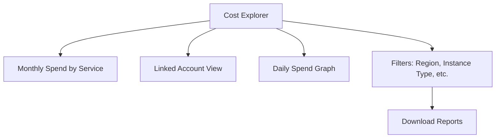
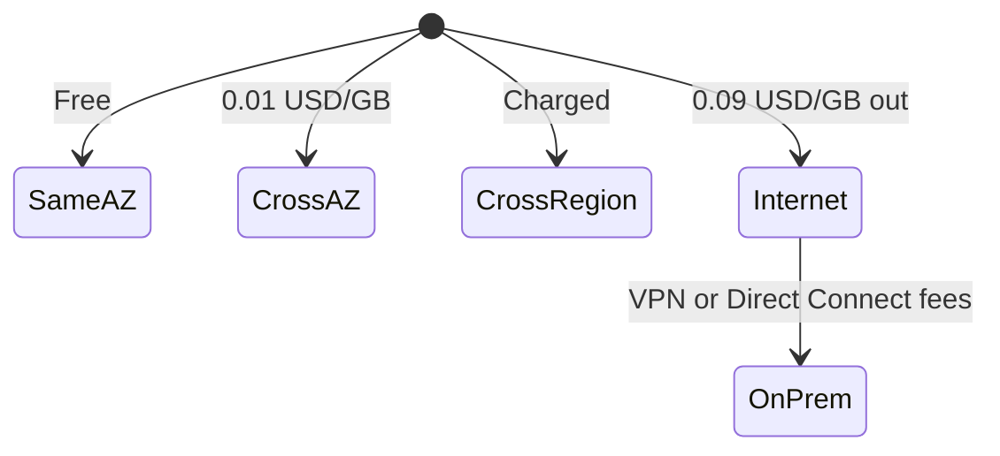

# Section 21: Billing & Cost Management 

<details open>
<summary><b>Section 21: Billing & Cost Management (CL-KK-Terminal)</b></summary>

## Table of Contents

- [21.1 Billing & Cost Part-1](#211-billing--cost-part-1)
- [21.2 Billing & Cost Part-2](#212-billing--cost-part-2)
- [21.3 Billing & Cost Part-3](#213-billing--cost-part-3)
- [Summary](#summary)

## 21.1 Billing & Cost Part-1

### Overview

This section introduces AWS Billing and Cost Management, emphasizing its role in estimating, planning, and monitoring AWS costs. It covers tools like Cost Explorer for visualizing expenditure and AWS Budgets for setting spending limits and receiving alerts, ensuring users can track and control their AWS spending effectively.

### Key Concepts/Deep Dive

AWS Billing and Cost Management is a console service that provides comprehensive tools to manage and optimize cloud costs. Key features include:

- **Cost Estimation and Planning**: Users can estimate future costs and set budgets to avoid overspending.
- **Alert Mechanisms**: Receive notifications when costs exceed predefined thresholds, promoting proactive cost management.
- **Resource Assessment**: Analyze spending across services and accounts to identify cost-saving opportunities.

The **Cost Explorer** is a free tool within the Billing console that offers graphical representations of cost data. Users can view historical spending (up to six months) and forecasts for monthly costs. Pre-configured reports include monthly spend by service, linked accounts, and daily spend views.

Key functionalities:
- **Filtering Options**: Filter graphs by region, instance type, API operations, availability zones, AWS services, custom tags, EC2 instance types, purchase options, and regions.
- **Downloadable Reports**: Export cost reports for offline analysis.
- **Forecasting**: Predicts future costs based on historical data, though it may not display without sufficient spending history.




**AWS Budgets** complement Cost Explorer by tracking usage against budgets and sending SNS notifications for overages. Budget reports can be configured for daily, weekly, or monthly intervals and emailed.

Example budget setup:
- Set a budget limit (e.g., $3).
- Monitor actual vs. forecasted spend.
- Receive alerts when thresholds are nearing or exceeded.

> [!NOTE]
> Budget alerts are emailed and do not auto-delete resources; users must manually intervene to control costs.

Corrected transcript errors: "billing and cost course management" has been corrected to "billing and cost management" (likely a typo for "cost"). "Receive alerts if your course exceeded" corrected to "cost exceeded".

## 21.2 Billing & Cost Part-2

### Overview

This part focuses on AWS cost estimation tools, including the Simple Monthly Calculator (being phased out) and the newer Pricing Calculator. These tools help users model and estimate costs for various AWS services based on usage patterns, enabling informed decisions for on-demand vs. reserved instances.

### Key Concepts/Deep Dive

**AWS Simple Monthly Calculator** allows users to estimate monthly costs for specific use cases, such as EC2 instances.

Usage steps:
1. Select a region (e.g., Asia Pacific Mumbai).
2. Add services and specify parameters like instance type, OS, utilization hours.
3. Compare options: e.g., On-Demand vs. Reserved Instances.

Example estimation:
- t4g.xlarge instance, 100% utilization (24 hours/day): ~$64/month on-demand.
- Four hours/day: ~$10.67/month.
- 3-year Reserved Instance upfront: ~$867 vs. $2,361 for equivalent on-demand over 3 years.

New tool: **AWS Pricing Calculator** replaces the Simple Monthly Calculator and supports more services.

Key features:
- Model complete solutions with multiple services.
- Explore pricing options, contracts, and instance types.
- Free to use, provides tax-excluded estimates.
- Useful for new and experienced AWS users.

| Tool | Key Differences |
|------|-----------------|
| Simple Monthly Calculator | Focuses on basic estimates, updated but being phased out. |
| Pricing Calculator | Enhanced, supports complex multi-service estimates and contracts. |


Lab Demo: Use Pricing Calculator to estimate EC2 costs.
1. Navigate to AWS Pricing Calculator.
2. Select EC2, configure Linux T2 instance.
3. Adjust utilization and terms.
4. View and compare cost breakdowns.

Corrected transcript errors: None identified in this transcript.

## 21.3 Billing & Cost Part-3

### Overview

This concluding section details AWS data transfer costs, covering various scenarios like transfers between AWS services, regions, and on-premises locations. It provides a comprehensive guide to avoid unnecessary charges through optimized architecture and AWS recommendations.

### Key Concepts/Deep Dive

Data transfer costs vary based on direction, regions, and services. Core concepts:

- **Within Same Region**:
  - Inbound (to AWS): Always free.
  - Cross-AZ in same region: 0.01 USD/GB for EC2, RDS, etc. (each direction).
  - Same AZ: Free for EC2/RDS/Redshift transfers.
  - Endpoint-based transfers (e.g., S3 to EC2): Free if direct.

  > [!IMPORTANT]
  > Free tiers: First 1GB outbound to internet free, then 0.09 USD/GB.

- **Across Regions**: Charges vary by region pair, not free. Use VPC peering or Transit Gateway incurs additional processing fees.

- **AWS to Internet**: Outbound charges as above; inbound free.

- **On-Premises Transfers**:
  - Site-to-Site VPN: 0.05 USD/hour + 0.09 USD/GB outbound after first GB.
  - Direct Connect: Charges based on region, provider, and location; inbound free, outbound variable.
  - Using Transit Gateway: Additional hourly (0.05 USD/VPC attach) and processing fees.

| Scenario | Inbound Cost | Outbound Cost |
|----------|--------------|---------------|
| AWS to Internet | Free | 0.09 USD/GB (after free tier) |
| Cross-AZ Same Region | 0.01 USD/GB each way | 0.01 USD/GB each way |
| Direct Connect | Free | Variable by location |



**AWS Best Practices for Cost Optimization**:
- Use VPC Endpoints for secure, low-latency access (avoids internet routing but incurs processing fees).
- Prefer Direct Connect over VPN for high-volume transfers.
- Minimize cross-AZ/region traffic.
- Leverage Free Tier for testing.

Corrected transcript errors: None identified in this transcript.

## Summary

### Key Takeaways

```diff
+ Cost Explorer provides free graphical cost insights, including filters and reports for AWS spending analysis.
- Avoid ignoring budget alerts, as AWS does not auto-remove resources leading to unintended charges.
! Use Pricing Calculator for accurate multi-service cost estimates; Simple Monthly Calculator is deprecated.
+ Data transfer inbound to AWS is free across all scenarios; optimize architecture to reduce cross-AZ/region fees.
- High-volume cross-region transfers add significant costs; consolidate in single region unless required.
```

### Quick Reference

- **Cost Explorer Filters**: Region, instance type, service, AZ.
- **Budget Alerts**: Set via SNS for thresholds.
- **Pricing Calculator URL**: Accessed directly; estimate EC2, S3, etc.
- **Data Transfer Fees**: 0.01 USD/GB cross-AZ; varies by region for internet/outbound.

### Expert Insight

**Real-world Application**: In enterprise settings, Cost Explorer dashboards monitor multi-account spending, triggering automated alerts via Budgets to implement reserved instance purchases, saving 30-50% on consistent workloads.

**Expert Path**: Master advanced Budget actions like RI coverage alerts; integrate with AWS Cost Management APIs for custom tools. Study e.g., "AWS Well-Architected Framework" cost optimization pillar for tier progression.

**Common Pitfalls**: Underestimating data transfer costs in distributed architectures – e.g., web apps with global CDNs. Always simulate workloads with free tier/sandbox accounts.

**Lesser-Known Facts**: Free tier includes limited data outbound; cross-AZ migration (even within VPC) incurs fees unless using Elastic IPs strategically. Transit Gateway can bundle data proprcessing at HA levels for global firms.

</details>
