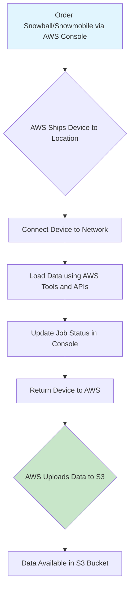
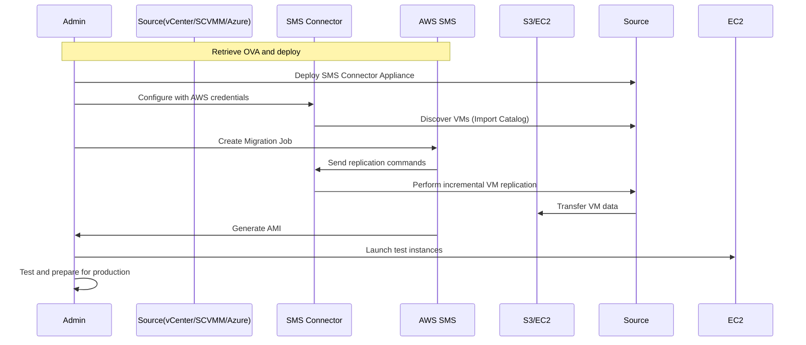

# Section 22: AWS Migration Services

<details open>
<summary><b>Section 22: AWS Migration Services (CL-KK-Terminal)</b></summary>

## Table of Contents

- [22.1 Snowball](#221-snowball)
- [22.2 AWS Server Migration Service (SMS) (Hands-On)](#222-aws-server-migration-service-sms-hands-on)
- [Summary](#summary)

### 22.1 Snowball

#### Overview
AWS Snowball is a secure physical device service designed to facilitate the migration of large datasets from on-premises environments to AWS cloud storage, specifically Amazon S3, bypassing the limitations and slow speeds of internet-based transfers. By providing rugged, tamper-proof devices capable of handling terabytes to petabytes of data, Snowball offers a cost-effective and faster alternative for data migration scenarios where traditional internet bandwidth would be impractical or time-consuming. This service addresses the common challenge faced by organizations migrating big data to the cloud, ensuring data integrity and security throughout the transport process.

#### Key Concepts/Deep Dive

##### What is AWS Snowball?
AWS Snowball is a member of the AWS Snow family, which includes various physical devices for data transfer and edge computing. Snowball specifically uses physical storage devices to securely and efficiently move large amounts of data between your on-premises data center and Amazon S3.

- **Data Transfer Process**: 
  1. Order a Snowball device through the AWS Management Console
  2. AWS ships the device to your location
  3. You connect the device to your network and load data onto it
  4. Update the job status in the AWS console
  5. Ship the device back to AWS
  6. AWS uploads data directly to your S3 bucket (typically within 5 days)

##### Use Cases and Advantages Over Internet Transfers
When migrating large datasets (typically over 10 TB), internet-based transfers can be prohibitively slow and expensive. Snowball provides:
- **Faster Transfer Speeds**: Eliminates bandwidth constraints and potential ISP costs
- **Higher Reliability**: Physical transport avoids internet outages, latency issues, and data corruption risks
- **Cost-Effectiveness**: More economical for large datasets compared to long-term internet uploads

For example, uploading 50 TB of data at 100 Mbps internet speed would take approximately 31 days, 21 hours, and 40 minutes. Snowball can accomplish this transfer in days using its physical media approach.

💡 **Pro Tip**: For datasets under 10 TB, consider using internet transfers like AWS DataSync or S3 Transfer Acceleration, as Snowball may not be the most cost-effective option.

##### Snowball Device Types
AWS offers different Snowball variants based on capacity and features:

- **Snowball Storage-Optimized (formerly just "Snowball")**:
  - 50 TB model available in all AWS regions
  - 80 TB model available only in US regions
  - Pure storage device for one-way data transfers to S3
  - Capable of handling multiple devices for larger transfers

- **Snowball Edge**:
  - Combines storage with on-board compute capabilities
  - Enables local processing and edge computing workloads
  - Supports AWS services like Lambda functions, Amazon EC2 instances
  - Can create clusters (5-10 devices) for high durability (99.999999999%) and scalable storage
  - Ideal when you need both data transfer and compute power at the edge

##### Security and Features
Snowball devices are designed with enterprise-grade security:
- Data is automatically encrypted using AWS Key Management Service (AWS KMS)
- Tamper-evident packaging and E-ink display showing shipping labels
- Physically rugged construction for secure transit
- Full traceability throughout the process via AWS console

You can track job progress, create multiple jobs, and monitor replication status through the Snowball service in the AWS console.

⚠ **Important**: Snowball devices include clear instructions for security labels and return shipping. Always verify device integrity upon arrival and return.

##### AWS Snowmobile
For extremely large-scale data migrations (exabytes), AWS offers Snowmobile:
- 45-foot shipping container on a semi-trailer truck
- Can transfer up to 100 petabytes of data
- Pulled by a commercial semi-trailer truck
- Ideal for enterprises with massive data centers or legacy storage
- Similar process: order, load, ship back, AWS processes the data



### 22.2 AWS Server Migration Service (SMS) (Hands-On)

#### Overview
AWS Server Migration Service (SMS) is an automated service designed to facilitate the incremental migration of virtual machines (VMs) from on-premises environments or other cloud providers like Microsoft Azure to AWS, creating Amazon Machine Images (AMIs) that can be deployed as EC2 instances. By supporting popular virtualization platforms like VMware vSphere, Microsoft Hyper-V, and System Center Virtual Machine Manager (SCVMM), SMS enables organizations to seamlessly migrate entire servers with minimal downtime while maintaining operational continuity during the transition process. This service addresses the growing need for lift-and-shift migration strategies, allowing companies to replicate and test VMs in AWS before full cutover.

#### Key Concepts/Deep Dive

##### What is AWS Server Migration Service (SMS)?
AWS SMS automates the migration of running virtual machines from supported platforms into AMIs ready for EC2 deployment. It handles incremental replication, allowing you to test and update cloud-based images before production deployment.

- **Supported Sources**:
  - VMware vSphere environments (with vCenter)
  - Microsoft Hyper-V (with SCVMM)
  - Microsoft Azure VMs

- **Output**: Each migrated VM becomes an AMI in your AWS account, which can then be used to launch EC2 instances

##### How SMS Works
The service performs incremental VM replication over time:
1. **Initial Replication**: Copies the entire VM to AWS
2. **Ongoing Sync**: Replicates changes incrementally until cutover
3. **AMI Creation**: Converts replicated VM into deployable AMI
4. **Testing and Deployment**: Launch test instances, modify configurations, then deploy to production

This approach minimizes downtime and allows testing of migrated workloads before decommissioning on-premises servers.

##### Advantages
- **Simplified Migration Process**: Lift-and-shift approach preserves existing configurations and software installations
- **Orchestration for Multi-Server Migrations**: Migrate multiple VMs simultaneously with dependency management
- **Testing Capabilities**: Create and test AMIs before production deployment
- **Minimal Downtime**: Incremental replication ensures business continuity during migration
- **OS Support**: Works with most popular server operating systems
- **Cost Optimization**: Only pay for AWS resources used during testing and after migration completion

SMS supports application migration groups (up to 10 groups per account, 50 servers max per group), enabling you to organize and migrate related VMs together.

##### Limitations
- **50 Concurrent VM Migrations** per AWS account (can be increased by request)
- **90-Day Replication Window** per VM (beginning from initial replication)
- **No Cross-Platform Migration**: VMs must remain on the same OS types (Windows to Windows, Linux to Linux)
- **Internet Connectivity Required**: Replications happen over network connections

> [!NOTE]
> If a VM needs to run longer than 90 days during migration, you must request a limit increase from AWS or terminate and restart the frame.

##### Migration Process with SMS Connector

SMS requires deployment of a pre-configured FreeBSD-based connector appliance in your source environment:

1. **Deploy Connector**:
   - Download connector OVA file from AWS console
   - Deploy to source environment (vCenter for VMware, SCVMM for Hyper-V, or Azure)
   - Requires sufficient credentials for environment access

2. **Configure Connector**:
   - Log into connector with provided password
   - Link to AWS account via access keys
   - Create server migration job

3. **Import Server Catalog**:
   - Connector discovers available VMs
   - Select VMs for migration
   - Re-import catalog as needed when VMs change

4. **Create Migration Job**:
   - Define replication settings
   - Set up incremental replication
   - Monitor progress through SMS console

5. **Test and Deploy**:
   - Launch EC2 instances from generated AMIs
   - Test functionality in AWS environment
   - Perform final cutover when ready



##### Practical Considerations

While SMS doesn't require complex virtualization setup for basic understanding, hands-on experience provides deeper insights into virtualization concepts. The service integrates with existing enterprise infrastructure without requiring major reconfiguration.

- **Best Practices**: Always perform thorough testing of migrated AMIs before production cutover
- **Cost Monitoring**: Track AWS resource usage during the 90-day replication window
- **Security**: AMIs inherit your AWS account's security configurations

> [!IMPORTANT]
> SMS supports Azure-to-AWS migrations, making it valuable for hybrid or multi-cloud strategies.

#### Lab Demo
While not required for AWS certification exams, understanding SMS through hands-on practice reinforces theoretical knowledge. The instructor provides practical demonstrations through ICA (Inner Circle Academy) sessions that cover:

- VMware vSphere environment setup (vCenter, ESXi hosts)
- Hyper-V/SCVMM configuration
- Complete SMS connector deployment and VM migration workflows
- Troubleshooting common migration issues
- AMI testing and optimization in AWS

For detailed step-by-step labs, refer to recorded ICA sessions (available via links in the video description). These sessions demonstrate real-world migration scenarios, including complete migration cycles and best practices.

## Summary

### Key Takeaways
```diff
+ Snowball excels at fast, secure physical data transfers for datasets over 10 TB
+ Snowball Edge adds compute capabilities for edge processing and durable local storage clusters
+ Snowmobile handles exabyte-scale migrations with 100 PB per truck capacity
+ SMS automates VM migrations from VMware, Hyper-V, and Azure to AWS AMIs
+ SMS enables testing of migrated workloads before production cutover
+ Use SMS limitations (50 VMs concurrent, 90-day replication) to plan migration timelines
+ Combine Snowball for data and SMS for servers in comprehensive cloud migration strategies
- Internet transfers become impractical for datasets over a few TB
- SMS cannot migrate across OS types (Windows only to Windows)
- Snowball devices require physical shipping time in addition to AWS processing
```

### Quick Reference

**Snowball Device Specifications:**
| Feature | Snowball 50TB | Snowball 80TB | Snowball Edge |
|---------|---------------|----------------|---------------|
| Capacity | 50 TB (all regions) | 80 TB (US only) | Var. with compute |
| Compute | None | None | AWS Lambda/EC2 |
| Cluster Support | No | No | 5-10 devices (99.999999999% durability) |

**SMS Migration Limits:**
- 50 concurrent VMs per account
- 90 days per VM replication
- 10 application groups, 50 servers per group

**Common Commands** (SMS Connector):
```bash
# Deploy OVA via vSphere Web Client
# Configure via browser: https://connector-ip
# AWS credentials setup for replication
```

> [!TIP]
> Use the AWS Migration Calculator to plan SMS migrations and estimate costs.

### Expert Insight

#### Real-world Application
In enterprise environments, Snowball is frequently used for IoT data lakes, media archives, and genomic research datasets that exceed internet transfer capabilities. CMS combines Snowball with AWS Database Migration Service (DMS) for complete infrastructure lift-and-shift. Organizations like media companies and healthcare institutions leverage Snowmobile for legacy data center migrations spanning years of accumulated data.

#### Expert Path
Master AWS migration by: (1) Understanding hybrid connectivity options alongside physical transfers; (2) Practicing with AWS Migration Hub for centralized tracking of multi-wave migrations; (3) Learning AWS Application Migration Service (AMS) for lift-and-shift of physical servers; (4) Exploring AWS Migration Acceleration Program for financial incentives.

#### Common Pitfalls
- Underestimating shipping logistics for physical devices (2+ weeks each way)
- Selecting wrong device type (storage-only vs. edge compute) based on use case
- Forgetting to terminate SMS replication jobs before the 90-day limit
- Not planning for incremental replication bandwidth requirements during SMS

#### Lesser-Known Facts
Snowball devices use Trust Platform Module (TPM) chips for cryptographic operations and integrate with AWS CloudTrail for audit logging. SMS supports "group migrations" allowing you to orchestrate complex multi-tier applications. Recent updates include support for Amazon FSx and improved cross-region AMI copying.

</details>
