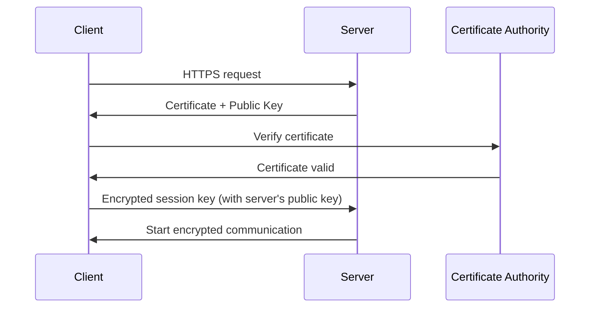
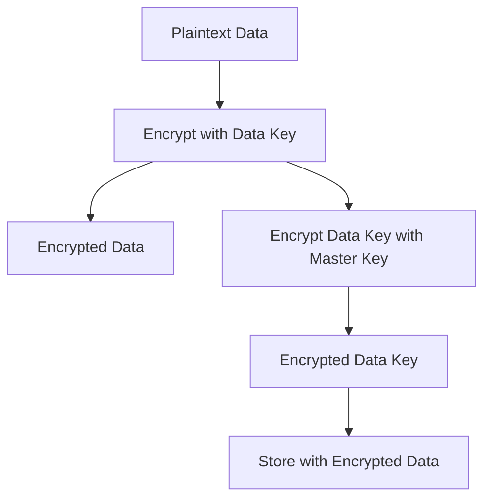
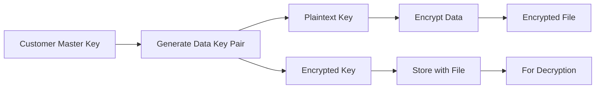
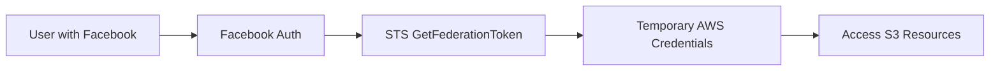
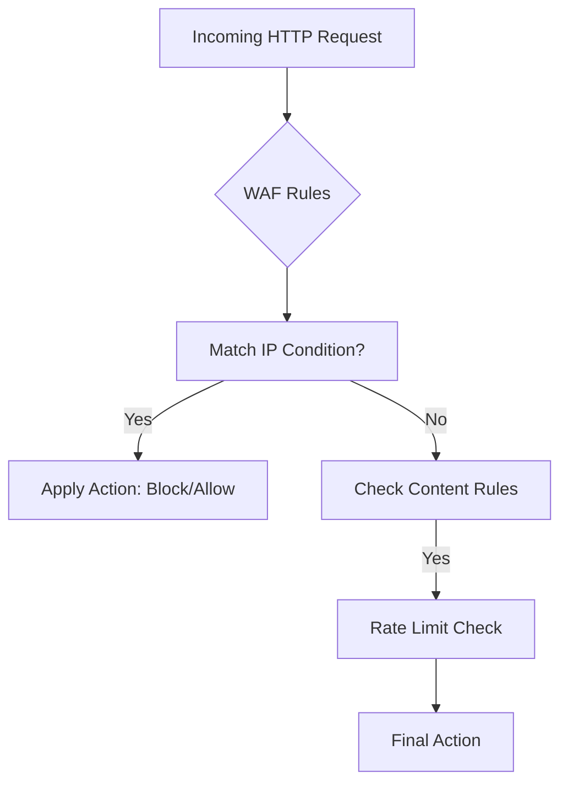
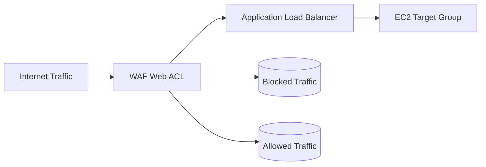
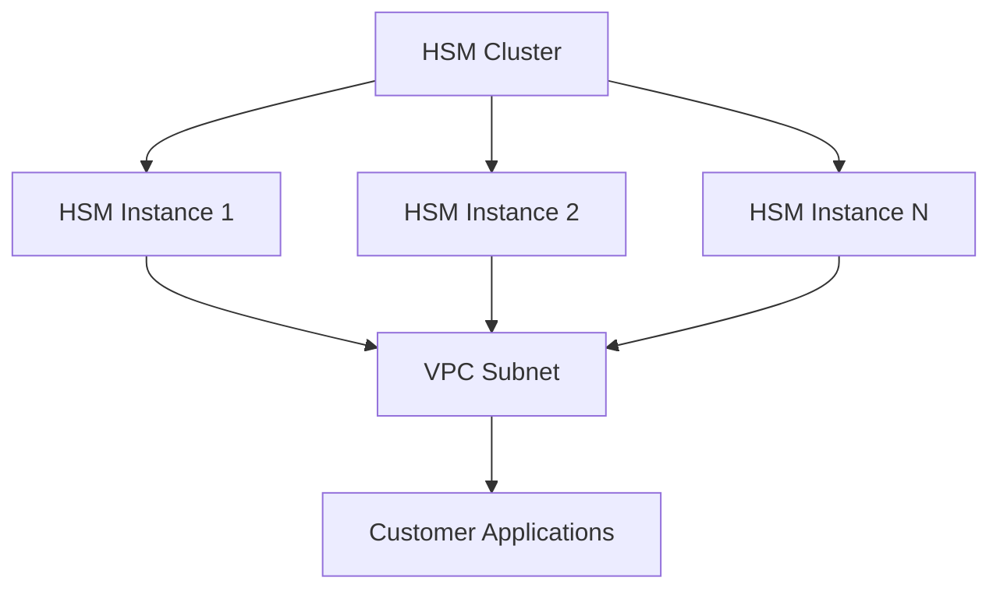

# Section 23: AWS Security Services

<details open>
<summary><b>Section 23: AWS Security Services (CL-KK-Terminal)</b></summary>

## Table of Contents

- [23.1 AWS Certificate Manager (ACM) Part-1](#231-aws-certificate-manager-acm-part-1)
- [23.2 AWS Certificate Manager (ACM) Part-2](#232-aws-certificate-manager-acm-part-2)
- [23.3 AWS Key Management Service (KMS) Part-1](#233-aws-key-management-service-kms-part-1)
- [23.4 AWS Key Management Service (KMS) Part-2](#234-aws-key-management-service-kms-part-2)
- [23.5 AWS Security Token Service (STS)](#235-aws-security-token-service-sts)
- [23.6 AWS Web Application Firewall (WAF) Part-1](#236-aws-web-application-firewall-waf-part-1)
- [23.7 AWS Web Application Firewall (WAF) Part-2](#237-aws-web-application-firewall-waf-part-2)
- [23.8 AWS CloudHSM (Hardware Security Module)](#238-aws-cloudhsm-hardware-security-module)

## 23.1 AWS Certificate Manager (ACM) Part-1

### Overview
This section introduces SSL/TLS fundamentals and prepares for AWS Certificate Manager implementation. It explains how SSL/TLS provides authentication, encryption, and integrity for secure web communications, positioning ACM as an AWS-managed certificate authority service for seamless HTTPS deployment.

### Key Concepts

#### SSL/TLS Fundamentals
- **SSL/TLS Definition**: Technologies providing secure transmission of sensitive data over HTTPS with authentication, encryption, and integrity
- **Authentication**: Validates entity identity (e.g., website ownership verification)
- **Encryption**: Makes data unreadable to unauthorized parties using keys
- **Integrity**: Prevents data tampering during transmission

#### Encryption Terminology
- **Encryption Process**: Converts data into unreadable format using algorithms; decryption requires proper key
- **Key Types**:
  - **Symmetric Encryption**: Single key for both encrypt/decrypt (e.g., AES, DES)
  - **Asymmetric Encryption**: Public/private key pair (e.g., RSA, Diffie-Hellman)

```diff
+ Symmetric Key: One key for lock/unlock (like home door key)
- Asymmetric Key: Two keys - public and private
```

#### HTTPS Communication Process
1. **Client** initiates request to https://example.com
2. **Server** responds with certificate containing public key
3. **Client** verifies certificate validity via browser/OS trust store
4. **Key Exchange**: Client creates session key, encrypts with server's public key
5. **Server** decrypts with private key, establishes encrypted communication
6. **Result**: Secure data transmission with authentication



### Common Pitfalls in Understanding
- Confusing symmetric vs asynchronous encryption
- Assuming CA validation is manual (it's automated via browser)
- Forgetting certificate requires installation on web server

## 23.2 AWS Certificate Manager (ACM) Part-2

### Overview
This section demonstrates practical ACM implementation by attaching certificates to Application Load Balancers. It covers certificate provisioning, DNS validation, and HTTPS load balancer configuration, showing how ACM integrates with AWS services for zero-cost SSL/TLS certificates.

### Key Concepts

#### ACM Overview
- **Service Purpose**: Managed certificate authority for deploying SSL/TLS through AWS services
- **Deployment Targets**: ALB, CloudFront, API Gateway, Elastic Beanstalk
- **Benefits**: Free certificates, automatic renewal, managed key rotation

#### Certificate Provisioning Process
1. **Request Certificate**:
   ```bash
   # Via AWS Console or CLI
   aws acm request-certificate --domain-name example.com --validation-method DNS
   ```

2. **DNS Validation**:
   - ACM provides CNAME records
   - Add records to Route 53 or DNS provider
   - ACM validates domain ownership

3. **Certificate Usage**:
   - Issued certificates appear in ACM console
   - Available for ALB/CloudFront integration
   - Managed renewal (no manual intervention)

### Lab Demo: ACM with ALB

#### Prerequisites
- EC2 instance running web server (Apache/NGINX)
- Security group allowing HTTP traffic
- Route 53 hosted zone

#### Steps
1. **Create ACM Certificate**:
   - Navigate to ACM console
   - Request public certificate: `*.learndns.ml`
   - Choose DNS validation
   - Create Route 53 record via "Create record in Route 53"

2. **Configure Load Balancer**:
   - Create Application Load Balancer
   - Select HTTPS listener port 443
   - Choose ACM certificate in Security Settings

3. **Target Group Registration**:
   ```bash
   # Register EC2 instance as target
   aws elbv2 register-targets \
     --target-group-arn <target-group-arn> \
     --targets Id=<instance-id>
   ```

4. **DNS Configuration**:
   - Create Route 53 A record pointing to ALB
   - Access via HTTPS: `https://web.learndns.ml`

#### Verification
```bash
# Test HTTPS connection
curl -I https://web.learndns.ml
# Expected: 200 OK with valid certificate
```

### Configuration Block: ALB HTTPS Setup
```nginx
# ALB Listener Configuration (Conceptual)
listener https 443:
  certificates: arn:aws:acm:region:account:certificate/id
  default actions:
    forward to target group
```

### Common Configuration Issues
- ✅ **Correct**: DNS validation completes automatically with Route 53 integration
- ❌ **Wrong**: Certificate won't renew if DNS records are deleted
- ⚠️ **Warning**: Self-signed certificates not supported by ACM; must be CA-validated

## 23.3 AWS Key Management Service (KMS) Part-1

### Overview
This section introduces AWS Key Management Service as a managed encryption service. KMS simplifies key management across AWS services, providing customer master keys that integrate seamlessly with EBS, S3, RDS, and other services for transparent encryption/decryption operations.

### Key Concepts

#### KMS Core Functionality
- **Purpose**: Create and manage cryptographic keys for AWS services
- **Integration**: EBS, S3, Redshift, RDS, EFS, ACM, SNS
- **Benefits**: Centralized key management, automatic key usage across services

#### Key Types

| Key Type | Managed By | Usage | Rotation Period | Reasons |
|----------|------------|-------|-----------------|---------|
| AWS Managed CMK | AWS | Service integration (EBS, S3, etc.) | 3 years | Ready-to-use, cannot be deleted |
| Customer Managed CMK | Customer | Custom applications, imported keys | 1 year (configurable) | Full control, can be deleted |

- **AWS Managed CMK Features**:
  - Prefixed with "aws/" in KMS console
  - Automatically created for services (e.g., EBS encryption)
  - Cannot be deleted or rotated manually
  - Suitable for basic encryption needs

- **Customer Managed CMK Features**:
  - Customer-created keys with full permissions
  - Deletable and customizable rotation
  - Supports key material import
  - Enables external system encryption

#### Data Keys and Envelope Encryption
- **Data Keys**: Encryption keys for actual data (separate from master keys)
- **Process**: Customer Master Key generates and protects data keys
- **AWS Managed**: Transparent internal handling
- **Customer Managed**: Visible envelope encryption workflow



### Configuration Example: Encrypted EBS Volume
1. **Via EC2 Console**: Create volume → Select "Encrypt this volume" → Choose "aws/ebs" key
2. **Result**: Volume automatically encrypted/decrypted by EC2 service

### Security Considerations
```diff
+ Benefit: Centralized key management simplifies compliance
- Limitation: AWS managed keys lack rotation control
! Expert Tip: Use customer managed keys for compliance requirements needing annual rotation
```

## 23.4 AWS Key Management Service (KMS) Part-2

### Overview
This section provides hands-on demonstration of customer managed keys for external file encryption. It covers envelope encryption implementation, demonstrating how KMS enables secure data protection outside AWS services using CLI tools and proper access controls.

### Key Concepts

#### Customer Managed Key Encryption Process
1. **Request Data Key** from KMS using Customer Master Key (CMK)
2. **Receive**: Plaintext data key + encrypted data key
3. **Encrypt**: Data with plaintext key
4. **Store**: Encrypted data + encrypted key
5. **Decrypt**: Retrieve encrypted key, decrypt via KMS, then decrypt data

#### Key Actors in Encryption
- **Master Key (CMK)**: Manages data keys in KMS
- **Data Key**: Actual encryption key (plaintext/encrypted pair)
- **Envelope Encryption**: Protects data key with master key



### Lab Demo: File Encryption with CLI

#### Prerequisites
- Two IAM users: agent1 and agent2
- Customer managed key in KMS
- Windows/Linux environment with AWS CLI

#### Step 1: Create Test Users
```bash
aws iam create-user --user-name agent1
aws iam create-user --user-name agent2
# Download access keys for each user
```

#### Step 2: Create Customer Managed Key
- KMS Console → Create key → Symmetric encryption
- Define key administrators: Root user
- Grant key usage permissions to agent1 (agent2 has no access)

#### Step 3: Encrypt File as Root User
```bash
# Configure root credentials
aws configure

# Create test file
echo "This is my secret data. It's confidential." > my_secrets.txt

# Encrypt using KMS (replacing arn with your key ARN)
aws kms encrypt \
  --key-id arn:aws:kms:region:account:key/key-id \
  --plaintext fileb://my_secrets.txt \
  --output text \
  --query CiphertextBlob \
  --encryption-context purpose=test > encrypted_data.b64

# Decode for Windows storage
certutil -decode encrypted_data.b64 encrypted_secrets.txt

# Clean up plaintext
del my_secrets.txt
```

#### Step 4: Test Access with Different Users

**Agent 1 (Authorized)**:
```bash
# Configure agent1 credentials
aws configure

# Successfully decrypt
aws kms decrypt \
  --ciphertext-blob fileb://encrypted_secrets.txt \
  --output text \
  --query Plaintext | certutil -decodehex /f /o plaintext_secrets.txt

# Result: Original file content
```

**Agent 2 (Unauthorized)**:
```bash
# Configure agent2 credentials
aws configure

# Attempt decrypt - will fail
aws kms decrypt \
  --ciphertext-blob fileb://encrypted_secrets.txt

# Error: Access denied for key
```

### Operational Workflow
```diff
+ Authorized users can retrieve plaintext data keys from KMS
- Unauthorized users receive permission errors
! Key Point: Envelope encryption provides two-tier security
```

### Key Takeaways from Demo
- ✅ Root and agent1 can encrypt/decrypt due to key permissions
- ❌ Agent2 cannot access encrypted data
- 💡 Demonstrates role-based encryption access control

### Common Windows CLI Adjustments
- Use `certutil -encode/-decode` for binary/text conversion
- Store encrypted files in `blob` format for KMS compatibility
- Ensure proper user context for credential isolation

## 23.5 AWS Security Token Service (STS)

### Overview
This section introduces AWS Security Token Service for temporary credential management, emphasizing its role in identity federation and temporary access patterns. STS serves developers and organizations needing secure, time-limited AWS resource access without long-term credentials.

### Key Concepts

#### STS Core Functionality
- **Purpose**: Generate temporary security credentials
- **Credential Lifetime**: Few minutes to several hours
- **Use Cases**: Applications needing temporary access, identity federation

#### Comparison: IAM vs STS

| Service | Credential Type | Storage | Rotation | Examples |
|---------|-----------------|---------|----------|----------|
| IAM | Permanent/static | Stored with user | Manual | Console users, CLI users |
| STS | Temporary/dynamic | Not stored | Automatic expiration | Federated access, mobile apps |

#### Identity Federation Types
- **Enterprise Identity Federation**:
  - SAML 2.0 with Microsoft Active Directory Federation Services (AD FS)
  - Single sign-on (SSO) for organizational directory users
  - Example: Company AD users accessing AWS resources

- **Web Identity Federation**:
  - Social media login integration (Facebook, Google, Amazon)
  - OpenID Connect 2.0 compatible providers
  - Example: Mobile app users accessing AWS via Facebook login



#### STS Key Characteristics
- ✅ No credential storage or embedding needed
- ✅ Automatic expiration prevents stale access
- ✅ Supports cross-account access patterns
- ✅ Enables role assumption scenarios

### Configuration Example: Federated Access
```bash
# Assume role with STS
aws sts assume-role \
  --role-arn arn:aws:iam::123456789012:role/MyRole \
  --role-session-name temp-session

# Returns temporary credentials:
# {
#   "Credentials": {
#     "AccessKeyId": "...",
#     "SecretAccessKey": "...",
#     "SessionToken": "..."
#   }
# }
```

### Security Best Practices
```diff
+ Advantage: STS enables secure API access without long-term keys
- Limitation: Temporary nature requires credential refresh logic
! Expertise: Use STS for mobile/desktop applications avoiding key exposure
```

## 23.6 AWS Web Application Firewall (WAF) Part-1

### Overview
This section introduces AWS Web Application Firewall as an advanced security service for protecting web applications. WAF provides granular control over HTTP/HTTPS traffic to ALB, CloudFront, API Gateway, and AppSync, enabling prevention of common web attacks through configurable rules.

### Key Concepts

#### WAF Core Functionality
- **Purpose**: Monitor, block, or allow HTTP(S) requests
- **Integration Points**: ALB, CloudFront, API Gateway, AppSync
- **Rule-Based Filtering**: Condition-based request processing

#### Protection Mechanisms

| Mechanism | Purpose | Examples |
|-----------|---------|----------|
| **Allow** | Permit specified traffic | Whitelist IP ranges |
| **Block** | Deny specified traffic | Blacklist attackers |
| **Count** | Monitor without action | Analyze traffic patterns |
| **Rate Limit** | Control request frequency | DDoS prevention |

#### Rule Conditions

**IP Address Control**:
- Source IP address filtering
- CIDR notation support (e.g., `192.168.1.0/24`)
- HTTP header IP matching (proxy-aware)

**Content-Based Filtering**:
- String matching in requests
- Regex pattern matching
- Geographic restrictions (country blocking)

**Request Inspection**:
- Header analysis
- Query parameter evaluation
- URI path filtering



### Configuration Modes

**Monitoring Mode (`Count`)**:
- Collect attack patterns
- Generate visibility into threats
- No impact on legitimate traffic

**Protection Mode (`Block`/`Allow`)**:
- Active threat prevention
- Immediate blocking of malicious requests
- Configurable response codes (403 Forbidden)

## 23.7 AWS Web Application Firewall (WAF) Part-2

### Overview
This practical section demonstrates WAF implementation with Application Load Balancer. It covers IP-based access control, traffic monitoring, and rule management, showing how to configure both restrictive and permissive traffic policies with real-time verification.

### Key Concepts

#### WAF Configuration Workflow
1. **Create IP Sets**: Define IP address ranges
2. **Build Web ACL**: Attach IP sets to rules
3. **Associate Resources**: Link ACL to ALB/CloudFront
4. **Configure Rules**: Set actions (Block/Allow/Count)
5. **Monitor Traffic**: Review CloudWatch metrics

#### Rule Actions Explained

| Action | Description | Use Case |
|--------|-------------|----------|
| **Block** | Deny matching requests (HTTP 403) | Blacklisting attackers |
| **Allow** | Permit specific traffic only | Corporate network access |
| **Count** | Monitor but don't restrict | Threat analysis, baseline monitoring |

### Lab Demo: ALB Protection with WAF

#### Prerequisites
- Running Application Load Balancer
- EC2 instance registered as target
- DNS record pointing to ALB

#### Configuration Steps

1. **Create IP Set**:
   ```
   - Name: MyOfficeIP
   - IP Address: Your Office IP/32
   - Region: ALB region
   ```

2. **Create Web ACL**:
   ```
   - Name: ALBProtection
   - Region: ALB region
   - Associated resource: Select ALB
   ```

3. **Add Rules**:
   ```
   - Rule Type: IP Set (MyOfficeIP)
   - Action: Block (denies office IP)
   - Default Action: Allow (default allow)
   ```

4. **Verification**:
   ```bash
   # From office IP: 403 Forbidden
   curl -I https://your-alb-domain.com

   # From other IP: 200 OK
   curl -I https://your-alb-domain.com
   ```

#### Advanced Rule: Restricted Access
```diff
+ Rule: Block all requests
+ Exception: Allow MyOfficeIP
- Result: Only office IP can access ALB
```

#### Monitoring Setup
1. **Web ACL Console** → Monitoring tab
2. **CloudWatch Integration**: Real-time request counts
3. **Sample Count**: Rate-limited request tracking

#### AWS Managed Rules
- Pre-configured rule sets from AWS
- Paid subscription required
- Examples:
  - Amazon IP Reputation List (25 WCU)
  - Bad Bot Protection
  - SQL Injection Prevention
  - XSS Attack Prevention

#### Capacity Units (WCU)
- Max: 1500 WCU per Web ACL
- Each rule consumes WCU
- AWS managed rules: Variable costs

##### Rule Cost Table

| Rule Type | WCU Cost | Notes |
|-----------|----------|-------|
| Basic IP Match | 1 | Simple IP filtering |
| String Match | 1 | Content inspection |
| Amazon IP Reputation | 25 | Commercial reputation lists |
| AWS Common Rule Set | 53 | Broad protection |

### Cleanup Process
```bash
# Required deletion order
aws wafv2 disassociate-web-acl --web-acl-arn <web-acl-arn> --resource-arn <resource-arn>
aws wafv2 delete-web-acl --web-acl-arn <web-acl-arn>
aws wafv2 delete-ip-set --id <ip-set-id>
```

### Common Deployment Patterns


## 23.8 AWS CloudHSM (Hardware Security Module)

### Overview
This section introduces AWS CloudHSM as a managed hardware security module service. CloudHSM provides dedicated cryptographic hardware for compliance-critical workloads, enabling FIPS-compliant key generation and management in virtual form while maintaining hardware security boundaries.

### Key Concepts

#### CloudHSM Fundamentals
- **Hardware Security Module**: Physical devices for cryptographic key management
- **AWS Implementation**: Virtual HSM clusters in customer VPC
- **Use Cases**: Private certificate authorities, key generation, compliance requirements

#### Core Features
- **Dedicated Hardware**: FIPS 140-2 Level 3 compliance in virtualized form
- **Customer Control**: Full administrative access to HSM instances
- **Scalability**: Add/remove HSM capacity on-demand
- **Backup/Restore**: Automated cluster backups with manual restore

#### Traditional vs CloudHSM

| Aspect | Traditional HSM | AWS CloudHSM |
|--------|-----------------|----------------|
| **Provisioning** | Purchase hardware | Provision via console |
| **Maintenance** | Manual hardware care | AWS-managed |
| **Scalability** | Fixed capacity | Elastic scaling |
| **Cost Model** | Capital expenditure | Pay-per-use |

#### Cluster Architecture


#### Configuration Process
1. **Create HSM Cluster**: Select VPC, subnets, security groups
2. **Add HSM Instances**: Provision virtual HSM appliances
3. **Initialize Cluster**: Set administrative credentials
4. **Configure Applications**: Use HSM-aware clients

#### Compliance and Standards
- FIPS 140-2 Level 3 validated
- SOC 2 Type II certified
- PCI DSS compliance support
- Exportable keys (subject to configuration)

### Configuration Block: HSM Cluster Setup
```bash
# Create HSM cluster
aws cloudhsmv2 create-cluster \
  --subnet-ids subnet-12345 subnet-67890 \
  --hsm-type hsm1.medium

# Add HSM instances
aws cloudhsmv2 create-hsm \
  --cluster-id cluster-12345 \
  --availability-zone us-east-1a
```

### Expert Considerations
```diff
+ Strength: True hardware isolation for cryptographic operations
- Limitation: Higher cost than software-based solutions
! Expert Use: Required for FedRAMP, HIPAA, PCI DSS critical systems
```

## Summary

### Key Takeaways
```diff
+ SSL/TLS essential for secure web communications - authentication + encryption + integrity
- Certificate management requires CA validation and proper installation
! ACM enables free SSL certificates for AWS services like ALB and CloudFront
+ KMS provides managed key service with envelope encryption capabilities
- Symmetric keys for speed, asymmetric for security in key exchanges
! STS crucial for temporary credentials and identity federation scenarios
+ WAF protects web apps with rules for allowing/blocking/counting traffic
- CloudHSM delivers hardware-level security for compliance-critical workloads
+ Always use HTTPS over HTTP for any sensitive data transmission
+ I corrected "asynchronous" to "asymmetric" in the transcript.
```

### Quick Reference

**ACM Certificate Request**:
```bash
aws acm request-certificate \
  --domain-name example.com \
  --validation-method DNS
```

**KMS Data Key Generation**:
```bash
aws kms generate-data-key \
  --key-id alias/my-key \
  --key-spec AES_256
```

**STS Temporary Credentials**:
```bash
aws sts assume-role \
  --role-arn arn:aws:iam::account:role/MyRole \
  --role-session-name temp-session
```

**WAF Web ACL Creation** (Conceptual):
```
Web ACL: ALBProtection
Rules: Block IP set (MyIPSet) - 1 WCU
Default: Allow
Capacity: 1499 WCU remaining
```

### Expert Insight

**Real-world Application**: Enterprise organizations use ACM for SSL certificates on production ALBs, KMS for encrypting sensitive data in S3/RDS, WAF for protecting against common web attacks, and CloudHSM for financial services requiring FIPS compliance.

**Expert Path**: Start with ACM for basic SSL needs, progress to KMS customer-managed keys for encryption control, then implement WAF with both custom and AWS-managed rules. For advanced security, incorporate CloudHSM for dedicated cryptographic hardware.

**Common Pitfalls**: Not validating ACM certificates properly causes browser warnings; using AWS-managed KMS keys without understanding rotation policies; misconfiguring WAF rules leading to legitimate traffic blocks; overlooking CloudHSM's operational complexity for simple encryption needs.

**Lesser-Known Facts**: CloudHSM supports Bring Your Own Key (BYOK) import, enabling key material portability; WAF can integrate with CloudWatch for automatic rule updates based on threat intelligence; KMS data keys support 256-bit AES encryption by default; STS supports cross-account role assumption for advanced permission scenarios.

</details>
