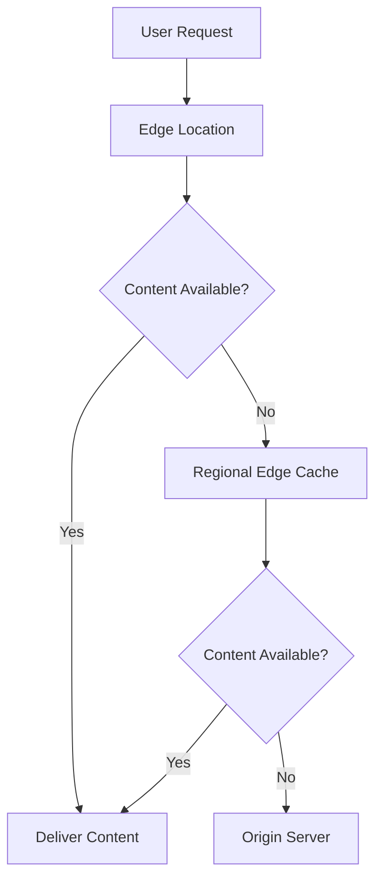

# Section 2: Getting Started with AWS

<details open>
<summary><b>Section 2: Getting Started with AWS (CL-KK-Terminal)</b></summary>

## Table of Contents
- [2.1 Getting Started with AWS](#21-getting-started-with-aws)
- [2.2 How To Create AWS Free Tier Account](#22-how-to-create-aws-free-tier-account)
- [2.3 AWS Account Budget Setting](#23-aws-account-budget-setting)
- [2.4 Introduction Of AWS Management Console](#24-introduction-of-aws-management-console)
- [2.5 AWS Global Infrastructure Part 1](#25-aws-global-infrastructure-part-1)
- [2.6 AWS Global Infrastructure Part 2](#26-aws-global-infrastructure-part-2)
- [2.7 AWS Global Infrastructure Part 3](#27-aws-global-infrastructure-part-3)
- [Summary](#summary)

## 2.1 Getting Started with AWS

### Overview
AWS, short for Amazon Web Services, is the market-leading cloud computing platform launched in 2006 with its first service, Amazon Simple Storage Service (S3). It provides a comprehensive suite of over 200 cloud services, enabling users to host applications and store data without managing physical infrastructure. This section introduces AWS as a pioneer in cloud technology, emphasizing its dominance in the market based on Gartner Magic Quadrant data, with 33% market share.

### Key Concepts/Deep Dive
- **AWS History and Launch**: Officially launched in 2006, AWS started with S3 and expanded with EC2 for virtual servers, achieving massive success. In 2016, AWS launched its first region in Mumbai (Asia Pacific South-1), followed by Hyderabad in November 2022, now offering two regions in India.
- **Market Leadership**: AWS leads with 33% market share compared to Microsoft's 22% and Google's 11%, as per Gartner. This leadership stems from providing the highest number of services and strong foundation for cloud careers.
- **Key Services Overview**:
  - **S3 (Simple Storage Service)**: Cloud-based object storage for files, similar to Dropbox or iCloud backend.
  - **EC2 (Elastic Compute Cloud)**: Provides virtual servers (instances) easily launched via dashboard.
- **Free Tier Benefits**: Offers a 12-month free tier with limitations (e.g., 750 hours EC2, 5GB S3 storage), allowing hands-on learning without costs if limits are respected.
- **Learning Path and Demographics**: Ideal for beginners aiming for expert-level knowledge; Job market favors AWS due to its dominance. Localize resources in Indian regions for compliance with government data laws.

> [!IMPORTANT]
> Always adhere to free tier limits to avoid charges; AWS offers everything needed for hosting and deploying applications.

### Code/Config Blocks
None directly applicable, but here's an example setup for checking account usage:

```bash
# Example: Check current AWS free tier usage (run in AWS CLI)
aws billing get-cost-and-usage --time-period Start=2024-01-01,End=2024-12-31
```

> [!NOTE]
> The AWS console GUI makes management user-friendly, but CLI provides powerful automation.

## 2.2 How To Create AWS Free Tier Account

### Overview
Creating an AWS Free Tier account is essential for hands-on learning, offering 12 months of free usage with specific limits per service. This process involves verifying identity with a credit/debit card (Visa, MasterCard, or American Express only; supports international transactions) and an email account, with no automatic deductions—AWS only verifies the card and may charge ₹2 for testing, refundable promptly.

### Key Concepts/Deep Dive
- **Prerequisites**:
  - Valid email (Gmail/Yahoo).
  - Credit/debit card with international transactions enabled; Indian Rupee cards are not supported, but verification uses ₹2 (refundable).
- **Free Tier Limits**: Services like EC2 (750 hours) and S3 (5GB) are free for 12 months; exceeding limits incurs charges.
- **Account Creation Steps**:
  1. Visit aws.amazon.com/free and click "Create a Free Account".
  2. Enter email and AWS account name.
  3. Verify email via OTP sent to Gmail.
  4. Set complex root user password (include caps, numbers, special chars).
  5. Provide personal/contact details (name, mobile with country code, address).
  6. Enter card details for verification (holder name, number, CVV, billing address).
  7. Choose additional preferences: Select "Personal" for learning purposes; basic support (free) over developer ($29/month) or business ($100/month).
  8. Complete setup; receive confirmation email with account ID.
- **Lab Setup Note**: Resources must be deleted post-lab to stay within free tier; set budgets for alerts.
- **Security Best Practice**: Use complex passwords; enable 2FA if possible; monitor for unauthorized access.

> [!CAUTION]
> Ensure international transactions are enabled on your card; delete all unused resources immediately after use to prevent unexpected charges.

### Lab Demos
#### Creating AWS Free Tier Account (Step-by-Step)
1. Open browser, go to aws.amazon.com/free, click "Create a Free Account".
2. Enter your email ID (copy-paste to avoid errors), choose AWS account name (e.g., "CloudFoxHub").
3. Click verify via email; access Gmail, copy verification code, paste, and continue.
4. Set root password (e.g., complex: Pass123!), click continue.
5. Fill contact info: Name, mobile (select India +91), address details.
6. Enter card: Holder name, number, CVV, PIN (if prompted), click verify; expect SMS OTP for mobile verification.
7. Select purpose: "Personal use/ownership individual".
8. Choose "Basic Support" (free).
9. Complete sign-up; access AWS Management Console via email link.
10. Verify account in console with email ID and password.

```bash
# No code blocks, but remember to handle OTP carefully during setup.
```

## 2.3 AWS Account Budget Setting

### Overview
Setting a zero-spend budget in AWS ensures immediate email alerts if charges exceed $0.01, protecting against accidental overhead while learning. This free tool prevents unexpected bills by notifying users instantly, allowing quick resource deletion—AWS does not auto-terminate resources.

### Key Concepts/Deep Dive
- **Budget Purpose**: Alerts at the first sign of charges, promoting safe lab practices; check emails daily and delete alerted resources.
- **Setup Process**:
  - Log in to AWS Management Console with email/password.
  - Click account name (top-right), select "Billing & Cost Management" > "Billing preferences".
  - Enable "Receive AWS Free Tier alerts" (add email if needed).
  - Navigate to "Budgets" > "Create a budget".
  - Select "Zero spend budget" template; set scope to all AWS services.
  - Enter additional emails for notifications; create budget.
  - Green "OK" status indicates no breaches; red alerts trigger immediate action.
- **Alert Handling**: Upon alert, investigate and delete excess resources; contact instructor if unsure.
- **Limitations Note**: Budget alerts do not cap spending—manual intervention required.

> [!WARNING]
> Budgets alert but don't prevent charges; always delete unused resources post-lab.

### Lab Demos
#### Setting Up Zero Spend Budget
1. Log in to AWS Console.
2. Click account name > Billing & Cost Management > Billing Preferences > Edit > Enable Free Tier alerts (add email).
3. Go to Budgets > Create Budget > Use Template > Zero Spend Budget > Name it (e.g., "FreeTierAlerts").
4. Set scope: All AWS Services; add secondary email.
5. Click Create; verify green status.
6. Simulate check: After creation, confirm no alerts.

```yaml
# Example budget config (conceptual)
Budget:
  Name: ZeroSpendAlerts
  TimeUnit: MONTHLY
  BudgetType: Cost
  LimitAmount: 0.01
  Currency: USD
  Notifications:
    - NotificationType: ACTUAL
      ComparisonOperator: GREATER_THAN
      Threshold: 0
      Email: your_email@example.com
```

## 2.4 Introduction Of AWS Management Console

### Overview
The AWS Management Console provides a graphical user interface (GUI) for managing cloud resources across 200+ services, categorized by types like Compute, Storage, and Networking. It displays recently visited services, region selection, billing info, and health status, with global services (e.g., IAM) not region-specific.

### Key Concepts/Deep Dive
- **Console Features**:
  - **Recently Visited Services**: Quick access to used services (updates dynamically).
  - **Service Categories**: Organized into Compute (e.g., EC2 for virtual machines), Analytics, Integration, etc.; click to browse sub-services.
  - **Billing Dashboard**: Track costs under account name > Billing Dashboard; set preferences for alerts.
  - **Account Management**: Access account ID, programmatic access keys (for CLI), and support options.
  - **CloudShell**: Browser-based CLI alternative for management without local installs.
  - **Region Selection**: Choose global regions (e.g., US East N. Virginia) to deploy resources; global services ignore regions.
- **Usage Tips**: Manage resources via GUI, but note CLI/CloudShell for automation; sign out for security.
- **Up Next**: Practical creation of EC2 instances in upcoming videos.

> [!TIP]
> Familiarize with console layout early; it's the primary tool for visual resource management.

### Code/Config Blocks
None directly, but for programmatic access:

```bash
# Get AWS account ID via CLI
aws sts get-caller-identity
```

### Lab Demos
#### Navigating the AWS Console
1. Log in to Console.
2. Explore service categories in top menu bar.
3. Click "Compute" > "EC2" to open EC2 dashboard.
4. Check billing via account name > Billing Dashboard.
5. Select a region from top-right dropdown (e.g., take note of changes).
6. Access CloudShell from top toolbar for command-line practice.

## 2.5 AWS Global Infrastructure Part 1

### Overview
AWS Global Infrastructure mitigates latency and ensures compliance by deploying resources geographically close to users. Regions provide low-latency access, availability zones enhance redundancy within regions, and local zones extend reach outside regions via dedicated data centers.

### Key Concepts/Deep Dive
- **Latency and Regions**:
  - Latency: Time data travels between points (e.g., 13,000km India-USA adds delay).
  - Regions: Geographical divisions (35+ worldwide) for deploying resources near users, reducing latency (e.g., host in India for Indian users).
  - Compliance Use Case: Store data in country-specific regions (e.g., India for GDPR/digital laws); AWS never copies data between regions.
- **Availability Zones (AZs)**:
  - Physical data centers/collections within regions (e.g., 3 AZs in Mumbai region).
  - Features: Independent power/water supplies, high-speed fiber links (<1ms latency, 100km radius).
  - Use Case: High availability—deploy across multiple AZs for 99.9% uptime; pay for redundancy.
- **Local Zones**:
  - Data centers outside regions (e.g., Delhi zone outside Mumbai region).
  - Features: Same services as AZs but external for low-latency edge computing.
  - Use Case: Host for distant users (e.g., Delhi-based apps access Delhi zone vs. Mumbai).

> [!NOTE]
> Regions ensure isolation and compliance; local zones for extended low-latency access.

### Lab Demos
None directly (theoretical overview).

```bash
# Check current region via CLI
aws configure get region
```

### Tables
| Component | Description | Use Case | Example |
|-----------|-------------|----------|---------|
| Region | Geographical area (e.g., AP South-1 for Mumbai) | Low latency, compliance | Host Indian apps |
| Availability Zone | Data center in region (e.g., 3 in Mumbai) | High availability | Multi-AZ deployment |
| Local Zone | Data center outside region (e.g., Delhi) | Edge latency | Serve Delhi users |

## 2.6 AWS Global Infrastructure Part 2

### Overview
AWS Wavelength deploys services on 5G networks for ultra-low latency mobile-exclusive apps, while AWS Outposts enables hybrid cloud management via AWS-provided hardware managed through the console.

### Key Concepts/Deep Dive
- **Wavelength**:
  - Deploys EC2 instances, etc., directly on 5G networks.
  - Use Case: Mobile-only apps with 5G users; data stays within 5G to minimize wired transfers.
- **Outposts**:
  - Hardware racks shipped to premises for on-prem/private cloud.
  - Features: Managed via AWS Console; enables hybrid cloud without separate tools.
  - Use Case: Unified public/private management; automate on-prem infrastructure.

> [!IMPORTANT]
> Hybrid adopters benefit from Outposts for seamless AWS tooling in mixed environments.

### Lab Demos
None directly (extends previous concepts).

## 2.7 AWS Global Infrastructure Part 3

### Overview
Edge locations and regional edge caches form AWS's Content Delivery Network (CDN) for static content distribution, reducing origin server load and global latency by caching at 350+ edge points and regional hubs, ideal for OTT-like streaming.

### Key Concepts/Deep Dive
- **CDN Fundamentals**:
  - Caches static content (e.g., videos) at user-proximate locations to avoid origin trips (e.g., Mumbai to USA 13,000km latency).
  - Benefit: ISP collaborations for seamless caching; 4K streams without buffering.
- **Edge Locations**:
  - 350+ dedicated facilities for caching.
  - Service: CloudFront integrates for easy setup.
  - Use Case: Small businesses cache content globally without ISP deals.
- **Regional Edge Caches**:
  - Larger caches (13+) upstream to edge; serve multiple edges.
  - Flow: User → Edge (if miss) → Regional Cache (if miss) → Origin.
  - Benefit: Reduces origin load; high-capacity for exhaustive caching.



> [!TIP]
> Use CloudFront for CDN implementation in labs to grasp caching.

### Lab Demos
#### Understanding CDN Flows (Conceptual)
1. Simulate user in USA requesting content from Indian origin.
2. Without CDN: Direct 13,000km transfer → High latency.
3. With AWS Edge: Request routes to nearby edge → Cached delivery.

## Summary

### Key Takeaways
```diff
+ AWS is the market leader with 33% share, offering 200+ services for comprehensive cloud learning
+ Free tier provides 12 months of hands-on practice; always set zero-spend budgets and delete resources
+ Global Infrastructure minimizes latency via regions, AZs, and edges; use local zones for extended reach
+ Console is user-friendly for GUI management; CLI tools like CloudShell add automation
+ Compliance and high availability drive infrastructure choices; CDN via CloudFront optimizes content delivery
- Neglect budgets and resource deletion leads to unwanted charges
- Ignoring regions causes latency issues; selecting incorrect locations affects performance
- Avoid hybrid setups without Outposts if unified management is needed
```

### Quick Reference
- **Free Tier Limits**: EC2 750 hrs, S3 5GB; check aws.amazon.com/free
- **Budget Setup Command (CLI)**: `aws budgets create-budget`
- **Region Check**: `aws configure get region`
- **Console Login**: aws.amazon.com/console

### Expert Insight
#### Real-world Application
In production, use multi-AZ deployments (e.g., via EC2) for 99.9% uptime in e-commerce sites, and CloudFront for global video streaming, ensuring low latency for global users while complying with data localization laws.

#### Expert Path
Master EC2 and S3 labs first, then hybrid setups with Outposts; pursue AWS Certified Cloud Practitioner for foundational knowledge; experiment with Terraform for infrastructure as code beyond console.

#### Common Pitfalls
- Exceeding free tier without alerts; always enable AWS alerts and monitor emails.
- Choosing wrong regions for latency/constraints; use workspace-tools to simulate.
- Forgetting resource deletion post-lab; develop habit of checking billing regularly.
- Using outdated services; stay updated via AWS blogs.

</details>
