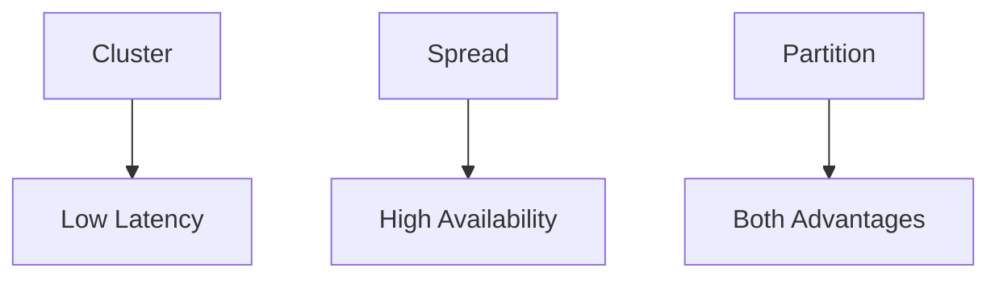

# Section 3: Elastic Compute Cloud (EC2)

<details open>
<summary><b>Section 3: Elastic Compute Cloud (EC2) (CL-KK-Terminal)</b></summary>

## Table of Contents
- [3.1 Introduction - Elastic Compute Cloud (EC2)](#31-introduction---elastic-compute-cloud-ec2)
- [3.10 Elastic IP](#310-elastic-ip)
- [3.11 Security Group Part 1](#311-security-group-part-1)
- [3.12 Security Group Part 2](#312-security-group-part-2)
- [3.13 Security Group Part 3](#313-security-group-part-3)
- [3.14 Security Group (Hands-On)](#314-security-group-hands-on)
- [3.15 User Data Script](#315-user-data-script)
- [3.16 Termination Protection](#316-termination-protection)
- [3.17 EC2 Instance Placement Group](#317-ec2-instance-placement-group)
- [3.18 AWS Tenancy](#318-aws-tenancy)
- [3.19 EC2 Instance Purchase Options Part 1](#319-ec2-instance-purchase-options-part-1)
- [3.20 EC2 Instance Purchase Options Part 2](#320-ec2-instance-purchase-options-part-2)
- [3.21 EC2 Instance Purchase Options Part 3](#321-ec2-instance-purchase-options-part-3)
- [3.22 AWS Pricing Calculator](#322-aws-pricing-calculator)
- [3.23 AWS Command Line Interface (CLI) (Hands-On)](#323-aws-command-line-interface-cli-hands-on)
- [3.2 Create Windows EC2 Instance (Hands-On)](#32-create-windows-ec2-instance-hands-on)
- [3.3 Create EC2 Linux Instance Using Windows 10 (Hands-On)](#33-create-ec2-linux-instance-using-windows-10-hands-on)
- [3.4 Create EC2 Linux Instance Using Windows 7 & 8 Hands-On)](#34-create-ec2-linux-instance-using-windows-7--8-hands-on)
- [3.5 Amazon Machine Image (AMI)](#35-amazon-machine-image-ami)
- [3.6 Customize Amazon Machine Image (AMI) (Hands-On)](#36-customize-amazon-machine-image-ami-hands-on)
- [3.7 EC2 Instance Type](#37-ec2-instance-type)
- [3.8 Multi - AZ](#38-multi---az)
- [3.9 Public Private IP](#39-public-private-ip)

## 3.1 Introduction - Elastic Compute Cloud (EC2)

### Overview
EC2 (Elastic Compute Cloud) is AWS's platform for creating and managing virtual machines, enabling on-demand scaling of compute resources without managing underlying physical hardware. It leverages virtualization to create isolated virtual machines (guests) on physical hosts, allowing multiple operating systems to run simultaneously. This provides a secure, cost-effective way to deploy applications with flexibility in hardware selection.

### Key Concepts/Deep Dive
- **Physical vs. Virtual Machines**: Traditional physical servers limit one operating system per machine, wasting capacity. Virtualization via hypervisors (e.g., VMware ESXi, Hyper-V) enables multiple VMs on one physical host, sharing CPU, memory, and storage.
- **VM Components**: Host (physical hardware managed by AWS), Guest (virtual machines created by users). AWS handles hypervisor infrastructure; users focus on OS installation and applications.
- **EC2 Benefits**: Eliminates need for hardware knowledge; provides elastic scaling; secure isolation between instances.
- **Networking Basics**: Internet traffic uses TCP, UDP, or ICMP. Ports (e.g., 80 for HTTP, 22 for SSH) identify services. Security groups filter traffic to prevent overload from unauthorized requests.

### Lab Demos
No specific lab in transcript, but practical involves creating EC2 instances using AWS console, selecting AMIs, and verifying configurations.

## 3.10 Elastic IP

### Overview
Elastic IP is a static public IP address that can be associated with an EC2 instance, ensuring a fixed IP even after stops/restarts, unlike dynamic public IPs that change. It addresses the need for consistent endpoints but incurs additional charges when not in use or reserved.

### Key Concepts/Deep Dive
- **Public vs. Elastic IP**: Public IPs are dynamic and release upon stop; Elastic IPs are static and reusable across instances.
- **AWS Rationale**: Reclaims IPs on stop for efficiency, charges for reservation to maintain static allocation.
- **Lifecycle**: Allocate from EC2 console, associate with instance, disassociate/reserve until release.
- **Costs**: Charged for unused Elastic IPs to discourage waste.

### Lab Demos
- Create EC2 instance with auto-assign public IP.
- Stop/start instance to observe IP changes.
- Allocate Elastic IP, associate it, verify persistence across restarts.
- Disassociate and release Elastic IP to avoid charges.

```
# Key commands summary
# Allocate Elastic IP
aws ec2 allocate-address --domain vpc

# Associate Elastic IP
aws ec2 associate-address --instance-id <instance-id> --allocation-id <allocation-id>

# Disassociate and release
aws ec2 disassociate-address --association-id <assoc-id>
aws ec2 release-address --allocation-id <alloc-id>
```

## 3.11 Security Group Part 1

### Overview
Security groups act as virtual firewalls, controlling inbound/outbound traffic to EC2 instances based on protocols (TCP, UDP, ICMP) and ports. They define rules to allow specific traffic, such as web traffic on port 80, preventing unauthorized access and system overload.

### Key Concepts/Deep Dive
- **Traffic Types**: TCP (e.g., HTTP on 80, HTTPS on 443), UDP (e.g., DNS on 53), ICMP (e.g., ping).
- **Well-Known Ports**: Ranges 0-1023 (e.g., FTP 21, SSH 22, HTTP 80); Registered 1024-49151; Dynamic 49152-65535.
- **Port Communication**: Source/destination works bidirectionally; client initiates with random high port, server responds on established ports.

### Tables
| Protocol | Port | Purpose |
|----------|------|---------|
| TCP      | 80   | HTTP    |
| TCP      | 443  | HTTPS   |
| TCP      | 22   | SSH     |
| UDP      | 53   | DNS     |

## 3.12 Security Group Part 2

### Overview
Security groups manage traffic rules for EC2 instances, with default behaviors: no inbound rules on creation, but allow all outbound. They attach to network interfaces, supporting multiple groups per instance and multiple instances per group. Stateful design tracks connections for efficient response handling.

### Key Concepts/Deep Dive
- **Default Rules**: VPC default group allows all inbound/outbound internally; EC2 custom groups: no inbound, all outbound.
- **Stateful Behavior**: Allows return traffic without explicit rules for initiated connections.
- **Management**: Multi-instance/multi-group support for flexible security.

> [!IMPORTANT]
> Security groups are compulsory; attach to network interface; deny by default, explicitly allow specific traffic.

## 3.13 Security Group Part 3

### Overview
Security groups operate statefully, permitting return traffic from connections the instance initiates, even without inbound rules. This prevents complex deny-based configurations while ensuring security for outbound-initiated flows.

### Key Concepts/Deep Dive
- **Stateful Logic**: Tracks connection state; allows replies to outbound requests automatically.
- **Example**: Initiating HTTP request outbound allows inbound response without explicit rule.

```diff
- Restriction: No inbound ICMP allows outbound ping but no response.
+ Stateful Benefit: Outbound-initiated traffic enables replies without extra rules.
```

## 3.14 Security Group (Hands-On)

### Overview
Hands-on creation and configuration of security groups in AWS console, demonstrating inbound/outbound rule addition, including security group IDs for inter-instance access. Covers practical port management for RDP, SSH, HTTP, and ICMP.

### Key Concepts/Deep Dive
- **Creation**: Via EC2 console or during instance launch; inbound none by default.
- **Rules Addition**: Allow SSH (22), HTTP (80), ICMP; use source as IP or security group ID.
- **Inter-Group Access**: Reference security group IDs for internal communication without exposing public IPs.

### Lab Demos
- Create security group "my web SG" with no inbound rules.
- Add RDP (3389) from anywhere.
- Launch Windows EC2 with group; access via RDP.
- Enable HTTP (80); verify web access.
- Add SSH (22); test Linux access.
- Demonstrate group-referencing for backend access.

## 3.15 User Data Script

### Overview
User data scripts automate EC2 instance initialization upon launch, executing shell/PowerShell commands to install software like web servers without manual login. Ideal for auto-scaling, ensuring consistent deployments.

### Key Concepts/Deep Dive
- **Automation**: Supports shell scripts for Linux, PowerShell for Windows; runs once at boot.
- **Use Cases**: Pre-install apps; configure services; works with auto-scaling for uniform fleets.
- **Execution**: Input via advanced details in launch; processed by cloud-init.

```bash
# Example Linux user data
#!/bin/bash
yum update -y
yum install httpd -y
systemctl start httpd
echo "Welcome to Cloud Fox Hub" > /var/www/html/index.html
```

## 3.16 Termination Protection

### Overview
Enables termination protection to prevent accidental EC2 deletions, requiring explicit disable for removal. Supports per-instance enable during launch or post-creation.

### Key Concepts/Deep Dive
- **Purpose**: Avoid downtime from mistaken terminations.
- **Options**: Termination and stop protection; enable/disable via EC2 actions.
- **Workaround**: Disable in console if needed.

> [!NOTE]
> Enable for critical instances; cannot delete VPC default group.

## 3.17 EC2 Instance Placement Group

### Overview
Placement groups control VM distribution across hardware for performance/availability: cluster for low-latency, spread for redundancy, partition for both. Applies to instance placement within AZs.

### Key Concepts/Deep Dive
- **Types**:
  - **Cluster**: Single rack for high-performance; risks total failure.
  - **Spread**: Multi-rasever for availability; limited to 7 instances/AZ.
  - **Partition**: Subdivided racks for balanced performance/redundancy; unlimited groups.



- **Limitations**: Region-unique; no merges; dedicated host incompatible.

## 3.18 AWS Tenancy

### Overview
Configures hardware sharing for EC2 instances: Shared (default, multi-tenant with AWS isolation), Dedicated Instance (dedicated host for your account), Dedicated Host (full physical control, includes BYOL).

### Key Concepts/Deep Dive
- **Shared**: Cost-effective; AWS manages all.
- **Dedicated Instance**: Isolated per account; extra cost.
- **Dedicated Host**: Direct hardware access; for compliance/BYOL; highest cost.

> [!IMPORTANT]
> Use dedicated for security; shared is fine for non-critical apps.

## 3.19 EC2 Instance Purchase Options Part 1

### Overview
EC2 pricing models: On-Demand (pay-per-use), Spot (bid-based discounts), Reserved (commitments for discounts), Saving Plans (flexible compute discounts).

### Key Concepts/Deep Dive
- **On-Demand**: Full flexibility; highest cost.
- **Spot Instances**: Interruptible; up to 90% savings; for fault-tolerant workloads.
- **Reserved Instances**: Standard/Convertible; up to 72% savings; flexible sizes; assignable to savings.

```diff
+ Reserved Benefits: High discount with commitment.
- Spot Risk: Interruptible during capacity changes.
```

### Tables
| Model | Duration | Savings | Flexibility |
|-------|----------|---------|-------------|
| On-Demand | Per second | Low | High |
| Spot | Variable | Up to 90% | Low |
| Reserved/Saving Plans | 1-3 years | Up to 72% | Medium/High |

## 3.20 EC2 Instance Purchase Options Part 2

### Overview
Comparison of purchase models: Spot is interruptible/auto-terminated; Reserved/Savings Plans commit for discounts; Saving Plans offer system and size flexibility.

### Key Concepts/Deep Dive
- **Changeability**: Standard RI unchangeable; Convertible allows OS/arch; Savings Plans allow region/family/OS.
- **Interruptibility**: Spot only; others stable.
- **Scheduling**: Reserved Scheduled for predictable plans.

## 3.21 EC2 Instance Purchase Options Part 3

### Overview
Practical configuration: Use on-demand/spot via launch console; RI/Savings Plans via EC2 console; Purchasing via dedicated interfaces.

### Lab Demos
- Launch on-demand/spot with tenancy/bidding.
- Configure RI for region/OS; add savings plans.

> [!NOTE]
> Savings Plans supersede RI for compute/EC2 flexibility.

## 3.22 AWS Pricing Calculator

### Overview
Tool estimates AWS costs per service/region; input instance type/OS to view pricing across models (on-demand/spot/reserved). Supports forecast and export for planning.

### Key Concepts/Deep Dive
- **Usage**: Search EC2, configure specs; compare costs.
- **Output**: Detailed breakdowns; save estimates.

## 3.23 AWS Command Line Interface (CLI) (Hands-On)

### Overview
CLI manages AWS via commands; install/setup via AWS docs; configure with access keys; create/modify EC2 instances.

### Key Concepts/Deep Dive
- **Setup**: Install AWS CLI; configure with credentials.
- **Commands**: Use bash for cross-platform; query for instance data.

### Lab Demos
- Configure CLI with access/secret keys.
- Create security group, VPC keypair, AMIs.
- Launch/list/terminate EC2 with CLI.

```bash
# Configure CLI
aws configure

# Create instances
aws ec2 run-instances --image-id ami-12345 --instance-type t2.micro --security-group-ids sg-123ab

# List instances
aws ec2 describe-instances
```

## 3.2 Create Windows EC2 Instance (Hands-On)

### Overview
Step-by-step AWS console creation of Windows EC2 with AMI selection, instance type, key pair, and networking. Demonstrates RDP access and AMI/password management.

### Key Concepts/Deep Dive
- **AMI Selection**: Free-tier Windows 2019-2022 base; avoid cost-overruns.
- **Key Pairs**: RSA/Ed25519; download PP4P for Windows 7/8; PEM for modern systems.
- **Networking**: VPC/AZ/auto-PIP; security groups (RDP/SSH allowed by default).

### Lab Demos
- Launch Windows 2019/2022 t2.micro; select key pair.
- Enable auto-PIP/P ports; create/join RDP via public IP.
- Decode password with private key; manage via RDP.

## 3.3 Create EC2 Linux Instance Using Windows 10 (Hands-On)

### Overview
Create Linux EC2 (Amazon Linux) via console; use SSH for access; auto-configures security (SSH allowed); demo for Windows 10+ users.

### Key Concepts/Deep Dive
- **AMI**: Amazon Linux (ec2-user); free-tier eight GB.
- **Access**: SSH with PEM key; permissions via chmod.

### Lab Demos
- Launch Amazon Linux t2.micro; download PEM key.
- SSH: ssh -i key.pem ec2-user@public-ip; install httpd.
- Terminate post-test.

```bash
chmod 400 cloud-fox-linux-key.pem
ssh -i cloud-fox-linux-key.pem ec2-user@public-ip
```

## 3.4 Create EC2 Linux Instance Using Windows 7 & 8 Hands-On

### Overview
Create Linux EC2 for Windows 7/8 users; use PuTTY/PP4P for SSH access; mirrors Windows procedure but with key conversion.

### Key Concepts/Deep Dive
- **PPK Keys**: Convert/download for PuTTY compatibility.
- **Access**: Import PPK; connect via IP/username.

### Lab Demos
- Select PPK during creation; launch instance.
- Launch PuTTY; load PPK; connect to public IP as ec2-user.

## 3.5 Amazon Machine Image (AMI)

### Overview
AMIs are pre-configured templates with OS, apps, configs for EC2 launches. Support rapid deployment, custom builds, disaster recovery via straightforward replication.

### Key Concepts/Deep Dive
- **Use Cases**: Environment cloning; disaster recovery; marketplace AMIs.
- **Types**: EBS-root (persistent) or instance-store (ephemeral); ARM/x86.

```mermaid
graph LR
    Template --> Deploy[Rapid Deploy]
    Template --> Clone[Clone Environments]
    Template --> Recovery[Disaster Recovery]

## 3.6 Customize Amazon Machine Image (AMI) (Hands-On)

### Overview
Create custom AMI from configured EC2; launch identical clones; demonstrate multi-instance deployment without repetition.

### Key Concepts/Deep Dive
- **Process**: Configure instance (e.g., web/DHCP); create/stop instance; build AMI.
- **Deployment**: Launch copies; note shared configs across regions via copy.

### Lab Demos
- Configure Windows 2019 with web/DHCP services.
- Change admin password; create AMI.
- Launch 3+ instances from AMI; verify identical configs via RDP.

> [!WARNING]
> Reset passwords pre-AMI; custom AMIs per-region only.

## 3.7 EC2 Instance Type

### Overview
Instance types define compute resources (vCPUs, RAM) per generation/purpose: general (t/m), compute (c), memory (r/x), storage (d/i/h), GPU (g/p), accelerated (f/trn), bare-metal (a/z).

### Key Concepts/Deep Dive
- **Naming Convention**: E.g., t3.micro (general-purpose, third gen, small).
- **Hardware Virtualization**: HV for most; Nitro for bypass/direct access.

```diff
+ Nitro Benefit: Enhanced security/performance via direct hardware.
- Bare-Metal Limitation: No hypervisor; direct access only.
```

## 3.8 Multi - AZ

### Overview
Distribute instances across availability zones for redundancy/availability; selectable during launch; balances high availability with cost.

### Key Concepts/Deep Dive
- **Strategy**: Single AZ for non-critical; multi-AZ for downtime-intolerant apps (e.g., databases).
- **Risk Management**: Minimal multi-AZ failure; cost trade-off for backups.

> [!IMPORTANT]
> Prioritize multi-AZ for production; plan instances/AZ distribution.

## 3.9 Public Private IP

### Overview
Public IPs enable internet access/RDP/SSH; private IPs for internal communication. Routable externally vs. internally; charged for unused public.
// Assigned via launch;bastion hosts for private-only access.

### Key Concepts/Deep Dive
- **Ranges**: Private (10/172/192.168.*); public from AWS.
- **Security**: Minimize public IPs; use bastion for remote management.

### Lab Demos
- launch one public, one private instance.
- RDP/SSH public instance.
- RDP private via public bastion using private IP.

## Summary

### Key Takeaways
```diff
+ EC2 enables scalable VM deployment via virtualization/hypervisors.
- Public IPs dynamic; Elastic IPs for static, charged idle.
! Stateful security groups allow replies to initiated outbound.
+ AMI customization automates consistent deploys.
- Spot instances cost-saving but interruptible.
+ Multi-AZ boosts availability for critical apps.
+ User data scripts bootstrap instances automagically.
```

### Quick Reference
- **Create Instance**: AWS console/EC2 CLI; select AMI/type/security.
- **Security Group**: Inbound e.g., 80 TCP HTTP; outbound all.
- **AMI Custom**: Configure instance; create image; launch from it.
- **Elastic IP**: Allocate/associate; release to avoid fees.
- **CLI**: aws ec2 run-instances --image-id ami-123 --instance-type t2.micro.

### Expert Insight
**Real-world Application**: Use spot for big data/MapReduce; RI for steady-state databases; multi-AZ for web apps with load balancing.  
**Expert Path**: Master Nitro-based instances for high-I/O; explore EBS-Optimized types.  
**Common Pitfalls**: Ignoring termination protection; over-allocating public IPs; neglecting stateful security (e.g., failing to allow replies).

</details>
