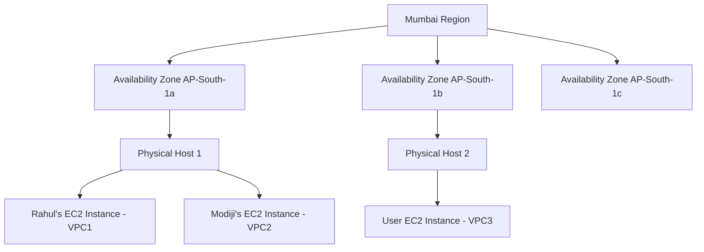
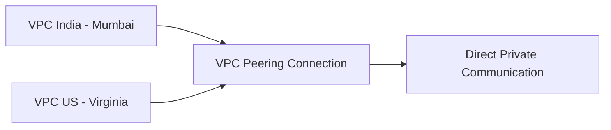
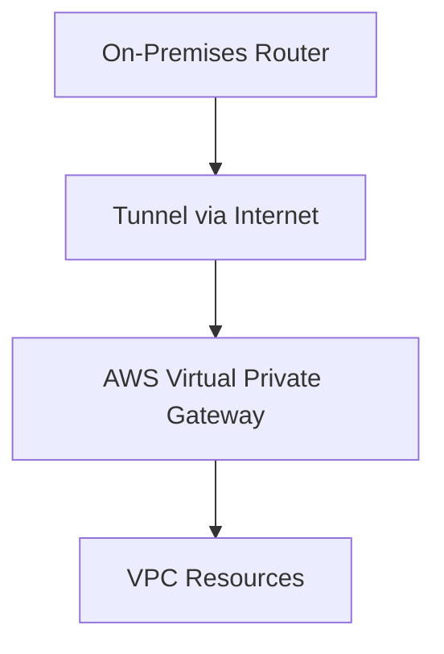
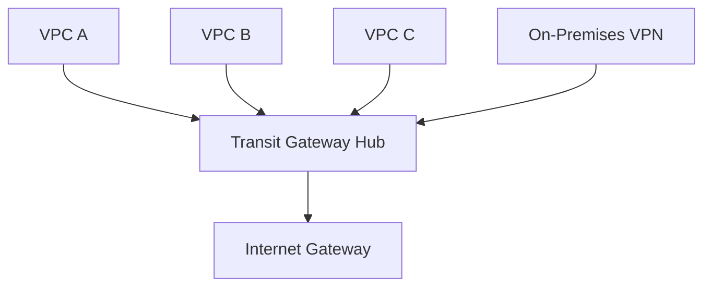
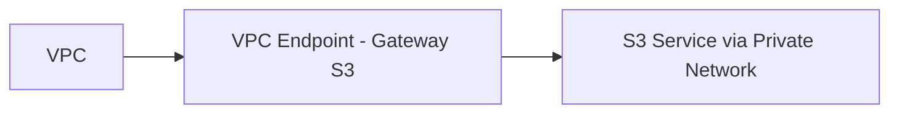
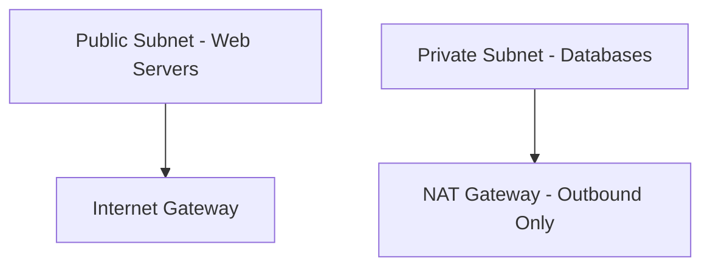

# Section 5: VPC

<details open>
<summary><b>Section 5: VPC (CL-KK-Terminal)</b></summary>

# Section 5: VPC

## Table of Contents
- [5.1 Introduction Of Virtual Private Cloud (VPC)](#51-introduction-of-virtual-private-cloud-vpc)
- [5.10 VPC Peering Connection (Hands-on)](#510-vpc-peering-connection-hands-on)
- [5.11 VPC Access Control List (ACL) (Hands-On)](#511-vpc-access-control-list-acl-hands-on)
- [5.12 Security Group V-S Access Control List (Hands-on)](#512-security-group-v-s-access-control-list-hands-on)
- [5.13 Stateless Vs Stateful](#513-stateless-vs-stateful)
- [5.14 Virtual Private Network (VPN)](#514-virtual-private-network-vpn)
- [5.15 Virtual Private Network (VPN) (Hands-On)](#515-virtual-private-network-vpn-hands-on)
- [5.16 AWS Direct Connect (Hands-On)](#516-aws-direct-connect-hands-on)
- [5.17 VPC Transit Gateway](#517-vpc-transit-gateway)
- [5.18 VPC Transit Gateway (Hands-on)](#518-vpc-transit-gateway-hands-on)
- [5.19 VPC Endpoint](#519-vpc-endpoint)
- [5.20 VPC Endpoint Services - Private Link (Hands-On)](#520-vpc-endpoint-services---private-link-hands-on)
- [5.21 DHCP Option Sets (Hands-On)](#521-dhcp-option-sets-hands-on)
- [5.22 VPC Flow Log (Hands-On)](#522-vpc-flow-log-hands-on)
- [5.23 Managed Prefix List Part 1 (Hands-On)](#523-managed-prefix-list-part-1-hands-on)
- [5.24 Managed Prefix List Part 2 (Hands-On)](#524-managed-prefix-list-part-2-hands-on)
- [5.2 How To Create VPC Part 1 (Live Hands-On)](#52-how-to-create-vpc-part-1-live-hands-on)
- [5.3 How To Create VPC -- Subnets Part 2 (Hands-On)](#53-how-to-create-vpc---subnets-part-2-hands-on)
- [5.4 How To Create VPC -- Internet Gateway & Route Table Part 3 (Hands-On)](#54-how-to-create-vpc---internet-gateway--route-table-part-3-hands-on)
- [5.5 How To Create VPC -- VPC 2-Tire Architecture Part 4](#55-how-to-create-vpc---vpc-2-tire-architecture-part-4)
- [5.6 How To Create VPC - Create Public Subnet And Private Subnet Part 5 Hands-On](#56-how-to-create-vpc---create-public-subnet-and-private-subnet-part-5-hands-on)
- [5.7 How To Create VPC -- Public Subnet And Private Subnet Part 6 (Hands-On)](#57-how-to-create-vpc---public-subnet-and-private-subnet-part-6-hands-on)
- [5.8 How To Create VPC -- NAT Gateway Part 7 (Hand-On)](#58-how-to-create-vpc---nat-gateway-part-7-hand-on)
- [5.9 How To Create VPC -- Summary Part 1 To 7](#59-how-to-create-vpc---summary-part-1-to-7)

## 5.1 Introduction Of Virtual Private Cloud (VPC)

### Overview
This section introduces Virtual Private Cloud (VPC) as AWS's service for logically isolating user resources within shared physical infrastructure. It explains how VPC prevents resources from different users in the same availability zone from accessing each other, using examples of EC2 instances sharing physical hosts but remaining isolated via separate VPCs.

### Key Concepts
- **VPC Basics**: AWS provides a default VPC per region for easy resource creation, but custom VPCs are designed for production needs with components like internet gateways, NAT gateways, and security groups.
- **Resource Isolation**: Even on shared physical hosts, resources in different VPCs cannot communicate, ensuring security.
- **Custom VPC Requirements**: For complex setups like Swiggy/Zomato, custom VPC design is needed; default VPCs suffer limitations in scalability and security.

### Overview Diagram


> [!NOTE]
> AWS creates a default VPC in each region automatically when accounts are set up.
> 
> > [!IMPORTANT]
> Deleting the default VPC removes the ability to launch EC2 instances without custom VPC setup.

## 5.10 VPC Peering Connection (Hands-on)

### Overview
VPC peering allows communication between VPCs, even across regions or accounts, enabling scalable cloud architectures. Peering establishes a direct, private connection without requiring internet gateways, facilitating hybrid or multi-VPC setups.

### Key Concepts
- **Peering Setup**: Involves requester and acceptor VPCs; request accepted by the other party. Requires non-overlapping CIDR ranges.
- **Connectivity**: Once peered, instances ping each other via private IPs. Delete peering removes connectivity.
- **Access Methods**: Use VPC endpoints for access to private-subnet EC2 instances without public IPs.

### Lab Demos
1. Create VPCs in different regions with distinct CIDR blocks (e.g., 10.0.0.0/24 vs. 192.168.1.0/24).
   ```bash
   # Create VPC Peering Request
   aws ec2 create-vpc-peering-connection \
     --vpc-id vpc-requester-id \
     --peer-vpc-id vpc-acceptor-id \
     --peer-region us-east-1
   ```
2. Accept peering in the target region.
   ```bash
   aws ec2 accept-vpc-peering-connection --vpc-peering-connection-id pcx-1234567890abcdef
   ```
3. Update route tables in both VPCs to route traffic via the peering connection.
   ```bash
   # Add route in requester VPC
   aws ec2 create-route --route-table-id rt-requester-table \
     --destination-cidr-block 192.168.1.0/24 \
     --vpc-peering-connection-id pcx-1234567890abcdef
   ```

### Overview Diagram


> [!NOTE]
> Peering connections do not support transitive routing (non-peered VPCs can't communicate via a peered VPC).
> 
> > [!IMPORTANT]
> Overlapping CIDR blocks block peering establishment.

## 5.11 VPC Access Control List (ACL) (Hands-On)

### Overview
Network Access Control Lists (NACLs) secure entire subnets at the subnet level, complementing security groups which protect individual instances. Default NACL allows all traffic, but custom NACLs enable deny rules for granular control.

### Key Concepts
- **NACL vs. Security Group**: NACL protects subnets, applies in sequence by rule number (lower numbers first). Security groups stateless, allow-only, apply simultaneously.
- **Rule Addition**: Lower rule numbers have higher priority. Use incremental numbers for new rules.
- **Deny Rules**: Allow custom denies, e.g., block HTTP from specific IPs while allowing others.

### Lab Demos
1. Create NACL, associate with subnet.
   ```bash
   # Create NACL
   aws ec2 create-network-acl --vpc-id vpc-12345678

   # Associate with subnet
   aws ec2 create-network-acl-entry --network-acl-id acl-12345678 \
     --rule-number 100 \
     --protocol tcp \
     --cidr-block 0.0.0.0/0 \
     --port-range From=80,To=80 \
     --rule-action allow
   ```
2. Test: Block specific IPs via deny rules.
   ```diff
   ! Rule Priority: Low rule number first
   + Inbound HTTP from specific IP: Allow
   - Inbound HTTP from blocked IP: Deny
   ```

### Tables
| Rule Number | Type      | Protocol | Port Range | Source/Destination | Action |
|-------------|-----------|----------|------------|---------------------|--------|
| 100         | Inbound   | TCP      | 80         | 0.0.0.0/0          | Allow  |
| 200         | Inbound   | TCP      | 22         | 0.0.0.0/0          | Allow  |
| 400         | Inbound   | TCP      | 80         | Specific IP/32      | Deny   |

> [!NOTE]
> NACL changes apply immediately but test thoroughly.
> 
> > [!IMPORTANT]
> Stateless nature requires outbound rules mirroring inbound for stateful protocols.

## 5.12 Security Group V-S Access Control List (Hands-on)

### Overview
Compares security groups (stateless, allow-only, instance-level) vs. NACLs (stateless, allow/deny, subnet-level). Security groups simpler for instance protection; NACLs for subnet-wide filtering.

### Key Concepts
- **Security Group Features**: Stateful, allow-only, apply simultaneously after instance attachment.
- **NACL Features**: Stateless, rule-number priority, subnet association, allows denies.
- **Best Practices**: Use security groups for instance security, NACLs for subnet isolation.

### Lab Demos
1. Update security groups with new CIDR blocks manually.
2. Use NACL for subnet-wide denies.

### Tables
| Feature              | Security Group            | NACL                          |
|----------------------|---------------------------|-------------------------------|
| State                | Stateful                  | Stateless                     |
| Rules Application    | Simultaneous              | Sequential by rule number     |
| Attach Location      | ENI/EC2                    | Subnet                        |
| Rule Types           | Allow-only                 | Allow/Deny                    |
| Priority             | Based on allow/deny        | Rule number (lower higher)    |
| Use Case             | Instance-level protection  | Subnet-level isolation        |

> [!WARNING]
> Security group denies automatically from "allow" focus; NACLs need explicit denies.

## 5.13 Stateless Vs Stateful

### Overview
Explains stateless firewalls (check every packet individually) vs. stateful (track session state, allow returns automatically), crucial for understanding security groups (stateful) vs. NACLs (stateless).

### Key Concepts
- **Stateful**: Remembers initiating traffic, auto-allows responses (e.g., security groups reduce rules).
- **Stateless**: Checks each packet, requires explicit inbound/outbound rules (e.g., NACLs).
- **Administrative Burden**: Stateful more efficient for dynamic protocols.

### Linear Process
```diff
! Outbound from EC2 (initiated) → Stateful FW allows return traffic
! Outbound from EC2 (initiated) → Stateless FW requires explicit return rules
+ Stateful: Lower administrative overhead
- Stateless: Higher rule complexity
```

> [!NOTE]
> Security groups considered simpler due to statefulness; NACLs for specific port blocking.

## 5.14 Virtual Private Network (VPN)

### Overview
VPN enables secure site-to-site connections between on-premises networks and AWS VPCs via internet, using IPsec encryption. Essential for hybrid clouds, connecting offices/branch offices to VPCs privately.

### Key Concepts
- **VPN Components**: Customer Gateway (on-premises), Virtual Private Gateway (AWS), Site-to-Site VPN Connection.
- **Security**: "Leased line" alternative, using public IPs but encrypted tunnels.
- **Scalability**: Builds multi-VPC communication foundations.

### Overview Diagram


> [!NOTE]
> VPN creates secure tunnels for private network extension.
> 
> > [!IMPORTANT]
> Static public IP required for customer gateway.

## 5.15 Virtual Private Network (VPN) (Hands-On)

### Overview
Hands-on setup of site-to-site VPN between on-premises (Cisco router) and AWS VPC, enabling private communication between offices and cloud resources without exposing to public internet.

### Key Concepts
- **Setup Steps**: Customer Gateway → Virtual Private Gateway → Site-to-Site VPN → Route Updates.
- **Routing**: Adjust VPC/subnet route tables for tunnel traffic.
- **Verification**: Ping via private IPs post-configuration.

### Lab Demos
1. Create Customer Gateway with public IP.
   ```bash
   aws ec2 create-customer-gateway --ip-address 12.34.56.78 --type ipsec.1 --bgp-asn 65000
   ```
2. Attach Virtual Private Gateway to VPC.
   ```bash
   aws ec2 create-vpn-gateway --type ipsec.1
   aws ec2 attach-vpn-gateway --vpc-id vpc-12345678 --vpn-gateway-id vgw-1234abcd
   ```
3. Establish VPN Connection with route-based static routing.
   ```bash
   aws ec2 create-vpn-connection --customer-gateway-id cgw-12345678 \
     --vpn-gateway-id vgw-1234abcd --type ipsec.1 \
     --static-routes-only \
     --options '{"StaticRoutesOnly": true}'
   ```
4. Update VPC route table to route on-premises CIDR via VPG.
   ```bash
   aws ec2 create-route --route-table-id rt-12345678 \
     --destination-cidr-block 192.168.0.0/24 \
     --gateway-id vgw-1234abcd
   ```
5. Insert downloaded config into Cisco router.

> [!WARNING]
> Delete VPN components to avoid charges post-testing.

## 5.16 AWS Direct Connect (Hands-On)

### Overview
AWS Direct Connect provides dedicated, low-latency connectivity between on-premises and AWS via fiber optics, bypassing internet for higher security and speed (up to 100 Gbps).

### Key Concepts
- **Alternatives**: VPN (internet-based) vs. Direct Connect (private fiber).
- **Reliability**: Higher uptime, consistent performance, no IPsec overhead.
- **Setup**: Partner with AWS-approved providers; order connection port.

### Lab Demos
1. Request Direct Connect location and partner-handled connection.
2. Create Virtual Interfaces (Public/Private) for VPC access.

### Tables
| Feature              | VPN                          | Direct Connect               |
|----------------------|------------------------------|-----------------------------|
| Connectivity         | Internet-based               | Dedicated fiber             |
| Latency              | Variable                     | Low/consistent              |
| Scalability          | Up to 1.25 Gbps              | Up to 100 Gbps              |
| Encryption           | IPsec                        | Dedicated link (no enc.)    |
| Cost                 | Based on data transfer       | Port + data                  |

> [!WARNING]
> Physical setup requires AWS partner; no hands-on config in console.

## 5.17 VPC Transit Gateway

### Overview
Transit Gateway (TGW) centralizes connectivity for multiple VPCs, on-premises, and AWS services, eliminating complex peering by acting as a hub for scalable architectures.

### Key Concepts
- **Hub-and-Spoke**: Attaches VPCs, VPNs, Direct Connect; routes traffic via TGW.
- **Scalability**: Replaces n(n-1)/2 peering with hub model; supports cross-account/region.
- **Attachments**: VPC, VPN, Transit Gateway Connect, Peering.

### Overview Diagram


> [!NOTE]
> Separate TGWs for different regions/accounts; 5-cidr limit, 200 transit gateway per region.

## 5.18 VPC Transit Gateway (Hands-on)

### Overview
Hands-on TGW setup for multi-VPC connectivity using router table entries, demonstrating hub-based routing without individual peerings.

### Key Concepts
- **Multi-VPC Peering**: Four VPCs peered via TGW instead of 6 connections.
- **Route Propagation**: Update route tables for TGW targets.

### Lab Demos
1. Create TGW.
   ```bash
   aws ec2 create-transit-gateway --description "My TGW"
   ```
2. Attach VPCs to TGW.
   ```bash
   aws ec2 create-transit-gateway-vpc-attachment \
     --vpc-id vpc-12345678 \
     --subnet-ids subnet-12345678 \
     --transit-gateway-id tgw-12345678
   ```
3. Update VPC route tables with TGW targets.
   ```bash
   aws ec2 create-route --route-table-id rt-12345678 \
     --destination-cidr-block 10.0.0.0/16 \
     --transit-gateway-id tgw-12345678
   ```

> [!IMPORTANT]
> Ensure non-overlapping CIDRs; delete unattached resources to avoid charges.

## 5.19 VPC Endpoint

### Overview
VPC Endpoints enable private connectivity from VPC to supported AWS services without internet, using AWS PrivateLink. Improves security by avoiding public internet for S3/DynamoDB.

### Key Concepts
- **Types**: Interface (most services), Gateway (S3/DynamoDB).
- **Benefits**: Private, scalable, redundant; Gateway modifies route tables.
- **Privatelink**: Foundation for secure cross-resource communication.

### Overview Diagram


> [!NOTE]
> Practicals for Endpoints covered in S3/DynamoDB sections; no dedicated hands-on needed here.

## 5.20 VPC Endpoint Services - Private Link (Hands-On)

### Overview
VPC Endpoint Services expose custom services across VPCs using AWS PrivateLink; VPC Endpoints consumed privately. Ideal for service provider/consumer models.

### Key Concepts
- **Cross-VPC Access**: Service in one VPC, consumers in others via private links.
- **NLB Requirement**: Endpoint Services use Network Load Balancer for service exposure.
- **Permissions**: Service provider manages access; consumers create connected Endpoints.

### Lab Demos
- Create Endpoint Service via NLB (covered in later load balancer series).

> [!NOTE]
> Ideal for cross-account service sharing without internet exposure.

## 5.21 DHCP Option Sets (Hands-On)

### Overview
DHCP Option Sets customize DNS servers, domain names, NTP, and more, applied at VPC level for EC2 instances. Replaces defaults for custom networks.

### Key Concepts
- **Options**: Domain name, DNS servers, NTP, NetBIOS.
- **Association**: VPC-level; defaults to AWS options.
- **Renewal**: Requires IP release/renew for new options.

### Lab Demos
1. Create custom DHCP options.
   ```bash
   aws ec2 create-dhcp-options \
     --dhcp-configurations "Key=domain-name-servers,Values=8.8.8.8" \
     "Key=domain-name,Values=example.com"
   ```
2. Associate with VPC.
   ```bash
   aws ec2 associate-dhcp-options --vpc-id vpc-12345678 --dhcp-options-id dopt-12345678
   ```

> [!NOTE]
> Modifications require IP renewal on instances.

## 5.22 VPC Flow Log (Hands-On)

### Overview
VPC Flow Logs capture IP traffic metadata for monitoring, troubleshooting, and compliance, logged to CloudWatch/S3/Kinesis.

### Key Concepts
- **Filters**: Accepted/Rejected/All traffic, 10-min intervals.
- **Granularity**: VPC, Subnet, ENI levels.
- **Formats**: Default fields; customizable.

### Lab Demos
1. Create Flow Log.
   ```bash
   aws ec2 create-flow-logs \
     --resource-ids vpc-12345678 \
     --traffic-type ACCEPT \
     --destination s3://bucket-name/ \
     --destination-type s3
   ```
2. Analyze: Logs include source/dest IPs, ports, actions.

> [!WARNING]
> High-volume VPCs generate large logs; monitor costs.

## 5.23 Managed Prefix List Part 1 (Hands-On)

### Overview
AWS Managed Prefix Lists simplify referencing service IP ranges; Customer Managed for custom ranges. Reduces security group/route table complexity via managed lists.

### Key Concepts
- **AWS Managed**: Non-editable IP lists for services like S3/CloudFront.
- **Customer Managed**: User-defined, editable lists.
- **Associations**: Security groups, route tables, Transit Gateways.

### Lab Demos
1. Create Customer Managed Prefix List.
   ```bash
   aws ec2 create-managed-prefix-list \
     --prefix-list-name "MyPrefixList" \
     --max-entries 50 \
     --entries Cidr=10.0.0.0/16,Description="Office network"
   ```

> [!NOTE]
> AWS Managed lists auto-update; Customer allows sharing.

## 5.24 Managed Prefix List Part 2 (Hands-On)

### Overview
Dives into AWS Managed Prefix Lists for outbound rules (e.g., S3 access), and weight limits for associations.

### Key Concepts
- **Outbound Focus**: Ideal for allowing traffic to AWS services.
- **Weight**: CIDR count (e.g., 55 for CloudFront) affects quotas.
- **Restrictions**: AWS lists non-editable, read-only.

### Tables
| Action | AWS Managed Prefix List | Customer Managed Prefix List |
|--------|--------------------------|-----------------------------|
| Edit   | No                       | Yes                         |
| Share  | No                       | Yes                         |
| Use    | Outbound rules           | Inbound/Outbound            |
| Update | Auto                     | Manual                      |

> [!WARNING]
> High-weight lists (e.g., CloudFront) consume security group slots; request increases if needed.

## 5.2 How To Create VPC Part 1 (Live Hands-On)

### Overview
Demonstrates VPC creation with custom CIDR (192.168.0.0/24), subnet allocation, and EC2 launch confirmation.

### Key Concepts
- **CIDR Allocation**: Private ranges preferred; AWS reserves IPs in subnets.
- **Subnet Calculation**: Subnet calculators determine divisions.
- **Validation**: VPC creation enables EC2 launches.

### Lab Demos
1. Create VPC via AWS console.
   ```bash
   aws ec2 create-vpc --cidr-block 192.168.0.0/24
   ```
2. Attempt EC2 launch without VPC/subnet (fails).

## 5.3 How To Create VPC -- Subnets Part 2 (Hands-On)

### Overview
Explains subnet creation within availability zones, using different CIDR blocks for redundancy. Introduces IPO allocation strategies.

### Key Concepts
- **AZ Scope**: Subnets per AZ; redistribute VPC IPs via new subnets.
- **IP Redistribution**: Delete/recreate for IP reuse.

### Lab Demos
1. Add CIDR to VPC for more subnets.
   ```bash
   aws ec2 modify-vpc-attribute --vpc-id vpc-12345678 \
     --enable-dns-hostnames true
   ```
2. Create subnets in different AZs.

## 5.4 How To Create VPC -- Internet Gateway & Route Table Part 3 (Hands-On)

### Overview
Attaches Internet Gateway for public connectivity, configures route tables for traffic routing, enabling public/private distinction.

### Key Concepts
- **IGW Attachment**: Required for internet access; public IP mandatory.
- **Route Table Editing**: Add 0.0.0.0/0 routes to IGW.

### Lab Demos
1. Attach IGW to VPC.
   ```bash
   aws ec2 attach-internet-gateway --vpc-id vpc-12345678 --internet-gateway-id igw-12345678
   ```
2. Update route table.
   ```bash
   aws ec2 create-route --route-table-id rt-12345678 \
     --destination-cidr-block 0.0.0.0/0 \
     --gateway-id igw-12345678
   ```

## 5.5 How To Create VPC -- VPC 2-Tire Architecture Part 4

### Overview
Introduces 2-tier VPC design (public for webservers, private for databases) with security implications and NAT gateway requirements.

### Key Concepts
- **Public Subnets**: Inbound/outbound internet; host webservers.
- **Private Subnets**: Outbound-only via NAT; secure databases.

### Overview Diagram


## 5.6 How To Create VPC - Create Public Subnet And Private Subnet Part 5 Hands-On

### Overview
Creates multiple subnets, route tables for public/private isolation. Associates subnets accordingly.

### Key Concepts
- **Route Table Separation**: Public RT with IGW; Private RT with (future) NAT.
- **Subnet Association**: Explicit associations ensure isolation.

### Lab Demos
1. Create Route Tables.
   ```bash
   aws ec2 create-route-table --vpc-id vpc-12345678
   ```
2. Associate subnets.
   ```bash
   aws ec2 associate-route-table --route-table-id rt-12345678 --subnet-id subnet-12345678
   ```

## 5.7 How To Create VPC -- Public Subnet And Private Subnet Part 6 (Hands-On)

### Overview
Explains bastion hosts (public EC2 for private-subnet access) and EC2 Instance Connect Endpoints for SSH access without keys.

### Key Concepts
- **Bastion Host**: Public proxy for private instances.
- **Endpoint Connect**: Console-based access for private EC2.
- **SCP for Keys**: Copy PEM to bastion for forwarding.

### Lab Demos
1. Create Endpoint for private access.
2. SCP key to bastion.
   ```bash
   scp -i key.pem key.pem ec2-user@bastion-ip:/home/ec2-user/
   ```
3. SSH from bastion to private.
   ```bash
   ssh -i key.pem ec2-user@private-ip
   ```

## 5.8 How To Create VPC -- NAT Gateway Part 7 (Hand-On)

### Overview
NAT Gateway provides outbound internet for private subnets without inbound exposure, placed in public subnet.

### Key Concepts
- **Outbound Only**: Internet updates/downloads without risks.
- **Public Subnet Placement**: Needs EIP for external communication.
- **Route Updates**: Private RT routes 0.0.0.0/0 to NAT.

### Lab Demos
1. Create NAT Gateway.
   ```bash
   aws ec2 create-nat-gateway --subnet-id public-subnet --allocation-id eipalloc-12345678
   ```
2. Update private RT.
   ```bash
   aws ec2 create-route --route-table-id rt-private \
     --destination-cidr-block 0.0.0.0/0 \
     --nat-gateway-id nat-12345678
   ```

> [!IMPORTANT]
> Delays EIP after NAT deletion; delete EIP separately.

## 5.9 How To Create VPC -- Summary Part 1 To 7

### Overview
Summarizes VPC components: definition, subnets, IGW, NGW, route tables with key limits and configurations.

### Key Concepts
- **VPC Limits**: 5 per region (soft); 5 CIDRs max; /16-/28 CIDR.
- **Subnet Limits**: 200 per VPC; per AZ; isolated via RT.
- **Additional Components**: IGW for public, NAT for private outbound.

### Quick Reference
- **VPC Creation**: VPC Console → Create VPC → CIDR Block.
- **Subnet Creation**: VPC Console → Subnets → Create → AZ Selection.
- **IGW**: VPC Console → Internet Gateways → Attach.
- **Route Tables**: Implicit auto-association; custom for separation.
- **NAT Gateway**: Public Subnet → Allocate EIP → Route Update.

### Expert Insight
**Real-world Application**: Hybrid clouds rely on VPCs for secure, isolated AWS resource management. Custom VPCs enable production scalability vs. defaults.

**Expert Path**: Master multi-AZ designs, peering, TGW for advanced architectures. Practice cost optimizations (e.g., NAT sizing).

**Common Pitfalls**: Overlapping CIDRs block peering; forget EIP deletion post-NAT; unclear public/private boundaries.

---

## Summary

### Key Takeaways
- **VPC Isolation**: Core for AWS security, separating resources via logical networks.
- **Subnet Design**: Public for external-facing, private for secured internals.
- **Gateways**: IGW for full internet; NAT for outbound-only.
- **Connectivity Options**: Peering, TGW, VPN, Direct Connect for hybrid/multi-VPC.

### Quick Reference
- **Create VPC**: CIDR 10.0.0.0/16 (private preferred).
- **Subnets**: Divide CIDR per AZ; associate with RTs.
- **IGW**: Attach for public access; requires public IPs.
- **NAT Gateway**: Public subnet for private outbound.
- **Peering**: Direct VPC connection; no CIDR overlap.
- **TGW**: Centralized hub for multi-VPC/at-content.
- **Endpoints**: Private service access (S3/DynamoDB).
- **Flow Logs**: Monitor traffic; store in S3/CW.

### Expert Insight
**Real-world Application**: VPC designs power enterprise clouds, enabling micro-segmentation for compliance and scalability.

**Expert Path**: Deep-dive VPC advanced features like Transit Gateways for global networks, firewall integrations.

**Common Pitfalls**: Ignoring CIDR planning leads to peering issues; unmanged resources incur costs; neglecting route table associations.

</details>
