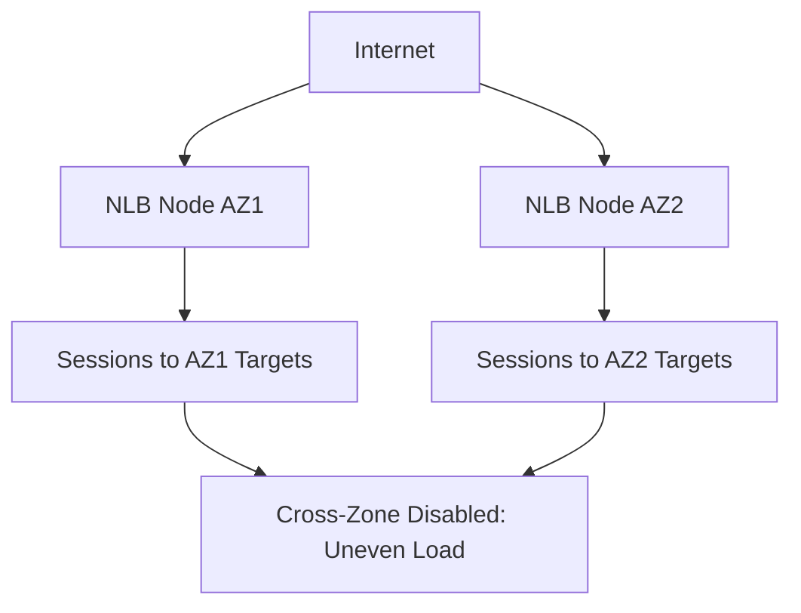

# Section 7: Load Balancers 

<details open>
<summary><b>Section 7: Load Balancers (CL-KK-Terminal)</b></summary>

## Table of Contents
- [7.1 Introduction Of Load Balancer](#71-introduction-of-load-balancer)
- [7.2 Load Balancer Terminology](#72-load-balancer-terminology)
- [7.3 Implementation Load Balancer Part 1 - VPC Design (Hands-On)](#73-implementation-load-balancer-part-1---vpc-design-hands-on)
- [7.4 Implementation Load Balancer Part 2 - SG Design (Hands-On)](#74-implementation-load-balancer-part-2---sg-design-hands-on)
- [7.5 Implementation Load Balancer Part 3 - Application Load Balancer](#75-implementation-load-balancer-part-3---application-load-balancer)
- [7.6 Path-based routing Vs Host-Based Routing Balancer (Hands-On)](#76-path-based-routing-vs-host-based-routing-balancer-hands-on)
- [7.7 Application Load Balancer Path Based Routing (Hands-On)](#77-application-load-balancer-path-based-routing-hands-on)
- [7.8 Application Load Balancer Host Based Routing (Hands-On)](#78-application-load-balancer-host-based-routing-hands-on)
- [7.9 Network Load Balancer](#79-network-load-balancer)
- [7.10 Network Load Balancer (Hands-On)](#710-network-load-balancer-hands-on)
- [7.11 Cross-Zone Load Balancing (Hands-On)](#711-cross-zone-load-balancing-hands-on)
- [7.12 Gateway Load Balancer](#712-gateway-load-balancer)
- [7.13 VPC Ingress Routing For Gateway Load Balancer](#713-vpc-ingress-routing-for-gateway-load-balancer)
- [7.14 VPC Ingress Routing For Gateway Load Balancer (Hands-On)](#714-vpc-ingress-routing-for-gateway-load-balancer-hands-on)
- [7.15 Gateway Load Balancer Practical Part 1](#715-gateway-load-balancer-practical-part-1)
- [7.16 Gateway Load Balancer Practical Part 2](#716-gateway-load-balancer-practical-part-2)
- [7.17 Gateway Load Balancer Practical Part 3 (Hands-On)](#717-gateway-load-balancer-practical-part-3-hands-on)
- [7.18 Classic Load Balancer](#718-classic-load-balancer)

## 7.1 Introduction Of Load Balancer

### Overview  
This video introduces AWS Load Balancers, focusing on their use cases, types (Application, Network, Gateway, Classic), and fundamental concepts like load distribution, security, and high availability in VPC environments.

### Key Concepts
- **Use Case**: Distributes incoming traffic across multiple EC2 instances, prevents single points of failure, enables internet-facing applications without exposing EC2 instances directly to the internet.
- **Security Advantage**: EC2 instances can reside in private subnets with health checks ensuring traffic only goes to healthy instances.
- **High Availability**: Required to deploy load balancers in multiple Availability Zones.
- **Types Covered**: All four types will be discussed, starting with Application Load Balancer (ALB).

### Lab Demos
None included in this introductory video.

### Code/Config Blocks
None applicable; theoretical introduction only.

### Tables/Comparisons
No comparisons in this section.

### Quick Reference
- Load Balancer Types: ALB (Layer 7), NLB (Layer 4), GLB (Layer 3), CLB (Legacy)

## 7.2 Load Balancer Terminology

### Overview
This video explains key terms used in setting up load balancers, including schemes, IP versions, VPC mapping, listeners, routing, security groups, and target groups for ALB.

### Key Concepts
- **Scheme**: Internet-facing (user access via internet) vs. Internal (VPC-only access).
- **IP Address Type**: IPv4, Dual Stack (IPv4+IPv6), or IPv6.
- **VPC and Subnets**: Load balancer resides in public subnets for internet-facing setups.
- **Security Groups**: Separate SG for load balancer (allows HTTP from anywhere) and EC2 (restricts to load balancer SG).
- **Listeners**: Define protocols and ports for incoming traffic (e.g., HTTP on port 80).
- **Routing**: Defines how requests are forwarded to target groups including application ports and health checks.
- **Target Groups**: Groups of EC2 instances, IPs, or Lambda functions with associated health checks using TCP for NLB, HTTP/HTTPS for ALB.
- **Health Checks**: Automatic monitoring to route traffic only to healthy targets; customizable paths and protocols.

### Lab Demos
None; purely terminological explanation.

### Code/Config Blocks
None; conceptual overview.

### Tables/Comparisons
No tables; descriptive terms explained.

## 7.3 Implementation Load Balancer Part 1 - VPC Design (Hands-On)

### Overview
Hands-on setup of VPC for load balancer implementation, including creation of multiple subnets, security groups, and internet/NAT gateways to support high availability and traffic routing in AWS.

### Key Concepts
- **VPC Creation**: Custom VPC with IP range (e.g., 10.0.0.0/24) with 4 subnets: 2 public, 2 private across AZs.
- **Subnetting**: Split CIDR into 4 subnets (e.g., 10.0.0.0/26 each) for proper isolation.
- **Internet Gateway**: Attached to VPC for public subnet internet access.
- **NAT Gateway**: Placed in public subnet to enable outbound internet for private subnets; elastic IP assigned.
- **Route Tables**: Separate RT for public subnets (routes to IGW) and private (routes to NGW).
- **Security Groups**: Placeholder; setup explained in next part.

### Lab Demos
1. **Create VPC**: Set IP range, enable DNS hostnames.
2. **Create Subnets**: Distribute across AZs (e.g., public-subnet-1a, private-subnet-1b).
3. **Attach IGW**: To VPC.
4. **Create NGW**: In public subnet, assign EIP.
5. **Setup Route Tables**: Associate subnets, add routes (public: 0.0.0.0 -> IGW; private: 0.0.0.0 -> NGW).

### Code/Config Blocks
```bash
# Example user data for EC2 (not direct code, but referenced)
#!/bin/bash
yum update -y
yum install httpd -y
systemctl start httpd
echo "Hello World" > /var/www/html/index.html
```

### Tables/Comparisons
| Component | Public Subnet Role | Private Subnet Role |
|-----------|-------------------|---------------------|
| Instances | Include ALB/LB | App servers/EC2 |
| Internet Access | Direct via IGW | Indirect via NGW |
| Security | Exposed for LB | Protected, internal only |

## 7.4 Implementation Load Balancer Part 2 - SG Design (Hands-On)

### Overview
Hands-on creation of security groups for load balancers and EC2 instances to control traffic flow and enforce security best practices in AWS VPC.

### Key Concepts
- **Security Groups (SG)**: Virtual firewalls for EC2 and load balancers; inbound/outbound rules.
- **ALB SG**: Allows HTTP (port 80) from anywhere (0.0.0.0/0); protects load balancer layer.
- **EC2/Web SG**: Allows HTTP only from ALB SG (referenced by SG ID); restricts direct access.
- **Best Practices**: Ensure EC2 receives traffic only via load balancer for security.

### Lab Demos
1. **Create Security Groups**: In EC2 console.
   - ALB-SG: Add inbound rule for HTTP from 0.0.0.0/0.
   - Web-SG: Add inbound rule for HTTP from ALB-SG ID.
2. **Attach SG to Resources**: ALB during creation; EC2 during launch.

### Code/Config Blocks
```json
# Security Group Rules Example (Terraform-like pseudo-code)
{
  "ALB-SG": {
    "inbound": [
      {"port": 80, "protocol": "tcp", "source": "0.0.0.0/0"}
    ]
  },
  "Web-SG": {
    "inbound": [
      {"port": 80, "protocol": "tcp", "source": "ALB-SG-ID"}
    ]
  }
}
```

### Tables/Comparisons
No direct comparisons; focus on SG rules.

## 7.5 Implementation Load Balancer Part 3 - Application Load Balancer

### Overview
Hands-on deployment of Application Load Balancer (ALB) with target groups, listeners, and routing to EC2 instances, including DNS via Route 53 for custom domain access.

### Key Concepts
- **ALB Creation**: Internet-facing, IPv4, mapped to public subnets, ALB SG.
- **Target Groups**: Instance-based, HTTP protocol, custom health check paths.
- **Listeners**: HTTP on port 80, routing to target group.
- **DNS Integration**: Route 53 alias record for load balancer URL.

### Lab Demos
1. **Create ALB**: Specify scheme, VPC, subnets, SG; add listener and target group.
2. **Target Group Setup**: EC2 instances, health checks.
3. **Test Load Balancing**: Access ALB URL, verify traffic distribution and failover (stop an instance).
4. **DNS Setup**: Route 53 record pointing to ALB.

### Code/Config Blocks
```bash
# Test Load Balancing (Bash commands)
curl http://alb-dns-name
# Expected: Welcome message alternating between servers
```

### Tables/Comparisons
| ALB Component | Purpose |
|---------------|---------|
| Listener | Accepts traffic (e.g., port 80) |
| Target Group | Routes to healthy instances |
| Health Checks | Monitors instance availability |

## 7.6 Path-based routing Vs Host-Based Routing Balancer (Hands-On)

### Overview
Comparison and explanation of path-based and host-based routing in ALB, with use cases and differences.

### Key Concepts
- **Path-Based Routing**: Routes based on URL path (e.g., /api, /images); single domain.
- **Host-Based Routing**: Routes based on host header (e.g., api.example.com); multiple subdomains.
- **Differences**: DNS complexity (higher for host-based), SSL certs (multiple for host), use cases (multi-domain vs. single domain with paths).

### Lab Demos
Conceptual demos in video; hands-on in subsequent videos.

### Code/Config Blocks
No code; conceptual.

### Tables/Comparisons
| Aspect | Path-Based Routing | Host-Based Routing |
|--------|-------------------|---------------------|
| URL Basis | /path | subdomain.example.com |
| DNS Records | Single alias | Multiple CNAME/alias |
| SSL Certs | Single | Multiple |
| Flexibility | Single domain paths | Multiple domains |
| Use Case | API versioning | Service separation |

```diff
! Path-Based: example.com/api -> target group 1
+ Host-Based: api.example.com -> target group 2
```

## 7.7 Application Load Balancer Path Based Routing (Hands-On)

### Overview
Hands-on implementation of path-based routing in ALB to direct traffic to different target groups based on URL paths.

### Key Concepts
- **Setup Requirements**: Multiple target groups for paths (e.g., / , /aws, /azure).
- **ALB Rules**: Default rule for root path; specific rules with priorities for sub-paths.
- **User Data**: Custom scripts for each EC2 to serve different content.

### Lab Demos
1. **Create Target Groups**: Separate for each path (/, /aws, /azure).
2. **Add ALB Rules**: Set conditions for paths with priorities; attach target groups.
3. **Test Routing**: Access ALB URL with different paths; verify content changes.

### Code/Config Blocks
```bash
# User Data Example for /aws EC2
#!/bin/bash
yum update -y
yum install httpd -y
systemctl start httpd
echo "Welcome to AWS Cloud" > /var/www/html/aws/index.html
```

### Tables/Comparisons
| Path | Target Group | Content |
|------|--------------|---------|
| / | CloudHome | Root page |
| /aws | AWS | AWS-specific |
| /azure | Azure | Azure-specific |

## 7.8 Application Load Balancer Host Based Routing (Hands-On)

### Overview
Hands-on implementation of host-based routing in ALB to direct traffic to different target groups based on host headers.

### Key Concepts
- **DNS Setup**: Multiple records for subdomains pointing to ALB.
- **ALB Rules**: Conditions on host header (e.g., aws.example.com).
- **Target Groups**: Separate for each subdomain.

### Lab Demos
1. **Configure DNS**: Route 53 records for subdomains aliasing ALB.
2. **Add ALB Rules**: Host conditions with target groups.
3. **Test Routing**: Access via different host names.

### Code/Config Blocks
```bash
# Example curl test
curl aws.yourdomain.com
# Should route to AWS target group
```

## 7.9 Network Load Balancer

### Overview
Overview of Network Load Balancer (NLB), its layer 4 operations, performance advantages, and key differences from ALB.

### Key Concepts
- **Layer 4 Operation**: TCP/UDP traffic; ultra-low latency, millions of requests per second.
- **Use Cases**: High-performance apps like gaming, real-time services.
- **Features**: Sticky sessions (based on source IP), no idle timeout, static IP support, no path/host routing.
- **Comparison to ALB**: NLB lacks ALB's layer 7 features but excels in performance.

### Lab Demos
None; theoretical.

### Tables/Comparisons
| Feature | ALB (Layer 7) | NLB (Layer 4) |
|---------|----------------|---------------|
| Protocols | HTTP/HTTPS | TCP/UDP/TLS |
| Routing | Path/Host-Based | Source IP |
| Performance | Good | Ultra-low latency |
| Static IP | No | Yes |
| WebSockets | Yes | Yes |

## 7.10 Network Load Balancer (Hands-On)

### Overview
Hands-on creation of Network Load Balancer (NLB) with static IP, load balancing across EC2 instances, and traffic testing based on source IP.

### Key Concepts
- **NLB Setup**: Select TCP on port 80, use IP addresses for static IPs if needed.
- **Target Groups**: TCP health checks on port 80.
- **Sticky Behavior**: Routes based on source IP; may not rotate between servers from same IP.
- **Health Checks**: TCP-based, removes unhealthy instances.

### Lab Demos
1. **Create NLB**: TCP listener, subnets, security groups.
2. **Target Groups**: Add EC2 instances.
3. **Test Load Balancing**: Access DNS; stop instance to verify failover; use different IPs to rotate traffic.

### Code/Config Blocks
```bash
# Test with curl from different sources
curl nlb-dns-name
# May stick to same server due to IP; use VPN/different network for variation
```

## 7.11 Cross-Zone Load Balancing (Hands-On)

### Overview
Explains and demonstrates cross-zone load balancing in NLB, showing how disabling it affects traffic distribution and enabling it balances evenly across zones.

### Key Concepts
- **Cross-Zone Load Balancing**: Enabled by default in ALB; disabled in NLB/GLB; togglable post-creation.
- **Impact**: Disabled: Stays within AZ; Enabled: Distributes across all AZs evenly.
- **Use Cases**: Enable for uniform load; disable for cost optimization or compliance.

### Lab Demos
1. **Check Default State**: Disabled in NLB.
2. **Demonstrate Disable**: Traffic uneven across zones.
3. **Enable Cross-Zone**: Even distribution; update via NLB settings.

### Code/Config Blocks


## 7.12 Gateway Load Balancer

### Overview
Introduction to Gateway Load Balancer (GLB) for third-party virtual appliances, operating at layer 3, integrating with Route 53 and VPC.

### Key Concepts
- **Layer 3 Operation**: Redirects IP traffic through security appliances (e.g., firewalls).
- **Components**: GLB endpoint (communication interface), two-VPC setup (provider/consumer).
- **Use Cases**: Transparent traffic inspection without changing packets; multi-VPC firewall management.

### Lab Demos
None; theoretical.

## 7.13 VPC Ingress Routing For Gateway Load Balancer

### Overview
Explains VPC Ingress Routing, enabling third-party firewalls in AWS VPC without changing IP headers, contrasting on-premises setups.

### Key Concepts
- **Ingress Routing**: Routes ingress traffic through firewalls before EC2 instances.
- **Route Tables**: Internet Gateway route table for firewall redirection.
- **Security Appliances**: Virtual versions of Palo Alto, etc., in private subnets.

## 7.14 VPC Ingress Routing For Gateway Load Balancer (Hands-On)

### Overview
Hands-on setup of VPC Ingress Routing, creating firewalls, route tables, and testing traffic flow through security appliances.

### Key Concepts
- **VPC Design**: Separate subnets for app and firewall; public subnets for access.
- **Route Configuration**: IGW routes app CIDR to firewall ENI; app instances route to firewall for egress.
- **Traffic Verification**: Use Tcpdump on firewall to confirm packet passage.

### Lab Demos
1. **Setup Multi-Subnet VPC**: Create subnets, IGW, NGW, route tables.
2. **Deploy Security Appliance**: Custom AMI; enable source/dest check disable.
3. **Create IGW Route Table**: Route app subnet to firewall ENI.
4. **Test Traffic**: Ping and HTTP via firewall log inspection.

## 7.15 Gateway Load Balancer Practical Part 1

### Overview
Theoretical setup for Gateway Load Balancer in multi-VPC scenario, explaining components and use cases.

### Key Concepts
- **Multi-VPC Architecture**: Provider VPC for GLB/appliances; consumer VPCs for apps.
- **Components**: GLB, GLB endpoint, Geneve protocol for communication.
- **Advantages**: Shared appliances across VPCs; high availability and scaling.

## 7.16 Gateway Load Balancer Practical Part 2

### Overview
Hands-on VPC setup for GLB, including provider and consumer VPCs with subnets and route tables.

### Key Concepts
- **VPC Pairing**: Provider for appliances; consumer for apps.
- **Subnet Design**: Firewall subnet in provider; GW-endpoint subnet in consumer.

## 7.17 Gateway Load Balancer Practical Part 3 (Hands-On)

### Overview
Full hands-on deployment of GLB with appliances, endpoints, ingress routing, and traffic testing.

### Key Concepts
- **Create GLB and Endpoint**: Via service endpoints; enable Geneve targets.
- **Route Configuration**: Consumer VPC routes ingress through GLB endpoint.
- **Load Balancing Appliances**: Multiple firewall instances with health checks.

### Lab Demos
1. **Setup Appliances**: Launch custom AMIs; configure tunnels.
2. **Create GLB Endpoint**: In consumer VPC; route traffic through endpoint.
3. **Test GLB**: Verify traffic through appliances; failover testing.

## 7.18 Classic Load Balancer

### Overview
Deprecated Classic Load Balancer (CLB), suitable for EC2-Classic networks, contrasted with modern ALB/NLB in VPC.

### Key Concepts
- **Legacy**: For shared networks; lacks VPC isolation.
- **Migration Path**: AWS recommends ALB/NLB with VPC support.
- **Differences**: CLB vs. VPC (subnets, security, routing).

### Tables/Comparisons
| Aspect | EC2-Classic | VPC |
|--------|-------------|-----|
| Isolation | Shared | Logical |
| IP Management | Auto-assign | Custom |
| Security | Limited | Enhanced (SG, ACLs) |
| Load Balancer | CLB | ALB/NLB |

### Summary

#### Key Takeaways
```diff
+ Load balancers distribute traffic across instances for high availability and security.
- Direct EC2 exposure risks; use private subnets with load balancers.
! Layer differences: ALB (7), NLB (4), GLB (3) each suit specific use cases.
```

#### Quick Reference
- **ALB Setup**: VPC + public/private subnets + ALB SG + target groups.
- **NLB Static IP**: Available in console; enable cross-zone for balance.
- **GLB Appliances**: Deploy in firewall subnet; use Geneve protocol.
- **Ingress Routing**: Route app CIDR to firewall ENI via IGW route table.

#### Expert Insight
**Real-world Application**: Use ALB for web apps with path-based routing; NLB for high-throughput APIs; GLB for enterprise firewall integration across VPCs.

**Expert Path**: Master routing rules, security best practices, and cost optimization by right-sizing instances and enabling cross-zone balancing.

**Common Pitfalls**: Forgetting to disable source/dest checks on appliances; misconfiguring health checks leading to traffic drops; assuming ALB/NLB interchangeable without performance checks.

</details>
