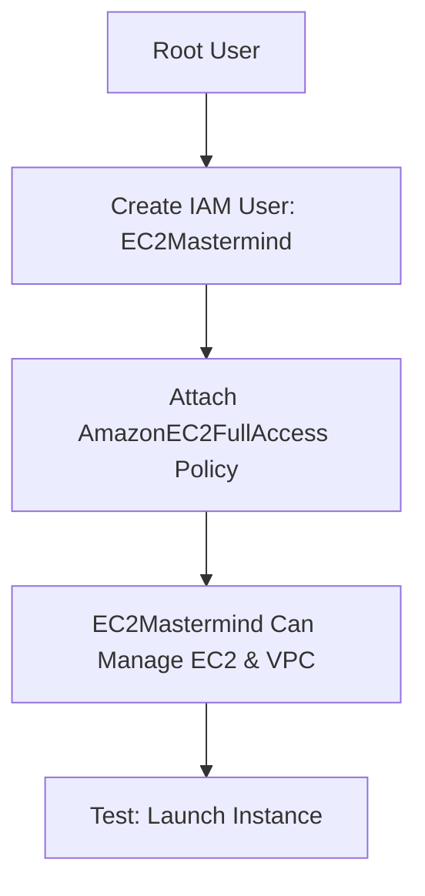

# Section 10: AWS Identity and Access Management (IAM)

<details open>
<summary><b>Section 10: AWS Identity and Access Management (IAM) (CL-KK-Terminal)</b></summary>

## Table of Contents
- [10.1 AWS Identity and Access Management (IAM)](#101-aws-identity-and-access-management-iam)
- [10.2 IAM Policies - AWS Managed Policies (Hands-On)](#102-iam-policies---aws-managed-policies-hands-on)
- [10.10 IAM Entities - IAM Roles Web Identity-SAML 2.0 Federation (Hands-On)](#1010-iam-entities---iam-roles-web-identity-saml-20-federation-hands-on)
- [10.11 IAM Roles Custom Trust Policy (Hands-On)](#1011-iam-roles-custom-trust-policy-hands-on)
- [10.12 IAM Root User Best Practices Part 1 Multi Factor Authentication (MFA)](#1012-iam-root-user-best-practices-part-1-multi-factor-authentication-mfa)
- [10.13 IAM Root User Best Practices Part 2 -- Never Use Root User --](#1013-iam-root-user-best-practices-part-2----never-use-root-user--)
- [10.14 IAM Root User Best Practices Part 3 -- Root User Security](#1014-iam-root-user-best-practices-part-3----root-user-security)
- [10.15 IAM Reports Part 1 - IAM Credential Reports](#1015-iam-reports-part-1---iam-credential-reports)
- [10.16 IAM Reports Part 2 - IAM Advisor Reports](#1016-iam-reports-part-2---iam-advisor-reports)
- [10.17 IAM Reports Part 3 - IAM Access Analyzer](#1017-iam-reports-part-3---iam-access-analyzer)
- [10.18 AWS Organization Part 1](#1018-aws-organization-part-1)
- [10.19 AWS Organization Part 2 Practical - Consolidated Billing](#1019-aws-organization-part-2-practical---consolidated-billing)
- [10.20 AWS Organization -- Service Control Policies (SCP)](#1020-aws-organization----service-control-policies-scp)
- [10.21 AWS Organization Part 4 Service Control Policies (SCPs) Practical](#1021-aws-organization-part-4-service-control-policies-scps-practical)
- [10.22 AWS IAM Identity Center](#1022-aws-iam-identity-center)
- [10.23 AWS IAM Identity Center Practical (Hands-On)](#1023-aws-iam-identity-center-practical--hands-on)
- [Summary](#summary)

## 10.1 AWS Identity and Access Management (IAM)

### Overview
AWS Identity and Access Management (IAM) is a web service that enables secure control over access to AWS resources by managing users, permissions, and credentials. It addresses the need for sharing access to AWS accounts among team members without sharing root credentials, promoting security best practices. This service allows creation of users, groups, and roles to grant specific permissions for managing resources like EC2 instances and VPCs.

### Key Concepts/Deep Dive
#### Fundamentals of IAM
- **Root User vs. IAM Users**: The root user has unrestricted access and should be protected; IAM users are created for specific access without sharing root credentials.
- **Real-World Scenario**: Companies like Global Tech Solution need to migrate to AWS; the CTO creates the account (root user), then hires EC2 Mastermind for instances and VPC Visionary for networking, using IAM to manage access separately.

#### IAM Creation and Login Process
- **Create IAM User**: Log in as root, go to IAM, create user (e.g., EC2 Mastermind), set password, enable console access.
- **Login as IAM User**: Use account alias if set, enter IAM user URL, username, password; no simultaneous login with same browser (use incognito).
- **Url and Account ID**: IAM user sign-in URL uses account ID or custom alias (e.g., companyname.signin.aws.amazon.com).

> [!IMPORTANT]
> IAM users have no permissions by default; policies must be attached to grant access.

#### Permissions Assignment Basics
- **Ways to Assign Permissions**: Attach policies directly to user, add user to group, or copy from another user (during creation).
- **Policy Attachment**: Use managed policies (e.g., AmazonEC2FullAccess) for quick setup; policies are JSON-based but can be visual.
- **User Restrictions**: By default, new IAM users cannot perform any actions; explicit permissions needed for each service.

#### Scalability and Security
- **Company Expansion**: Larger teams require isolated permissions; IAM enables fine-grained access control.
- **Security Best Practice**: Never share root credentials; create separate IAM users with minimal required permissions.

#### Demo Hands-On
- **Create Alias**: Set custom sign-in alias for easier login (e.g., CloudFoxHub).
- **User Creation Steps**: Enable console access, set complex password, attach policies during or after creation.
- **Switching Users**: Use incognito tabs to log in as different users simultaneously.

### Code/Config Blocks
```bash
# Example: Setting up IAM user via CLI (hypothetical)
aws iam create-user --user-name EC2Mastermind
aws iam create-login-profile --user-name EC2Mastermind --password '<password>'
```

### Tables
| Aspect | Root User | IAM User |
|--------|-----------|----------|
| Access Level | Unrestricted | Granted via policies |
| Sharing | Not recommended | Share via groups/roles |
| Creation | Auto upon account creation | Manual in IAM console |

### Summary
IAM fundamentals emphasize securing access through user creation and policy attachment, distinguishing it from root user privileges for better organizational security.

## 10.2 IAM Policies - AWS Managed Policies (Hands-On)

### Overview
IAM policies define permissions for AWS resources, and AWS managed policies provide pre-built, AWS-maintained rules for common use cases. This section covers AWS managed policies, their benefits, limitations, and hands-on application to grant EC2 and VPC access via users like EC2 Mastermind and VPC Visionary.

### Key Concepts/Deep Dive
#### Introduction to IAM Policies
- **Definition**: Policies determine who can do what with which AWS resources; managed by AWS or custom-defined.
- **Thanks JSON Format**: Policies are written in JSON; visual editor available for simplicity.
- **Entity Attachment**: Attach to users, groups, or roles; inherited by group members.

#### Types of Policies
- **AWS Managed Policies**: Pre-built, ready-to-use, updated by AWS (e.g., AmazonEC2FullAccess).
- **Customer Managed Policies**: Custom-created for specific needs.
- **Inline Policies**: Directly embedded in entities, non-reusable.

#### AWS Managed Policies Deep Dive
- **Recommendations**: Use for standard permissions; examples include EC2 Full Access for managing instances.
- **Benefits**: Ready-to-use, automatically updated, reusable across entities.
- **Limitations**: No resource-specific control (e.g., cannot limit to specific EC2 instance), no customization.
- **Customer Managed Policies as Solution**: Overcome limitations with custom JSON policies for granular access.

#### Practical Demo: Grant Permissions
- **Scenario**: EC2 Mastermind manages EC2 instances; VPC Visionary manages VPC.
- **Attach AWS Managed Policy**:
  - Go to IAM > Users > Select user > Add permissions > Attach policies > Choose AmazonEC2FullAccess for EC2 Mastermind.
  - Result: EC2 Mastermind can launch, stop, terminate instances; VPC access granted implicitly (EC2-related).
- **Login and Test**: Use incognito tab, sign in as IAM user; verify EC2 console access.
- **Policy Impact**: All instance actions allowed; no S3 access unless specified.

#### User Creation and Policy Attachment
- **Create Users**: EC2Mastermind and VPCVisionary with console access.
- **Permissions Check**: Without policies, APIs error; post-attachment, full EC2/VPC control.
- **Visibility**: Users see assigned services; related permissions auto-granted (e.g., EC2 policy includes CloudWatch, VPC).

### Code/Config Blocks
```json
// Example: JSON structure of AmazonEC2FullAccess (simplified)
{
  "Version": "2012-10-17",
  "Statement": [
    {
      "Effect": "Allow",
      "Action": "ec2:*",
      "Resource": "*"
    }
  ]
}
```

### Diagrams


### Summary
AWS managed policies offer quick, reliable permissions for common tasks but lack customization; demos confirm automatic related permissions and access isolation.

## 10.10 IAM Entities - IAM Roles Web Identity-SAML 2.0 Federation (Hands-On)

### Overview
IAM roles enable temporary access for web identity providers (e.g., Google, Facebook) or SAML 2.0 federation (e.g., Active Directory) to AWS resources without IAM users. This section compares OAuth 2.0/OIDC and SAML, explains use cases, and demonstrates setup for secure, temporary access.

### Key Concepts/Deep Dive
#### Role Use Cases
- **AWS Services**: Roles for EC2, Lambda to access S3 (e.g., via instance profiles).
- **Another AWS Account**: Cross-account access.
- **Web Identity**: Temporary access from social media (e.g., Google login).
- **SAML 2.0 Federation**: Access via enterprise directories (e.g., Active Directory).

#### Web Identity vs. SAML
- **Web Identity**: Uses OAuth 2.0, OpenID Connect, JWT tokens for public logins (e.g., Google, Facebook).
- **SAML**: For corporate SSO; XML-based; no JWT; integrates with Active Directory Federation Service (ADFS).
- **Purpose**: Enable temporary credentials for external identities to assume roles and access resources (e.g., S3).
- **Differences**: Web Identity for consumer apps; SAML for enterprise SSO; both use temporary credentials.

> [!NOTE]
> Roles provide secure, temporary access without storing AWS creds; ideal for scalable, credential-less apps.

#### Practical Hands-On
- **Setup Role for Web Identity**: Select "Web Identity" in role creation; specify provider (e.g., Amazon Cognito user pool).
- **SAML Role**: Choose SAML 2.0 Federation; integrate with external identity providers.
- **Assume Role Flow**: User authenticates externally, receives token; assumes role for limited AWS access.
- **Benefits**: No user management in AWS; security via temporary creds; supports millions of users.

#### Exam Tips
- Associate SAML with corporate SSO and XML; Web Identity with social logins and JWT.

### Summary
Web Identity and SAML roles facilitate federated access, promoting security; roles enable temporary, scalable resource access without IAM users.

## 10.11 IAM Roles Custom Trust Policy (Hands-On)

### Overview
Custom trust policies allow crafting policies specifying who can assume roles under conditions like MFA or IP restrictions. This extends beyond standard AWS, cross-account, web identity, or SAML roles for complex scenarios.

### Key Concepts/Deep Dive
#### Custom Trust Policies
- **Flexibility**: Define assumers (e.g., users, services) with conditions (e.g., MFA required, source IP).
- **Use Cases**:
  - Cross-account with MFA: User from another account assumes role only with MFA.
  - Federated access: Conditions on attributes (e.g., email domain).
  - IP restrictions: Limit assumptions to specific IPs for security.
- **Advantages**: Handle complex rules; enforce org policies.

#### Hands-On Setup
- **Create Role**: Select "Custom trust policy"; define JSON for principles and conditions.
- **Example JSON**:
  ```json
  {
    "Version": "2012-10-17",
    "Statement": [
      {
        "Effect": "Allow",
        "Principal": {"AWS": "arn:aws:iam::account-id:user/username"},
        "Action": "sts:AssumeRole",
        "Condition": {"Bool": {"aws:MultiFactorAuthPresent": "true"}}
      }
    ]
  }
  ```
- **Attach Policies**: Add permissions (e.g., S3 access) post-trust policy.

#### Theor vs. Practical
- Theory covers benefits; practical involves JSON editing for conditions.
- No extensive lab; focus on policy structure.

### Summary
Custom trust policies offer granular control for role assumptions, ideal for advanced security requirements.

## 10.12 IAM Root User Best Practices Part 1 Multi Factor Authentication (MFA)

### Overview
MFA adds a security layer to the root user via second verification (e.g., Google Authenticator). This prevents unauthorized access despite compromised passwords, essential for root user protection.

### Key Concepts/Deep Dive
#### Why MFA
- Required for root; stands before alternative protection.
- Adds extra vetting: Password + app-generated code (6-digit, 30s validity).

#### Setup Steps
- Log in as root > IAM > Security Credentials > Assign MFA device.
- Choose Authenticator App (e.g., Google Authenticator).
- Scan QR code; enter code; add device.
- Verify: Logout, relogin; enter MFA code upon prompt.

#### Best Practices
- Enable immediately post-account creation.
- Use app (not hardware) for ease.
- Remove old MFA if needed (deactivate, delete).

### Code/Config Blocks
```bash
# Hypothetical CLI for MFA setup
aws iam enable-mfa-device --user-name root --serial-number <virtual-device-serial> --authentication-code-1 <code1> --authentication-code-2 <code2>
```

### Summary
MFA is critical for root security, providing dual-verification against breaches.

## 10.13 IAM Root User Best Practices Part 2 -- Never Use Root User --

### Overview
Never use root for daily tasks; operate as an administrative user. This minimizes risks since root has unrestricted access; only use root for specific tasks.

### Key Concepts/Deep Dive
#### Root Privileges Required Tasks
| Task | Description |
|------|-------------|
| Change Account Settings | Email/password updates |
| Close Account | Account closure |
| Restore IAM User Permissions | Fix denied perms |
| Configure S3 Admin/Shield Advanced | Advanced services |
| Access Billing Info | Payment/setup |
| Configure Support Plans | Upgrades/cancellations |

- At most 9 tasks require root; others via IAM.

> [!IMPORTANT]
> Daily tasks via administrative users reduce exposure.

#### Create Administrative User
- Create IAM user "admin"; attach AdministratorAccess policy.
- Password or MFA for added security.
- Use for all operations except root-only tasks.

#### Practical Demo
- Create user; set custom password; no reset.
- Attach AdministratorAccess; test EC2 management.
- Root for restricted actions (e.g., billing).

### Summary
Isolate root use; empower admin users for security and compliance.

## 10.14 IAM Root User Best Practices Part 3 -- Root User Security

### Overview
Secure root by deleting inactive access keys, rotating credentials, and using aliases; enable MFA and strong practices for comprehensive protection.

### Key Concepts/Deep Dive
#### Key Management
- Delete unused keys; max 2 active per root.
- Rotate: Inactivate, delete, recreate if needed.
- Never share keys; disable programmatically if not required.

### Diff Blocks
```diff
+ Secure Root: Enable MFA, delete keys, set alias
- Avoid: Sharing keys, inactive access, weak passwords
! Warning: Root compromise = full account risk
```

#### Account Security
- Alias: Replace account ID in URLs for obscurity.
- Secure email: Associated with root; monitor for breaches.
- Limit uses: Only for emergencies.

#### Practical Checks
- IAM > Security Credentials > Review keys/MFA.
- Create alias via dashboard.

### Summary
Root security fundamentals: MFA, clean keys, aliases for minimal exposure.

## 10.15 IAM Reports Part 1 - IAM Credential Reports

### Overview
IAM credential reports provide CSV downloads of user/growth/role credential status, aiding auditing and compliance. Covers passwords, keys, MFA, and access patterns for all IAM entities.

### Key Concepts/Deep Dive
#### Purpose & Scope
- Overview of IAM user statuses; generated on-demand via console.
- Frees AWS-managed; CSV for analysis.
- Includes: Password status, MFA, access keys, last use.

#### Content Details
- User details: ARN, creation date, password info, MFA status.
- Access Keys: Active/inactive, last rotated/used.
- Covers root and IAM users; not groups/roles directly.

#### Frequency & Format
- On-demand; no delay.
- CSV openable in Excel/spreadsheets.

### Diff Blocks
```diff
+ Enable Compliance: Track inactive creds
- Risk: Expired keys without MFA
! Audit Regularly: Download reports monthly
```

#### Use Cases
- Security posture; identify risks (e.g., no MFA users).
- Audit trails of usage.

### Summary
Credential reports are essential for IAM hygiene and compliance tracking.

## 10.16 IAM Reports Part 2 - IAM Advisor Reports

### Overview
IAM Access Advisor reports show service accesses by users/groups/roles, helping with least-privilege enforcement by identifying unused permissions.

### Key Concepts/Deep Dive
#### Difference from Credential Reports
- Credential: User creds/status.
- Advisor: Permissions/services accessed.

#### Access Advisor
- Visual: IAM > Users/Groups/Roles > Access Advisor tab.
- Shows last accessed services; billed for roles ($0.002/user/month).

#### Policy Optimization
- Identify/remove unused permissions; revoke excessive access.
- Integrated console; no download needed.

### Summary
Advisor optimizes policies for security without over-permissions.

## 10.17 IAM Reports Part 3 - IAM Access Analyzer

### Overview
IAM Access Analyzer identifies unintended public/cross-account access to resources, generating findings for external accesses (e.g., S3 buckets, roles), enhancing security posture.

### Key Concepts/Deep Dive
#### Findings Types
- External Access: Resources shared externally (e.g., public S3, cross-account roles).
- Unused Access: Granted but unused permissions (chargeable: $0.20/role/month).

#### Setup
- Enable per-region; activate IAM analyzer.
- Findings show ARNs, principals, issues.
- Scoped: Identifies over-permissions for revocation.

#### Benefits vs. Limits
- Free for external; detailed for audits.
- Not global; per-region activation.

### Summary
Analyzer detects and resolves access anomalies for better governance.

## 10.18 AWS Organization Part 1

### Overview
AWS Organizations manages multiple accounts centrally for governance, billing, and compliance. Suitable for companies needing separated accounts (e.g., dev/production) without full isolation.

### Key Concepts/Deep Dive
#### Reasons for Multiple Accounts
- Safe isolation, budget tracking, compliance, workload separation.

#### Features
- Central mgmt, automated creation, SCPs for perms control, consolidated billing (volume discounts), APIs for integration.

#### Use Cases
- Gov complicates org units (OUs) groups; define policies at all levels.

#### Security via SCPs
- Rules for account/service restrictions.

### Summary
Organizations enable multi-account governance with billing/compliance benefits.

## 10.19 AWS Organization Part 2 Practical - Consolidated Billing

### Overview
Practical setup of Organizations: Create org, invite accounts, enable consolidated billing for unified payment and discounts.

### Key Concepts/Deep Dive
#### Setup Steps
- Root account creates org; invites via email/account ID.
- Invited account accepts; becomes member.
- Billing auto-consolidates; view in payer account.

#### Benefits
- Single invoice; volume discounts; no payment segregation.

#### Hands-On
- Create org; inviting joins it; check billing preferences.

### Summary
Consolidated billing simplifies multi-account finances.

## 10.20 AWS Organization -- Service Control Policies (SCP)

### Overview
SCPs enforce max permissions across org accounts, denying actions even if IAM allows; strict controls without user intervention.

### Key Concepts/Deep Dive
#### How SCPs Work
- Deny overrides allow; applied hierarchically (root > OU > account).
- Evaluation: SCP + IAM = permission.

#### Architecture
- Multi-level; effective policy is intersection.

#### Benefits
- Central control; no account overrides.
- Exceptions for mgmt account.

### Diff Blocks
```diff
- Deny Wins: SMTP even if IAM allows
+ Secure: Fine-tune org-wide
```

#### Examples
- Allow/deny combinations for granular control.

### Summary
SCPs are powerful for org policy enforcement.

## 10.21 AWS Organization Part 4 Service Control Policies (SCPs) Practical

### Overview
Practical SCP implementation: Attach deny policies at OU/account levels, demonstrating layered restrictions.

### Key Concepts/Deep Dive
#### Demo
- Create deny S3/EC2 policies.
- Attach to OUs/accounts.
- Test inheritance impact.

#### Results
- SCPs restrict EC2/S3 despite IAM perms.

### Summary
Hands-on shows SCP overrides IAM for targeted restrictions.

## 10.22 AWS IAM Identity Center

### Overview
AWS Identity Center (formerly SSO) enables single sign-on across AWS accounts/apps using a central directory. Supports external providers for unified access.

### Key Concepts/Deep Dive
#### Components
- Workforce identity (users for multi-account access).
- Directory source: Identity Center, AD, SAML (e.g., Okta).

#### Workflow
- User authenticates once; assumes roles in accounts.

#### Use Cases
- Eliminate IAM users per account; integrate enterprise dirs.

> [!NOTE]
> Enables SSO for 100+ accounts smoothly.

#### Multi-Account Permissions
- Permission sets define access; e.g., read for dev account.

### Summary
Identity Center streamlines multi-account access securely.

## 10.23 AWS IAM Identity Center Practical (Hands-On)

### Overview
Practical setup: Enable Identity Center, create users/groups, assign permissions, test cross-account access.

### Key Concepts/Deep Dive
#### Setup
- Enable via IAM console; choose directory.

#### Permissions
- Create sets (e.g., read access); assign to accounts.

#### Demo
- User logs in; switches accounts vis portal.

### Summary
Verifies SSO efficiency and role assumption.

## Summary

### Key Takeaways
```diff
+ IAM core for AWS security: Users, groups, roles control access
- Avoid root overuse; use MFA, SCPs, Identity Center
! Best practices: Rotate keys, monitor reports, consolidate billing
- Mitigate risks: Temporary creds, least privilege, org scaling
```

### Quick Reference
- **MFA for Root**: Security Credentials > Assign MFA device; sweep QR in app.
- **Create IAM User**: IAM > Users > Create; attach policies for perms.
- **Assume Role Cross-Account**: Add external account to trust; assume via switch role.
- **SCP JSON Example**:
  ```json
  {
    "Version": "2012-10-17",
    "Statement": [{
      "Effect": "Deny",
      "Action": "s3:*",
      "Resource": "*"
    }]
  }
  ```

### Expert Insight
- **Real-world Application**: Large enterprises use IAM, Organizations, Identity Center for 1000+ users across accounts securely.
- **Expert Path**: Master role policies, SCP hierarchies; practice labs for compliance audits.
- **Common Pitfalls**: Sharing root creds, unused keys, permissive policies; mitigate via reports and MFA.

</details>
