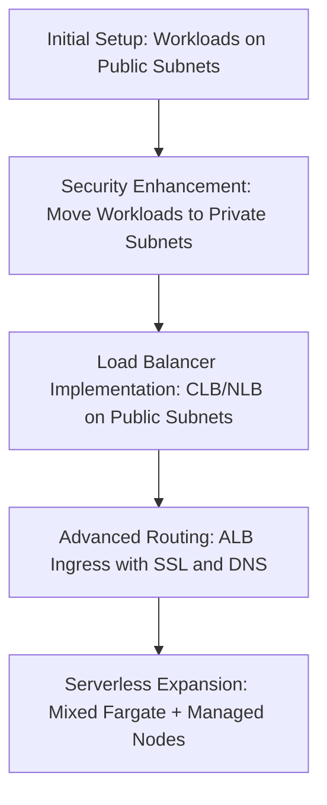

# Section 1: Course Introduction and Setup

<details open>
<summary><b>Section 1: Course Introduction and Setup (G3PCS46)</b></summary>

## Table of Contents
- [Introduction](#introduction)
- [Github Repository](#github-repository)
- [Summary](#summary)

## Introduction

### Overview
This section provides a comprehensive overview of the EKS Kubernetes Masterclass course conducted by instructor Kalyan Reddy Daida. It covers the course structure, divided into four major sections: Kubernetes concepts, AWS services integration with EKS, DevOps concepts, and microservices concepts. The course aims to equip beginners with expert-level knowledge through practical, hands-on learning, including live template writing and implementations across approximately 30 Kubernetes concepts and 18-19 AWS services.

### Key Concepts/Deep Dive
#### Course Structure Overview
The course is meticulously organized into four foundational sections to ensure progressive learning:

- **Kubernetes Concepts**: Covers approximately 30 core Kubernetes concepts with hands-on YAML declarative file writing. This includes fundamental and advanced topics like pods, replica sets, deployments, and services, implemented through both imperative (`kubectl` commands) and declarative approaches.

- **AWS Services Integration**: Explores integration possibilities with Elastic Kubernetes Service (EKS), including:
  - Fargate for serverless container management
  - Certificate Manager for SSL/TLS certificates
  - Route 53 for DNS management
  - Elastic Block Store (EBS) for persistent storage
  - RDS databases for external managed databases
  - Elastic Load Balancing (ELB) options: Classic Load Balancer (CLB), Network Load Balancer (NLB), and Application Load Balancer (ALB) via Ingress services

- **DevOps Concepts**: Implements automated pipelines using AWS Code services for:
  - Continuous integration and deployment (CI/CD) for both applications and Kubernetes manifests
  - Automated Docker image builds and deployments to EKS clusters
  - Infrastructure as code principles

- **Microservices Concepts**: Focuses on advanced microservices patterns in Kubernetes, including:
  - Service discovery mechanisms
  - Distributed tracing using AWS X-Ray
  - Canary deployment strategies for traffic routing and version management

#### Docker and Kubernetes Fundamentals Sections
- **Docker Fundamentals**: Dedicated section for building core Docker knowledge:
  - Building simple Docker images
  - Pushing to and pulling from Docker Hub
  - Understanding Docker terminology:
    - Docker Registry: Repository for Docker images
    - Docker Hub: Public registry for community-contributed images
    - Docker Image: Immutable template for containerization
    - Container: Runtime instance of a Docker image

- **Kubernetes Fundamentals**: Comprehensive hands-on section covering:
  - Imperative commands using `kubectl`
  - Declarative YAML writing for pods, replica sets, deployments, and services
  - Live template creation sessions

#### Sequential Topic Progression
The course follows a logical progression, starting with fundamentals and building towards advanced integrations:

1. **Storage Section (EKS with EBS CSI Driver)**:
   - Implement EBS storage for workloads
   - Write deployment manifests, MySQL ClusterIP services, NodePort services
   - Configure environment variables, volumes, and volume mounts
   - Learn drawbacks of EBS vs. advantages of RDS
   - Transition to external name services for RDS integration

2. **Load Balancing Section**:
   - Delete worker nodes from public subnets
   - Move workloads to private subnets (security best practice)
   - Implement Classic Load Balancer (CLB) on public subnets
   - Create Network Load Balancer (NLB) manifests
   - Advanced Ingress services with:
     - Context-based routing (path-based routing like `/app1`, `/app2`)
     - SSL/TLS termination
     - HTTP/2 support
     - HTTPS redirection using SSL redirects
     - External DNS integration with Route 53 for automatic domain registration

3. **Fargate Serverless Section**:
   - Mixed-mode deployment: Regular EKS managed node groups + Fargate profiles
   - Deploy multiple applications (e.g., app1, app2, User Management Service) across both environments

4. **Elastic Container Registry (ECR)**:
   - Build and push Docker images to ECR
   - Deploy from ECR-stored images in EKS clusters
   - Continue using existing ALB Ingress configurations

5. **DevOps Pipeline Implementation**:
   - AWS Code services integration
   - Monitoring with CloudWatch Container Insights

6. **Microservices Deep Dive**:
   - Independent microservices (User Management Service + Notification Service)
   - End-to-end service discovery with ClusterIP services
   - Distributed tracing with AWS X-Ray SDK
   - Canary deployments using Kubernetes native features
   - Postman-based testing workflows

7. **Scaling and Monitoring**:
   - Horizontal Pod Autoscaler (HPA)
   - Vertical Pod Autoscaler (VPA)
   - Cluster Autoscaler (CA)
   - Container Insights monitoring with CloudWatch
   - FluentD DemoSet for comprehensive logging

#### Network Architecture Evolution
The course demonstrates network architecture refinement:



> [!NOTE]
> All implementations include complete Kubernetes manifests stored in the `kube-manifests` folder, providing executable examples for each section.

#### Course Duration and Depth
- Total duration: Approximately 20+ hours
- Emphasis: Live coding, manifest writing, and practical AWS integrations
- Goal: Transform beginners into EKS/Kubernetes experts through comprehensive hands-on experience

### Mistakes and Corrections in Transcript
- "cubeCTL" corrected to "`kubectl`" throughout
- "MySQL" corrected from "Myer skill"
- "htp" and "cubectl" instances corrected as specified
- Repeated phrases like "means like" edited for clarity

## Github Repository

### Overview
This section introduces the GitHub repositories providing comprehensive resources for the EKS Kubernetes Masterclass course. Under the StackSimplify organization, you'll find dedicated repositories for Docker Fundamentals, Kubernetes Fundamentals, and the main AWS EKS Kubernetes Masterclass course, complete with step-by-step documentation and executable manifests.

### Key Concepts/Deep Dive
#### Repository Structure
The course utilizes three primary GitHub repositories:

- **AWS EKS Kubernetes Masterclass**: Main repository containing all EKS-specific content
- **Docker Fundamentals**: Focused on Docker containerization basics
- **Kubernetes Fundamentals**: Comprehensive Kubernetes operations guide

#### Key Features
- **Step-by-Step Documentation**: Every section includes detailed instructions with:
  - Complete `kubectl` commands for deployment
  - Docker image references
  - Execution steps for all exercises

- **Kubernetes Manifests Organization**:
  - Dedicated `kube-manifests` folder in each section
  - Contains all YAML files for deployments, services, and configurations
  - Structured for easy reference during hands-on exercises

- **Accessibility Options**:
  - **Fork Option**: Clone repositories to your own GitHub account for personalized modifications
  - **Download Option**: ZIP download and local extraction for offline access
  - Flexible usage across different environments

> [!IMPORTANT]
> The `kube-manifests` folder serves as your complete toolkit for Kubernetes deployments throughout the course, housing all manifests organized by section and use case.

#### Course Progression Guidance
- Introductory sections completed
- Next lecture: Creating EKS cluster using `eksctl`
- All resources prerequisites for hands-on exercises prepared

## Summary

### Key Takeaways
```diff
+ Comprehensive Course Structure: Four major sections covering Kubernetes concepts, AWS integrations, DevOps, and microservices with 30+ concepts and 18+ services
+ Hands-On Focus: Live YAML writing, imperative/declarative approaches, and real AWS service implementations
+ Progressive Architecture: From basics to advanced features like Fargate, ingress routing, and canary deployments
+ Resource-Rich: GitHub repositories with step-by-step docs, complete manifests, and executable commands
+ Expert-Level Outcome: Transforms beginners into production-ready EKS practitioners through practical application
```

### Quick Reference
- **Course Sections**: Kubernetes concepts (30), AWS services (18+), DevOps CI/CD, Microservices (discovery, tracing, canary)
- **Key Tools**: `kubectl`, `eksctl`, AWS Code services, X-Ray, CloudWatch Container Insights
- **Repository Locations**: https://github.com/StackSimplify (AWS EKS Masterclass, Docker/K8s Fundamentals)
- **Manifest Storage**: `kube-manifests` folder per section

### Expert Insight
#### Real-world Application
In enterprise environments, this structured approach prepares teams for implementing production-grade Kubernetes platforms on AWS, ensuring secure multi-subnet architectures, automated pipelines, and scalable microservices deployments that align with AWS best practices.

#### Expert Path
To master EKS, combine theoretical understanding with consistent hands-on practice: implement each section's concepts in a personal sandbox environment, experiment with manifest modifications, and gradually integrate advanced features like service mesh and advanced scaling policies.

#### Common Pitfalls
- **Skipping Fundamentals**: Attempting advanced sections without mastering Docker and basic Kubernetes concepts leads to integration failures
- **Public Subnet Workloads**: Failing to secure workloads in private subnets creates security vulnerabilities (avoided by early network architecture redesign)
- **Manifest Execution Without Understanding**: Running scripts without comprehending underlying configurations prevents troubleshooting and optimization

</details>
