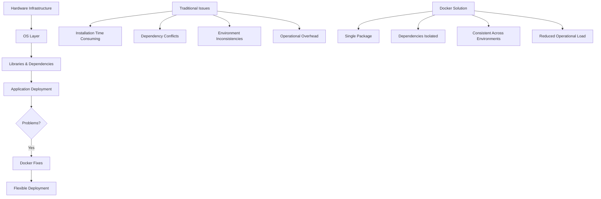
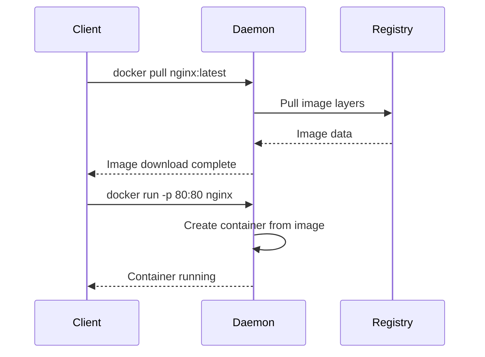

# Section 3: Docker Fundamentals

<details open>
<summary><b>Section 3: Docker Fundamentals (G3PCS46)</b></summary>

[Table of Contents](#table-of-contents)

## Table of Contents
- [3.1 Docker Fundamentals Introduction](#31-step-01---docker-fundamentals---introduction)
- [3.2 Introduction to Docker, Why Docker, What Problems Docker Solve](#32-step-02---introduction-to-docker-why-docker-what-problems-docker-solve)
- [3.3 Docker Architecture or Docker Terminology](#33-step-03---docker-architecture-or-docker-terminology)
- [3.4 Docker Installation](#34-step-04---docker-installation)
- [3.5 Docker - Pull Docker Image from Docker Hub and Run it locally](#35-step-05---docker---pull-docker-image-from-docker-hub-and-run-it-locally)
- [3.6 Docker - Build Docker Image locally, Test and Push it to Docker Hub](#36-step-06---docker---build-docker-image-locally-test-and-push-it-to-docker-hub)
- [3.7 Docker - Essential Commands Overview](#37-step-07---docker---essential-commands-overview)
- [Summary](#summary)

### 3.1 Step-01- Docker Fundamentals - Introduction

**Overview**  
This section introduces the Docker Fundamentals course structure and outlines the key topics covered in Section 3. The course follows a systematic approach starting from Docker basics, progressing through architecture, installation, and hands-on flows for using Docker images and containers.

**Key Concepts/Deep Dive**  
- **Course Structure**: The Docker fundamentals section covers five main topics:
  - Docker introduction and problem-solving approach
  - Docker architecture and terminology understanding
  - Docker installation across platforms (Windows/Mac)
  - Pull and run existing Docker images from Docker Hub
  - Build custom Docker images and push to Docker Hub
- **Essential Flows**: Two core workflows emphasized:
  - Flow 1: Pull Docker images from registries and run as containers
  - Flow 2: Build new images locally, test them, and push to registries
- **Day-to-Day Commands**: Focus on essential Docker commands used in daily development and operations
- **Prerequisites**: Assumes basic Docker installation is complete before proceeding

### 3.2 Step-02- Introduction to Docker, Why Docker, What Problems Docker Solve

**Overview**  
This lecture explains what Docker is, compares traditional infrastructure challenges with containerized solutions, and demonstrates why Docker solves critical deployment and consistency issues through a layered architecture that packages applications with their dependencies.



**Key Concepts/Deep Dive**  
- **Traditional Infrastructure Problems**:
  - **Installation Complexity**: Manual setup of OS libraries, dependencies, vendor products across multiple environments
  - **Dependency Conflicts**: Version incompatibilities when upgrading libraries or patching systems
  - **Environment Inconsistencies**: Variations between dev, QA, staging, and production environments
  - **Operational Overhead**: High resource requirements for hardware management, software patching, and support
  
- **Docker Solution Advantages**:
  - **Package Once, Deploy Anywhere**: Single containerized package works consistently across all environments
  - **Lightweight & Efficient**: Containers share host kernel, much more resource-efficient than virtual machines
  - **Portable**: Build locally, deploy to cloud or run anywhere
  - **Loosely Coupled**: Applications encapsulated, allowing independent updates without disruption
  - **Highly Scalable**: Automatic container replica distribution across infrastructure
  - **Secure**: Granular constraints isolate container processes

**Infrastructure Comparison Table**

| Aspect | Physical Machines | Virtual Machines | Docker Containers |
|--------|------------------|------------------|-------------------|
| Hardware | Dedicated HW | Shared HW | Shared HW |
| OS | Full OS per machine | Full OS per VM | Shared host OS kernel |
| Libraries | Manual install | Manual install | Packaged with container |
| Deployment | Time-consuming | Complex imaging | Instant container startup |
| Efficiency | Low resource utilization | Moderate overhead | Minimal overhead |

**Lab Demo: Infrastructure Layers**  
1. **Traditional Setup**: Hardware → OS → Libraries → Application (manual, error-prone)
2. **Docker Setup**: Hardware → OS → Docker Engine → Containers (automated, consistent)
3. **Practical Impact**: Developer environment provisioning reduces from hours/days to minutes

### 3.3 Step-03- Docker Architecture or Docker Terminology

**Overview**  
Docker architecture revolves around core components including the Docker Daemon, Client, Images, Containers, and Registries. This lecture explains how these components interact to manage container lifecycle from image creation to execution and distribution.

**Key Concepts/Deep Dive**  
- **Docker Daemon (DockerD)**: Background service managing Docker objects (images, containers, networks, volumes)
- **Docker Client**: CLI tool for user interaction, sends commands to DockerD via REST API
- **Docker Images**: Read-only templates containing application code, runtime, libraries, and configuration



- **Docker Containers**: Runnable instances of images with:
  - Isolated filesystem from host
  - Unique process namespace
  - Network interfaces
  - Storage volumes
- **Docker Registry**: Repository system for storing and distributing images
  - **Docker Hub**: Public registry by default
  - **Private Registries**: AWS ECR, Azure Container Registry, etc.

**Two Primary Workflows**  
1. **Pull & Run Flow**: Docker client → DockerD → Registry pull → Local image → Container creation
2. **Build & Push Flow**: Local Dockerfile → Docker build → Local image → DockerD → Registry push

**Lab Demo: Container Lifecycle**  
1. Pull image: `docker pull nginx:alpine`
2. Run container: `docker run -d -p 8080:80 --name web-server nginx:alpine`
3. Verify: `docker ps`
4. Inspect: `docker exec -it web-server /bin/bash`
5. Stop: `docker stop web-server`
6. Remove: `docker rm web-server`

### 3.4 Step-04- Docker Installation

**Overview**  
Docker can be installed either as Docker Engine (direct OS installation) or Docker Desktop (GUI wrapper for development). This lecture covers installation on Windows, Mac, and Linux systems with troubleshooting tips for common issues.

**Key Concepts/Deep Dive**  

**System Requirements & Platform Support:**
- **Supported Platforms**: CentOS, Debian, Fedora, Ubuntu (x86_64, ARM64, ARMhf, IBM Power, Z-series)
- **Docker Desktop**: Windows 10 Pro/Enterprise/Education, macOS 10.13+
- **Minimum RAM**: 4GB (8GB recommended for smooth operation)
- **Windows Specific**: Hyper-V and Containers Windows features must be enabled

```yaml
# Docker Installation Checklist
windows_requirements:
  - windows_version: "10 Pro/Enterprise/Education"
  - features: ["Hyper-V", "Containers"]
  - ram_minimum: "8GB"
  - installation_method: "Docker Desktop Installer"

mac_requirements:
  - macos_version: ">=10.13"
  - ram_minimum: "4GB"
  - installation_method: "Docker Desktop .dmg"
```

**Installation Steps per Platform:**

**Windows Docker Desktop:**
1. Download Docker Desktop installer (.exe)
2. Run installer as administrator
3. Enable Hyper-V and Containers features
4. Restart system
5. Start Docker Desktop from system tray

**Mac Docker Desktop:**
1. Download Docker Desktop (.dmg)
2. Drag to Applications folder
3. Launch Docker Desktop
4. Complete initial setup wizard

**Troubleshooting Common Issues:**

**Mac OS Keychain Problem:**
```json
// Fix: Edit ~/.docker/config.json
{
  "credsStore": "desktop"
}
// Remove this line: "credsStore": "osxkeychain"
// Then restart Docker Desktop
```

> [!WARNING]
> Mac users: Always uncheck "Securely store Docker logins in macOS Keychain" in Docker Desktop preferences to prevent authentication issues.

**Verification Commands:**
```bash
docker --version
docker info
docker run hello-world
```

### 3.5 Step-05- Docker - Pull Docker Image from Docker Hub and Run it locally

**Overview**  
This hands-on section demonstrates pulling Docker images from Docker Hub, running them as containers, and performing common container management operations like stopping, starting, and connecting to container terminals.

**Key Concepts/Deep Dive**  
- **Authentication**: `docker login` required for private repositories
- **Image Naming**: Format is `registry/username/image:tag`
- **Port Mapping**: `-p host_port:container_port` maps container ports to host
- **Container Naming**: `--name container_name` for easier management
- **Detached Mode**: `-d` runs containers in background

**Lab Demo: Pull and Run Workflow**

**Step 1: Verify Installation**
```bash
docker --version
```

**Step 2: Authenticate with Docker Hub**
```bash
docker login
# Enter username/password when prompted
```

**Step 3: Pull Image from Docker Hub**
```bash
# Public image
docker pull stacksimplify/springboot-hello-world:1.0.0-release

# Verify download
docker images
```

**Step 4: Run Container**
```bash
docker run --name app-one -p 80:80 -d stacksimplify/springboot-hello-world:1.0.0-release
```

**Step 5: Access Application**
- Browser: `http://localhost/hello` → Returns: "Hello World v1"

**Container Management Commands:**

```bash
# List running containers
docker ps

# List all containers (running + stopped)
docker ps -a

# List only container IDs
docker ps -aq

# Stop container
docker stop app-one

# Start stopped container
docker start app-one

# Connect to container terminal
docker exec -it app-one /bin/bash

# Remove stopped container
docker rm app-one

# Remove image
docker rmi <image_id>
```

**Container States Table**

| Command | Output | Meaning |
|---------|--------|---------|
| `docker ps` | Container listed | Running |
| `docker ps -a` | Exit code 143 | Gracefully stopped |
| `docker ps -a` | Exit code 0 | Successfully exited |

> [!NOTE]
> Container names provide easier management than IDs. Always use descriptive names for production workloads.

### 3.6 Step-06- Docker - Build Docker Image locally, Test and Push it to Docker Hub

**Overview**  
This lecture covers creating custom Docker images using Dockerfiles, testing them locally, and pushing to Docker Hub. The process demonstrates packaging application code with base images and managing image versions and tags.

**Key Concepts/Deep Dive**  
- **Dockerfile Instructions**: FROM (base image), COPY (local files), RUN (build commands), EXPOSE (ports)
- **Image Layers**: Each instruction creates a new layer for efficient caching
- **Tagging Strategy**: Use meaningful tags like `:v1`, `:latest`, `:release`
- **Build Context**: `.` specifies current directory as build context

**Lab Demo: Build, Test, Push Workflow**

**Prerequisites:**
- Docker Hub account created
- Base image familiarity (nginx example)

```bash
# Run base nginx to understand default behavior
docker run --name nginx-default -p 80:80 -d nginx
# Access http://localhost -> "Welcome to nginx!"
docker stop nginx-default
```

**Step 1: Create Project Structure**
```bash
mkdir nginx-image
cd nginx-image
```

**Step 2: Create Dockerfile**
```dockerfile
# Dockerfile
FROM nginx
COPY index.html /usr/share/nginx/html/index.html
```

**Step 3: Create Custom Index File**
```html
<!-- index.html -->
Welcome to stacksimplify Nginx V1 Custom Image
```

**Step 4: Build Custom Image**
```bash
# Replace 'your-dockerhub-id' with actual Docker Hub username
docker build -t your-dockerhub-id/mynginx-image:v1 .
```

**Step 5: Run and Test Locally**
```bash
# Stop any conflicting containers first
docker stop nginx-default

# Run custom image
docker run --name mynginx1 -p 8080:80 -d your-dockerhub-id/mynginx-image:v1

# Test: http://localhost:8080 -> "Welcome to stacksimplify Nginx V1 Custom Image"
```

**Step 6: Tag and Push to Docker Hub**
```bash
# Retag for release
docker tag your-dockerhub-id/mynginx-image:v1 your-dockerhub-id/mynginx-image:v1-release

# Push to registry
docker push your-dockerhub-id/mynginx-image:v1-release
```

**Step 7: Verify on Docker Hub**
- Login to hub.docker.com
- Check Repositories section for uploaded image
- Tag should appear as `v1-release`

**Common Dockerfile Patterns:**

```dockerfile
# Web application example
FROM openjdk:11-jre-slim
COPY target/app.jar /app/app.jar
EXPOSE 8080
CMD ["java", "-jar", "/app/app.jar"]
```

**Image Management Commands:**

```bash
# List images
docker images

# Tag existing image
docker tag source-image:tag destination-image:new-tag

# Push to registry
docker push registry/image:tag

# Remove unused images
docker image prune
```

> [!IMPORTANT]
> Always replace placeholder usernames and IDs with your actual Docker Hub credentials when following these examples.

### 3.7 Step-07- Docker - Essential Commands Overview

**Overview**  
This final lecture consolidates essential Docker commands used for daily container and image management operations. These commands cover the complete lifecycle from authentication to cleanup, providing the foundation for all Docker interactions.

**Key Concepts/Deep Dive**  
- **Container Operations**: Core commands for managing container lifecycle
- **Image Management**: Commands for pulling, building, and maintaining images
- **Authentication**: Docker Hub login/logout for private repositories
- **Monitoring**: Real-time container statistics and process inspection

**Essential Commands Reference:**

```bash
# Container Management
docker ps                    # List running containers
docker ps -a                 # List all containers
docker ps -aq                # List all container IDs only
docker stop <container>      # Stop running container
docker start <container>     # Start stopped container
docker restart <container>   # Restart container
docker rm <container>        # Remove stopped container
docker rm -f <container>     # Force remove running container

# Image Operations
docker pull <image>:<tag>    # Pull image from registry
docker build -t <image> .    # Build image from Dockerfile
docker push <image>:<tag>    # Push image to registry
docker rmi <image>           # Remove local image

# Authentication
docker login                 # Authenticate with registry
docker logout                # Logout from registry

# Container Interaction
docker exec -it <container> /bin/bash    # Access container shell
docker logs <container>                  # View container logs

# Monitoring & Diagnostics
docker stats                 # Real-time container resource usage
docker top <container>       # View processes in container
docker port <container>      # Show port mappings
docker inspect <container>   # Detailed container info
docker version               # Show Docker version information
```

**Command Categories Overview**

| Category | Commands | Purpose |
|----------|----------|---------|
| **Container Lifecycle** | run, start, stop, restart, rm | Create, manage, and remove containers |
| **Image Management** | pull, build, push, rmi, images | Handle Docker images |
| **Authentication** | login, logout | Registry access |
| **Observation** | ps, logs, inspect, top, stats | Monitor and debug |
| **Networking** | port | Port mapping information |

**Best Practices Notes:**
- Use descriptive container names instead of IDs
- Always check `docker ps` before running new containers to avoid port conflicts
- Use `docker system prune` periodically to clean up unused resources
- Prefer lightweight base images (Alpine variants) for smaller footprints

## Summary

### Key Takeaways
```diff
+ Docker solves traditional infrastructure problems by packaging applications with dependencies
+ Images are immutable templates, containers are running instances of images
+ Docker Client communicates with Docker Daemon via REST API
+ Docker Hub serves as public registry for image distribution
+ Essential flows: Pull/Run existing images vs Build/Test/Push custom images
+ Port mapping (-p) exposes container ports to host machine
- Traditional virtual machines have full OS overhead unlike lightweight containers
+ Docker installation requires platform-specific configurations and troubleshooting
- Container state management requires proper start/stop/remove sequence
+ Build context matters: Dockerfile and copied files must be in same directory
+ Tagging strategy is crucial for version management and deployment
+ Authentication enables private repository access and pushing images
```

### Quick Reference
**Common Docker Commands:**
- `docker run -d --name web -p 80:80 nginx`: Run nginx container
- `docker build -t myapp:v1 .`: Build image from current directory
- `docker push username/myapp:latest`: Push to Docker Hub
- `docker exec -it web /bin/bash`: Access container shell
- `docker ps -a`: View all containers

**Troubleshooting Commands:**
- `docker logs <container>`: Check container logs
- `docker inspect <container>`: Detailed configuration
- `docker stats`: Monitor resource usage
- `docker system df`: Disk usage overview

### Expert Insight

**Real-world Application**:  
Docker containers power modern microservices architectures, enabling rapid deployment across cloud platforms. Organizations use Docker for consistent development environments, CI/CD pipelines, and scaling applications from development to production without environment-related issues.

**Expert Path**:  
Master Docker by implementing multi-stage builds for optimized images, using Docker Compose for multi-container applications, and integrating with orchestration tools like Kubernetes. Focus on security best practices including image scanning, minimal base images, and proper secrets management.

**Common Pitfalls**:  
Avoid running containers as root, exposing unnecessary ports, or using `:latest` tags in production. Never store secrets in Docker images - use environment variables or mounted secrets. Remember that containers are ephemeral; persistence requires external volumes or bind mounts. Always verify image sources to prevent supply chain attacks.

</details>
