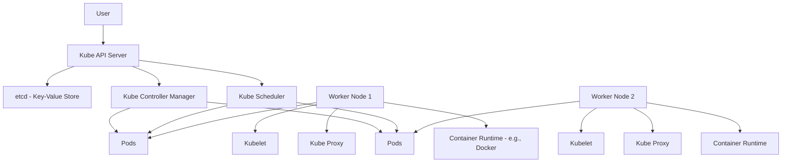
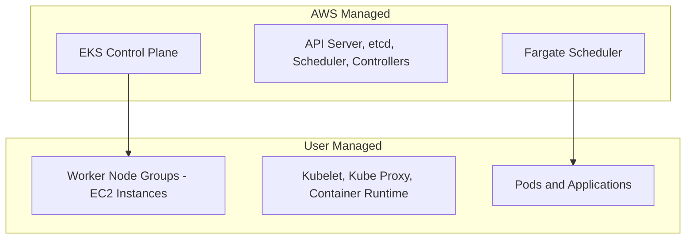
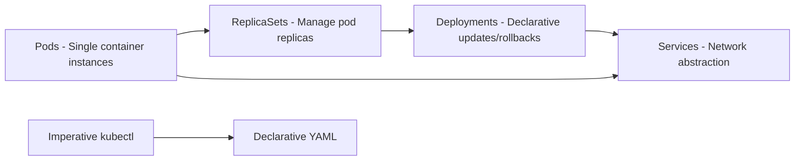
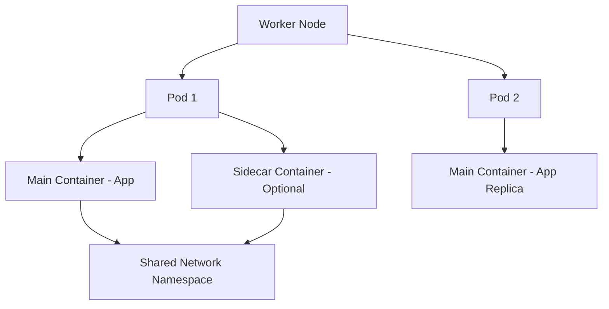
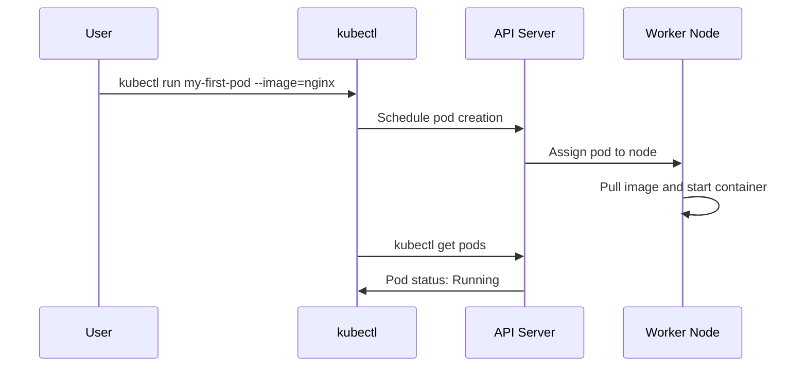
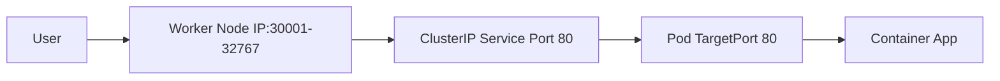
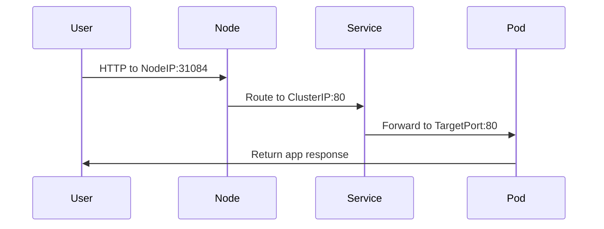
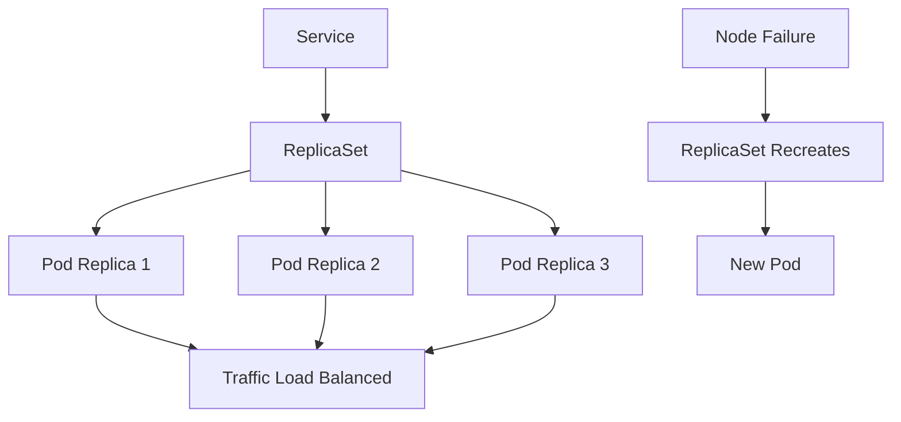
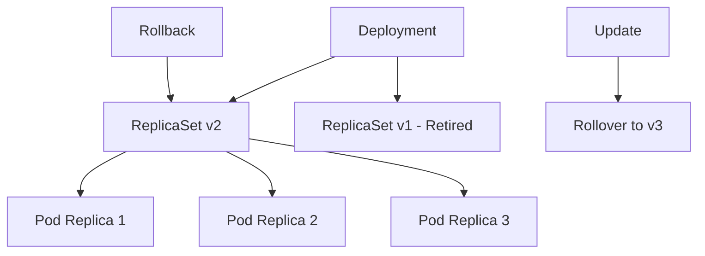
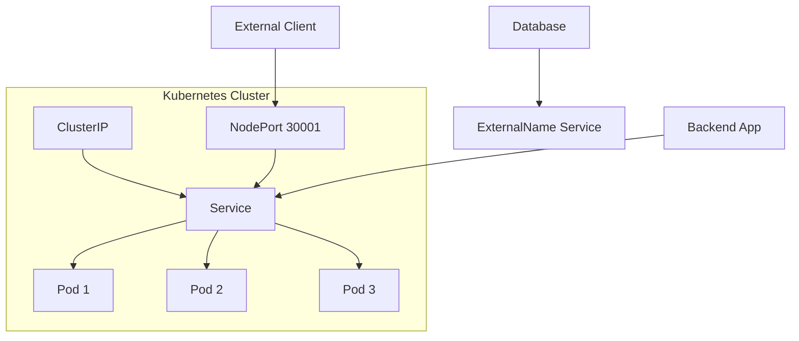

<details open>
<summary><b>Section 4: Kubernetes Fundamentals (G3PCS46)</b></summary>

# Section 4: Kubernetes Fundamentals

## Table of Contents
- [4.1 Kubernetes Architecture](#41-kubernetes-architecture)
- [4.2 Kubernetes vs AWS EKS Architecture](#42-kubernetes-vs-aws-eks-architecture)
- [4.3 Kubernetes Fundamentals - Introduction](#43-kubernetes-fundamentals---introduction)
- [4.4 Introduction to Kubernetes Pods](#44-introduction-to-kubernetes-pods)
- [4.5 Kubernetes Pods Demo](#45-kubernetes-pods-demo)
- [4.6 Kubernetes NodePort Service Introduction](#46-kubernetes-nodeport-service-introduction)
- [4.7 Kubernetes NodePort Service and Pods Demo](#47-kubernetes-nodeport-service-and-pods-demo)
- [4.8 Interact with Pod - Connect to Container in a Pod](#48-interact-with-pod---connect-to-container-in-a-pod)
- [4.9 Delete Pod](#49-delete-pod)
- [4.10 Kubernetes ReplicaSet - Introduction](#410-kubernetes-replicaset---introduction)
- [4.11 Kubernetes ReplicaSet - Review Manifests and Create ReplicaSet](#411-kubernetes-replicaset---review-manifests-and-create-replicaset)
- [4.12 Kubernetes ReplicaSet - Expose and Test via Browser](#412-kubernetes-replicaset---expose-and-test-via-browser)
- [4.13 Kubernetes Deployment - Introduction](#413-kubernetes-deployment---introduction)
- [4.14 Kubernetes Deployment - Demo](#414-kubernetes-deployment---demo)
- [4.15 Kubernetes Deployment - Update Deployment using Set Image Option](#415-kubernetes-deployment---update-deployment-using-set-image-option)
- [4.16 Kubernetes Deployment - Edit Deployment using kubectl edit](#416-kubernetes-deployment---edit-deployment-using-kubectl-edit)
- [4.17 Kubernetes Deployment - Rollback Application to Previous Version - Undo](#417-kubernetes-deployment---rollback-application-to-previous-version---undo)
- [4.18 Kubernetes Deployment - Pause and Resume Deployments](#418-kubernetes-deployment---pause-and-resume-deployments)
- [4.19 Kubernetes Services - Introduction](#419-kubernetes-services---introduction)
- [4.20 Kubernetes Services - Demo](#420-kubernetes-services---demo)

## 4.1 Kubernetes Architecture

### Overview
Kubernetes architecture consists of master and worker nodes, each running the container runtime (such as Docker or alternatives), alongside core components like the API server, etcd, scheduler, controller manager, and kubelet/kube-proxy. The master node manages the cluster, while worker nodes host the application pods. This distributed architecture ensures scalability, reliability, and portability for containerized workloads.

### Key Concepts
- **Master Components**:
  - **Kube API Server**: Acts as the front end for Kubernetes control plane, exposing the API and facilitating communication with all cluster components.
  - **etcd**: A consistent, highly available key-value store serving as the primary database for all cluster data, including node and pod information.
  - **Kube Scheduler**: Responsible for distributing container workloads across worker nodes by selecting appropriate nodes for newly created pods.
  - **Kube Controller Manager**: Manages controllers that monitor and respond to changes in cluster state, such as pod failures or node issues.
  - **Cloud Controller Manager**: Handles cloud-specific logic for integrating with cloud providers, managing load balancers, routes, and node health checks.

- **Worker Node Components**:
  - **Container Runtime**: The underlying software (e.g., Docker, containerd) that executes containers within pods on worker nodes.
  - **Kubelet**: The agent running on each worker node, ensuring containers are running in pods as scheduled by the master.
  - **Kube Proxy**: Maintains network rules on worker nodes, enabling pod-to-pod communication within and outside the cluster.

- **Cluster Architecture**:
  - Kubernetes runs containers encapsulated in pods on worker nodes rather than deploying containers directly.
  - Supports multi-container pods in exceptional cases (e.g., sidecar patterns), but typically maintains a one-pod-to-one-container relationship.

### Diagrams


> [!NOTE]
> etcd stores configuration data and state information, making it critical for cluster recovery and consistency.

## 4.2 Kubernetes vs AWS EKS Architecture

### Overview
AWS EKS simplifies Kubernetes management by handling the control plane components, allowing users to focus solely on application workloads. Unlike self-managed Kubernetes, EKS places the control plane (master components) in AWS, while users manage only worker node groups and Fargate-managed pods in serverless mode.

### Key Concepts
- **EKS Control Plane**:
  - Includes EKS-managed versions of kube API server, etcd, kube scheduler, and cloud controller manager with Fargate-specific schedulers.
  - Users are abstracted from maintenance, high availability, and operational concerns of these components.

- **Worker Nodes in EKS**:
  - **EKS Managed Node Groups**: Provision EC2 instances as worker nodes with kubelet and container runtime pre-configured.
  - Pod scheduling and management remain on these nodes, identical to standard Kubernetes worker nodes.

- **Key Differences**:
  - In on-premise or self-managed Kubernetes, users handle all components; in EKS, AWS manages the control plane.
  - Fargate provides serverless pod execution, eliminating the need for EC2 instance management.

- **Focus Areas**:
  - EKS allows concentration on application design, deployment, and scaling rather than infrastructure maintenance.
  - Autoscaling, load balancing, and fault tolerance are service-managed.

### Diagrams


> [!IMPORTANT]
> EKS focuses user efforts on application logic, not cluster management, reducing operational overhead compared to self-hosted Kubernetes.

## 4.3 Kubernetes Fundamentals - Introduction

### Overview
Kubernetes fundamentals introduce core objects: Pods as the basic deployable units, ReplicaSets for maintaining pod replicas, Deployments for declarative application management with updates and rollbacks, and Services for pod network abstraction. This section covers both imperative (kubectl commands) and declarative (YAML manifests) approaches to implement these concepts.

### Key Concepts
- **Core Objects**:
  - **Pods**: Smallest deployable object, typically a single container instance of an application.
  - **ReplicaSets**: Ensures a specified number of pod replicas are running for high availability and load distribution.
  - **Deployments**: Wrap ReplicaSets to provide rolling updates, rollbacks, and scaling capabilities.
  - **Services**: Abstract pod networking, enabling load balancing and stable endpoints for pod communication.

- **Implementation Approaches**:
  - **Imperative**: Use kubectl commands to create objects directly (e.g., `kubectl run`, `kubectl expose`).
  - **Declarative**: Define YAML manifests and apply them with `kubectl apply`, allowing version control and repeatability.

- **Course Structure**:
  - Demonstrates hands-on implementation using imperative commands, then declarative YAML.
  - Includes scaling, updates, rollbacks, and exposure for testing.

### Diagrams


## 4.4 Introduction to Kubernetes Pods

### Overview
A Pod is the fundamental unit in Kubernetes, representing a single instance of an application running in a container. Kubernetes deploys containers within Pods on worker nodes, ensuring portability and encapsulation. Pods typically contain one primary container but can include helper sidecar containers in specific scenarios.

### Key Concepts
- **Pod Characteristics**:
  - Smallest deployable object in Kubernetes.
  - Encapsulates containers, providing them with shared resources like network and storage.
  - Exists in a one-to-one relationship with containers in 99% of cases.

- **Multi-Container Pods**:
  - Rare but possible for tightly coupled components.
  - Sidecar containers handle auxiliary tasks (e.g., data pulling, proxying, logging) alongside the main application container.
  - Containers in the same pod share networking (localhost) and volumes.

- **Scaling and Management**:
  - To handle increased traffic, scale by creating additional pods rather than multiple identical containers within one pod.
  - Pods are scheduled across worker nodes for distribution.

- **Limitations**:
  - Pods have a one-to-one affinity with nodes; they do not span multiple nodes naturally.
  - Lifecycles are managed higher-level objects like ReplicaSets and Deployments.

### Diagrams


> [!NOTE]
> Avoid running multiple identical application containers in one pod; instead, use multiple pods through ReplicaSets.

## 4.5 Kubernetes Pods Demo

### Overview
This demo illustrates creating, inspecting, and managing a single pod using imperative kubectl commands, including deployment on worker nodes and verifying successful container execution.

### Key Concepts
- **Pod Creation**: Use `kubectl run` with `--generator=run-pod/v1` to create a pod directly (avoids default deployment creation).
- **Inspection**: Commands like `kubectl get pods`, `kubectl describe pod`, and `kubectl get pods -o wide` provide status, node assignment, and IP details.
- **Container Images**: Pre-built images (e.g., stacksimplify/kubenginx:1.0.0) from Docker Hub ensure quick deployment.

### Lab Demo
1. **Create Pod**:
   ```bash
   kubectl run my-first-pod --image=stacksimplify/kubenginx:1.0.0 --generator=run-pod/v1
   ```

2. **Verify Pod Status**:
   ```bash
   kubectl get pods
   kubectl get pods -o wide
   ```

3. **Describe Pod for Details**:
   ```bash
   kubectl describe pod my-first-pod
   ```

4. **Delete Pod**:
   ```bash
   kubectl delete pod my-first-pod
   ```

Output shows pod scheduled on a worker node with internal IP, confirming successful deployment.

### Diagrams


> [!TIP]
> Use labels and selectors for pod organization; they enable targeting in ReplicaSets and Services.

## 4.6 Kubernetes NodePort Service Introduction

### Overview
NodePort services expose Kubernetes applications externally via worker node ports in the 30000-32767 range, routing traffic to ClusterIP services. This enables internet-accessible applications running on pods without requiring load balancers or ingress.

### Key Concepts
- **Service Types**:
  - **ClusterIP**: Internal cluster communication.
  - **NodePort**: External access via node ports.
  - **LoadBalancer**: Cloud-integrated load balancers.

- **Port Definitions**:
  - **Port**: Service port within the cluster (e.g., 80).
  - **TargetPort**: Container port in the pod (e.g., 80).
  - **NodePort**: Dynamic port on worker nodes (30000-32767 range).

- **Traffic Flow**:
  - User accesses `<Node-IP>:<NodePort>` → routes to ClusterIP service → forwards to pod on targetPort.
  - Available across all worker nodes, allowing access via any node's IP.

- **Imperative vs Declarative**:
  - Imperative: `kubectl expose` assigns dynamic NodePort.
  - Declarative YAML: Specify exact NodePort if needed.

### Diagrams


> [!IMPORTANT]
> NodePort automatically creates a ClusterIP service; ensure targetPort matches container's listening port for connectivity.

## 4.7 Kubernetes NodePort Service and Pods Demo

### Overview
This demo creates a pod and exposes it via NodePort service, demonstrating external access, port configurations, and multi-node availability for load balancing across worker nodes.

### Key Concepts
- **Service Exposure**: `kubectl expose` creates NodePort service, assigning dynamic node ports.
- **Port Alignment**: Match service port and targetPort to container port unless intentionally differing.
- **Multi-Node Access**: Services are accessible via any worker node's IP on the same NodePort.

### Lab Demo
1. **Create Pod**:
   ```bash
   kubectl run my-first-pod --image=stacksimplify/kubenginx:1.0.0 --generator=run-pod/v1
   ```

2. **Expose as NodePort Service**:
   ```bash
   kubectl expose pod my-first-pod --type=NodePort --port=80 --name=my-first-service
   ```

3. **View Service Details**:
   ```bash
   kubectl get svc
   kubectl get nodes -o wide
   ```

   Output shows ClusterIP, NodePort (e.g., 31084), and worker node external IPs.

4. **Access Application**:
   ```
   http://<Node-External-IP>:<NodePort>/
   ```
   Displays application content (e.g., "Kubernetes Fundamentals Demo - Version V1").

5. **Test with Alternate Node IP**:
   - Access via different worker node IP with same NodePort confirms service availability.

6. **Demonstrate TargetPort Importance**:
   - Create service with differing port (e.g., port=81, targetPort=80).
   - Attempt access fails due to misalignment.
   - Fix by specifying correct targetPort.

### Diagrams


> [!NOTE]
> NodePort services provide external access but are not production-grade; use LoadBalancer or Ingress for real-world scenarios.

## 4.8 Interact with Pod - Connect to Container in a Pod

### Overview
Kubernetes tools like `kubectl logs`, `kubectl exec`, and YAML inspection enable pod interaction, logging, and troubleshooting for containerized applications.

### Key Concepts
- **Logging**:
  - `kubectl logs <pod-name>`: Dump logs.
  - `kubectl logs -f <pod-name>`: Stream logs for real-time monitoring.
  - Useful for diagnosing application issues.

- **Execution and Interaction**:
  - `kubectl exec -it <pod-name> -- bash`: Open interactive shell in container.
  - `kubectl exec -it <pod-name> -- <command>`: Run commands remotely (e.g., `ls`, `cat`).

- **YAML Inspection**:
  - `kubectl get pod <pod-name> -o yaml`: View full pod definition.
  - Includes metadata, specs, and status details.

### Lab Demo
1. **View Pod Logs**:
   ```bash
   kubectl logs my-first-pod
   kubectl logs -f my-first-pod
   ```
   Sample output: Server logs showing requests to Nginx root and index.html.

2. **Connect to Container Shell**:
   ```bash
   kubectl exec -it my-first-pod -- bash
   ```
   Inside container:
   ```bash
   ls
   cd /usr/share/nginx/html
   cat index.html
   ```

3. **Run Remote Commands**:
   ```bash
   kubectl exec -it my-first-pod -- env
   kubectl exec -it my-first-pod -- cat /usr/share/nginx/html/index.html
   ```

4. **Inspect YAML**:
   ```bash
   kubectl get pod my-first-pod -o yaml
   kubectl get svc my-first-service -o yaml
   ```

   YAML shows ports: nodePort (e.g., 31084), port (80), targetPort (80).

> [!TIP]
> Use AOP for multi-container pods; exec into specific containers with `--container <name>`.

## 4.9 Delete Pod

### Overview
Cleaning up resources prevents clutter in the Kubernetes namespace; `kubectl delete` removes pods and services, with `kubectl get all` verifying removal.

### Key Concepts
- **Deletion Commands**:
  - `kubectl delete pod <name>`: Remove specific pods.
  - `kubectl delete svc <name>`: Remove services.
  - Objects terminate gracefully, with dependencies cleaned up.

- **Verification**:
  - `kubectl get all`: Lists all objects in the default namespace.
  - Only default Kubernetes service (DNS/cluster IP) remains post-cleanup.

### Lab Demo
1. **List Current Objects**:
   ```bash
   kubectl get all
   ```
   Shows pods and services (e.g., my-first-pod, my-first-service).

2. **Delete Pod**:
   ```bash
   kubectl delete pod my-first-pod
   ```

3. **Delete Services**:
   ```bash
   kubectl delete svc my-first-service
   kubectl delete svc my-second-service
   kubectl delete svc my-third-service
   ```

4. **Verify Cleanup**:
   ```bash
   kubectl get all
   ```
   Only shows default Kubernetes service.

> [!NOTE]
> Always clean up demo resources to avoid namespace pollution; use labels for bulk deletions.

## 4.10 Kubernetes ReplicaSet - Introduction

### Overview
ReplicaSets maintain a stable set of pod replicas for high availability, load balancing, and seamless scaling. They automatically recreate failed pods and distribute traffic via services across multiple worker nodes.

### Key Concepts
- **Purpose**:
  - Ensures specified pod replicas run continuously.
  - Restores pods on failure for reliability and high availability.

- **Scaling and Load Balancing**:
  - Combines with services for load distribution across replicas.
  - Scale horizontally to handle traffic spikes.

- **Labels and Selectors**:
  - Labels attach to pods for identification.
  - Selectors match labels to associate pods with ReplicaSets and services.

- **Use Cases**:
  - Stateless applications needing consistent replica counts.
  - Foundation for Deployments (higher-level abstraction).

- **Demo Preparations**:
  - Use kubectl for imperative creation; YAML templates introduced later.
  - Scale with `kubectl scale` or manifest updates.

### Diagrams


> [!IMPORTANT]
> ReplicaSets don't self-scale; external triggers (manual scaling or autoscalers) adjust replicas based on load.

## 4.11 Kubernetes ReplicaSet - Review Manifests and Create ReplicaSet

### Overview
ReplicaSets are created via YAML manifests since `kubectl create replicaset` lacks imperative support. This demo reviews YAML structure, applies the manifest, and verifies replica creation with ownership hierarchies.

### Key Concepts
- **YAML Structure**:
  - `apiVersion: apps/v1`
  - `kind: ReplicaSet`
  - `metadata.name`: ReplicaSet name (e.g., my-helloworld-rs)
  - `spec.replicas`: Number of desired pods (e.g., 3)
  - `spec.selector.matchLabels`: Matches pod labels
  - `spec.template`: Pod specification including containers

- **Imperative Limitation**:
  - No direct `kubectl run` for ReplicaSets; require YAML.

- **Ownership**:
  - Pods are "owned" by ReplicaSet, verifiable via `metadata.ownerReferences` in pod YAML.

### Lab Demo
1. **Review YAML Manifest** (replicaset-demo.yml):
   ```yaml
   apiVersion: apps/v1
   kind: ReplicaSet
   metadata:
     name: my-helloworld-rs
   spec:
     replicas: 3
     selector:
       matchLabels:
         app: my-app
     template:
       metadata:
         labels:
           app: my-app
       spec:
         containers:
         - name: my-helloworld-app
           image: stacksimplify/kube-helloworld:1.0.0
           ports:
           - containerPort: 80
   ```

2. **Apply Manifest**:
   ```bash
   kubectl apply -f replicaset-demo.yml
   ```

3. **Verify ReplicaSet**:
   ```bash
   kubectl get rs
   kubectl describe rs my-helloworld-rs
   ```

4. **Check Pods**:
   ```bash
   kubectl get pods
   kubectl get pods -o wide
   ```

5. **View Ownership**:
   ```bash
   kubectl get pod <pod-name> -o yaml
   ```
   In `ownerReferences`, find `name: my-helloworld-rs` as the controller.

> [!NOTE]
> Labels and selectors link ReplicaSets to pods; mismatches prevent pod management.

## 4.12 Kubernetes ReplicaSet - Expose and Test via Browser

### Overview
Exposing ReplicaSets as services enables load balancing across pod replicas. NodePort services allow browser testing, demonstrating high availability and load distribution with replica recreation on failures.

### Key Concepts
- **Service Exposure**:
  - `kubectl expose rs` creates service for pod stability.
  - Replicas share load via service endpoints.

- **Load Balancing Demonstration**:
  - Access shows varying container IDs, proving traffic distribution.
  - Service routes requests round-robin style.

- **Reliability Testing**:
  - Deleting pods triggers ReplicaSet recreation, maintaining replica count.
  - Scales maintain high availability.

- **Scaling Operations**:
  - Update YAML `spec.replicas` and `kubectl replace -f`.
  - Autoscaling via HorizontalPodAutoscaler for dynamic scaling.

### Lab Demo
1. **Expose ReplicaSet as Service**:
   ```bash
   kubectl expose rs my-helloworld-rs --type=NodePort --port=80 --target-port=80 --name=my-helloworld-rs-service
   ```

2. **Get Service Details**:
   ```bash
   kubectl get svc
   kubectl get nodes -o wide
   ```

3. **Test Load Balancing**:
   - Access: `http://<Node-IP>:<NodePort>/hello`
   - Refresh browser: Observe changing container IDs (e.g., D7HBK, ZNBGW).

4. **Test High Availability**:
   ```bash
   kubectl delete pod <pod-name>
   kubectl get pods
   ```

5. **Scale Replicas**:
   - Edit YAML: Change `replicas: 6`
   - Apply: `kubectl replace -f replicaset-demo.yml`
   - Verify: `kubectl get rs`, `kubectl get pods`

6. **Restart Test**:
   ```bash
   kubectl rollout restart rs my-helloworld-rs
   ```

7. **Cleanup**:
   ```bash
   kubectl delete rs my-helloworld-rs
   kubectl delete svc my-helloworld-rs-service
   ```

> [!TIP]
> Use services for pod networking abstraction; ReplicaSets handle scaling, Deployments add updates.

## 4.13 Kubernetes Deployment - Introduction

### Overview
Deployments extend ReplicaSets with declarative updates, rollbacks, and pausing/resuming. They provide versioned application lifecycles, enabling seamless upgrades and reversions without downtime via rolling strategies.

### Key Concepts
- **Relationship to ReplicaSets**:
  - Deployments create and manage ReplicaSets internally.
  - Add features like versioning and update orchestration.

- **Core Features**:
  - **Rolling Updates**: Default strategy updates pods incrementally to avoid downtime.
  - **Rollbacks**: Revert to previous versions using rollout history.
  - **Scaling**: Adjust replicas via `kubectl scale` or spec edits.
  - **Pausing/Resuming**: Pause updates for multiple changes, then resume atomically.

- **Advanced Capabilities**:
  - **Canary Deployments**: Route traffic between old/new versions.
  - **History Management**: Retain rollout versions (default: 10 configurable).

### Diagrams


> [!IMPORTANT]
> Deployments ensure zero-downtime rollouts with automatic rolling updates; configure `strategy.type: Recreate` for full restarts if needed.

## 4.14 Kubernetes Deployment - Demo

### Overview
Deployments are created using `kubectl create deployment`, automatically wrapping ReplicaSets. This demo covers creation, scaling, exposure, and resource checks, highlighting deployment management.

### Key Concepts
- **Creation**: Imperative with `kubectl create deployment <name> --image=<image> --replicas=<count>`.
- **Scaling**: Use `kubectl scale` for replica adjustments.
- **Inspection**: `kubectl describe deployment` shows ReplicaSet management and events.

### Lab Demo
1. **Create Deployment**:
   ```bash
   kubectl create deployment my-first-deployment --image=stacksimplify/kube-nginx:1.0.0
   ```

2. **Verify**:
   ```bash
   kubectl get deployments
   kubectl get rs
   kubectl get pods
   kubectl describe deployment my-first-deployment
   ```

3. **Scale Deployment**:
   ```bash
   kubectl scale deployment my-first-deployment --replicas=20
   kubectl get pods
   kubectl get rs
   ```

   Scales ReplicaSet to 20 pods.

4. **Scale Down**:
   ```bash
   kubectl scale deployment my-first-deployment --replicas=10
   ```

5. **Expose as Service**:
   ```bash
   kubectl expose deployment my-first-deployment --type=NodePort --port=80 --target-port=80 --name=my-first-deployment-service
   kubectl get svc
   kubectl get nodes -o wide
   ```

6. **Access Application**:
   - URL: `http://<Node-IP>:<NodePort>/`
   - Displays: "Kubernetes Fundamentals Demo - Version V1"

7. **Cleanup Implicit**: Continues to next steps.

> [!NOTE]
> Deployments auto-generate ReplicaSet names; describe shows rollout history and pod template hashes.

## 4.15 Kubernetes Deployment - Update Deployment using Set Image Option

### Overview
Update deployments to new versions using `kubectl set image`, triggering rolling updates. This demo shows versioning, rollback preparation, and automatic ReplicaSet management during image changes.

### Key Concepts
- **Rolling Updates**:
  - Default strategy updates pods one-by-one for zero downtime.
  - `kubectl rollout status` monitors progress.
  - Creates new ReplicaSet for updated version; old ReplicaSet scales to zero.

- **Versioning**:
  - `--record=true` enables rollout history tracking.
  - `kubectl rollout history` views versions with image changes.

- **Pod Replacement**:
  - Old pods terminate and recreate with new images.
  - Pod template hashes differentiate ReplicaSets.

### Lab Demo
1. **Check Initial State**:
   ```bash
   kubectl get pods
   kubectl rollout history deployment my-first-deployment
   kubectl get rs  # Note existing ReplicaSet
   ```

2. **Update Image**:
   ```bash
   kubectl set image deployment/my-first-deployment kube-nginx=stacksimplify/kube-nginx:2.0.0 --record=true
   kubectl rollout status deployment my-first-deployment
   ```

3. **Verify Updates**:
   ```bash
   kubectl get rs  # New ReplicaSet created, old at 0 replicas
   kubectl get pods -o wide
   kubectl describe deployment my-first-deployment
   ```

4. **View History**:
   ```bash
   kubectl rollout history deployment my-first-deployment --revision=1  # Shows v1 image
   kubectl rollout history deployment my-first-deployment --revision=2  # Shows v2 image
   ```

5. **Test Access**:
   - Refresh: Shows "Version V2", blue background.

> [!TIP]
> Rolling updates ensure availability; only use `strategy.type: Recreate` for non-critical apps needing full restarts.

## 4.16 Kubernetes Deployment - Edit Deployment using kubectl edit

### Overview
`kubectl edit deployment` opens a live editor for spec changes, demonstrating in-place updates and ReplicaSet creation. This method ensures versioning for rollbacks.

### Key Concepts
- **Editing Process**:
  - Launches editor (e.g., vim) on deployment YAML.
  - Modify `spec.template.spec.containers[].image` for updates.

- **Post-Edit Behavior**:
  - Changes trigger rolling update; new ReplicaSet created.
  - Old pods replaced with updated versions.

- **Versioning**:
  - `--record=true` embeds change info in history.

### Lab Demo
1. **Edit Deployment**:
   ```bash
   kubectl edit deployment my-first-deployment --record=true
   ```
   - Edit: Change image from `kube-nginx:2.0.0` to `stacksimplify/kube-nginx:3.0.0`
   - Save/exit.

2. **Monitor Rollout**:
   ```bash
   kubectl get pods  # See pod recreation
   kubectl rollout history deployment my-first-deployment
   kubectl get rs  # Third ReplicaSet created
   kubectl get pods -o wide  # Pod hashes updated
   ```

3. **Test Access**: Refresh shows "Version V3", green background.

> [!NOTE]
> Always review changes before saving; editing modifies live resources directly.

## 4.17 Kubernetes Deployment - Rollback Application to Previous Version - Undo

### Overview
Rollbacks revert deployments to prior versions using `kubectl rollout undo`, maintaining application stability. Options include undo to immediate previous or specific revision via rollout history.

### Key Concepts
- **Rollback Types**:
  - **Undo to Previous**: `kubectl rollout undo deployment/<name>` reverts one step.
  - **Undo to Specific**: `--to-revision=<number>` targets exact version.

- **Version History**:
  - `kubectl rollout history` lists revisions with change annotations.
  - New rollout updates revision numbering.

- **Restart Feature**:
  - `kubectl rollout restart deployment/<name>` recreates pods for refresh.

### Lab Demo
1. **View Current History**:
   ```bash
   kubectl rollout history deployment my-first-deployment
   ```

2. **Undo to Previous (V2)**:
   ```bash
   kubectl rollout undo deployment my-first-deployment
   kubectl get pods  # Pods recreated
   kubectl rollout history  # Now revision 5 points to V2
   ```

3. **Test Access**: Shows "Version V2".

4. **Undo to Specific Revision (V3)**:
   ```bash
   kubectl rollout undo deployment my-first-deployment --to-revision=3
   kubectl rollout history  # Revision 6 is V3
   ```

5. **Test Access**: Shows "Version V3".

6. **Restart Deployment**:
   ```bash
   kubectl rollout restart deployment my-first-deployment
   kubectl get pods  # Ages reset to ~0s
   ```

> [!IMPORTANT]
> Rollbacks restore stability quickly; test thoroughly before production rollbacks, as history alters with each rollout.

## 4.18 Kubernetes Deployment - Pause and Resume Deployments

### Overview
Pausing deployments allows multiple changes (e.g., image updates, resource limits) before resuming atomically. This prevents intermittent rolling updates during batch modifications.

### Key Concepts
- **Pause Behavior**:
  - `kubectl rollout pause` suspends updates; changes don't trigger rollouts.
  - Allows staging multiple modifications.

- **Resume Behavior**:
  - `kubectl rollout resume` applies all changes at once, creating new ReplicaSet.

- **Monitoring**:
  - Rollout history remains stable during pause.
  - ReplicaSets unchanged until resume.

### Lab Demo
1. **Pause Deployment**:
   ```bash
   kubectl rollout pause deployment my-first-deployment
   kubectl get rs  # Same count as before
   ```

2. **Make Changes**:
   - Update image to V4: `kubectl set image deployment/my-first-deployment kube-nginx=stacksimplify/kube-nginx:4.0.0`
   - Add resources: `kubectl set resources deployment my-first-deployment --containers=kube-nginx --limits=cpu=50m,memory=50Mi`

3. **Verify No Changes**:
   ```bash
   kubectl rollout history  # No new revision
   kubectl get rs
   kubectl get pods
   ```

4. **Resume Deployment**:
   ```bash
   kubectl rollout resume deployment my-first-deployment
   kubectl rollout status deployment my-first-deployment
   ```

5. **Verify Updates**:
   ```bash
   kubectl get rs  # New ReplicaSet
   kubectl get pods  # Recreated
   kubectl rollout history  # Revision 7 added
   ```

6. **Test Access**: Shows "Version V4".

7. **Cleanup**:
   ```bash
   kubectl delete deployment my-first-deployment
   kubectl delete svc my-first-deployment-service
   ```

> [!TIP]
> Pause for complex changes; avoid pausing production deployments without quick follows.

## 4.19 Kubernetes Services - Introduction

### Overview
Services provide stable networking abstractions for pods, enabling cluster-internal service discovery and external access. Types range from ClusterIP for internal communication to LoadBalancer and Ingress for advanced routing.

### Key Concepts
- **Service Types**:
  - **ClusterIP**: Default for pod-to-pod communication within cluster.
  - **NodePort**: External access via node ports (30000-32767).
  - **LoadBalancer**: Cloud provider-managed external load balancers.
  - **Ingress**: HTTP-based load balancing with path-based routing, SSL.
  - **ExternalName**: DNS aliases for external services.

- **Traffic Flow**:
  - Services sit between clients and pods, providing load balancing.
  - Abstractions stable endpoints, hiding pod dynamics.

- **Integration with Controllers**:
  - Works with ReplicaSets, Deployments, and StatefulSets.
  - Labels/selectors tie services to pods.

- **Demo Scope**:
  - Focuses on ClusterIP and NodePort; LoadBalancer/Ingress covered in provider-specific courses.

### Diagrams


> [!NOTE]
> Services don't run containers; they're API objects defining network rules enforced by kube-proxy.

## 4.20 Kubernetes Services - Demo

### Overview
This end-to-end demo implements frontend-backend services: a REST backend exposed via ClusterIP, accessed by a frontend Nginx service via full domain names (`http://my-backend-service.default.svc.cluster.local:8080`), and exposed externally as NodePort.

### Key Concepts
- **ClusterIP Service**: Internal traffic only; full DNS paths for access.
- **Service Discovery**: Use service names in app configs (e.g., Nginx proxy).
- **Load Balancing**: Scale replicas; requests cycle through pods.
- **Custom Images**: Build and push Docker images (e.g., for reverse proxy) if needed.

### Lab Demo
1. **Create Backend Deployment**:
   ```bash
   kubectl create deployment my-backend-rest-app --image=stackimplify/kube-helloworld:latest
   kubectl get pods  # Verify running
   kubectl logs <pod-name>  # Confirm Spring Boot start
   ```

2. **Expose Backend as ClusterIP**:
   ```bash
   kubectl expose deployment my-backend-rest-app --port=8080 --target-port=8080 --name=my-backend-service
   # No --type=ClusterIP needed; it's default
   kubectl get svc
   ```

3. **Create Frontend Deployment**:
   ```bash
   kubectl create deployment my-frontend-nginx-app --image=<custom reverse-proxy image>
   ```
   - Image proxies to `my-backend-service:8080/hello` (or full DNS if needed).

4. **Expose Frontend as NodePort**:
   ```bash
   kubectl expose deployment my-frontend-nginx-app --type=NodePort --port=80 --target-port=80 --name=my-frontend-service
   kubectl get svc
   kubectl get nodes -o wide
   ```

5. **Test External Access**:
   - URL: `http://<Node-IP>:<NodePort>/` and `/hello`
   - Shows Nginx welcome and backend responses with changing container IDs.

6. **Scale Backend and Test Load Balancing**:
   ```bash
   kubectl scale deployment my-backend-rest-app --replicas=10
   kubectl get pods
   ```
   - Refresh `/hello`: Observe varied IDs proving balancing.

> [!IMPORTANT]
> Use ClusterIP for inter-app communication; NodePort for demos; Ingress/LoadBalancer for production external access.

## Summary

### Key Takeaways
```diff
+ Pods are the smallest Kubernetes objects, encapsulating containers with shared networking/storage.
+ ReplicaSets ensure stable pod replicas for high availability and load balancing.
+ Deployments add versioning, rolling updates, rollbacks, and scaling to ReplicaSets.
+ Services provide network abstractions and load balancing to pods without restarting.
+ Imperative kubectl commands enable quick testing; declarative YAML suits production and CI/CD.
```

### Quick Reference
- **Create Pod**: `kubectl run <name> --image=<image> --generator=run-pod/v1`
- **Expose Service**: `kubectl expose <resource> --type=NodePort --port=<port>`
- **Scale**: `kubectl scale <resource> --replicas=<count>`
- **Update Image**: `kubectl set image deployment/<name> <container>=<new-image>`
- **Rollback**: `kubectl rollout undo deployment/<name>` or `--to-revision=<number>`
- **Pause/Resume**: `kubectl rollout pause/resume deployment/<name>`

### Expert Insight

**Real-world Application**: In production, use Deployments with Ingress for SSL-enabled, path-based routing to microservices. Combine with HorizontalPodAutoscalers for auto-scaling based on CPU/memory, and ConfigMaps/Secrets for configuration isolation.

**Expert Path**: Master declarative YAML for reproducibility; automate with Helm charts. Study kube-proxy iptables/ipvs modes for performance tuning. Experiment with service meshes like Istio for advanced traffic management.

**Common Pitfalls**: Mismatch labels/selectors breaks pod-service associations; forgetting targetPort causes connectivity failures. Don't rely on NodePorts in production—use LoadBalancers/Ingress. Avoid pausing deployments indefinitely, as it halts autoscaling.

</details>
