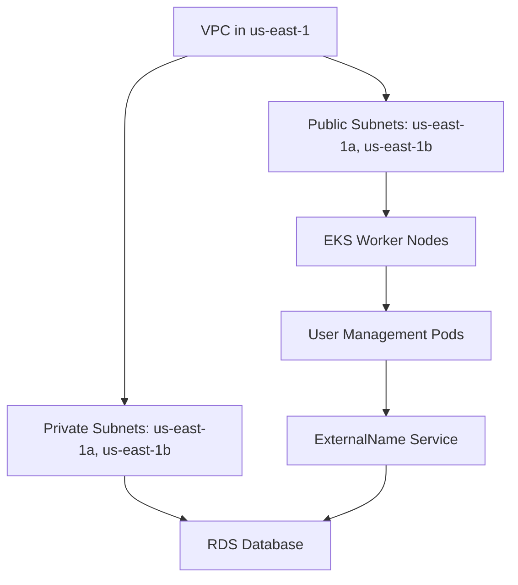

# Section 9: EKS Storage - RDS DB

<details open>
<summary><b>Section 9: EKS Storage - RDS DB (G3PCS46)</b></summary>

## Table of Contents
- [9.1 EKS Storage - RDS DB Introduction](#91-eks-storage---rds-db-introduction)
- [9.2 Create RDS DB](#92-create-rds-db)
- [9.3 Create Kubernetes ExternalName Service & Other Manifests, Deploy & Test](#93-create-kubernetes-externalname-service--other-manifests-deploy--test)
- [Summary](#summary)

## 9.1 EKS Storage - RDS DB Introduction

### Overview
This topic introduces the challenges of using MySQL pods within a Kubernetes cluster for production workloads and explains why AWS RDS (Relational Database Service) is a better alternative. It covers the drawbacks of manual MySQL configurations, Elastic Block Store (EBS) limitations in availability zones, and the benefits of leveraging managed cloud services. The discussion includes an AWS architecture overview showing how RDS integrates with EKS clusters in VPCs, promoting high availability and reduced operational overhead.

### Key Concepts/Deep Dive
- **Drawbacks of In-Cluster MySQL**:
  - Complex setup for high availability using StatefulSets.
  - Requires MySQL expertise for manual configurations.
  - Kubernetes documentation provides basic examples but lacks automatic backups, recovery, or upgrades.

- **EBS Limitations**:
  - Availability zone-level resource, limiting cross-region availability.
  - Complicates master-master MySQL setups and high-availability architectures.

- **Benefits of AWS RDS**:
  - Automatic high availability, backups, and recovery.
  - Read replicas, metrics, monitoring, and scheduled upgrades.
  - Multi-AZ support with DNS-based endpoint management.
  - Reduces need for DevOps to handle database administration.

```diff
+ Advantages: RDS handles high availability, backups, and monitoring out of the box
- Disadvantages: In-cluster MySQL requires manual expert-level setup and maintenance
! Alert: Use cloud services for production resilience instead of self-managed workloads
```

- **Kubernetes ExternalName Service**:
  - Used to connect Kubernetes pods to external services like RDS.
  - Provides a stable DNS alias within the cluster.

> [!NOTE]
> RDS endpoints are DNS-based, simplifying connection management without IP worries.

- **AWS Architecture Overview**:
  - VPC created with EKS cluster, including private and public subnets across AZs (e.g., us-east-1a, us-east-1b).
  - Worker nodes run in public subnets initially (to be moved to private in later sections).
  - RDS deployed in private subnets for security.
  - User Management application pods connect via ExternalName service to RDS.



### Lab Demo
No explicit steps or code provided in this introduction; focuses on conceptual overview.

## 9.2 Create RDS DB

### Overview
This practical section guides through creating an RDS MySQL database in a private subnet of the existing EKS VPC, including prerequisites like security groups and subnet groups. It emphasizes using free-tier resources for testing while outlining production configurations. Steps include reviewing VPC subnets, creating security groups, configuring DB subnet groups, and launching the RDS instance.

### Key Concepts/Deep Dive
- **Prerequisites for RDS in EKS VPC**:
  - Review VPC subnets created with EKS cluster (private subnets: e.g., 10.64.0.0/19, 10.96.0.0/19).
  - Worker nodes in public subnets; RDS in private for security.

- **Security Groups**:
  - Create DB Security Group in the EKS VPC.
  - Inbound rule: Allow MySQL (port 3306) from anywhere (acceptable for testing).

```bash
# Example Security Group Creation (via AWS Console or CLI)
aws ec2 create-security-group \
  --group-name eks-rds-db-sg \
  --description "Allow access to RDS DB on port 3306" \
  --vpc-id <eks-vpc-id>
```

- **DB Subnet Group**:
  - Create in RDS service, selecting private subnets (us-east-1a and us-east-1b).
  - Ensures RDS spans multiple AZs for availability.

```yaml
# DB Subnet Group Configuration (via AWS CLI example)
aws rds create-db-subnet-group \
  --db-subnet-group-name eks-rds-db-subnet-group \
  --db-subnet-group-description "Subnet group for EKS RDS DB" \
  --subnet-ids <private-subnet-1> <private-subnet-2>
```

- **RDS Database Creation**:
  - Standard create, MySQL engine, free-tier for testing.
  - Instance identifier: user-mgmt-db.
  - Master username: db-admin.
  - Password: db-password11 (matches Kubernetes secret).
  - Instance class: db.t2.micro.
  - Storage: 20GB, General Purpose SSD.
  - VPC: EKS cluster VPC.
  - DB Subnet Group: eks-rds-db-subnet-group.
  - Security Group: eks-rds-db-sg.
  - Port: 3306.
  - No initial database (created manually later for learning).
  - AZ: us-east-1a.

```diff
+ Best Practice: Use free-tier for learning, production for HA/multi-AZ
- Warning: Publicly accessible should be disabled for production databases
! Alert: Skip auto-generated passwords; use strong manual ones
```

> [!IMPORTANT]
> Database creation takes ~10 minutes. Endpoint URL (e.g., user-mgmt-db.abcdef.us-east-1.rds.amazonaws.com) will be used in Kubernetes manifests.

### Lab Demo
1. Navigate to AWS Console > VPC > Subnets; identify private subnets (e.g., 10.64.0.0/19, 10.96.0.0/19).
2. EC2 > Security Groups: Create group `eks-rds-db-sg` with inbound MySQL rule.
3. RDS > Subnet Groups: Create `eks-rds-db-subnet-group` with selected private subnets.
4. RDS > Databases: Create MySQL DB with parameters above; wait for creation.
5. Retrieve endpoint from RDS dashboard after creation.

## 9.3 Create Kubernetes ExternalName Service & Other Manifests, Deploy & Test

### Overview
This section focuses on integrating RDS with Kubernetes by creating an ExternalName service, updating application manifests, and deploying to EKS. It includes connecting to RDS via kubectl to create the user-mgmt schema, updating credentials, and testing the user management application. Cleanup notes for ongoing use in subsequent sections are provided.

### Key Concepts/Deep Dive
- **ExternalName Service**:
  - Type: ExternalName.
  - External name: RDS endpoint (e.g., user-mgmt-db.abcdef.us-east-1.rds.amazonaws.com).
  - Allows pods to reference RDS DNS without Kubernetes internal exposure.

```yaml
apiVersion: v1
kind: Service
metadata:
  name: mysql
spec:
  type: ExternalName
  externalName: user-mgmt-db.abcdef.us-east-1.rds.amazonaws.com  # Replace with actual endpoint
```

```diff
+ Advantage: Simplifies external service connection within cluster
- Limitation: No load balancing or internal IP; relies on external DNS
```

- **Manual Database Setup**:
  - Connect via kubectl run temp MySQL pod.
  - Create user-mgmt database schema.

```bash
kubectl run mysql-client --image=mysql:8.0 --restart=Never -- bash -c "mysql -h <rds-endpoint> -u db-admin -pdb-password11"
# Inside pod: CREATE DATABASE user_mgmt; SHOW DATABASES;
kubectl delete pod mysql-client
```

- **Update Application Manifests**:
  - Change DB_USERNAME environment variable from 'root' to 'db-admin'.
  - DB_PASSWORD remains 'db-password11' (decoded from Kubernetes secret).

```yaml
# Example Deployment Update
env:
  - name: DB_USERNAME
    value: "db-admin"
  - name: DB_PASSWORD
    valueFrom:
      secretKeyRef:
        name: mysql-db-password
        key: db-password
```

- **Deployment and Testing**:
  - Apply manifests: ExternalName service, updated deployments.
  - Verify pods run and tables are created automatically by Spring Boot.
  - Test via NodePort (e.g., http://<worker-node-ip>:31231/user-mgmt/health/status).

```bash
kubectl apply -f kube-manifests/
kubectl get pods
kubectl get svc
# Verify endpoint: curl http://<external-ip>:31231/user-mgmt/health/status
```

> [!NOTE]
> Application startup creates 'users' table; verify with MySQL client.

### Lab Demo
1. Create and apply ExternalName service YAML with RDS endpoint.
2. Use kubectl run to launch MySQL client pod, connect to RDS, and run `CREATE DATABASE user_mgmt;`.
3. Update deployment YAML: Change DB_USERNAME to 'db-admin'.
4. Apply updated manifests: kubectl apply -f kube-manifests/02-user-mgmt-rest-app.yml, etc.
5. Wait for pods to start; check logs with `kubectl logs <pod-name>`.
6. Get worker node public IP; access health endpoint via NodePort (port 31231).
7. For cleanup: kubectl delete -f kube-manifests/; optionally modify RDS to disable backups for cost savings.

## Summary

### Key Takeaways
```diff
+ RDS simplifies production deployments by handling HA, backups, and scaling automatically.
- Avoid in-cluster MySQL for production due to complexity and manual maintenance.
! RDS integration via ExternalName service enables secure, external database connectivity in EKS.
+ Private subnets ensure database security; ExternalName provides stable DNS references.
- Free-tier limits HA; use production tier for multi-AZ/multi-replica setups.
+ End-to-end workflow: VPC setup → Security groups → DB subnet group → RDS create → Kubernetes manifests → Test deployment.
```

### Quick Reference
- **RDS Endpoint**: DNS alias for connection (e.g., user-mgmt-db.xxx.rds.amazonaws.com:3306).
- **Credentials**: Username: db-admin, Password: db-password11.
- **Commands**:
  - Create MySQL client: `kubectl run mysql-client --image=mysql:8.0 --restart=Never -- bash -c "mysql -h <endpoint> -u db-admin -pdb-password11"`.
  - Check pods: `kubectl get pods`.
  - Test app: `curl http://<node-ip>:31231/user-mgmt/health/status`.
- **Manifests**: ExternalName service for RDS, updated ENV vars in deployments.

### Expert Insight
- **Real-World Application**: Use RDS for any database-backed microservices in EKS; integrate with AWS services like Lambda or DynamoDB for complementary needs. In enterprise setups, enable Multi-AZ for 99.9% uptime.
- **Expert Path**: Master's RDS parameter groups, CloudWatch monitoring, and Aurora alternatives for better performance. Automate with Terraform or CloudFormation for IaC consistency.
- **Common Pitfalls**: Overlooking security groups causing connectivity failures; forgetting to update app passwords for AWS IAM auth. Monitor costs on free-tier exits; always use private subnets for databases.

### Transcript Corrections
- "myas skill" corrected to "MySQL".
- "Qubernetes" corrected to "Kubernetes".
- "cubectl" corrected to "kubectl".
- "publicly" in notes should be "private" subnets clarified.

</details>
