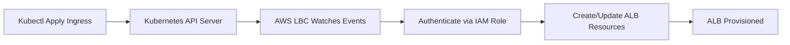

# Section 11: AWS Load Balancer Controller and Ingress

<details open>
<summary><b>Section 11: AWS Load Balancer Controller and Ingress (G3PCS46)</b></summary>

## Table of Contents

1. [Section Overview and Demo Roadmap](#overview)
2. [AWS Application Load Balancer Introduction](#alb-intro)
3. [AWS Load Balancer Controller Architecture](#lbc-architecture)
4. [Prerequisites Verification](#prerequisites)
5. [IAM Resources Setup](#iam-setup)
6. [AWS LBC Installation via Helm](#helm-install)
7. [LBC Deployment Verification](#verification)
8. [Kubernetes Ingress Class Concept](#ingress-class)
9. [Ingress Deployment and Testing](#deploy-ingress)
10. [Summary](#summary)

## Section Overview and Demo Roadmap {#overview}

### Overview
This section covers the complete setup and implementation of AWS Load Balancer Controller (LBC) for Amazon EKS, enabling Kubernetes Ingress resources to provision AWS Application Load Balancers (ALB) automatically. The AWS LBC replaces the deprecated ALB Ingress Controller with enhanced features and better Kubernetes API compliance.

### Key Concepts
The section implements 14 comprehensive demos covering AWS LBC installation, Ingress fundamentals, and advanced routing scenarios using ALB:

1. **Demo 1**: Install AWS Load Balancer Controller
2. **Demo 2**: Ingress Basics
3. **Demo 3**: Ingress Context Path-Based Routing
4. **Demo 4**: SSL and SSL Redirect
5. **Demo 5**: SSL Redirect (Continued)
6. **Demo 6**: External DNS Installation
7. **Demo 7**: Ingress + External DNS
8. **Demo 8**: Kubernetes Service + External DNS
9. **Demo 9**: Name-Based Virtual Host Routing
10. **Demo 10**: SSL Discovery Host
11. **Demo 11**: SSL Discovery DNS
12. **Demo 12**: Ingress Groups
13. **Demo 13**: IP Mode Target Types
14. **Demo 14**: Internal ALB Configuration

The demos leverage ALB's advanced features like path-based routing, host-based routing, HTTP header/query parameter routing, user authentication, health checks, and Lambda function integration.

### Expert Insight
> Real-world Application: AWS LBC enables production-ready ingress solutions for EKS clusters, supporting advanced traffic routing, SSL termination, and seamless integration with AWS services like Route 53 for DNS management.

> Expert Path: Master AWS LBC by understanding its architecture, traffic modes (instance vs. IP), and annotation system. Focus on security implications of target group configurations and proper IAM role scoping.

> Common Pitfalls: Incorrect VPC/subnet configuration leading to ALB creation failures; missing IAM permissions causing access denied errors; and improper ingress class annotation resulting in ignored ingress resources.

## AWS Application Load Balancer Introduction {#alb-intro}

### Overview
AWS Application Load Balancer (ALB) is a Layer 7 load balancer that supports HTTP/HTTPS traffic routing. Unlike Classic Load Balancers, ALB operates at the application layer and provides intelligent routing capabilities.

### Key Features and Capabilities

ALB supports advanced routing and load balancing features:

- **Path-Based Routing**: Route traffic based on URL paths (e.g., `/app1/*` → App1 backend, `/app2/*` → App2 backend)
- **Host-Based Routing**: Route traffic based on hostnames for multi-tenant applications (e.g., `app1.domain.com` → App1 backend)
- **Advanced Conditions**: Route based on HTTP headers, HTTP methods, query parameters, and source IP addresses
- **Authentication**: OIDC-based user authentication before routing requests to applications
- **Health Checks**: Target-group level health monitoring for each service
- **Target Registration**: Register targets by IP address for containerized applications
- **Integration**: Native support for ECS, Lambda functions, and CloudWatch metrics

### ALB Ingress Controller (ALB IC) Overview

ALB Ingress Controller is a Kubernetes controller that watches for Ingress resource events and automatically provisions ALBs with appropriate listeners, rules, and target groups.

**Traffic Modes:**
- **Instance Mode** (Default): Registers EC2 worker nodes as ALB targets; traffic flows: ALB → NodePort Service → Pod
- **IP Mode**: Registers pod IPs directly as ALB targets; ideal for Fargate or scenarios requiring direct pod access

IP mode is mandatory for Fargate-based EKS clusters since Fargate doesn't support NodePort services.

**ALB IC Workflow:**
```mermaid
graph TD
    A[Kubernetes API Server] --> B[ALB Ingress Controller]
    B --> C[Watch Ingress Events]
    C --> D[Create AWS Resources]
    D --> E[ALB v2 Application Load Balancer]
    D --> F[Target Groups per Service]
    D --> G[Listeners (HTTP/HTTPS)]
    D --> H[Rules for Routing]
```

When an Ingress resource is deployed, the ALB Ingress Controller:
1. Creates an ALB (ELBv2) in AWS
2. Provisions target groups for each Kubernetes service
3. Configures listeners and routing rules
4. Registers targets (nodes or IPs) based on the traffic mode

**Note:** All AWS resources follow the Ingress lifecycle - deleting the Ingress resource automatically cleans up associated ALBs and target groups.

### Code Example: Basic ALB Ingress Manifest
```yaml
apiVersion: networking.k8s.io/v1
kind: Ingress
metadata:
  name: my-app-ingress
  annotations:
    kubernetes.io/ingress.class: alb
spec:
  rules:
  - http:
      paths:
      - path: /
        pathType: Prefix
        backend:
          service:
            name: my-app-service
            port:
              number: 80
```

### Expert Insight
> Real-world Application: ALB's advanced routing enables microservices architectures where different URL paths serve different application components, improving resource utilization and maintenance.

> Expert Path: Deep understanding of ALB's 4096-character rule limit and target group limits (up to 1000 targets per group) is crucial for designing scalable ingress solutions.

> Common Pitfalls: ALB-only works with HTTP/HTTPS protocols; forgetting to configure proper security groups allowing ALB-to-node communication; and not specifying target-type annotations correctly.

## AWS Load Balancer Controller Architecture {#lbc-architecture}

### Overview
AWS Load Balancer Controller (AWS LBC) is the successor to AWS ALB Ingress Controller, providing enhanced Kubernetes compatibility and support for both Application Load Balancers and Network Load Balancers.

### Architecture Components

AWS LBC requires several Kubernetes and AWS components:

**Kubernetes Objects (kube-system namespace):**
- **Service Account**: `aws-load-balancer-controller` with IAM role annotation
- **Deployment**: Controller pods with webhook certificate validation
- **Webhook Service**: ClusterIP service on port 443 forwarding to controller port 9443
- **TLS Secret**: `aws-load-balancer-tls` containing webhook certificates

**AWS IAM Components:**
- **IAM Policy**: Grants permissions for ALB/NLB creation, modification, and deletion
- **IAM Role**: Attached to Kubernetes service account via OIDC federation
- **Trust Policy**: Allows EKS service account to assume the IAM role

**Controller Functionality:**


The controller uses Kubernetes service account tokens (JWT) to authenticate with AWS APIs through OpenID Connect (OIDC) federation configured during EKS cluster setup.

### Key Differences from ALB Ingress Controller
- Supports latest Kubernetes Ingress API (`networking.k8s.io/v1`)
- Compatible with Kubernetes 1.22+
- Supports both ALB and NLB creation
- Improved annotation system and configuration options

### IAM Policy Requirements
The controller requires comprehensive permissions including:
- ELBv2 actions (CreateLoadBalancer, ModifyLoadBalancer, etc.)
- EC2 actions for subnet/security group management
- WAF/Shield integration permissions
- Route53 permissions for DNS operations
- CloudWatch metrics publishing

### Installation Methods
The controller can be installed via:
- **Helm Charts** (Recommended): Provides easy version management and upgrades
- **YAML Manifests**: Direct kubectl application of manifests
- **AWS EKS Add-ons**: Managed service with automatic updates

For Helm installation with restricted IMDS access or Fargate usage, additional flags for region and VPC ID are required.

### Expert Insight
> Real-world Application: AWS LBC enables GitOps workflows where Kubernetes manifests trigger infrastructure provisioning automatically through CI/CD pipelines.

> Expert Path: Understand controller logs to debug provisioning issues; master annotation reference for advanced features like stickiness and health checks.

> Common Pitfalls: Using incorrect IAM policy versions causing permission errors; specifying wrong VPC ID leading to subnet discovery failures; and not updating controller versions regularly.

## Prerequisites Verification {#prerequisites}

### Required Tools and Versions
Ensure the following tools are installed with compatible versions:

- **eksctl**: AWS EKS management CLI
- **kubectl**: Kubernetes CLI (version within 1 minor version of EKS control plane)
- **AWS CLI**: AWS command line interface
- **Helm**: Kubernetes package manager

### EKS Cluster Requirements
- EKS cluster with worker nodes (EC2 or Fargate)
- Properly configured kubectl context
- IAM OIDC provider associated with the EKS cluster (configured in section 01-02)

### Verification Commands
```bash
# Version checks
eksctl version
kubectl version --short
aws --version

# EKS cluster verification
eksctl get cluster
kubectl get nodes

# OIDC provider check
aws eks describe-cluster --name <cluster-name> --query "cluster.identity.oidc.issuer"

# IAM service accounts (should be empty initially)
eksctl get iamserviceaccount --cluster <cluster-name>
```

### Expert Insight
> Common Pitfalls: kubectl version mismatch causing resource creation failures; IAM OIDC provider not configured preventing service account role assumption; and cluster not in READY state blocking deployments.

## IAM Resources Setup {#iam-setup}

### Step 1: Create IAM Policy
Download the latest AWS Load Balancer Controller IAM policy and create the policy:

```bash
# Download policy
curl -o iam_policy.json https://raw.githubusercontent.com/kubernetes-sigs/aws-load-balancer-controller/main/docs/install/iam_policy.json

# Create IAM policy
aws iam create-policy \
    --policy-name AWSLoadBalancerControllerIAMPolicy \
    --policy-document file://iam_policy.json
```

**Note:** The policy ARN should be noted for subsequent steps. Example format: `arn:aws:iam::<account-id>:policy/AWSLoadBalancerControllerIAMPolicy`

### Step 2: Create IAM Role and Service Account
Use eksctl to create both IAM role and Kubernetes service account in a single command:

```bash
eksctl create iamserviceaccount \
    --cluster=<cluster-name> \
    --namespace=kube-system \
    --name=aws-load-balancer-controller \
    --attach-policy-arn=<policy-arn> \
    --approve
```

This command:
- Creates IAM role with attached policy
- Creates Kubernetes service account in kube-system namespace
- Annotates service account with IAM role ARN
- Enables OIDC-based authentication

### Step 3: Verification
```bash
# Check IAM service account
eksctl get iamserviceaccount --cluster <cluster-name>

# Verify Kubernetes service account annotation
kubectl describe serviceaccount aws-load-balancer-controller -n kube-system
```

The service account should have annotation: `eks.amazonaws.com/role-arn: arn:aws:iam::<account-id>:role/eksctl-<cluster-name>-addon-iamserviceaccount-kube-system-aws-load-balancer-controller`

### Expert Insight
> Real-world Application: Proper IAM role scoping prevents over-permissive policies while ensuring controller functionality.

> Expert Path: Understand the JWT token flow from Kubernetes service account to AWS API authentication for troubleshooting authentication issues.

> Common Pitfalls: Using outdated IAM policy versions causing permission errors; incorrect OIDC provider configuration blocking role assumption.

## AWS LBC Installation via Helm {#helm-install}

### Helm Repository Setup
```bash
# Add EKS charts repository
helm repo add eks https://aws.github.io/eks-charts
helm repo update
```

### Installation Command
```bash
helm install aws-load-balancer-controller eks/aws-load-balancer-controller \
    --namespace kube-system \
    --set clusterName=<cluster-name> \
    --set serviceAccount.create=false \
    --set serviceAccount.name=aws-load-balancer-controller \
    --set region=<aws-region> \
    --set vpcId=<vpc-id> \
    --set image.repository=<account-id>.dkr.ecr.<region>.amazonaws.com/amazon/aws-load-balancer-controller
```

**Parameters:**
- `clusterName`: EKS cluster name
- `serviceAccount.create=false`: Use existing service account
- `serviceAccount.name`: Pre-created service account name
- `region`: AWS region (required for image repository)
- `vpcId`: EKS cluster VPC ID
- `image.repository`: ECR repository URL for specified region

**Region and Account ID Mapping:**
- us-east-1: 602401143452
- us-west-2: 602401143452
- eu-west-1: 602401143452
- ap-southeast-1: 602401143452

**Additional Flags for Restricted Environments:**
- `--set region=<region>`: Required for IMDS-restricted EC2 nodes
- `--set vpcId=<vpc-id>`: Required for IMDS-restricted or Fargate environments

### Example Installation
```bash
helm install aws-load-balancer-controller eks/aws-load-balancer-controller \
    --namespace kube-system \
    --set clusterName=eks-demo1 \
    --set serviceAccount.create=false \
    --set serviceAccount.name=aws-load-balancer-controller \
    --set region=us-east-1 \
    --set vpcId=vpc-12345678 \
    --set image.repository=602401143452.dkr.ecr.us-east-1.amazonaws.com/amazon/aws-load-balancer-controller
```

### Expert Insight
> Real-world Application: Helm-based installation enables version control and rollback capabilities for controller updates in production environments.

> Expert Path: Monitor controller logs with `kubectl logs -f deployment/aws-load-balancer-controller -n kube-system` for debugging deployment issues.

> Common Pitfalls: Incorrect VPC ID causing subnet discovery failures; missing region specification leading to image pull errors; service account name mismatch preventing authentication.

## LBC Deployment Verification {#verification}

### Deployment Verification
```bash
# Check deployment status
kubectl get deployment aws-load-balancer-controller -n kube-system

# Detailed deployment information
kubectl describe deployment aws-load-balancer-controller -n kube-system
```

**Expected Output:**
- Replicas: 2/2 (READY)
- Containers: aws-load-balancer-controller:v2.3.1+
- Service Account: aws-load-balancer-controller
- Ports: 9443 (webhook-server), 8080 (metrics)

### Webhook Service Verification
```bash
# Check webhook service
kubectl get svc aws-load-balancer-webhook-service -n kube-system
```

**Expected Output:**
- Type: ClusterIP
- Port: 443 → 9443
- Selector matches deployment labels

### TLS Certificate Verification
```bash
# Check TLS secret
kubectl get secret aws-load-balancer-tls -n kube-system
kubectl describe secret aws-load-balancer-tls -n kube-system
```

The certificate should have:
- Common Name: aws-load-balancer-controller
- Subject Alternative Names: aws-load-balancer-webhook-service.kube-system, aws-load-balancer-webhook-service.kube-system.svc

### Pod Logs Verification
```bash
# Check controller pod logs
kubectl logs -f deployment/aws-load-balancer-controller -n kube-system
```

**Successful logs show:**
- Controller starting on ports 9443/8080
- Successfully authenticated with AWS APIs
- No error messages

### Expert Insight
> Common Pitfalls: Deployment stuck in pending state due to insufficient resources; TLS secret not properly mounted causing webhook validation errors.

## Kubernetes Ingress Class Concept {#ingress-class}

### Overview
Kubernetes Ingress Classes define which ingress controller should handle specific Ingress resources in clusters with multiple ingress controllers.

### Ingress Class Definition
```yaml
apiVersion: networking.k8s.io/v1
kind: IngressClass
metadata:
  name: my-aws-ingress-class
  annotations:
    ingressclass.kubernetes.io/is-default-class: "true"
spec:
  controller: ingress.k8s.aws/alb
```

**Key Components:**
- **Controller**: Identifies the target ingress controller (`ingress.k8s.aws/alb` for AWS LBC)
- **is-default-class**: Makes this the default ingress class for all Ingress resources
- **Name**: Reference used in Ingress resources

### Ingress Resource Structure
When `is-default-class: "true"` is set, Ingress resources don't need explicit class specification:

```yaml
apiVersion: networking.k8s.io/v1
kind: Ingress
metadata:
  name: nginx-app-ingress
spec:
  rules:
  - http:
      paths:
      - path: /
        pathType: Prefix
        backend:
          service:
            name: app-one-nginx-nodeport-service
            port:
              number: 80
```

### Default Class Behavior
- Without `is-default-class: "true"`: Ingress resources require `spec.ingressClassName` field
- With `is-default-class: "true"`: Ingress resources automatically use the default controller

### Deployment Steps
```bash
# Deploy IngressClass
kubectl apply -f ingress-class.yaml

# Verify deployment
kubectl get ingressclass

# Describe IngressClass
kubectl describe ingressclass my-aws-ingress-class
```

### Expert Insight
> Real-world Application: Multi-controller clusters use Ingress Classes to route traffic through different ingress solutions based on requirements (ALB for AWS features, NGINX for custom middleware).

> Expert Path: Annotations on Ingress Classes enable controller-specific configurations beyond standard Kubernetes API.

> Common Pitfalls: Multiple default classes causing conflicts; forgetting to specify controller name exactly as expected.

## Ingress Deployment and Testing {#deploy-ingress}

### Basic Ingress Manifest
Create a simple Ingress resource to test AWS LBC functionality:

```yaml
apiVersion: networking.k8s.io/v1
kind: IngressClass
metadata:
  name: my-aws-ingress-class
  annotations:
    ingressclass.kubernetes.io/is-default-class: "true"
spec:
  controller: ingress.k8s.aws/alb
---
apiVersion: networking.k8s.io/v1
kind: Ingress
metadata:
  name: nginx-app-ingress
  annotations:
    alb.ingress.kubernetes.io/load-balancer-name: app-one-ingress
    alb.ingress.kubernetes.io/scheme: internet-facing
spec:
  ingressClassName: my-aws-ingress-class
  defaultBackend:
    service:
      name: app-one-nginx-nodeport-service
      port:
        number: 80
  rules:
  - http:
      paths:
      - path: /
        pathType: Prefix
        backend:
          service:
            name: app-one-nginx-nodeport-service
            port:
              number: 80
```

### Key Annotations
- `alb.ingress.kubernetes.io/load-balancer-name`: Custom ALB name
- `alb.ingress.kubernetes.io/scheme`: `internet-facing` or `internal`

### Deployment Verification
```bash
# Deploy Ingress resources
kubectl apply -f kube-manifest/

# Check Ingress status
kubectl get ingress
kubectl describe ingress nginx-app-ingress

# Verify ALB creation in AWS Console (EC2 > Load Balancers)
# Check target groups and listeners
```

### Testing Steps
1. Note the ALB DNS name from AWS Console
2. Update security groups to allow HTTP/HTTPS traffic
3. Access the ALB DNS to verify traffic routing
4. For internal ALBs, test from within VPC (e.g., bastion host)

### Expert Insight
> Real-world Application: Internal ALBs enable secure internal service exposure without public internet access, commonly used for microservices communication.

> Common Pitfalls: Security groups blocking ALB-to-target communication; incorrect subnet configuration (public vs. private subnets); hostname resolution issues during testing.

## Summary {#summary}

### Key Takeaways
```diff
+ AWS Load Balancer Controller automates ALB provisioning from Kubernetes Ingress resources
+ Supports instance mode (default EC2) and IP mode (Fargate-compatible)
+ Requires proper IAM setup with OIDC federation for authentication
+ Ingress classes enable multi-controller environments
+ ALB provides advanced routing: path-based, host-based, and condition-based
+ Helm installation simplifies deployment and management
- Manual IAM policy creation is error-prone - use provided templates
- Controller version compatibility critical for Kubernetes API support
```

### Quick Reference Commands
```bash
# Install prerequisites
eksctl create iamserviceaccount --cluster <cluster> --namespace kube-system --name aws-load-balancer-controller --attach-policy-arn <arn>

# Install controller
helm install aws-load-balancer-controller eks/aws-load-balancer-controller --namespace kube-system --set clusterName=<cluster>

# Verify installation
kubectl get deployment aws-load-balancer-controller -n kube-system
kubectl get ingressclass

# Deploy sample ingress
kubectl apply -f ingress-manifest.yaml
```

### Expert Insight
> Real-world Application: AWS LBC enables zero-downtime deployments through automated load balancer management and health check integration.

> Expert Path: Combine AWS LBC with External DNS for automatic Route 53 record management and certificate management with AWS Certificate Manager.

> Common Pitfalls: Insufficient IAM permissions causing creation failures; VPC/subnet tagging issues preventing ALB placement; ingress class conflicts in multi-controller setups.

### What's Next
Section 11 completes AWS Load Balancer Controller installation and basic ingress concepts. Subsequent sections will implement the 14 demos covering advanced routing, SSL termination, external DNS integration, and internal ALB configurations.

</details>
