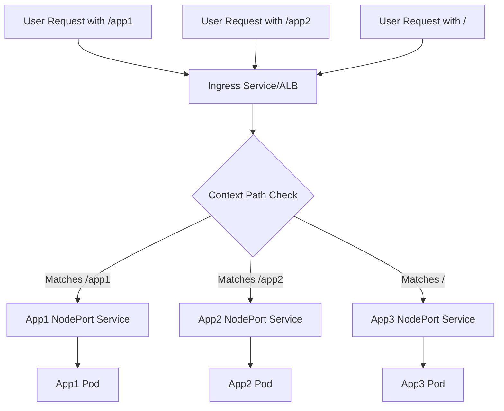

# Section 13: Ingress Context Path Based Routing

<details open>
<summary><b>Section 13: Ingress Context Path Based Routing (G3PCS46)</b></summary>

## Table of Contents
- [Introduction to Ingress Context Path Based Routing](#introduction-to-ingress-context-path-based-routing)
- [Review Kubernetes Deployment and NodePort Service Manifests](#review-kubernetes-deployment-and-nodeport-service-manifests)
- [Review Ingress Context Path Based Routing, Deploy and Verify](#review-ingress-context-path-based-routing-deploy-and-verify)
- [Importance of Rules Ordering in Ingress Context Path Based Routing](#importance-of-rules-ordering-in-ingress-context-path-based-routing)
- [Summary](#summary)

## Introduction to Ingress Context Path Based Routing

### Overview
This lecture introduces the implementation of context path based routing using Kubernetes Ingress with AWS Application Load Balancer (ALB). It explains the network architecture involving VPC, subnets, EKS cluster, and deployed applications, detailing how requests are routed based on URL paths to different services. The focus is on deploying three applications with defined rules for routing requests to corresponding pods via NodePort services and ingress.

### Key Concepts/Deep Dive

#### Network Architecture and Components
- **VPC Setup**: Utilizes a VPC with public and private subnets.
- **EKS Cluster**: Includes control plane and private node group in private subnets.
- **Ingress Controller**: Already installed in the cluster for handling ingress resources.
- **Applications**: Three applications (app1, app2, app3) deployed with:
  - Individual deployments for each app.
  - NodePort services for each app.
  - Ingress service defining context path based routing rules.

#### Routing Rules and Logic
- **Context Path Rules**:
  - `/app1` routes to app1 NodePort service → app1 pods.
  - `/app2` routes to app2 NodePort service → app2 pods.
  - `/` (root) routes to app3 NodePort service → app3 pods.
- **User Access Flow**:
  - Requests to `<ALB-DNS-URL>/` → app3 via ingress and NodePort.
  - Requests to `<ALB-DNS-URL>/app1` → app1 via ingress and NodePort.
  - Requests to `<ALB-DNS-URL>/app2` → app2 via ingress and NodePort.
- **Kubernetes Objects View**:
  - Ingress controller monitors API server for ingress resources.
  - Upon detecting ingress, creates equivalent AWS ALB with routing rules.
  - ALB and ingress are unified (no proxying between them).

#### AWS and Kubernetes Object Relationships
- **Single Object Concept**: AWS ALB and Kubernetes ingress service are representations of the same entity. The ALB handles routing directly to NodePort services and pods.
- **Deployment Sequence**: Admin deploys deployments, NodePort services, and ingress manifest via kubectl, triggering ALB creation.

> [!IMPORTANT]
> The ingress controller creates AWS ALB automatically when ingress resources are deployed, ensuring seamless path-based routing.

#### Diagram: Ingress Context Path Routing Flow


## Review Kubernetes Deployment and NodePort Service Manifests

### Overview
This lecture reviews the Kubernetes manifests for deployments and NodePort services of three applications (app1, app2, app3). It highlights the differences in container images and health check paths, emphasizing the shift of health check path annotations to the service level for per-application customization in ALB ingress scenarios.

### Key Concepts/Deep Dive

#### Manifest Structure for Each Application
- **App1 Manifest (01-nginx-app1-deployment-and-nodeport-service.yaml)**:
  - **Deployment**: 
    - Replicas: 1
    - Selector labels: `app: app1-nginx`
    - Container image: `stacksimplify/kube-nginxapp1`
    - Ports: Standard nginx ports
  - **NodePort Service**:
    - Selector: `app: app1-nginx`
    - Type: NodePort
    - Health check path annotation: `/app1/index.html`
- **App2 Manifest (02-nginx-app2-deployment-and-nodeport-service.yaml)**:
  - **Deployment**:
    - Replicas: 1
    - Selector labels: `app: app2-nginx`
    - Container image: `stacksimplify/kube-nginxapp2`
    - Ports: Standard nginx ports
  - **NodePort Service**:
    - Selector: `app: app2-nginx`
    - Type: NodePort
    - Health check path annotation: `/app2/index.html`
- **App3 Manifest (03-nginx-app3-deployment-and-nodeport-service.yaml)**:
  - **Deployment**:
    - Replicas: 1 (Note: Transcript specifies app3, but code shows consistent labeling)
    - Selector labels: `app: app3-nginx`
    - Container image: `stacksimplify/kube-nginx` (root context)
    - Ports: Standard nginx ports
  - **NodePort Service**:
    - Selector: `app: app3-nginx`
    - Type: NodePort
    - Health check path annotation: `/index.html` (root context)

#### Key Differences and Annotations
- **Health Check Paths**: Moved to NodePort service level for application-specific health checks, required when dealing with multiple targets in ALB ingress.
- **Selector Match Labels**: Ensure consistent labeling (e.g., `app: app1-nginx`) across deployment and service for proper pod selection.
- **Image Variations**: app1 and app2 use context-specific images, while app3 uses generic nginx for root path serving.

#### Common Patterns
- All deployments follow standard structure with labels, spec, and template.
- NodePort services expose apps on high ports, routed via ALB ingress.

> [!NOTE]
> Health check paths are critical for ALB to monitor pod health; incorrectly configured paths can lead to failed health checks.

## Review Ingress Context Path Based Routing, Deploy and Verify

### Overview
This lecture reviews the ALB ingress manifest for context path based routing, demonstrates deployment via kubectl, and verifies functionality through CLI commands and AWS console checks. It covers target group creation, health checks, and browser-based testing to confirm routing works as expected.

### Key Concepts/Deep Dive

#### Ingress Manifest Review (04-alb-ingress-context-path-based-routing.yaml)
- **Metadata**:
  - Name: `ingress-cpr-demo`
  - Annotations:
    - Load balancer name: `cpr-ingress`
    - Ingress class: `my-aws-ingress-class`
- **Rules Specification**:
  - `/app1`: Forwards to `app1-nginx-nodeport-service` on port 80
  - `/app2`: Forwards to `app2-nginx-nodeport-service` on port 80
  - `/`: Forwards to `app3-nginx-nodeport-service` on port 80

```yaml
apiVersion: networking.k8s.io/v1
kind: Ingress
metadata:
  name: ingress-cpr-demo
  annotations:
    alb.ingress.kubernetes.io/load-balancer-name: cpr-ingress
    kubernetes.io/ingress.class: my-aws-ingress-class
spec:
  rules:
  - host:  # Optional, for path-based routing
    http:
      paths:
      - path: /app1
        pathType: Prefix
        backend:
          service:
            name: app1-nginx-nodeport-service
            port:
              number: 80
      - path: /app2
        pathType: Prefix
        backend:
          service:
            name: app2-nginx-nodeport-service
            port:
              number: 80
      - path: /
        pathType: Prefix
        backend:
          service:
            name: app3-nginx-nodeport-service
            port:
              number: 80
```

#### Lab Demo: Deploy and Verify Manifests
1. **Navigate to Manifest Directory**:
   ```bash
   cd 08-new-elb-application-load-balancers/0803-alb-ingress-context-path-based-routing/kube-manifests/
   ```

2. **Deploy All Resources**:
   ```bash
   kubectl apply -f .
   ```
   - Expected Output: Deployments, NodePort services, and ingress created successfully.

3. **Verify Resources**:
   - **Pods Status**:
     ```bash
     kubectl get pods
     ```
     - Confirm app1-nginx, app2-nginx, app3-nginx pods are Running.
   - **Services**:
     ```bash
     kubectl get svc
     ```
     - Verify Type: NodePort for all apps.
   - **Ingress Details**:
     ```bash
     kubectl get ingress
     ```
     - Check ADDRESS for ALB DNS name (e.g., `ingress-cpr-demo-<hash>-1104311640-<region>.elb.amazonaws.com:80`).
     - Describe ingress rules:
       ```bash
       kubectl describe ingress ingress-cpr-demo
       ```
       - Confirm rules for `/app1`, `/app2`, `/`.

4. **AWS Console Verification**:
   - **Load Balancer**: State should be "active"; DNS matches kubectl output.
   - **Listeners**: Port 80 with rules:
     - `/app1*` → app1-nginx target group (priority: highest).
     - `/app2*` → app2-nginx target group.
     - `/*` → app3-nginx target group.
   - **Target Groups**:
     - Registered targets: All worker nodes (spanned via NodePort service).
     - Health checks: Paths match service annotations (`/app1/index.html`, `/app2/index.html`, `/index.html`).
     - Targets marked "healthy".

5. **Browser Testing**:
   - **App1**: `<ALB-DNS>/<app1>/index.html` → Displays app1 content (light green).
   - **App2**: `<ALB-DNS>/<app2>/index.html` → Displays app2 content (different color).
   - **App3 (Default)**: `<ALB-DNS>/index.html` → Displays app3 content (V1 label).

6. **Logs Verification** (Optional)**:
   ```bash
   kubectl logs -f <pod-name>
   ```
   - Confirm 200 responses for health checks and browser requests.

#### Key Observations
- ALB automatically creates target groups for each service.
- Health check paths propagate from service annotations to ALB.
- Requests route correctly based on paths.

> [!IMPORTANT]
> Ingress deployment triggers automatic ALB creation; always verify AWS console for listener rules and target group health.

## Importance of Rules Ordering in Ingress Context Path Based Routing

### Overview
This lecture demonstrates the criticality of rule ordering in ingress context path based routing, showing how incorrect order can break routing. It emphasizes placing broader patterns like root context at the end and introduces alternatives like default backend.

### Key Concepts/Deep Dive

#### Rule Ordering Impact Demonstration
- **Incorrect Order Example**: If root path `/` is first:
  - Ingress rules reordered: `/` first, then `/app1`, `/app2`.
  - **Result**: All requests (including `/app1`, `/app2`) match `/` and route to app3.
  - **Browser Test**:
    - `/app1/index.html` → 404 Not Found
    - `/app2/index.html` → 404 Not Found
    - `/index.html` → Works (app3)
  - **Cause**: Broader pattern catches more specific paths.

- **Correct Order**: Specific paths before broader ones.
  - Rule priority in ALB: `/app1*` highest, `/app2*` medium, `/*` lowest.

#### Best Practices for Rule Ordering
- Define specific paths before general ones.
- Place root context rules at the end.
- Avoid overlaps that could mask other routes.

#### Alternatives to Rule Ordering
- **Default Backend**: Comment out `/` path; uncomment `defaultBackend`.
  ```yaml
  spec:
    defaultBackend:
      service:
        name: app3-nginx-nodeport-service
        port:
          number: 80
    rules:
    - http:
        paths:
        - path: /app1
          backend:
            service:
              name: app1-nginx-nodeport-service
              port:
                number: 80
        - path: /app2
          backend:
            service:
              name: app2-nginx-nodeport-service
              port:
                number: 80
  ```
  - Routes unmatched paths to app3 (equivalent to root rule).

#### Lab Demo: Test and Rollback
1. **Modify Ingress**:
   - Move `/` rule to top in manifest.
   - Redeploy: `kubectl apply -f kube-manifests/`

2. **Verify Failure**:
   - `kubectl describe ingress ingress-cpr-demo` → Rules show reordered.
   - Test URLs → app1/app2 fail, root works.

3. **Rollback**:
   - Restore original rule order.
   - Redeploy to fix.

4. **Cleanup**:
   ```bash
   kubectl delete -f kube-manifests/
   ```
   - Removes ALB and associated resources to avoid costs.

> [!WARNING]
> Poor rule ordering can silently break routing! Always test after changes and clean up resources promptly.

## Summary

### Key Takeaways
```diff
+ Context path based routing enables URL-based traffic distribution via Kubernetes Ingress and AWS ALB
- Incorrect rule ordering breaks specific path routing, causing 404 errors for misconfigured patterns
+ Health check paths move to NodePort service annotations for per-app ALB health monitoring
- Broader paths (e.g., /) must come after specific ones to avoid overshadowing routes
+ aws-ingress-cpr-demo unifies Kubernetes ingress and AWS ALB as a single managed resource
```

### Quick Reference
- **Deploy Manifests**:
  ```bash
  kubectl apply -f kube-manifests/
  ```
- **Check Ingress**:
  ```bash
  kubectl get ingress; kubectl describe ingress <name>
  ```
- **Test Routing**:
  - App1: `<ALB-DNS>/app1/index.html`
  - App2: `<ALB-DNS>/app2/index.html`
  - Default: `<ALB-DNS>/index.html`
- **Cleanup**:
  ```bash
  kubectl delete -f kube-manifests/
  ```

### Expert Insight
#### Real-world Application
In production microservices architectures, context path based routing simplifies service exposure without requiring separate DNS per service. Use with ALB for cost-effective, scalable traffic management in EKS, integrating with CI/CD for automated rule updates.

#### Expert Path
Master path-based ingress by practicing ANTLR-style regex patterns and combining with middleware (e.g., authentication). Dive into annotations like `alb.ingress.kubernetes.io/conditions` for conditional routing and monitor with CloudWatch for ALB metrics.

#### Common Pitfalls
- Forgotten cleanup leads to ALB billing surprises.
- Overlapping paths cause unexpected 404s—always test order.
- Health check paths mismatched between services and actual app endpoints result in unhealthy targets.

</details>
