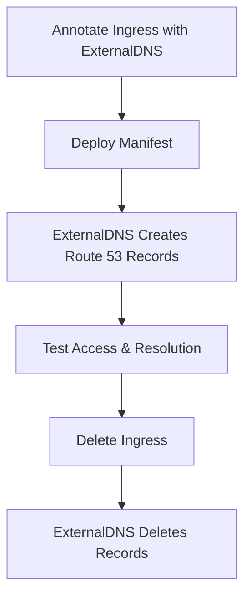

# Section 15: External DNS for EKS - Installation and Demonstration

<details open>
<summary><b>Section 15: External DNS for EKS - Installation and Demonstration (G3PCS46)</b></summary>

## Table of Contents
- [15.1 Step-01- Introduction to ALB Ingress External DNS Install](#151-step-01--introduction-to-alb-ingress-external-dns-install)
- [15.2 Step-02- Create IAM Policy, k8s Service Account, IAM Role and Verify](#152-step-02--create-iam-policy-k8s-service-account-iam-role-and-verify)
- [15.3 Step-03- Review and Update External DNS k8s manifest](#153-step-03--review-and-update-external-dns-k8s-manifest)
- [15.4 Step-04- Deploy External DNS and Verify Logs](#154-step-04--deploy-external-dns-and-verify-logs)
- [15.5 Step-05- Ingress Service Demo with External DNS](#155-step-05--ingress-service-demo-with-external-dns)
- [15.6 Step-06- Kubernetes Service Demo with External DNS](#156-step-06--kubernetes-service-demo-with-external-dns)

## 15.1 Step-01- Introduction to ALB Ingress External DNS Install

### Overview
This section introduces ExternalDNS, a Kubernetes controller that automatically manages DNS records for Kubernetes services and ingresses using cloud DNS providers like AWS Route 53. It explains the motivation behind using ExternalDNS, the need to automate DNS record management instead of manual creation in Route 53, and the key components involved in its deployment within an EKS cluster.

### Key Concepts/Deep Dive
ExternalDNS automates DNS record creation, updates, and deletion for Kubernetes resources by querying the Kubernetes API server and interacting with cloud DNS services. The core architecture includes:

- **Components Involved**:
  - **EKS Cluster**: The Kubernetes environment where ExternalDNS runs.
  - **ExternalDNS Service Account**: A Kubernetes service account (e.g., `external-dns`) used by the ExternalDNS pod.
  - **IAM Role**: An AWS IAM role attached to the service account via annotations for accessing Route 53.
  - **IAM Policy**: Permissions granted to the IAM role for Route 53 operations like creating, updating, and deleting DNS records.
  - **ExternalDNS Deployment**: A Kubernetes deployment that runs the ExternalDNS pod, monitoring ingresses and services for ExternalDNS annotations.

- **Workflow**:
  1. Annotate Kubernetes ingresses or services with ExternalDNS metadata (e.g., `external-dns.alpha.kubernetes.io/hostname`).
  2. ExternalDNS pod queries the Kubernetes API for annotated resources.
  3. It creates/updates/deletes DNS records in Route 53 based on the annotations.

- **Annotations Example**:
  - `external-dns.alpha.kubernetes.io/hostname: myapp.example.com`

This setup replaces manual DNS record management, reducing errors and improving automation in CI/CD pipelines.

### Code/Config Blocks
No specific code blocks in this introductory section, but here's an example annotation structure:

```yaml
metadata:
  annotations:
    external-dns.alpha.kubernetes.io/hostname: dns-test-2901.stack-simplify.com
```

### Tables
| Component | Description |
|-----------|-------------|
| ExternalDNS Pod | Monitors Kubernetes API and manages DNS records |
| IAM Policy | Grants Route 53 permissions (ChangeResourceRecordSets, ListHostedZones, etc.) |
| Kubernetes Service Account | Annotated with IAM role ARN for cloud access |

### Lab Demos
None explicitly included; this is a conceptual introduction setting up for the practical implementation in subsequent steps.

## 15.2 Step-02- Create IAM Policy, k8s Service Account, IAM Role and Verify

### Overview
This step covers creating the necessary AWS IAM resources and Kubernetes service accounts for ExternalDNS to function. It includes defining an IAM policy with Route 53 permissions, using `eksctl` to create an IAM service account (which provisions both the Kubernetes service account and IAM role), and verifying the setup via commands and AWS console.

### Key Concepts/Deep Dive
- **IAM Policy Creation**:
  - Policy document allows actions like `route53:ChangeResourceRecordSets` (create/update/delete records), `route53:ListHostedZones` (enumerate zones), and `route53:ListResourceRecordSets` (get record details).
  - Applied to any hosted zone (`"Resource": "*"`) or scoped if needed.

- **eksctl IAM Service Account**:
  - Command: `eksctl create iam sa --name external-dns --namespace default --cluster <cluster-name> --attach-policy-arn <policy-arn> --approve --overwrite`
  - This creates:
    - Kubernetes service account: `external-dns` in `default` namespace.
    - IAM role annotated on the service account.
    - Associates the specified IAM policy to the role.

- **Verification**:
  - Use `kubectl get serviceaccount` and `kubectl describe serviceaccount external-dns` to check annotations (IAM role ARN).
  - Check CloudFormation stack created by eksctl.
  - Use `eksctl get iam sa --cluster <cluster-name>` to list roles.

Common issues: Incorrect policy ARN or cluster name leading to permission errors.

### Code/Config Blocks
IAM Policy JSON:

```json
{
    "Version": "2012-10-17",
    "Statement": [
        {
            "Effect": "Allow",
            "Action": [
                "route53:ChangeResourceRecordSets",
                "route53:ListHostedZones",
                "route53:ListResourceRecordSets"
            ],
            "Resource": "*"
        }
    ]
}
```

eksctl Command Example:

```bash
eksctl create iamserviceaccount \
  --name external-dns \
  --namespace default \
  --cluster eksdemo1 \
  --attach-policy-arn arn:aws:iam::123456789012:policy/AllowExternalDNSUpdates \
  --approve \
  --override-existing-serviceaccounts
```

### Tables
| Resource Type | Name | Purpose |
|---------------|------|---------|
| IAM Policy | AllowExternalDNSUpdates | Grant Route 53 permissions |
| K8s Service Account | external-dns | Pod identity in Kubernetes |
| IAM Role | Auto-generated by eksctl | Cloud access via IRSA |

### Lab Demos
1. Create IAM policy in AWS console or via CLI with the provided JSON.
2. Run the eksctl command to create the service account and role.
3. Verify via `kubectl describe sa external-dns` and inspect IAM role ARN.
4. Check CloudFormation stack for created resources.

## 15.3 Step-03- Review and Update External DNS k8s manifest

### Overview
This step involves reviewing and customizing the ExternalDNS Kubernetes manifest for EKS deployment. Key updates include setting the IAM role ARN, commenting out irrelevant settings (e.g., for Kiam/kube2iam), configuring domain filters, policy settings, and ensuring the correct image version.

### Key Concepts/Deep Dive
- **Manifest Components**:
  - Service Account (covered in previous step).
  - ClusterRole and ClusterRoleBinding for API access.
  - Deployment with ExternalDNS container.

- **Key Configurations**:
  - **IAM Role ARN**: Annotate the deployment or service account with the created role ARN.
  - **Domain Filter**: Uncomment to limit to specific domains (e.g., `--domain-filter=stack-simplify.com`); leave commented for all hosted zones.
  - **Policy (txt-owner-id)**: Identifies records for safety; useful in multi-cluster setups.
  - **Registry TXT**: Use for TXT record ownership.
  - **Zone Type**: Set to `public`, `private`, or omit for both.
  - **Source**: Include `ingress` and/or `service` for monitoring.
  - **Image Version**: Update to latest (e.g., `k8s.gcr.io/external-dns/external-dns:v0.10.2`).

- **Security Settings**:
  - Comment `--policy=sync` for "upsert only" (prevents deletes for safety); leave uncommented for full synchronization.

Diff blocks for key changes:

```diff
+ spec.template.spec.serviceAccountName: external-dns
- # Comment out Kiam/kube2iam settings if not used
+ --domain-filter=stack-simplify.com  # Optional: limit to specific domain
+ --policy=sync  # Enable full sync (create/delete)
```

### Code/Config Blocks
Updated Deployment Excerpt:

```yaml
apiVersion: apps/v1
kind: Deployment
metadata:
  name: external-dns
spec:
  template:
    spec:
      serviceAccountName: external-dns
      containers:
      - name: external-dns
        image: k8s.gcr.io/external-dns/external-dns:v0.10.2
        args:
        - --source=service
        - --source=ingress
        - --domain-filter=stack-simplify.com  # Optional
        - --policy=sync
        - --registry=txt
        - --txt-owner-id=my-identifier
        - --zone-type=public
```

### Tables
| Setting | Purpose | Example Value |
|---------|---------|---------------|
| domain-filter | Limit DNS updates to specific domain | `stack-simplify.com` |
| policy | Upsert-only or full sync | `sync` (full) or `upsert-only` (create only) |
| registry | TXT record handling for ownership | `txt` |

### Lab Demos
1. Edit the manifest file to set the IAM role ARN.
2. Comment out irrelevant lines (e.g., Kiam settings).
3. Optionally add domain filters.
4. Ensure image version is current.

> [!NOTE]
> Always review the ExternalDNS GitHub repository for the latest configurations and image tags.

## 15.4 Step-04- Deploy External DNS and Verify Logs

### Overview
Deploy the updated ExternalDNS manifest to the EKS cluster and verify successful deployment through pods, logs, and resource creation. This includes applying the YAML and monitoring for errors.

### Key Concepts/Deep Dive
- **Deployment Steps**:
  - Apply manifest: `kubectl apply -f kubernetes-manifests/01-deploy-external-dns.yaml`.
  - Verify components: Service account, ClusterRole, ClusterRoleBinding, Deployment.

- **Verification**:
  - Check pod status: `kubectl get pods`.
  - Inspect logs: `kubectl logs -f deployment/external-dns` for startup messages.
  - Ensure no permission errors; logs should show successful client creation and provider initialization.

- **Potential Issues**:
  - IAM role issues: Verify annotations and policy attachments.
  - Warnings for existing resources: Ignoring them if reapplying manifests.

### Code/Config Blocks
Apply Command:

```bash
kubectl apply -f kubernetes-manifests/01-deploy-external-dns.yaml
```

Verification Commands:

```bash
kubectl get all -n default
kubectl logs -f deployment/external-dns
```

### Tables
| Command | Purpose |
|---------|---------|
| kubectl apply | Deploy ExternalDNS resources |
| kubectl get pods | Check running ExternalDNS pod |
| kubectl logs | Monitor for errors or success messages |

### Lab Demos
1. Navigate to the manifest directory and apply via `kubectl apply`.
2. Check resource creation output (e.g., service account, deployment).
3. Run `kubectl get pods` to confirm the ExternalDNS pod is running.
4. Tail logs to ensure no errors (e.g., "created Kubernetes client", "applying provider record filter").

> [!IMPORTANT]
> If logs show permission errors, double-check IAM policy and role attachments.

## 15.5 Step-05- Ingress Service Demo with External DNS

### Overview
Demonstrate ExternalDNS integration with a Kubernetes Ingress service by adding annotations, deploying the manifest, and verifying automatic DNS record creation in Route 53, as well as cleanup upon deletion.

### Key Concepts/Deep Dive
- **Annotations**: Add `external-dns.alpha.kubernetes.io/hostname` to Ingress spec for custom DNS names.
- **Resource Types**: Targets ALB-backed ingresses (via ALB Ingress Controller).
- **Lifecycle**:
  - Create: Deploys apps and ingress; ExternalDNS creates records.
  - Test: NS lookup and browser access to confirm resolution and SSL redirect.
  - Delete: Removes ingress; ExternalDNS deletes records automatically with `--policy=sync`.

- **Network Flow**: `DNS Name (e.g., dnstest901.stack-simplify.com) → Route 53 Alias → ALB DNS → Application Pods`.

### Code/Config Blocks
Ingress Manifest Excerpt:

```yaml
apiVersion: networking.k8s.io/v1
kind: Ingress
metadata:
  name: ingress-external-dns-demo
  annotations:
    kubernetes.io/ingress.class: "alb"
    external-dns.alpha.kubernetes.io/hostname: dnstest901.stack-simplify.com, dnstest902.stack-simplify.com
    # ... other annotations for SSL, etc.
spec:
  rules:
  - host: dnstest901.stack-simplify.com
    # Routing rules
```

NS Lookup Test:

```bash
nslookup dnstest901.stack-simplify.com
```

Cleanup:

```bash
kubectl delete -f kubernetes-manifests/
```

### Tables
| Action | Expected Outcome |
|--------|------------------|
| Deploy Ingress | DNS records created in Route 53 (Type: A) |
| Access DNS | Resolves to ALB's IP; HTTPS redirect works |
| Delete Ingress | DNS records auto-deleted; logs show "desired change delete" |

### Lab Demos
1. Update Ingress YAML with ExternalDNS annotations and multiple hostnames.
2. Apply manifests: `kubectl apply -f kubernetes-manifests/`.
3. Monitor ExternalDNS logs for creation messages (e.g., "create dnstest901...").
4. Verify Route 53: Confirm A records with ALB alias values.
5. Test access: Browser -> HTTP redirects to HTTPS with valid cert.
6. Delete manifests; Confirm DNS records removed and ALB deleted.

Flowchart for Workflow:



## 15.6 Step-06- Kubernetes Service Demo with External DNS

### Overview
Showcase ExternalDNS with a standard Kubernetes LoadBalancer service, automating DNS for classic load balancers in AWS.

### Key Concepts/Deep Dive
- **Target Resource**: Services of type `LoadBalancer` (creates Classic ELB/CLB).
- **Annotations**: Similar to ingress, using `external-dns.alpha.kubernetes.io/hostname`.
- **DNS Behavior**: Creates alias records pointing to the ELB's DNS.
- **Lifecycle**: Full CRUD automation with `--policy=sync`.

- **Comparison to Ingress**: LoadBalancer services are simpler but deploy CLBs; ingresses use ALBs via controller.

```diff
- Ingress: ALB-backed, advanced routing
+ Service LB: CLB-backed, simpler load balancing
```

### Code/Config Blocks
Service Manifest:

```yaml
apiVersion: v1
kind: Service
metadata:
  name: nginx-app-lb
  annotations:
    external-dns.alpha.kubernetes.io/hostname: external-dns-k8s-svc-demo101.stack-simplify.com
spec:
  type: LoadBalancer
  selector:
    app: nginx-app1
  ports:
  - port: 80
    targetPort: 80
```

Testing Commands:

```bash
kubectl apply -f kubernetes-manifests/01-nginx-app1-deployment.yaml 02-nginx-app-lb-service.yaml
kubectl logs -f deployment/external-dns  # Monitor creation
nslookup external-dns-k8s-svc-demo101.stack-simplify.com
kubectl delete -f kubernetes-manifests/  # Cleanup
```

### Tables
| Resource | Alias Target | Notes |
|----------|--------------|-------|
| Hosted Zone | CLB DNS | Route 53 A record points to ELB |

### Lab Demos
1. Create Nginx deployment and annotated LoadBalancer service.
2. Apply and monitor logs: "create external-dns-k8s-svc-demo101...".
3. Verify Route 53 for new record; ELB status (instances in service).
4. Access via DNS; confirm app reaches pods.
5. Delete; verify DNS removal and CLB deletion.

## Summary

```diff
+ Key Takeaways:
- ExternalDNS automates DNS management for EKS Kubernetes resources like ingresses and services, eliminating manual Route 53 updates.
+ IAM setup (policy, role, service account) is crucial for AWS permissions; use eksctl for streamlined creation.
+ Configurations like domain filters and sync policy control behavior and security; full sync enables auto-deletion.
+ Annotations drive automation: Add `external-dns.alpha.kubernetes.io/hostname` with comma-separated domains.
+ Testing involves logs monitoring, Route 53 verification, nslookup, and browser access; cleanup happens automatically with sync enabled.
+ Targets AWS Route 53; supports ingresses (ALB) and services (CLB) for production workloads.
```

### Quick Reference
- **Create IAM Service Account**: `eksctl create iamserviceaccount --name external-dns --namespace default --cluster <cluster> --attach-policy-arn <arn> --approve`
- **Apply Manifest**: `kubectl apply -f 01-deploy-external-dns.yaml`
- **Check Logs**: `kubectl logs -f deployment/external-dns`
- **Annotation Example**: `external-dns.alpha.kubernetes.io/hostname: myapp.example.com`
- **Verify Deletion**: Monitor logs for "desired change delete" and confirm Route 53 cleanup.

### Expert Insight
**Real-world Application**: Deploy ExternalDNS in production EKS clusters to manage multi-environment (dev/staging/prod) DNS automatically, integrating with CI/CD for zero-downtime deployments. Use domain filters for tenant isolation.

**Expert Path**: Master advanced configs like TXT ownership for idempotent operations in shared zones; explore multi-cloud providers via ExternalDNS; benchmark API polling intervals for performance.

**Common Pitfalls**: Forgetting `--policy=sync` leads to orphan DNS records on cleanup; incorrect IAM ARNs cause permission denied errors; ensure hosted zones match domain filters to avoid failures.

</details>
