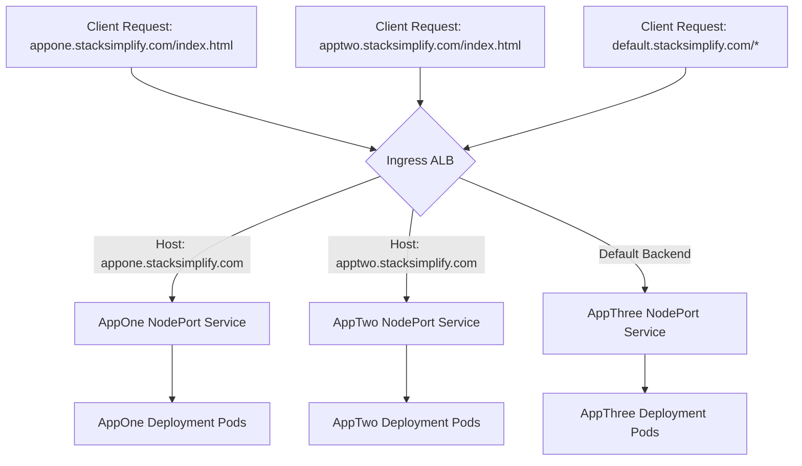

# Section 16: Ingress Name Based Virtual Host Routing

<details open>
<summary><b>Section 16: Ingress Name Based Virtual Host Routing (G3PCS46)</b></summary>

## Table of Contents
- [16.1 Step-01- Introduction to Ingress Name Based Virtual Host Routing](#161-step-01--introduction-to-ingress-name-based-virtual-host-routing)
- [16.2 Step-02- Implement Ingress NVR Demo](#162-step-02--implement-ingress-nvr-demo)
- [Summary](#summary)

<a id="161-step-01--introduction-to-ingress-name-based-virtual-host-routing"></a>
## 16.1 Step-01- Introduction to Ingress Name Based Virtual Host Routing

### Overview
Ingress Name-Based Virtual Host Routing enables routing traffic to different services based on the Host header in HTTP requests, allowing multiple domains to share the same IP address and port. This concept supports hosting multiple applications on a single cluster using domain-specific rules, similar to virtual hosting in traditional web servers. In this implementation, we'll use AWS Application Load Balancer (ALB) to demonstrate routing for three sample applications (AppOne, AppTwo, AppThree) based on hostname domains.

### Key Concepts/Deep Dive
- **Network Architecture**: Continue using three Kubernetes deployments (AppOne, AppTwo, AppThree) with their corresponding NodePort services. The Ingress resource defines rules based on Host headers to route requests.
- **Host-Based Routing Rules**:
  - Define rules for specific hostnames directing traffic to respective services.
  - Example: `appone.stacksimplify.com` routes to AppOne NodePort service, `apptwo.stacksimplify.com` to AppTwo, and a default domain for AppThree.
- **Default Backend**: Requests matching a wildcard or unspecified host (e.g., `*.stacksimplify.com`) route to the default backend, configured via external DNS annotations pointing to AppThree.
- **DNS Integration**: When deploying Ingress with host rules, ExternalDNS automatically creates Route 53 records for the specified hostnames, enabling domain-based access.
- **Flow Diagram**: Visualize the routing logic using Mermaid.



- **Ingress Rule Structure**: Rules start with `host` (unlike path-based rules under `http`). Under each host, define the service destination.

  **Example YAML Snippet**:
  ```yaml
  - host: appone.stacksimplify.com
    http:
      paths:
      - path: /
        pathType: Prefix
        backend:
          service:
            name: appone-nodeport-service
            port:
              number: 80
  ```

### Lab Demos
No explicit hands-on demo in this introduction; preparation for subsequent implementation.

<a id="162-step-02--implement-ingress-nvr-demo"></a>
## 16.2 Step-02- Implement Ingress NVR Demo

### Overview
This section demonstrates implementing Name-Based Virtual Host Routing using an Ingress resource on AWS ALB with ExternalDNS integration. We'll review the manifest, deploy the resources, verify DNS and load balancer configuration, test access, and clean up. The demo ensures host-based routing works correctly, isolating traffic to services based on domain names.

### Key Concepts/Deep Dive
- **Manifest Structure**:
  - Reuse AppOne, AppTwo, AppThree deployments and NodePort services from previous sections.
  - Ingress Manifest Key Components:
    - **Name**: Updated to `ingress-name-based-virtual-host-demo` for clarity.
    - **Load Balancer Name**: Set to `name-based-hosts-ingress` for identification.
    - **SSL Configuration**: Ensure Certificate ARN is updated for HTTPS (443).
    - **ExternalDNS Annotation**: Configures default backend domain (e.g., `default101.stacksimplify.com` pointing to AppThree).
    - **Rules Section**: Defines host-based routing.
      - `app101.stacksimplify.com`: Routes to `appone-nginx-nodeport-service`.
      - `app201.stacksimplify.com`: Routes to `apptwo-nginx-nodeport-service`.
      - Default: Handled via annotation to `appthree-nginx-nodeport-service`.

  **Example Ingress YAML**:
  ```yaml
  apiVersion: networking.k8s.io/v1
  kind: Ingress
  metadata:
    name: ingress-name-based-virtual-host-demo
    annotations:
      alb.ingress.kubernetes.io/certificate-arn: arn:aws:acm:us-east-1:123456789012:certificate/12345678-1234-1234-1234-123456789012
      external-dns.alpha.kubernetes.io/hostname: default101.stacksimplify.com
  spec:
    ingressClassName: alb
    rules:
    - host: app101.stacksimplify.com
      http:
        paths:
        - path: /
          pathType: Prefix
          backend:
            service:
              name: appone-nginx-nodeport-service
              port:
                number: 80
    - host: app201.stacksimplify.com
      http:
        paths:
        - path: /
          pathType: Prefix
          backend:
            service:
              name: apptwo-nginx-nodeport-service
              port:
                number: 80
  ```

- **Deployment Steps**:
  - Deploy all manifests using `kubectl apply -f kube-manifest/`.
  - Verify: `kubectl get pods`, `kubectl get svc`, `kubectl get ingress`.
- **Verification**:
  - **ExternalDNS Logs**: Confirm creation of Route 53 records for `app101.stacksimplify.com`, `app201.stacksimplify.com`, and `default101.stacksimplify.com`.
  - **Route 53**: Validate A records pointing to the ALB.
  - **Load Balancer**:
    - Default listener (80) redirects to 443 (HTTPS).
    - Rules on port 443: Route based on Host header to respective target groups.
    - Target Groups: Ensure nodes are registered and healthy.
  - **NSLookup**: Verify DNS resolution for all domains to ALB IPs.
- **Access Testing**:
  - Browse `app101.stacksimplify.com`: Accesses AppOne.
  - Browse `app201.stacksimplify.com`: Accesses AppTwo.
  - Browse `default101.stacksimplify.com`: Accesses AppThree.
  - Negative Tests: e.g., `app101.stacksimplify.com/app2/index.html` returns 404 (no cross-app routing).

  **Test Results Table**:
  | Domain | Expected Service | Status |
  |--------|------------------|--------|
  | app101.stacksimplify.com | AppOne | ✅ Accessible |
  | app201.stacksimplify.com | AppTwo | ✅ Accessible |
  | default101.stacksimplify.com | AppThree | ✅ Accessible |
  | app101.stacksimplify.com/app2/index.html | (None - Different App) | ❌ 404 |

- **Cleanup**:
  - Delete manifests: `kubectl delete -f kube-manifest/`.
  - Verify ExternalDNS logs show deletions.
  - Confirm Route 53 records and ALB are removed.

### Lab Demos
1. **Deploy Manifests**:
   - Navigate to `section-0809-name-based-virtual-host-routing/kube-manifest/`.
   - Apply: `kubectl apply -f .`.
   - Verify resources: `kubectl get pods`, `kubectl get svc`, `kubectl get ingress`.

2. **Verify Configuration**:
   - Check ExternalDNS logs for DNS record creation.
   - Inspect Route 53hosted zone for records.
   - Review ALB listeners and rules.

3. **Test Routing**:
   - Access domains via browser.
   - Perform nslookup: `nslookup app101.stacksimplify.com`.
   - Test negatives for isolation.

4. **Cleanup**:
   - Delete: `kubectl delete -f .`.
   - Confirm logs and Route 53 cleanup.

## Summary

### Key Takeaways
```diff
+ Host-based routing isolates applications by domain, enabling multi-tenant deployments on shared clusters.
+ ExternalDNS integrates seamlessly with Ingress rules to manage DNS automatically.
+ ALB supports host header conditions for scalable routing without additional infrastructure.
! Ensure SSL certificates are configured for production HTTPS enforcement.
- Avoid mixed routing (e.g., path + host) without clear priorities to prevent conflicts.
- Misconfigured host rules can lead to unintended default backend traffic.
```

### Quick Reference
- **Deploy Ingress**: `kubectl apply -f ingress-manifest.yaml`
- **Check Rules**: `kubectl get ingress -o yaml` (verify rules section)
- **ExternalDNS Annotation**: `external-dns.alpha.kubernetes.io/hostname: your-domain.com`
- **NSLookup**: `nslookup <domain>` (confirm Routing to ALB IP)
- **Cleanup**: `kubectl delete -f kube-manifest/`

### Expert Insight

#### Real-world Application
In production, use Name-Based Virtual Hosts for microservices where each service has its subdomain (e.g., API Gateway at `api.example.com` routing to API pods). Combine with TLS certificates for secure, domain-isolated traffic. Scale by adding more host rules as services grow.

#### Expert Path
Master this by experimenting with wildcard hosts, HTTP/2 support, and integrating with Cert-Manager for automatic SSL. Benchmark ALB performance under load and monitor via CloudWatch metrics for latency/spike handling.

#### Common Pitfalls
- **DNS Propagation Delay**: Wait 5-10 minutes after deployment for Route 53 changes; use `dig +trace` for debugging.
- **Target Group Health**: Unhealthy targets cause 502 errors; ensure pod selectors match service labels.
- **SSL Redirect Conflicts**: If HTTP traffic isn't redirecting, check ALB annotations.
- **Host Spelling Errors**: Double-check domains in YAML; typos prevent routing.
- **Security**: Expose only necessary ports; use network policies to restrict inter-service traffic.

</details>
