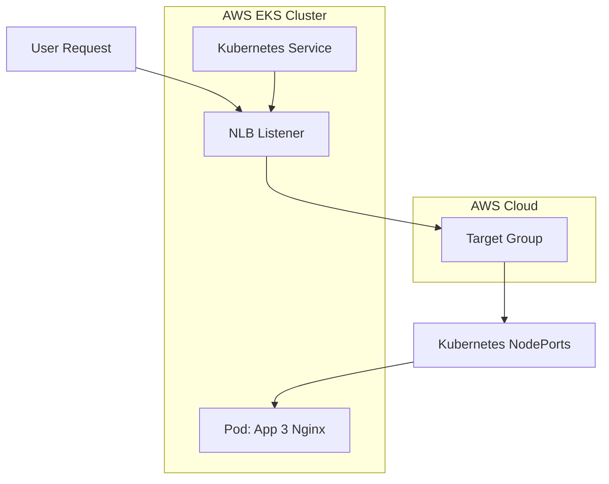
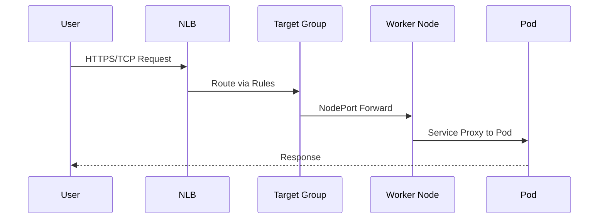
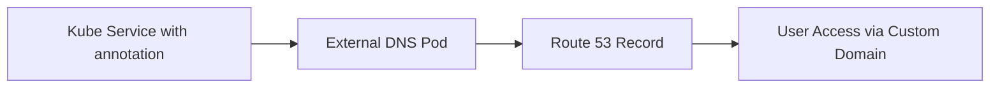

<details open>
<summary><b>Section 22: AWS Network Load Balancer (NLB) with Kubernetes Service (G3PCS46)</b></summary>

# Section 22: AWS Network Load Balancer (NLB) with Kubernetes Service

## Table of Contents
- [22.1 Step-00- Introduction to AWS NLB 6 Demos](#221-step-00--introduction-to-aws-nlb-6-demos)
- [22.2 Step-01- Introduction to Network Load Balancer with k8s Service](#222-step-01--introduction-to-network-load-balancer-with-k8s-service)
- [22.3 Step-02- Review kubernetes manifest - Deployment and Service with NLB Annotation](#223-step-02--review-kubernetes-manifest---deployment-and-service-with-nlb-annotation)
- [22.4 Step-03- Deploy NLB Basics k8s manifests, Verify and CleanUp](#224-step-03--deploy-nlb-basics-k8s-manifests-verify-and-cleanup)
- [22.5 Step-04- Introduction to NLB TLS with k8s Service](#225-step-04--introduction-to-nlb-tls-with-k8s-service)
- [22.6 Step-05- NLB TLS Demo Deploy, Verify and Clean-Up](#226-step-05--nlb-tls-demo-deploy-verify-and-clean-up)
- [22.7 Step-06- NLB External DNS Demo using k8s Service](#227-step-06--nlb-external-dns-demo-using-k8s-service)
- [22.8 Step-07- NLB Elastic IPs Demo using k8s Service](#228-step-07--nlb-elastic-ips-demo-using-k8s-service)
- [22.9 Step-08- NLB InternalLB Demo using k8s Service](#229-step-08--nlb-internallb-demo-using-k8s-service)
- [22.10 Step-09- NLB Fargate Demo with Target Type IP](#2210-step-09--nlb-fargate-demo-with-target-type-ip)
- [Summary](#summary)

## 22.1 Step-00- Introduction to AWS NLB 6 Demos
### Overview
This introductory step outlines the six practical demos for implementing AWS Network Load Balancer (NLB) using Kubernetes Service and the AWS Load Balancer Controller. It covers the transition from the legacy cloud provider controller to the modern AWS Load Balancer Controller, ensuring declarative management of cloud resources through Kubernetes YAML manifests. The demos focus on real-world use cases like basic configurations, SSL/TLS termination, external DNS integration, static IPs, internal load balancers, and Fargate deployment.

### Key Concepts/Deep Dive
#### NLB Demo Overview
- **Demo 1: NLB Basics** - Learn fundamental NLB annotations and configurations using Kubernetes Service for load balancing at Layer 4.
- **Demo 2: NLB TLS/SSL** - Implement SSL offloading and certificate management through NLB annotations in Kubernetes manifests.
- **Demo 3: NLB External DNS** - Integrate external DNS to register NLB DNS names in Route 53 automatically using Kubernetes annotations.
- **Demo 4: NLB Elastic IP** - Use static Elastic IPs with NLB for applications requiring fixed IP addresses, such as UDP-based services.
- **Demo 5: NLB Internal** - Create private internal load balancers for VPC-only access, validated using curl pods within the cluster.
- **Demo 6: NLB Fargate** - Deploy NLB with Fargate serverless pods using IP-based targeting for enhanced scalability.

#### Prerequisites and Setup
- Ensure AWS Load Balancer Controller is installed (from Section 08-09 prerequisites).
- Use Kubernetes Service with `type: LoadBalancer` and `loadBalancerType: "external"` for reconciliation with the modern controller.
- Annotations drive configuration: from basic traffic routing to advanced features like EIPs and TLS.

#### Architecture Diagram


> [!NOTE]
> Each demo builds incrementally, starting with basics and adding features like TLS, DNS, and serverless integration.

### Lab Demo Steps
No hands-on lab in this introductory section; serve as roadmap for subsequent demos. ✅

## 22.2 Step-01- Introduction to Network Load Balancer with k8s Service
### Overview
This step provides an in-depth explanation of AWS Network Load Balancer (NLB) versus Application Load Balancer (ALB), focusing on Layer 4 operations and Kubernetes service integration. It compares legacy vs. modern load balancer controllers, detailing how to ensure services reconcile with the correct controller. Key support for protocols like UDP and TLS, along with annotations for health checks, IP modes, and subnet management.

### Key Concepts/Deep Dive
#### NLB vs ALB Comparison

| Feature | Network Load Balancer (Layer 4) | Application Load Balancer (Layer 7) |
|---------|---------------------------------|-------------------------------------|
| Protocols | TCP, UDP, TLS | HTTP, HTTPS |
| Routing | IP/Port based | Content-based (paths, headers) |
| Health Checks | TCP, HTTP* | HTTP/HTTPS with advanced rules |
| Target Groups | Instance or IP | Instance, IP, Lambda |
| Latency | Ultra-low | Slightly higher |
| Kubernetes Use Case | Service-based load balancing | Ingress-based routing |

> [!TIP]
> NLB excels for high-performance, protocol-agnostic scenarios like gaming or streaming (UDP). Use ALB for path-based routing needs.

#### Load Balancer Controller Evolution
- **Legacy (Cloud Provider):**
  - Basic NLB support; deprecated for new features.
  - Use `service.beta.kubernetes.io/aws-load-balancer-type: nlb` for reconciliation.
  
- **Modern (AWS ALB Controller):**
  - Supports 25+ annotations for fine-tuned configurations.
  - Supports Fargate, internal NLBs, EIPs.
  - Use `service.beta.kubernetes.io/aws-load-balancer-type: external` or `nlb-ip`.

#### NLB Annotations Catalog
- **Traffic Routing:** `service.beta.kubernetes.io/aws-load-balancer-nlb-target-type: instance|ip`
- **Health Checks:** `service.beta.kubernetes.io/aws-load-balancer-healthcheck-protocol: tcp` with path/timeout configs.
- **TLS Encryption:** `service.beta.kubernetes.io/aws-load-balancer-ssl-cert: <ARN>` for SSL termination.
- **Subnet Management:** `service.beta.kubernetes.io/aws-load-balancer-subnets: <subnet-ids>`
- **Scheme/Flexibility:** `service.beta.kubernetes.io/aws-load-balancer-scheme: internet-facing|internal`

```diff
+ Pros: Layer 4 performance, source IP preservation, static IPs.
- Cons: No content-based routing (use ALB/Ingress for that).
! Critical: Always specify subnets for multi-AZ resilience.
```

#### Kubernetes Service for NLB
- **Required Spec:** `type: LoadBalancer`, annotations as above.
- Reconciling happens via webhook; logs in controller pod confirm association.
- Supports both instance (node ports) and IP (direct pod IPs) target types.

#### Architectural Flow


> [!WARNING]
> Fargate requires `nlb-ip` targeting for pod IP registration. Instance targeting uses worker nodes only.

### Lab Demo Steps
No direct lab; annotations and concepts prepare for deployments in subsequent steps. ✅

## 22.3 Step-02- Review kubernetes manifest - Deployment and Service with NLB Annotation
### Overview
This step reviews Kubernetes YAML manifests for an NGINX app deployment and the corresponding Service with NLB-specific annotations. It breaks down each annotation, explaining their purpose in configuring AWS ELB behaviors like target types, health checks, subnets, access controls, and schemes. Emphasis on how Kubernetes service ports translate to NLB listeners and target groups.

### Key Concepts/Deep Dive
#### Core Manifest Structure
- **Deployment:** Standard NGINX app3 with labels for service matching.
  ```yaml
  apiVersion: apps/v1
  kind: Deployment
  metadata:
    name: app3-nginx
  spec:
    replicas: 1
    selector:
      matchLabels:
        app: app3-nginx
    template:
      metadata:
        labels:
          app: app3-nginx  
      spec:
        containers:
        - name: nginx
          image: nginx:latest
          ports:
          - containerPort: 80
  ```
- **Service:** LoadBalancer type with NLB annotations.
  ```yaml
  apiVersion: v1
  kind: Service
  metadata:
    name: basics-lbc-network-lb
    annotations:
      # Traffic Routing
      service.beta.kubernetes.io/aws-load-balancer-nlb-target-type: instance
      service.beta.kubernetes.io/aws-load-balancer-name: basics-lbc-network-lb
      
      # Subnets & Scheme
      service.beta.kubernetes.io/aws-load-balancer-scheme: internet-facing
      
      # Health Checks
      service.beta.kubernetes.io/aws-load-balancer-healthcheck-healthy-threshold: "3"
      service.beta.kubernetes.io/aws-load-balancer-healthcheck-unhealthy-threshold: "3"
      service.beta.kubernetes.io/aws-load-balancer-healthcheck-timeout: "10"
      service.beta.kubernetes.io/aws-load-balancer-healthcheck-interval: "30"
      service.beta.kubernetes.io/aws-load-balancer-healthcheck-path: "/index.html"
      service.beta.kubernetes.io/aws-load-balancer-healthcheck-protocol: "HTTP"
      service.beta.kubernetes.io/aws-load-balancer-healthcheck-port: "traffic-port"
      
      # Access Control
      service.beta.kubernetes.io/aws-load-balancer-source-ranges: 0.0.0.0/0
  spec:
    type: LoadBalancer
    ports:
    - port: 80
      targetPort: 80
      protocol: TCP
    selector:
      app: app3-nginx
  ```

#### Annotation Breakdown
- **Target Type:** `instance` registers worker node NodePorts; `ip` directly targets pod IPs.
- **Scheme:** `internet-facing` deploys in public subnets; `internal` in private subnets.
- **Health Checks:** Supports HTTP/HTTPS for Layer 4/7 validation; path mandatory for protocol mismatches.
- **Listeners vs Target Groups:** Each `port` creates a listener; each `targetPort` creates a unique target group (even with same port).

> [!IMPORTANT]
> Ports map 1:1 to listeners; targetPorts to target groups. Multiple ports with same targetPort create separate target groups.

#### Common Pitfalls in Manifests
- Mismatched labels between deployment and service selectors.
- Invalid subnet IDs causing failures (verify VPC architecture).
- Health check ports blocking registration (use `traffic-port` for auto-resolution).

### Lab Demo Steps
1. Review manifests in IDE (no deployment yet).
2. Validate selectors: Ensure `app: app3-nginx` matches between resources.
3. Annotate for future tweaks: e.g., change scheme to `internal` for private access. ✅

## 22.4 Step-03- Deploy NLB Basics k8s manifests, Verify and CleanUp
### Overview
This demo deploys the NLB basics manifests, verifies health and logs, and cleans up resources. It demonstrates end-to-end NLB creation via Kubernetes, including target group registration and browser access. Key validations include controller reconciliation and AWS console checks.

### Key Concepts/Deep Dive
#### Deployment and Verification Steps
- Deploy manifests: `kubectl apply -f kube-manifests/`
- Verify pods: `kubectl get pods` (app3-nginx running)
- Check service: `kubectl get svc` → External IP = NLB DNS
- Controller logs: `kubectl logs -f aws-load-balancer-controller-pod` (confirm reconciliation via "basics-lbc-network-lb" entries)

#### NLB Characteristics
- **Listeners:** Port 80 (TCP), forwards to target group.
- **Target Groups:** Used NodePorts (e.g., 31751) from worker nodes.
- **Health Checks:** HTTP /index.html on traffic-port.
- Scheme: Internet-facing in public subnets.

#### AWS Console Verification
```diff
+ Type: network (Layer 4)
+ Scheme: internet-facing
- No SSL: Plain HTTP only
! Targets: Register worker instances, notpods directly
```

### Lab Demo Steps
1. `cd 1901-lbc-nlb-basics/`
2. `kubectl apply -f kube-manifests/` → Deploys deployment and service.
3. `kubectl get pods` → Confirm running state.
4. `kubectl get svc` → Note external DNS.
5. Access in browser: HTTP://\<nlb-dns\> → "Welcome to Stack Simplify Kubernetes Fundamentals Demo Application Version V1"
6. Clean up: `kubectl delete -f kube-manifests/`
7. Verify in AWS console: NLB deleted. ✅

## 22.5 Step-04- Introduction to NLB TLS with k8s Service
### Overview
This step introduces TLS/SSL termination for NLB using Kubernetes annotations, including certificate management, security policies, and port configurations. It explains how protocols link to listeners and target groups, emphasizing the 1:1 mapping. Covers frontend (TLS ports) and backend (protocol conversions) handling in Layer 4 context.

### Key Concepts/Deep Dive
#### TLS Annotations Deep Dive
- **SSL Cert:** `service.beta.kubernetes.io/aws-load-balancer-ssl-cert: <ACM-ARN>`
- **Ports:** `service.beta.kubernetes.io/aws-load-balancer-ssl-ports: "443"` (enables non-TLS on other ports)
- **Policy:** `service.beta.kubernetes.io/aws-load-balancer-ssl-negotiation-policy: <policy-name>` (e.g., ELBSecurityPolicy-TLS-1-2-2017)
- **Backend Protocol:** `service.beta.kubernetes.io/aws-load-balancer-backend-protocol: tcp|tls`

#### Port Mapping to NLB Components
- **Kubernetes Port:** `port: 443, targetPort: 80` → TCP listener enabled via SSL cert on NLB.
- **Multiple Ports:** Each port creates separate listener + target group.
- Backend remains TCP (no TLS to pods unless specified).

> [!WARNING]
> For TCP backends, port/targetPort must match (e.g., 80→80). Communication remains unencrypted post-NLB.

#### Security Policies Table
| Policy Name | SSL Protocols | Ciphers |
|-------------|---------------|---------|
| ELBSecurityPolicy-2016-08 | SSL 3.0, TLS 1.0-1.2 | Deprecated weak ciphers |
| ELBSecurityPolicy-TLS-1-2-2017 | TLS 1.2+ | Strong SHA2 ciphers |
| ELBSecurityPolicy-FS-1-2-2019 | TLS 1.2+ only | FIPS-compliant |

### Lab Demo Steps
No deployment; prepare ACM cert (wildcards apply, e.g., *.stacksimplify.com). Match DNS for SSL warning avoidance. ✅

## 22.6 Step-05- NLB TLS Demo Deploy, Verify and Clean-Up
### Overview
This demo deploys TLS-enabled NLB manifests, verifies SSL termination, and tests HTTP/HTTPS access. It highlights certificate association, policy enforcement, and multiple listeners/target groups. Cleanup ensures resource removal.

### Key Concepts/Deep Dive
#### Manifest Amendments
- Add SSL cert ARN: `service.beta.kubernetes.io/aws-load-balancer-ssl-cert: arn:aws:acm:us-east-1:123456789012:certificate/abc123...`
- Enable ports: `service.beta.kubernetes.io/aws-load-balancer-ssl-ports: "443"`
- Policy: ELBSecurityPolicy-TLS-1-2-2017
- Service ports: 80 (HTTP), 443 (HTTPS), optional 81/82 for multiples.

#### NLB Post-Deployment
- **Listeners:** 80 (TCP), 443 (TLS with cert), separate target groups per port.
- **Health:** HTTP on /index.html.
- **Browser Test:** HTTP works plain; HTTPS encrypts but serves same content.

```diff
+ SSL Offloading: Reduces pod overhead
- No Mutual TLS: One-way (client-to-NLB only)
! Target Groups: 4+ for 4 ports (redundant but functional)
```

### Lab Demo Steps
1. Update cert ARN in YAML.
2. `kubectl apply -f .` → Deploy deployments/services.
3. `kubectl get svc` → Note DNS with ports.
4. Access: HTTP://\<dns\>:80/443, HTTPS://\<dns\> (secure lock icon).
5. Cleanup: `kubectl delete -f .` → Verify console deletion. ✅

## 22.7 Step-06- NLB External DNS Demo using k8s Service
### Overview
Integrate external DNS via Kubernetes annotations to auto-register NLB DNS in Route 53. Deploy manifests, verify records, and test custom domains. Emphasizes TLS compatibility and cleanup verification.

### Key Concepts/Deep Dive
#### External DNS Setup
- **Annotation:** `external-dns.alpha.kubernetes.io/hostname: nlb-dns101.stacksimplify.com`
- **Pod Requirements:** External DNS deployed (from prior sections); monitors Service resources.
- **Route 53:** Auto-creates CNAME/A records pointing to NLB DNS.

#### Flow: Service → DNS


> [!NOTE]
> Requires hosted zone (e.g., stacksimplify.com) and external DNS IRSA role.

#### Testing and Cleanup
- `nslookup nlb-dns101.stacksimplify.com` → Resolves to NLB IPs.
- HTTPS works with cert matching domain.

### Lab Demo Steps
1. Deploy external DNS if not present.
2. Add hostname annotation.
3. `kubectl apply -f .` → Check external DNS logs.
4. Verify Route 53 record.
5. Access custom domain via browser.
6. Cleanup: `kubectl delete -f .` → Confirm DNS deletion. ✅

## 22.8 Step-07- NLB Elastic IPs Demo using k8s Service
### Overview
Associate static Elastic IPs (EIPs) with NLB for applications needing fixed IPs. Create EIPs, update manifests, deploy, and test. Useful for UDP services or IP-based connections.

### Key Concepts/Deep Dive
#### EIP Configuration
- **Annotation:** `service.beta.kubernetes.io/aws-load-balancer-eip-allocations: eipalloc-123,eipalloc-456`
- **Count:** Match AZ/subnet count (e.g., 2 AZs → 2 EIPs).
- **DNS Resolution:** Custom domain aliases to EIP-backed NLB.

```diff
+ Static IPs: Never change even after reboots
- Limited: Only for internet-facing NLBs
! Cost: EIPs cost when not associated
```

### Lab Demo Steps
1. Create 2 EIPs in AWS console; note allocation IDs.
2. Update annotation with IDs.
3. `kubectl apply -f .` → Deploy.
4. `nslookup <dns>` → Resolves to EIPs.
5. Cleanup: `kubectl delete -f .` → Release EIPs manually. ✅

## 22.9 Step-08- NLB InternalLB Demo using k8s Service
### Overview
Create private internal NLB in VPC subnets for intra-cluster access. Use curl pod to test, as external access is blocked. Highlights scheme change and validation errors.

### Key Concepts/Deep Dive
#### Internal Scheme
- **Annotation:** `service.beta.kubernetes.io/aws-load-balancer-scheme: internal`
- **Subnets:** Private subnets (no internet exposure).
- **Access:** VPC-only; curl from pods.

#### Curl Pod Testing
```yaml
# curl-pod.yaml
apiVersion: v1
kind: Pod
metadata:
  name: curl-pod
spec:
  containers:
  - name: curl
    image: curlimages/curl
    command: ['sleep', '3600']
```

Commands: `kubectl exec -it curl-pod -- sh` then `curl http://<internal-nlb-dns>`.

> [!TIP]
> Avoid names starting with "internal-" (AWS naming conflicts).

### Lab Demo Steps
1. Change scheme to `internal`.
2. `kubectl apply -f .`
3. Deploy curl pod.
4. Exec into curl pod; curl internal DNS.
5. Cleanup both manifests. ✅

## 22.10 Step-09- NLB Fargate Demo with Target Type IP
### Overview
Target Fargate pods directly via IP mode. Create Fargate profile, update to `ip` targeting, deploy, and verify pod IP registration. Demonstrates serverless integration.

### Key Concepts/Deep Dive
#### Fargate Integration
- **Fargate Profile:** Namespaces (e.g., ns-app3) schedule pods serverlessly.
- **Targeting:** `service.beta.kubernetes.io/aws-load-balancer-nlb-target-type: ip`
- **Startup Delay:** 2-5 min for pod provision.

#### V Command Sequence
1. `eksctl create fargateprofile -f fargate-profile.yaml`
2. Update service to `target-type: ip`
3. Deploy namespace, NGINX, NLB service.
4. Verify Fargate node creation.
5. Targets: Pod IPs directly in target groups.

### Lab Demo Steps
1. Create Fargate profile.
2. Update YAML for IP targeting.
3. `kubectl apply -f .`
4. Wait for Fargate nodes/pods.
5. Verify target groups (pod IPs) and access.
6. Cleanup: `kubectl delete -f .` and delete profile. ✅

## Summary
### Key Takeaways
```diff
+ NLB excels in Layer 4 load balancing for high-performance protocols like TCP/UDP/TLS.
+ Annotations provide 25+ config options via Kubernetes; external type ensures modern controller.
+ Target types: Instance for worker nodes, IP for Fargate/pods direct.
+ TLS termination offloads encryption; external DNS automates Route 53.
+ Internal scheme for private VPC access; EIPs for static addresses.
- Legacy controller is deprecated; always use latest.
! Cleanup critical: Verify deletions to avoid costs.
```

### Quick Reference
- **Basic NLB:** `type: LoadBalancer` + `aws-load-balancer-type: external` + scheme/scheme.
- **TLS:** Add `ssl-cert: <ARN>`, `ssl-ports: "443"`.
- **External DNS:** `external-dns.alpha.kubernetes.io/hostname: <domain>`.
- **EIPs:** `aws-load-balancer-eip-allocations: <ids>`.
- **Internal:** `aws-load-balancer-scheme: internal`.
- **Fargate:** `nlb-target-type: ip` with profile/namespace.

### Expert Insight
#### Real-world Application
Use NLB for gaming servers (UDP), microservices (TCP), or VoIP (static IPs via EIPs). In production, combine with Route 53 health checks for failover. Ideal for high-traffic apps needing minimal latency.

#### Expert Path
Master annotations through AWS docs; experiment with custom subnets and policies. Advance to Calico or Istio for sophisticated routing beyond NLB.

#### Common Pitfalls
- Misspelled annotations causing silent failures (e.g., "htp" instead of "http" in paths).
- Forgetting scheme changes (internet-facing EIPs fail on internal).
- Target group overload: Limit to 3 ports to avoid redundancy.
- Fargate delays: Pods take 5 min to scale; set timeouts accordingly.

</details>
