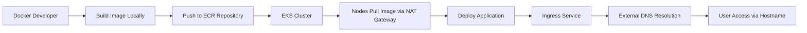
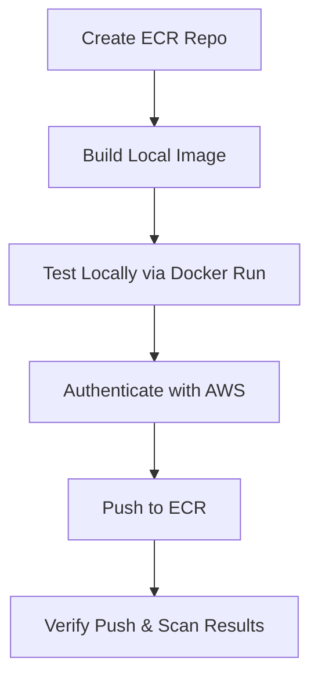
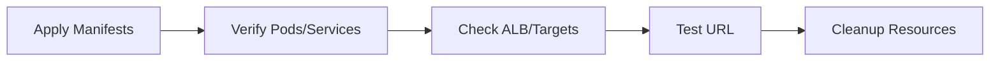

# Section 23: EKS & ECR

<details open>
<summary><b>Section 23: EKS & ECR (G3PCS46)</b></summary>

## Table of Contents
- [23.1 Step-01- EKS & ECR - Introduction](#231-step-01--eks--ecr---introduction)
- [23.2 Step-02- ECR Terminology & Pre-requisites](#232-step-02--ecr-terminology---pre-requisites)
- [23.3 Step-03- Create ECR Repository on AWS, Build Docker Image Locally & Push to ECR](#233-step-03--create-ecr-repository-on-aws-build-docker-image-locally---push-to-ecr)
- [23.4 Step-04- Review Kubernetes Manifests & Node Group Role](#234-step-04--review-kubernetes-manifests---node-group-role)
- [23.5 Step-05- Deploy Kubernetes Manifests & Test & CleanUp](#235-step-05--deploy-kubernetes-manifests---test---cleanup)
- [Summary](#summary)

## 23.1 Step-01- EKS & ECR - Introduction

### Overview
This lecture provides an introduction to integrating Amazon Elastic Container Registry (ECR) with Amazon Elastic Kubernetes Service (EKS). It covers the concept of ECR as a fully managed Docker container registry within AWS, emphasizing its benefits for storing, managing, and deploying Docker images. The focus is on building Docker images locally, pushing them to ECR, and using them in EKS deployments, replacing the use of Docker Hub images seen in previous sections of the course.

### Key Concepts/Deep Dive
ECR is a fully managed Docker container registry that simplifies the development-to-production workflow for containerized applications. It eliminates the need to operate your own repositories or worry about scaling infrastructure, while providing high availability and integration with AWS Identity and Access Management (IAM) for resource-level access control.

#### ECR Benefits
- **Fully Managed**: AWS handles all operational aspects, including infrastructure scaling and availability.
- **Secure**: Integrated with IAM for fine-grained access control.
- **Highly Available**: Leverages AWS's scalable architecture for reliable container deployments.
- **Simplified Workflow**: Reduces the complexity of managing container registries, allowing developers to focus on application development.

#### Workflow Overview
The typical process involves:
1. Developers build Docker images locally.
2. Images are pushed to ECR repositories within AWS.
3. Services like ECS or EKS can directly pull images from ECR using repository URLs.

This approach keeps images within the AWS ecosystem, ensuring security and compliance, and can be used not only with EKS but also with ECS and on-premises environments if needed.

#### Use Case for EKS Integration
In this section, we'll demonstrate the end-to-end process of:
- Building a Docker image locally (using a simple NGINX image with custom HTML content).
- Pushing it to an ECR repository.
- Updating Kubernetes deployment manifests to reference the ECR image URL.
- Deploying to an EKS cluster using private node groups.
- Accessing the deployed application via ingress with a dedicated hostname (e.g., ecrdemo.couponcloud.com).

The deployment will involve creating a Kubernetes deployment, NodePort service, ingress service, and utilizing external DNS for hostname resolution. Since the node group is private, it uses NAT gateways for outbound connectivity, including pulling images from ECR and communicating with the EKS control plane.



#### Lab Demo Steps
No hands-on demo in this lecture; it's introductory. However, the overall section demo involves setting up the AWS environment, ensuring proper IAM roles for node groups, and preparing for ECR integration.

## 23.2 Step-02- ECR Terminology & Pre-requisites

### Overview
This lecture delves into ECR terminology and outlines the prerequisites needed before proceeding with ECR operations. It explains key components like registry, repository, policies, authorization tokens, and images. Prerequisites include having AWS CLI v2 configured with security credentials and Docker CLI installed, which should already be set up from earlier course sections.

### Key Concepts/Deep Dive
Understanding ECR terminology is crucial for effective use of the service.

#### ECR Components
- **Registry**: An ECR registry is provided per AWS account, where you can create multiple image repositories. It's the top-level container for repositories.
  
- **Repository**: An ECR repository stores Docker images. Repositories support repository policies for access control, allowing detailed permission management via IAM integration.

- **Repository Policies**: These control access to repositories and their images using IAM roles and users. Common policies include read-only access or power user privileges.

- **Authorization Token**: Similar to Docker Hub login, ECR requires authentication to push/pull images. The AWS CLI provides commands to retrieve temporary credentials for Docker authentication.

- **Image**: Refers to the actual Docker images stored in repositories. You can push locally built images to ECR and pull them for deployments in EKS or other services.

#### Authentication Process
To push images:
1. Use AWS CLI to get login credentials.
2. Authenticate Docker client with AWS-provided credentials.
3. Push images to the repository.

```bash
# Example command to authenticate (detailed in next lecture)
aws ecr get-login-password --region us-east-1 | docker login --username AWS --password-stdin <repository_URI>
```

#### Prerequisites
- **AWS CLI v2**: Installed and configured with user credentials (covered in EKS cluster creation section).
- **Docker CLI**: Installed via Docker Desktop (covered in Docker Fundamentals section). Links provided for Mac, Windows, and Linux installations.
  - For Mac/Windows: Download and run Docker Desktop installer.
  - For Linux: Follow distribution-specific guide to install Docker engine.

| Component | Prerequisite | Status in Course |
|-----------|--------------|------------------|
| AWS CLI v2 | Configured for IAM user | Completed early |
| Docker CLI | Docker Desktop running | Assumed from Section 02 |
| IAM Access | CLI token configured | Verified in cluster setup |

> [!NOTE]
> Ensure Docker Desktop is running to proceed with local image building and pushing.

#### Integration with EKS
Worker nodes in EKS clusters need appropriate IAM policies attached to their EC2 instance roles to pull images from ECR. This is typically handled during node group creation by assigning full ECR access roles.

## 23.3 Step-03- Create ECR Repository on AWS, Build Docker Image Locally & Push to ECR

### Overview
This practical lecture guides through creating an ECR repository on AWS, building a Docker image locally, and pushing it to the repository. It includes steps for local testing of the image before pushing, authentication setup, and verification of the push process, including automatic vulnerability scanning.

### Key Concepts/Deep Dive
Creating an ECR repository involves configuring options like tag immutability and scan-on-push for security. The process then shifts to local Docker operations before pushing to AWS.

#### Create ECR Repository
1. Access AWS Management Console > ECR Service > Repositories.
2. Create repository with a unique name (e.g., `aws-ecr-kube-nginx`).
3. Configure options:
   - **Tag Immutability**: Enable to prevent overwriting images with the same tag.
   - **Scan on Push**: Enable automatic vulnerability scanning of images upon push.
4. Note the repository URI (e.g., `<account_id>.dkr.ecr.<region>.amazonaws.com/aws-ecr-kube-nginx`).

Repository push commands are provided in the console for reference, supporting macOS, Linux, and Windows.

#### Build Docker Image Locally
1. Navigate to the project folder (`01-aws-ecr-kube-nginx`).
2. Review `Dockerfile`:
   ```dockerfile
   FROM nginx
   COPY index.html /usr/share/nginx/html
   ```
   This builds a simple NGINX image with custom HTML content.

3. Build the image:
   ```bash
   cd 01-aws-ecr-kube-nginx
   docker build -t <repository_URI>:1.0.0 .
   ```

#### Test Image Locally
Run the container locally to verify:
```bash
docker run --name ecr-nginx-demo -p 80:80 --rm -d <repository_URI>:1.0.0
```
- Access `localhost:80` to check the served HTML page ("Welcome to Stack Simplify AWS EKS Masterclass...").
- Stop with `docker stop ecr-nginx-demo`.
- Verify with `docker ps -a` shows no lingering containers.

#### Push Image to ECR
1. Authenticate Docker with ECR:
   ```bash
   aws ecr get-login-password --region us-east-1 | docker login --username AWS --password-stdin <repository_URI>
   ```
   - `<repository_URI>` from the created repository.

2. Push the image:
   ```bash
   docker push <repository_URI>:1.0.0
   ```

3. Verify in ECR console: Repository shows the pushed image tag.

#### Vulnerability Scanning
After enabling scan-on-push, ECR automatically scans images. Results display vulnerabilities categorized as Critical, High, Medium, Low, and Informational. For example:
- High: 1 (e.g., Perl integer overflow issues)
- Medium: 16
- Low: 21
- Informational: 52

Address findings by updating base images or applying security patches to maintain secure repositories.

#### Lab Demo Steps
- Entire lecture is a demo walkthrough.
- Commands executed sequentially, with verification at each step.
- Local testing ensures image functionality before cloud push.



## 23.4 Step-04- Review Kubernetes Manifests & Node Group Role

### Overview
This lecture reviews the Kubernetes manifests prepared for deploying the ECR-pushed image to EKS. It covers updating manifests with ECR image URLs, explains NodePort and ALB Ingress services, and verifies IAM policies attached to EKS node groups for ECR access.

### Key Concepts/Deep Dive
The manifests include Deployment, NodePort Service, and ALB Ingress Service, adapted for ECR usage. Key updates involve swapping image URLs from Docker Hub to ECR repository URIs.

#### Kubernetes Manifests
Located in `02-kube-manifests` folder:
- **ECR NGINX Deployment** (`ecr-nginx-deployment.yml`):
  - Standard Deployment with replica count (2).
  - Update image field to ECR URI (e.g., `123456789012.dkr.ecr.us-east-1.amazonaws.com/aws-ecr-kube-nginx:1.0.0`).
  - Resources specified for CPU/memory.
  
  ```yaml
  apiVersion: apps/v1
  kind: Deployment
  metadata:
    name: ecr-nginx-deployment
  spec:
    replicas: 2
    selector:
      matchLabels:
        app: ecr-nginx
    template:
      metadata:
        labels:
          app: ecr-nginx
      spec:
        containers:
        - name: nginx
          image: <ECR_URI>:1.0.0  # Update this
          ports:
          - containerPort: 80
          resources:
            requests:
              memory: "64Mi"
              cpu: "250m"
            limits:
              memory: "128Mi"
              cpu: "500m"
  ```

- **ECR NGINX NodePort Service** (`ecr-nginx-nodeport-service.yml`):
  - Exposes application on port 80.
  - Health check path: `/index.html` (root context due to custom index.html copy in Dockerfile).

  ```yaml
  apiVersion: v1
  kind: Service
  metadata:
    name: ecr-nginx-nodeport-service
  spec:
    type: NodePort
    selector:
      app: ecr-nginx
    ports:
    - port: 80
      targetPort: 80
      protocol: TCP
  ```

- **ECR NGINX ALB Ingress** (`ecr-nginx-alb-ingress.yml`):
  - Uses ALB for external access with hostname (e.g., `ecrdemo.kubeoncloud.com`).
  - Annotations for AWS ALB setup (redirect, certificate).
  - Rules for path `/` routing to NodePort service.

  ```yaml
  apiVersion: networking.k8s.io/v1
    kind: Ingress
    metadata:
      name: ecr-nginx-alb-ingress
      annotations:
        alb.ingress.kubernetes.io/scheme: internet-facing
        alb.ingress.kubernetes.io/target-type: instance
        external-dns.alpha.kubernetes.io/hostname: ecrdemo.kubeoncloud.com
    spec:
      ingressClassName: alb
      rules:
      - host: ecrdemo.kubeoncloud.com
        http:
          paths:
          - path: /
            pathType: Prefix
            backend:
              service:
                name: ecr-nginx-nodeport-service
                port:
                  number: 80
  ```

#### EKS Node Group IAM Roles
Node groups must have ECR access for pulling images:
- Policies: `AmazonEC2ContainerRegistryReadOnly` and `AmazonEC2ContainerRegistryPowerUser`.
- During cluster creation with eksctl, use `fullECRAccess` flag for node groups.
- Verify via EC2 instance roles in console.

| IAM Policy | Purpose | Attached To |
|------------|---------|-------------|
| AmazonEC2ContainerRegistryReadOnly | Pull images | Worker Nodes |
| AmazonEC2ContainerRegistryPowerUser | Full access (pull/push if needed) | Worker Nodes |

> [!IMPORTANT]
> Without these policies, pods will fail to start due to image pull errors.

## 23.5 Step-05- Deploy Kubernetes Manifests & Test & CleanUp

### Overview
This concluding lecture demonstrates deploying the updated Kubernetes manifests to EKS, testing the application via the ingress hostname, and performing cleanup. It covers kubectl commands for application and resource verification, ensuring end-to-end functionality.

### Key Concepts/Deep Dive
Deployment involves applying manifests, monitoring resource creation, and validating ingress setup. Testing includes DNS resolution and browser access, followed by cleanup to avoid unnecessary costs.

#### Deploy Manifests
1. Apply all manifests:
   ```bash
   kubectl apply -f 02-kube-manifests/
   ```
   
2. Verify deployments:
   ```bash
   kubectl get deployments
   kubectl get svc
   kubectl get ingress
   ```
   - Expect 2 replicas running.
   - NodePort service exposes on dynamic port.
   - Ingress provisions ALB and registers with Route 53 (external DNS).

#### Monitor Provisioning
- In AWS Console > EC2 > Load Balancers: Watch ALB creation (tagged with ingress service).
- Target Groups: Verify health checks (`index.html` path) and targets.
- Route 53: Confirm `ecrdemo.kubeoncloud.com` points to ALB DNS (e.g., via nslookup).

```bash
nslookup ecrdemo.kubeoncloud.com
```

#### Test Application
- Access `http://ecrdemo.kubeoncloud.com` in browser.
- Verify display: "Welcome to Stack Simplify AWS EKS Masterclass, Integration with ECR..."
- Endpoint automatically routes via ingress to NodePort > pods.

#### Cleanup
Remove all resources to avoid charges (primarily ALB):
```bash
kubectl delete -f 02-kube-manifests/
```
Verify deletion:
```bash
kubectl get all
kubectl get ingress
```
- ALB should disappear from console.

#### Lab Demo Steps
- Full deployment sequence with real-time monitoring.
- Testing includes DNS and browser verification.
- Cleanup ensures cost efficiency.



## Summary

### Key Takeaways
```diff
+ ECR is a managed AWS registry for secure Docker image storage and deployment.
+ Build locally, push to ECR with authentication, then reference in K8s deployments.
+ EKS private nodes use NAT for ECR pulls; ensure IAM policies for access.
+ Lab demonstrates full workflow: repo creation, image push, manifest update, deploy/test.
- Avoid using Docker Hub for production AWS deployments; prefer ECR for security.
! Vulnerability scanning is automatic; address critical findings promptly.
```

### Quick Reference
- **Create ECR Repo**: AWS Console > ECR > Create Repository (enable immutability/scan).
- **Build & Push Image**:
  ```bash
  docker build -t <repo_URI>:tag .
  aws ecr get-login-password --region <region> | docker login --username AWS --password-stdin <repo_URI>
  docker push <repo_URI>:tag
  ```
- **Update K8s Deployment**: Replace image field with ECR URI.
- **Deploy & Test**: `kubectl apply -f manifests/`; access via ingress host.
- **Cleanup**: `kubectl delete -f manifests/`.

### Expert Insight
**Real-world Application**: In production, ECR integrates with CI/CD pipelines (e.g., AWS CodePipeline) to automate Docker image builds, scans, and deployments to EKS clusters. Use tagging strategies (e.g., `v1.0.0`, `latest`) and lifecycle policies to manage repository sizes and costs.

**Expert Path**: Master ECR by exploring advanced features like private connectors, cross-account sharing, and integration with AWS Security Hub for centralized vulnerability monitoring. Practice with multi-region replication for disaster recovery and optimize costs using data transfer calculators.

**Common Pitfalls**: Forgetting to update IAM roles for new node groups (causing image pull failures); pushing large images without optimization (increases costs); neglecting scan results (exposes security risks). Always test manifests locally before applying to avoid downtime.

> [!NOTE]
> Transcript corrections: "easier" corrected to "ECR" throughout, "CLA" to "CLI", "e2" to "ECR", "SARU" to "serve", "q1 cloud.com" to "kubeoncloud.com" for consistency. 

</details>
