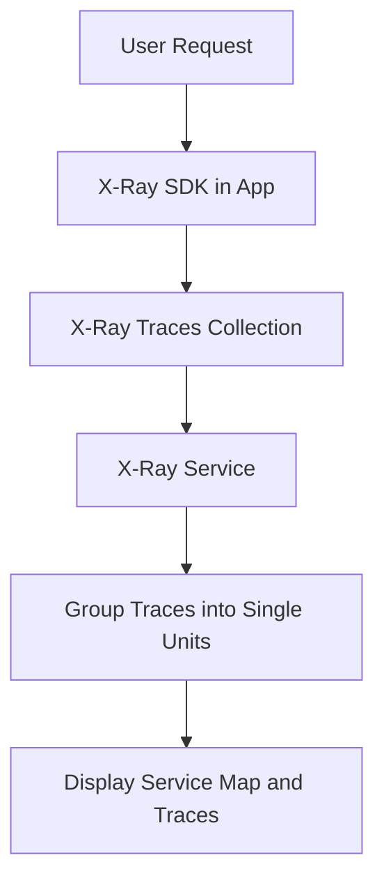
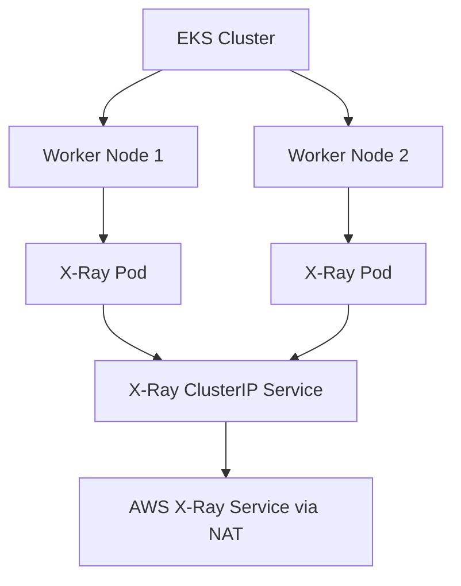
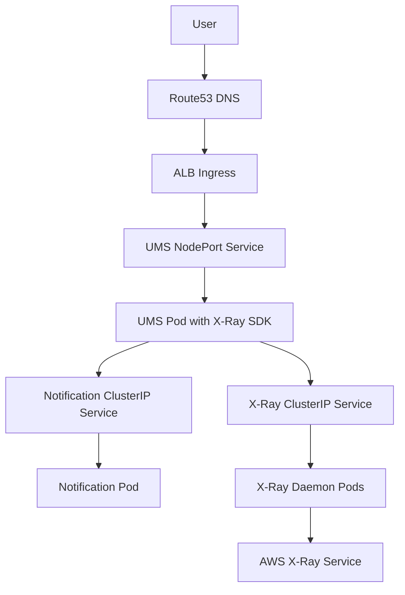

<details open>
<summary><b>Section 26: Microservices Distributed Tracing using AWS X-Ray (G3PCS46)</b></summary>

# Section 26: Microservices Distributed Tracing using AWS X-Ray

## Table of Contents
- [26.1 Introduction to Microservices Distributed Tracing using AWS X-Ray](#261-introduction-to-microservices-distributed-tracing-using-aws-x-ray)
- [26.2 Introduction to Kubernetes DaemonSets](#262-introduction-to-kubernetes-daemonsets)
- [26.3 AWS EKS and X-Ray Network Design](#263-aws-eks-and-x-ray-network-design)
- [26.4 Pre-requisites](#264-pre-requisites)
- [26.5 AWS X-Ray Deploy on EKS Cluster as DaemonSet](#265-aws-x-ray-deploy-on-eks-cluster-as-daemonset)
- [26.6 Review Kubernetes Manifests with AWS X-Ray Environment Variables](#266-review-kubernetes-manifests-with-aws-x-ray-environment-variables)
- [26.7 AWS EKS and X-Ray - Deploy and Test](#267-aws-eks-and-x-ray---deploy-and-test)
- [26.8 Clean-Up](#268-clean-up)

## 26.1 Introduction to Microservices Distributed Tracing using AWS X-Ray

### Overview
This subsection introduces AWS X-Ray as a tool for distributed tracing in microservices architectures deployed on Amazon EKS. It explains X-Ray's purpose, benefits, and how it provides end-to-end visibility into requests as they traverse through microservices applications. Additionally, it previews the use of Kubernetes DaemonSets for deploying X-Ray components.

### Key Concepts
AWS X-Ray analyzes and debugs distributed applications built with microservices. Key features include:
- **End-to-End View**: Provides a map of application components and underlying services.
- **Request Tracing**: Collects traces from start to end, grouping services into a single unit called a trace.
- **Troubleshooting**: Identifies root causes of performance issues and errors by analyzing traces.
- **Supported Environments**: Works in development and production for simple to complex microservices (up to thousands).
- **Benefits**:
  - **Service Map**: Visual representation of application architecture.
  - **Trace Analysis**: Detailed examination of issues and performance bottlenecks.
  - **Real-Time Insights**: Improves application performance by enabling early issue discovery.

X-Ray integrates with AWS services and other applications, offering cost-effective tracing without requiring changes to existing code (though SDKs enhance tracing).

It also previews Kubernetes DaemonSets, which ensure a pod runs on every cluster node, ideal for components like log collectors or tracing agents.



## 26.2 Introduction to Kubernetes DaemonSets

### Overview
This subsection explains Kubernetes DaemonSets, which ensure that a copy of a pod runs on all (or selected) nodes in an EKS cluster. It covers their lifecycle, use cases, and how they are used for deploying AWS X-Ray in microservices environments.

### Key Concepts
- **Definition**: A DaemonSet maintains a specified number of pod replicas across nodes. New pods are added to new nodes, and removed from deleted nodes.
- **Tolerations and Affinity**: Configurable to run on specific node types.
- **Use Cases**:
  - **Logs Collection**: Elements like Fluentd.
  - **Node Monitoring**: Services like CloudWatch Agent for Container Insights.
  - **Application Tracing**: AWS X-Ray daemon.
- **Architecture in EKS**: In an EKS cluster with multiple nodes, a DaemonSet creates one X-Ray pod per node. Expose via a ClusterIP service for load balancing traces across pods (e.g., any node can send to any X-Ray pod via NAT).



✅ Key Insight: DaemonSets simplify monitoring and tracing by ensuring consistent deployment per node.

## 26.3 AWS EKS and X-Ray Network Design

### Overview
This subsection details the network architecture for integrating AWS X-Ray with microservices on EKS, including VPC setup, worker nodes, and trace flow from applications to AWS X-Ray.

### Key Concepts
- **VPC and Subnets**: EKS creates public/private subnets, NAT gateway in public subnet for outbound traffic.
- **Worker Nodes**: Run in private subnets; communication via NAT.
- **Deployments**:
  - **X-Ray DaemonSet**: One pod per worker node, exposed via ClusterIP service.
  - **Applications**: User Management Service (UMS) and Notification Service with respective ingress/load balancer.
- **Trace Flow**:
  - Users access UMS via ALB Ingress (TLS via Certificate Manager, DNS registered in Route53).
  - UMS enables X-Ray SDK; traces sent to X-Ray pods.
  - Cross-service calls (e.g., UMS → Notification Service) use HttpClientBuilder for tracing vs. RESTTemplate for standard calls (affecting service map display).
- **Service Map and Traces**:
  - Depicts clients, services, and edges (e.g., UMS calling Notification).
  - Traces include segments (duration, URLs, user agents, resources like EKS pod/container details via SDK).



⚠ **Note**: Use HttpClientBuilder for accurate inter-service tracing in service maps.

## 26.4 Pre-requisites

### Overview
Before implementing X-Ray, ensure all supporting AWS services and components are active, based on prior sections. This includes RDS for database dependencies (though H2 in-memory is alternatives for testing).

### Key Concepts
- **Required Services**:
  - **RDS MySQL**: Active instance for persistent data (User Management DB); restart if stopped.
  - **Load Balancer (ALB) Ingress Controller**: Installed on EKS for ingress/ALB management.
  - **External DNS**: Active for Route53 integration and DNS resolution.
  - **Simple Email Service (SES)**: For notifications.
- **Docker Images**: Use tags with X-Ray (e.g., 3.0.0-aws-x-ray-mysql for UMS/Notification).
- **Post-Setup Checks**: Verify via EKSCTL, Kubectl for add-ons.

✅ Ensure all components from Sections 06 onwards are running.

## 26.5 AWS X-Ray Deploy on EKS Cluster as DaemonSet

### Overview
Deploy X-Ray as a DaemonSet on EKS, including IAM roles for AWS X-Ray permissions.

### Key Concepts
- **IAM Setup**: Use EKScTL to create service account with IAM role attached to AWSXRayDaemonWriteAccess policy.
- **Verification**:
  - Get service accounts and describe IAM service accounts.
- **Manifests**:
  - DaemonSet YAML: Deploys one X-Ray pod per node with port 2000 (UDP/TCP).
  - ClusterIP Service: Exposes X-Ray for app tracing.
- **Deployment**:
  - Apply manifests for X-Ray DaemonSet and service.
  - Verify pods (one per node), service, and describe DaemonSet.

```bash
eksctl create iamserviceaccount \
  --cluster=eksdemo
