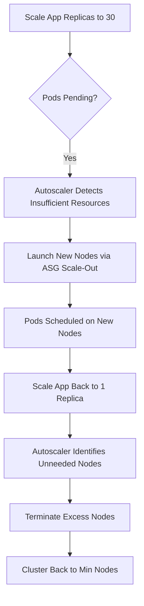

# Section 30: EKS Cluster Autoscaler

<details open>
<summary><b>Section 30: EKS Cluster Autoscaler (G3PCS46)</b></summary>

## Table of Contents
- [30.1 Step-01- EKS Cluster Autoscaler - Introduction](#301-step-01--eks-cluster-autoscaler---introduction)
- [30.2 Step-02- Deploy Cluster Autoscaler and Verify](#302-step-02--deploy-cluster-autoscaler-and-verify)
- [30.3 Step-03- Load Test, Verify Cluster Worker Nodes Scale-Up and Scale-In](#303-step-03--load-test-verify-cluster-worker-nodes-scale-up-and-scale-in)
- [Summary](#summary)

## 30.1 Step-01- EKS Cluster Autoscaler - Introduction

### Overview
The Cluster Autoscaler for EKS automatically adjusts the size of a Kubernetes cluster based on resource needs. It scales up when pods fail to schedule due to insufficient resources and scales down when nodes are underutilized. This tool optimizes both performance and cost by managing EC2 worker nodes in Auto Scaling Groups (ASGs). Overall, it benefits EKS environments by dynamically scaling node groups to match workload demands.

### Key Concepts/Deep Dive
Cluster Autoscaler operates under specific conditions:
- **Scale Up**: When pods cannot be scheduled due to lack of resources, it increases the number of nodes to provide necessary capacity.
- **Scale Down**: When nodes have been underutilized for a prolonged time, it consolidates pods onto fewer nodes and terminates excess ones.
- **ASG Integration**: It modifies EC2 Auto Scaling Groups associated with EKS node groups to perform these operations.

**Benefits**:
- **Performance**: Ensures workloads have adequate resources by scaling up as needed.
- **Cost Optimization**: Reduces expenses by scaling down unused capacity.
- **Efficiency**: Acts as a Kubernetes add-on that integrates seamlessly with EKS managed services.

No lab demos were mentioned in this introduction, but the concept is foundational for the hands-on steps in following subsections.

## 30.2 Step-02- Deploy Cluster Autoscaler and Verify

### Overview
This section verifies ASG access for node groups and deploys Cluster Autoscaler to an EKS cluster. Configuration includes setting the cluster name, image version, and annotations to ensure proper functionality with EKS Auto Scaling Groups. The process involves applying Kubernetes manifests provided by the official cluster autoscaler repository.

### Key Concepts/Deep Dive
**ASG Access Verification**:
- Ensure node group IAM roles have the necessary inline policy for Auto Scaling operations.
- In the AWS Management Console, verify the IAM role attached to worker nodes includes a policy like `AutoScalingFullAccess`.

**Deployment Steps**:
- Use the auto-discover YAML from the Kubernetes autoscaler repository.
- Apply via kubectl to create necessary resources (ServiceAccount, ClusterRoleBinding, Deployment).
- Annotate the deployment to avoid eviction.

**Configuration**:
- Edit the deployment to specify the EKS cluster name (e.g., `eks-demo1`).
- Add parameters like `--balance-similar-node-groups` and `--skip-nodes-with-system-pods=false`.
- Set the container image version matching the EKS cluster version (e.g., cluster autoscaler v1.16.5 for EKS 1.16).

**Code/Config Blocks**:
- Deploy autoscaler (incorrect term "cubectl" in transcript corrected to "kubectl"):
  ```bash
  kubectl apply -f https://raw.githubusercontent.com/kubernetes/autoscaler/master/cluster-autoscaler/cloudprovider/aws/examples/cluster-autoscaler-autodiscover.yaml
  ```
- Annotate deployment:
  ```bash
  kubectl annotate deployment cluster-autoscaler cluster-autoscaler.kubernetes.io/safe-to-evict="false" -n kube-system
  ```
- Edit deployment for configuration:
  ```bash
  kubectl edit deployment cluster-autoscaler -n kube-system
  ```
  In the YAML, update under `spec.containers.command`:
  - `--cluster-name=eks-demo1`
  - `--balance-similar-node-groups`
  - `--skip-nodes-with-system-pods=false`
- Set image version (adjust to your EKS version, e.g., v1.16.5):
  ```bash
  kubectl set image deployment cluster-autoscaler cluster-autoscaler=k8s.gcr.io/autoscaling/cluster-autoscaler:v1.16.5 -n kube-system
  ```
- Verify logs:
  ```bash
  kubectl logs -f deployment/cluster-autoscaler -n kube-system
  ```

### Lab Demos
1. **Verify ASG Policy**: Check IAM role in EC2 console for attached inline policies.
2. **Deploy and Configure**: Run the apply command, annotate, edit deployment, and update image as shown.
3. **Log Verification**: Monitor logs for healthy initialization (e.g., no schedulable pods, node group info).

> [!NOTE]
> Transcript contained "cubectl" instead of "kubectl" – corrected in content. No other major errors noted.

## 30.3 Step-03- Load Test, Verify Cluster Worker Nodes Scale-Up and Scale-In

### Overview
Perform load testing with a sample application to demonstrate Cluster Autoscaler scale-up and scale-down. Deploy an nginx app with high resource requests, scale it to trigger node addition, and then scale back to observe node termination. This validates autoscaling in action within EKS constraints.

### Key Concepts/Deep Dive
- **Sample App**: Simple nginx deployment requesting 200m CPU and 200Mi memory per pod.
- **Scale-Up Trigger**: Increasing replicas (e.g., to 30) exhausts node resources, causing autoscaler to launch new nodes (up to max allowed, e.g., 4).
- **Scale-Down Trigger**: Reducing replicas allows autoscaler to identify unneeded nodes and terminate them (typically 5-10 minutes later).
- **Node Group Limits**: Min nodes (e.g., 2) and max nodes (e.g., 4) defined during creation control scaling boundaries.

**Autoscaling Flow (Mermaid Diagram)**:


### Code/Config Blocks
- Deploy sample app:
  ```yaml
  apiVersion: apps/v1
  kind: Deployment
  metadata:
    name: ca-demo
  spec:
    replicas: 1
    selector:
      matchLabels:
        app: ca-demo
    template:
      metadata:
        labels:
          app: ca-demo
      spec:
        containers:
        - name: nginx
          image: nginx
          resources:
            requests:
              cpu: 200m
              memory: 200Mi
  --
  apiVersion: v1
  kind: Service
  metadata:
    name: ca-demo-service
  spec:
    selector:
      matchLabels:
        app: ca-demo
    ports:
    - port: 80
      targetPort: 80
    type: LoadBalancer
  ```
- Apply:
  ```bash
  kubectl apply -f ca-demo.yaml  # Assuming file is created
  ```
- Scale up:
  ```bash
  kubectl scale deployment ca-demo --replicas=30
  ```
- Scale down:
  ```bash
  kubectl scale deployment ca-demo --replicas=1
  ```
- Monitor nodes:
  ```bash
  kubectl get nodes -w
  ```
- Monitor pods:
  ```bash
  kubectl get pods
  ```

### Lab Demos
1. Deploy app and scale to 30 replicas – observe pending pods until new nodes provision.
2. Watch logs and node count: Expect additional nodes (up to max), then pods running.
3. Scale back to 1 – wait for node termination (disable scheduling first).
4. Cleanup: Delete the demo app resources.

> [!IMPORTANT]
> Autoscaler respects ASG min/max limits; exceeding max results in pending pods only.

## Summary

### Key Takeaways
```diff
+ Cluster Autoscaler dynamically manages EKS node groups for optimal resource utilization.
+ Scale-up resolves pod scheduling issues by adding nodes when resources are insufficient.
- Ensure ASG access is enabled on IAM roles; without it, autoscaling fails.
+ Scale-down removes underutilized nodes after a cooldown period, reducing costs.
! Use cluster-specific image versions (e.g., v1.16.5 for EKS 1.16) to avoid compatibility issues.
+ Annotations prevent evictions; logs must show healthy initialization for troubleshooting.
```

### Quick Reference
- **Verify ASG Access**: Check IAM role inline policies in AWS Console.
- **Deploy Autoscaler**: `kubectl apply -f <yaml-url>; kubectl annotate deployment cluster-autoscaler safe-to-evict=false -n kube-system`
- **Configure**: Edit deployment for `--cluster-name=<name>`, add scale parameters; set image to matching version.
- **Load Test**: Deploy app, scale replicas; monitor with `kubectl get nodes -w` and logs.
- **Cleanup**: Scale app to 1, watch nodes reduce; delete resources.

### Expert Insight
**Real-world Application**: In production EKS clusters, use Cluster Autoscaler to handle unpredictable traffic spikes (e.g., e-commerce peak hours) by scaling nodes automatically, ensuring high availability while controlling AWS costs. Integrate with monitoring tools like Prometheus for proactive alerts.

**Expert Path**: Master autoscaling by experimenting with custom metrics (e.g., via HPA) alongside Cluster Autoscaler. Learn advanced parameters like `--max-node-provision-time` for fine-tuned scaling. Contribute to the Kubernetes autoscaler project to deepen understanding.

**Common Pitfalls**: 
- Forgetting ASG IAM policies leads to failed scale operations.
- Using mismatched image versions causes incompatibilities.
- Not setting min/max nodes properly can cause resource exhaustion or unused capacity.
- Ignoring cooldown periods results in flapping (constant scale-up/down).

</details>
