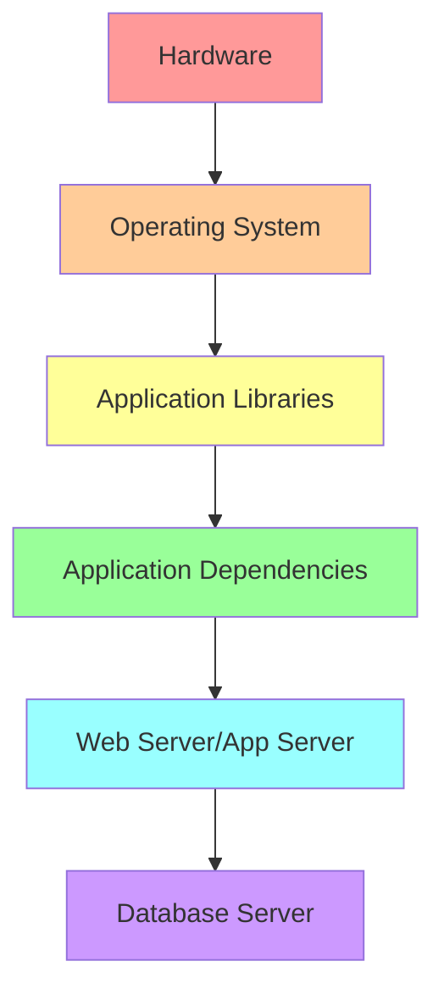
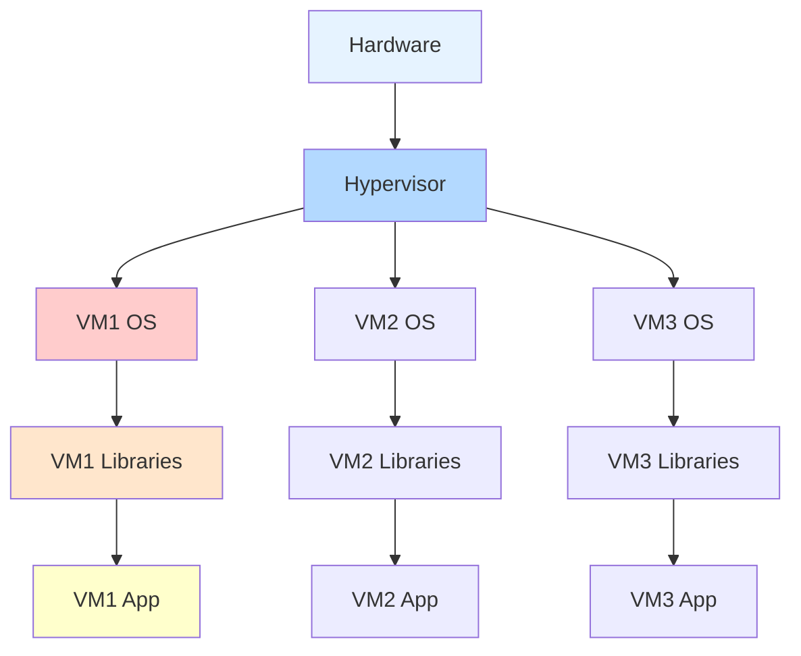
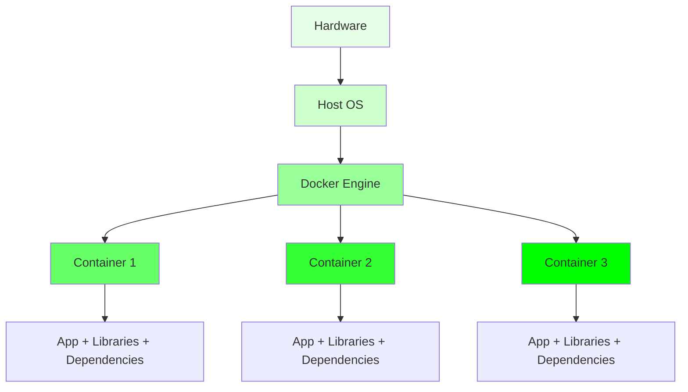
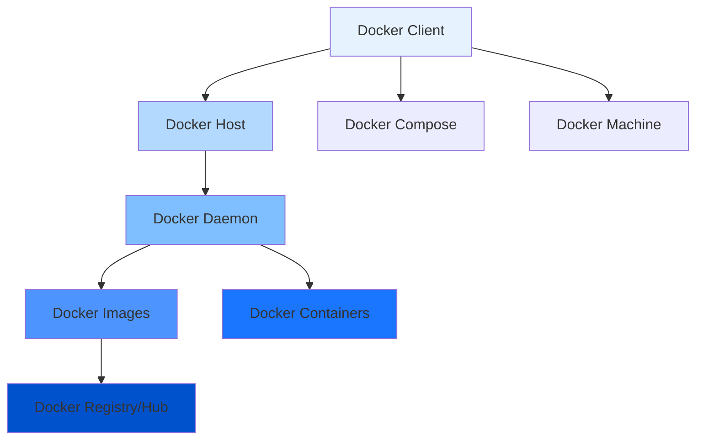
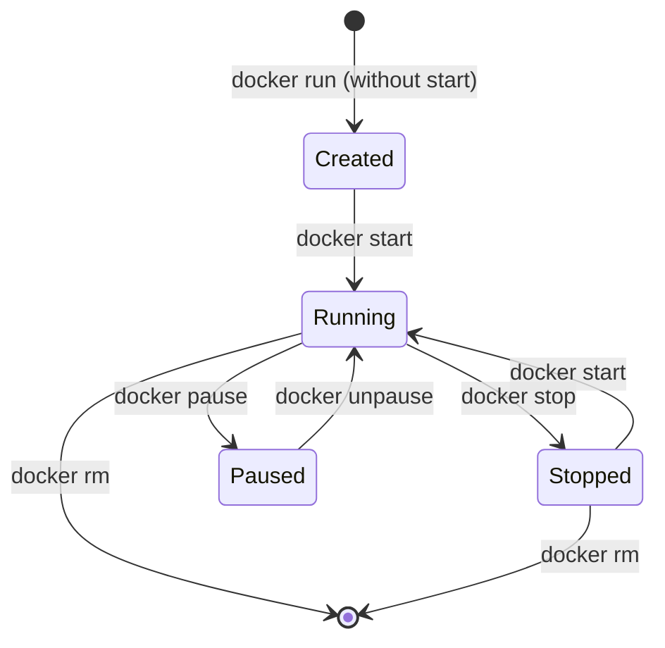

# Section 3: Docker Fundamentals (AWS EKS Masterclass)

<details open>
<summary><b>Section 3: Docker Fundamentals (AWS EKS Masterclass)</b></summary>

## Table of Contents
1. [3.1 Docker Fundamentals - Introduction](#31-docker-fundamentals---introduction)
2. [3.2 Introduction to Docker, Why Docker, What Problems Docker Solve](#32-introduction-to-docker-why-docker-what-problems-docker-solve)
3. [3.3 Docker Architecture or Docker Terminology](#33-docker-architecture-or-docker-terminology)
4. [3.4 Docker Installation](#34-docker-installation)
5. [3.5 Docker - Pull Docker Image from Docker Hub and Run it locally](#35-docker---pull-docker-image-from-docker-hub-and-run-it-locally)
6. [3.6 Docker - Build Docker Image locally, Test and Push it to Docker Hub](#36-docker---build-docker-image-locally-test-and-push-it-to-docker-hub)
7. [3.7 Docker - Essential Commands Overview](#37-docker---essential-commands-overview)

---

## 3.1 Docker Fundamentals - Introduction

### Overview
Comprehensive introduction to Docker fundamentals section, covering Docker fundamentals, installation, image management, and essential commands necessary for understanding Kubernetes and containerization concepts.

### Key Concepts

#### Docker Learning Path
```diff
+ Theory: Docker introduction and architecture
+ Installation: Platform-specific setup (Mac/Windows/Linux)
+ Practical: Pull existing images, Run containers
+ Development: Build custom images, Push to registry
+ Operations: Essential Docker commands for daily use
```

#### Repository Structure
The Docker fundamentals content is organized in a dedicated GitHub repository with five main sections focusing on hands-on learning approach.

#### Prerequisites for Docker Mastery
- Basic terminal/command line knowledge
- Understanding of application deployment
- Familiarity with development environments
- Docker Hub account for image storage

---

## 3.2 Introduction to Docker, Why Docker, What Problems Docker Solve

### Overview
Foundational understanding of Docker's value proposition, traditional infrastructure problems, and how containerization solves modern application deployment challenges.

### Key Concepts

#### Traditional Infrastructure Problems
```yaml
Traditional Infrastructure Pain Points:
  - Time-consuming installation and configuration
  - Environment inconsistencies across dev/QA/staging/prod
  - Complex dependency management and version conflicts
  - High operational overhead for patching and maintenance
  - Difficult developer environment provisioning
  - Resource-intensive hardware management
```

#### Docker Solutions
```diff
+ Package once, deploy anywhere
+ Consistent environments across all stages
+ Embedded dependencies within containers
+ Reduced operational complexity
+ Lightning-fast developer environment setup
- Solve compatibility and dependency hell
- Eliminate environment drift issues
```

### Infrastructure Evolution Comparison

#### Traditional Physical Server


**Issues**: Manual setup, version conflicts, environment drift, high maintenance costs

#### Virtual Machine Approach


**Issues**: Still requires per-VM OS management, IP/DNS configuration, resource overhead

#### Docker Container Approach


**Benefits**: Shared host OS, packaged applications, instant deployment, consistent environments

#### Docker Advantages

##### Container Characteristics
```diff
+ Flexible: Handle complex applications effortlessly
+ Lightweight: Share host kernel, minimal resource overhead
+ Portable: Build local, deploy to cloud, run anywhere
+ Loosely Coupled: Independent, replaceable without disruption
+ Scalable: Auto-distribute replicas across infrastructure
+ Secure: Process isolation with built-in constraints
+ Self-Sufficient: Fully encapsulated with all dependencies
```

##### Operational Benefits
```yaml
Time Savings:
  - Development environment: Minutes vs hours/days
  - Deployment: Consistent across all environments
  - Scaling: Rapid horizontal scaling
  - Recovery: Quick container replacement

Cost Efficiency:
  - Reduced hardware requirements
  - Lower operational overhead
  - Fewer support resources needed
  - Improved resource utilization
```

> [!IMPORTANT]
> Docker containers solve the fundamental problem of "works on my machine" by packaging the entire application stack including OS dependencies, libraries, and runtime environment.

---

## 3.3 Docker Architecture or Docker Terminology

### Overview
Core Docker components and terminology essential for understanding how Docker works and communicating effectively about containerization.

### Key Concepts

#### Docker Architecture Overview


#### Core Components

##### Docker Daemon (dockerd)
```yaml
Responsibilities:
  - Manages Docker objects (containers, images, networks)
  - Handles container lifecycle operations
  - Manages Docker API requests
  - Coordinates with container runtime
  - Provides REST API for client communication
```

```bash
# Check daemon status (varies by OS)
systemctl status docker     # Linux
launchctl list com.docker.dockerd  # macOS
```

##### Docker Client (docker)
```yaml
Functions:
  - Command-line interface for Docker operations
  - Sends commands to Docker daemon via REST API
  - Can connect to remote daemons
  - Supports multiple output formats
```

```bash
# Client verification
docker version
docker info
```

##### Docker Images
```yaml
Characteristics:
  - Read-only templates for containers
  - Layer-based filesystem
  - Contains application and dependencies
  - Stored in registries like Docker Hub
  - Tagged with version information
```

```bash
# Image operations
docker pull nginx:latest
docker images
docker rmi nginx:latest
```

##### Docker Containers
```yaml
Definition:
  - Runnable instances of Docker images
  - Isolated execution environment
  - Process-level isolation
  - Can be started, stopped, paused, resumed
  - Ephemeral by default (data not persisted)
```

```bash
# Container lifecycle
docker run -d nginx                   # Create and run
docker ps                             # List running
docker stop container_id              # Stop gracefully
docker rm container_id                # Remove
```

##### Docker Registry/Hub
```yaml
Purpose:
  - Centralized storage for Docker images
  - Public registry: Docker Hub (hub.docker.com)
  - Private registries: AWS ECR, Google GCR, etc.
  - Version control for container images
  - Collaboration and sharing platform
```

```bash
# Registry operations
docker login                          # Authenticate
docker tag local-image username/repo:tag
docker push username/repo:tag
docker pull username/repo:tag
```

### Docker Image Layers

#### Layer Structure
```yaml
Docker Image Layers (Bottom to Top):
  1. Base OS Layer (ubuntu, alpine, etc.)
  2. Runtime Dependencies (python, node, etc.)
  3. Application Code
  4. Configuration Files
  5. Runtime Commands (CMD, ENTRYPOINT)
```

```diff
+ Efficient storage: Shared layers across images
+ Faster builds: Only changed layers rebuilt
+ Smaller images: Use minimal base images
- Layer limits: Maximum 127 layers per image
- Security: Base image vulnerabilities affect all
```

### Networking Concepts
```yaml
Container Networking:
  - Bridge: Default network (internal communication)
  - Host: Container uses host networking
  - None: Isolated networking
  - Overlay: Multi-host networking
  - Custom networks with plugins
```

---

## 3.4 Docker Installation

### Overview
Platform-specific Docker installation procedures for Mac, Windows, and Linux environments with troubleshooting guidance.

### Key Concepts

#### Installation Verification
```bash
# Post-installation checks
docker --version                    # Docker CLI version
docker version                     # Client and server versions
docker info                        # Detailed system information
docker run hello-world             # Test container execution
```

### macOS Installation

#### Docker Desktop for Mac
```bash
# Installation methods
# Method 1: Direct download
curl -O https://desktop.docker.com/mac/stable/Docker.dmg

# Method 2: Homebrew Cask
brew install --cask docker

# Method 3: Official installer
# Visit: https://docs.docker.com/desktop/mac/install/
```

#### macOS Post-Installation
```bash
# Start Docker Desktop
open -a Docker

# Add docker to PATH (usually automatic)
export PATH="$PATH:/usr/local/bin/docker"

# Grant permissions if needed
sudo chown $USER /var/run/docker.sock
```

### Windows Installation

#### Docker Desktop for Windows
```powershell
# Installation options
# 1. Direct MSI download
# 2. Chocolatey package manager
choco install docker-desktop

# 3. Official installer from website
```

#### Windows Requirements
```diff
+ WSL 2 backend (Linux containers)
+ Windows 10 Pro/Enterprise/Home 2004+
+ Virtualization enabled in BIOS
+ Hyper-V or WSL 2 (choose one)
```

#### Windows Post-Installation
```powershell
# Start Docker Desktop
Start-Process "C:\Program Files\Docker\Docker\Docker Desktop.exe"

# Enable WSL integration
wsl --set-default-version 2
```

### Linux Installation

#### Ubuntu/Debian
```bash
# Update package index
sudo apt update

# Install prerequisites
sudo apt install apt-transport-https ca-certificates curl gnupg lsb-release

# Add Docker GPG key
curl -fsSL https://download.docker.com/linux/ubuntu/gpg | sudo gpg --dearmor -o /usr/share/keyrings/docker-archive-keyring.gpg

# Add Docker repository
echo "deb [arch=amd64 signed-by=/usr/share/keyrings/docker-archive-keyring.gpg] https://download.docker.com/linux/ubuntu $(lsb_release -cs) stable" | sudo tee /etc/apt/sources.list.d/docker.list > /dev/null

# Install Docker Engine
sudo apt update
sudo apt install docker-ce docker-ce-cli containerd.io docker-compose-plugin

# Start Docker daemon
sudo systemctl start docker
sudo systemctl enable docker
```

#### CentOS/RHEL
```bash
# Remove old versions
sudo yum remove docker docker-common docker-selinux docker-engine

# Install prerequisites
sudo yum install -y yum-utils device-mapper-persistent-data lvm2

# Add Docker repository
sudo yum-config-manager --add-repo https://download.docker.com/linux/centos/docker-ce.repo

# Install Docker Engine
sudo yum install docker-ce docker-ce-cli containerd.io docker-compose-plugin

# Start Docker daemon
sudo systemctl start docker
sudo systemctl enable docker
```

### User Permissions Configuration

#### Linux User Group
```bash
# Add user to docker group (avoid sudo)
sudo usermod -aG docker $USER

# Refresh group membership (logout/login or)
newgrp docker

# Test permissions
docker run hello-world
```

#### macOS Permissions (Docker Desktop)
```diff
+ Docker Desktop usually handles permissions automatically
+ Manual permission grants may be needed for /var/run/docker.sock
+ macOS security prompts may appear initially
```

### Troubleshooting Common Issues

#### Permission Denied
```bash
# Linux error: Got permission denied
sudo usermod -aG docker $USER
newgrp docker
# Logout and login again
```

#### Docker Daemon Not Running
```bash
# Linux
sudo systemctl status docker
sudo systemctl start docker

# macOS/Windows: Start Docker Desktop application
```

#### Port Already in Use
```bash
# Check what's using the port
netstat -tlnp | grep :port_number

# Docker specific
docker ps -a
docker port container_name
```

#### Disk Space Issues
```bash
# Clean up unused resources
docker system prune -a --volumes

# Check disk usage
docker system df
```

---

## 3.5 Docker - Pull Docker Image from Docker Hub and Run it locally

### Overview
Fundamental Docker workflow: pulling existing images from Docker Hub and running them as containers locally.

### Key Concepts

#### Docker Hub Registry
```yaml
Docker Hub Features:
  - Official images (nginx, ubuntu, alpine, etc.)
  - Community-contributed images
  - Automated builds from GitHub repos
  - Private repositories (paid plans)
  - Webhooks for automated deployments
```

### Lab Demo: Pull and Run Workflow

#### Step 1: Search and Pull Image
```bash
# Search for images
docker search nginx

# Pull specific image
docker pull nginx:latest

# Pull with specific tag
docker pull nginx:1.21-alpine

# List downloaded images
docker images
```

#### Step 2: Run Container
```bash
# Run in foreground (blocking)
docker run nginx

# Run in background
docker run -d --name my-nginx nginx

# Run with port mapping
docker run -d -p 8080:80 --name web-server nginx

# Run with environment variables
docker run -d -e ENV_VAR=value --name my-app my-image
```

#### Step 3: Interact with Container
```bash
# List running containers
docker ps

# List all containers (including stopped)
docker ps -a

# View container logs
docker logs my-nginx

# Execute commands in running container
docker exec -it my-nginx /bin/bash

# Stop container
docker stop my-nginx

# Start stopped container
docker start my-nginx
```

### Advanced Run Options

#### Networking
```bash
# Host networking
docker run --net host nginx

# Custom network
docker network create my-network
docker run --net my-network nginx
```

#### Storage Volumes
```bash
# Bind mount
docker run -v /host/path:/container/path nginx

# Named volume
docker run -v my-volume:/data nginx
```

#### Resource Limits
```bash
# CPU limit
docker run --cpus=0.5 nginx

# Memory limit
docker run --memory=512m nginx

# Combined limits
docker run --cpus=1.0 --memory=1g nginx
```

### Container Lifecycle Management


---

## 3.6 Docker - Build Docker Image locally, Test and Push it to Docker Hub

### Overview
Complete development workflow: creating custom Docker images, testing locally, and publishing to Docker Hub for distribution.

### Key Concepts

#### Dockerfile Structure
```dockerfile
# Elixir: Base image specification
FROM ubuntu:20.04

# LABEL: Metadata about the image
LABEL maintainer="your-email@example.com"
LABEL version="1.0"

# WORKDIR: Set working directory
WORKDIR /app

# COPY: Copy files from host to container
COPY . /app

# RUN: Execute commands during build
RUN apt-get update && apt-get install -y \
    python3 \
    python3-pip \
    && rm -rf /var/lib/apt/lists/*

# EXPOSE: Document port usage
EXPOSE 8080

# CMD: Default command to run
CMD ["python3", "app.py"]
```

### Lab Demo: Build and Push Workflow

#### Step 1: Prepare Application
```bash
# Create application directory
mkdir my-app && cd my-app

# Create simple Python app
cat > app.py << EOF
from flask import Flask
app = Flask(__name__)

@app.route('/')
def hello():
    return "Hello from Docker!"

if __name__ == '__main__':
    app.run(host='0.0.0.0', port=8080)
EOF

# Create requirements file
echo "Flask==2.3.0" > requirements.txt
```

#### Step 2: Create Dockerfile
```dockerfile
FROM python:3.9-slim

WORKDIR /app

COPY requirements.txt .
RUN pip install --no-cache-dir -r requirements.txt

COPY app.py .

EXPOSE 8080

CMD ["python", "app.py"]
```

#### Step 3: Build Image
```bash
# Build with tag
docker build -t my-flask-app:v1 .

# Build with multiple tags
docker build -t my-flask-app:latest -t my-flask-app:v1.0 .

# List built images
docker images | grep flask
```

#### Step 4: Test Locally
```bash
# Run container
docker run -d -p 8080:8080 --name test-flask my-flask-app:v1

# Test application
curl http://localhost:8080

# Check logs
docker logs test-flask

# Clean up
docker stop test-flask
docker rm test-flask
```

#### Step 5: Push to Docker Hub
```bash
# Login to Docker Hub
docker login

# Tag for registry
docker tag my-flask-app:v1 username/my-flask-app:v1

# Push to registry
docker push username/my-flask-app:v1

# Verify on Docker Hub
open https://hub.docker.com/repository/docker/username/my-flask-app
```

### Multi-Stage Builds
```dockerfile
# Build stage
FROM node:16 AS build
WORKDIR /app
COPY package*.json ./
RUN npm install
COPY . .
RUN npm run build

# Production stage
FROM nginx:alpine
COPY --from=build /app/dist /usr/share/nginx/html
EXPOSE 80
CMD ["nginx", "-g", "daemon off;"]
```

```bash
# Build multi-stage image
docker build -t my-app:prod .
```

### Image Optimization Techniques
```diff
+ Use minimal base images (alpine, slim variants)
+ Multi-stage builds for smaller final images
+ .dockerignore to exclude unnecessary files
+ Combine RUN commands to reduce layers
- Avoid installing unnecessary packages
- Clean up package manager caches
- Use specific tags instead of latest
```

```dockerfile
# Optimized Dockerfile example
FROM python:3.9-alpine

# Metadata
LABEL maintainer="dev@example.com"
LABEL version="1.0"

# Create non-root user
RUN addgroup -g 1001 -S appuser && \
    adduser -S -D -H -u 1001 -h /app -s /sbin/nologin -G appuser -g appuser appuser

WORKDIR /app

# Install dependencies
COPY requirements.txt .
RUN pip install --no-cache-dir -r requirements.txt && \
    rm requirements.txt

# Copy application
COPY --chown=appuser:appuser . .

# Switch to non-root user
USER appuser

EXPOSE 8080

CMD ["python", "app.py"]
```

---

## 3.7 Docker - Essential Commands Overview

### Overview
Comprehensive reference of essential Docker commands for daily container management and development workflows.

### Key Concepts

#### Container Management Commands

##### Run Containers
```bash
# Basic run
docker run ubuntu echo "Hello World"

# Interactive mode
docker run -it ubuntu /bin/bash

# Detached mode
docker run -d nginx

# With port mapping
docker run -d -p 8080:80 nginx

# With volume mount
docker run -v /host/path:/container/path ubuntu

# With environment variables
docker run -e MY_VAR=value ubuntu

# With resource limits
docker run --memory=512m --cpus=0.5 ubuntu

# With restart policy
docker run --restart=on-failure:3 nginx

# With name
docker run --name my-container nginx
```

##### Container Lifecycle
```bash
# List running containers
docker ps

# List all containers
docker ps -a

# Start container
docker start container_name

# Stop container
docker stop container_name

# Restart container
docker restart container_name

# Pause container
docker pause container_name

# Unpause container
docker unpause container_name

# Kill container
docker kill container_name

# Remove container
docker rm container_name

# Remove all stopped containers
docker container prune
```

##### Container Inspection
```bash
# View container logs
docker logs container_name

# Follow logs (real-time)
docker logs -f container_name

# View last N lines
docker logs --tail 100 container_name

# Execute commands in container
docker exec container_name command

# Interactive shell
docker exec -it container_name /bin/bash

# View container processes
docker top container_name

# View container stats
docker stats container_name

# Inspect container details
docker inspect container_name
```

#### Image Management Commands

##### Image Operations
```bash
# List images
docker images

# Pull image
docker pull ubuntu:20.04

# Build image
docker build -t my-app:v1 .

# Tag image
docker tag source_image target_image:tag

# Push image
docker push my-registry/my-app:v1

# Remove image
docker rmi image_name

# Clean up dangling images
docker image prune

# Clean up unused images
docker image prune -a
```

#### Network Management
```bash
# List networks
docker network ls

# Create network
docker network create my-network

# Inspect network
docker network inspect my-network

# Connect container to network
docker network connect my-network container_name

# Disconnect container from network
docker network disconnect my-network container_name

# Remove network
docker network rm my-network
```

#### Volume Management
```bash
# List volumes
docker volume ls

# Create volume
docker volume create my-volume

# Inspect volume
docker volume inspect my-volume

# Remove volume
docker volume rm my-volume

# Clean up unused volumes
docker volume prune
```

#### System Management
```bash
# System information
docker info

# System resource usage
docker system df

# Clean up everything (containers, images, networks, volumes)
docker system prune -a --volumes

# Show Docker version
docker version

# Login to registry
docker login

# Logout from registry
docker logout
```

#### Docker Compose Commands (if available)
```bash
# Start services
docker-compose up -d

# Stop services
docker-compose down

# View logs
docker-compose logs

# Scale services
docker-compose up -d --scale service=3

# Build and start
docker-compose up --build
```

### Command Organization Reference

#### Development Workflow
```bash
# 1. Build image
docker build -t my-app .

# 2. Test locally
docker run -d -p 8080:80 my-app

# 3. Debug if needed
docker exec -it container_id /bin/bash

# 4. Check logs
docker logs container_id

# 5. Tag and push
docker tag my-app username/my-app:v1
docker push username/my-app:v1

# 6. Clean up
docker stop container_id
docker rm container_id
```

#### Production Deployment
```bash
# Pull production image
docker pull my-registry/my-app:prod

# Run with production settings
docker run -d --name prod-app \
  --restart=always \
  -p 80:8080 \
  -v prod-logs:/app/logs \
  my-registry/my-app:prod

# Monitor
docker stats prod-app
docker logs -f prod-app
```

#### Troubleshooting Commands
```bash
# Debug container issues
docker inspect container_name | grep -A 10 State

# Check container environment
docker exec container_name env

# View container configuration
docker inspect container_name | jq '.Config'

# Check system events
docker system events

# View disk usage by containers
docker ps -s
```

---

## Summary

### Key Takeaways
```diff
+ Docker solves traditional infrastructure problems: environment inconsistencies, complex dependencies, slow deployments
+ Package once, run anywhere principle enables consistent application delivery
+ Container architecture provides lightweight, portable, secure application packaging
+ Docker Hub serves as universal registry for sharing and distributing container images
- Installation can be tricky on some platforms (especially older macOS versions)
- Learning curve for Dockerfile writing and image optimization
- Security considerations for base image selection
```

### Quick Reference

#### Installation Commands
```bash
# macOS Homebrew
brew install --cask docker

# Ubuntu
sudo apt install docker-ce

# Login to Docker Hub
docker login

# Test installation
docker run hello-world
```

#### Basic Workflow
```bash
# Pull and run existing image
docker pull nginx
docker run -d -p 80:80 nginx

# Build and push custom image
docker build -t username/app:v1 .
docker push username/app:v1

# Container management
docker ps -a           # List all containers
docker logs container  # View logs
docker exec -it container /bin/bash  # Shell access
docker stop container  # Stop gracefully
docker rm container    # Remove container
```

#### Essential Commands Cheat Sheet
```bash
# Images
docker images          # List images
docker build .         # Build image
docker push image      # Push to registry

# Containers
docker run image       # Create and run
docker ps              # List running
docker stop container  # Stop container
docker logs container  # View logs
docker rm container    # Remove container

# System
docker system prune    # Clean up unused resources
docker info            # System information
```

### Expert Insight

#### Real-world Application
Docker forms the foundation for modern application deployment, enabling consistent environments from development through production. Understanding container principles is essential for Kubernetes and cloud-native architectures.

#### Expert Path
Master Dockerfile best practices, multi-stage builds, and image optimization. Learn to integrate containers with orchestration platforms and CI/CD pipelines.

#### Common Pitfalls
```diff
+ Latest tag antipattern leads to inconsistent deployments
+ Large images increase download times and storage costs
+ Not cleaning up unused containers wastes disk space
- Exposing containers directly to internet without reverse proxy
- Hardcoding secrets in Dockerfiles and images
- Ignoring security vulnerabilities in base images
- Using root user in containers unnecessarily
- Not implementing proper logging and monitoring
```

</details>