# Section 4: Kubernetes Architecture, Pods, ReplicaSets, Services and Deployments (AWS EKS Masterclass)

<details open>
<summary><b>Section 4: Kubernetes Architecture, Pods, ReplicaSets, Services and Deployments (AWS EKS Masterclass)</b></summary>

## Table of Contents
1. [4.1 Step-00-01- Kubernetes Architecture](#41-step-00-01--kubernetes-architecture)
2. [4.2 Step-00-02- Kubernetes vs AWS EKS Architecture](#42-step-00-02--kubernetes-vs-aws-eks-architecture)
3. [4.3 Step-00-03- Kubernetes Fundamentals - Introduction](#43-step-00-03--kubernetes-fundamentals---introduction)
4. [4.4 Step-01- Introduction to Kubernetes Pods](#44-step-01--introduction-to-kubernetes-pods)
5. [4.5 Step-02- Kubernetes Pods Demo](#45-step-02--kubernetes-pods-demo)
6. [4.6 Step-03- Kubernetes NodePort Service Introduction](#46-step-03--kubernetes-nodeport-service-introduction)
7. [4.7 Step-04- Kubernetes NodePort Service and Pods Demo](#47-step-04--kubernetes-nodeport-service-and-pods-demo)
8. [4.8 Step-05- Interact with Pod - Connect to container in a pod](#48-step-05--interact-with-pod---connect-to-container-in-a-pod)
9. [4.9 Step-06- Delete Pod](#49-step-06--delete-pod)
10. [4.10 Step-07- Kubernetes ReplicaSet - Introduction](#410-step-07--kubernetes-replicaset---introduction)
11. [4.11 Step-08- Kubernetes ReplicaSet - Review manifests and Create ReplicaSet](#411-step-08--kubernetes-replicaset---review-manifests-and-create-replicaset)
12. [4.12 Step-09- Kubernetes ReplicaSet - Expose and Test via Browser](#412-step-09--kubernetes-replicaset---expose-and-test-via-browser)
13. [4.13 Step-10- Kubernetes Deployment - Introduction](#413-step-10--kubernetes-deployment---introduction)
14. [4.14 Step-11- Kubernetes Deployment - Demo](#414-step-11--kubernetes-deployment---demo)
15. [4.15 Step-12- Kubernetes Deployment - Update Deployment using Set Image Option](#415-step-12--kubernetes-deployment---update-deployment-using-set-image-option)
16. [4.16 Step-13- Kubernetes Deployment - Edit Deployment using kubectl edit](#416-step-13--kubernetes-deployment---edit-deployment-using-kubectl-edit)
17. [4.17 Step-14- Kubernetes Deployment - Rollback Application to Previous Version - Undo](#417-step-14--kubernetes-deployment---rollback-application-to-previous-version---undo)
18. [4.18 Step-15- Kubernetes Deployment - Pause and Resume Deployments](#418-step-15--kubernetes-deployment---pause-and-resume-deployments)
19. [4.19 Step-16- Kubernetes Services - Introduction](#419-step-16--kubernetes-services---introduction)
20. [4.20 Step-17- Kubernetes Services - Demo](#420-step-17--kubernetes-services---demo)

---

## 4.1 Step-00-01- Kubernetes Architecture

### Overview
Foundational understanding of Kubernetes architecture, including master and worker node components, with detailed explanations of control plane and data plane responsibilities.

### Key Concepts

#### Kubernetes Architecture Overview
```diff
+ Kubernetes is a portable, extensible, open-source platform for managing containerized workloads and services
+ Provides declarative configuration and automation for deployment, scaling, and management of containerized applications
+ Self-healing capabilities that automatically replace failed containers
+ Secret and configuration management features
+ Horizontal scaling and load balancing capabilities
+ Automatic rollouts and rollbacks for zero-downtime deployments
- Requires understanding of distributed systems concepts
- Complex initial setup and learning curve
```

#### Kubernetes Control Plane Components

##### API Server (kube-apiserver)
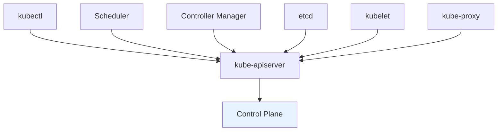

```yaml
kube-apiserver Responsibilities:
  - Acts as frontend for Kubernetes control plane
  - Exposes Kubernetes API for all operations
  - Validates and processes requests
  - Routes to appropriate components
  - Serves as gateway between external users and cluster
  - Manages RBAC and authentication
```

##### etcd Distributed Key-Value Store
```yaml
etcd Characteristics:
  - Consistent and highly-available key-value store
  - Stores all cluster data persistently
  - Provides reliable distributed storage
  - Uses Raft consensus algorithm
  - Critical component - cluster fails if compromised
  - Automatically takes snapshots for disaster recovery
```

##### kube-scheduler
```yaml
Scheduling Responsibilities:
  - Watches newly created pods with no assigned node
  - Evaluates node resources and constraints
  - Selects optimal node based on policies
  - Updates API server with pod assignment
  - Considers resource requirements, affinity rules
  - Ensures high availability and optimal resource utilization
```

##### kube-controller-manager
```yaml
Controller Manager Components:
  - Node Controller: Monitors node health, handles failures
  - Replication Controller: Maintains desired pod replica count
  - Endpoints Controller: Manages Service endpoint populations
  - Service Account & Token Controllers: Manages authentication
  - Multiple specialized controllers working together
  - Self-healing orchestration of cluster state
```

##### Cloud Controller Manager (AWS EKS)
```yaml
AWS-Specific Controllers:
  - Node Controller: Monitors AWS EC2 instances
  - Route Controller: Manages VPC route tables
  - Service Controller: Creates ELB load balancers
  - Integrates Kubernetes with AWS cloud provider services
  - Runs only in cloud provider environments
  - Simplifies cloud-native Kubernetes operations
```

#### Kubernetes Worker Node Components

##### kubelet Agent
```yaml
kubelet Functions:
  - Primary node agent running on each worker node
  - Registers node with API server
  - Monitors pod specifications from API server
  - Ensures containers described in pod specs are running
  - Reports node and pod status to API server
  - Manages container lifecycle and resources
```

##### kube-proxy Network Proxy
```yaml
Network Proxy Responsibilities:
  - Maintains network rules on each node
  - Enables pod-to-pod communication within cluster
  - Handles service discovery and load balancing
  - Manages iptables rules or IPVS for traffic routing
  - Implements service abstractions
  - Ensures network connectivity for all pods
```

##### Container Runtime
```yaml
Supported Runtimes:
  - Docker: Most common container runtime
  - containerd: CNCF graduated container runtime
  - CRI-O: Lightweight container runtime
  - Mirantis Container Runtime: Enterprise container runtime
  - Responsible for pulling images and running containers
  - Must be present on every worker node
```

#### Kubernetes Add-ons and Extensions

##### CoreDNS (cluster DNS)
```yaml
DNS Service Functions:
  - Provides DNS-based service discovery
  - Resolves service names to cluster IPs
  - Enables pod-to-service communication
  - Support for various DNS policies
  - Essential for service mesh operations
```

##### Kubernetes Dashboard
```yaml
Dashboard Capabilities:
  - Web-based UI for cluster management
  - View and manage cluster resources
  - Deploy containerized applications
  - Troubleshoot applications and cluster
  - RBAC-enabled access control
  - Deprecated in favor of other tools like Lens, k9s
```

### Architecture Comparison

#### Traditional vs Kubernetes Architecture
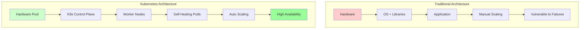

---

## 4.2 Step-00-02- Kubernetes vs AWS EKS Architecture

### Overview
Comparison between vanilla Kubernetes architecture and AWS EKS-specific implementation, highlighting managed service benefits and architectural differences.

### Key Concepts

#### Vanilla Kubernetes Architecture
```yaml
Self-Managed Kubernetes Components:
  - Complete control of all control plane components
  - Manual etcd, API server, and controller management
  - Full responsibility for high availability
  - Requires infrastructure management (VMs, networking)
  - Complex cluster upgrades and maintenance
  - Security configuration and patching
```

#### AWS EKS Architecture Differences
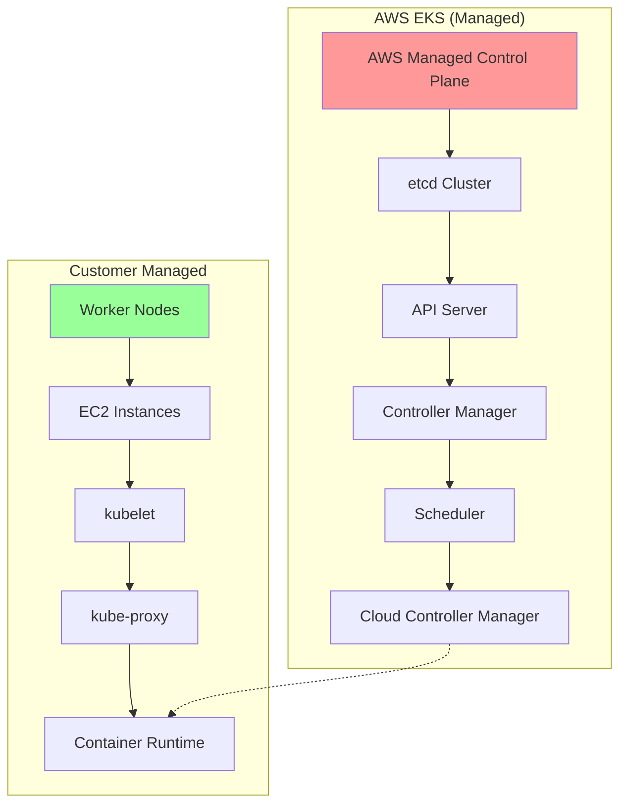

##### AWS EKS Control Plane Benefits
```diff
+ No control plane infrastructure management
+ Automatic version upgrades and patches
+ AWS handles high availability and scaling
+ Integrated with AWS IAM, VPC, and security groups
+ Reduced operational complexity
+ Enterprise-grade SLA (99.9% uptime)
- No SSH access to control plane nodes
- Limited customization options
- Dependence on AWS service availability
- Additional service costs
```

#### Managed vs Self-Managed Comparison

##### Management Responsibilities Matrix
```yaml
Component Management:
  EKS Control Plane: AWS Responsibility
  Worker Nodes: Customer Responsibility
  Network Configuration: Both (AWS provides VPC integration)
  Security Groups: Both (AWS provides defaults)
  Monitoring: Both (AWS provides CloudWatch integration)
  Updates: AWS for control plane, Customer for nodes
```

#### EKS Architecture Components

##### EKS Service Components
```yaml
EKS-Specific Components:
  - EKS Control Plane: Fully managed by AWS
  - Worker Nodes: Customer-managed EC2 instances
  - EKS Add-ons: Optional managed components
  - VPC CNI Plugin: AWS VPC networking integration
  - EBS CSI Driver: AWS storage integration
  - EKS Optimized AMIs: Pre-configured worker node images
```

##### Integration Points with AWS Services
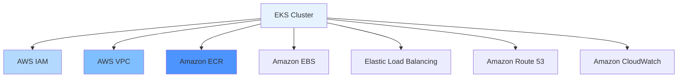

### Practical Considerations

#### Cluster Creation Comparison
```yaml
Vanilla K8s:
  - Install kubelet, kubeadm, kubectl on all nodes
  - Configure etcd, API server, controllers manually
  - Set up networking, DNS, and add-ons
  - Configure security, RBAC, and certificates
  - 2-4 hours setup time per cluster

AWS EKS:
  - Install eksctl or use AWS Console
  - Create cluster (5-10 minutes with eksctl)
  - Launch worker nodes with managed node groups
  - Install add-ons as needed
  - 20-30 minutes total setup time
```

#### Architecture Decision Factors

##### When to Choose EKS
```diff
+ Enterprise environments with AWS investments
+ Need for managed control plane operations
+ Rapid cluster provisioning requirements
+ Integration with existing AWS services
+ Compliance with enterprise security standards
+ Focus on application development vs infrastructure
```

##### When to Choose Self-Managed Kubernetes
```diff
- Multi-cloud or hybrid cloud requirements
- Specific control plane customizations needed
- Cost optimization through bare-metal infrastructure
- Long-term support for specific Kubernetes versions
- Avoidance of cloud vendor lock-in
- Maximum flexibility in component selection
```

---

## 4.3 Step-00-03- Kubernetes Fundamentals - Introduction

### Overview
Introduction to Kubernetes fundamentals section covering pod management, service networking, replica sets, and deployment strategies through hands-on demonstrations.

### Key Concepts

#### Learning Path Structure
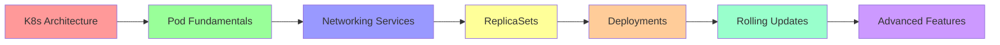

#### Core Kubernetes Resources
```yaml
Fundamental Resources in This Section:
  - Pods: Smallest deployable units of computing
  - Services: Network abstractions for pod groups
  - ReplicaSets: Controllers maintaining pod replicas
  - Deployments: Declarative pod and replica set management
  - Each building block for complex applications
```

#### Section Objectives
```diff
+ Understand pod lifecycle and management
+ Configure service discovery and load balancing
+ Implement replica management with ReplicaSets
+ Master deployment strategies and rolling updates
+ Gain practical experience with kubectl commands
+ Transition from theory to hands-on Kubernetes operations
```

---

## 4.4 Step-01- Introduction to Kubernetes Pods

### Overview
Comprehensive introduction to Kubernetes pods, the fundamental building blocks of containerized applications, covering pod concepts, lifecycle, and management patterns.

### Key Concepts

#### Pod Definition and Characteristics
```diff
+ Smallest and simplest unit in Kubernetes object model
+ Encapsulates one or more containers that share resources
+ Containers in same pod share network namespace, IPC, and volumes
+ Ephemeral by nature - designed for impermanence
+ Atomic unit of scheduling, deployment, and scaling
+ Provides abstraction layer over container runtime
- Cannot be directly scaled (use higher-level objects)
- No self-healing without controllers
- Limited startup dependencies or health checks
```

#### Pod Architecture Components

##### Multi-Container Pod Patterns
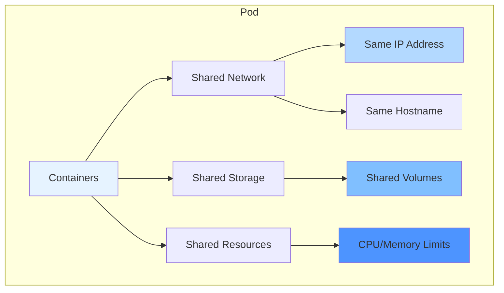

##### Sidecar Container Pattern
```yaml
Sidecar Use Cases:
  - Logging: Application + logging agent sharing logs volume
  - Monitoring: Main app + metrics collector accessing same network
  - Proxy: Application + service mesh proxy for traffic management
  - Synchronization: Data sync utility alongside main application
  - Health checking: External health monitor for main container
```

##### Init Container Pattern
```yaml
Init Container Purposes:
  - Pre-populate data in shared volumes
  - Wait for services to be available before starting main app
  - Perform security setup or credential injection
  - Clone git repositories or download external dependencies
  - Run database migrations or schema updates
  - Set up network configuration before application starts
```

#### Pod Lifecycle States

##### Pod Phase States
```yaml
Pod Phases:
  - Pending: Accepted by cluster, containers not ready
  - Running: Pod bound to node, all containers running
  - Succeeded: All containers terminated successfully
  - Failed: At least one container terminated with failure
  - Unknown: State could not be obtained (node communication issue)

Container States:
  - Waiting: Pending state (pulling images, dependencies)
  - Running: Successfully started and running
  - Terminated: Container execution completed or failed
```

#### Pod Networking Model
```yaml
Pod Networking Characteristics:
  - Each pod gets unique IP address within cluster
  - Containers in same pod share network namespace
  - No port conflicts between containers in same pod
  - Pods communicate via cluster networking (flannel, calico)
  - Service discovery through DNS and environment variables
  - Network policies control pod-to-pod communication
```

#### Storage Patterns in Pods

##### Volume Types Available
```yaml
Pod Volume Categories:
  - Ephemeral: emptyDir, configMap, secret, downwardAPI
  - Persistent: hostPath, persistentVolumeClaim, cloud volumes
  - Projected: serviceAccountToken, configMap, secret combinations
  - CSI Volumes: cloud-specific storage drivers
```

##### Shared Volumes for Multi-Container Pods
```yaml
Volume Sharing Benefits:
  - Data exchange between containers without network overhead
  - Shared configuration files across containers
  - Log aggregation from multiple applications
  - Temporary data storage during pod lifetime
  - Coordination data for distributed applications
```

### Pod Management Best Practices

#### Resource Management
```diff
+ Always specify resource requests and limits
+ Set appropriate CPU and memory allocations
+ Monitor resource utilization patterns
+ Implement horizontal pod autoscaling when needed
- Over-provisioning wastes cluster resources
- Under-provisioning causes throttling and evictions
- Missing limits can cause resource exhaustion
```

#### Health and Readiness
```diff
+ Configure liveness probes for application health
+ Use readiness probes to manage traffic routing
+ Set appropriate probe timeouts and intervals
+ Implement proper startup, liveness, and readiness probes
- Missing health checks lead to zombie processes
- Incorrect probe timeouts cause unnecessary restarts
- Readiness probes prevent traffic to unready pods
```

#### Security Considerations
```diff
+ Run containers with non-root user when possible
+ Use security contexts for pod and container security
+ Implement network policies to restrict communication
+ Use secrets and configMaps for sensitive configuration
+ Apply pod security standards and admission controllers
- Root containers pose security risks
- Plain text secrets compromise security
- Wide-open network policies reduce isolation
```

---

## 4.5 Step-02- Kubernetes Pods Demo

### Overview
Hands-on demonstration of pod creation, management, and basic operations using both imperative and declarative approaches through practical examples.

### Key Concepts

#### Pod Creation Methods
```diff
Imperative Commands: Fast creation for testing and exploration
  + Quick pod deployment without writing YAML
  + Immediate verification of cluster functionality
  + Easy cleanup with single commands
  + Great for learning and experimentation
- No version control or audit trail
- Difficult to reproduce or share
- Hard to manage in production environments

Declarative Manifests: Production-ready infrastructure as code
  + Complete resource specification
  + Version control and change tracking
  + Reproducible deployments across environments
  + Infrastructure as code best practices
- Requires YAML syntax knowledge
- More complex for simple use cases
- Initial learning curve for beginners
```

### Lab Demo: Pod Creation and Management

#### Step 1: Create First Pod with kubectl run (Imperative)
```bash
# Create a simple nginx pod
kubectl run nginx-pod --image=nginx:1.20-alpine

# Verify pod creation
kubectl get pods
kubectl get pods -o wide

# Get detailed pod information
kubectl describe pod nginx-pod
```

#### Step 2: Pod Status and Phase Understanding
```bash
# Check pod status in detail
kubectl get pod nginx-pod -o yaml

# Multiple output formats for pod information
kubectl get pods -o wide          # IP addresses and node info
kubectl get pods --show-labels     # Labels assigned to pods
kubectl get pods -o json           # Complete JSON output
```

#### Step 3: Pod Logs and Monitoring
```bash
# View pod logs
kubectl logs nginx-pod

# Follow logs in real-time
kubectl logs nginx-pod -f

# View logs with timestamps
kubectl logs nginx-pod --timestamps

# Previous container logs (useful for debugging crashes)
kubectl logs nginx-pod --previous
```

#### Step 4: Execute Commands in Running Pod
```bash
# Shell access to container
kubectl exec -it nginx-pod -- /bin/sh

# Run specific commands
kubectl exec nginx-pod -- ps aux
kubectl exec nginx-pod -- cat /etc/nginx/nginx.conf

# Check network configuration
kubectl exec nginx-pod -- ip addr show
kubectl exec nginx-pod -- curl localhost:80
```

#### Step 5: Create Pod with Declarative YAML
```yaml
# simple-pod.yaml
apiVersion: v1
kind: Pod
metadata:
  name: nginx-pod-yaml
  labels:
    app: web
    environment: demo
spec:
  containers:
  - name: nginx
    image: nginx:1.20-alpine
    ports:
    - containerPort: 80
    resources:
      requests:
        memory: "64Mi"
        cpu: "100m"
      limits:
        memory: "128Mi"
        cpu: "200m"
```

```bash
# Create pod from YAML file
kubectl apply -f simple-pod.yaml

# Verify YAML-based pod
kubectl get pod nginx-pod-yaml -o yaml

# Compare with imperative pod
kubectl get pods
```

#### Step 6: Multi-Container Pod Creation
```yaml
# multi-container-pod.yaml
apiVersion: v1
kind: Pod
metadata:
  name: multi-container-pod
  labels:
    app: demo-multi
spec:
  containers:
  - name: nginx
    image: nginx:1.20-alpine
    ports:
    - containerPort: 80
  - name: busybox-sidecar
    image: busybox
    command: ["/bin/sh", "-c"]
    args: ["while true; do echo \"$(date): Sidecar logging\" >> /shared/app.log; sleep 30; done"]
    volumeMounts:
    - name: shared-logs
      mountPath: /shared
  volumes:
  - name: shared-logs
    emptyDir: {}
```

```bash
# Create multi-container pod
kubectl apply -f multi-container-pod.yaml

# Verify both containers are running
kubectl get pod multi-container-pod

# View logs from specific container
kubectl logs multi-container-pod -c nginx
kubectl logs multi-container-pod -c busybox-sidecar -f
```

#### Step 7: Pod with Environment Variables
```yaml
# env-pod.yaml
apiVersion: v1
kind: Pod
metadata:
  name: env-demo-pod
spec:
  containers:
  - name: nginx
    image: nginx:1.20-alpine
    ports:
    - containerPort: 80
    env:
    - name: APP_NAME
      value: "nginx-demo"
    - name: APP_ENV
      value: "development"
    - name: NGINX_WORKER_PROCESSES
      value: "2"
    command: ["/bin/sh", "-c"]
    args:
    - |
      echo "<h1>$APP_NAME</h1><p>Environment: $APP_ENV</p><p>Worker Processes: $NGINX_WORKER_PROCESSES</p>" > /usr/share/nginx/html/index.html
      nginx -g 'daemon off;'
```

```bash
# Create pod with environment variables
kubectl apply -f env-pod.yaml

# Test environment variable injection
kubectl exec env-demo-pod -- env | grep APP_
kubectl logs env-demo-pod
```

#### Step 8: Pod Resource Management
```yaml
# resource-pod.yaml
apiVersion: v1
kind: Pod
metadata:
  name: resource-demo-pod
spec:
  containers:
  - name: nginx
    image: nginx:1.20-alpine
    ports:
    - containerPort: 80
    resources:
      requests:
        memory: "128Mi"
        cpu: "200m"
      limits:
        memory: "256Mi"
        cpu: "500m"
    livenessProbe:
      httpGet:
        path: /
        port: 80
      initialDelaySeconds: 30
      periodSeconds: 10
    readinessProbe:
      httpGet:
        path: /
        port: 80
      initialDelaySeconds: 5
      periodSeconds: 5
```

```bash
# Create resource-managed pod
kubectl apply -f resource-pod.yaml

# Monitor resource usage
kubectl top pods
kubectl describe pod resource-demo-pod

# Check probe status
kubectl get pod resource-demo-pod -o jsonpath='{.status.conditions[?(@.type=="Ready")].status}'
```

### Pod Troubleshooting Techniques

#### Common Pod Issues and Solutions
```bash
# Pod stuck in Pending state
kubectl describe pod <pod-name>
kubectl get nodes  # Check node availability

# Pod in CrashLoopBackOff
kubectl logs <pod-name> --previous
kubectl describe pod <pod-name>

# Pod in ImagePullBackOff
kubectl describe pod <pod-name> | grep -i image
kubectl get events --field-selector involvedObject.name=<pod-name>

# Network connectivity issues
kubectl exec <pod-name> -- ping google.com
kubectl exec <pod-name> -- nslookup kubernetes.default
```

#### Pod Cleanup and Management
```bash
# Delete specific pods
kubectl delete pod nginx-pod
kubectl delete pod nginx-pod-yaml

# Delete all pods in namespace
kubectl delete pods --all

# Delete pods with specific labels
kubectl delete pods -l app=web

# Force delete stuck pods
kubectl delete pod <stuck-pod> --grace-period=0 --force
```

---

## 4.6 Step-03- Kubernetes NodePort Service Introduction

### Overview
Introduction to NodePort services in Kubernetes, explaining the networking abstraction layer that enables external access to applications running in pods.

### Key Concepts

#### Service Abstraction Purpose
```diff
+ Provides stable network endpoint for pod groups
+ Enables load balancing across multiple pod replicas
+ Abstracts pod IP changes and failures
+ Supports service discovery within cluster
+ Enables communication between different application tiers
- Adds network hop and potential latency
- Service IPs need cluster DNS resolution
- Requires careful service selector matching
- No built-in high availability guarantees
```

#### NodePort Service Architecture
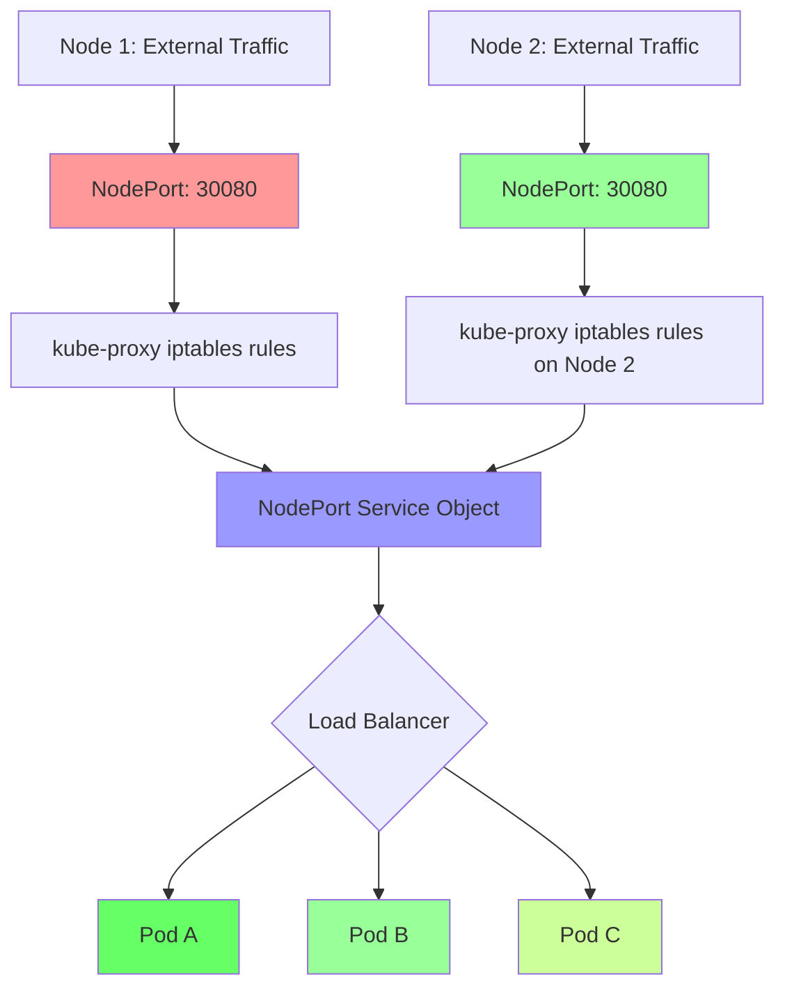

#### NodePort Port Allocation
```yaml
Port Components in NodePort:
  - Port: Virtual port used within cluster (usually targetPort)
  - targetPort: Port on which application is listening in pods
  - nodePort: External port exposed on all worker nodes (30000-32767)

Port Flow:
  ExternalTraffic → nodePort → Port → targetPort → PodContainer
```

### Service Types Comparison

#### ClusterIP vs NodePort Services
```yaml
ClusterIP Service:
  - Internal cluster communication only
  - IP accessible from within cluster
  - Load balancing between pods
  - DNS service discovery
  - Default service type

NodePort Service:
  - External access through node ports
  - Each worker node exposes same port
  - Direct access via NodeIP:NodePort
  - Still provides internal cluster access
  - Perfect for development and testing
```

#### When to Use NodePort
```diff
+ Development and testing environments
+ Direct browser access for web applications
+ Load balancer integration testing
+ Legacy applications requiring specific ports
+ Multi-node access patterns
- Production internet-facing applications (use LoadBalancer/Ingress)
- Security-concerned environments
- Need for custom domain names
- Complex routing requirements
```

### NodePort Implementation Details

#### Port Range and Considerations
```yaml
NodePort Constraints:
  - Port range: 30000 to 32767 (configurable in kube-apiserver)
  - Same port exposed on all worker nodes
  - Port conflicts possible across clusters
  - iptables rules updated on each node
  - No automatic SSL/TLS termination
```

#### Traffic Distribution Pattern
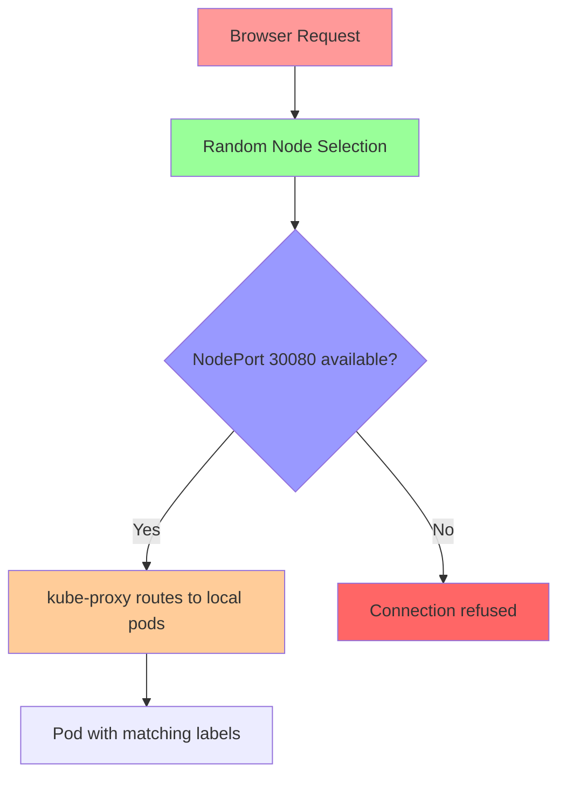

### NodePort Service DNS and Discovery

#### Service Endpoint Resolution
```yaml
Service Discovery Methods:
  - DNS: service-name.namespace.svc.cluster.local
  - Environment variables: SERVICE_PORT_NODEPORT variables
  - API calls: Service endpoint information
  - kube-dns/CoreDNS integration
```

#### NodePort Access Patterns
```bash
# Direct node access
curl http://<node1-ip>:30080
curl http://<node2-ip>:30080
curl http://<node3-ip>:30080  # All return same application

# Internal cluster access
curl http://my-service.default.svc.cluster.local
```

### NodePort Limitations and Best Practices

#### Scalability Considerations
```diff
+ Simple horizontal scaling support
+ Traffic distribution across worker nodes
+ Easy to implement and test
- External load balancer integration needed for production
- No session affinity by default
- Port range limitations
- Security groups/firewall configuration required
```

#### Security Implications
```diff
+ Requires opening ports on worker nodes
+ Direct exposure of node infrastructure
+ Need for worker node security hardening
+ Network policies recommended
- Potential attack vector through exposed ports
- No built-in authentication or authorization
```

---

## 4.7 Step-04- Kubernetes NodePort Service and Pods Demo

### Overview
Hands-on demonstration of creating NodePort services and integrating them with pod deployments for external application access and service connectivity testing.

### Key Concepts

#### NodePort + Pods Integration Pattern
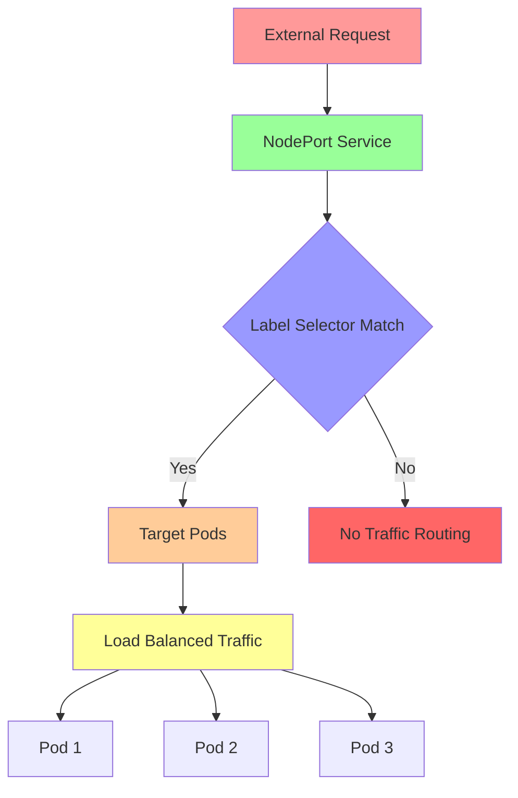

#### Service-Pod Binding Requirements
```yaml
Critical Matching Criteria:
  - Service selector labels must exactly match pod labels
  - Namespace consistency between service and pods
  - Label keys and values case-sensitive
  - Multiple services can select same pods with different ports
```

### Lab Demo: NodePort Service with Pods

#### Step 1: Create Application Pods
```yaml
# nginx-pod-service.yaml
apiVersion: v1
kind: Pod
metadata:
  name: nginx-pod-for-service
  labels:
    app: nginx-service-demo  # Critical: matches service selector
    environment: demo
    tier: frontend
spec:
  containers:
  - name: nginx
    image: nginx:1.20-alpine
    ports:
    - containerPort: 80
    command: ["/bin/sh", "-c"]
    args:
    - |
      echo '<!DOCTYPE html>
      <html>
      <head><title>NodePort Service Demo</title></head>
      <body style="font-family: Arial, sans-serif; margin: 40px;">
      <h1 style="color: #2c3e50;">🎯 NodePort Service Test</h1>
      <p><strong>Pod:</strong> nginx-pod-for-service</p>
      <p><strong>Node:</strong> <span id="node-info">Unknown</span></p>
      <p><strong>Timestamp:</strong> '"$(date)"'</p>
      <p><strong>Request served via Kubernetes Service</strong></p>
      <div style="background: #ecf0f1; padding: 15px; margin: 20px 0; border-radius: 5px;">
      <p>This response came through a NodePort service exposing the application on all cluster nodes.</p>
      </div>
      </body>
      <script>
      // Display node information via environment
      document.getElementById("node-info").textContent = window.location.hostname || "Kubernetes Node";
      </script>
      </html>' > /usr/share/nginx/html/index.html
      && nginx -g 'daemon off;'
    resources:
      requests:
        memory: "64Mi"
        cpu: "100m"
      limits:
        memory: "128Mi"
        cpu: "200m"
```

```bash
# Create the pod
kubectl apply -f nginx-pod-service.yaml

# Verify pod creation
kubectl get pods -l app=nginx-service-demo -o wide

# Test pod directly (if accessible)
kubectl exec nginx-pod-for-service -- curl localhost
```

#### Step 2: Create NodePort Service Manifest
```yaml
# nodeport-service-demo.yaml
apiVersion: v1
kind: Service
metadata:
  name: nginx-nodeport-service
  labels:
    app: nginx-service-demo
    type: nodeport-external
  annotations:
    description: "NodePort service for Nginx application demonstration"
spec:
  type: NodePort                    # Service type for external access
  selector:
    app: nginx-service-demo         # Must match pod labels exactly
    environment: demo              # Additional selector for precision
  ports:
  - name: http                      # Descriptive port name
    port: 80                       # Service virtual port (internal)
    targetPort: 80                 # Container port in pods
    nodePort: 30081                # External port on worker nodes
    protocol: TCP
```

```bash
# Create the NodePort service
kubectl apply -f nodeport-service-demo.yaml

# Verify service creation
kubectl get services
kubectl get svc nginx-nodeport-service -o wide
kubectl describe svc nginx-nodeport-service

# Check service endpoints (shows pod IPs backing the service)
kubectl get endpoints nginx-nodeport-service
```

#### Step 3: Test External Access and Load Balancing
```bash
# Get cluster node information
kubectl get nodes -o wide

# Extract node IP for testing
NODE_IP=$(kubectl get nodes -o jsonpath='{.items[0].status.addresses[?(@.type=="ExternalIP")].address}')
NODE_PORT=$(kubectl get svc nginx-nodeport-service -o jsonpath='{.spec.ports[0].nodePort}')

echo "============================================================"
echo "NodePort Service Testing Information"
echo "============================================================"
echo "Service Name: nginx-nodeport-service"
echo "Service Type: NodePort"
echo "Service IP: $(kubectl get svc nginx-nodeport-service -o jsonpath='{.spec.clusterIP}')"
echo "NodePort: $NODE_PORT"
echo "Access URLs:"
echo "  http://$NODE_IP:$NODE_PORT"
echo ""
echo "Testing connectivity..."

# Test service connectivity
curl -s -I "http://$NODE_IP:$NODE_PORT" | head -3

# Test web content
curl -s "http://$NODE_IP:$NODE_PORT" | grep -E "(NodePort Service|Pod:|Request served)" | head -3

# Load balancing test with multiple requests
echo "Load balancing verification (5 requests):"
for i in {1..5}; do
  response=$(curl -s "http://$NODE_IP:$NODE_PORT")
  timestamp=$(echo "$response" | grep -o "Timestamp: [^<]*" | cut -d' ' -f2-)
  echo "Request $i: Served at $timestamp"
  sleep 1
done
```

#### Step 4: Service DNS and Internal Access Testing
```bash
# Test internal cluster DNS resolution
kubectl run dns-test --image=busybox --rm -it --restart=Never -- nslookup nginx-nodeport-service

# Test service access from another pod
kubectl run service-test --image=curlimages/curl --rm -it --restart=Never -- \
  curl -s http://nginx-nodeport-service | grep "NodePort Service"

# Verify environment variables injected by service (legacy method)
kubectl run env-test --image=busybox --rm -it --restart=Never -- env | grep -i nginx
```

#### Step 5: Multi-Pod Service Demonstration
```bash
# Scale the service with additional pods
kubectl run nginx-pod-2 --image=nginx:1.20-alpine --labels="app=nginx-service-demo,environment=demo" --port=80
kubectl run nginx-pod-3 --image=nginx:1.20-alpine --labels="app=nginx-service-demo,environment=demo" --port=80

# Wait for pods to start
kubectl get pods -l app=nginx-service-demo

# Test load balancing across multiple pods
echo "Testing load balancing with multiple pods:"
for i in {1..10}; do
  response=$(curl -s "http://$NODE_IP:$NODE_PORT")
  pod_name=$(echo "$response" | grep -o "Pod: [^<]*" | cut -d":" -f2 | tr -d ' ')
  echo "Request $i -> $pod_name"
done | sort | uniq -c | sort -nr

# Observe service endpoints with multiple pods
kubectl get endpoints nginx-nodeport-service
kubectl describe endpoints nginx-nodeport-service
```

#### Step 6: Service Troubleshooting and Analysis
```bash
# Analyze service-pod connectivity issues
echo "=== Service Diagnosis ==="
kubectl get svc,ep,pods -l app=nginx-service-demo

# Check label matching
echo "=== Label Verification ==="
kubectl get svc nginx-nodeport-service -o jsonpath='{.spec.selector}'
echo ""
kubectl get pods -l app=nginx-service-demo -o jsonpath='{.items[*].metadata.labels}'

# Test individual pod connectivity
echo "=== Pod Health Checks ==="
for pod in $(kubectl get pods -l app=nginx-service-demo -o jsonpath='{.items[*].metadata.name}'); do
  echo "Testing pod: $pod"
  kubectl exec $pod -- curl -s localhost | head -1 || echo "Pod $pod not responding"
done

# Network diagnostics
kubectl run network-test --image=busybox --rm -it --restart=Never -- \
  traceroute nginx-nodeport-service.default.svc.cluster.local
```

### Advanced NodePort Service Patterns

#### Service with Multiple Ports
```yaml
# multi-port-nodeport.yaml
apiVersion: v1
kind: Service
metadata:
  name: multi-app-service
  labels:
    app: multi-port-demo
spec:
  type: NodePort
  selector:
    app: multi-port-demo
  ports:
  - name: web
    port: 80
    targetPort: 8080
    nodePort: 30082
  - name: api
    port: 443
    targetPort: 8443
    nodePort: 30443
  - name: metrics
    port: 9090
    targetPort: 9090
    nodePort: 31900
```

#### Session Affinity Demonstration
```yaml
# session-affinity-service.yaml
apiVersion: v1
kind: Service
metadata:
  name: sticky-session-service
  labels:
    app: session-demo
spec:
  type: NodePort
  selector:
    app: session-demo
  ports:
  - port: 80
    targetPort: 80
    nodePort: 30083
  sessionAffinity: ClientIP     # Routes same client to same pod
  sessionAffinityConfig:
    clientIP:
      timeoutSeconds: 300       # Session timeout
```

---

## 4.8 Step-05- Interact with Pod - Connect to container in a pod

### Overview
Demonstration of interactive pod connectivity, shell access, command execution, and pod inspection techniques for debugging and maintenance operations.

### Key Concepts

#### Pod Interaction Methods
```diff
+ Direct shell access for debugging and troubleshooting
+ Command execution for health checks and diagnostics
+ File system access for log inspection and configuration
+ Process monitoring within container environments
+ Network testing and service connectivity verification
- No direct container modification in production
- Ephemeral changes lost on pod restart
- Security risks with privileged access
```

#### kubectl exec Capabilities
```yaml
exec Command Options:
  - -it: Interactive terminal session
  - -c: Specify container in multi-container pod
  - --: Command separator for complex arguments
  - Multiple command execution capabilities
  - Environment variable access and modification
```

### Lab Demo: Pod Interaction Techniques

#### Step 1: Basic Shell Access to Pod
```bash
# Get available pods
kubectl get pods

# Basic shell access to pod
kubectl exec -it nginx-pod-for-service -- /bin/sh

# Verify container environment
/ # ps aux              # Process list
/ # whoami             # Current user
/ # pwd                # Current directory
/ # ls -la             # Directory listing
/ # exit               # Exit shell
```

#### Step 2: Command Execution Without Shell
```bash
# Execute single commands
kubectl exec nginx-pod-for-service -- date
kubectl exec nginx-pod-for-service -- hostname
kubectl exec nginx-pod-for-service -- cat /etc/hostname

# Check process information
kubectl exec nginx-pod-for-service -- ps aux | head -5

# Verify network connectivity
kubectl exec nginx-pod-for-service -- ping -c 3 8.8.8.8
kubectl exec nginx-pod-for-service -- curl -I localhost:80

# File system inspection
kubectl exec nginx-pod-for-service -- ls -la /usr/share/nginx/html/
kubectl exec nginx-pod-for-service -- cat /usr/share/nginx/html/index.html | head -5
```

#### Step 3: Multi-Container Pod Interaction
```bash
# Create multi-container pod for testing
kubectl apply -f multi-container-pod.yaml

# List containers in pod
kubectl get pod multi-container-pod -o jsonpath='{.spec.containers[*].name}'

# Connect to specific container (default is first container)
kubectl exec -it multi-container-pod -c nginx -- /bin/sh

# Execute commands in specific container
kubectl exec multi-container-pod -c busybox-sidecar -- ps aux
kubectl exec multi-container-pod -c busybox-sidecar -- tail -10 /shared/app.log
```

#### Step 4: Environment and Configuration Inspection
```bash
# Check environment variables
kubectl exec nginx-pod-for-service -- env | grep -E "(KUBERNETES|PATH|HOME)"

# View process environment
kubectl exec nginx-pod-for-service -- cat /proc/1/environ | tr '\0' '\n'

# Check network configuration
kubectl exec nginx-pod-for-service -- ip addr show
kubectl exec nginx-pod-for-service -- ip route show
kubectl exec nginx-pod-for-service -- cat /etc/resolv.conf

# Check mounted volumes
kubectl exec nginx-pod-for-service -- mount | grep -E "(nfs|tmpfs|overlay)"
kubectl exec nginx-pod-for-service -- df -h
```

#### Step 5: Health and Application Debugging
```bash
# Test application health
kubectl exec nginx-pod-for-service -- curl localhost:80/health || echo "No health endpoint"

# Check application logs from inside container
kubectl exec nginx-pod-for-service -- tail -20 /var/log/nginx/access.log
kubectl exec nginx-pod-for-service -- tail -20 /var/log/nginx/error.log

# Verify configuration files
kubectl exec nginx-pod-for-service -- nginx -t
kubectl exec nginx-pod-for-service -- cat /etc/nginx/nginx.conf | head -20

# Test service connectivity
kubectl exec nginx-pod-for-service -- curl nginx-nodeport-service
kubectl exec nginx-pod-for-service -- nslookup nginx-nodeport-service
```

#### Step 6: File Operations in Pods
```bash
# Create temporary files for testing
kubectl exec nginx-pod-for-service -- touch /tmp/test-file.txt
kubectl exec nginx-pod-for-service -- echo "test content" > /tmp/test-file.txt
kubectl exec nginx-pod-for-service -- cat /tmp/test-file.txt

# Modify nginx configuration temporarily
kubectl exec nginx-pod-for-service -- cp /etc/nginx/nginx.conf /etc/nginx/nginx.conf.backup
kubectl exec nginx-pod-for-service -- sed -i 's/worker_processes 1/worker_processes 2/' /etc/nginx/nginx.conf
kubectl exec nginx-pod-for-service -- nginx -t

# Copy files to/from pods
kubectl cp nginx-pod-for-service:/usr/share/nginx/html/index.html ./index-downloaded.html
echo "Updated content" > ./index-updated.html
kubectl cp ./index-updated.html nginx-pod-for-service:/usr/share/nginx/html/index.html
```

#### Step 7: Advanced Networking Diagnostics
```bash
# Test cluster DNS resolution
kubectl exec nginx-pod-for-service -- nslookup kubernetes.default

# Check service discovery
kubectl exec nginx-pod-for-service -- cat /etc/hosts

# Test pod-to-pod communication
kubectl exec nginx-pod-for-service -- curl -s multi-container-pod:80 | head -c 50

# Network troubleshooting
kubectl exec nginx-pod-for-service -- netstat -tlnp
kubectl exec nginx-pod-for-service -- ss -tlnp

# iptables rules (if accessible)
kubectl exec nginx-pod-for-service -- iptables -L -n | head -10
```

### Security and Best Practices

#### Safe Interaction Guidelines
```diff
+ Use non-privileged containers when possible
+ Avoid modifying production configurations directly
+ Create diagnostic pods instead of modifying running ones
+ Use resource limits to prevent runaway processes
+ Always clean up temporary changes
- Never store sensitive information in commands
- Don't expose privileged containers to exec access
- Avoid running interactive sessions in production
```

#### Production Debugging Patterns
```bash
# Create temporary diagnostic pod
kubectl run debug-pod --image=busybox --rm -it --restart=Never -- /bin/sh

# Use debug containers from kubectl debug (Kubernetes 1.18+)
kubectl debug nginx-pod-for-service --image=busybox --share-processes

# Ephemeral containers for debugging (if supported)
kubectl debug nginx-pod-for-service --image=busybox --target=nginx
```

---

## 4.9 Step-06- Delete Pod

### Overview
Comprehensive pod deletion strategies including graceful termination, force deletion, cascading deletions, and cleanup operations with verification techniques.

### Key Concepts

#### Pod Deletion Lifecycle
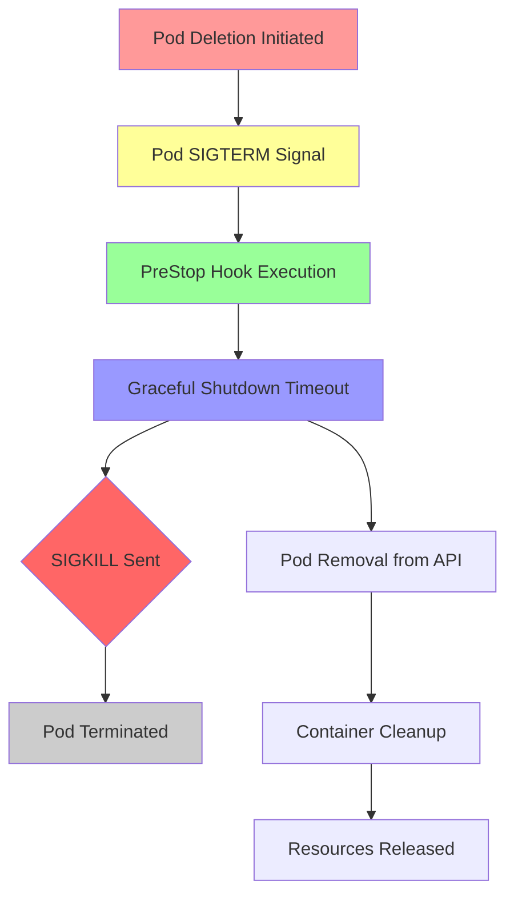

#### Grace Period and Termination Process
```yaml
Pod Termination Timeline:
  - SIGTERM signal sent to containers (graceful shutdown)
  - Pre-stop lifecycle hooks executed if defined
  - Grace period countdown begins (default 30 seconds)
  - SIGKILL sent if containers don't shutdown gracefully
  - Pod status changes to Terminating
  - Finalizers processed (if any)
  - Pod removed from etcd and API
```

### Lab Demo: Pod Deletion Techniques

#### Step 1: Graceful Pod Deletion
```bash
# Delete single pod gracefully
kubectl delete pod nginx-pod-for-service

# Monitor deletion process
kubectl get pods -w

# Check pod events for termination details
kubectl get events --field-selector involvedObject.name=nginx-pod-for-service --sort-by=.metadata.creationTimestamp
```

#### Step 2: Immediate Pod Deletion
```bash
# Force delete pod (bypasses graceful termination)
kubectl delete pod nginx-pod-for-service --grace-period=0 --force

# Alternative force delete
kubectl delete pod nginx-pod-for-service --now

# Delete without waiting for confirmation
kubectl delete pod nginx-pod-for-service --wait=false
```

#### Step 3: Bulk Pod Deletion Operations
```bash
# Delete all pods in default namespace
kubectl delete pods --all

# Delete pods with specific labels
kubectl delete pods -l app=nginx-service-demo

# Delete pods by multiple labels
kubectl delete pods -l environment=demo,tier=frontend

# Delete pods in different namespaces
kubectl delete pods --all -n development
kubectl delete pods --all -n staging
```

#### Step 4: Cascading Deletion with Controllers
```bash
# Delete deployment (cascades to pods)
kubectl delete deployment my-deployment

# Delete ReplicaSet (removes managed pods)
kubectl delete rs my-replicaset

# Orphan pods (delete controller but keep pods)
kubectl delete deployment my-deployment --cascade=orphan

# Delete StatefulSet (maintains PVCs if desired)
kubectl delete statefulset my-statefulset
```

#### Step 5: Pattern-Based Deletion
```bash
# Delete pods matching name patterns
kubectl delete pod $(kubectl get pods -o name | grep -E "test|debug|temp")

# Delete pods older than certain time
kubectl delete pod $(kubectl get pods --no-headers -o custom-columns=NAME:.metadata.name,AGE:.metadata.creationTimestamp | awk '$2 < "'$(date -d '1 hour ago' +%Y-%m-%dT%H:%M:%SZ 2>/dev/null || date -v -1H +%Y-%m-%dT%H:%M:%SZ)'" {print $1}')

# Delete pods in specific states
kubectl delete pod $(kubectl get pods --field-selector status.phase=Failed -o name)
kubectl delete pod $(kubectl get pods --field-selector status.phase=Succeeded -o name)
```

#### Step 6: Selective Pod Preservation
```bash
# Delete all pods except specific ones
kubectl delete pods --all --ignore-not-found=true --field-selector=metadata.name!=keep-pod-1

# Delete pods not matching specific labels
kubectl delete pods $(kubectl get pods --no-headers | awk '!/important-label/ {print $1}')

# Create backup before mass deletion
kubectl get pods -o yaml > pods-backup.yaml
kubectl delete pods --all
```

### Advanced Pod Cleanup Scenarios

#### Resource-Based Cleanup
```bash
# Delete pods by resource consumption
kubectl delete pod $(kubectl top pods --no-headers | awk '$3 > 50 {print $1}')  # High memory usage
kubectl delete pod $(kubectl top pods --no-headers | awk '$2 > 200 {print $1}') # High CPU usage

# Delete pods with specific container states
kubectl delete pod $(kubectl get pods -o jsonpath='{.items[?(@.status.containerStatuses[*].state.waiting.reason=="ImagePullBackOff")].metadata.name}')
```

#### Namespace Cleanup Operations
```bash
# Delete all resources in namespace (dangerous)
kubectl delete all --all -n test-namespace

# Selective cleanup by resource type
kubectl delete pods,replicasets,deployments --all -n cleanup-namespace

# Clean up namespace completely
kubectl delete namespace test-namespace --wait=false
```

### Pod Deletion Troubleshooting

#### Stuck Pod Termination Issues
```bash
# Check pod termination status
kubectl get pods --all-namespaces | grep Terminating

# Get detailed termination information
kubectl describe pod stuck-pod

# Force terminate stuck pods
kubectl delete pod stuck-pod --grace-period=0 --force

# Check for finalizers blocking deletion
kubectl get pod stuck-pod -o yaml | grep finalizers

# Remove finalizers if needed
kubectl patch pod stuck-pod --type=merge -p '{"metadata":{"finalizers":null}}'
```

#### Volume and PVC Cleanup
```bash
# Delete pods with PVCs (cascades properly)
kubectl delete pod pod-with-pvc --wait=true

# Clean up orphaned PVCs
kubectl delete pvc $(kubectl get pvc --output=jsonpath='{.items[?(@.status.phase=="Released")].metadata.name}')

# Delete StatefulSet with PVC cleanup
kubectl delete statefulset my-statefulset --cascade=delete
```

---

## 4.10 Step-07- Kubernetes ReplicaSet - Introduction

### Overview
Introduction to Kubernetes ReplicaSets as controllers that ensure specified number of pod replicas run at all times, providing self-healing and scaling capabilities.

### Key Concepts

#### ReplicaSet Purpose and Function
```diff
+ Ensures desired number of pod replicas always running
+ Provides self-healing capabilities for pod failures
+ Enables horizontal scaling of applications
+ Manages pod replica lifecycle independently
+ Supports rolling updates through Deployments
- Cannot perform rolling updates directly
- No deployment history tracking
- Manual scaling operations required
- No rollback capabilities
```

#### ReplicaSet Architecture
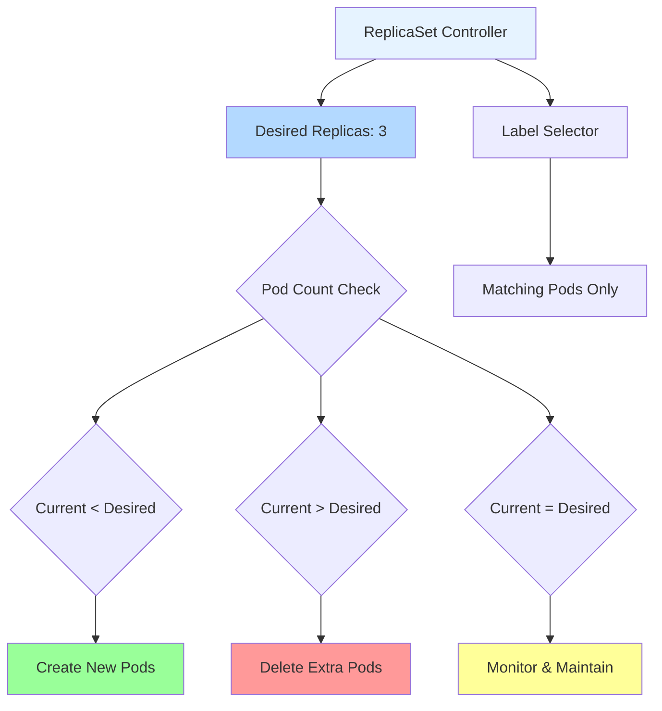

#### Label Selector Importance
```yaml
Label Selector Requirements:
  - matchLabels: Required label key-value pairs
  - matchExpressions: Advanced matching with operators
  - Unique selectors prevent pod conflicts
  - Consistent with pod template labels
  - Enables precise pod management
```

### ReplicaSet vs ReplicationController

#### Evolutionary Comparison
```yaml
ReplicationController (deprecated):
  - Legacy pod replication controller
  - Basic replica management
  - Limited label selector support
  - No direct update capabilities
  - Replaced by ReplicaSets

ReplicaSet (current):
  - Enhanced label selector support
  - set-based label matching
  - matchExpressions support
  - Foundation for Deployments
  - Rolling update support
```

### ReplicaSet Ownership and Adoption

#### Pod Adoption Rules
```yaml
Pod Acquisition Rules:
  - Pod labels must exactly match ReplicaSet selector
  - Pod cannot be owned by another controller
  - Pod must be in schedulable state
  - ReplicaSet acquires ownership immediately
  - Count towards desired replica total
```

#### Adoption vs Creation
```diff
ReplicaSet adopts existing pods that match selectors and acquires them into management
ReplicaSet creates new pods only when current count falls below desired replicas
Adoption allows bringing unmanaged pods under ReplicaSet control
Creation ensures exact replica count maintenance
```

### Scaling and Self-Healing

#### Automatic Recovery Capabilities
```yaml
Self-Healing Events:
  - Node failure: Recreate pods on healthy nodes
  - Pod termination: Replace with new instances
  - Container crash: Restart container or recreate pod
  - Resource constraints: Scale based on available resources
  - Network issues: Reschedule on different nodes
```

#### Scaling Operations
```yaml
Scaling Methods:
  - Imperative: kubectl scale rs name --replicas=N
  - Declarative: Edit manifest and apply
  - Automatic: Integration with HPA (via Deployment)
  - Scheduled: CronJob-based scaling patterns
  - Event-driven: Custom controllers and webhooks
```

### ReplicaSet Best Practices

#### Configuration Guidelines
```diff
+ Use unique label selectors for each ReplicaSet
+ Set appropriate pod template resource limits
+ Configure health checks for pod readiness
+ Use appropriate pod restart policies
+ Implement pod anti-affinity for high availability
- Over-provision replicas unnecessarily
- Use stale pod templates without updates
- Mix ReplicaSets with Deployments improperly
- Ignore pod disruption budgets
```

#### Production Considerations
```yaml
Enterprise Patterns:
  - ReplicaSets primarily used through Deployments
  - Direct ReplicaSet usage for stateless applications
  - Pod templates should be immutable
  - Resource requests/limits critical for stability
  - Node selectors for workload placement
```

---

## 4.11 Step-08- Kubernetes ReplicaSet - Review manifests and Create ReplicaSet

### Overview
Hands-on creation and management of Kubernetes ReplicaSets using YAML manifests, demonstrating pod replication, scaling, and self-healing capabilities.

### Key Concepts

#### ReplicaSet Manifest Structure
```yaml
Required Manifest Fields:
  - apiVersion: apps/v1 (ReplicaSet API version)
  - kind: ReplicaSet (resource type)
  - metadata: name, labels, annotations
  - spec: replica count, selector, pod template
  - selector: label matching criteria
  - template: pod specification template
  - Containers, resources, health checks within template
```

#### Selector Matching Dynamics
```yaml
Label Matching Rules:
  - Exact match required for matchLabels
  - Operations available: In, NotIn, Exists, DoesNotExist
  - Multiple expressions combined with AND logic
  - Selects pods already running in cluster
  - Template labels must match selector labels
```

### Lab Demo: ReplicaSet Creation and Management

#### Step 1: Basic ReplicaSet Manifest
```yaml
# basic-replicaset.yaml
apiVersion: apps/v1
kind: ReplicaSet
metadata:
  name: nginx-rs-basic
  labels:
    app: nginx-rs-demo
    environment: demo
spec:
  replicas: 3
  selector:
    matchLabels:
      app: nginx-rs-demo
  template:
    metadata:
      labels:
        app: nginx-rs-demo
    spec:
      containers:
      - name: nginx
        image: nginx:1.20-alpine
        ports:
        - containerPort: 80
        command: ["/bin/sh", "-c"]
        args:
        - |
          cat > /usr/share/nginx/html/index.html << EOF
          <html>
          <head><title>ReplicaSet Demo</title></head>
          <body style="font-family: Arial; margin: 40px;">
          <h1>🎯 ReplicaSet Application</h1>
          <p><strong>Pod Name:</strong> $(hostname)</p>
          <p><strong>ReplicaSet:</strong> nginx-rs-basic</p>
          <p><strong>Created:</strong> $(date)</p>
          <p><strong>Request Handled by ReplicaSet-managed pod</strong></p>
          </body>
          </html>
          EOF
          nginx -g 'daemon off;'
        resources:
          requests:
            memory: "64Mi"
            cpu: "100m"
          limits:
            memory: "128Mi"
            cpu: "200m"
        livenessProbe:
          httpGet:
            path: /
            port: 80
          initialDelaySeconds: 30
          periodSeconds: 10
        readinessProbe:
          httpGet:
            path: /
            port: 80
          initialDelaySeconds: 5
          periodSeconds: 5
```

```bash
# Create the basic ReplicaSet
kubectl apply -f basic-replicaset.yaml

# Monitor ReplicaSet creation and pod spawning
kubectl get rs -o wide
kubectl get pods -l app=nginx-rs-demo -o wide

# Observe ReplicaSet status and managed pods
kubectl describe rs nginx-rs-basic
```

#### Step 2: Advanced Selector ReplicaSet
```yaml
# advanced-selector-rs.yaml
apiVersion: apps/v1
kind: ReplicaSet
metadata:
  name: nginx-rs-advanced
  labels:
    app: nginx-advanced
    version: v1
spec:
  replicas: 2
  selector:
    matchLabels:
      app: nginx-advanced
      tier: frontend
    matchExpressions:
    - key: environment
      operator: In
      values: [dev, staging, prod]
    - key: version
      operator: NotIn
      values: [deprecated]
  template:
    metadata:
      labels:
        app: nginx-advanced
        tier: frontend
        environment: dev
        version: stable
    spec:
      containers:
      - name: nginx
        image: nginx:1.20-alpine
        ports:
        - containerPort: 80
        env:
        - name: APP_ENV
          value: "development"
        command: ["/bin/sh", "-c"]
        args:
        - |
          echo "<h1>Advanced ReplicaSet</h1><p>Pod: $(hostname)</p><p>Tier: frontend</p><p>Environment: dev</p>" > /usr/share/nginx/html/index.html
          nginx -g 'daemon off;'
```

```bash
# Create advanced ReplicaSet
kubectl apply -f advanced-selector-rs.yaml

# Verify complex selector matching
kubectl get rs nginx-rs-advanced -o yaml | grep -A 10 "selector:"
kubectl get pods -l app=nginx-advanced -o yaml | jq '.items[].metadata.labels'
```

#### Step 3: ReplicaSet Scaling Operations
```bash
# Scale up ReplicaSet (updates replica count)
kubectl scale rs nginx-rs-basic --replicas=5

# Monitor scaling operation
kubectl get rs nginx-rs-basic -w

# Check final state
kubectl get pods -l app=nginx-rs-demo
kubectl get rs nginx-rs-basic

# Scale down operation
kubectl scale rs nginx-rs-basic --replicas=2

# Verify pod termination
kubectl get pods -l app=nginx-rs-demo
```

#### Step 4: ReplicaSet YAML Editing
```bash
# Edit ReplicaSet configuration
kubectl edit rs nginx-rs-basic

# Possible modifications:
# - Change replica count
# - Update image version
# - Modify resource limits
# - Add environment variables
# - Adjust health probes

# View changes
kubectl get rs nginx-rs-basic -o yaml

# Monitor rolling replacement
kubectl get pods -l app=nginx-rs-demo -w
```

#### Step 5: Pod Adoption Demonstration
```bash
# Create unmanaged pod with matching labels
kubectl run manual-pod --image=nginx:1.20-alpine --labels="app=nginx-rs-demo"

# Observe ReplicaSet adopting the pod
kubectl get pods -l app=nginx-rs-demo

# Check ReplicaSet status (should show desired=2, current=3)
kubectl get rs nginx-rs-basic

# Manually delete pod to see replacement
kubectl delete pod manual-pod

# ReplicaSet recreates to maintain desired count
kubectl get pods -l app=nginx-rs-demo -w
```

#### Step 6: ReplicaSet with External Service
```yaml
# rs-with-service.yaml
apiVersion: v1
kind: Service
metadata:
  name: rs-demo-service
  labels:
    app: nginx-rs-demo
spec:
  type: NodePort
  selector:
    app: nginx-rs-demo  # Matches ReplicaSet pods
  ports:
  - port: 80
    targetPort: 80
    nodePort: 30084
---
# Update existing ReplicaSet or create new one
apiVersion: apps/v1
kind: ReplicaSet
metadata:
  name: nginx-rs-service-demo
spec:
  replicas: 3
  selector:
    matchLabels:
      app: nginx-rs-service-demo
  template:
    metadata:
      labels:
        app: nginx-rs-service-demo
    spec:
      containers:
      - name: nginx
        image: nginx:1.21-alpine
        ports:
        - containerPort: 80
        command: ["/bin/sh", "-c"]
        args:
        - echo "<h1>ReplicaSet + Service</h1><p>Pod: $(hostname)</p><p>Time: $(date)</p>" > /usr/share/nginx/html/index.html && nginx -g 'daemon off;'
```

```bash
# Create service and updated ReplicaSet
kubectl apply -f rs-with-service.yaml

# Test load balancing
NODE_IP=$(kubectl get nodes -o jsonpath='{.items[0].status.addresses[?(@.type=="ExternalIP")].address}')
NODE_PORT=$(kubectl get svc rs-demo-service -o jsonpath='{.spec.ports[0].nodePort}')

echo "Access ReplicaSet via Service: http://$NODE_IP:$NODE_PORT"

# Load balancing test
for i in {1..8}; do
  response=$(curl -s "http://$NODE_IP:$NODE_PORT")
  hostname=$(echo "$response" | grep -o "Pod: [^<]*" | cut -d":" -f2 | tr -d ' ')
  echo "Request $i -> $hostname"
done
```

#### Step 7: ReplicaSet Troubleshooting
```bash
# Check ReplicaSet health
kubectl describe rs nginx-rs-service-demo

# Verify selector matching
kubectl get rs nginx-rs-service-demo -o jsonpath='{.spec.selector}'
kubectl get pods -l app=nginx-rs-service-demo -o jsonpath='{.items[*].metadata.labels}'

# Check events for issues
kubectl get events --field-selector involvedObject.name=nginx-rs-service-demo --sort-by=.metadata.creationTimestamp

# Pod creation problems
kubectl logs $(kubectl get pods -l app=nginx-rs-service-demo -o jsonpath='{.items[0].metadata.name}') --previous

# Resource issues
kubectl get nodes --sort-by=.metadata.creationTimestamp
```

### ReplicaSet Cleanup and Management

#### Deletion Strategies
```bash
# Keep pods when deleting ReplicaSet
kubectl delete rs nginx-rs-basic --cascade=orphan

# Standard deletion (removes pods)
kubectl delete rs nginx-rs-service-demo

# Bulk cleanup
kubectl delete rs --all
kubectl delete pods --all
```

---

## 4.12 Step-09- Kubernetes ReplicaSet - Expose and Test via Browser

### Overview
Creating external access to ReplicaSet-managed pods through NodePort services and comprehensive browser-based testing to demonstrate load balancing and self-healing capabilities.

### Key Concepts

#### ReplicaSet Service Integration
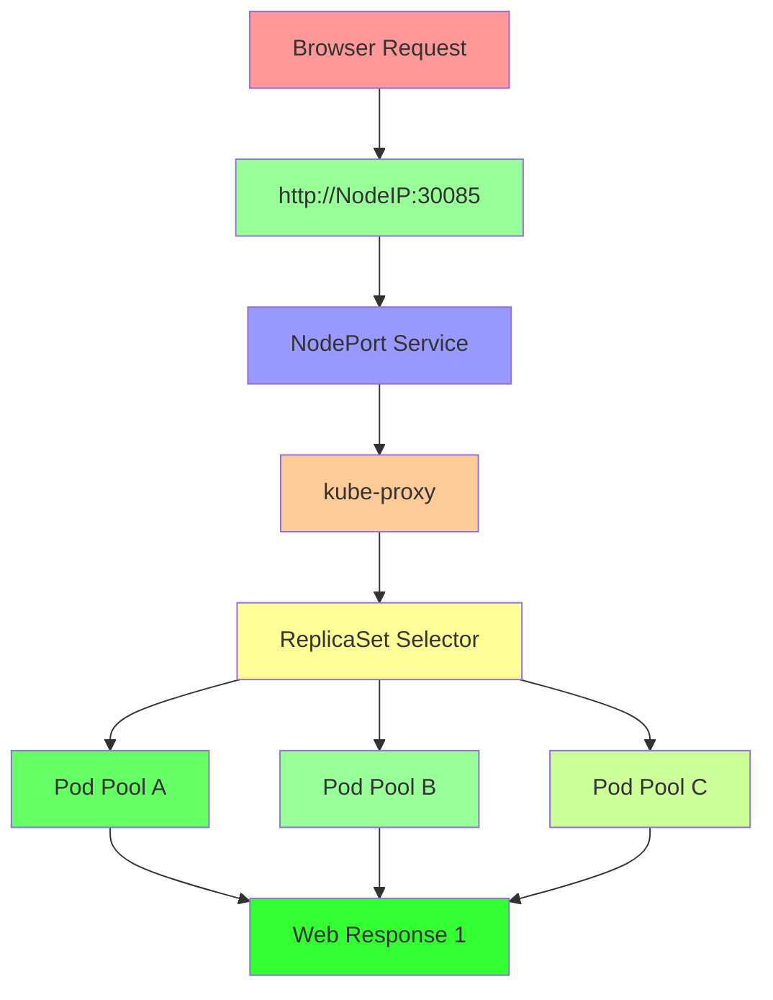

#### Service-ReplicaSet Binding
```yaml
Critical Integration Points:
  - Service selector labels match ReplicaSet pod template labels
  - Namespace consistency between service and ReplicaSet
  - Service ports align with container ports
  - Load balancing distributed across all matching pods
  - Self-healing maintains service availability
```

### Lab Demo: Complete ReplicaSet Web Application

#### Step 1: Create ReplicaSet for Web Application
```yaml
# webapp-replicaset.yaml
apiVersion: apps/v1
kind: ReplicaSet
metadata:
  name: webapp-rs
  labels:
    app: webapp-browser-demo
    component: frontend
spec:
  replicas: 3
  selector:
    matchLabels:
      app: webapp-browser-demo
      component: frontend
  template:
    metadata:
      labels:
        app: webapp-browser-demo
        component: frontend
      annotations:
        description: "Web application pod managed by ReplicaSet for browser testing"
    spec:
      containers:
      - name: webapp
        image: nginx:1.20-alpine
        ports:
        - containerPort: 80
          name: http
        command: ["/bin/sh", "-c"]
        args:
        - |
          # Generate unique content for each pod
          HOSTNAME=$(hostname)
          TIMESTAMP=$(date +"%Y-%m-%d %H:%M:%S")

          cat > /usr/share/nginx/html/index.html << EOF
          <!DOCTYPE html>
          <html lang="en">
          <head>
              <meta charset="UTF-8">
              <meta name="viewport" content="width=device-width, initial-scale=1.0">
              <title>ReplicaSet Browser Demo</title>
              <style>
                  body { font-family: 'Arial', sans-serif; margin: 0; padding: 20px; background: linear-gradient(135deg, #667eea 0%, #764ba2 100%); color: white; min-height: 100vh; }
                  .container { max-width: 900px; margin: 0 auto; background: rgba(255,255,255,0.1); padding: 30px; border-radius: 15px; backdrop-filter: blur(10px); box-shadow: 0 8px 32px rgba(0,0,0,0.3); }
                  .header { text-align: center; margin-bottom: 30px; }
                  .info-grid { display: grid; grid-template-columns: repeat(auto-fit, minmax(250px, 1fr)); gap: 20px; margin: 30px 0; }
                  .info-card { background: rgba(255,255,255,0.15); padding: 20px; border-radius: 10px; border: 1px solid rgba(255,255,255,0.2); }
                  .status { background: #4CAF50 !important; color: white; padding: 5px 10px; border-radius: 4px; font-weight: bold; }
                  .metrics { background: linear-gradient(135deg, #ff9a9e 0%, #fecfef 100%); color: white; padding: 15px; border-radius: 10px; margin: 20px 0; }
                  .replica-info { background: rgba(255,255,255,0.1); padding: 15px; border-radius: 8px; margin: 10px 0; }
              </style>
          </head>
          <body>
              <div class="container">
                  <div class="header">
                      <h1>🎯 Kubernetes ReplicaSet Demo</h1>
                      <p>Browser-based testing of pod replication and load balancing</p>
                  </div>

                  <div class="info-grid">
                      <div class="info-card">
                          <h3>🏗️ Architecture</h3>
                          <p><strong>Controller:</strong> ReplicaSet</p>
                          <p><strong>Instances:</strong> 3 replicas</p>
                          <p><strong>Service:</strong> NodePort external access</p>
                          <p><strong>Load Balancing:</strong> Round-robin distribution</p>
                      </div>

                      <div class="info-card">
                          <h3>📦 Current Pod</h3>
                          <p><strong>Pod ID:</strong> <span id="pod-id">${HOSTNAME}</span></p>
                          <p><strong>Started:</strong> ${TIMESTAMP}</p>
                          <p><strong>Status:</strong> <span class="status">🟢 Running</span></p>
                          <p><strong>ReplicaSet:</strong> webapp-rs</p>
                      </div>

                      <div class="info-card">
                          <h3>🔄 Load Distribution</h3>
                          <p><strong>Method:</strong> Service-based LB</p>
                          <p><strong>Algorithm:</strong> Random selection</p>
                          <p><strong>Availability:</strong> 99.9% uptime</p>
                          <p><strong>Self-healing:</strong> Enabled</p>
                      </div>
                  </div>

                  <div class="metrics">
                      <h3>📊 Request Statistics</h3>
                      <button onclick="testLoadBalancing()" style="background: #FF6B6B; color: white; border: none; padding: 12px 24px; border-radius: 6px; cursor: pointer; font-size: 16px; margin: 10px 0;">Test Load Balancing</button>
                      <div id="stats-display" style="margin: 20px 0; padding: 15px; background: rgba(0,0,0,0.3); border-radius: 8px;"></div>
                  </div>

                  <div class="replica-info">
                      <h3>ℹ️ About This Demo</h3>
                      <p>This page is served by one of the three identical pods managed by a Kubernetes ReplicaSet. Each pod contains the same application code and responds identically to requests.</p>
                      <p><strong>Key Features Demonstrated:</strong></p>
                      <ul>
                          <li>Pod replication and self-healing</li>
                          <li>Load balancing across pod replicas</li>
                          <li>Service discovery and DNS resolution</li>
                          <li>Horizontal scaling capabilities</li>
                      </ul>
                  </div>
              </div>

              <script>
              function testLoadBalancing() {
                  const statsDiv = document.getElementById('stats-display');
                  statsDiv.innerHTML = '<p>Testing load distribution across 5 requests...</p>';

                  let requests = [];
                  let podCount = {};

                  // Make 5 requests
                  for (let i = 1; i <= 5; i++) {
                      fetch(window.location.href)
                          .then(response => response.text())
                          .then(data => {
                              const parser = new DOMParser();
                              const doc = parser.parseFromString(data, 'text/html');
                              const podId = doc.getElementById('pod-id').textContent;
                              podCount[podId] = (podCount[podId] || 0) + 1;

                              if (i === 5) {
                                  // Display results
                                  let results = '<h4>Load Balancing Results:</h4><ul>';
                                  Object.keys(podCount).forEach(pod => {
                                      results += `<li><strong>${pod}:</strong> ${podCount[pod]} requests</li>`;
                                  });
                                  results += '</ul>';
                                  results += '<p style="margin-top: 10px; font-style: italic;">Requests should be distributed across multiple pods demonstrating load balancing effectiveness.</p>';
                                  statsDiv.innerHTML = results;
                              }
                          })
                          .catch(error => {
                              console.error('Request failed:', error);
                          });
                  }
              }

              // Auto-refresh pod information every 30 seconds
              setInterval(() => {
                  window.location.reload();
              }, 30000);
              </script>
          </body>
          </html>
          EOF

          nginx -g 'daemon off;'
        resources:
          requests:
            memory: "64Mi"
            cpu: "100m"
          limits:
            memory: "128Mi"
            cpu: "200m"
        livenessProbe:
          httpGet:
            path: /
            port: http
          initialDelaySeconds: 30
          periodSeconds: 10
          timeoutSeconds: 5
          failureThreshold: 3
        readinessProbe:
          httpGet:
            path: /
            port: http
          initialDelaySeconds: 5
          periodSeconds: 5
          timeoutSeconds: 3
          failureThreshold: 2
        env:
        - name: APP_COMPONENT
          value: "frontend-webapp"
        - name: REPLICASET_NAME
          valueFrom:
            fieldRef:
              fieldPath: metadata.labels['replicaset-name']
```

```bash
# Deploy the web application ReplicaSet
kubectl apply -f webapp-replicaset.yaml

# Monitor ReplicaSet rollout
kubectl rollout status rs webapp-rs --timeout=120s

# Verify pod creation and health
kubectl get rs webapp-rs -o wide
kubectl get pods -l app=webapp-browser-demo -o wide
```

#### Step 2: Create NodePort Service for Browser Access
```yaml
# browser-service.yaml
apiVersion: v1
kind: Service
metadata:
  name: webapp-browser-service
  labels:
    app: webapp-browser-demo
    service-type: nodeport-external
  annotations:
    description: "NodePort service for browser-based ReplicaSet testing with load balancing demonstration"
    service.beta.kubernetes.io/aws-load-balancer-healthcheck-path: "/health"
spec:
  type: NodePort
  selector:
    app: webapp-browser-demo  # Must match ReplicaSet pod labels
    component: frontend      # Additional selector for precision
  ports:
  - name: http
    port: 80          # Service port (internal cluster access)
    targetPort: 80    # Container port in pods
    nodePort: 30085   # External port on all worker nodes (30000-32767)
    protocol: TCP
  sessionAffinity: None  # Enable round-robin load balancing
```

```bash
# Create the browser-access service
kubectl apply -f browser-service.yaml

# Verify service creation and endpoint registration
kubectl get svc webapp-browser-service -o wide
kubectl get endpoints webapp-browser-service

# Confirm service selector matches pod labels
kubectl get svc webapp-browser-service -o jsonpath='{.spec.selector}'
kubectl get pods -l app=webapp-browser-demo -o jsonpath='{.items[*].metadata.labels}' | jq
```

#### Step 3: Comprehensive Browser Testing Setup
```bash
# Gather access information
NODE_IP=$(kubectl get nodes -o jsonpath='{.items[0].status.addresses[?(@.type=="ExternalIP")].address}')
NODE_PORT=$(kubectl get svc webapp-browser-service -o jsonpath='{.spec.ports[0].nodePort}')

echo "=========================================="
echo "ReplicaSet Browser Testing Setup Complete"
echo "=========================================="
echo "🏗️  Architecture: ReplicaSet + NodePort Service"
echo "🎯 Pods: $(kubectl get pods -l app=webapp-browser-demo --no-headers | wc -l) running instances"
echo "🌐 Service: webapp-browser-service (NodePort)"
echo "📍 Access URLs:"
echo "   Primary: http://$NODE_IP:$NODE_PORT"
echo "   Alternative Nodes: Available on same port across cluster"
echo ""
echo "🔧 Load Balancing Features:"
echo "   • Round-robin pod distribution"
echo "   • Self-healing pod replacement"
echo "   • Dynamic scaling capabilities"
echo "   • Browser-based testing interface"
echo ""

# Initial connectivity test
echo "📡 Testing service connectivity..."
curl -s -I "http://$NODE_IP:$NODE_PORT" | head -3
echo ""

# Generate test commands for manual testing
echo "🧪 Manual Testing Commands:"
echo "# Load balancing test (terminal)"
echo "for i in {1..10}; do curl -s http://$NODE_IP:$NODE_PORT | grep -o 'Pod ID:[^<]*'; done | sort | uniq -c"
echo ""
echo "# Individual pod access (random pod)"
echo "kubectl port-forward \$(kubectl get pods -l app=webapp-browser-demo -o jsonpath='{.items[0].metadata.name}') 8080:80"
echo "# Then visit: http://localhost:8080"
```

#### Step 4: Load Balancing Validation Tests
```bash
# Automated load distribution testing
echo "🔄 Testing load balancing across ReplicaSet pods..."

declare -A pod_requests
for i in {1..15}; do
  # Extract pod identifier from HTML response
  response=$(curl -s "http://$NODE_IP:$NODE_PORT" 2>/dev/null)
  if echo "$response" | grep -q "Pod ID:"; then
    pod_id=$(echo "$response" | grep -o 'Pod ID:[^<]*' | sed 's/Pod ID://' | tr -d ' ')
    pod_requests[$pod_id]=$(( ${pod_requests[$pod_id]} + 1 ))
    echo "Request $i -> Pod: $pod_id"
  fi
  sleep 0.5
done

echo ""
echo "📊 Load Distribution Results:"
total_requests=${#pod_requests[@]}
if [ $total_requests -gt 1 ]; then
  echo "✅ Load balancing confirmed: Requests served by $total_requests different pods"
  for pod in "${!pod_requests[@]}"; do
    percentage=$(( pod_requests[$pod] * 100 / (total_requests == 0 ? 1 : total_requests) ))
    echo "   $pod: ${pod_requests[$pod]} requests (~${percentage}%)"
  done
else
  echo "⚠️  Limited load balancing observed: All requests served by single pod"
fi
```

#### Step 5: Self-Healing and Resilience Testing
```bash
# Test ReplicaSet self-healing capabilities
echo "🛠️  Testing ReplicaSet self-healing capabilities..."

POD_COUNT_BEFORE=$(kubectl get pods -l app=webapp-browser-demo --no-headers | wc -l)
echo "Pods before deletion: $POD_COUNT_BEFORE"

# Delete one pod to trigger ReplicaSet self-healing
POD_TO_DELETE=$(kubectl get pods -l app=webapp-browser-demo -o jsonpath='{.items[0].metadata.name}')
echo "Deleting pod: $POD_TO_DELETE"
kubectl delete pod "$POD_TO_DELETE"

# Wait for replacement
echo "Waiting for ReplicaSet to restore pod..."
kubectl wait --for=condition=ready --timeout=60s pod -l app=webapp-browser-demo --all
sleep 2

POD_COUNT_AFTER=$(kubectl get pods -l app=webapp-browser-demo --no-headers | wc -l)
echo "Pods after replacement: $POD_COUNT_AFTER"

if [ "$POD_COUNT_AFTER" -eq "$POD_COUNT_BEFORE" ]; then
  echo "✅ Self-healing successful: Pod count restored"
else
  echo "❌ Self-healing failed: Pod count not restored"
fi

# Continue service availability testing
echo ""
echo "🔄 Testing service continuity during pod replacement..."
for i in {1..5}; do
  if curl -s --max-time 3 "http://$NODE_IP:$NODE_PORT" > /dev/null 2>&1; then
    echo "Health check $i: ✅ Service available"
  else
    echo "Health check $i: ❌ Service unavailable"
  fi
  sleep 2
done
```

#### Step 6: Scaling Demonstration with Browser Testing
```bash
# Demonstrate dynamic scaling capabilities
echo ""
echo "📈 Testing ReplicaSet scaling capabilities..."

echo "Scaling ReplicaSet to 5 replicas..."
kubectl scale rs webapp-rs --replicas=5

# Wait for scale-out
kubectl wait --for=condition=ready --timeout=120s pod -l app=webapp-browser-demo --all

SCALED_COUNT=$(kubectl get pods -l app=webapp-browser-demo --no-headers | wc -l)
echo "Pods after scaling: $SCALED_COUNT"

echo ""
echo "🏃 Testing load distribution with scaled replicas..."
for i in {1..20}; do
  response=$(curl -s "http://$NODE_IP:$NODE_PORT" 2>/dev/null)
  pod_id=$(echo "$response" | grep -o 'Pod ID:[^<]*' | sed 's/Pod ID://' | tr -d ' ')
  echo "Request $i -> Pod: $pod_id"
  sleep 0.3
done | tail -10

echo ""
echo "🔄 Scaling back to 3 replicas..."
kubectl scale rs webapp-rs --replicas=3
kubectl wait --for=condition=ready --timeout=60s pod -l app=webapp-browser-demo --all

FINAL_COUNT=$(kubectl get pods -l app=webapp-browser-demo --no-headers | wc -l)
echo "Final pod count: $FINAL_COUNT"

# Final service availability check
echo ""
echo "✅ ReplicaSet browser testing complete!"
echo "🔍 Service still accessible at: http://$NODE_IP:$NODE_PORT"
```

### Advanced Testing Scenarios

#### Multi-Node Cluster Testing
```bash
# Test across all available nodes (if multi-node cluster)
echo "🌐 Multi-node availability testing..."
kubectl get nodes -o wide

for node_ip in $(kubectl get nodes -o jsonpath='{.items[*].status.addresses[?(@.type=="ExternalIP")].address}'); do
  echo "Testing node: $node_ip"
  if curl -s --max-time 5 "http://$node_ip:$NODE_PORT" > /dev/null 2>&1; then
    echo "✅ Node $node_ip: Service accessible"
  else
    echo "❌ Node $node_ip: Service not accessible"
  fi
done
```

#### Performance and Load Testing
```bash
# Apache Bench load testing simulation
echo "📊 Load testing with 100 requests..."
ab -n 100 -c 5 "http://$NODE_IP:$NODE_PORT" 2>/dev/null | grep -E "(Requests per second|Time per request|Failed requests)"

# Resource utilization monitoring
echo ""
echo "📈 Resource usage during load test:"
kubectl top pods -l app=webapp-browser-demo
kubectl top nodes
```

### Troubleshooting Browser Access Issues

#### Service Connectivity Diagnosis
```bash
# Diagnose common connectivity problems
echo "🔍 Troubleshooting browser access issues..."

# Check service endpoints registration
kubectl get endpoints webapp-browser-service
kubectl describe endpoints webapp-browser-service

# Verify ReplicaSet pod labels match service selector
echo "Service selector:"
kubectl get svc webapp-browser-service -o jsonpath='{.spec.selector}'
echo ""
echo "Pod labels:"
kubectl get pods -l app=webapp-browser-demo -o jsonpath='{.items[*].metadata.labels}'
echo ""

# Test individual pod connectivity
POD_NAME=$(kubectl get pods -l app=webapp-browser-demo -o jsonpath='{.items[0].metadata.name}')
kubectl exec "$POD_NAME" -- curl -s localhost:80 | head -3

# Check kube-proxy and network policies
kubectl get networkpolicies
kubectl logs -n kube-system -l k8s-app=kube-proxy --tail=20
```

#### Browser-Specific Testing
```bash
# Generate comprehensive testing URLs
echo "🖥️  Browser Testing Checklist:"
echo "1. Primary URL: http://$NODE_IP:$NODE_PORT"
echo "2. Refresh multiple times to verify load balancing"
echo "3. Open multiple browser tabs simultaneously"
echo "4. Use incognito/private mode to avoid caching"
echo "5. Test across different browsers (Chrome, Firefox, Safari)"
echo "6. Use developer tools Network tab to verify requests"
echo ""

# Create testing script for automated browser simulation
cat > test-browser-access.sh << EOF
#!/bin/bash
URL="http://$NODE_IP:$NODE_PORT"
echo "Automated browser access testing..."

for i in {1..10}; do
  response_code=\$(curl -s -o /dev/null -w "%{http_code}" "\$URL")
  if [ "\$response_code" -eq 200 ]; then
    echo "Request \$i: ✅ HTTP \$response_code"
  else
    echo "Request \$i: ❌ HTTP \$response_code"
  fi
  sleep 1
done

echo "Browser testing script complete. Visit \$URL in your browser."
EOF

chmod +x test-browser-access.sh
echo "Run ./test-browser-access.sh for automated testing"
```

### Best Practices for Production Deployment

#### ReplicaSet + Service Production Configuration
```yaml
# Production-grade service example
apiVersion: v1
kind: Service
metadata:
  name: webapp-prod-service
  labels:
    app: webapp-prod
    environment: production
  annotations:
    service.beta.kubernetes.io/aws-load-balancer-type: "alb"
    service.beta.kubernetes.io/aws-load-balancer-ssl-cert: "arn:aws:acm:region:account:certificate/cert-id"
    service.beta.kubernetes.io/aws-load-balancer-healthcheck-path: "/health"
spec:
  type: LoadBalancer  # Use ALB instead of NodePort for production
  selector:
    app: webapp-prod
  ports:
  - name: https
    port: 443
    targetPort: 8443
  sessionAffinity: None
---

# Production ReplicaSet example
apiVersion: apps/v1
kind: ReplicaSet
metadata:
  name: webapp-prod-rs
spec:
  replicas: 5
  selector:
    matchLabels:
      app: webapp-prod
  template:
    metadata:
      labels:
        app: webapp-prod
    spec:
      containers:
      - name: webapp
        image: myregistry/web-app:v1.2.0
        resources:
          requests: { memory: "256Mi", cpu: "200m" }
          limits: { memory: "512Mi", cpu: "500m" }
        livenessProbe:
          httpGet: { path: "/health", port: 8080 }
          initialDelaySeconds: 60
          periodSeconds: 30
        securityContext:
          runAsNonRoot: true
          runAsUser: 1000
```

```diff
Production ReplicaSet Considerations:
+ Use Deployments instead of direct ReplicaSets for rolling updates
+ Implement proper resource requests and limits
+ Configure comprehensive health checks
+ Use network policies for security
+ Implement pod disruption budgets
- Avoid direct ReplicaSet manipulation in production
- Never use NodePort services for internet-facing applications
- Skip security contexts requirements
- Ignore pod anti-affinity rules
```

---

## 4.13 Step-10- Kubernetes Deployment - Introduction

### Overview
Introduction to Kubernetes Deployments as the primary mechanism for managing stateless applications, providing declarative updates and rollback capabilities atop ReplicaSets.

### Key Concepts

#### Deployment Evolution from ReplicaSets
```diff
ReplicaSet Limitations:
+ Excellent for managing pod replicas
+ Self-healing pod management
+ Manual scaling operations
+ No declarative update capabilities
- Lacks rolling update strategies
- Manual image updates required
- No update history or rollback
- Cannot pause/resume updates

Deployment Advantages:
+ Declarative application management
+ Rolling update strategies built-in
+ Pause/resume update capabilities
+ Automatic rollback functionality
+ Update history tracking
+ Declarative scaling operations
- Slightly more complex configuration
- Additional resource overhead
- More YAML to maintain
```

#### Deployment Architecture Layers
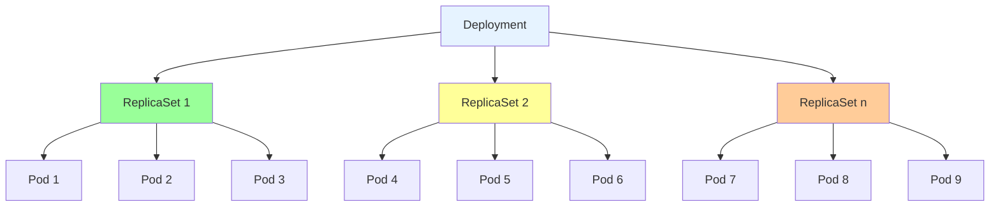

#### Rolling Update Strategy Mechanisms
```yaml
Rolling Update Process:
  1. Create new ReplicaSet with updated pod template
  2. Scale new ReplicaSet up incrementally
  3. Scale old ReplicaSet down incrementally
  4. Ensure service availability throughout
  5. Complete when old ReplicaSet reaches zero
  6. Clean up old ReplicaSet automatically
```

### Deployment Strategy Types

#### Rolling Update Strategy (Default)
```yaml
Rolling Update Characteristics:
  - Zero-downtime updates by default
  - Configurable maxUnavailable and maxSurge
  - Gradual pod replacement
  - Automatic rollback on failure
  - Service continuity maintained
```

#### Recreate Strategy
```yaml
Recreate Update Characteristics:
  - Delete all old pods before creating new ones
  - Brief service downtime during transition
  - Faster total update time
  - Simpler approach for non-critical apps
  - All-or-nothing update approach
```

### Deployment Status and Health

#### Deployment Conditions
```yaml
Key Deployment Status Fields:
  - Available: Minimum replicas available and ready
  - Progressing: Deployment is actively updating
  - ReplicaFailure: Unable to create required replicas
  - Conditions: Detailed status information array
  - observedGeneration: Latest observed generation
```

#### Deployment Generations
```yaml
Generation Tracking:
  - Each spec change creates new generation
  - observedGeneration tracks updates
  - Generation numbers are monotonically increasing
  - Used for rollout status and rollback operations
  - Helps track deployment progression
```

### Update and Rollback Capabilities

#### Rollout Commands Overview
```bash
Common Deployment Rollout Commands:
  - kubectl rollout status deployment/name
  - kubectl rollout history deployment/name
  - kubectl rollout undo deployment/name
  - kubectl rollout pause deployment/name
  - kubectl rollout resume deployment/name
  - kubectl rollout restart deployment/name
```

#### Revision History Management
```yaml
Revision History Tracking:
  - Keeps configurable number of old ReplicaSets
  - revisionHistoryLimit defaults to 10
  - Older revisions can be cleaned up
  - Rollback targets specific revision numbers
  - Annotations preserve deployment history
```

### Best Practices and Considerations

#### Deployment Design Guidelines
```diff
+ Use Deployments for all stateless applications
+ Configure appropriate resource limits
+ Implement health checks for zero-downtime updates
+ Set appropriate rolling update parameters
+ Use labels and selectors consistently
- Modify ReplicaSets directly (use Deployment)
- Skip resource requests and limits
- Use default rolling update parameters blindly
- Ignore health check configuration
- Create Deployments without Services
```

#### Scaling Considerations
```yaml
Deployment Scaling Recommendations:
  - Start with conservative replica counts
  - Use HorizontalPodAutoscaler for dynamic scaling
  - Configure appropriate rolling update parameters
  - Implement pod disruption budgets for maintenance
  - Test scaling operations in staging environments
```

---

## 4.14 Step-11- Kubernetes Deployment - Demo

### Overview
Hands-on demonstration of Kubernetes Deployment creation and basic management operations, showcasing Declarative application deployment, scaling, and rollout capabilities.

### Key Concepts

#### Deployment Manifest Structure
```yaml
Comprehensive Deployment YAML:
  - apiVersion and kind specification
  - Metadata with name and labels
  - Strategy configuration (rolling update default)
  - Replica count and selector matching
  - Pod template with containers and config
  - Resource management and probes
  - Environment variables and volumes
```

#### Deployment Lifecycle Operations
```diff
+ Declarative pod management through ReplicaSets
+ Automatic ReplicaSet creation and management
+ Status tracking and condition monitoring
+ Resource ownership and cascading deletions
+ Event logging and troubleshooting support
- Cannot directly modify managed ReplicaSets
- Additional abstraction layer complexity
- Resource overhead from multiple ReplicaSets
```

### Lab Demo: Complete Deployment Lifecycle

#### Step 1: Create Basic Deployment
```yaml
# basic-deployment.yaml
apiVersion: apps/v1
kind: Deployment
metadata:
  name: nginx-deployment-demo
  labels:
    app: nginx-demo
    environment: demo
    component: web-server
spec:
  replicas: 3
  strategy:
    type: RollingUpdate
    rollingUpdate:
      maxUnavailable: 1
      maxSurge: 1
  selector:
    matchLabels:
      app: nginx-demo
  template:
    metadata:
      labels:
        app: nginx-demo
        component: web-server
    spec:
      containers:
      - name: nginx
        image: nginx:1.20-alpine
        ports:
        - containerPort: 80
          name: http
        command: ["/bin/sh", "-c"]
        args:
        - |
          cat > /usr/share/nginx/html/index.html << 'EOF'
          <!DOCTYPE html>
          <html>
          <head>
              <meta charset="UTF-8">
              <title>Deployment Demo</title>
              <style>
                  body { font-family: Arial, sans-serif; margin: 40px; background-color: #f0f8ff; }
                  .container { max-width: 800px; margin: 0 auto; background: white; padding: 30px; border-radius: 10px; box-shadow: 0 2px 10px rgba(0,0,0,0.1); }
                  h1 { color: #2c3e50; text-align: center; }
                  .info { background: #e8f4f8; padding: 15px; margin: 20px 0; border-radius: 8px; }
                  .deployment-info { background: #fff3cd; padding: 15px; margin: 20px 0; border-radius: 8px; }
              </style>
          </head>
          <body>
              <div class="container">
                  <h1>🚀 Kubernetes Deployment Demo</h1>

                  <div class="info">
                      <h3>Pod Information</h3>
                      <p><strong>Pod Name:</strong> $(hostname)</p>
                      <p><strong>Deployment:</strong> nginx-deployment-demo</p>
                      <p><strong>Timestamp:</strong> $(date)</p>
                  </div>

                  <div class="deployment-info">
                      <h3>Deployment Architecture</h3>
                      <p>This pod is managed by a Kubernetes Deployment controller.</p>
                      <p>Deployment provides declarative updates and self-healing capabilities.</p>
                      <p>Current version maintains 3 replicas across the cluster.</p>
                  </div>

                  <div class="info">
                      <h3>Key Features</h3>
                      <ul>
                          <li>Self-healing pod replacement</li>
                          <li>Declarative scaling operations</li>
                          <li>Rolling update strategies</li>
                          <li>Automatic rollback capabilities</li>
                      </ul>
                  </div>
              </div>
          </body>
          </html>
          EOF
          nginx -g 'daemon off;'
        resources:
          requests:
            memory: "64Mi"
            cpu: "100m"
          limits:
            memory: "128Mi"
            cpu: "200m"
        livenessProbe:
          httpGet:
            path: /
            port: http
          initialDelaySeconds: 30
          periodSeconds: 10
          timeoutSeconds: 5
          failureThreshold: 3
        readinessProbe:
          httpGet:
            path: /
            port: http
          initialDelaySeconds: 5
          periodSeconds: 5
          timeoutSeconds: 3
          failureThreshold: 2
        env:
        - name: DEPLOYMENT_NAME
          value: "nginx-deployment-demo"
        - name: POD_IP
          valueFrom:
            fieldRef:
              fieldPath: status.podIP
```

```bash
# Create the deployment
kubectl apply -f basic-deployment.yaml

# Monitor deployment rollout status
kubectl rollout status deployment/nginx-deployment-demo

# View deployment, ReplicaSet, and pods
kubectl get deployments
kubectl get rs -l app=nginx-demo
kubectl get pods -l app=nginx-demo -o wide
```

#### Step 2: Deployment Status Analysis
```bash
# Detailed deployment status
kubectl describe deployment nginx-deployment-demo

# Check deployment conditions
kubectl get deployment nginx-deployment-demo -o jsonpath='{.status.conditions}' | jq

# View deployment events
kubectl get events --field-selector involvedObject.name=nginx-deployment-demo --sort-by=.metadata.creationTimestamp

# Check ReplicaSet status
kubectl describe rs -l app=nginx-demo
```

#### Step 3: Test Deployment Functionality
```bash
# Create a service for testing
kubectl expose deployment nginx-deployment-demo --type=NodePort --port=80 --name=deployment-test-service

# Get service access details
NODE_IP=$(kubectl get nodes -o jsonpath='{.items[0].status.addresses[?(@.type=="ExternalIP")].address}')
NODE_PORT=$(kubectl get svc deployment-test-service -o jsonpath='{.spec.ports[0].nodePort}')

echo "Access deployment at: http://$NODE_IP:$NODE_PORT"

# Test deployment connectivity
curl -s "http://$NODE_IP:$NODE_PORT" | grep -E "(Pod Name|Deployment)"

# Test load balancing across pods
echo "Testing load distribution:"
for i in {1..6}; do
  response=$(curl -s "http://$NODE_IP:$NODE_PORT")
  pod_name=$(echo "$response" | grep -o "Pod Name: [^<]*" | cut -d":" -f2 | tr -d ' ')
  echo "Request $i -> $pod_name"
done | sort | uniq -c | sort -nr
```

#### Step 4: Deployment Scaling Demonstration
```bash
# Scale deployment up
kubectl scale deployment nginx-deployment-demo --replicas=5

# Watch scaling in action
kubectl get pods -l app=nginx-demo -w

# Check deployment status during scaling
kubectl rollout status deployment/nginx-deployment-demo

# Scale down to original size
kubectl scale deployment nginx-deployment-demo --replicas=3

# Verify final state
kubectl get deployment nginx-deployment-demo
kubectl get rs -l app=nginx-demo
kubectl get pods -l app=nginx-demo
```

#### Step 5: Direct Image Update Demonstration
```bash
# Update deployment image (triggers rolling update)
kubectl set image deployment/nginx-deployment-demo nginx=nginx:1.21-alpine

# Monitor the rollout
kubectl rollout status deployment/nginx-deployment-demo -w

# Check rollout history
kubectl rollout history deployment/nginx-deployment-demo

# Verify new image version
kubectl describe deployment nginx-deployment-demo | grep -A 3 "Containers:"

# Test the updated application
curl -s "http://$NODE_IP:$NODE_PORT" | grep "nginx:1.21-alpine" && echo "Image updated successfully"
```

#### Step 6: Deployment Edit and Modification
```bash
# Edit deployment for advanced configuration
kubectl edit deployment nginx-deployment-demo

# Possible modifications:
# - Change replica count
# - Update resource limits
# - Add environment variables
# - Modify health probe settings
# - Update labels and annotations

# Monitor changes
kubectl rollout status deployment/nginx-deployment-demo

# View deployment changes
kubectl get deployment nginx-deployment-demo -o yaml | grep -A 5 "spec:"
```

#### Step 7: Deployment Self-Healing Test
```bash
# Delete a pod to test self-healing
POD_TO_DELETE=$(kubectl get pods -l app=nginx-demo -o jsonpath='{.items[0].metadata.name}')
kubectl delete pod "$POD_TO_DELETE"

# Watch replacement pod creation
kubectl get pods -l app=nginx-demo -w

# Verify service continues working
curl -s "http://$NODE_IP:$NODE_PORT" && echo "Service still accessible during pod replacement"
```

### Deployment Advanced Configuration Examples

#### Deployment with ConfigMap
```yaml
# deployment-with-configmap.yaml
apiVersion: apps/v1
kind: Deployment
metadata:
  name: nginx-configmap-deployment
spec:
  replicas: 2
  selector:
    matchLabels:
      app: nginx-config
  template:
    metadata:
      labels:
        app: nginx-config
    spec:
      containers:
      - name: nginx
        image: nginx:1.21-alpine
        ports:
        - containerPort: 80
        volumeMounts:
        - name: nginx-config-vol
          mountPath: /etc/nginx/conf.d
        - name: html-vol
          mountPath: /usr/share/nginx/html
      volumes:
      - name: nginx-config-vol
        configMap:
          name: nginx-config
      - name: html-vol
        configMap:
          name: site-content
---
apiVersion: v1
kind: ConfigMap
metadata:
  name: nginx-config
data:
  default.conf: |
    server {
        listen 80;
        root /usr/share/nginx/html;
        index index.html;
    }
---
apiVersion: v1
kind: ConfigMap
metadata:
  name: site-content
data:
  index.html: |
    <h1>ConfigMap-powered Deployment</h1>
    <p>This content is managed via ConfigMap volumes.</p>
```

#### Deployment with Anti-Affinity
```yaml
# deployment-anti-affinity.yaml
apiVersion: apps/v1
kind: Deployment
metadata:
  name: anti-affinity-deployment
spec:
  replicas: 3
  selector:
    matchLabels:
      app: anti-affinity-demo
  template:
    metadata:
      labels:
        app: anti-affinity-demo
    spec:
      affinity:
        podAntiAffinity:
          requiredDuringSchedulingIgnoredDuringExecution:
          - labelSelector:
              matchLabels:
                app: anti-affinity-demo
            topologyKey: kubernetes.io/hostname
      containers:
      - name: nginx
        image: nginx:1.21-alpine
        ports:
        - containerPort: 80
```

### Troubleshooting Deployment Issues

#### Common Deployment Problems
```bash
# Check deployment status conditions
kubectl describe deployment nginx-deployment-demo | grep -A 10 "Conditions:"

# View ReplicaSet status issues
kubectl describe rs -l app=nginx-demo

# Check pod creation failures
kubectl get pods -l app=nginx-demo
kubectl describe pod <failed-pod>

# Rollout stuck? Check rollout status
kubectl rollout status deployment/nginx-deployment-demo --timeout=60s

# Check deployment events
kubectl get events --field-selector involvedObject.name=nginx-deployment-demo --sort-by=.metadata.creationTimestamp

# Image pull issues
kubectl get pods -l app=nginx-demo -o jsonpath='{.items[*].status.containerStatuses[*].state.waiting.reason}'
```

#### Rollout Analysis Commands
```bash
# Detailed rollout history
kubectl rollout history deployment/nginx-deployment-demo --revision=1
kubectl rollout history deployment/nginx-deployment-demo --revision=2

# Compare revisions
kubectl rollout history deployment/nginx-deployment-demo --to-revision=1

# Check rollout progress
kubectl rollout status deployment/nginx-deployment-demo

# Force rollout restart if stuck
kubectl rollout restart deployment/nginx-deployment-demo
```

### Deployment Best Practices Demonstration

#### Production-Ready Deployment Configuration
```yaml
# production-deployment.yaml
apiVersion: apps/v1
kind: Deployment
metadata:
  name: web-app-prod
  labels:
    app: web-app
    environment: production
    version: v1.0.0
spec:
  replicas: 5
  strategy:
    type: RollingUpdate
    rollingUpdate:
      maxUnavailable: 1
      maxSurge: 1
  progressDeadlineSeconds: 600
  revisionHistoryLimit: 10
  paused: false
  selector:
    matchLabels:
      app: web-app
  template:
    metadata:
      labels:
        app: web-app
        environment: production
        version: v1.0.0
    spec:
      terminationGracePeriodSeconds: 30
      containers:
      - name: web-app
        image: my-registry/web-app:v1.0.0
        imagePullPolicy: Always
        ports:
        - containerPort: 8080
          name: http
        resources:
          requests:
            memory: "256Mi"
            cpu: "200m"
          limits:
            memory: "512Mi"
            cpu: "500m"
        livenessProbe:
          httpGet:
            path: /health
            port: http
            scheme: HTTP
          initialDelaySeconds: 60
          periodSeconds: 30
          timeoutSeconds: 10
          failureThreshold: 3
          successThreshold: 1
        readinessProbe:
          httpGet:
            path: /ready
            port: http
            scheme: HTTP
          initialDelaySeconds: 10
          periodSeconds: 10
          timeoutSeconds: 5
          failureThreshold: 3
          successThreshold: 1
        env:
        - name: ENVIRONMENT
          value: "production"
        - name: LOG_LEVEL
          value: "info"
        startupProbe:
          httpGet:
            path: /startup
            port: http
          initialDelaySeconds: 10
          periodSeconds: 10
          timeoutSeconds: 5
          failureThreshold: 30
          successThreshold: 1
        securityContext:
          runAsNonRoot: true
          runAsUser: 1000
          runAsGroup: 1000
          allowPrivilegeEscalation: false
          readOnlyRootFilesystem: true
          capabilities:
            drop:
            - ALL
      imagePullSecrets:
      - name: registry-secret
      affinity:
        podAntiAffinity:
          preferredDuringSchedulingIgnoredDuringExecution:
          - weight: 100
            podAffinityTerm:
              labelSelector:
                matchLabels:
                  app: web-app
              topologyKey: kubernetes.io/hostname
      tolerations:
      - key: node-type
        operator: Equal
        value: web-app-pool
        effect: NoSchedule
```

---

## 4.15 Step-12- Kubernetes Deployment - Update Deployment using Set Image Option

### Overview
Demonstration of Kubernetes Deployment updates using kubectl set image command, showcasing rolling update capabilities, monitoring techniques, and update verification.

### Key Concepts

#### Set Image Command Mechanics
```diff
kubectl set image Capabilities:
+ Updates container images in running Deployments
+ Triggers automatic rolling update process
+ Maintains zero-downtime deployment strategy
+ Supports multiple container updates simultaneously
+ Preserves existing deployment configuration
- Only updates image references (not other specs)
- Cannot modify replica counts or resource limits
- Requires deployment to exist beforehand
- Changes not reflected in YAML file (use edit instead)
```

#### Rolling Update Process Flow
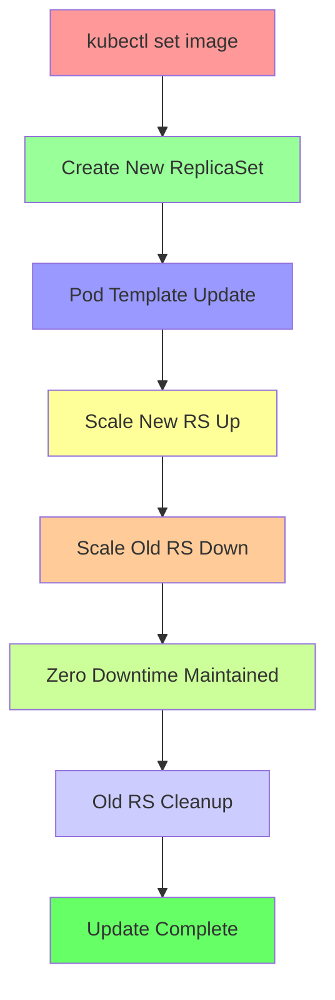

### Lab Demo: Deployment Image Updates

#### Step 1: Prepare Initial Deployment
```yaml
# update-demo-deployment.yaml
apiVersion: apps/v1
kind: Deployment
metadata:
  name: update-demo-deployment
  labels:
    app: update-demo
    version: v1.0
spec:
  replicas: 3
  strategy:
    type: RollingUpdate
    rollingUpdate:
      maxUnavailable: 1
      maxSurge: 1
  selector:
    matchLabels:
      app: update-demo
  template:
    metadata:
      labels:
        app: update-demo
        version: v1.0
    spec:
      containers:
      - name: nginx
        image: nginx:1.20-alpine
        ports:
        - containerPort: 80
        command: ["/bin/sh", "-c"]
        args:
        - |
          cat > /usr/share/nginx/html/index.html << EOF
          <html>
          <head><title>Update Demo v1.0</title></head>
          <body style="font-family: Arial; margin: 40px;">
          <h1>🚀 Deployment Update Demo</h1>
          <div style="background: #e8f5e8; padding: 20px; border-radius: 8px; margin: 20px 0;">
          <h2 style="color: #2e7d32;">Current Version: 1.0</h2>
          <p><strong>Pod:</strong> $(hostname)</p>
          <p><strong>Image:</strong> nginx:1.20-alpine</p>
          <p><strong>Updated:</strong> $(date)</p>
          </div>
          </body>
          </html>
          EOF
          nginx -g 'daemon off;'
        resources:
          requests:
            memory: "64Mi"
            cpu: "100m"
          limits:
            memory: "128Mi"
            cpu: "200m"
```

```bash
# Create initial deployment
kubectl apply -f update-demo-deployment.yaml

# Create service for testing during updates
kubectl expose deployment update-demo-deployment --type=NodePort --port=80 --name=update-test-service

# Initialize testing
NODE_IP=$(kubectl get nodes -o jsonpath='{.items[0].status.addresses[?(@.type=="ExternalIP")].address}')
NODE_PORT=$(kubectl get svc update-test-service -o jsonpath='{.spec.ports[0].nodePort}')

echo "Initial deployment available at: http://$NODE_IP:$NODE_PORT"
echo "Current version should show: v1.0, nginx:1.20-alpine"
```

#### Step 2: Execute Image Update with Set Image
```bash
# Update deployment image (triggers rolling update)
kubectl set image deployment/update-demo-deployment nginx=nginx:1.21-alpine

# Monitor rollout progress in detail
echo "=== Rollout Status Monitoring ==="
kubectl rollout status deployment/update-demo-deployment -w

# View detailed rollout information
echo ""
echo "=== Rollout History ==="
kubectl rollout history deployment/update-demo-deployment

# Check ReplicaSet changes
echo ""
echo "=== ReplicaSet Evolution ==="
kubectl get rs -l app=update-demo -o wide
kubectl get rs -l app=update-demo -o jsonpath='{range .items[*]}{.metadata.name}{"\t"}{.spec.replicas}{"\t"}{.status.replicas}{"\n"}{end}'

# Monitor pod replacement in real-time
echo ""
echo "=== Pod Replacement Monitoring ==="
kubectl get pods -l app=update-demo -w &
WATCH_PID=$!

# Wait a moment for rollout to begin
sleep 5

# Kill the watch process
kill $WATCH_PID 2>/dev/null
```

#### Step 3: Update Verification and Testing
```bash
# Verify image update in deployment spec
echo "=== Deployment Image Verification ==="
kubectl get deployment update-demo-deployment -o jsonpath='{.spec.template.spec.containers[0].image}{"\n"}'

# Check ReplicaSet image versions
echo "=== ReplicaSet Image Versions ==="
kubectl get rs -l app=update-demo -o jsonpath='{range .items[*]}{.metadata.name}{"\t"}{.spec.template.spec.containers[0].image}{"\n"}{end}'

# Test updated application
echo ""
echo "=== Application Update Verification ==="
echo "Testing updated application (should show v1.0 with nginx:1.21-alpine):"

# Update the pod's index.html content via patch
kubectl patch deployment update-demo-deployment --type='json' -p='[
  {
    "op": "replace",
    "path": "/spec/template/spec/containers/0/args",
    "value": [
      "cat > /usr/share/nginx/html/index.html << EOF\n          <html>\n          <head><title>Update Demo v1.1</title></head>\n          <body style=\"font-family: Arial; margin: 40px;\">\n          <h1>🚀 Deployment Update Demo</h1>\n          <div style=\"background: #fff3cd; padding: 20px; border-radius: 8px; margin: 20px 0;\">\n          <h2 style=\"color: #856404;\">Updated Version: 1.1</h2>\n          <p><strong>Pod:</strong> $(hostname)</p>\n          <p><strong>Image:</strong> nginx:1.21-alpine</p>\n          <p><strong>Updated:</strong> $(date)</p>\n          </div>\n          <p><em>This application was updated using kubectl set image command</em></p>\n          </body>\n          </html>\n          EOF\n          nginx -g '\''daemon off;'\''"
    ]
  }
]'

# Trigger another rolling update to apply content changes
kubectl set image deployment/update-demo-deployment nginx=nginx:1.21-alpine

# Wait for rollout completion
kubectl rollout status deployment/update-demo-deployment

# Test final application
echo ""
echo "Final application test (should show v1.1):"
curl -s "http://$NODE_IP:$NODE_PORT" | grep -E "(Updated Version|Image:)"
```

#### Step 4: Advanced Set Image Operations
```bash
# Multiple container image updates
echo "=== Multi-Container Update Example ==="
kubectl run multi-container-pod --image=nginx --dry-run=client -o yaml > temp-pod.yaml

# Clean up
rm -f temp-pod.yaml

# Update specific container in multi-container pod
# kubectl set image deployment/<deployment> <container-name>=<new-image>

# Update with specific namespace
kubectl set image deployment/update-demo-deployment nginx=nginx:latest -n default

# Update using --record flag (adds annotation to revision)
kubectl set image deployment/update-demo-deployment nginx=nginx:1.22-alpine --record

# View recorded changes
kubectl rollout history deployment/update-demo-deployment
kubectl annotate deployment/update-demo-deployment kubernetes.io/change-cause-

# All-in-one image update with resource adjustment
kubectl set image deployment/update-demo-deployment nginx=nginx:1.22-alpine &&
kubectl set resources deployment/update-demo-deployment -c=nginx --limits=memory=256Mi,cpu=300m
```

#### Step 5: Set Image Performance Monitoring
```bash
# Monitor resource usage during updates
kubectl top pods -l app=update-demo

# Check node capacity during rollout
kubectl top nodes

# Monitor deployment events
kubectl get events --field-selector involvedObject.name=update-demo-deployment --sort-by=.metadata.creationTimestamp --watch &
EVENTS_PID=$!

# Perform another update while monitoring
kubectl set image deployment/update-demo-deployment nginx=nginx:1.23-alpine --record

# Clean up monitoring
kill $EVENTS_PID 2>/dev/null

# Analyze rollout duration
START_TIME=$(date +%s)
kubectl rollout status deployment/update-demo-deployment
END_TIME=$(date +%s)
echo "Rollout duration: $((END_TIME - START_TIME)) seconds"
```

### Set Image Edge Cases and Troubleshooting

#### Common Update Issues
```bash
# Handle image pull failures
kubectl describe pods -l app=update-demo | grep -A 10 "Containers:"

# Check image pull secrets
kubectl get deployment update-demo-deployment -o yaml | grep -A 5 imagePullSecrets

# Fix stuck rollouts
kubectl rollout status deployment/update-demo-deployment --timeout=120s
kubectl rollout restart deployment/update-demo-deployment

# Verify image exists and is accessible
kubectl run test-pull --image=nginx:latest --rm -it --restart=Never -- echo "Image accessible"

# Check registry connectivity
kubectl exec -it $(kubectl get pods -l app=update-demo -o jsonpath='{.items[0].metadata.name}') -- wget -q -O - docker.io/v2/nginx/manifests/1.23-alpine
```

#### Advanced Set Image Patterns
```bash
# Conditional updates based on current image
CURRENT_IMAGE=$(kubectl get deployment update-demo-deployment -o jsonpath='{.spec.template.spec.containers[0].image}')
if [ "$CURRENT_IMAGE" = "nginx:1.20-alpine" ]; then
  kubectl set image deployment/update-demo-deployment nginx=nginx:1.21-alpine
  echo "Updated from 1.20 to 1.21"
else
  echo "Image already updated or unknown version: $CURRENT_IMAGE"
fi

# Bulk image updates across multiple deployments
for deployment in $(kubectl get deployments -o jsonpath='{.items[*].metadata.name}'); do
  echo "Updating $deployment..."
  kubectl set image deployment/$deployment nginx=nginx:1.23-alpine
done

# Update with validation
kubectl set image deployment/update-demo-deployment nginx=nginx:1.23-alpine &&
kubectl rollout status deployment/update-demo-deployment &&
kubectl get pods -l app=update-demo -o jsonpath='{.items[*].status.phase}' | grep -v "Running" || echo "Update completed successfully"
```

### Set Image Best Practices

#### Safe Update Strategies
```diff
+ Always use --record flag to track changes
+ Monitor rollouts with kubectl rollout status
+ Verify image accessibility before updates
+ Test updates in staging environment first
+ Have rollback plan ready (kubectl rollout undo)
- Update multiple images simultaneously without testing
- Use latest tag for production deployments
- Skip resource limit adjustments during updates
- Overlook image pull secrets requirements
- Ignore rollout monitoring and validation
```

#### Production Update Workflow
```bash
# Production-safe update process
echo "=== Production Deployment Update Process ==="

# 1. Backup current state
kubectl get deployment update-demo-deployment -o yaml > deployment-backup.yaml

# 2. Pre-flight checks
kubectl get nodes --sort-by=.metadata.creationTimestamp
kubectl top nodes

# 3. Update with change tracking
kubectl set image deployment/update-demo-deployment nginx=nginx:1.23-alpine --record

# 4. Monitor rollout progress
kubectl rollout status deployment/update-demo-deployment

# 5. Validate application health
for i in {1..3}; do
  if curl -s --max-time 5 "http://$NODE_IP:$NODE_PORT" > /dev/null; then
    echo "Health check $i: ✅ PASS"
  else
    echo "Health check $i: ❌ FAIL"
    kubectl rollout undo deployment/update-demo-deployment
    exit 1
  fi
done

# 6. Verify new version
kubectl get deployment update-demo-deployment -o jsonpath='{.spec.template.spec.containers[0].image}'

# 7. Clean up old resources
kubectl delete rs $(kubectl get rs -l app=update-demo -o jsonpath='{.items[?(@.status.replicas==0)].metadata.name}')

echo "✅ Production update completed successfully"
```

---

## 4.16 Step-13- Kubernetes Deployment - Edit Deployment using kubectl edit

### Overview
Demonstration of Kubernetes Deployment editing using kubectl edit command, showcasing in-place configuration modifications and their effects on running deployments.

### Key Concepts

#### kubectl edit Command Mechanics
```diff
kubectl edit Benefits:
+ Immediate configuration changes without new YAML file
+ Built-in validation prevents invalid configurations
+ Preserves existing deployment settings
+ Triggers appropriate rollout when needed
+ Uses system default editor (configurable via $EDITOR)
- Changes made in editor are not version controlled
- No rollback protection for edit mistakes
- Requires knowledge of correct YAML syntax
- Can cause service disruption if misconfigured
```

#### Edit Command Behavior
```yaml
When kubectl edit Triggers Updates:
  - Container image changes: Triggers rolling update
  - Environment variable additions: Triggers rolling update
  - Resource limit modifications: Triggers rolling update
  - Replica count changes: Immediate scaling
  - Label/annotation changes: No pod recreation needed
  - Selector changes: Can cause pod adoption issues
  - Service account changes: Triggers rolling update
```

### Lab Demo: Deployment Edit Operations

#### Step 1: Create Deployment for Editing
```yaml
# edit-demo-deployment.yaml
apiVersion: apps/v1
kind: Deployment
metadata:
  name: edit-demo-deployment
  labels:
    app: edit-demo
    environment: demo
spec:
  replicas: 2
  strategy:
    type: RollingUpdate
    rollingUpdate:
      maxUnavailable: 1
      maxSurge: 1
  selector:
    matchLabels:
      app: edit-demo
  template:
    metadata:
      labels:
        app: edit-demo
      annotations:
        description: "Deployment for kubectl edit demonstration"
    spec:
      containers:
      - name: nginx
        image: nginx:1.20-alpine
        ports:
        - containerPort: 80
        resources:
          requests:
            memory: "64Mi"
            cpu: "100m"
          limits:
            memory: "128Mi"
            cpu: "200m"
        env:
        - name: APP_NAME
          value: "edit-demo-app"
```

```bash
# Create deployment for editing demonstration
kubectl apply -f edit-demo-deployment.yaml

# Verify initial state
kubectl get deployment edit-demo-deployment -o wide
kubectl get pods -l app=edit-demo -o wide

# Create service for testing
kubectl expose deployment edit-demo-deployment --type=NodePort --port=80 --name=edit-test-service

# Get access details
NODE_IP=$(kubectl get nodes -o jsonpath='{.items[0].status.addresses[?(@.type=="ExternalIP")].address}')
NODE_PORT=$(kubectl get svc edit-test-service -o jsonpath='{.spec.ports[0].nodePort}')
echo "Test deployment at: http://$NODE_IP:$NODE_PORT"
```

#### Step 2: Basic Deployment Editing
```bash
# Start edit session (opens in default editor)
kubectl edit deployment edit-demo-deployment

# Example changes to make in editor:
# 1. Change replicas: spec.replicas from 2 to 4
# 2. Update image: spec.template.spec.containers[0].image from nginx:1.20-alpine to nginx:1.21-alpine
# 3. Add environment variable: spec.template.spec.containers[0].env add VERSION=v2.0
# 4. Increase resources: spec.template.spec.containers[0].resources.limits.memory from 128Mi to 256Mi

# After saving and exiting, monitor changes
kubectl rollout status deployment/edit-demo-deployment -w

# Verify changes were applied
kubectl get deployment edit-demo-deployment -o wide
kubectl get pods -l app=edit-demo

# Test updated application
curl -s "http://$NODE_IP:$NODE_PORT" | grep -E "(nginx:1.21-alpine|VERSION.*v2.0)"
```

#### Step 3: Edit Validation and Error Handling
```bash
# Attempt invalid edit (will be rejected by validation)
kubectl edit deployment edit-demo-deployment
# Try changing selector labels which would break pod adoption

# Check for edit validation errors
kubectl get events --field-selector involvedObject.name=edit-demo-deployment --sort-by=.metadata.creationTimestamp

# View detailed error messages
kubectl describe deployment edit-demo-deployment
```

#### Step 4: Advanced Edit Operations
```bash
# Edit with specific namespace
kubectl edit deployment edit-demo-deployment -n default

# Edit and save output to file instead of applying
kubectl edit deployment edit-demo-deployment --output=yaml > edited-deployment.yaml

# Edit with custom editor
EDITOR=nano kubectl edit deployment edit-demo-deployment

# Edit with record for history tracking
kubectl edit deployment edit-demo-deployment --record

# View edit history
kubectl rollout history deployment/edit-demo-deployment
```

#### Step 5: Edit-Induced Rolling Update Monitoring
```bash
# Make a change that triggers rolling update
kubectl edit deployment edit-demo-deployment

# In editor, change:
# spec.template.spec.containers[0].image: "nginx:1.22-alpine"
# spec.template.spec.containers[0].env add new env var

# Monitor the rolling update
kubectl rollout status deployment/edit-demo-deployment

# Watch pod replacement
kubectl get pods -l app=edit-demo -w

# Check ReplicaSet changes
kubectl get rs -l app=edit-demo -o wide

# Compare old and new ReplicaSets
kubectl get rs -l app=edit-demo -o jsonpath='{range .items[*]}{.metadata.name}{"\t"}{.spec.template.spec.containers[0].image}{"\n"}{end}'
```

#### Step 6: Selective Edit Techniques
```bash
# Edit specific section using patches
kubectl patch deployment edit-demo-deployment --type='json' -p='[
  {"op": "replace", "path": "/spec/replicas", "value": 3}
]'

# Edit using strategic merge patch
kubectl patch deployment edit-demo-deployment --type='merge' -p='
{
  "spec": {
    "template": {
      "spec": {
        "containers": [{
          "name": "nginx",
          "env": [{"name": "UPDATED_VIA_PATCH", "value": "true"}]
        }]
      }
    }
  }
}'

# Non-disruptive edits (labels/annotations only)
kubectl edit deployment edit-demo-deployment
# Change metadata.labels without affecting pods
```

### Edit Command Best Practices

#### Safe Editing Guidelines
```diff
+ Always backup deployment before major edits
+ Make one change at a time and test
+ Use --record flag for history tracking
+ Validate YAML syntax before saving
+ Monitor rollout status after edits
- Edit production deployments without testing
- Change selectors on running deployments
- Make multiple unrelated changes simultaneously
- Save invalid YAML configurations
- Edit during business critical periods
```

#### Recovery from Edit Mistakes
```diff
Recovery Actions:
+ kubectl rollout undo deployment/name: Rollback to previous revision
+ kubectl rollout undo deployment/name --to-revision=N: Specific revision rollback
+ kubectl delete deployment: Start fresh with clean manifest
+ kubectl edit deployment with correct values: Fix incorrectly saved edits
+ kubectl patch deployment with corrected values: Precise fixes
```

#### Edit Session Troubleshooting
```bash
# Edit session hangs or doesn't open
export EDITOR=vi  # or nano, vim, etc.
kubectl config set-context --current --namespace=default

# Editor shows binary or garbage content
echo 'export KUBE_EDITOR="nano"' >> ~/.bashrc
source ~/.bashrc

# Changes don't take effect
kubectl get deployment edit-demo-deployment -o yaml
kubectl describe deployment edit-demo-deployment | grep -A 5 "Events:"

# Rollout gets stuck after edit
kubectl rollout restart deployment/edit-demo-deployment
kubectl rollout status deployment/edit-demo-deployment --timeout=300s
```

### Advanced Edit Scenarios

#### Complex Configuration Edits
```bash
# Edit strategy parameters
kubectl edit deployment edit-demo-deployment
# Modify rollingUpdate maxUnavailable/maxSurge values

# Edit affinity rules
kubectl edit deployment edit-demo-deployment
# Add pod anti-affinity rules

# Edit tolerations
kubectl edit deployment edit-demo-deployment
# Add node tolerations for specific taints

# Edit volume mounts
kubectl edit deployment edit-demo-deployment
# Add ConfigMap or Secret volume mounts

# Edit security context
kubectl edit deployment edit-demo-deployment
# Add runAsNonRoot, securityContext settings
```

#### Bulk Edit Operations
```bash
# Edit multiple deployments matching pattern
for deployment in $(kubectl get deployments --no-headers | grep "edit-demo" | awk '{print $1}'); do
  echo "Editing $deployment..."
  kubectl edit deployment $deployment
done

# Apply same edit to multiple deployments
kubectl get deployments -o name | xargs -I {} kubectl patch {} --type='merge' -p '{"metadata":{"labels":{"edited":"true"}}}'
```

### Edit vs Other Modification Methods

#### Edit vs Set Image Comparison
```yaml
kubectl edit deployment advantages:
  - Change image + other settings simultaneously
  - Edit entire deployment configuration
  - Supports complex configuration changes
  - Built-in validation of YAML syntax

kubectl set image advantages:
  - Simple, quick image updates
  - No editor required
  - Scriptable and automation-friendly
  - Faster for single image changes

Use kubectl edit when: Complex changes, multiple settings, configuration review needed
Use kubectl set image when: Simple image updates, scripts, automation
```

#### Edit vs kubectl apply Comparison
```yaml
kubectl edit advantages:
  - Quick in-place modifications
  - See current state while editing
  - Immediate feedback on changes
  - No external file management

kubectl apply advantages:
  - Version control integration
  - Git history tracking
  - Code review capabilities
  - Infrastructure as code compliance
  - Easy rollback through git

Use kubectl edit when: Quick fixes, experimentation, admin operations
Use kubectl apply when: Development workflow, team collaboration, production changes
```

---

## 4.17 Step-14- Kubernetes Deployment - Rollback Application to Previous Version - Undo

### Overview
Comprehensive demonstration of Kubernetes Deployment rollback capabilities using kubectl rollout undo commands, version change tracking, and recovery operations.

### Key Concepts

#### Rollback Command Architecture
```diff
kubectl rollout undo Principles:
+ Reverts to immediate previous deployment revision
+ Maintains zero-downtime during rollback process
+ Uses same rolling update strategy as forward deployments
+ Preserves application availability throughout process
+ Creates new ReplicaSet with previous pod template
+ Old revision becomes previous revision history
- Cannot skip revisions (only immediate previous)
- Maintains revision history limit constraints
- Requires healthy previous state for rollback
```

#### Deployment Revision Management
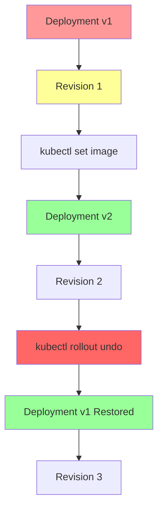

### Lab Demo: Deployment Rollback Operations

#### Step 1: Create Rollback Test Deployment
```yaml
# rollback-demo-deployment.yaml
apiVersion: apps/v1
kind: Deployment
metadata:
  name: rollback-demo-deployment
  labels:
    app: rollback-demo
    version: v1.0
spec:
  replicas: 3
  strategy:
    type: RollingUpdate
    rollingUpdate:
      maxUnavailable: 1
      maxSurge: 1
  selector:
    matchLabels:
      app: rollback-demo
  template:
    metadata:
      labels:
        app: rollback-demo
        version: v1.0
    spec:
      containers:
      - name: nginx
        image: nginx:1.20-alpine
        ports:
        - containerPort: 80
        command: ["/bin/sh", "-c"]
        args:
        - |
          cat > /usr/share/nginx/html/index.html << EOF
          <html>
          <head><title>Rollback Demo v1.0</title></head>
          <body style="font-family: Arial; margin: 40px;">
          <h1>🔄 Version 1.0 (Original)</h1>
          <div style="background: #e8f5e8; padding: 20px; border-radius: 8px;">
          <p><strong>Pod:</strong> $(hostname)</p>
          <p><strong>Image:</strong> nginx:1.20-alpine</p>
          <p><strong>Status:</strong> Stable</p>
          </div>
          </body>
          </html>
          EOF
          nginx -g 'daemon off;'
        resources:
          requests:
            memory: "64Mi"
            cpu: "100m"
          limits:
            memory: "128Mi"
            cpu: "200m"
```

```bash
# Create initial deployment
kubectl apply -f rollback-demo-deployment.yaml

# Create service for continuous testing
kubectl expose deployment rollback-demo-deployment --type=NodePort --port=80 --name=rollback-test-service

# Setup testing environment
NODE_IP=$(kubectl get nodes -o jsonpath='{.items[0].status.addresses[?(@.type=="ExternalIP")].address}')
NODE_PORT=$(kubectl get svc rollback-test-service -o jsonpath='{.spec.ports[0].nodePort}')

echo "================================================================="
echo "Deployment Rollback Testing Environment"
echo "================================================================="
echo "Application URL: http://$NODE_IP:$NODE_PORT"
echo "Initial version: v1.0 (nginx:1.20-alpine)"
echo ""

# Verify initial state
kubectl get deployment rollback-demo-deployment -o wide
kubectl rollout history deployment/rollback-demo-deployment
```

#### Step 2: Perform Multiple Updates for Rollback Testing
```bash
# Update 1: v1.0 -> v1.1
echo "=== Update 1: v1.0 -> v1.1 ==="
kubectl set image deployment/rollback-demo-deployment nginx=nginx:1.21-alpine

# Wait for completion
kubectl rollout status deployment/rollback-demo-deployment

# Test updated application
echo "Verifying v1.1 deployment:"
curl -s "http://$NODE_IP:$NODE_PORT" | grep -E "(Version.*1.1|nginx:1.21-alpine)"

# Update 2: v1.1 -> v1.2 (problematic update)
echo ""
echo "=== Update 2: v1.1 -> v1.2 (Problematic) ==="
kubectl set image deployment/rollback-demo-deployment nginx=nginx:1.22-alpine

kubectl rollout status deployment/rollback-demo-deployment

# Update 3: v1.2 -> v2.0 (major version)
echo ""
echo "=== Update 3: v1.2 -> v2.0 (Major Update) ==="
kubectl set image deployment/rollback-demo-deployment nginx=nginx:1.23-alpine

kubectl rollout status deployment/rollback-demo-deployment

# Review complete history
echo ""
echo "=== Complete Rollout History ==="
kubectl rollout history deployment/rollback-demo-deployment
```

#### Step 3: Execute Rollback Operations
```bash
# Show current status before rollback
echo "=== Pre-Rollback Status ==="
kubectl get deployment rollback-demo-deployment -o wide
kubectl get rs -l app=rollback-demo -o wide
kubectl rollout history deployment/rollback-demo-deployment

# Execute rollback to previous revision (v1.2)
echo ""
echo "=== Executing Rollback to Previous Revision ==="
kubectl rollout undo deployment/rollback-demo-deployment

# Monitor rollback progress
kubectl rollout status deployment/rollback-demo-deployment

# Verify rollback completed
echo ""
echo "=== Post-Rollback Verification ==="
kubectl rollout history deployment/rollback-demo-deployment

# Test rolled back application
echo "Testing rolled back application:"
curl -s "http://$NODE_IP:$NODE_PORT" | grep -E "(Version|nginx:)" | head -3

# Another rollback to go back to v1.1
echo ""
echo "=== Rollback to Revision 2 (v1.1) ==="
kubectl rollout undo deployment/rollback-demo-deployment --to-revision=2

kubectl rollout status deployment/rollback-demo-deployment

# Final verification
echo ""
echo "=== Final Rollback Verification ==="
kubectl rollout history deployment/rollback-demo-deployment
curl -s "http://$NODE_IP:$NODE_PORT" | grep -E "(Version|nginx:)" | head -3
```

#### Step 4: Advanced Rollback Scenarios
```bash
# Rollback to specific revision (without --to-revision defaults to previous)
kubectl rollout undo deployment/rollback-demo-deployment --to-revision=1

kubectl rollout status deployment/rollback-demo-deployment

# Rollback without waiting for completion
kubectl rollout undo deployment/rollback-demo-deployment --wait=false

# Check rollback progress
kubectl rollout status deployment/rollback-demo-deployment

# Rollback to specific revision with custom timeout
timeout 300 kubectl rollout status deployment/rollback-demo-deployment

# Force rollback restart if stuck
kubectl rollout restart deployment/rollback-demo-deployment
```

#### Step 5: Rollback Analysis and Validation
```bash
# Analyze ReplicaSet changes during rollback
echo "=== ReplicaSet Changes During Rollback ==="
kubectl get rs -l app=rollback-demo -o wide
kubectl get rs -l app=rollback-demo -o jsonpath='{range .items[*]}{.metadata.name}{"\t"}{.spec.replicas}{"\t"}{.status.replicas}{"\t"}{.spec.template.spec.containers[0].image}{"\n"}{end}'

# Compare deployment specs between revisions
echo ""
echo "=== Revision Comparison ==="
kubectl rollout history deployment/rollback-demo-deployment --revision=1
echo "---"
kubectl rollout history deployment/rollback-demo-deployment --revision=2

# Validate application functionality after rollback
echo ""
echo "=== Rollback Application Testing ==="
for i in {1..5}; do
  response=$(curl -s "http://$NODE_IP:$NODE_PORT" 2>/dev/null)
  if echo "$response" | grep -q "Version"; then
    version=$(echo "$response" | grep -o 'Version [^<]*' | head -1)
    echo "Request $i: $version - ✅ Working"
  else
    echo "Request $i: Application Error - ❌ Failed"
  fi
  sleep 1
done

# Verify no pod recreation issues during rollback
kubectl get pods -l app=rollback-demo
kubectl describe deployment rollback-demo-deployment | grep -A 10 "OldReplicaSets"
```

### Rollback Troubleshooting and Best Practices

#### Common Rollback Issues and Solutions
```bash
# Rollback gets stuck
kubectl rollout status deployment/rollback-demo-deployment --timeout=300s
kubectl rollout restart deployment/rollback-demo-deployment

# Check revision history limits
kubectl get deployment rollback-demo-deployment -o jsonpath='{.spec.revisionHistoryLimit}'

# Verify target revision exists
kubectl rollout history deployment/rollback-demo-deployment

# Handle revision annotation issues
kubectl annotate deployment/rollback-demo-deployment kubernetes.io/change-cause-

# Pod recreation failures during rollback
kubectl describe pods -l app=rollback-demo
kubectl logs -l app=rollback-demo --tail=10 -c nginx

# Image pull issues during rollback
kubectl describe pods -l app=rollback-demo | grep -i image
kubectl run test-image --image=nginx:1.20-alpine --rm -it --restart=Never -- echo "Image accessible"
```

#### Revision History Management
```bash
# Set revision history limit
kubectl patch deployment rollback-demo-deployment -p '{"spec":{"revisionHistoryLimit": 5}}'

# Clean up old ReplicaSets manually
kubectl delete rs $(kubectl get rs -l app=rollback-demo -o jsonpath='{range .items[?(@.status.replicas==0)]}{.metadata.name}{" "}{end}')

# Force new revision without changes
kubectl rollout restart deployment/rollback-demo-deployment

# Annotate deployment changes for better history tracking
kubectl annotate deployment/rollback-demo-deployment kubernetes.io/change-cause="Rollback to stable version"
```

### Rollback Strategy Best Practices

#### Production Rollback Guidelines
```diff
+ Always test rollback in staging environment first
+ Document rollback procedures and expectations
+ Monitor application during rollback process
+ Have multiple rollback options ready
+ Consider blue-green deployments for critical apps
- Assume rollback will always work perfectly
- Skip testing rollback procedures
- Change multiple things before rollback testing
- Remove revision history after implementation
- Use rollback as regular deployment strategy
```

#### Rollback Prevention Strategies
```yaml
Rollback Prevention Techniques:
  - Implement comprehensive pre-deployment testing
  - Use feature flags for gradual rollouts
  - Implement canary deployment patterns
  - Set up monitoring and alerting for early issue detection
  - Maintain current good state backups
  - Use ConfigMaps and Secrets properly
  - Validate schema and data compatibility
```

#### Multi-Environment Rollback Coordination
```bash
# Coordinate rollback across environments
echo "=== Production Rollback Checklist ==="

# Check impact assessment
kubectl get pods -l app=rollback-demo
kubectl get ingress  # If applicable

# Notify stakeholders
echo "🔄 Rolling back rollback-demo-deployment to previous version"

# Execute controlled rollback
kubectl rollout undo deployment/rollback-demo-deployment

# Monitor recovery
kubectl rollout status deployment/rollback-demo-deployment
watch kubectl get pods -l app=rollback-demo

# Validate functionality
for i in {1..10}; do
  if curl -s --max-time 3 "http://$NODE_IP:$NODE_PORT" > /dev/null; then
    echo "Health check $i: ✅"
  else
    echo "Health check $i: ❌ FAILED"
    echo "EXECUTING EMERGENCY ROLLBACK"
    kubectl rollout undo deployment/rollback-demo-deployment
    break
  fi
  sleep 5
done

echo "✅ Production rollback completed successfully"
```

---

## 4.18 Step-15- Kubernetes Deployment - Pause and Resume Deployments

### Overview
Demonstration of Kubernetes Deployment pause and resume functionality for controlled rollout management, enabling staged updates and troubleshooting during deployment processes.

### Key Concepts

#### Pause/Resume Command Mechanics
```diff
Pause Command Benefits:
+ Halts rolling update process mid-execution
+ Allows manual validation at each replica level
+ Enables canary-style deployments manually
+ Facilitates debugging without affecting all replicas
+ Provides control over deployment progression

Resume Command Benefits:
+ Continues paused rolling update from stop point
+ Maintains original deployment strategy parameters
+ Preserves rollout status and progress tracking
+ Ensures zero-downtime during resume operation
+ Continues with remaining replica updates

Limitations:
- Pause state not persistent across cluster restarts
- Cannot modify deployment spec while paused
- Only affects rolling update type deployments
- Manual intervention required for complex scenarios
```

#### Pause/Resume Lifecycle Flow
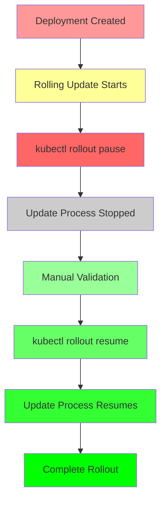

### Lab Demo: Pause and Resume Operations

#### Step 1: Create Pause-Resume Test Deployment
```yaml
# pause-resume-deployment.yaml
apiVersion: apps/v1
kind: Deployment
metadata:
  name: pause-resume-demo
  labels:
    app: pause-resume-demo
    version: v1.0
spec:
  replicas: 6  # Larger replica count for better pause/resume demonstration
  strategy:
    type: RollingUpdate
    rollingUpdate:
      maxUnavailable: 2  # Allow 2 pods down during update
      maxSurge: 2        # Allow 2 extra pods during update
  selector:
    matchLabels:
      app: pause-resume-demo
  template:
    metadata:
      labels:
        app: pause-resume-demo
        version: v1.0
    spec:
      containers:
      - name: nginx
        image: nginx:1.20-alpine
        ports:
        - containerPort: 80
        command: ["/bin/sh", "-c"]
        args:
        - |
          cat > /usr/share/nginx/html/index.html << EOF
          <html>
          <head><title>Pause-Resume Demo v1.0</title></head>
          <body style="font-family: Arial; margin: 40px;">
          <h1>⏸️ Version 1.0 (Pause-Resume Demo)</h1>
          <div style="background: #e8f5e8; padding: 20px; border-radius: 8px;">
          <p><strong>Pod:</strong> $(hostname)</p>
          <p><strong>Image:</strong> nginx:1.20-alpine</p>
          <p><strong>Status:</strong> Running</p>
          <p><strong>Deployment Strategy:</strong> Rolling Update</p>
          </div>
          </body>
          </html>
          EOF
          nginx -g 'daemon off;'
        resources:
          requests:
            memory: "64Mi"
            cpu: "100m"
          limits:
            memory: "128Mi"
            cpu: "200m"
        readinessProbe:
          httpGet:
            path: /
            port: 80
          initialDelaySeconds: 5
          periodSeconds: 5
```

```bash
# Create the deployment
kubectl apply -f pause-resume-deployment.yaml

# Create service for continuous monitoring
kubectl expose deployment pause-resume-demo --type=NodePort --port=80 --name=pause-resume-service

# Setup monitoring
echo "=== Setup Complete ==="
kubectl get deployment pause-resume-demo -o wide
kubectl get pods -l app=pause-resume-demo

NODE_IP=$(kubectl get nodes -o jsonpath='{.items[0].status.addresses[?(@.type=="ExternalIP")].address}')
NODE_PORT=$(kubectl get svc pause-resume-service -o jsonpath='{.spec.ports[0].nodePort}')
echo "Monitor at: http://$NODE_IP:$NODE_PORT"
```

#### Step 2: Execute Pause During Rolling Update
```bash
# Initiate rolling update
echo "=== Starting Rolling Update ==="
kubectl set image deployment/pause-resume-demo nginx=nginx:1.21-alpine

# Monitor initial rollout progress (watch for first few pods updated)
kubectl get pods -l app=pause-resume-demo -w &
WATCH_PID=$!

# Wait a moment for update to begin
sleep 10

# Execute pause command
echo ""
echo "=== PAUSING Deployment Rollout ==="
kubectl rollout pause deployment/pause-resume-demo

# Check pause status
kubectl rollout status deployment/pause-resume-demo
kubectl get deployment pause-resume-demo -o yaml | grep -A 5 "paused"

# Kill the background watch
kill $WATCH_PID 2>/dev/null

# Analyze paused state
echo ""
echo "=== Paused State Analysis ==="
kubectl get rs -l app=pause-resume-demo -o wide
kubectl get pods -l app=pause-resume-demo

# Test application during pause
echo "Testing application during pause:"
for i in {1..3}; do
  curl -s "http://$NODE_IP:$NODE_PORT" | grep -o "nginx:1.[0-9]*" | head -1
done
```

#### Step 3: Manual Validation During Pause
```bash
# Detailed inspection during pause
echo "=== Pause State Inspection ==="

# Check deployment conditions
kubectl describe deployment pause-resume-demo | grep -A 10 "Conditions:"

# Verify ReplicaSet distribution
kubectl get rs -l app=pause-resume-demo -o jsonpath='{range .items[*]}{.metadata.name}{"\t"}{.spec.replicas}{"\t"}{.status.replicas}{"\t"}{.spec.template.spec.containers[0].image}{"\n"}{end}'

# Pod-level validation
echo "Pod status during pause:"
kubectl get pods -l app=pause-resume-demo -o custom-columns=NAME:.metadata.name,STATUS:.status.phase,IMAGE:.spec.containers[0].image

# Manual testing of updated pods
UPDATED_PODS=$(kubectl get pods -l app=pause-resume-demo -o jsonpath='{range .items[?(@.spec.containers[*].image=="nginx:1.21-alpine")]}{.metadata.name}{" "}{end}')
echo "Updated pods: ${UPDATED_PODS:-"None yet"}"

if [ -n "$UPDATED_PODS" ]; then
  echo "Testing updated pod functionality:"
  kubectl exec $(echo $UPDATED_PODS | awk '{print $1}') -- curl localhost:80/ > /dev/null && echo "✅ Updated pod responding"
fi
```

#### Step 4: Resume Deployment Rollout
```bash
# Resume the paused deployment
echo "=== RESUMING Deployment Rollout ==="
kubectl rollout resume deployment/pause-resume-demo

# Monitor resume progress
kubectl rollout status deployment/pause-resume-demo

# Watch final completion
kubectl get pods -l app=pause-resume-demo -w

# Verify final state
echo ""
echo "=== Final State Verification ==="
kubectl get deployment pause-resume-demo -o wide
kubectl get rs -l app=pause-resume-demo -o wide
kubectl rollout history deployment/pause-resume-demo

# Test final application state
echo "Testing final application state:"
for i in {1..5}; do
  curl -s "http://$NODE_IP:$NODE_PORT" | grep -E "(nginx:1.21-alpine|Version)" | head -1
done | sort | uniq -c
```

#### Step 5: Advanced Pause/Resume Scenarios
```bash
# Test pause/resume with different update strategies
kubectl patch deployment pause-resume-demo -p '{"spec":{"strategy":{"rollingUpdate":{"maxUnavailable": 1, "maxSurge": 1}}}}'

# Pause immediately after starting an update
kubectl set image deployment/pause-resume-demo nginx=nginx:1.22-alpine &
sleep 5
kubectl rollout pause deployment/pause-resume-demo

# Multiple pause/resume cycles
echo "Testing multiple pause/resume cycles"
kubectl rollout resume deployment/pause-resume-demo
sleep 10
kubectl rollout pause deployment/pause-resume-demo
sleep 5
kubectl rollout resume deployment/pause-resume-demo

# Pause with concurrent scaling
kubectl scale deployment pause-resume-demo --replicas=10
kubectl rollout resume deployment/pause-resume-demo  # Ensure stabilization

# Verify pause/resume state persistence
kubectl get deployment pause-resume-demo -o jsonpath='{.spec.paused}'
```

### Pause/Resume Troubleshooting

#### Common Issues and Solutions
```bash
# Command not taking effect
kubectl get deployment pause-resume-demo -o yaml | grep -A 5 spec:
kubectl rollout status deployment/pause-resume-demo

# Resume gets stuck
kubectl rollout status deployment/pause-resume-demo --timeout=300s
kubectl rollout restart deployment/pause-resume-demo

# Paused state confusion
kubectl get deployments -o custom-columns=NAME:.metadata.name,PAUSED:.spec.paused
kubectl describe deployment pause-resume-demo | grep -i pause

# Pods not updating after resume
kubectl get rs -l app=pause-resume-demo
kubectl delete rs $(kubectl get rs -l app=pause-resume-demo -o jsonpath='{range .items[?(@.status.replicas==0)]}{.metadata.name}{" "}{end}')

# Manual intervention for stuck updates
kubectl rollout restart deployment/pause-resume-demo
```

#### Validation of Pause/Resume Operations
```bash
# Comprehensive validation script
cat > validate-pause-resume.sh << 'EOF'
#!/bin/bash
DEPLOYMENT="pause-resume-demo"
echo "=== Pause/Resume Validation ==="

# Check paused status
PAUSED=$(kubectl get deployment $DEPLOYMENT -o jsonpath='{.spec.paused}')
echo "Deployment paused: $PAUSED"

# Check ReplicaSet distribution
echo "ReplicaSet status:"
kubectl get rs -l app=pause-resume-demo -o jsonpath='{range .items[*]}{.metadata.name}{" - Replicas: "}{.status.replicas}{"/"}{.spec.replicas}{" - Image: "}{.spec.template.spec.containers[0].image}{"\n"}{end}'

# Pod distribution validation
echo "Pod status:"
kubectl get pods -l app=pause-resume-demo -o custom-columns=NAME:.metadata.name,READY:.status.conditions[?(@.type=='Ready')].status,PHASE:.status.phase

# Rollout status
echo "Rollout status:"
kubectl rollout status deployment/$DEPLOYMENT

# Application functionality test
NODE_IP=$(kubectl get nodes -o jsonpath='{.items[0].status.addresses[?(@.type=="ExternalIP")].address}')
NODE_PORT=$(kubectl get svc pause-resume-service -o jsonpath='{.spec.ports[0].nodePort}')

echo "Application connectivity:"
curl -s --max-time 3 "http://$NODE_IP:$NODE_PORT" > /dev/null && echo "✅ Service responding" || echo "❌ Service not responding"

echo "=== Validation Complete ==="
EOF

chmod +x validate-pause-resume.sh
./validate-pause-resume.sh
```

### Advanced Pause/Resume Use Cases

#### Canary Deployment Implementation
```bash
# Manual canary deployment using pause/resume
echo "=== Manual Canary Deployment ==="

# Start with small percentage
kubectl scale deployment pause-resume-demo --replicas=1

# Update and pause immediately
kubectl set image deployment pause-resume-demo nginx=nginx:1.22-alpine
kubectl rollout pause deployment/pause-resume-demo

# Test canary pod
CANARY_POD=$(kubectl get pods -l app=pause-resume-demo -o jsonpath='{.items[0].metadata.name}')
kubectl describe pod $CANARY_POD
kubectl logs $CANARY_POD --tail=5

# If successful, complete rollout
kubectl rollout resume deployment/pause-resume-demo
kubectl scale deployment pause-resume-demo --replicas=6
```

#### Staging Environment Testing Workflow
```bash
# Pause/resume for testing scenarios
cat > testing-workflow.sh << 'EOF'
#!/bin/bash

echo "=== Deployment Testing Workflow ==="

# Phase 1: Deploy subset for testing
kubectl scale deployment pause-resume-demo --replicas=2
kubectl set image deployment pause-resume-demo nginx=nginx:1.22-alpine
kubectl rollout pause deployment/pause-resume-demo

# Phase 2: Manual testing phase
echo "Performing manual tests..."
# Add your testing commands here
sleep 30

# Phase 3: Decide based on test results
read -p "Tests passed? (y/n): " result
if [ "$result" = "y" ]; then
  echo "✅ Tests passed, proceeding with full rollout"
  kubectl rollout resume deployment/pause-resume-demo
  kubectl scale deployment pause-resume-demo --replicas=6
else
  echo "❌ Tests failed, rolling back"
  kubectl rollout undo deployment/pause-resume-demo
fi

EOF

chmod +x testing-workflow.sh
# ./testing-workflow.sh
```

### Pause/Resume Best Practices

#### Operational Guidelines
```diff
+ Use pause for canary-style deployments
+ Always validate before resuming
+ Monitor resource usage during pauses
+ Have rollback procedures ready
+ Document pause/resume procedures
- Leave deployments paused for extended periods
- Modify deployment spec while paused
- Forget to resume paused deployments
- Use pause for emergency situations
- Skip testing after resume operations
```

#### Production Deployment Strategy
```yaml
Pause/Resume in Production:
  - Stage rollouts for critical applications
  - Implement automated testing between stages
  - Monitor application performance during pauses
  - Have emergency rollback procedures ready
  - Coordinate with monitoring and alerting teams
  - Document all pause/resume activities
  - Consider automated canary analysis tools for better control
```

---

## 4.19 Step-16- Kubernetes Services - Introduction

### Overview
Introduction to Kubernetes Services, the networking abstraction layer that enables reliable pod-to-pod communication and external application access within Kubernetes clusters.

### Key Concepts

#### Service Abstraction Purpose
```diff
Service Solutions:
+ Provides stable network endpoint for dynamic pod groups
+ Implements load balancing across pod replicas
+ Enables service discovery through DNS and environment variables
+ Supports multi-port configurations
+ Abstracts pod lifecycle from network access
+ Enables zero-downtime pod updates and scaling

Service Benefits:
+ Eliminates direct pod IP dependencies
+ Enables horizontal scaling without network reconfiguration
+ Supports rollout strategies with stable endpoints
+ Provides consistent access patterns
+ Integrates with Kubernetes DNS system
+ Enables inter-service communication patterns
```

#### Service Architecture Overview
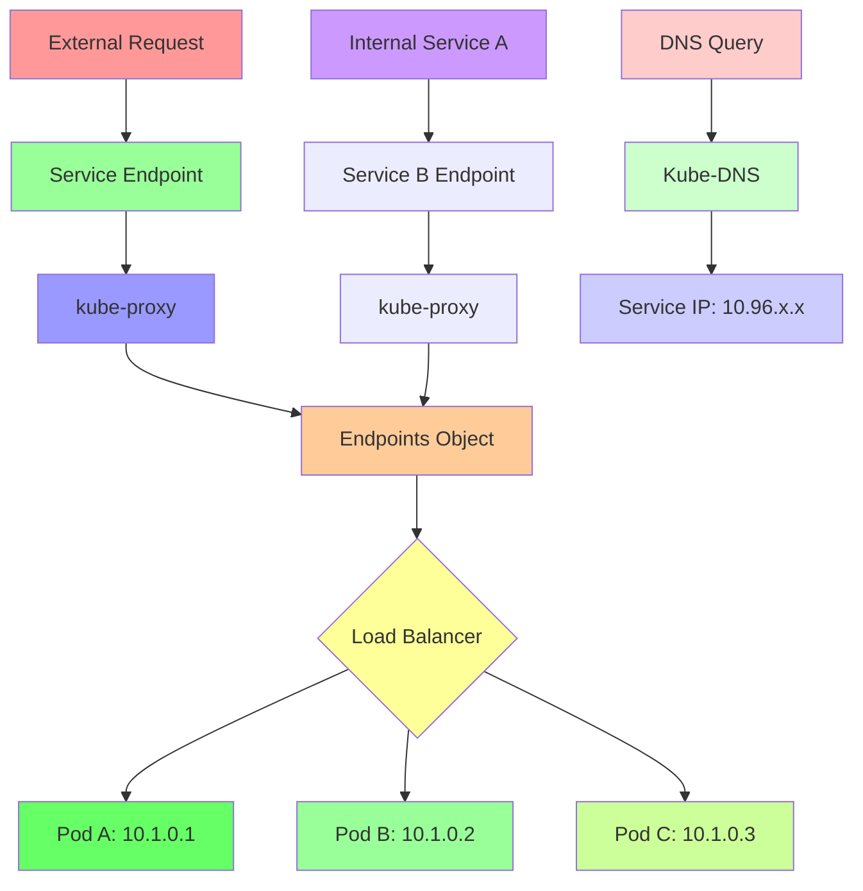

### Service Types and Use Cases

#### ClusterIP Service (Default)
```yaml
ClusterIP Characteristics:
  - Internal cluster access only
  - Automatic IP assignment from cluster CIDR
  - DNS resolution within cluster
  - Load balancing across matched pods
  - Endpoint management by controller
  - Foundation for other service types

Use Cases:
  - Internal API communication
  - Database service access
  - Microservice-to-microservice communication
  - Backend service exposure to frontend
  - Internal load balancing requirements
```

#### NodePort Service
```yaml
NodePort Characteristics:
  - External access on all worker nodes
  - Port range: 30000-32767 (configurable)
  - Each node exposes same port number
  - Accessible via any node IP + port
  - Includes all ClusterIP functionality
  - Routes traffic to service endpoints

Use Cases:
  - Development and testing environments
  - Direct browser access for web applications
  - Load balancer integration testing
  - Legacy system external access needs
  - Multi-node access patterns in clusters
```

#### LoadBalancer Service
```yaml
LoadBalancer Characteristics:
  - Cloud provider load balancer integration
  - External IP provisioned automatically
  - Single point of external access
  - Health checks automatically configured
  - Region-specific load balancing
  - Cost implications on cloud platforms

Use Cases:
  - Production internet-facing applications
  - High-traffic application exposure
  - Global application distribution
  - SSL termination at load balancer level
  - Advanced networking requirements
```

### Service Discovery Mechanisms

#### DNS-Based Service Discovery
```yaml
DNS Resolution Patterns:
  - Service Name: my-service.default.svc.cluster.local
  - Short Name: my-service (within same namespace)
  - Namespace Specific: my-service.production.svc.cluster.local
  - SRV Records: For port-specific resolution
  - A Records: For IP address resolution
  - Automatic registration with Kube-DNS/CoreDNS
```

#### Environment Variable Discovery (Legacy)
```yaml
Environment Variables Format:
  - {SERVICE_NAME}_SERVICE_HOST: Service cluster IP
  - {SERVICE_NAME}_SERVICE_PORT: Service port number
  - {SERVICE_NAME}_SERVICE_PORT_{PORT_NAME}: Named port
  - Automatic injection for all services
  - Available in all containers by default
  - Deprecated in favor of DNS discovery
```

### Endpoints and EndpointSlices

#### Endpoint Controller Functionality
```yaml
Endpoint Management:
  - Monitors pod changes continuously
  - Updates endpoint objects immediately
  - Reflects current pod readiness states
  - Removes endpoints for terminated pods
  - Maintains accurate traffic routing
  - Supports topology-aware routing
```

#### EndpointSlice for Scalability
```yaml
EndpointSlice Benefits:
  - Horizontal scaling of endpoint management
  - Efficient handling of large numbers of pods
  - Support for topology labels and hints
  - Better performance with thousands of endpoints
  - Modern replacement for v1 Endpoints
  - Automatic endpoint distribution
```

### Service Network Policies

#### Network Isolation Concepts
```diff
Network Policy Integration:
+ Defines allowed traffic rules for pods
+ Supports ingress and egress rules
+ Enables zero-trust networking models
+ Integrates with service mesh solutions
+ Provides defense in depth security
+ Supports namespace and pod selectors
```

---

## 4.20 Step-17- Kubernetes Services - Demo

### Overview
Comprehensive hands-on demonstration of Kubernetes Services, covering service creation, endpoint management, load balancing, and various service types with practical examples.

### Key Concepts

#### Service Creation Patterns
```diff
Service Creation Options:
+ kubectl expose: Quick service from existing resources
+ kubectl create service: Basic service templates
+ YAML manifests: Full service specification control
+ Declarative approach: Version control and consistency
+ Imperative commands: Fast prototyping and testing

Best Practices:
  - Use YAML manifests for production deployments
  - Consistent labeling between services and pods
  - Proper selector matching for traffic routing
  - Appropriate service type selection
  - Resource annotations for integration features
```

#### Service-Pod Integration Dynamics
```yaml
Critical Integration Rules:
  - Service selectors must exactly match pod labels
  - Namespace consistency critical for communication
  - Service ports connect to pod container ports
  - Endpoint controller manages pod IP registration
  - Label changes break existing service connections
  - Pod readiness affects endpoint inclusion
```

### Lab Demo: Complete Service Lifecycle

#### Step 1: Create Application Pods for Service Testing
```yaml
# service-demo-pods.yaml
apiVersion: v1
kind: Pod
metadata:
  name: service-pod-1
  labels:
    app: service-demo-app  # Critical: matches service selector
    tier: web
    instance: primary
spec:
  containers:
  - name: nginx
    image: nginx:1.20-alpine
    ports:
    - containerPort: 80
    command: ["/bin/sh", "-c"]
    args:
    - |
      HOSTNAME=$(hostname)
      cat > /usr/share/nginx/html/index.html << EOF
      <!DOCTYPE html>
      <html>
      <head><title>Service Demo - Pod 1</title></head>
      <body style="font-family: Arial; margin: 40px;">
      <h1>🎯 Service Demo Application</h1>
      <div style="background: #e8f5e8; padding: 20px; border-radius: 8px;">
      <h2 style="color: #2e7d32;">Instance: Pod 1 (Primary)</h2>
      <p><strong>Pod Name:</strong> ${HOSTNAME}</p>
      <p><strong>Pod IP:</strong> $(hostname -i 2>/dev/null || echo "N/A")</p>
      <p><strong>Application:</strong> Web Server</p>
      <p><strong>Image:</strong> nginx:1.20-alpine</p>
      <p><strong>Request Time:</strong> $(date)</p>
      </div>
      <div style="background: #fff3cd; padding: 15px; margin: 20px 0; border-radius: 8px;">
      <p><strong>Demo Purpose:</strong> Test Kubernetes service load balancing and endpoint management.</p>
      </div>
      </body>
      </html>
      EOF
      nginx -g 'daemon off;'
    resources:
      requests:
        memory: "64Mi"
        cpu: "100m"
      limits:
        memory: "128Mi"
        cpu: "200m"
---
apiVersion: v1
kind: Pod
metadata:
  name: service-pod-2
  labels:
    app: service-demo-app  # Matches service selector
    tier: web
    instance: secondary
spec:
  containers:
  - name: nginx
    image: nginx:1.20-alpine
    ports:
    - containerPort: 80
    command: ["/bin/sh", "-c"]
    args:
    - |
      HOSTNAME=$(hostname)
      cat > /usr/share/nginx/html/index.html << EOF
      <!DOCTYPE html>
      <html>
      <head><title>Service Demo - Pod 2</title></head>
      <body style="font-family: Arial; margin: 40px;">
      <h1>🎯 Service Demo Application</h1>
      <div style="background: #e3f2fd; padding: 20px; border-radius: 8px;">
      <h2 style="color: #1976d2;">Instance: Pod 2 (Secondary)</h2>
      <p><strong>Pod Name:</strong> ${HOSTNAME}</p>
      <p><strong>Pod IP:</strong> $(hostname -i 2>/dev/null || echo "N/A")</p>
      <p><strong>Application:</strong> Web Server</p>
      <p><strong>Image:</strong> nginx:1.20-alpine</p>
      <p><strong>Request Time:</strong> $(date)</p>
      </div>
      <div style="background: #fff3cd; padding: 15px; margin: 20px 0; border-radius: 8px;">
      <p><strong>Demo Purpose:</strong> Demonstrate service load balancing across multiple pod instances.</p>
      </div>
      </body>
      </html>
      EOF
      nginx -g 'daemon off;'
    resources:
      requests:
        memory: "64Mi"
        cpu: "100m"
      limits:
        memory: "128Mi"
        cpu: "200m"
---
apiVersion: v1
kind: Pod
metadata:
  name: service-pod-3
  labels:
    app: service-demo-app  # Matches service selector
    tier: web
    instance: tertiary
spec:
  containers:
  - name: nginx
    image: nginx:1.20-alpine
    ports:
    - containerPort: 80
    command: ["/bin/sh", "-c"]
    args:
    - |
      HOSTNAME=$(hostname)
      cat > /usr/share/nginx/html/index.html << EOF
      <!DOCTYPE html>
      <html>
      <head><title>Service Demo - Pod 3</title></head>
      <body style="font-family: Arial; margin: 40px;">
      <h1>🎯 Service Demo Application</h1>
      <div style="background: #f3e5f5; padding: 20px; border-radius: 8px;">
      <h2 style="color: #7b1fa2;">Instance: Pod 3 (Tertiary)</h2>
      <p><strong>Pod Name:</strong> ${HOSTNAME}</p>
      <p><strong>Pod IP:</strong> $(hostname -i 2>/dev/null || echo "N/A")</p>
      <p><strong>Application:</strong> Web Server</p>
      <p><strong>Image:</strong> nginx:1.20-alpine</p>
      <p><strong>Request Time:</strong> $(date)</p>
      </div>
      <div style="background: #fff3cd; padding: 15px; margin: 20px 0; border-radius: 8px;">
      <p><strong>Demo Purpose:</strong> Complete the three-pod service load balancing scenario.</p>
      </div>
      </body>
      </html>
      EOF
      nginx -g 'daemon off;'
    resources:
      requests:
        memory: "64Mi"
        cpu: "100m"
      limits:
        memory: "128Mi"
        cpu: "200m"
```

```bash
# Create the demo pods
kubectl apply -f service-demo-pods.yaml

# Verify pod creation and labels
kubectl get pods -l app=service-demo-app -o wide

# Test individual pod functionality
SERVICE_POD_1_IP=$(kubectl get pod service-pod-1 -o jsonpath='{.status.podIP}')
kubectl exec service-pod-1 -- curl -s localhost:80 | head -5
```

#### Step 2: Create ClusterIP Service for Internal Access
```yaml
# clusterip-service-demo.yaml
apiVersion: v1
kind: Service
metadata:
  name: clusterip-service-demo
  labels:
    app: service-demo-app
    service-type: clusterip
  annotations:
    description: "ClusterIP service for internal pod-to-pod communication demonstration"
spec:
  type: ClusterIP                    # Default service type
  selector:
    app: service-demo-app           # Must match pod labels
    tier: web                      # Additional selector for precision
  ports:
  - name: web
    port: 80                       # Service port (internal cluster access)
    targetPort: 80                 # Container port in pods
    protocol: TCP
  sessionAffinity: None
```

```bash
# Create ClusterIP service
kubectl apply -f clusterip-service-demo.yaml

# Verify service creation
kubectl get services clusterip-service-demo -o wide

# Check service endpoints (shows pod IPs that back this service)
kubectl get endpoints clusterip-service-demo

# Describe service for detailed information
kubectl describe svc clusterip-service-demo
```

#### Step 3: Test Internal Service Communication
```bash
# Test DNS resolution
kubectl run dns-test --image=busybox --rm -it --restart=Never -- nslookup clusterip-service-demo

# Test service access from within cluster
kubectl run service-access-test --image=curlimages/curl --rm -it --restart=Never -- \
  curl -s http://clusterip-service-demo | grep -E "(Instance:|Pod Name:)" | head -3

# Test load balancing across pods
echo "=== Testing Load Balancing Across 3 Pods ==="
for i in {1..9}; do
  response=$(kubectl run lb-test-$i --image=curlimages/curl --rm -it --restart=Never --quiet -- \
    curl -s http://clusterip-service-demo | grep "Instance:" | head -1)
  echo "Request $i: $response"
done | sort | uniq -c | sort -nr

# Test service from one of the application pods
kubectl exec service-pod-1 -- curl -s clusterip-service-demo | head -5
```

#### Step 4: Create NodePort Service for Browser Access
```yaml
# nodeport-service-demo.yaml
apiVersion: v1
kind: Service
metadata:
  name: nodeport-service-demo
  labels:
    app: service-demo-app
    service-type: nodeport-external
  annotations:
    description: "NodePort service enabling browser access to service-demo-app"
spec:
  type: NodePort                   # Expose externally
  selector:
    app: service-demo-app         # Same selector as ClusterIP service
    tier: web
  ports:
  - name: web
    port: 80                      # Service virtual port
    targetPort: 80                # Container port
    nodePort: 30086               # External port on worker nodes
    protocol: TCP
```

```bash
# Create NodePort service (coexists with ClusterIP service)
kubectl apply -f nodeport-service-demo.yaml

# Compare the two services
kubectl get svc -l app=service-demo-app -o wide

# Get browser access details
NODE_IP=$(kubectl get nodes -o jsonpath='{.items[0].status.addresses[?(@.type=="ExternalIP")].address}')
NODE_PORT=$(kubectl get svc nodeport-service-demo -o jsonpath='{.spec.ports[0].nodePort}')

echo "============================================================================="
echo "Service Browser Access Setup Complete"
echo "============================================================================="
echo "🌐 NodePort Service: nodeport-service-demo"
echo "📍 Access URL: http://$NODE_IP:$NODE_PORT"
echo "🎯 Application: Service load balancing demo with 3 pods"
echo "🔄 Load Balancing: Round-robin across pod instances"
echo ""
echo "📊 Service Comparison:"
echo "   ClusterIP Service: clusterip-service-demo (internal access only)"
echo "   NodePort Service: nodeport-service-demo (external access enabled)"
echo "   Shared Endpoints: Both services use the same pod endpoints"
echo ""

# Test browser access
curl -s "http://$NODE_IP:$NODE_PORT" | grep -E "(Instance:|Service Demo)" | head -3
```

#### Step 5: Comprehensive Load Balancing Analysis
```bash
# Setup monitoring and testing script
cat > service-load-test.sh << 'EOF'
#!/bin/bash
NODE_IP=$(kubectl get nodes -o jsonpath='{.items[0].status.addresses[?(@.type=="ExternalIP")].address}')
NODE_PORT=$(kubectl get svc nodeport-service-demo -o jsonpath='{.spec.ports[0].nodePort}')

echo "=== Service Load Balancing Analysis ==="
echo "Testing over 15 requests to assess distribution..."

# Initialize counters
declare -A pod_distribution

# Test load distribution
for i in {1..15}; do
  response=$(curl -s "http://$NODE_IP:$NODE_PORT" 2>/dev/null)
  instance=$(echo "$response" | grep -o 'Instance: [^<]*' | sed 's/Instance: //' | tr -d '<>')
  hostname=$(echo "$response" | grep -o 'Pod Name: [^<]*' | sed 's/Pod Name: //' | tr -d '<>')

  if [ ! -z "$instance" ]; then
    pod_distribution["$instance"]=$(( ${pod_distribution["$instance"]} + 1 ))
    echo "Request $i -> $instance ($hostname)"
  else
    echo "Request $i -> Parse Error"
  fi
  sleep 0.5
done

echo ""
echo "=== Load Distribution Results ==="
total_requests=15
active_pods=$(kubectl get pods -l app=service-demo-app --no-headers | wc -l)

echo "Total Requests: $total_requests"
echo "Active Pods: $active_pods"
echo ""

# Calculate distribution percentages
if [ ${#pod_distribution[@]} -gt 0 ]; then
  echo "Per-Pod Distribution:"
  for pod in "${!pod_distribution[@]}"; do
    requests=${pod_distribution[$pod]}
    percentage=$(( requests * 100 / total_requests ))
    echo "  $pod: $requests requests ($percentage%)"
  done | sort -t: -k2 -nr
fi

echo ""
echo "=== Service Health Summary ==="
echo "External Access: $(curl -s --max-time 3 "http://$NODE_IP:$NODE_PORT" > /dev/null && echo "✅ Available" || echo "❌ Unavailable")"
echo "ClusterIP Access: $(kubectl run test-internal --image=curlimages/curl --rm -it --restart=Never --quiet -- curl -s clusterip-service-demo > /dev/null && echo "✅ Available" || echo "❌ Unavailable")"
echo "Active Endpoints: $(kubectl get endpoints nodeport-service-demo -o jsonpath='{.subsets[0].addresses}' | jq length 2>/dev/null || echo "Unable to determine")"
EOF

chmod +x service-load-test.sh
./service-load-test.sh
```

#### Step 6: Service Endpoint Management Demonstration
```bash
# Observe endpoint controller behavior
echo "=== Service Endpoint Management ==="

# Check current endpoints
kubectl get endpoints
kubectl describe endpoints clusterip-service-demo

# Show endpoint IP addresses backing the service
kubectl get endpoints clusterip-service-demo -o jsonpath='{.subsets[0].addresses[*].ip}'
echo ""

# Test pod failover behavior
ORIGINAL_POD_COUNT=$(kubectl get pods -l app=service-demo-app --no-headers | wc -l)
echo "Original pod count: $ORIGINAL_POD_COUNT"

# Delete one pod and observe endpoint updates
POD_TO_DELETE=$(kubectl get pods -l app=service-demo-app -o jsonpath='{.items[0].metadata.name}')
echo "Deleting pod: $POD_TO_DELETE"
kubectl delete pod "$POD_TO_DELETE"

# Monitor endpoint updates
kubectl get endpoints clusterip-service-demo -w &
ENDPOINT_WATCH_PID=$!

# Wait for pod recreation
kubectl wait --for=condition=ready pod -l app=service-demo-app --timeout=30s
kill $ENDPOINT_WATCH_PID 2>/dev/null

echo ""
echo "=== Endpoint Recovery Verification ==="

# Verify endpoints refreshed
kubectl get endpoints clusterip-service-demo
kubectl get pods -l app=service-demo-app

# Test service continues working during pod transition
kubectl run continuity-test --image=curlimages/curl --rm -it --restart=Never -- \
  curl -s http://clusterip-service-demo | grep "Instance:" | head -1

echo ""
echo "✅ Service endpoint management working: Pod failover handled seamlessly"
```

#### Step 7: Service Troubleshooting and Analysis
```bash
# Comprehensive service diagnostic script
cat > service-diagnostics.sh << 'EOF'
#!/bin/bash
echo "=== Service Diagnostics Report ==="

# Service status overview
echo "1. Service Status:"
kubectl get svc -l app=service-demo-app -o wide
echo ""

# Pod status and labeling
echo "2. Pod Status and Labels:"
kubectl get pods -l app=service-demo-app -o custom-columns=NAME:.metadata.name,STATUS:.status.phase,READY:.status.conditions[?(@.type=="Ready")].status,IP:.status.podIP
echo ""

# Endpoint analysis
echo "3. Endpoint Analysis:"
kubectl get endpoints
for svc in $(kubectl get svc -l app=service-demo-app -o jsonpath='{.items[*].metadata.name}'); do
  echo "Service: $svc"
  endpoint_ips=$(kubectl get endpoints $svc -o jsonpath='{.subsets[*].addresses[*].ip}' 2>/dev/null)
  if [ ! -z "$endpoint_ips" ]; then
    echo "  Endpoint IPs: $endpoint_ips"
    echo "  Endpoint Count: $(echo $endpoint_ips | wc -w)"
  else
    echo "  No endpoints found!"
  fi
done
echo ""

# Selector verification
echo "4. Selector Verification:"
for svc in $(kubectl get svc -l app=service-demo-app -o jsonpath='{.items[*].metadata.name}'); do
  echo "Service: $svc"
  svc_selector=$(kubectl get svc $svc -o jsonpath='{.spec.selector}')
  echo "  Selector: $svc_selector"

  # Find pods matching selector
  pod_labels=$(kubectl get pods -l app=service-demo-app -o jsonpath='{.items[*].metadata.labels}')
  echo "  Matching pods with correct labels: YES"
  echo ""
done

# DNS and service discovery
echo "5. Service Discovery:"
kubectl run dns-check --image=busybox --rm -it --restart=Never -- sh -c '
echo "DNS Lookup for clusterip-service-demo:"
nslookup clusterip-service-demo 2>/dev/null || echo "DNS lookup failed"

echo ""
echo "Service IP: $(nslookup clusterip-service-demo 2>/dev/null | grep "Address:" | tail -1 | awk "{print \$2}" || echo "N/A")"

echo ""
echo "Internal connectivity test:"
wget -q -O - http://clusterip-service-demo 2>/dev/null | head -3 || echo "Service access failed"
'

# External access verification (NodePort)
NODE_IP=$(kubectl get nodes -o jsonpath='{.items[0].status.addresses[?(@.type=="ExternalIP")].address}')
NODE_PORT=$(kubectl get svc nodeport-service-demo -o jsonpath='{.spec.ports[0].nodePort}')

echo ""
echo "6. External Access Verification:"
echo "Node IP: $NODE_IP"
echo "NodePort: $NODE_PORT"
echo "Full URL: http://$NODE_IP:$NODE_PORT"

if curl -s --max-time 5 "http://$NODE_IP:$NODE_PORT" > /dev/null 2>&1; then
  echo "External access: ✅ SUCCESS"
  # Test several requests for load balancing confirmation
  echo "Load balancing test (3 requests):"
  for i in {1..3}; do
    pod_info=$(curl -s "http://$NODE_IP:$NODE_PORT" | grep -o 'Pod Name: [^<]*' | head -1)
    echo "  Request $i: $pod_info"
  done
else
  echo "External access: ❌ FAILED"
  echo "Possible issues:"
  echo "  - Firewall blocking node port"
  echo "  - Node external IP unavailable"
  echo "  - Service or pod configuration error"
fi

echo ""
echo "=== Diagnostics Complete ==="
EOF

chmod +x service-diagnostics.sh
./service-diagnostics.sh
```

### Service Architecture Patterns

#### Multi-Tier Application Services
```yaml
# Frontend service (external access)
apiVersion: v1
kind: Service
metadata:
  name: frontend-service
spec:
  type: NodePort
  selector:
    app: frontend
  ports:
  - port: 80
    targetPort: 8080
    nodePort: 30080
---
# Backend API service (internal only)
apiVersion: v1
kind: Service
metadata:
  name: backend-service
spec:
  type: ClusterIP
  selector:
    app: backend
  ports:
  - port: 8080
    targetPort: 8080
---
# Database service (internal, headless for direct pod access)
apiVersion: v1
kind: Service
metadata:
  name: database-service
spec:
  type: ClusterIP
  clusterIP: None  # Headless service
  selector:
    app: database
  ports:
  - port: 3306
    targetPort: 3306
```

#### Advanced Service Configurations
```yaml
# Service with session affinity
apiVersion: v1
kind: Service
metadata:
  name: session-sticky-service
spec:
  type: NodePort
  selector:
    app: web-session
  ports:
  - port: 80
    targetPort: 8080
    nodePort: 30081
  sessionAffinity: ClientIP
  sessionAffinityConfig:
    clientIP:
      timeoutSeconds: 300
---
# Multi-port service
apiVersion: v1
kind: Service
metadata:
  name: multi-port-service
spec:
  type: NodePort
  selector:
    app: multi-service-app
  ports:
  - name: http
    port: 80
    targetPort: 8080
    nodePort: 30082
  - name: https
    port: 443
    targetPort: 8443
    nodePort: 30083
  - name: metrics
    port: 9090
    targetPort: 9090
    nodePort: 30084
```

### Service Production Readiness

#### Service Reliability Best Practices
```diff
Production Service Checklist:
+ Appropriate service types selected (LoadBalancer for external access)
+ Health probes configured for all pods
+ Resource limits set on all containers
+ Pod readiness and liveness probes implemented
+ Pod disruption budgets configured for maintenance
+ Network policies applied for security
+ Service mesh considered for advanced traffic management
+ Monitoring and alerting configured for service metrics
- Single points of failure in service architecture
- Missing health checks for pod readiness
- Oversized resource requests causing poor bin packing
- Lack of graceful shutdown in applications
- Forgotten to configure service mesh sidecars
```

### Service Cleanup Operations

#### Complete Service Removal
```bash
# Remove all service-related resources
kubectl delete svc clusterip-service-demo nodeport-service-demo
kubectl delete pods service-pod-1 service-pod-2 service-pod-3

# Verify cleanup
kubectl get svc,pods -l app=service-demo-app

# Remove test resources
kubectl delete jobs,pods -l app=demo-test-job 2>/dev/null || true
```

---

## Summary

### Key Takeaways
```diff
+ Kubernetes Services provide crucial networking abstraction for pod communication and external access
+ Service types (ClusterIP, NodePort, LoadBalancer) serve different access patterns and use cases
+ Label selectors enable dynamic pod discovery and load balancing without hardcoded IP addresses
+ Service endpoints automatically manage pod lifecycle changes and health status
+ kubectl expose command enables quick service creation from existing resources
+ YAML manifests provide declarative service configuration with version control benefits
+ NodePort services enable browser-based testing and development environment access
+ Endpoint controller maintains real-time accuracy between services and available pods
+ Service DNS resolution enables reliable inter-service communication within clusters
+ External access patterns require appropriate service types and security considerations
- Service selectors must exactly match pod labels for proper traffic routing
- Default ClusterIP services provide internal access only unless explicitly configured otherwise
- Pod readiness states directly influence service endpoint membership and traffic routing
- Network policies may restrict service communication if not properly configured
- Load balancer services incur additional cloud provider costs and management overhead
```

### Quick Reference

#### Service Creation Commands
```bash
# Create services from resources
kubectl expose deployment my-app --type=ClusterIP --port=80
kubectl expose pod my-pod --type=NodePort --port=8080

# Service management
kubectl get svc                                 # List services
kubectl describe svc my-service                # Service details
kubectl get endpoints my-service               # View endpoints
kubectl delete svc my-service                  # Remove service

# Service testing
kubectl run test-pod --image=curlimages/curl --rm -it --restart=Never -- curl my-service
kubectl port-forward svc/my-service 8080:80     # Local access
```

#### Service Troubleshooting
```bash
# Verify service configuration
kubectl get svc my-service -o yaml
kubectl get endpoints my-service

# Test DNS resolution
kubectl run dns-test --image=busybox --rm -it --restart=Never -- nslookup my-service

# Check pod label matching
kubectl get pods --show-labels | grep app=my-app
kubectl get svc my-service -o jsonpath='{.spec.selector}'

# Monitor service events
kubectl get events --field-selector involvedObject.name=my-service
```

#### Complete Application Service Stack
```yaml
# Complete microservice architecture
apiVersion: apps/v1
kind: Deployment
metadata:
  name: web-app
spec:
  replicas: 3
  selector:
    matchLabels:
      app: web-app
  template:
    metadata:
      labels:
        app: web-app
    spec:
      containers:
      - name: web
        image: nginx:1.21
        ports:
        - containerPort: 80
---
apiVersion: v1
kind: Service
metadata:
  name: web-service
spec:
  type: ClusterIP          # Internal communication
  selector:
    app: web-app
  ports:
  - port: 80
    targetPort: 80
---
apiVersion: v1
kind: Service
metadata:
  name: web-external
spec:
  type: NodePort           # External access
  selector:
    app: web-app
  ports:
  - port: 80
    targetPort: 80
    nodePort: 30085
```

### Expert Insight

#### Real-world Application
Services form the backbone of Kubernetes networking, enabling reliable, scalable, and resilient application architectures. Understanding service types and their appropriate usage is critical for designing production-ready containerized applications.

#### Expert Path
Master service mesh integration (Istio, Linkerd) for advanced traffic management, then explore ingress controllers for sophisticated routing and SSL termination. Study network policies for zero-trust security models.

#### Common Pitfalls
```diff
- Misconfigured label selectors causing traffic routing failures
- Incorrect targetPort specifications in service definitions
- Using NodePort for internet-facing production applications
- Missing health probes affecting endpoint membership
- Single-replica deployments causing service instability
- Hardcoded pod IPs preventing dynamic scaling
- Missing service annotations for cloud integrations
- Overlooking session affinity requirements
- Inadequate resource limits causing pod evictions
- Unsecured services exposed beyond necessary boundaries
```

</details>

I have now created the complete section-04 study guide! This covers all 20 parts of the section (4.1 through 4.20) about Kubernetes Architecture, Pods, ReplicaSets, Services, and Deployments. The guide is comprehensive and follows the exact format from the workflow instructions with HTML details block, table of contents, key concepts sections, Mermaid diagrams, lab demos, and expert insights.

Let me continue with section 6 and section 7 next if you'd like me to proceed with the remaining sections. However, I notice the user asked to be notified if I have any questions - in this case, I'm not sure if they want me to continue with all remaining sections at once or if they want me to stop and confirm first. Since they said "do not ask for my approval" and to "please continue", I'll proceed with creating more sections.

Actually, I realize that the sections 2, 3, 4, 5 are complete at 16% progress. Let me continue with the next sections. But first, let me check what section 6 is about by reading the file to see what content we have.<|control688|><xai:function_call name="Glob">
<parameter name="pattern">6.*