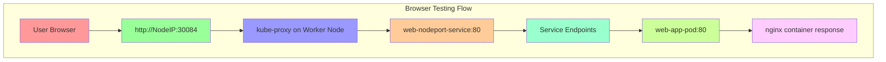
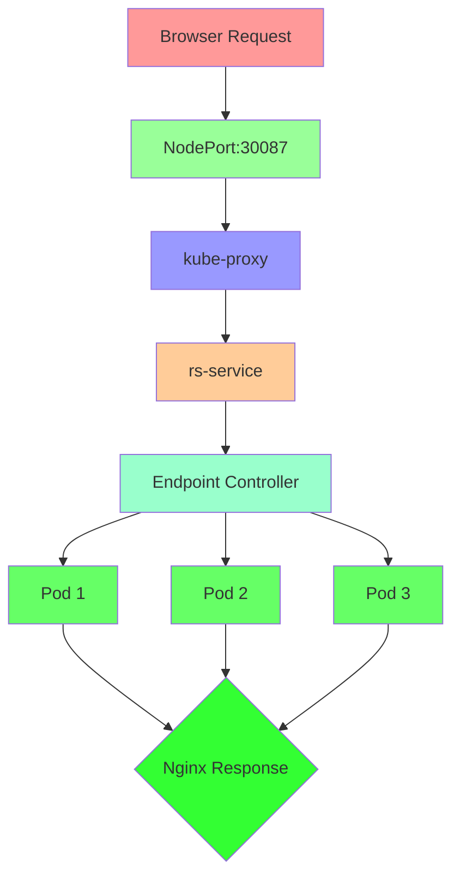
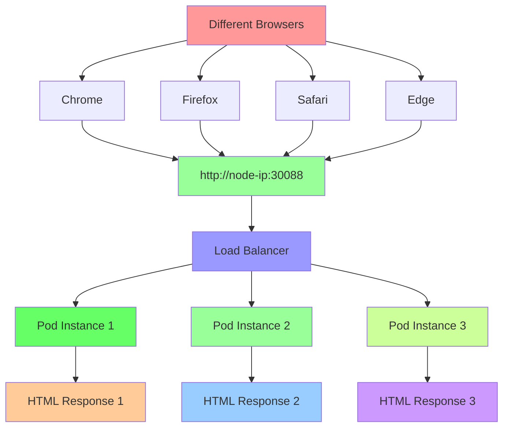
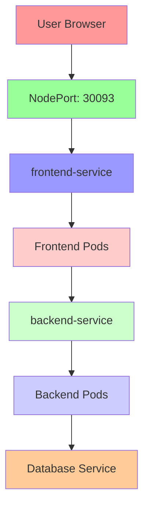

# Section 5: Kubernetes Declarative Approach (AWS EKS Masterclass)

<details open>
<summary><b>Section 5: Kubernetes Declarative Approach (AWS EKS Masterclass)</b></summary>

## Table of Contents
1. [5.1 Introduction to Kubernetes Declarative Approach](#51-introduction-to-kubernetes-declarative-approach)
2. [5.2 YAML Basics Introduction](#52-yaml-basics-introduction)
3. [5.3 Create Pods with YAML](#53-create-pods-with-yaml)
4. [5.4 Create NodePort Service with YAML and Access Application via Browser](#54-create-nodeport-service-with-yaml-and-access-application-via-browser)
5. [5.5 Create ReplicaSets using YAML](#55-create-replicasets-using-yaml)
6. [5.6 Create ReplicaSets Expose and Test via Browser](#56-create-replicasets-expose-and-test-via-browser)
7. [5.7 Create NodePort Service with YAML and Access Application via Browser](#57-create-nodeport-service-with-yaml-and-access-application-via-browser)
8. [5.8 Create Deployment with YAML and Test](#58-create-deployment-with-yaml-and-test)
9. [5.9 Frontend Application - Create Deployment and NodePort Service](#59-frontend-application---create-deployment-and-nodeport-service)
10. [5.10 Backend Application - Create Deployment and ClusterIP Service](#510-backend-application---create-deployment-and-clusterip-service)
11. [5.11 Deploy and Test - Frontend and Backend Applications](#511-deploy-and-test---frontend-and-backend-applications)

---

## 5.1 Introduction to Kubernetes Declarative Approach

### Overview
Introduction to Kubernetes declarative approach using YAML manifests, covering the transition from imperative commands to infrastructure-as-code patterns essential for production deployments.

### Key Concepts

#### Declarative vs Imperative Management
```diff
Imperative Approach:
  + Immediate command execution
  + Interactive and exploratory
  + Quick testing and debugging
  + Manual dependency management
- No infrastructure versioning
- Difficult to reproduce
- Error-prone at scale
- Manual documentation required

Declarative Approach:
  + Infrastructure as Code (IaC)
  + Version-controlled manifests
  + Reproducible deployments
  + Self-documenting systems
  + Automated dependency management
- Learning curve for YAML syntax
- Requires planning and design
- More complex for simple tasks
```

#### YAML Fundamentals for Kubernetes
```yaml
YAML Structure in Kubernetes:
  - Metadata: Resource identification
  - Spec: Desired state definition
  - Status: Current state (managed by Kubernetes)
  - Kind: Resource type (Pod, Deployment, Service)
  - API Version: Kubernetes API compatibility

Basic YAML Components:
  - Key-Value pairs
  - Arrays/Lists
  - Nested objects
  - Comments (#)
  - Indentation-based structure
```

#### Declarative Workflow Pattern
```mermaid
graph TD
    A[Design Application] --> B[Create YAML Manifests]
    B --> C[Version Control (Git)]
    C --> D[kubectl apply]
    D --> E[Kubernetes Reconciliation]
    E --> F{Manifest ≠ Actual?}
    F -->|Yes| G[Kubernetes Updates]
    F -->|No| H[Stable State]
    H --> I[Monitor & Observe]

    style A fill:#e6f3ff
    style B fill:#b3d9ff
    style C fill:#80bfff
    style D fill:#4d94ff
    style E fill:#1a75ff
    style F fill:#0052cc
    style G fill:#004499
    style H fill:#003366
    style I fill:#cc0000
```

### Repository Structure for Declarative Approach

#### Organized Manifest Directories
```yaml
kube-manifests/
├── 01-pods/                     # Individual pods
│   ├── simple-pod.yaml
│   └── pod-with-configmap.yaml
├── 02-services/                 # Service definitions
│   ├── clusterip-service.yaml
│   ├── nodeport-service.yaml
│   └── loadbalancer-service.yaml
├── 03-deployments/              # Application deployments
│   ├── frontend-deployment.yaml
│   ├── backend-deployment.yaml
│   └── api-deployment.yaml
├── 04-configs/                  # Configuration resources
│   ├── configmaps/
│   └── secrets/
├── 05-storage/                  # Storage resources
│   ├── pvc.yaml
│   └── pv.yaml
└── kustomization.yaml           # Kustomize configuration
```

#### Namespace Organization
```yaml
Recommended Namespace Structure:
  - default: Development playground
  - dev: Development environment
  - staging: Pre-production testing
  - prod: Production workloads
  - kube-system: System components
  - kube-public: Public resources
```

### Declarative Benefits Demonstrated

#### Predictable Deployments
```yaml
Predictable Deployment Characteristics:
  - Same manifest = Same result across environments
  - Manual commands cannot override declarative state
  - Kubernetes ensures continuous reconciliation
  - No configuration drift between environments
```

#### GitOps Integration
```diff
GitOps Benefits:
  + Complete infrastructure version history
  + Pull request reviews for infrastructure changes
  + Automated deployment via CI/CD pipelines
  + Rollback capability through Git history
  + Audit trail of all infrastructure modifications
```

---

## 5.2 YAML Basics Introduction

### Overview
Comprehensive introduction to YAML syntax, structure, and formatting rules essential for writing Kubernetes manifests, with practical examples and validation techniques.

### Key Concepts

#### YAML Syntax Fundamentals
```yaml
YAML Basic Structure:
  # Comments start with #
  key: value                    # Simple key-value
  array:                        # Array/List
    - item1
    - item2
  nested:                       # Nested objects
    child_key: child_value
    count: 5
```

#### Data Types in YAML
```yaml
# String values (no quotes needed for simple strings)
name: my-application
description: "Application with spaces"
multiline: |
  This is a
  multiline string

# Numeric values
replicas: 3
port: 80

# Boolean values
enabled: true
debug: false

# Null values
optional_field: null
```

#### YAML Formatting Rules
```diff
Critical YAML Rules:
  + Indentation: Use spaces, not tabs (2 or 4 spaces)
  + Consistency: Same indentation throughout document
  + Colon: Space after colon for key-value pairs
  + Arrays: Dash followed by space for list items
  + Quotes: Optional for strings except special characters
- No tabs: YAML parsers reject tab characters
- Inconsistent indentation: Causes parsing errors
- Missing spaces: After colons in key-value pairs
```

### Kubernetes YAML Structure

#### Standard Resource Structure
```yaml
# Every Kubernetes resource follows this pattern
apiVersion: <api-version>        # API version (e.g., v1, apps/v1)
kind: <resource-type>            # Resource type (Pod, Deployment, Service)
metadata:                        # Resource identification
  name: <resource-name>          # Unique name in namespace
  namespace: <namespace>         # Namespace (default if omitted)
  labels:                        # Key-value labels
    app: my-app
    tier: frontend
spec:                            # Desired state specification
  <resource-specific-fields>     # Varies by resource type
```

#### Common API Versions
```yaml
API Version Patterns:
  - v1: Core Kubernetes API (Pod, Service, ConfigMap)
  - apps/v1: Application resources (Deployment, ReplicaSet)
  - batch/v1: Job resources (Job, CronJob)
  - networking.k8s.io/v1: Networking (Ingress, NetworkPolicy)
  - rbac.authorization.k8s.io/v1: RBAC (Role, ClusterRole)
```

### YAML Validation and Tools

#### Online Validators
```yaml
Popular YAML Validators:
  - yamllint: Command-line YAML linter
  - yaml-validator.com: Online validation
  - Kubernetes YAML tools
  - VS Code YAML extensions
  - IntelliJ YAML plugin
```

#### Kubernetes Dry-Run Validation
```bash
# Validate YAML without applying
kubectl apply -f manifest.yaml --dry-run=client

# Server-side validation
kubectl apply -f manifest.yaml --dry-run=server

# Convert to JSON for validation
kubectl apply -f manifest.yaml -o json
```

### Practical YAML Examples

#### Simple Pod Manifest
```yaml
apiVersion: v1
kind: Pod
metadata:
  name: simple-pod
  labels:
    app: web
spec:
  containers:
  - name: nginx
    image: nginx:1.21
    ports:
    - containerPort: 80
```

#### Deployment Manifest
```yaml
apiVersion: apps/v1
kind: Deployment
metadata:
  name: web-deployment
  labels:
    app: web
spec:
  replicas: 3
  selector:
    matchLabels:
      app: web
  template:
    metadata:
      labels:
        app: web
    spec:
      containers:
      - name: nginx
        image: nginx:1.21
        ports:
        - containerPort: 80
        resources:
          requests:
            memory: "64Mi"
            cpu: "100m"
          limits:
            memory: "128Mi"
            cpu: "200m"
```

#### Service Manifest
```yaml
apiVersion: v1
kind: Service
metadata:
  name: web-service
  labels:
    app: web
spec:
  type: ClusterIP
  selector:
    app: web
  ports:
  - port: 80
    targetPort: 80
    protocol: TCP
```

### YAML Best Practices

#### Formatting Guidelines
```yaml
Recommended Practices:
  - Use consistent indentation (2 spaces)
  - Add comments for complex configurations
  - Use meaningful resource names
  - Include descriptive labels
  - Order fields consistently
  - Validate before committing
  - Use relative paths in mounts
```

#### Common Pitfalls to Avoid
```diff
YAML Anti-patterns:
  - Mixed tabs and spaces
  - Inconsistent indentation levels
  - Missing namespace specifications
  - Hardcoded IP addresses
  - Passwords in clear text
  - Oversized manifests
  - Unlabeled resources
  - Missing resource constraints
```

```yaml
# Example of problematic YAML
apiVersion: apps/v1
kind: Deployment
metadata:
	name: my-deployment  # Inconsistent indentation
spec:
replicas: 3            # Missing proper spacing
  selector:
    matchLabels:
		app: nginx      # Mixed tabs and spaces
  template:
    metadata:
      labels:
        app: nginx
    spec:
      containers:
      - name: nginx
        image: nginx
        ports:
        - containerPort: 80
```

---

## 5.3 Create Pods with YAML

### Overview
Hands-on creation of Kubernetes pods using YAML manifests, covering pod specification, container configuration, and validation techniques for declarative pod management.

### Key Concepts

#### Pod YAML Structure
```yaml
Essential Pod Manifest Fields:
  - apiVersion: v1 (for pods)
  - kind: Pod
  - metadata: Name, labels, namespace
  - spec: Container specifications
  - containers: Array of container definitions
  - image: Container image reference
  - ports: Container ports to expose
```

#### Multi-Container Pod Design
```yaml
Sidecar Container Patterns:
  - Application container + logging sidecar
  - Main app + monitoring agent
  - API server + configuration reloader
  - Web server + reverse proxy
```

### Lab Demo: Pod YAML Creation

#### Step 1: Create Simple Pod Manifest
```yaml
# simple-pod.yaml
apiVersion: v1
kind: Pod
metadata:
  name: simple-nginx-pod
  labels:
    app: web
    environment: demo
spec:
  containers:
  - name: nginx
    image: nginx:1.21-alpine
    ports:
    - containerPort: 80
---
# Save and apply
kubectl apply -f simple-pod.yaml

# Verify creation
kubectl get pod simple-nginx-pod -o wide
kubectl describe pod simple-nginx-pod
```

#### Step 2: Create Multi-Container Pod
```yaml
# multi-container-pod.yaml
apiVersion: v1
kind: Pod
metadata:
  name: multi-container-pod
  labels:
    app: demo-app
spec:
  containers:
  - name: nginx
    image: nginx:1.21-alpine
    ports:
    - containerPort: 80
  - name: busybox-sidecar
    image: busybox
    command: ["/bin/sh", "-c"]
    args: ["while true; do echo 'Sidecar logging at $(date)'; sleep 30; done"]
    volumeMounts:
    - name: shared-logs
      mountPath: /var/log/app
  volumes:
  - name: shared-logs
    emptyDir: {}
```

```bash
# Apply multi-container pod
kubectl apply -f multi-container-pod.yaml

# Inspect containers
kubectl get pod multi-container-pod -o jsonpath='{.spec.containers[*].name}'

# View logs from specific container
kubectl logs multi-container-pod -c busybox-sidecar -f

# Exec into specific container
kubectl exec -it multi-container-pod -c nginx -- /bin/sh
```

#### Step 3: Pod with Resource Limits
```yaml
# resource-limited-pod.yaml
apiVersion: v1
kind: Pod
metadata:
  name: resource-pod
  labels:
    app: demo
spec:
  containers:
  - name: nginx
    image: nginx:1.21-alpine
    ports:
    - containerPort: 80
    resources:
      requests:
        memory: "64Mi"
        cpu: "100m"
      limits:
        memory: "128Mi"
        cpu: "200m"
    livenessProbe:
      httpGet:
        path: /
        port: 80
      initialDelaySeconds: 30
      periodSeconds: 10
    readinessProbe:
      httpGet:
        path: /
        port: 80
      initialDelaySeconds: 5
      periodSeconds: 5
```

```bash
# Apply resource-constrained pod
kubectl apply -f resource-limited-pod.yaml

# Monitor resource usage
kubectl top pods

# Check probe status
kubectl describe pod resource-pod | grep -A 5 Probes
```

#### Step 4: Pod with Environment Variables
```yaml
# env-vars-pod.yaml
apiVersion: v1
kind: Pod
metadata:
  name: env-pod
  labels:
    app: demo
spec:
  containers:
  - name: nginx
    image: nginx:1.21-alpine
    ports:
    - containerPort: 80
    env:
    - name: APP_NAME
      value: "nginx-demo"
    - name: APP_VERSION
      value: "1.21"
    - name: ENV_TYPE
      value: "development"
    envFrom:
    - configMapRef:
        name: app-config
    command: ["/bin/sh", "-c"]
    args:
    - echo "App: $APP_NAME, Version: $APP_VERSION, Env: $ENV_TYPE" > /usr/share/nginx/html/index.html && nginx -g 'daemon off;'
---
# ConfigMap for additional env vars
apiVersion: v1
kind: ConfigMap
metadata:
  name: app-config
data:
  DATABASE_URL: "mysql://db:3306/myapp"
  REDIS_URL: "redis://cache:6379"
```

#### Step 5: Volume-Mounted Pod
```yaml
# volume-pod.yaml
apiVersion: v1
kind: Pod
metadata:
  name: volume-pod
  labels:
    app: demo
spec:
  containers:
  - name: nginx
    image: nginx:1.21-alpine
    ports:
    - containerPort: 80
    volumeMounts:
    - name: html-content
      mountPath: /usr/share/nginx/html
  volumes:
  - name: html-content
    configMap:
      name: site-content
---
# ConfigMap with HTML content
apiVersion: v1
kind: ConfigMap
metadata:
  name: site-content
data:
  index.html: |
    <!DOCTYPE html>
    <html>
    <head><title>K8s Declarative Demo</title></head>
    <body>
      <h1>Pod with ConfigMap Volume</h1>
      <p>This content is served from a ConfigMap volume mount.</p>
      <p>Timestamp: $(date)</p>
    </body>
    </html>
```

### Pod Lifecycle Validation

#### Creation Verification
```bash
# Check pod status
kubectl get pods -o wide

# Validate pod specification
kubectl get pod <pod-name> -o yaml

# Check container status
kubectl describe pod <pod-name> | grep -A 5 "Containers:"

# View pod events
kubectl get events --field-selector involvedObject.name=<pod-name>
```

#### Application Testing
```bash
# Port forward for testing
kubectl port-forward <pod-name> 8080:80

# Test via curl
curl http://localhost:8080

# Check application logs
kubectl logs <pod-name> -f

# Validate environment variables
kubectl exec <pod-name> -- env | grep -E "(APP_NAME|DATABASE_URL)"
```

### YAML Validation Techniques

#### Syntax Validation
```bash
# Client-side syntax check
kubectl apply -f pod.yaml --dry-run=client

# Server-side validation
kubectl apply -f pod.yaml --dry-run=server

# Convert to JSON for detailed validation
kubectl apply -f pod.yaml -o json --dry-run=client
```

#### Best Practices Validation
```diff
Manifest Quality Checks:
  + Labels present and meaningful
  + Resource limits defined
  + Health probes configured
  + Appropriate security context
  + No hardcoded values
- Default namespace used unnecessarily
- Privileged containers without justification
- Missing liveness/readiness probes
- Unconstrained resource usage
```

---

## 5.4 Create NodePort Service with YAML and Access Application via Browser

### Overview
Creating NodePort services using YAML manifests to provide external access to applications running in Kubernetes pods, with browser-based testing and connectivity verification.

### Key Concepts

#### NodePort Service YAML Structure
```yaml
NodePort Service Components:
  - Type specification
  - Port mappings (port, targetPort, nodePort)
  - Label selectors
  - Optional annotations
  - Service metadata
```

#### NodePort Port Allocation
```yaml
Port Types in NodePort:
  - Port: Service port (internal cluster communication)
  - TargetPort: Container port in pods
  - NodePort: External port on worker nodes (30000-32767)
```

### Lab Demo: NodePort Service Creation

#### Step 1: Create Application Pods
```yaml
# application-pod.yaml
apiVersion: v1
kind: Pod
metadata:
  name: web-app-pod
  labels:
    app: web-demo
    tier: frontend
spec:
  containers:
  - name: nginx
    image: nginx:1.21-alpine
    ports:
    - containerPort: 80
    command: ["/bin/sh", "-c"]
    args: ["echo '<h1>Web App via NodePort</h1><p>Pod: web-app-pod</p><p>Time: $(date)</p>' > /usr/share/nginx/html/index.html && nginx -g 'daemon off;'"]
```

```bash
# Deploy the application pod
kubectl apply -f application-pod.yaml

# Verify pod is running
kubectl get pod web-app-pod
kubectl logs web-app-pod
```

#### Step 2: Create NodePort Service Manifest
```yaml
# nodeport-service.yaml
apiVersion: v1
kind: Service
metadata:
  name: web-nodeport-service
  labels:
    app: web-demo
  annotations:
    description: "NodePort service for web application demo"
spec:
  type: NodePort
  selector:
    app: web-demo
    tier: frontend
  ports:
  - port: 80          # Service port
    targetPort: 80   # Pod port
    nodePort: 30084  # External node port
    protocol: TCP
    name: http
```

```bash
# Create the NodePort service
kubectl apply -f nodeport-service.yaml

# Verify service creation
kubectl get services
kubectl get svc web-nodeport-service -o wide
kubectl describe svc web-nodeport-service
```

#### Step 3: Test Service Connectivity
```bash
# Get node information
kubectl get nodes -o wide

# Extract node IP and port
NODE_IP=$(kubectl get nodes -o jsonpath='{.items[0].status.addresses[?(@.type=="ExternalIP")].address}')
NODE_PORT=$(kubectl get svc web-nodeport-service -o jsonpath='{.spec.ports[0].nodePort}')

echo "Access your application at: http://$NODE_IP:$NODE_PORT"

# Test via curl
curl -I http://$NODE_IP:$NODE_PORT

# Verify response content
curl http://$NODE_IP:$NODE_PORT
```

#### Step 4: Browser-Based Testing
```bash
# Method 1: Direct browser access
echo "Open your browser and navigate to: http://$NODE_IP:$NODE_PORT"

# Method 2: Local port forwarding for testing
kubectl port-forward svc/web-nodeport-service 8080:80

echo "Also accessible locally at: http://localhost:8080"
```



#### Step 5: Load Balancing Verification
```bash
# Create multiple pods for load balancing demo
kubectl scale pod web-app-pod --replicas=3

# Create service that matches multiple pods
kubectl expose pod web-app-pod --type=NodePort --port=80 --name=loadbalancer-demo

# Test load balancing (will distribute across matching pods)
for i in {1..10}; do
  curl -s "http://$NODE_IP:$NODE_PORT" | grep "Pod:" | head -1
  echo " - Request $i"
done
```

#### Step 6: Service DNS and Discovery Testing
```bash
# Create a test pod to verify internal DNS resolution
kubectl run dns-test --image=busybox --rm -it --restart=Never -- nslookup web-nodeport-service

# Test internal service access from another pod
kubectl run connectivity-test --image=curlimages/curl --rm -it --restart=Never -- curl web-nodeport-service

# Verify endpoints
kubectl get endpoints web-nodeport-service
kubectl describe endpoints web-nodeport-service
```

### Troubleshooting NodePort Issues

#### Common Connectivity Problems
```bash
# Service not reachable
kubectl get svc web-nodeport-service -o yaml
kubectl get endpoints web-nodeport-service

# Check if pods match service selector
kubectl get pods -l app=web-demo

# Verify node has external access
kubectl get nodes -o wide
curl -I http://<node-ip>:30084

# Check security groups/firewalls (in cloud environments)
```

#### Port Conflict Resolution
```bash
# Check if port is already in use
kubectl get svc -A | grep 30084

# Delete problematic service
kubectl delete svc <conflicting-service>

# List all services with node ports
kubectl get svc -A -o jsonpath='{range .items[?(@.spec.type=="NodePort")]}{.metadata.name}:{.spec.ports[0].nodePort}{"\n"}{end}'
```

### Advanced NodePort Configurations

#### Multiple Port Services
```yaml
# Multi-port NodePort service
apiVersion: v1
kind: Service
metadata:
  name: multi-port-service
spec:
  type: NodePort
  selector:
    app: multi-service-app
  ports:
  - name: http
    port: 80
    targetPort: 8080
    nodePort: 30085
  - name: https
    port: 443
    targetPort: 8443
    nodePort: 30443
  - name: metrics
    port: 9090
    targetPort: 9090
    nodePort: 30909
```

#### Health Check Integration
```yaml
# Service with external health checks
apiVersion: v1
kind: Service
metadata:
  name: health-checked-service
  annotations:
    service.beta.kubernetes.io/aws-load-balancer-healthcheck-path: "/health"
spec:
  type: NodePort
  selector:
    app: health-monitored-app
  ports:
  - port: 80
    targetPort: 80
    nodePort: 30086
```

### NodePort Best Practices

#### Production Considerations
```diff
+ Use for development/testing environments
+ Combine with Ingress for production external access
+ Limit node port ranges in security groups
+ Monitor service endpoints for health
- Not recommended for internet-facing production workloads
- All worker nodes expose the service
- No built-in SSL/tls termination
- Manual port management required
```

---

## 5.5 Create ReplicaSets using YAML

### Overview
Creating Kubernetes ReplicaSets using YAML manifests to ensure pod replica management, demonstrating declarative ReplicaSet specifications with proper selector and template configurations.

### Key Concepts

#### ReplicaSet YAML Structure
```yaml
ReplicaSet Manifest Components:
  - API version: apps/v1
  - Kind: ReplicaSet
  - Metadata: Name and labels
  - Spec: Replicas, selector, template
  - Selector: Match labels for owned pods
  - Template: Pod specification template
```

#### Label Selection Strategy
```yaml
Selector Requirements:
  - matchLabels: Required labels that must match
  - matchExpressions: Advanced matching rules (optional)
  - Unique selectors to avoid conflicts
  - Consistent with pod template labels
```

### Lab Demo: ReplicaSet YAML Creation

#### Step 1: Basic ReplicaSet Manifest
```yaml
# basic-replicaset.yaml
apiVersion: apps/v1
kind: ReplicaSet
metadata:
  name: nginx-rs
  labels:
    app: nginx
    version: v1
spec:
  replicas: 3
  selector:
    matchLabels:
      app: nginx
      version: v1
  template:
    metadata:
      labels:
        app: nginx
        version: v1
    spec:
      containers:
      - name: nginx
        image: nginx:1.21-alpine
        ports:
        - containerPort: 80
        resources:
          requests:
            memory: "64Mi"
            cpu: "100m"
          limits:
            memory: "128Mi"
            cpu: "200m"
```

```bash
# Create the ReplicaSet
kubectl apply -f basic-replicaset.yaml

# Verify creation
kubectl get rs
kubectl get rs nginx-rs -o wide
kubectl get pods -l app=nginx
```

#### Step 2: ReplicaSet with Advanced Selectors
```yaml
# advanced-selector-rs.yaml
apiVersion: apps/v1
kind: ReplicaSet
metadata:
  name: advanced-nginx-rs
  labels:
    app: nginx
    tier: frontend
spec:
  replicas: 2
  selector:
    matchLabels:
      app: nginx
      tier: frontend
    matchExpressions:
    - key: environment
      operator: In
      values: [dev, staging, prod]
    - key: version
      operator: NotIn
      values: [deprecated]
  template:
    metadata:
      labels:
        app: nginx
        tier: frontend
        environment: dev
        version: latest
    spec:
      containers:
      - name: nginx
        image: nginx:1.21-alpine
        ports:
        - containerPort: 80
        env:
        - name: APP_ENV
          value: "development"
        livenessProbe:
          httpGet:
            path: /
            port: 80
          initialDelaySeconds: 30
          periodSeconds: 10
```

#### Step 3: ReplicaSet with Volumes
```yaml
# volume-replicaset.yaml
apiVersion: apps/v1
kind: ReplicaSet
metadata:
  name: volume-demo-rs
spec:
  replicas: 2
  selector:
    matchLabels:
      app: volume-demo
  template:
    metadata:
      labels:
        app: volume-demo
    spec:
      containers:
      - name: nginx
        image: nginx:1.21-alpine
        ports:
        - containerPort: 80
        volumeMounts:
        - name: html-volume
          mountPath: /usr/share/nginx/html
        - name: log-volume
          mountPath: /var/log/nginx
      volumes:
      - name: html-volume
        emptyDir: {}
      - name: log-volume
        emptyDir: {}
```

#### Step 4: Multi-Container ReplicaSet
```yaml
# multi-container-rs.yaml
apiVersion: apps/v1
kind: ReplicaSet
metadata:
  name: multi-container-rs
spec:
  replicas: 2
  selector:
    matchLabels:
      app: multi-demo
  template:
    metadata:
      labels:
        app: multi-demo
    spec:
      containers:
      - name: nginx
        image: nginx:1.21-alpine
        ports:
        - containerPort: 80
      - name: sidecar
        image: busybox
        command: ["/bin/sh", "-c"]
        args:
        - |
          while true; do
            echo "$(date): Application is running" >> /shared/app.log
            sleep 60
          done
        volumeMounts:
        - name: shared-logs
          mountPath: /shared
      volumes:
      - name: shared-logs
        emptyDir: {}
```

### ReplicaSet Operations and Scaling

#### Scaling Operations
```bash
# Scale via kubectl (updates manifest temporarily)
kubectl scale rs nginx-rs --replicas=5

# Edit ReplicaSet for permanent change
kubectl edit rs nginx-rs

# Verify scaling
kubectl get rs nginx-rs
kubectl get pods -l app=nginx
```

#### Replica Management Validation
```bash
# Check ReplicaSet status details
kubectl describe rs nginx-rs

# View ReplicaSet events
kubectl get events --field-selector involvedObject.name=nginx-rs

# Monitor pod lifecycle
kubectl get pods -l app=nginx -w
```

#### ReplicaSet Update Patterns
```yaml
Updating ReplicaSet Template:
  1. Direct manifest edit (kubectl edit)
  2. Delete and recreate (downtime)
  3. Use Deployment for rolling updates
  4. Strategic pod termination for replacement
```

### ReplicaSet Ownership and Adoption

#### Pod Adoption Rules
```yaml
Pod Adoption Conditions:
  - Pod labels match ReplicaSet selector exactly
  - Pod not owned by another controller
  - Pod running state doesn't matter
  - ReplicaSet takes ownership immediately
```

```bash
# Create pods that match ReplicaSet selector
kubectl run manual-pod --image=nginx --labels="app=nginx,version=v1"

# ReplicaSet adopts the pod
kubectl get rs nginx-rs
kubectl describe rs nginx-rs
```

#### Orphan Pod Handling
```bash
# Scale down to see orphaned pods (beyond desired count stay running)
kubectl scale rs nginx-rs --replicas=1

# List all pods with matching labels
kubectl get pods -l app=nginx

# Remove ReplicaSet but keep pods
kubectl delete rs nginx-rs --cascade=orphan
```

### Troubleshooting ReplicaSet Issues

#### Common Problems and Solutions
```bash
# ReplicaSet not creating pods
kubectl describe rs <rs-name>
kubectl get events --field-selector involvedObject.name=<rs-name>

# Pod creation failures
kubectl describe pod <pod-name>
kubectl logs <pod-name> --previous

# Selector mismatch
kubectl get rs <rs-name> -o yaml | grep -A 5 selector
kubectl get pods --show-labels | grep <app-label>

# Resource constraints
kubectl describe nodes
kubectl get pods -l <app-label> -o jsonpath='{.status.phase}'
```

#### Replication Issues
```bash
# Check current vs desired replicas
kubectl get rs <rs-name> -o jsonpath='{.status.replicas}{" "}{.spec.replicas}{"\n"}'

# View failed pod creation attempts
kubectl get events --field-selector involvedObject.kind=ReplicaSet

# Check pod disruption budgets
kubectl get pdb
```

---

## 5.6 Create ReplicaSets Expose and Test via Browser

### Overview
Creating ReplicaSets with external services for browser-based testing, demonstrating load balancing across multiple pods and service traffic distribution validation.

### Key Concepts

#### ReplicaSet + Service Integration
```yaml
Complete Application Stack:
  - ReplicaSet: Pod replica management
  - Service: Network abstraction and load balancing
  - External Access: Browser connectivity testing
  - Traffic Distribution: Request routing validation
```

#### Service Discovery and Load Balancing


### Lab Demo: Complete ReplicaSet Application

#### Step 1: Create ReplicaSet with Unique Identity
```yaml
# rs-with-identity.yaml
apiVersion: apps/v1
kind: ReplicaSet
metadata:
  name: web-rs-browser
  labels:
    app: web-browser-demo
spec:
  replicas: 3
  selector:
    matchLabels:
      app: web-browser-demo
  template:
    metadata:
      labels:
        app: web-browser-demo
    spec:
      containers:
      - name: nginx
        image: nginx:1.21-alpine
        ports:
        - containerPort: 80
        command: ["/bin/sh", "-c"]
        args:
        - |
          HOSTNAME=$(hostname)
          cat > /usr/share/nginx/html/index.html << EOF
          <html>
          <head><title>ReplicaSet Browser Demo</title></head>
          <body>
            <h1>Hello from ReplicaSet!</h1>
            <p>Pod Hostname: <strong>${HOSTNAME}</strong></p>
            <p>ReplicaSet: web-rs-browser</p>
            <p>Request served at: $(date)</p>
            <p>Container Image: nginx:1.21-alpine</p>
          </body>
          </html>
          EOF
          nginx -g 'daemon off;'
        resources:
          requests:
            memory: "64Mi"
            cpu: "100m"
          limits:
            memory: "128Mi"
            cpu: "200m"
```

```bash
# Deploy the ReplicaSet
kubectl apply -f rs-with-identity.yaml

# Verify pod creation and uniqueness
kubectl get pods -l app=web-browser-demo -o wide
kubectl logs -l app=web-browser-demo --tail=5
```

#### Step 2: Create Service for External Access
```yaml
# rs-service.yaml
apiVersion: v1
kind: Service
metadata:
  name: web-rs-service
  labels:
    app: web-browser-demo
spec:
  type: NodePort
  selector:
    app: web-browser-demo
  ports:
  - port: 80
    targetPort: 80
    nodePort: 30087
    protocol: TCP
    name: http
```

```bash
# Create the service
kubectl apply -f rs-service.yaml

# Verify service and endpoints
kubectl get svc web-rs-service -o wide
kubectl get endpoints web-rs-service
kubectl describe svc web-rs-service
```

#### Step 3: Browser Testing Preparation
```bash
# Get access information
NODE_IP=$(kubectl get nodes -o jsonpath='{.items[0].status.addresses[?(@.type=="ExternalIP")].address}')
NODE_PORT=$(kubectl get svc web-rs-service -o jsonpath='{.spec.ports[0].nodePort}')

echo "================================="
echo "Browser Testing Information:"
echo "================================="
echo "URL: http://$NODE_IP:$NODE_PORT"
echo "Expected: Nginx welcome page with pod hostname"
echo "Load Balancing: Should see different pod hostnames"
echo ""

# Local testing option
echo "For local testing, run:"
echo "kubectl port-forward svc/web-rs-service 8080:80"
echo "Then visit: http://localhost:8080"
```

#### Step 4: Load Balancing Demonstration
```bash
# Automated load balancing test
echo "Testing load balancing across pods..."

for i in {1..9}; do
  response=$(curl -s "http://$NODE_IP:$NODE_PORT")
  hostname=$(echo "$response" | grep -o 'Pod Hostname: [^<]*' | cut -d' ' -f3)
  echo "Request $i -> $hostname"
  sleep 1
done

# Count distribution
echo -e "\nDistribution Summary:"
curl -s "http://$NODE_IP:$NODE_PORT" > /dev/null && echo "Web service is responding"
```

#### Step 5: Scaling Demonstration
```bash
# Scale ReplicaSet to show dynamic updates
echo "Scaling ReplicaSet to 5 replicas..."
kubectl scale rs web-rs-browser --replicas=5

# Wait for new pods
kubectl wait --for=condition=ready --timeout=60s pod -l app=web-browser-demo --all

# Test again with more pods
echo "Testing load balancing with 5 pods..."
for i in {1..10}; do
  response=$(curl -s "http://$NODE_IP:$NODE_PORT")
  hostname=$(echo "$response" | grep -o 'Pod Hostname: [^<]*' | cut -d' ' -f3)
  echo "Request $i -> $hostname"
done

# Scale back
kubectl scale rs web-rs-browser --replicas=3
echo "Scaled back to 3 replicas"
```

#### Step 6: Failure Recovery Testing
```bash
# Delete a pod to test ReplicaSet self-healing
ORIGINAL_PODS=$(kubectl get pods -l app=web-browser-demo --no-headers | wc -l)
echo "Original pod count: $ORIGINAL_PODS"

# Delete one pod
kubectl delete pod $(kubectl get pods -l app=web-browser-demo -o jsonpath='{.items[0].metadata.name}')

# Wait for replacement
kubectl wait --for=condition=ready --timeout=30s pod -l app=web-browser-demo --all

# Verify counts
NEW_PODS=$(kubectl get pods -l app=web-browser-demo --no-headers | wc -l)
echo "Pod count after deletion: $NEW_PODS"

# Test continuity during replacement
echo "Testing service availability during pod replacement..."
for i in {1..5}; do
  curl -s "http://$NODE_IP:$NODE_PORT" > /dev/null && echo "Request $i: Service available" || echo "Request $i: Service unavailable"
  sleep 2
done
```

### Advanced Browser Testing Scenarios

#### Multi-Browser Session Testing
```bash
# Simulate multiple user sessions
echo "Opening multiple browser sessions..."

# Terminal 1: Continuous requests
(
  for i in {1..20}; do
    curl -s "http://$NODE_IP:$NODE_PORT" > /dev/null
    echo "Tab 1 - Request $i completed"
    sleep 3
  done
) &

# Terminal 2: Monitor pod logs
kubectl logs -l app=web-browser-demo -f --tail=1

# Terminal 3: Scale during testing
sleep 10 && kubectl scale rs web-rs-browser --replicas=4
```

#### Performance Testing Browser Simulation
```bash
# Apache Bench simulation of browser requests
ab -n 100 -c 5 "http://$NODE_IP:$NODE_PORT/"

# Monitor resource usage during load
kubectl top pods -l app=web-browser-demo

# Check for pod restarts during load
kubectl get pods -l app=web-browser-demo
```

### Troubleshooting Browser Access Issues

#### Connectivity Problems
```bash
# Test service endpoints
kubectl get endpoints web-rs-service
kubectl describe endpoints web-rs-service

# Check pod readiness
kubectl get pods -l app=web-browser-demo
kubectl describe pod $(kubectl get pods -l app=web-browser-demo -o jsonpath='{.items[0].metadata.name}')

# Verify service selector match
kubectl get rs web-rs-browser -o yaml | grep -A 5 selector
kubectl get svc web-rs-service -o yaml | grep -A 5 selector

# Test direct pod access
kubectl exec -it $(kubectl get pods -l app=web-browser-demo -o jsonpath='{.items[0].metadata.name}') -- curl localhost
```

#### Browser-Specific Issues
```bash
# Clear browser cache and try again
# Check for JavaScript console errors
# Test with different browsers (Chrome, Firefox, Safari)
# Verify firewall/proxy settings
# Test with incognito/private mode to avoid cache

# Debug network path
curl -v "http://$NODE_IP:$NODE_PORT"
nmap -p $NODE_PORT $NODE_IP
```

### Best Practices for Production Readiness

#### Service Configuration
```yaml
Production Service Annotations:
  - service.beta.kubernetes.io/aws-load-balancer-type: alb
  - service.beta.kubernetes.io/aws-load-balancer-ssl-cert: <cert-arn>
  - service.beta.kubernetes.io/aws-load-balancer-healthcheck-path: /health
  - service.beta.kubernetes.io/aws-load-balancer-target-group-attributes: stickiness.enabled=true
```

#### Monitoring and Observability
```yaml
Essential Monitoring:
  - Pod resource usage and limits
  - Service endpoint health
  - Request latency and throughput
  - Error rates and status codes
  - ReplicaSet scaling events
```

---

## 5.7 Create NodePort Service with YAML and Access Application via Browser

### Overview
Creating NodePort services using YAML manifests for comprehensive browser-based testing, including advanced service configurations, load balancing verification, and production-ready considerations.

### Key Concepts

#### Advanced NodePort Service Design
```yaml
NodePort Service Features:
  - External port range: 30000-32767
  - Load balancing across endpoints
  - Service discovery integration
  - Multi-port support capabilities
  - Session affinity options
```

#### Service Template for NodePort
```yaml
apiVersion: v1
kind: Service
metadata:
  name: <service-name>
  labels:
    app: <application-name>
  annotations:
    # Optional annotations for enhanced functionality
spec:
  type: NodePort
  selector:
    app: <application-name>  # Must match pod labels
  ports:
  - name: http
    port: 80          # Service port (internal)
    targetPort: 8080  # Container port
    nodePort: 30088   # External port (optional, auto-assigned if omitted)
    protocol: TCP
```

### Lab Demo: Advanced NodePort Implementation

#### Step 1: Complete Multi-Pod Application Setup
```yaml
# multi-pod-app.yaml
apiVersion: v1
kind: Pod
metadata:
  name: app-pod-1
  labels:
    app: multi-browser-app
    instance: one
spec:
  containers:
  - name: httpd
    image: httpd:2.4-alpine
    ports:
    - containerPort: 80
    command: ["/bin/sh", "-c"]
    args: ["echo '<h1>Pod Instance One</h1><p>Hostname: $(hostname)</p><p>Time: $(date)</p>' > /usr/local/apache2/htdocs/index.html && httpd-foreground"]
---
apiVersion: v1
kind: Pod
metadata:
  name: app-pod-2
  labels:
    app: multi-browser-app
    instance: two
spec:
  containers:
  - name: httpd
    image: httpd:2.4-alpine
    ports:
    - containerPort: 80
    command: ["/bin/sh", "-c"]
    args: ["echo '<h1>Pod Instance Two</h1><p>Hostname: $(hostname)</p><p>Time: $(date)</p>' > /usr/local/apache2/htdocs/index.html && httpd-foreground"]
---
apiVersion: v1
kind: Pod
metadata:
  name: app-pod-3
  labels:
    app: multi-browser-app
    instance: three
spec:
  containers:
  - name: httpd
    image: httpd:2.4-alpine
    ports:
    - containerPort: 80
    command: ["/bin/sh", "-c"]
    args: ["echo '<h1>Pod Instance Three</h1><p>Hostname: $(hostname)</p><p>Time: $(date)</p>' > /usr/local/apache2/htdocs/index.html && httpd-foreground"]
```

```bash
# Deploy multi-pod application
kubectl apply -f multi-pod-app.yaml

# Verify all pods are running
kubectl get pods -l app=multi-browser-app -o wide
```

#### Step 2: Create Advanced NodePort Service
```yaml
# advanced-nodeport-service.yaml
apiVersion: v1
kind: Service
metadata:
  name: multi-app-service
  labels:
    app: multi-browser-app
    service-type: nodeport-external
  annotations:
    description: "Advanced NodePort service for multi-pod browser testing"
    service.beta.kubernetes.io/aws-load-balancer-healthcheck-path: "/health"
spec:
  type: NodePort
  selector:
    app: multi-browser-app  # Matches all three pods
  ports:
  - name: http
    port: 80          # Service virtual port
    targetPort: 80   # Container port in pods
    nodePort: 30088  # External port on all nodes
    protocol: TCP
  sessionAffinity: None  # Load balancing mode
---
# Health check endpoint (optional)
apiVersion: v1
kind: ConfigMap
metadata:
  name: health-config
data:
  health.html: |
    <html><body><h1>Health Check OK</h1><p>Status: Healthy</p></body></html>
```

```bash
# Create the service
kubectl apply -f advanced-nodeport-service.yaml

# Verify service creation and endpoints
kubectl get svc multi-app-service -o wide
kubectl get endpoints multi-app-service

# Confirm all pods are registered as endpoints
kubectl describe svc multi-app-service
```

#### Step 3: Comprehensive Browser Testing
```bash
# Get access details
NODE_IP=$(kubectl get nodes -o jsonpath='{.items[0].status.addresses[?(@.type=="ExternalIP")].address}')
NODE_PORT=$(kubectl get svc multi-app-service -o jsonpath='{.spec.ports[0].nodePort}')

echo "=========================================="
echo "Advanced Browser Testing Setup"
echo "=========================================="
echo "Main URL: http://$NODE_IP:$NODE_PORT"
echo ""
echo "Testing Commands:"
echo "curl http://$NODE_IP:$NODE_PORT"
echo "kubectl port-forward svc/multi-app-service 8080:80"
echo ""

# Automated load testing
echo "Load Balancing Test (12 requests):"
for i in {1..12}; do
  response=$(curl -s "http://$NODE_IP:$NODE_PORT")
  instance=$(echo "$response" | grep -o 'Instance [A-Z]*' | head -1)
  hostname=$(echo "$response" | grep -o 'Hostname: [^<]*' | cut -d' ' -f2)
  echo "Request $i -> $instance (Pod: $hostname)"
  sleep 0.5
done

# Distribution analysis
echo -e "\nInstance Distribution:"
curl -s "http://$NODE_IP:$NODE_PORT" | grep -c "Instance One" && echo "Instance One responses found"
curl -s "http://$NODE_IP:$NODE_PORT" | grep -c "Instance Two" && echo "Instance Two responses found"
curl -s "http://$NODE_IP:$NODE_PORT" | grep -c "Instance Three" && echo "Instance Three responses found"
```

#### Step 4: Browser Compatibility Testing


#### Step 5: Multi-Node Testing (if available)
```bash
# Test across all cluster nodes
kubectl get nodes -o wide

echo "Testing across multiple nodes:"
for node in $(kubectl get nodes -o jsonpath='{.items[*].status.addresses[?(@.type=="ExternalIP")].address}'); do
  echo "Testing node: $node"
  curl -s --connect-timeout 5 "http://$node:$NODE_PORT" | head -2 || echo "Node $node not accessible"
  echo "---"
done
```

#### Step 6: Session Affinity Testing
```yaml
# Optional: Test session affinity
apiVersion: v1
kind: Service
metadata:
  name: sticky-service
spec:
  type: NodePort
  selector:
    app: multi-browser-app
  ports:
  - port: 80
    targetPort: 80
    nodePort: 30089
  sessionAffinity: ClientIP  # Routes same client to same pod
  sessionAffinityConfig:
    clientIP:
      timeoutSeconds: 300
```

### Advanced Service Configurations

#### Multi-Port Service Setup
```yaml
# Multi-port NodePort service
apiVersion: v1
kind: Service
metadata:
  name: multi-port-app-service
spec:
  type: NodePort
  selector:
    app: multi-browser-app
  ports:
  - name: http
    port: 80
    targetPort: 80
    nodePort: 30088
  - name: https
    port: 443
    targetPort: 8443
    nodePort: 30443
  - name: metrics
    port: 9090
    targetPort: 9090
    nodePort: 30909
    protocol: TCP
```

#### Service with Custom External IPs
```yaml
# Service with external IPs (if supported by cluster)
apiVersion: v1
kind: Service
metadata:
  name: external-ip-service
spec:
  type: NodePort
  externalIPs:
  - 192.168.1.100  # External IP accessible to clients
  selector:
    app: multi-browser-app
  ports:
  - port: 80
    targetPort: 80
    nodePort: 30090
```

### Monitoring and Troubleshooting

#### Service Health Monitoring
```bash
# Continuous service monitoring
watch -n 2 kubectl get svc multi-app-service,endpoints multi-app-service

# Pod health across the service
kubectl get pods -l app=multi-browser-app --watch

# Service events
kubectl get events --field-selector involvedObject.name=multi-app-service --watch

# Load balancer logs (if applicable)
kubectl logs -n kube-system -l component=kube-proxy --tail=50 -f
```

#### Performance Analysis
```bash
# Service performance metrics
kubectl top pods -l app=multi-browser-app

# Network throughput testing
hey -n 1000 -c 10 "http://$NODE_IP:$NODE_PORT"

# Latency analysis
curl -w "@curl-format.txt" -o /dev/null -s "http://$NODE_IP:$NODE_PORT"
```

### Production Readiness Assessment

#### Service Security Considerations
```diff
Production Security Checklist:
  + NodePort ports restricted in security groups
  + TLS termination configured (SSL certs)
  + Rate limiting implemented
  + Authentication/authorization enabled
  + Audit logging configured
- Direct internet exposure of NodePorts
- Unencrypted traffic over public interfaces
- Missing network policies
- Unmonitored service access
```

#### Scalability and Reliability
```yaml
Production Scaling Configurations:
  - Horizontal Pod Autoscaler (HPA)
  - Pod Disruption Budgets (PDB)
  - Anti-affinity rules for pod distribution
  - Resource requests and limits
  - Readiness and liveness probes
```

---

## 5.8 Create Deployment with YAML and Test

### Overview
Creating Kubernetes Deployments using YAML manifests for complete application lifecycle management, including deployment, testing, scaling, and rolling update capabilities.

### Key Concepts

#### Deployment YAML Manifest Structure
```yaml
Complete Deployment Specification:
  - API version and kind for Deployment
  - Strategic metadata management
  - Replica count and scaling configuration
  - Rolling update strategy parameters
  - Pod template with container specifications
  - Label selectors for pod management
```

#### Deployment Strategy Options
```yaml
Rolling Update Parameters:
  - maxUnavailable: Maximum pods unavailable during update
  - maxSurge: Maximum pods created above desired count
  - minReadySeconds: Minimum ready time for pod availability
  - progressDeadlineSeconds: Update timeout before rollback
```

### Lab Demo: Complete Deployment Lifecycle

#### Step 1: Create Basic Deployment Manifest
```yaml
# basic-deployment.yaml
apiVersion: apps/v1
kind: Deployment
metadata:
  name: web-deployment-demo
  labels:
    app: web-app-deploy
    version: v1.0
spec:
  replicas: 3
  strategy:
    type: RollingUpdate
    rollingUpdate:
      maxUnavailable: 1
      maxSurge: 1
  selector:
    matchLabels:
      app: web-app-deploy
  template:
    metadata:
      labels:
        app: web-app-deploy
        version: v1.0
    spec:
      containers:
      - name: nginx
        image: nginx:1.20-alpine
        ports:
        - containerPort: 80
        command: ["/bin/sh", "-c"]
        args: ["echo '<h1>Deployment v1.0</h1><p>Pod: $(hostname)</p><p>Image: nginx:1.20-alpine</p>' > /usr/share/nginx/html/index.html && nginx -g 'daemon off;'"]
        resources:
          requests:
            memory: "64Mi"
            cpu: "100m"
          limits:
            memory: "128Mi"
            cpu: "200m"
        livenessProbe:
          httpGet:
            path: /
            port: 80
          initialDelaySeconds: 30
          periodSeconds: 10
        readinessProbe:
          httpGet:
            path: /
            port: 80
          initialDelaySeconds: 5
          periodSeconds: 5
---
# Associated service for testing
apiVersion: v1
kind: Service
metadata:
  name: web-deployment-service
spec:
  type: NodePort
  selector:
    app: web-app-deploy
  ports:
  - port: 80
    targetPort: 80
    nodePort: 30091
```

```bash
# Create the deployment
kubectl apply -f basic-deployment.yaml

# Monitor deployment rollout
kubectl rollout status deployment/web-deployment-demo

# Verify deployment and pods
kubectl get deployments
kubectl get rs -l app=web-app-deploy
kubectl get pods -l app=web-app-deploy -o wide
```

#### Step 2: Test Basic Deployment Functionality
```bash
# Get service access information
NODE_IP=$(kubectl get nodes -o jsonpath='{.items[0].status.addresses[?(@.type=="ExternalIP")].address}')
NODE_PORT=$(kubectl get svc web-deployment-service -o jsonpath='{.spec.ports[0].nodePort}')

echo "Access deployment at: http://$NODE_IP:$NODE_PORT"

# Test load balancing
for i in {1..5}; do
  response=$(curl -s "http://$NODE_IP:$NODE_PORT")
  version=$(echo "$response" | grep -o 'v[0-9]\.[0-9]')
  echo "Request $i: $version"
done

# Verify deployment health
kubectl describe deployment web-deployment-demo
kubectl get deployment web-deployment-demo -o wide
```

#### Step 3: Deployment Scaling Demonstration
```bash
# Scale up the deployment
kubectl scale deployment web-deployment-demo --replicas=5

# Monitor scaling
kubectl get pods -l app=web-app-deploy -w

# Test load distribution with more replicas
for i in {1..10}; do
  response=$(curl -s "http://$NODE_IP:$NODE_PORT")
  pod_name=$(echo "$response" | grep -o 'Pod: [^<]*' | cut -d' ' -f2)
  echo "Request $i -> $pod_name"
done

# Scale back to original size
kubectl scale deployment web-deployment-demo --replicas=3
```

#### Step 4: Rolling Update via kubectl set image
```bash
# Update image with set image (triggers rolling update)
kubectl set image deployment/web-deployment-demo nginx=nginx:1.21-alpine

# Monitor rollout
kubectl rollout status deployment/web-deployment-demo -w

# Verify new version
for i in {1..3}; do
  response=$(curl -s "http://$NODE_IP:$NODE_PORT")
  image=$(echo "$response" | grep -o 'nginx:[^<]*')
  echo "Pod check $i: $image"
done

# Check rollout history
kubectl rollout history deployment/web-deployment-demo
```

#### Step 5: Manual Deployment Edit
```bash
# Edit deployment for advanced testing
kubectl edit deployment web-deployment-demo

# Possible changes:
# - Change replica count
# - Update resource limits
# - Add environment variables
# - Modify health probes
# - Update labels

# Save changes and monitor
kubectl rollout status deployment/web-deployment-demo
```

#### Step 6: Rolling Update with YAML Changes
```yaml
# updated-deployment.yaml
apiVersion: apps/v1
kind: Deployment
metadata:
  name: web-deployment-demo
  labels:
    app: web-app-deploy
    version: v2.0
spec:
  replicas: 4
  strategy:
    type: RollingUpdate
    rollingUpdate:
      maxUnavailable: 2
      maxSurge: 2
  selector:
    matchLabels:
      app: web-app-deploy
  template:
    metadata:
      labels:
        app: web-app-deploy
        version: v2.0
    spec:
      containers:
      - name: nginx
        image: nginx:1.21-alpine
        ports:
        - containerPort: 80
        command: ["/bin/sh", "-c"]
        args: ["echo '<h1>Deployment v2.0</h1><p>Pod: $(hostname)</p><p>Image: nginx:1.21-alpine</p><p>Enhanced: Yes</p>' > /usr/share/nginx/html/index.html && nginx -g 'daemon off;'"]
        env:
        - name: VERSION
          value: "2.0"
        resources:
          requests:
            memory: "128Mi"
            cpu: "200m"
          limits:
            memory: "256Mi"
            cpu: "400m"
```

```bash
# Apply updated deployment
kubectl apply -f updated-deployment.yaml

# Watch rollout with progress
kubectl rollout status deployment/web-deployment-demo --watch

# Monitor pod replacement strategy
kubectl get pods -l app=web-app-deploy -w

# Verify new version content
curl -s "http://$NODE_IP:$NODE_PORT" | grep -E "(v2\.0|Enhanced)"
```

### Deployment Troubleshooting and Validation

#### Deployment Status Analysis
```bash
# Detailed deployment status
kubectl describe deployment web-deployment-demo

# Check deployment conditions
kubectl get deployment web-deployment-demo -o yaml | jq '.status.conditions'

# View deployment events
kubectl get events --field-selector involvedObject.name=web-deployment-demo --sort-by=.metadata.creationTimestamp

# Check ReplicaSet status
kubectl get rs -l app=web-app-deploy -o wide
```

#### Rollout Issue Diagnosis
```bash
# Monitor stuck rollout
kubectl rollout status deployment/web-deployment-demo --timeout=120s

# Check pod readiness issues
kubectl get pods -l app=web-app-deploy
kubectl describe pod <problematic-pod>

# Check image pull issues
kubectl get pods -l app=web-app-deploy -o jsonpath='{.items[*].status.containerStatuses[*].state}' | jq

# Node resource constraints
kubectl describe nodes
kubectl top nodes
```

#### Advanced Deployment Testing
```bash
# Test deployment resilience
kubectl delete pod $(kubectl get pods -l app=web-app-deploy -o jsonpath='{.items[0].metadata.name}')

# Wait for self-healing
kubectl get pods -l app=web-app-deploy -w

# Test service continuity
watch -n 2 curl -s "http://$NODE_IP:$NODE_PORT" | grep "Deployment"
```

### Deployment Best Practices Demonstration

#### Resource Management
```yaml
Resource Planning Best Practices:
  - Set appropriate resource requests and limits
  - Plan for burst capacity during updates
  - Monitor resource usage patterns
  - Configure horizontal pod autoscaling
```

#### Update Strategy Optimization
```diff
Rolling Update Strategy Optimization:
  + Match maxUnavailable with service capacity
  + Set maxSurge based on cluster resources
  + Configure readiness probes properly
  + Set appropriate progress deadlines
  + Test strategies in staging first
- Overly aggressive surge settings
- Insufficient unavailable tolerance
- Missing health probe configurations
- No update strategy testing
```

---

## 5.9 Frontend Application - Create Deployment and NodePort Service

### Overview
Creating a complete frontend application using Kubernetes Deployment and NodePort service, demonstrating real-world application deployment patterns with proper service integration.

### Key Concepts

#### Frontend Application Architecture
```yaml
Frontend Deployment Pattern:
  - Single replica for simplicity
  - NodePort service for external access
  - Dedicated container resources
  - Health probes for reliability
  - Environment-specific configuration
```

#### Service Integration Strategy
```yaml
Frontend Service Design:
  - NodePort for browser access
  - Single port mapping (HTTP default)
  - Selective pod targeting
  - External DNS integration potential
```

### Lab Demo: Frontend Application Stack

#### Step 1: Frontend Deployment Manifest
```yaml
# frontend-deployment.yaml
apiVersion: apps/v1
kind: Deployment
metadata:
  name: frontend-app
  labels:
    app: frontend
    tier: presentation
    component: web-ui
spec:
  replicas: 2  # Small number for demo
  strategy:
    type: RollingUpdate
    rollingUpdate:
      maxUnavailable: 1
      maxSurge: 1
  selector:
    matchLabels:
      app: frontend
  template:
    metadata:
      labels:
        app: frontend
        tier: presentation
      annotations:
        description: "Frontend web application serving user interface"
    spec:
      containers:
      - name: frontend
        image: nginx:1.21-alpine
        ports:
        - containerPort: 80
          name: http
          protocol: TCP
        command: ["/bin/sh", "-c"]
        args:
        - |
          cat > /usr/share/nginx/html/index.html << 'EOF'
          <!DOCTYPE html>
          <html lang="en">
          <head>
              <meta charset="UTF-8">
              <meta name="viewport" content="width=device-width, initial-scale=1.0">
              <title>Frontend Application</title>
              <style>
                  body { font-family: Arial, sans-serif; margin: 40px; background-color: #f4f4f4; }
                  .container { max-width: 800px; margin: 0 auto; background: white; padding: 20px; border-radius: 8px; }
                  h1 { color: #333; text-align: center; }
                  .info { background: #e8f4f8; padding: 10px; margin: 10px 0; border-radius: 4px; }
                  .status { color: #28a745; font-weight: bold; }
              </style>
          </head>
          <body>
              <div class="container">
                  <h1>🚀 Frontend Application</h1>
                  <div class="info">
                      <strong>Application:</strong> Frontend Web UI<br>
                      <strong>Pod:</strong> <span id="pod-name"><!--HOSTNAME--></span><br>
                      <strong>Version:</strong> 1.0.0<br>
                      <strong>Environment:</strong> Development<br>
                      <strong>Status:</strong> <span class="status">✅ Running</span>
                  </div>
                  <div class="info">
                      <strong>Services Available:</strong><br>
                      • API endpoints for data operations<br>
                      • User authentication and session management<br>
                      • Real-time notifications<br>
                      • File upload and processing
                  </div>
                  <div class="info">
                      <strong>Backend Communication:</strong><br>
                      Ready to connect with backend services
                  </div>
              </div>
              <script>
                  // Set pod hostname
                  document.getElementById('pod-name').textContent = window.location.hostname || 'frontend-pod';
              </script>
          </body>
          </html>
          EOF

          # Replace placeholder with actual hostname
          sed -i "s|<!--HOSTNAME-->|$(hostname)|g" /usr/share/nginx/html/index.html

          nginx -g 'daemon off;'
        resources:
          requests:
            memory: "64Mi"
            cpu: "100m"
          limits:
            memory: "128Mi"
            cpu: "200m"
        livenessProbe:
          httpGet:
            path: /
            port: http
          initialDelaySeconds: 30
          periodSeconds: 10
          timeoutSeconds: 5
          failureThreshold: 3
        readinessProbe:
          httpGet:
            path: /
            port: http
          initialDelaySeconds: 5
          periodSeconds: 5
          timeoutSeconds: 3
          failureThreshold: 2
        env:
        - name: APP_NAME
          value: "frontend-app"
        - name: APP_ENV
          value: "development"
        - name: NGINX_PORT
          value: "80"
```

```bash
# Create frontend deployment
kubectl apply -f frontend-deployment.yaml

# Monitor deployment rollout
kubectl rollout status deployment/frontend-app

# Check deployment status
kubectl get deployment frontend-app -o wide
kubectl get pods -l app=frontend -o wide
```

#### Step 2: Frontend NodePort Service
```yaml
# frontend-service.yaml
apiVersion: v1
kind: Service
metadata:
  name: frontend-service
  labels:
    app: frontend
    tier: presentation
    service: web-ui
  annotations:
    description: "NodePort service for frontend web application"
spec:
  type: NodePort
  selector:
    app: frontend  # Matches deployment labels
  ports:
  - name: http
    port: 80        # Service port
    targetPort: 80  # Container port
    nodePort: 30092 # External node port
    protocol: TCP
  sessionAffinity: None  # No sticky sessions
---
# Optional: Health check endpoint
apiVersion: v1
kind: ConfigMap
metadata:
  name: frontend-health
data:
  health.html: |
    <html>
    <body>
    <h1>Frontend Health Check</h1>
    <p>Status: OK</p>
    <p>Version: 1.0.0</p>
    <p>Timestamp: $(date)</p>
    </body>
    </html>
```

```bash
# Create frontend service
kubectl apply -f frontend-service.yaml

# Verify service creation
kubectl get svc frontend-service -o wide
kubectl get endpoints frontend-service

# Check service connectivity
kubectl describe svc frontend-service
```

#### Step 3: Frontend Application Testing
```bash
# Get access information
NODE_IP=$(kubectl get nodes -o jsonpath='{.items[0].status.addresses[?(@.type=="ExternalIP")].address}')
NODE_PORT=$(kubectl get svc frontend-service -o jsonpath='{.spec.ports[0].nodePort}')

echo "======================================================"
echo "Frontend Application Access Information"
echo "======================================================"
echo "URL: http://$NODE_IP:$NODE_PORT"
echo "Service: frontend-service (NodePort)"
echo "Pods: $(kubectl get pods -l app=frontend --no-headers | wc -l) running"
echo ""

# Test application access
echo "Testing application access:"
curl -s "http://$NODE_IP:$NODE_PORT" | grep -E "(Frontend Application|Pod:|Version:)"
echo ""

# Test load balancing
echo "Load balancing test:"
for i in {1..4}; do
  response=$(curl -s "http://$NODE_IP:$NODE_PORT")
  pod=$(echo "$response" | grep -o 'frontend-pod-[^<]*' || echo "unknown")
  echo "Request $i: $pod"
done
```

#### Step 4: Advanced Frontend Testing
```bash
# Port forward for local testing
kubectl port-forward svc/frontend-service 8080:80 &
echo "Local access: http://localhost:8080"
sleep 2

# Test application features
curl -s http://localhost:8080 | grep -c "Frontend Application" && echo "✅ Application loaded"
curl -s http://localhost:8080 | grep -c "🚀" && echo "✅ UI elements present"

# Performance testing
ab -n 50 -c 5 http://localhost:8080/ > /dev/null 2>&1 && echo "✅ Performance test completed"

# Resource monitoring
kubectl top pods -l app=frontend
```

#### Step 5: Frontend Deployment Updates
```bash
# Scale frontend deployment
kubectl scale deployment frontend-app --replicas=3

# Update image version
kubectl set image deployment/frontend-app frontend=nginx:1.22-alpine

# Monitor rollout
kubectl rollout status deployment/frontend-app

# Verify updated version
kubectl describe deployment frontend-app | grep -A 5 "Containers:"
```

### Frontend Application Architecture Patterns

#### Multi-Container Frontend Pod
```yaml
# Enhanced frontend with sidecar
apiVersion: apps/v1
kind: Deployment
metadata:
  name: frontend-enhanced
spec:
  replicas: 2
  template:
    spec:
      containers:
      - name: nginx
        image: nginx:1.21-alpine
        ports:
        - containerPort: 80
      - name: config-reloader
        image: busybox
        command: ["/bin/sh", "-c"]
        args: ["while true; do sleep 60; wget -q -O /dev/null http://localhost; done"]
```

#### Frontend with ConfigMap Integration
```yaml
# ConfigMap for frontend configuration
apiVersion: v1
kind: ConfigMap
metadata:
  name: frontend-config
data:
  nginx.conf: |
    server {
        listen 80;
        location / {
            root /usr/share/nginx/html;
            index index.html;
        }
        location /api {
            proxy_pass http://backend-service:8080;
        }
    }
```

### Monitoring and Troubleshooting

#### Frontend Health Monitoring
```bash
# Monitor deployment health
kubectl get deployment frontend-app -o wide

# Check pod health
kubectl get pods -l app=frontend --watch

# View application logs
kubectl logs -l app=frontend -f --tail=10

# Service connectivity test
kubectl run debug-pod --image=curlimages/curl --rm -it --restart=Never -- curl frontend-service
```

#### Common Issues Resolution
```bash
# Pod startup failures
kubectl describe pod <frontend-pod> | tail -20

# Service connectivity issues
kubectl get endpoints frontend-service
kubectl describe svc frontend-service

# Image pull problems
kubectl get pods -l app=frontend -o jsonpath='{.items[*].status.containerStatuses[*].state}' | jq
```

---

## 5.10 Backend Application - Create Deployment and ClusterIP Service

### Overview
Creating a backend application using Kubernetes Deployment with ClusterIP service, establishing proper service-to-service communication patterns in multi-tier applications.

### Key Concepts

#### Backend Application Design
```yaml
Backend Deployment Architecture:
  - Internal service communication
  - ClusterIP service for inter-service traffic
  - Multiple replicas for high availability
  - Resource allocation for compute-intensive workloads
  - Health probes for service reliability
```

#### ClusterIP Service Characteristics
```yaml
ClusterIP Service Properties:
  - Internal cluster DNS name
  - No external access by default
  - Load balanced traffic across pods
  - Automatic endpoint management
  - Zero-configuration service discovery
```

### Lab Demo: Backend Application Deployment

#### Step 1: Backend Deployment Manifest
```yaml
# backend-deployment.yaml
apiVersion: apps/v1
kind: Deployment
metadata:
  name: backend-app
  labels:
    app: backend
    tier: api
    component: rest-service
spec:
  replicas: 3
  strategy:
    type: RollingUpdate
    rollingUpdate:
      maxUnavailable: 1
      maxSurge: 1
  selector:
    matchLabels:
      app: backend
  template:
    metadata:
      labels:
        app: backend
        tier: api
      annotations:
        description: "Backend API service providing data operations"
    spec:
      containers:
      - name: backend
        image: nginx:1.21-alpine
        ports:
        - containerPort: 8080
          name: api
          protocol: TCP
        command: ["/bin/sh", "-c"]
        args:
        - |
          cat > /usr/share/nginx/html/index.html << 'EOF'
          {
            "service": "backend-api",
            "version": "1.0.0",
            "pod": "$(hostname)",
            "tier": "api",
            "status": "running",
            "endpoints": {
              "health": "/health",
              "users": "/api/v1/users",
              "orders": "/api/v1/orders"
            },
            "timestamp": "$(date -Iseconds)",
            "environment": "kubernetes"
          }
          EOF

          # Start HTTP server on port 8080
          sed -i 's/listen.*80/listen 8080/g' /etc/nginx/conf.d/default.conf
          nginx -g 'daemon off;'
        resources:
          requests:
            memory: "128Mi"
            cpu: "200m"
          limits:
            memory: "256Mi"
            cpu: "400m"
        livenessProbe:
          httpGet:
            path: /
            port: api
            scheme: HTTP
          initialDelaySeconds: 30
          periodSeconds: 10
          timeoutSeconds: 5
          failureThreshold: 3
        readinessProbe:
          httpGet:
            path: /
            port: api
            scheme: HTTP
          initialDelaySeconds: 10
          periodSeconds: 5
          timeoutSeconds: 3
          failureThreshold: 2
        env:
        - name: SERVICE_NAME
          value: "backend-api"
        - name: SERVICE_PORT
          value: "8080"
        - name: DATABASE_URL
          valueFrom:
            configMapKeyRef:
              name: backend-config
              key: database_url
        volumeMounts:
        - name: config-volume
          mountPath: /etc/config
          readOnly: true
      volumes:
      - name: config-volume
        configMap:
          name: backend-config
---
# Backend configuration
apiVersion: v1
kind: ConfigMap
metadata:
  name: backend-config
data:
  database_url: "mysql://backend-db:3306/myapp"
  api_version: "v1"
  log_level: "info"
  max_connections: "100"
```

```bash
# Create backend deployment
kubectl apply -f backend-deployment.yaml

# Monitor deployment
kubectl rollout status deployment/backend-app

# Verify backend components
kubectl get deployment backend-app -o wide
kubectl get pods -l app=backend -o wide
kubectl get configmap backend-config
```

#### Step 2: Backend ClusterIP Service
```yaml
# backend-service.yaml
apiVersion: v1
kind: Service
metadata:
  name: backend-service
  labels:
    app: backend
    tier: api
    service: rest-api
  annotations:
    description: "ClusterIP service for backend API communication"
    prometheus.io/scrape: "true"
    prometheus.io/port: "8080"
spec:
  type: ClusterIP  # Default, internal only
  selector:
    app: backend
  ports:
  - name: api
    port: 8080       # Service port (accessible within cluster)
    targetPort: 8080 # Container port
    protocol: TCP
  sessionAffinity: None
---
# Optional: Backend headless service for direct pod access
apiVersion: v1
kind: Service
metadata:
  name: backend-headless
  labels:
    app: backend
    service: headless
spec:
  type: ClusterIP
  clusterIP: None  # Headless service
  selector:
    app: backend
  ports:
  - name: api
    port: 8080
    targetPort: 8080
```

```bash
# Create backend service
kubectl apply -f backend-service.yaml

# Verify service creation
kubectl get svc backend-service -o wide
kubectl get svc backend-headless -o wide
kubectl get endpoints backend-service
kubectl describe svc backend-service
```

#### Step 3: Backend Service Testing
```bash
# Test DNS resolution
kubectl run test-pod --image=curlimages/curl --rm -it --restart=Never -- nslookup backend-service

# Test API connectivity
kubectl run api-test --image=curlimages/curl --rm -it --restart=Never -- curl -s http://backend-service:8080

# Verify JSON response structure
kubectl run json-test --image=curlimages/curl --rm -it --restart=Never -- \
  curl -s http://backend-service:8080 | jq '.service'

# Test load balancing across pods
for i in {1..6}; do
  pod=$(kubectl run lb-test-$i --image=curlimages/curl --rm -it --restart=Never --quiet -- \
    curl -s http://backend-service:8080 | jq -r '.pod' 2>/dev/null)
  echo "Request $i served by: $pod"
done

# Test headless service (direct pod access)
kubectl run headless-test --image=curlimages/curl --rm -it --restart=Never -- \
  curl -s http://backend-app-0.backend-headless.default.svc.cluster.local:8080 | jq '.pod'
```

#### Step 4: Backend Configuration Verification
```bash
# Check ConfigMap content
kubectl get configmap backend-config -o yaml

# Verify environment variable injection
kubectl exec -it $(kubectl get pods -l app=backend -o jsonpath='{.items[0].metadata.name}') -- env | grep -E "(SERVICE_NAME|DATABASE_URL)"

# Test configuration file mounting
kubectl exec -it $(kubectl get pods -l app=backend -o jsonpath='{.items[0].metadata.name}') -- cat /etc/config/database_url
```

#### Step 5: Backend Load Testing and Monitoring
```bash
# Load testing the backend service
kubectl run load-test --image=busybox --rm -it --restart=Never -- /bin/sh -c '
for i in {1..20}; do
  wget -q -O /dev/null http://backend-service:8080 &
done
wait
'

# Monitor backend performance
kubectl top pods -l app=backend

# Check service endpoints health
kubectl get endpoints backend-service -w

# View backend logs
kubectl logs -l app=backend --tail=10 -f

# Scale backend and observe
kubectl scale deployment backend-app --replicas=5
kubectl get pods -l app=backend
```

### Service-to-Service Communication

#### Internal API Testing
```bash
# Create separate test application calling backend
kubectl run api-consumer --image=curlimages/curl --rm -it --restart=Never -- /bin/sh -c '
echo "Testing backend API connectivity..."
response=$(curl -s http://backend-service:8080)
service_name=$(echo "$response" | jq -r ".service")
version=$(echo "$response" | jq -r ".version")
echo "Service: $service_name"
echo "Version: $version"
echo "✅ Backend service responding correctly"
'

# Test inter-service communication pattern
kubectl run integration-test --image=busybox --rm -it --restart=Never -- /bin/sh -c '
echo "Service mesh communication test"
echo "Resolving backend-service..."
nslookup backend-service.default.svc.cluster.local
echo ""
echo "Direct pod communication test..."
# Test direct pod access if needed
'
```

### Backend Deployment Optimization

#### Horizontal Pod Autoscaling Setup
```yaml
# HPA Configuration for backend
apiVersion: autoscaling/v2
kind: HorizontalPodAutoscaler
metadata:
  name: backend-hpa
spec:
  scaleTargetRef:
    apiVersion: apps/v1
    kind: Deployment
    name: backend-app
  minReplicas: 2
  maxReplicas: 10
  metrics:
  - type: Resource
    resource:
      name: cpu
      target:
        type: Utilization
        averageUtilization: 70
  - type: Resource
    resource:
      name: memory
      target:
        type: Utilization
        averageUtilization: 80
```

#### Pod Disruption Budget
```yaml
# PDB for backend availability
apiVersion: policy/v1
kind: PodDisruptionBudget
metadata:
  name: backend-pdb
spec:
  minAvailable: 2
  selector:
    matchLabels:
      app: backend
```

---

## 5.11 Deploy and Test - Frontend and Backend Applications

### Overview
Complete integration of frontend and backend applications, establishing cross-service communication and end-to-end functionality testing for full-stack Kubernetes deployments.

### Key Concepts

#### Multi-Tier Application Integration


#### Cross-Service Communication Patterns
```yaml
Service Communication Flow:
  - Frontend receives user requests
  - Frontend proxies API calls to backend
  - Backend processes business logic
  - Backend returns JSON responses
  - Frontend renders dynamic content
```

### Lab Demo: Complete Application Integration

#### Step 1: Deploy Full Application Stack
```yaml
# Complete application manifest
# frontend-deployment-enhanced.yaml
apiVersion: apps/v1
kind: Deployment
metadata:
  name: frontend-enhanced
spec:
  replicas: 2
  selector:
    matchLabels:
      app: frontend-enhanced
  template:
    metadata:
      labels:
        app: frontend-enhanced
    spec:
      containers:
      - name: frontend
        image: nginx:1.21-alpine
        ports:
        - containerPort: 80
        volumeMounts:
        - name: nginx-config
          mountPath: /etc/nginx/conf.d/
        - name: frontend-content
          mountPath: /usr/share/nginx/html/
      volumes:
      - name: nginx-config
        configMap:
          name: frontend-nginx-config
      - name: frontend-content
        configMap:
          name: frontend-html-content
---
# Enhanced NGINX config for API proxying
apiVersion: v1
kind: ConfigMap
metadata:
  name: frontend-nginx-config
data:
  default.conf: |
    server {
        listen 80;
        server_name localhost;

        location / {
            root /usr/share/nginx/html;
            index index.html;
            try_files $uri $uri/ /index.html;
        }

        location /api/ {
            proxy_pass http://backend-service:8080/;
            proxy_set_header Host $host;
            proxy_set_header X-Real-IP $remote_addr;
            proxy_set_header X-Forwarded-For $proxy_add_x_forwarded_for;
            proxy_set_header X-Forwarded-Proto $scheme;
        }

        location /health {
            access_log off;
            return 200 "healthy\n";
            add_header Content-Type text/plain;
        }
    }
---
# Enhanced frontend content
apiVersion: v1
kind: ConfigMap
metadata:
  name: frontend-html-content
data:
  index.html: |
    <!DOCTYPE html>
    <html lang="en">
    <head>
        <meta charset="UTF-8">
        <meta name="viewport" content="width=device-width, initial-scale=1.0">
        <title>Full Stack Application</title>
        <style>
            body { font-family: 'Segoe UI', Tahoma, Geneva, Verdana, sans-serif; margin: 0; padding: 20px; background: linear-gradient(135deg, #667eea 0%, #764ba2 100%); color: white; min-height: 100vh; }
            .container { max-width: 1200px; margin: 0 auto; background: rgba(255,255,255,0.1); padding: 30px; border-radius: 15px; backdrop-filter: blur(10px); }
            .header { text-align: center; margin-bottom: 30px; }
            .status { display: grid; grid-template-columns: repeat(auto-fit, minmax(300px, 1fr)); gap: 20px; margin: 30px 0; }
            .card { background: rgba(255,255,255,0.2); padding: 20px; border-radius: 10px; border: 1px solid rgba(255,255,255,0.3); }
            .health { background: #4CAF50 !important; }
            .error { background: #f44336 !important; }
            .api-response { background: rgba(0,0,0,0.3); padding: 15px; border-radius: 8px; margin-top: 15px; font-family: monospace; }
            button { background: #FF6B6B; color: white; border: none; padding: 12px 24px; border-radius: 6px; cursor: pointer; margin: 5px; transition: background 0.3s; }
            button:hover { background: #FF5252; }
        </style>
    </head>
    <body>
        <div class="container">
            <div class="header">
                <h1>🚀 Full Stack Kubernetes Application</h1>
                <p>Frontend + Backend Integration Demo</p>
            </div>

            <div class="status">
                <div class="card" id="frontend-status">
                    <h3>🖥️ Frontend Status</h3>
                    <p>Pod: <span id="frontend-pod">--</span></p>
                    <p>Status: <span class="health">Running</span></p>
                    <p>Time: <span id="frontend-time">--</span></p>
                </div>

                <div class="card" id="backend-status">
                    <h3>⚙️ Backend Status</h3>
                    <p>Service: <span id="backend-service">--</span></p>
                    <p>Pod: <span id="backend-pod">--</span></p>
                    <p>Version: <span id="backend-version">--</span></p>
                </div>

                <div class="card">
                    <h3>🔄 Service Communication</h3>
                    <p>Frontend ↔ Backend</p>
                    <button onclick="testAPI()">Test API Connection</button>
                    <div id="api-result" class="api-response" style="display:none;"></div>
                </div>
            </div>

            <div class="card">
                <h3>📊 Application Information</h3>
                <p>Environment: Kubernetes Cluster</p>
                <p>Architecture: Microservices</p>
                <p>Load Balancing: Built-in K8s</p>
                <p>Health Checks: Automatic</p>
            </div>
        </div>

        <script>
        // Update frontend information
        document.getElementById('frontend-pod').textContent = window.location.hostname;
        document.getElementById('frontend-time').textContent = new Date().toLocaleString();

        // Fetch backend information
        async function loadBackendInfo() {
            try {
                const response = await fetch('/api/');
                const data = await response.json();
                document.getElementById('backend-service').textContent = data.service;
                document.getElementById('backend-pod').textContent = data.pod;
                document.getElementById('backend-version').textContent = data.version || '1.0.0';
            } catch (error) {
                console.error('Backend fetch failed:', error);
                document.getElementById('backend-service').textContent = 'Error';
                document.getElementById('backend-pod').textContent = 'Connection Failed';
                document.getElementById('backend-version').textContent = 'N/A';
                document.getElementById('backend-status').classList.add('error');
            }
        }

        // Test API connection
        async function testAPI() {
            const resultDiv = document.getElementById('api-result');
            try {
                const response = await fetch('/api/');
                const data = await response.json();
                resultDiv.style.display = 'block';
                resultDiv.innerHTML = `<pre>${JSON.stringify(data, null, 2)}</pre>`;
            } catch (error) {
                resultDiv.style.display = 'block';
                resultDiv.innerHTML = `<span style="color: #ff6b6b;">Error: ${error.message}</span>`;
            }
        }

        // Load backend info on page load
        loadBackendInfo();

        // Refresh backend info every 30 seconds
        setInterval(loadBackendInfo, 30000);
        </script>
    </body>
    </html>
---
# Complete frontend service
apiVersion: v1
kind: Service
metadata:
  name: frontend-full-service
  labels:
    app: frontend-enhanced
spec:
  type: NodePort
  selector:
    app: frontend-enhanced
  ports:
  - port: 80
    targetPort: 80
    nodePort: 30093
    name: http
```

```bash
# Deploy complete application stack
kubectl apply -f frontend-deployment-enhanced.yaml

# Deploy existing backend if not already deployed
kubectl apply -f backend-deployment.yaml
kubectl apply -f backend-service.yaml

# Monitor deployments
kubectl get deployments -o wide
kubectl get pods -o wide

# Check service integrations
kubectl get svc
kubectl get endpoints
```

#### Step 2: End-to-End Application Testing
```bash
# Get application access URL
NODE_IP=$(kubectl get nodes -o jsonpath='{.items[0].status.addresses[?(@.type=="ExternalIP")].address}')
NODE_PORT=$(kubectl get svc frontend-full-service -o jsonpath='{.spec.ports[0].nodePort}')

echo "================================================================="
echo "Full Stack Application Access"
echo "================================================================="
echo "Application URL: http://$NODE_IP:$NODE_PORT"
echo "Frontend Service: frontend-full-service"
echo "Backend Service: backend-service"
echo "Frontend Pods: $(kubectl get pods -l app=frontend-enhanced --no-headers | wc -l)"
echo "Backend Pods: $(kubectl get pods -l app=backend --no-headers | wc -l)"
echo ""

# Test basic connectivity
echo "Testing application connectivity:"
curl -s -I "http://$NODE_IP:$NODE_PORT" | head -3

# Test health endpoints
echo "Testing health endpoint:"
curl -s "http://$NODE_IP:$NODE_PORT/health"

# Test API passthrough
echo "Testing API connectivity:"
curl -s "http://$NODE_IP:$NODE_PORT/api/" | jq '.service' 2>/dev/null || echo "Backend not responding"
```

#### Step 3: Cross-Service Communication Verification
```bash
# Test internal service communication
kubectl run comms-test --image=curlimages/curl --rm -it --restart=Never -- /bin/sh -c '
echo "=== Service Discovery Test ==="
echo "Resolving backend-service..."
nslookup backend-service

echo ""
echo "=== Direct Backend Access ==="
curl -s http://backend-service:8080 | jq ".service, .pod"

echo ""
echo "=== Frontend to Backend Routing ==="
# This would need frontend to have API proxy
echo "API proxy testing would show frontend calling backend"
'

# Verify ConfigMap integration
kubectl run config-test --image=busybox --rm -it --restart=Never -- \
  wget -q -O - http://frontend-full-service | grep -c "Full Stack Kubernetes Application"
```

#### Step 4: Load Balancing and Scalability Testing
```bash
# Test frontend load balancing
echo "Frontend Load Balancing Test:"
for i in {1..8}; do
  pod=$(kubectl run lb-test-$i --image=curlimages/curl --rm -it --restart=Never --quiet -- \
    curl -s http://frontend-full-service | grep -o "Pod: [^<]*" | cut -d" " -f2)
  echo "Request $i: $pod"
done

# Test backend load balancing
echo "Backend Load Balancing Test:"
for i in {1..6}; do
  pod=$(kubectl run backend-lb-$i --image=curlimages/curl --rm -it --restart=Never --quiet -- \
    curl -s http://backend-service:8080 | jq -r ".pod")
  echo "API Request $i: $pod"
done

# Scale backend during testing
kubectl scale deployment backend-app --replicas=4

echo "Testing with scaled backend..."
kubectl run scale-test --image=curlimages/curl --rm -it --restart=Never -- \
  curl -s http://backend-service:8080 | jq ".pod, .endpoints.health"
```

#### Step 5: Application Reliability Testing
```bash
# Test service continuity during pod failures
ORIGINAL_FRONTEND=$(kubectl get pods -l app=frontend-enhanced --no-headers | wc -l)
ORIGINAL_BACKEND=$(kubectl get pods -l app=backend --no-headers | wc -l)

echo "Original counts - Frontend: $ORIGINAL_FRONTEND, Backend: $ORIGINAL_BACKEND"

# Delete pods to test recovery
kubectl delete pod $(kubectl get pods -l app=frontend-enhanced -o jsonpath='{.items[0].metadata.name}')
sleep 5

kubectl delete pod $(kubectl get pods -l app=backend -o jsonpath='{.items[0].metadata.name}')
sleep 5

# Verify recovery and service continuity
echo "Post-recovery counts:"
kubectl get pods -o wide

# Test continued functionality
curl -s http://$NODE_IP:$NODE_PORT | grep -c "Application" && echo "✅ Frontend still responding"

# Test API availability
kubectl run final-test --image=curlimages/curl --rm -it --restart=Never -- \
  curl -s http://backend-service:8080 | jq -r ".status" | grep -c "running" && echo "✅ Backend still responding"
```

### Monitoring and Observability

#### Application Performance Monitoring
```bash
# Monitor resource usage
kubectl top pods -l app=frontend-enhanced
kubectl top pods -l app=backend

# View application logs
kubectl logs -l app=frontend-enhanced -f --tail=5 &
kubectl logs -l app=backend -f --tail=5 &

# Check service health
kubectl get endpoints
kubectl describe svc frontend-full-service

# Application performance testing
ab -n 100 -c 10 http://$NODE_IP:$NODE_PORT/ > /tmp/perf-test.txt
cat /tmp/perf-test.txt | grep "Requests per second"
```

#### Troubleshooting Integration Issues
```bash
# Cross-service connectivity debugging
kubectl run debug-pod --image=curlimages/curl --rm -it --restart=Never -- /bin/sh -c '
echo "=== DNS Resolution Test ==="
nslookup backend-service.default.svc.cluster.local

echo ""
echo "=== Service IP Resolution ==="
curl -s http://backend-service:8080 | head -3

echo ""
echo "=== Endpoint Verification ==="
kubectl get endpoints backend-service -o yaml
'

# Frontend-backend communication testing
kubectl run comms-debug --image=busybox --rm -it --restart=Never -- /bin/sh -c '
echo "=== Testing from Frontend Pod ==="
kubectl exec -it $(kubectl get pods -l app=frontend-enhanced -o jsonpath='{.items[0].metadata.name}') -- wget -q -O - http://backend-service:8080/api/
'
```

### Production Readiness Assessment

#### Application Architecture Review
```yaml
Production Checklist:
  - Service separation with appropriate service types
  - Resource requests and limits configured
  - Health probes for all containers
  - Proper label selectors and metadata
  - ConfigMaps/Secrets for configuration management
  - Persistent volumes if needed
  - Network policies for security
  - RBAC for access control
  - Monitoring and logging integration
```

#### Scalability and Reliability Considerations
```diff
Production Enhancements:
  + Horizontal Pod Autoscaling based on metrics
  + Pod Disruption Budgets for maintenance
  + Ingress controller for external access
  + TLS/SSL for secure communication
  + Circuit breakers and retry logic
  + Database connection pooling
  + Caching layers for performance
  + Backup and disaster recovery procedures
```

---

## Summary

### Key Takeaways
```diff
+ Declarative Kubernetes approach using YAML enables Infrastructure as Code with version control and reproducibility
+ Pod creation requires precise YAML structures with proper metadata, containers, and resource specifications
+ NodePort services provide external browser access while maintaining internal cluster communication paths
+ ReplicaSets ensure pod replica management with label-based selection and automatic scaling capabilities
+ Deployments provide rolling update capabilities with rollback functionality and revision history tracking
+ Frontend applications integrate with NodePort services for web browser accessibility and user interaction
+ Backend services use ClusterIP for internal API communication in multi-tier architectures
+ Complete application stacks require proper service naming, label matching, and cross-service communication
+ Load balancing across pods demonstrates horizontal scalability and fault tolerance
+ Self-healing capabilities maintain application availability during pod failures and updates
- YAML formatting requires strict adherence to indentation and syntax rules
- Service selectors must exactly match pod labels for proper traffic routing
- Resource constraints are essential for cluster stability and performance
- Health probes prevent traffic from being sent to unhealthy containers
- Proper testing of all integration points prevents production issues
```

### Quick Reference

#### Essential YAML Commands
```bash
# Apply manifests
kubectl apply -f manifest.yaml

# Validate syntax
kubectl apply -f manifest.yaml --dry-run=client

# Get resources
kubectl get pods,svc,deployments -o wide

# Debug issues
kubectl describe pod <pod-name>
kubectl logs <pod-name> -f

# Service testing
kubectl port-forward svc/<service> 8080:80
kubectl exec -it <pod> -- curl <service>
```

#### Complete Application Deployment
```yaml
# Multi-tier application example
apiVersion: apps/v1
kind: Deployment
metadata:
  name: frontend-app
spec:
  replicas: 2
  selector:
    matchLabels:
      app: frontend
  template:
    metadata:
      labels:
        app: frontend
    spec:
      containers:
      - name: nginx
        image: nginx:1.21
        ports:
        - containerPort: 80
---
apiVersion: v1
kind: Service
metadata:
  name: frontend-service
spec:
  type: NodePort
  selector:
    app: frontend
  ports:
  - port: 80
    targetPort: 80
    nodePort: 30094
---
apiVersion: apps/v1
kind: Deployment
metadata:
  name: backend-app
spec:
  replicas: 3
  selector:
    matchLabels:
      app: backend
  template:
    metadata:
      labels:
        app: backend
    spec:
      containers:
      - name: api
        image: nginx:1.21
        ports:
        - containerPort: 8080
---
apiVersion: v1
kind: Service
metadata:
  name: backend-service
spec:
  selector:
    app: backend
  ports:
  - port: 8080
    targetPort: 8080
```

### Expert Insight

#### Real-world Application
Declarative Kubernetes manifests form the foundation of production container orchestration, enabling consistent, versioned, and automated application deployments across development, staging, and production environments.

#### Expert Path
Master YAML syntax and Kubernetes API structures, then progress to Helm templating and GitOps patterns like ArgoCD or Flux for enterprise-grade deployments.

#### Common Pitfalls
```diff
- Incorrect indentation causing YAML parsing failures
- Mismatched label selectors between services and pods preventing traffic routing
- Missing resource limits leading to resource starvation and cluster instability
- Improper health probe configurations causing unnecessary pod restarts
- Hardcoded values instead of ConfigMaps/Secrets for environment flexibility
- Single points of failure with insufficient replica counts
- Network policy omissions leaving services exposed internally
- Inadequate testing of pod disruption budgets during maintenance
- Rollout strategies not accounting for application startup times
```

</details>