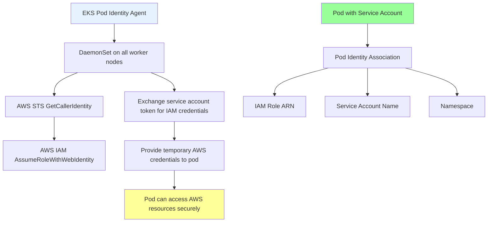
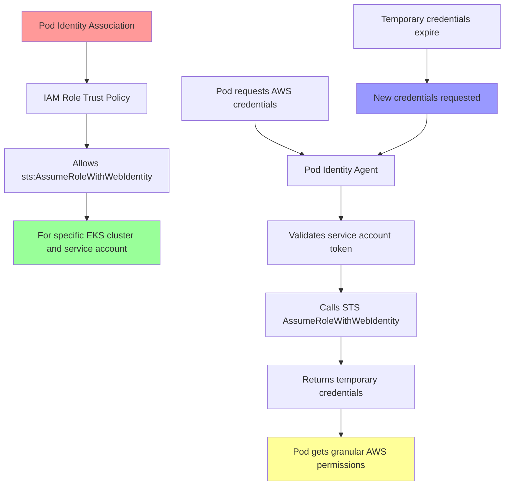

# Section 6: EKS Storage, Pod Identity Agent, and AWS Integration

<details open>
<summary><b>Section 6: EKS Storage, Pod Identity Agent, and AWS Integration (AWS EKS Masterclass)</b></summary>

## Table of Contents
1. [6.1 Introduction to EKS Pod Identity Agent](#61-introduction-to-eks-pod-identity-agent)
2. [6.2 PIA Demo Part-1](#62-pia-demo-part-1)

---

## 6.1 Introduction to EKS Pod Identity Agent

### Overview
Comprehensive introduction to EKS Pod Identity Agent (PIA), demonstrating how to securely provide AWS credentials to applications running in EKS pods without long-term credential management.

### Key Concepts

#### Traditional AWS Credential Management Problems
```diff
Traditional Approaches and Issues:
+ IAM user access keys in ConfigMaps - security risk, requires rotation
+ IAM roles attached to worker nodes - overly permissive, shared across pods
+ Application code containing credentials - hard to manage, security violations
+ Service account keys in secrets - still requires management and rotation
+ Long-term credentials in environment variables - compromised if containers compromised
- No automatic credential rotation
- Complex permission management
- Security vulnerability risks
- Manual credential lifecycle management
```

#### EKS Pod Identity Agent Solution
```diff
Pod Identity Agent Benefits:
+ Granular IAM permissions per pod workload
+ Automatic credential rotation every 15 minutes
+ No long-term credentials stored anywhere
+ Least-privilege access principles
+ Integration with existing AWS IAM policies
+ Zero-touch configuration for applications
- Requires EKS cluster and specific setup
- Additional component to manage and monitor
- AWS-specific solution (not portable to other clouds)
- Additional AWS service cost considerations
```

#### Pod Identity Agent Architecture


#### PIA Installation and Setup Process
```yaml
Installation Steps:
  - Install EKS Pod Identity Agent add-on
  - Verify daemonset running on all nodes
  - Create IAM role with required permissions
  - Create Kubernetes service account
  - Create Pod Identity Association
  - Deploy pod with service account annotation
  - Test AWS resource access from pod
```

#### Security and Permission Model


### Comparison with Other AWS Credential Methods

#### IAM Roles for Service Accounts (IRSA) vs Pod Identity Agent
```yaml
IRSA (Deprecated for new implementations):
  - Uses OIDC provider and web identity federation
  - Requires OIDC provider setup in EKS cluster
  - Complex setup with multiple manual steps
  - Uses Kubernetes service account tokens
  - Different from Pod Identity Agent approach

Pod Identity Agent (Recommended):
  - Simplified setup without OIDC configuration
  - Daemonset approach for credential delivery
  - EKS managed add-on available
  - Easier troubleshooting and management
  - Better performance and reliability
```

#### Node-level IAM vs Pod Identity Agent
```yaml
Worker Node IAM Role Approach:
  - IAM role attached to EC2 instances
  - Shared credentials across all pods on node
  - Requires careful node group segregation
  - Security concern: overly broad permissions
  - Hard to audit and manage per workload

Pod Identity Agent:
  - Granular permissions per pod identity association
  - Least-privilege access per application
  - Easy to audit and manage
  - Automatic credential rotation
  - No shared credentials between workloads
```

### Practical Implementation Workflow

#### Step-by-Step Setup Guide
```yaml
Complete PIA Setup Process:

1. Cluster Preparation:
   - Verify EKS cluster version supports PIA
   - Ensure cluster has necessary VPC and security groups
   - Confirm node groups have appropriate IAM permissions

2. Install Pod Identity Agent:
   - Add EKS Pod Identity Agent add-on
   - Verify daemonset pods running on all nodes
   - Check agent logs for any setup issues

3. Create IAM Resources:
   - Create IAM role with minimal required permissions
   - Configure trust relationship for EKS
   - Test role permissions independently

4. Configure Kubernetes Resources:
   - Create dedicated service account
   - Add service account to pod specification
   - Annotate service account if necessary

5. Create Identity Association:
   - Use AWS CLI or Console to create association
   - Link IAM role to service account and namespace
   - Verify association status

6. Deploy and Test:
   - Deploy pod with service account
   - Test AWS resource access from pod
   - Verify credential rotation behavior
   - Monitor for any authentication issues
```

### Use Cases and Best Practices

#### Common PIA Use Cases
```yaml
Application Integration Scenarios:

S3 Bucket Access:
  - Web applications storing user uploads
  - Backup utilities archiving to S3
  - Log shipping to S3 buckets
  - Static asset serving from private buckets

DynamoDB Operations:
  - Web applications with user data storage
  - Caching layers using DynamoDB
  - Session storage in distributed applications
  - Analytics data collection

SQS Message Processing:
  - Asynchronous task processing
  - Event-driven architectures
  - Decoupling application components
  - Message queuing for microservices

RDS Database Integration:
  - Password retrieval from Secrets Manager
  - Database connection authentication
  - Schema migrations and updates
  - Secure database access for applications
```

#### Security Best Practices
```diff
PIA Security Guidelines:
+ Create IAM roles with least-privilege permissions
+ Use separate roles for different applications
+ Regularly audit identity associations
+ Monitor AWS resource access patterns
+ Rotate IAM roles when permissions change
- Share IAM roles between different applications
- Use overly permissive IAM policies
- Skip regular security reviews
- Ignore credential rotation behavior
- Mix PIA with other credential methods
```

#### Operations and Monitoring
```diff
Operational Excellence:
+ Monitor EKS Pod Identity Agent daemonset health
+ Alert on credential retrieval failures
+ Log AWS API calls for audit trails
+ Regularly review and rotate IAM roles
+ Test credential rotation behavior
- Ignore daemonset health monitoring
- Skip identity association audits
- Miss credential expiration warnings
- Overlook integration test automation
- Neglect documentation updates
```

---

## 6.2 PIA Demo Part-1

### Overview
First part of the comprehensive Pod Identity Agent demonstration, covering installation and initial setup of the EKS Pod Identity Agent daemonset preparation.

### Key Concepts

#### EKS Add-on Architecture for Pod Identity Agent
```yaml
Add-on Installation Details:
  - EKS managed add-on: amazon-eks-pod-identity-agent
  - DaemonSet type: runs on every worker node
  - AWS managed container image
  - Automatic updates through EKS console
  - Monitoring and health checks included
```

#### Cluster Compatibility Requirements
```yaml
EKS Version Support:
  - EKS 1.24 and later supported
  - Kubernetes 1.24+ compatibility
  - ARM64 and AMD64 architectures
  - Linux-based worker nodes only
  - Fargate support available
```

### Lab Demo: PIA Installation and Setup

#### Step 1: Install EKS Pod Identity Agent Add-on
```bash
# Navigate to EKS cluster in AWS console
# 1. Open Amazon EKS console
# 2. Select your EKS cluster (eks-demo-cluster)
# 3. Navigate to Add-ons tab
# 4. Click "Get more add-ons"
# 5. Search for "EKS Pod Identity Agent"

# Install the add-on
# - Select: Amazon EKS Pod Identity Agent
# - Version: Latest available version
# - Configuration: Accept default settings
# - Click: Next, then Create

# Verify installation via CLI
aws eks describe-addon \
  --cluster-name eks-demo-cluster \
  --addon-name eks-pod-identity-agent \
  --region us-east-1

# Check daemonset deployment
kubectl get daemonset -n kube-system
kubectl get pods -n kube-system -l app.kubernetes.io/name=eks-pod-identity-agent

# Detailed pod inspection
kubectl describe pod -n kube-system -l app.kubernetes.io/name=eks-pod-identity-agent
```

#### Step 2: Verify PIA DaemonSet Health
```bash
# Monitor daemonset status
kubectl get ds eks-pod-identity-agent -n kube-system -o wide

# Check pod distribution across nodes
kubectl get pods -n kube-system -l app.kubernetes.io/name=eks-pod-identity-agent -o wide

# View daemonset events for troubleshooting
kubectl describe ds eks-pod-identity-agent -n kube-system

# Check daemonset pod logs for any issues
for pod in $(kubectl get pods -n kube-system -l app.kubernetes.io/name=eks-pod-identity-agent -o jsonpath='{.items[*].metadata.name}'); do
  echo "=== Logs for pod: $pod ==="
  kubectl logs -n kube-system $pod --tail=10
  echo ""
done
```

#### Step 3: Test Initial AWS CLI Setup (Without PIA)
```yaml
# Create simple AWS CLI pod for testing
# aws-cli-test.yaml
apiVersion: v1
kind: Pod
metadata:
  name: aws-cli-without-pia
  labels:
    app: aws-cli-test
    demo: pia-part1
spec:
  containers:
  - name: aws-cli
    image: amazon/aws-cli:latest
    command:
      - sleep
      - "3600"
    resources:
      requests:
        memory: "128Mi"
        cpu: "100m"
      limits:
        memory: "256Mi"
        cpu: "200m"
---
# Associated service account (without PIA association yet)
apiVersion: v1
kind: ServiceAccount
metadata:
  name: aws-cli-sa
  labels:
    demo: pia-part1
```

```bash
# Deploy test pod and service account
kubectl apply -f aws-cli-test.yaml

# Wait for pod to be ready
kubectl wait --for=condition=ready pod/aws-cli-without-pia --timeout=60s

# Try to access S3 (should fail - no credentials)
kubectl exec -it aws-cli-without-pia -- aws s3 ls

# Expected error output:
# Unable to locate credentials
# You can configure credentials by running "aws configure"

# Try with node/instance role (may work or fail based on node configuration)
kubectl exec -it aws-cli-without-pia -- aws sts get-caller-identity

# Output may show:
# An error occurred (InvalidIdentityToken) when calling the AssumeRoleWithWebIdentity operation:
# No OpenIDConnect provider found in your account for https://oidc.eks.region.amazonaws.com/id/...
# OR show node/instance role if configured

# Check what identity the pod is running as
kubectl exec -it aws-cli-without-pia -- whoami
kubectl exec -it aws-cli-without-pia -- cat /proc/1/environ | grep -E "(SERVICE_ACCOUNT|HOSTNAME)"
```

#### Step 4: Inspect PIA DaemonSet Configuration
```bash
# Detailed daemonset inspection
kubectl describe ds eks-pod-identity-agent -n kube-system

# Check PIA container configuration
kubectl get ds eks-pod-identity-agent -n kube-system -o yaml

# Inspect PIA environment variables and config
kubectl exec -it \
  $(kubectl get pods -n kube-system -l app.kubernetes.io/name=eks-pod-identity-agent -o jsonpath='{.items[0].metadata.name}') \
  -n kube-system -- env | grep -E "(AWS_|STS_|ROLE_)"

# Check mounted secrets and config
kubectl exec -it \
  $(kubectl get pods -n kube-system -l app.kubernetes.io/name=eks-pod-identity-agent -o jsonpath='{.items[0].metadata.name}') \
  -n kube-system -- ls -la /etc/pod-identity/

# View PIA startup logs
kubectl logs -n kube-system \
  $(kubectl get pods -n kube-system -l app.kubernetes.io/name=eks-pod-identity-agent -o jsonpath='{.items[0].metadata.name}') \
  --tail=50
```

#### Step 5: AWS Console Verification
```bash
# Verify EKS add-on status via AWS CLI
aws eks describe-addon \
  --cluster-name eks-demo-cluster \
  --addon-name eks-pod-identity-agent \
  --region us-east-1 \
  --query 'addon.{Name:name,Status:status,Version:version}'

# List all EKS add-ons for reference
aws eks list-addons --cluster-name eks-demo-cluster --region us-east-1

# Get cluster information for context
aws eks describe-cluster \
  --name eks-demo-cluster \
  --region us-east-1 \
  --query 'cluster.{Name:name,Version:version,Status:status}'
```

### Troubleshooting PIA Installation Issues

#### Common Installation Problems
```bash
# Check for installation failures
kubectl get events -n kube-system --field-selector reason=Failed | grep pod-identity

# Verify node-level requirements
kubectl get nodes -o wide
kubectl describe node | grep -A 10 "Allocated resources"

# Check for resource conflicts
kubectl get pods -n kube-system | grep -E "(pending|error|crash)"

# Inspect daemonset rollout status
kubectl rollout status daemonset/eks-pod-identity-agent -n kube-system
```

#### Add-on Installation Failures
```bash
# Reinstall if add-on failed
aws eks delete-addon \
  --cluster-name eks-demo-cluster \
  --addon-name eks-pod-identity-agent \
  --region us-east-1

# Wait for deletion to complete
aws eks wait addon-deleted \
  --cluster-name eks-demo-cluster \
  --addon-name eks-pod-identity-agent \
  --region us-east-1

# Reinstall with specific configuration
aws eks create-addon \
  --cluster-name eks-demo-cluster \
  --addon-name eks-pod-identity-agent \
  --addon-version v1.0.0-eksbuild.1 \
  --region us-east-1
```

#### Compatibility Verification
```bash
# Check EKS cluster version compatibility
kubectl version --short
aws eks describe-cluster --name eks-demo-cluster --region us-east-1 --query 'cluster.version'

# Verify VPC configuration for PIA
aws eks describe-cluster --name eks-demo-cluster --region us-east-1 --query 'cluster.resourcesVpcConfig'

# Check node group IAM role permissions
aws iam list-attached-role-policies --role-name <node-group-role-name>
```

### Next Steps Preview

#### Building Toward Full PIA Integration
```yaml
Remaining Steps for Complete PIA Setup:

3. Create IAM Role for S3 Access:
   - Design minimal privilege S3 read-only policy
   - Create IAM role with Pod Identity trust relationship
   - Attach S3 read-only managed policy

4. Configure Pod Identity Association:
   - Create Pod Identity Association via AWS CLI
   - Link IAM role to service account and namespace
   - Verify association status and configuration

5. Update Application with Service Account:
   - Modify AWS CLI pod to use dedicated service account
   - Annotate service account for PIA integration
   - Restart pod to enable credential injection

6. Test Complete PIA Functionality:
   - Verify pod can access S3 without static credentials
   - Test credential rotation behavior
   - Validate security boundaries and permissions

7. Monitoring and Troubleshooting:
   - Set up CloudWatch monitoring for PIA
   - Configure alerts for credential failures
   - Implement logging for audit and debugging
```

---

## Summary

### Key Takeaways
```diff
+ EKS Pod Identity Agent provides secure, automatic credential management for EKS pods
+ Eliminates need for long-term AWS credentials stored in applications or clusters
+ Uses daemonset architecture running on every worker node for credential delivery
+ Integrates with existing AWS IAM policies and roles for fine-grained permissions
+ Supports automatic credential rotation every 15 minutes for enhanced security
- Requires EKS cluster setup and management through AWS console
- Additional daemonset increases cluster resource utilization slightly
- AWS-specific solution not directly portable to other Kubernetes platforms
- Setup complexity for initial configuration and troubleshooting
```

### Quick Reference

#### PIA Installation Commands
```bash
# Install via AWS CLI
aws eks create-addon \
  --cluster-name eks-demo-cluster \
  --addon-name eks-pod-identity-agent \
  --addon-version v1.0.0-eksbuild.1 \
  --region us-east-1

# Verify installation
kubectl get daemonset -n kube-system eks-pod-identity-agent
kubectl get pods -n kube-system -l app.kubernetes.io/name=eks-pod-identity-agent

# Check add-on status
aws eks describe-addon \
  --cluster-name eks-demo-cluster \
  --addon-name eks-pod-identity-agent \
  --region us-east-1
```

#### Basic Testing Commands
```bash
# Test without PIA (should fail)
kubectl run aws-test --image=amazon/aws-cli --rm -it --restart=Never -- aws s3 ls

# Create service account for PIA
kubectl create serviceaccount aws-cli-serviceaccount

# Verify PIA daemonset health
kubectl get pods -n kube-system -l app.kubernetes.io/name=eks-pod-identity-agent -o wide
kubectl logs -n kube-system -l app.kubernetes.io/name=eks-pod-identity-agent --tail=20
```

#### PIA Status Verification
```bash
# Check daemonset status
kubectl get ds eks-pod-identity-agent -n kube-system
kubectl describe ds eks-pod-identity-agent -n kube-system

# List PIA pods across nodes
kubectl get pods -n kube-system -l app.kubernetes.io/name=eks-pod-identity-agent \
  -o custom-columns=NODE:.spec.nodeName,STATUS:.status.phase,READY:.status.conditions[?(@.type=="Ready")].status

# Monitor PIA events
kubectl get events -n kube-system --field-selector \
  involvedObject.kind=DaemonSet,involvedObject.name=eks-pod-identity-agent
```

### Expert Insight

#### Real-world Application
Pod Identity Agent is essential for enterprise EKS deployments where security, auditability, and automation are critical. It enables the principle of least privilege by providing granular AWS access to individual pod workloads without credential management overhead.

#### Expert Path
Start with PIA for production workloads, then explore AWS Controllers for Kubernetes (ACK) for even deeper AWS service integration. Monitor credential usage with AWS CloudTrail and CloudWatch for comprehensive security auditing.

#### Common Pitfalls
```diff
- Installing PIA on unsupported EKS versions, breaking cluster functionality entirely
- Creating overly permissive IAM roles, undermining the security benefits of PIA
- Forgetting to restart pods after creating pod identity associations
- Mixing PIA with other credential methods causing confusion and conflicts
- Not monitoring PIA daemonset health, missing credential delivery failures
- Ignoring compatibility between EKS versions and PIA add-on versions
- Skipping VPC configuration validation, leading to networking issues
- Overlooking node group IAM permissions required for PIA operation
- Not testing credential rotation behavior in staging environments
- Failing to implement CloudWatch monitoring for PIA operational visibility
```

</details>