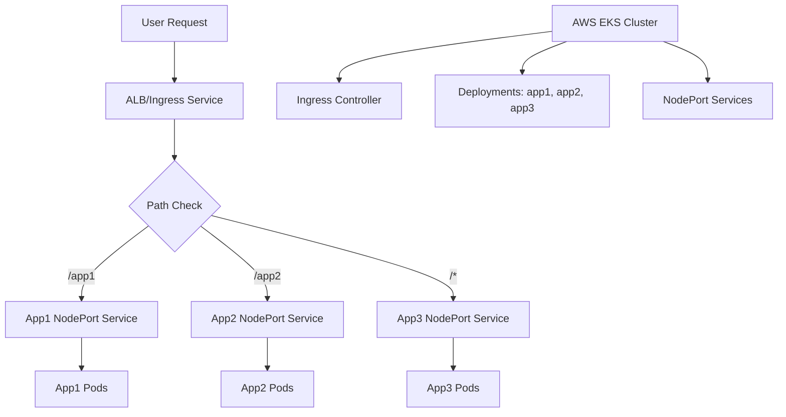

# Section 13: Ingress Context Path Based Routing

<details open>
<summary><b>Section 13: Ingress Context Path Based Routing</b></summary>

## Table of Contents
- [13.1 Introduction to Ingress Context Path Based Routing](#131-introduction-to-ingress-context-path-based-routing)
- [13.2 Review Kubernetes Deployment and NodePort Service Manifests](#132-review-kubernetes-deployment-and-nodeport-service-manifests)
- [13.3 Review Ingress CPR, Deploy and Verify](#133-review-ingress-cpr-deploy-and-verify)
- [13.4 Discuss Ingress Importance of Rules Ordering](#134-discuss-ingress-importance-of-rules-ordering)
- [Summary](#summary)

## 13.1 Introduction to Ingress Context Path Based Routing

### Overview
This section introduces the implementation of Kubernetes ingress context path based routing using AWS Application Load Balancer (ALB). The architecture involves deploying three applications with different context paths (/app1, /app2, /) routed through an ingress service that creates an AWS ALB equivalent.

The network design includes a VPC with public and private subnets, EKS cluster with private node groups, and the AWS Load Balancer Controller installed in the kube-system namespace.

### Key Concepts

#### Network Architecture
- **Infrastructure**: VPC with public/private subnets, EKS cluster, worker nodes
- **Applications**: Three Nginx applications (app1, app2, app3) deployed as deployments with NodePort services
- **Ingress Service**: Manages routing rules and creates equivalent AWS ALB

#### Routing Rules
```diff
+ /app1 → App1 NodePort Service → App1 Pods
+ /app2 → App2 NodePort Service → App2 Pods
+ / → App3 NodePort Service → App3 Pods (default/catch-all)
```

#### AWS-Kubernetes Integration
- **Ingress Controller**: Monitors K8s API server for ingress resources
- **ALB Creation**: Each ingress service creates equivalent AWS ALB
- **No Proxy Layer**: ALB and ingress service are unified objects
- **Target Groups**: Created automatically based on ingress rules

### Architecture Diagram



## 13.2 Review Kubernetes Deployment and NodePort Service Manifests

### Overview
This section reviews the Kubernetes manifests for deploying three Nginx applications with their corresponding NodePort services. Each application has specific container images and health check paths configured at the service level.

### Key Concepts

#### Application Manifests
Three applications are deployed:
1. **App1**: `stackSimplify/kube-nginxapp1` with health check `/app1/index.html`
2. **App2**: `stackSimplify/kube-nginxapp2` with health check `/app2/index.html`
3. **App3**: `stackSimplify/kube-nginx` with health check `/index.html` (root context)

#### Health Check Path Annotations
Health check paths are moved from ingress level to individual NodePort services:

```yaml
apiVersion: v1
kind: Service
metadata:
  name: app1-nginx-nodeport-service
  annotations:
    alb.ingress.kubernetes.io/healthcheck-path: "/app1/index.html"
spec:
  selector:
    app: app1-nginx
  ports:
  - port: 80
    targetPort: 80
  type: NodePort
```

#### Label Selectors
Each deployment and service pair uses consistent labels:
- **App1**: `app: app1-nginx`
- **App2**: `app: app2-nginx`
- **App3**: `app: app3-nginx`

### Deployment Strategy
```diff
+ Per-application health checks: Allows different health check paths per service
+ Single replica deployments: Simplified for demonstration
+ NodePort services: Enable cross-node service access
- Manual scaling: Only one replica per application initially
```

## 13.3 Review Ingress CPR, Deploy and Verify

### Overview
This section demonstrates creating and deploying an ingress resource with context path based routing (CPR) rules. The ingress service creates an AWS Application Load Balancer with routing rules that direct traffic based on URL paths.

### Key Concepts

#### Ingress Manifest Structure
```yaml
apiVersion: networking.k8s.io/v1
kind: Ingress
metadata:
  name: ingress-cpr-demo
  annotations:
    kubernetes.io/ingress.class: alb
    alb.ingress.kubernetes.io/scheme: internet-facing
    alb.ingress.kubernetes.io/target-type: ip
spec:
  rules:
  - host: <ALB-DNS-URL>
    http:
      paths:
      - path: /app1
        pathType: Prefix
        backend:
          service:
            name: app1-nginx-nodeport-service
            port:
              number: 80
      - path: /app2
        pathType: Prefix
        backend:
          service:
            name: app2-nginx-nodeport-service
            port:
              number: 80
      - path: /
        pathType: Prefix
        backend:
          service:
            name: app3-nginx-nodeport-service
            port:
              number: 80
```

#### Deployment Process
1. **Apply Manifests**: `kubectl apply -f kube-manifests/`
2. **Verify Resources**: Check pods, services, and ingress status
3. **ALB Creation**: Ingress controller creates ALB automatically
4. **Target Groups**: Three target groups created per service

#### Verification Commands
```bash
# Check deployments and services
kubectl get pods
kubectl get svc

# Check ingress and ALB DNS
kubectl get ingress
kubectl describe ingress ingress-cpr-demo

# Monitor controller logs
kubectl -n kube-system logs -f deployment/aws-load-balancer-controller
```

#### ALB Configuration
- **Listener**: Port 80 with path-based rules
- **Target Groups**: One per application with NodePort service endpoints
- **Health Checks**: Service-level annotations populate ALB health check paths
- **Routing Priority**:

> [!IMPORTANT]
> The order of paths in the ingress manifest determines ALB rule priority. More specific paths should be listed before general ones to ensure proper routing.

### Testing Results
```diff
+ /app1/index.html → App1 (Green theme)
+ /app2/index.html → App2 (Different theme)
+ /index.html → App3 (Default theme)
! All applications accessible via single ALB DNS
! Health checks working at service level
```

## 13.4 Discuss Ingress Importance of Rules Ordering

### Overview
This section demonstrates the critical importance of rule ordering in ingress context path based routing. Incorrect ordering can cause routing failures where more specific paths are never reached.

### Key Concepts

#### Rule Ordering Problem
When root context (`/`) is placed before specific paths, it becomes a catch-all rule:

```yaml
# INCORRECT ORDERING (Causes routing failures)
spec:
  rules:
  - host: <ALB-DNS-URL>
    http:
      paths:
      - path: /           # Catch-all - blocks /app1 and /app2
        pathType: Prefix
        backend:
          service:
            name: app3-nginx-nodeport-service
            port:
              number: 80
      - path: /app1        # Never reached
        pathType: Prefix
        backend:
          service:
            name: app1-nginx-nodeport-service
            port:
              number: 80
      - path: /app2        # Never reached
        pathType: Prefix
        backend:
          service:
            name: app2-nginx-nodeport-service
            port:
              number: 80
```

#### Correct Ordering
```yaml
# CORRECT ORDERING
spec:
  rules:
  - host: <ALB-DNS-URL>
    http:
      paths:
      - path: /app1        # Specific paths first
        pathType: Prefix
        backend:
          service:
            name: app1-nginx-nodeport-service
            port:
              number: 80
      - path: /app2        # Specific paths second
        pathType: Prefix
        backend:
          service:
            name: app2-nginx-nodeport-service
            port:
              number: 80
      - path: /           # Root context last (catch-all)
        pathType: Prefix
        backend:
          service:
            name: app3-nginx-nodeport-service
            port:
              number: 80
```

### Testing Rule Priority
```diff
- Incorrect order: /app1 and /app2 return 404 (caught by root rule)
+ Correct order: All paths route properly
! URL patterns like /app1/*, /app2/* match before /*
```

#### Alternative: Default Backend
Instead of root path rule, use `defaultBackend`:

```yaml
spec:
  defaultBackend:
    service:
      name: app3-nginx-nodeport-service
      port:
        number: 80
  rules:
  - host: <ALB-DNS-URL>
    http:
      paths:
      - path: /app1
        pathType: Prefix
        backend:
          service:
            name: app1-nginx-nodeport-service
            port:
              number: 80
      - path: /app2
        pathType: Prefix
        backend:
            name: app2-nginx-nodeport-service
            port:
              number: 80
```

### Cleanup Commands
```bash
# Remove all resources
kubectl delete -f kube-manifests/

# Verify cleanup
kubectl get ingress
kubectl get svc
kubectl get pods
```

> [!WARNING]
> Always clean up ALB resources as they incur significant costs if left running. The Load Balancer Controller does not automatically delete ALBs when ingress resources are removed.

## Summary

### Key Takeaways
```diff
+ Ingress context path routing enables single ALB to serve multiple applications
+ Health check paths configured per service enable different checks per app
+ AWS ALB and Kubernetes ingress are unified objects - no proxy layer
+ Rule ordering is critical: specific paths before general catch-alls
- Root context (/) as catch-all must be last in rule priority
- Incorrect ordering causes 404 errors on specific paths
! Always clean up ALB resources to avoid costs
```

### Quick Reference
```bash
# Deploy context path routing
kubectl apply -f kube-manifests/

# Verify ingress and ALB
kubectl get ingress
kubectl describe ingress <ingress-name>

# Check target groups and health
aws elbv2 describe-target-groups
aws elbv2 describe-target-health --target-group-arn <arn>

# Cleanup resources
kubectl delete -f kube-manifests/
```

### Expert Insight

#### Real-world Application
- **Microservices Routing**: Use context path routing to expose multiple services through single domain
- **API Versioning**: Route `/v1/api/*` and `/v2/api/*` to different service versions
- **Multi-tenant Apps**: Route `/tenant1/*` and `/tenant2/*` to isolated application instances
- **Legacy Migration**: Gradually migrate from monolith by routing specific paths to new microservices

#### Expert Path
- **Path Priority Understanding**: Master ALB rule evaluation order for complex routing scenarios
- **Health Check Strategy**: Design per-application health checks for reliable load balancing
- **Cost Optimization**: Implement proper cleanup automation in CI/CD pipelines
- **Security**: Combine with AWS WAF for path-based security rules and rate limiting

#### Common Pitfalls
- ❌ Placing root context (`/`) before specific paths causes routing failures
- ❌ Mixing path types inconsistently across rules
- ❌ Forgetting health check paths at service level for multi-app deployments
- ❌ Not cleaning up ALB resources leading to unexpected AWS costs
- ❌ Assuming ALB deletion happens automatically with ingress resource removal

</details>