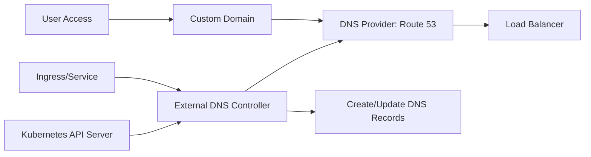
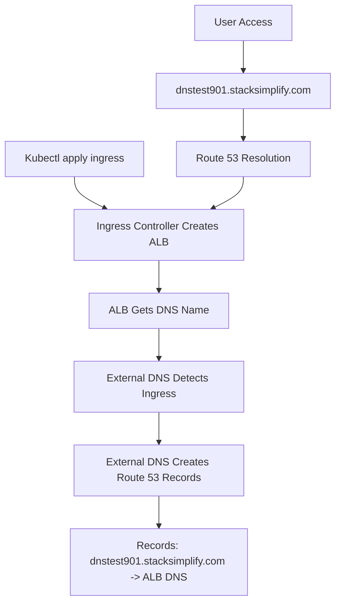
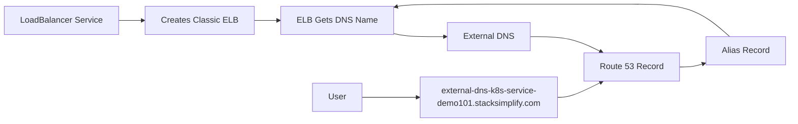

# Section 15: External DNS for Kubernetes Ingress Services

<details open>
<summary><b>Section 15: External DNS for Kubernetes Ingress Services</b></summary>

## Table of Contents
- [15.1 Introduction to ALB Ingress External DNS Install](#151-introduction-to-alb-ingress-external-dns-install)
- [15.2 Create IAM Policy, k8s Service Account, IAM Role and Verify](#152-create-iam-policy-k8s-service-account-iam-role-and-verify)
- [15.3 Review and Update External DNS k8s Manifest](#153-review-and-update-external-dns-k-8s-manifest)
- [15.4 Deploy External DNS and Verify Logs](#154-deploy-external-dns-and-verify-logs)
- [15.5 Ingress Service Demo with External DNS](#155-ingress-service-demo-with-external-dns)
- [15.6 Kubernetes Service Demo with External DNS](#156-kubernetes-service-demo-with-external-dns)
- [Summary](#summary)

## 15.1 Introduction to ALB Ingress External DNS Install

### Overview
This section introduces External DNS, a Kubernetes add-on that automatically manages DNS records for Kubernetes services and ingress resources. External DNS synchronizes exposed Kubernetes services and ingresses with DNS providers, making applications discoverable via custom domain names.

### Key Concepts

#### External DNS Architecture


#### Core Functionality
```diff
+ Automatically creates DNS records for Kubernetes services and ingresses
+ Syncs DNS records with cloud providers (AWS Route 53, Google Cloud DNS, Azure DNS)
+ Supports multiple DNS record types (A, CNAME, TXT, SRV)
+ Domain filtering capabilities for security and organization
+ Health checking and cleanup of stale records
```

#### Integration Types
- **Ingress Resources**: Creates DNS records for ALB/ELB endpoints
- **LoadBalancer Services**: Registers DNS for Classic/Network Load Balancers
- **Annotations**: Custom domain names via Kubernetes annotations

#### Use Cases
```diff
+ Custom domain names for applications
+ Automated DNS management in CI/CD pipelines
+ Multi-environment DNS isolation
+ Blue-green deployments with DNS routing
+ Service discovery in microservices architecture
```

> [!IMPORTANT]
> External DNS requires specific IAM permissions and proper domain ownership verification. Domain filtering should be configured in production to prevent unauthorized DNS record creation.

## 15.2 Create IAM Policy, k8s Service Account, IAM Role and Verify

### Overview
This section establishes the necessary AWS IAM permissions and Kubernetes service accounts required for External DNS to interact with Route 53. The implementation uses EKS service account IAM roles for secure, fine-grained access control.

### Key Concepts

#### IAM Policy Structure
```json
{
    "Version": "2012-10-17",
    "Statement": [
        {
            "Effect": "Allow",
            "Action": [
                "route53:ChangeResourceRecordSets",
                "route53:ListResourceRecordSets",
                "route53:ListHostedZones"
            ],
            "Resource": "*"
        }
    ]
}
```

#### EKS IAM Service Account Creation
```bash
eksctl create iamserviceaccount \
    --cluster eks-demo1 \
    --namespace default \
    --name external-dns \
    --attach-policy-arn arn:aws:iam::<account-id>:policy/AllowExternalDNSUpdates \
    --override-existing-serviceaccounts \
    --approve
```

#### Generated Resources
- **IAM Role**: AWS IAM role with Route 53 permissions
- **Kubernetes Service Account**: `external-dns` in default namespace
- **Role Annotation**: Service account annotated with IAM role ARN

#### Verification Commands
```bash
# Check IAM service account creation
eksctl get iamserviceaccount --cluster eks-demo1

# Verify Kubernetes service account
kubectl get serviceaccounts external-dns -o yaml

# Check IAM role in AWS Console
aws iam get-role --role-name eksctl-eks-demo1-addon-iamserviceaccount-default-external-dns
```

#### Security Considerations
```diff
+ Least privilege IAM policy limited to Route 53 operations
+ Service account isolation per namespace
+ Override protection for existing service accounts
- Avoid wildcard (*) resource access in production
```

## 15.3 Review and Update External DNS k8s Manifest

### Overview
This section reviews and configures the External DNS Kubernetes manifest with appropriate settings for AWS Route 53 integration. Key configurations include domain filtering, ownership verification, and operational modes.

### Key Concepts

#### External DNS Deployment Structure
```yaml
apiVersion: apps/v1
kind: Deployment
metadata:
  name: external-dns
  namespace: default
spec:
  replicas: 1
  selector:
    matchLabels:
      app: external-dns
  template:
    metadata:
      labels:
        app: external-dns
    spec:
      serviceAccountName: external-dns
      containers:
      - name: external-dns
        image: registry.k8s.io/external-dns/external-dns:v0.14.0
        args:
        - --source=service
        - --source=ingress
        - --domain-filter=example.com
        - --provider=aws
        - --policy=upsert-only
        - --aws-zone-type=public
        - --registry=txt
        - --txt-owner-id=my-identifier
```

#### Key Configuration Parameters
```diff
+ source: Specifies resource types (service, ingress) to watch
+ domain-filter: Limits DNS record creation to specific domains
+ provider: DNS provider (aws, google, azure)
+ policy: sync (full CRUD) or upsert-only (create/update only)
+ registry: Record ownership verification method
+ txt-owner-id: Unique identifier for DNS record ownership
```

#### Domain Filtering Strategy
```yaml
# Domain filter configurations
args:
- --domain-filter=stacksimplify.com    # Single domain
- --domain-filter=*.stacksimplify.com  # Subdomain wildcard
# No domain filter (line commented out) = Process all hosted zones
```

#### Ownership and Synchronization
```diff
+ TXT registry: Uses TXT records to track ownership and prevent conflicts
+ Upsert-only policy: Prevents accidental DNS record deletion
+ Sync policy: Full lifecycle management including deletion
! Choose policy carefully - sync enables automatic cleanup
```

## 15.4 Deploy External DNS and Verify Logs

### Overview
This section deploys the External DNS controller to the Kubernetes cluster and verifies its operational status through logs and resource inspection.

### Key Concepts

#### Deployment Process
```bash
# Navigate to manifest directory
cd /path/to/external-dns/section

# Deploy External DNS
kubectl apply -f kube-manifest/

# Verify deployment
kubectl get deployments external-dns
kubectl get pods -l app=external-dns
```

#### Log Analysis
```bash
# View External DNS logs
kubectl logs -f deployment/external-dns

# Expected log output
time="2024-01-15T10:30:00Z" level=info msg="Applied 3 records to zone stacksimplify.com"
time="2024-01-15T10:30:05Z" level=info msg="All records are up to date"
```

#### Resource Verification
```diff
+ Service Account: external-dns with proper IAM role annotation
+ ClusterRole: external-dns with required API permissions
+ ClusterRoleBinding: Binds service account to cluster role
+ Deployment: Running External DNS pod with correct image version
```

#### Troubleshooting Common Issues
```diff
! Permission denied: Check IAM role and policy attachments
! Image pull errors: Verify image registry and version
! DNS record creation failed: Confirm domain ownership and IAM permissions
! Service account issues: Ensure correct namespace and annotation
```

#### Health Monitoring
```bash
# Check pod health
kubectl describe pod -l app=external-dns

# Verify API server connectivity
kubectl exec -it deployment/external-dns -- curl -k https://kubernetes.default.svc.cluster.local

# Check Route 53 API access
kubectl logs deployment/external-dns | grep "AWS API call"
```

## 15.5 Ingress Service Demo with External DNS

### Overview
This section demonstrates External DNS integration with Kubernetes ingress resources, showcasing automatic DNS record creation and cleanup for ALB-backed applications.

### Key Concepts

#### Ingress with External DNS Annotations
```yaml
apiVersion: networking.k8s.io/v1
kind: Ingress
metadata:
  name: ingress-external-dns-demo
  annotations:
    kubernetes.io/ingress.class: alb
    alb.ingress.kubernetes.io/scheme: internet-facing
    external-dns.alpha.kubernetes.io/hostname: dnstest901.stacksimplify.com,dnstest902.stacksimplify.com
spec:
  rules:
  - host: dnstest901.stacksimplify.com
    http:
      paths:
      - path: /app1
        pathType: Prefix
        backend:
          service:
            name: app1-nginx-nodeport-service
            port:
              number: 80
  - host: dnstest902.stacksimplify.com
    http:
      paths:
      - path: /
        pathType: Prefix
        backend:
          service:
            name: app2-nginx-nodeport-service
            port:
              number: 80
```

#### DNS Record Creation Flow


#### Verification Steps
```bash
# Deploy applications and ingress
kubectl apply -f kube-manifests/

# Monitor External DNS logs
kubectl logs -f deployment/external-dns
# Expected: "CREATE dnstest901.stacksimplify.com A <alb-dns>"

# Verify Route 53 records
aws route53 list-resource-record-sets --hosted-zone-id <zone-id>

# Test DNS resolution
nslookup dnstest901.stacksimplify.com

# Access applications
curl https://dnstest901.stacksimplify.com/app1/
curl https://dnstest902.stacksimplify.com/
```

#### Automated Cleanup
```bash
# Delete ingress resources
kubectl delete -f kube-manifests/

# Monitor cleanup logs
kubectl logs -f deployment/external-dns
# Expected: "DELETE dnstest901.stacksimplify.com A"

# Verify Route 53 cleanup
aws route53 list-resource-record-sets --hosted-zone-id <zone-id>
```

#### Multiple Domain Configuration
```yaml
annotations:
  external-dns.alpha.kubernetes.io/hostname: |
    app1.example.com
    app2.example.com
    *.wildcard.example.com
```

> [!IMPORTANT]
> Domain filtering must be configured appropriately to allow the specified domains. Without filtering, External DNS can manage all hosted zones in the account.

## 15.6 Kubernetes Service Demo with External DNS

### Overview
This section demonstrates External DNS integration with Kubernetes LoadBalancer services, showing how to assign custom domain names to Classic Load Balancers created by Kubernetes services.

### Key Concepts

#### LoadBalancer Service with External DNS
```yaml
apiVersion: v1
kind: Service
metadata:
  name: nginx-lb-service
  annotations:
    service.beta.kubernetes.io/aws-load-balancer-type: clb
    external-dns.alpha.kubernetes.io/hostname: external-dns-k8s-service-demo101.stacksimplify.com
spec:
  selector:
    app: nginx-app1
  ports:
  - port: 80
    targetPort: 80
  type: LoadBalancer
```

#### Service Type Comparison
```diff
+ LoadBalancer Service: Creates Classic/Network ELB per service
+ Ingress: Creates single ALB with path/host-based routing
+ External DNS works with both service types
- LoadBalancer creates separate load balancers (cost impact)
+ Ingress provides more advanced routing features
```

#### DNS Resolution Flow


#### Testing and Verification
```bash
# Deploy service and application
kubectl apply -f kube-manifests/

# Check service status
kubectl get svc nginx-lb-service
# EXTERNAL-IP: <elb-dns-name>

# Monitor DNS creation
kubectl logs -f deployment/external-dns

# Verify Route 53 record
nslookup external-dns-k8s-service-demo101.stacksimplify.com

# Test application access
curl http://external-dns-k8s-service-demo101.stacksimplify.com/app1/
```

#### Cost Considerations
```diff
! Each LoadBalancer service creates separate ELB
! Consider using Ingress for multiple services
! Monitor ELB costs in AWS Cost Explorer
+ External DNS doesn't add costs (free open-source tool)
```

#### Cleanup Process
```bash
# Delete service
kubectl delete -f kube-manifests/

# Verify ELB deletion
aws elb describe-load-balancers

# Monitor DNS deletion logs
kubectl logs -f deployment/external-dns
```

## Summary

### Key Takeaways
```diff
+ External DNS automates DNS record management for Kubernetes workloads
+ Supports ingress and load balancer service types
+ Requires specific IAM permissions and domain filtering
+ Policy settings control record lifecycle management
+ TXT registry prevents DNS record conflicts
+ Full synchronization enables automatic cleanup
```

### Quick Reference
```bash
# Install External DNS prerequisites
eksctl create iamserviceaccount \
  --cluster eks-demo \
  --name external-dns \
  --attach-policy-arn arn:aws:iam::account:policy/AllowExternalDNSUpdates

# Deploy External DNS
kubectl apply -f external-dns-manifest.yaml

# Monitor logs
kubectl logs -f deployment/external-dns

# Ingress with External DNS
apiVersion: networking.k8s.io/v1
kind: Ingress
metadata:
  annotations:
    external-dns.alpha.kubernetes.io/hostname: myapp.example.com

# Service with External DNS
apiVersion: v1
kind: Service
metadata:
  annotations:
    external-dns.alpha.kubernetes.io/hostname: myservice.example.com
spec:
  type: LoadBalancer

# View managed records
aws route53 list-resource-record-sets --hosted-zone-id <zone-id> \
  --query 'ResourceRecordSets[?Type==`A` || Type==`CNAME`]'
```

### Expert Insight

#### Real-world Application
- **Production Deployments**: Automated DNS for blue-green deployments
- **Multi-environment**: Separate domains for dev/staging/prod
- **Service Mesh**: DNS-based service discovery in Istio/Linkerd
- **GitOps**: Declarative DNS management with Flux/ArgoCD
- **Global Distribution**: Route 53 geo-routing with External DNS

#### Expert Path
- **Advanced Domain Filtering**: Complex regex patterns for domain control
- **Custom TXT Records**: Enhanced ownership verification
- **Multi-provider Setup**: DNS federation across cloud providers
- **Health Checking**: Integration with external health checks
- **Rate Limiting**: Prevent DNS update storms

#### Common Pitfalls
- ❌ Missing domain filtering leads to unauthorized DNS modifications
- ❌ Incorrect IAM permissions cause deployment failures
- ❌ Sync policy enabled accidentally deletes required records
- ❌ TXT record conflicts in multi-cluster environments
- ❌ LoadBalancer service proliferation creates cost issues
- ❌ Domain ownership verification failures block record creation

</details>