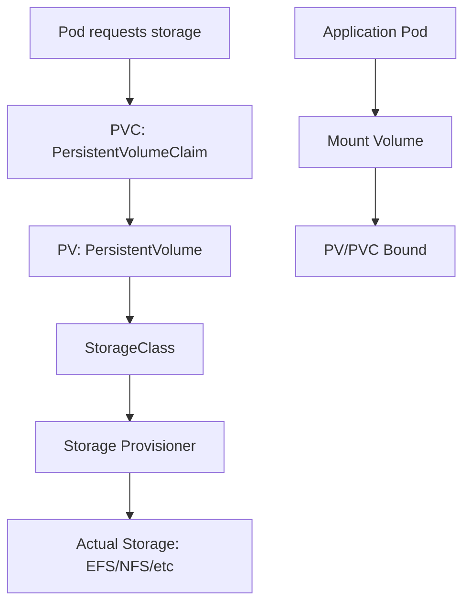
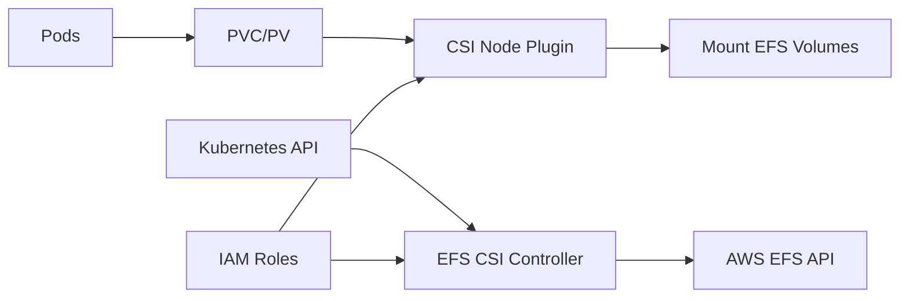
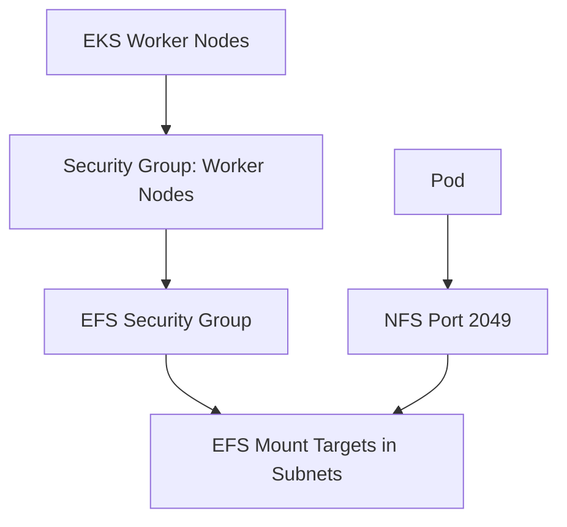

# Section 16: Persistent Volumes PV and PVC for EKS

<details open>
<summary><b>Section 16: Persistent Volumes PV and PVC for EKS</b></summary>

## Table of Contents
- [16.1 Introduction to Persistent Volumes PV and PVC for EKS](#161-introduction-to-persistent-volumes-pv-and-pvc-for-eks)
- [16.2 Create EFS Security Group and Update Worker Nodes Security Group](#162-create-efs-security-group-and-update-worker-nodes-security-group)
- [16.3 Install EFS CSI Driver and Create EFS File System](#163-install-efs-csi-driver-and-create-efs-file-system)
- [Summary](#summary)

## 16.1 Introduction to Persistent Volumes PV and PVC for EKS

### Overview
This section introduces persistent storage concepts in Kubernetes, focusing on implementing Amazon EFS (Elastic File System) as persistent volumes for EKS workloads. The implementation covers the complete lifecycle from EFS creation to application deployment with persistent storage.

### Key Concepts

#### Kubernetes Storage Architecture


#### Storage Components
- **PersistentVolume (PV)**: Cluster-wide storage resource
- **PersistentVolumeClaim (PVC)**: Application's request for storage
- **StorageClass**: Defines storage provisioner and parameters
- **CSI Driver**: Container Storage Interface implementation

#### EFS Benefits for EKS
```diff
+ Scalable shared filesystem accessible by multiple pods/nodes
+ Automatic scaling of storage capacity
+ Regional service with multi-AZ availability
+ Pay only for used storage
+ Integration with Kubernetes persistent volumes
+ Supports ReadWriteMany access modes
- Block storage limitations of EBS
```

#### Implementation Steps
1. **Setup Phase**: EFS CSI driver, security groups, IAM permissions
2. **Storage Provisioning**: Dynamic provisioning with StorageClass
3. **Application Integration**: PVC claims, volume mounts, application deployment
4. **Testing**: Verify persistence across pod restarts/replacements

#### EFS CSI Driver Architecture


> [!IMPORTANT]
> EFS CSI driver requires proper IAM permissions and network connectivity between EFS and worker nodes through security groups.

## 16.2 Create EFS Security Group and Update Worker Nodes Security Group

### Overview
This section configures AWS security groups to enable network connectivity between EKS worker nodes and the EFS file system. Proper security group rules ensure secure access while maintaining network isolation.

### Key Concepts

#### Security Group Strategy
```diff
+ EFS Security Group: Controls inbound access to EFS mount targets
+ Worker Node SG Update: Allows outbound connections to EFS
+ Port Requirements: NFS port 2049 (TCP)
+ Least Privilege: Only necessary ports and sources
```

#### EFS Security Group Configuration
```json
{
    "GroupName": "EFS-Security-Group",
    "Description": "Security group for EFS mount targets",
    "VpcId": "vpc-xxxxxxxx",
    "SecurityGroupIngress": [
        {
            "IpProtocol": "tcp",
            "FromPort": 2049,
            "ToPort": 2049,
            "CidrIp": "10.0.0.0/16"  // Worker node subnet CIDR
        }
    ]
}
```

#### Worker Node Security Group Updates
```json
{
    "SecurityGroupId": "sg-worker-nodes",
    "IpPermissions": [
        {
            "IpProtocol": "tcp",
            "FromPort": 2049,
            "ToPort": 2049,
            "UserIdGroupPairs": [
                {
                    "GroupId": "sg-efs-mount-targets",
                    "Description": "Allow NFS access to EFS"
                }
            ]
        }
    ]
}
```

#### Network Architecture


#### Best Practices
```diff
+ Use descriptive security group names for clarity
+ Reference security groups rather than CIDRs for dynamic scaling
+ Enable both ingress (EFS) and egress (workers) rules
+ Audit security group rules regularly
+ Use VPC flow logs for network troubleshooting
```

#### Troubleshooting Network Issues
- **Mount Failures**: Check security group rules for port 2049
- **DNS Resolution**: Verify DNS hostname resolution in VPC
- **Subnet Routing**: Ensure EFS mount targets in accessible subnets
- **IAM Permissions**: Confirm CSI driver has necessary AWS permissions

## 16.3 Install EFS CSI Driver and Create EFS File System

### Overview
This section installs the Amazon EFS Container Storage Interface (CSI) driver and creates an EFS file system with proper mount targets. The EFS CSI driver enables dynamic provisioning of persistent volumes backed by EFS.

### Key Concepts

#### EFS CSI Driver Installation
```bash
# Add EFS CSI driver Helm repository
helm repo add aws-efs-csi-driver https://kubernetes-sigs.github.io/aws-efs-csi-driver/

# Install CSI driver
helm install aws-efs-csi-driver aws-efs-csi-driver/aws-efs-csi-driver \
  --namespace kube-system \
  --set controller.serviceAccount.create=false \
  --set controller.serviceAccount.name=efs-csi-controller-sa

# Verify installation
kubectl get pods -n kube-system -l app.kubernetes.io/name=aws-efs-csi-driver
```

#### IAM Service Account for CSI Driver
```yaml
apiVersion: v1
kind: ServiceAccount
metadata:
  name: efs-csi-controller-sa
  namespace: kube-system
  annotations:
    eks.amazonaws.com/role-arn: arn:aws:iam::<account-id>:role/AmazonEKS_EFS_CSI_DriverRole
```

#### EFS File System Creation
```bash
# Create EFS file system
aws efs create-file-system \
  --creation-token "eks-efs-demo" \
  --encrypted \
  --performance-mode generalPurpose \
  --throughput-mode bursting \
  --tags Key=Name,Value=eks-efs-demo

# Get EFS File System ID
EFS_ID=$(aws efs describe-file-systems --query 'FileSystems[?Name==`eks-efs-demo`].FileSystemId' --output text)

# Create mount targets in each AZ
aws efs create-mount-target \
  --file-system-id $EFS_ID \
  --subnet-id subnet-private-1 \
  --security-groups sg-efs-mount-targets

aws efs create-mount-target \
  --file-system-id $EFS_ID \
  --subnet-id subnet-private-2 \
  --security-groups sg-efs-mount-targets
```

#### StorageClass for Dynamic Provisioning
```yaml
apiVersion: storage.k8s.io/v1
kind: StorageClass
metadata:
  name: efs-sc
provisioner: efs.csi.aws.com
parameters:
  provisioningMode: efs-ap
  fileSystemId: fs-xxxxxxxx
  directoryPerms: "700"
  gidRangeStart: "1000"
  gidRangeEnd: "2000"
  basePath: "/dynamic_provisioning"
reclaimPolicy: Delete
```

#### Dynamic PVC Creation
```yaml
apiVersion: v1
kind: PersistentVolumeClaim
metadata:
  name: efs-pvc
spec:
  accessModes:
    - ReadWriteMany
  storageClassName: efs-sc
  resources:
    requests:
      storage: 5Gi
```

#### Application Deployment with EFS
```yaml
apiVersion: apps/v1
kind: Deployment
metadata:
  name: app-with-efs
spec:
  replicas: 1
  selector:
    matchLabels:
      app: app-with-efs
  template:
    metadata:
      labels:
        app: app-with-efs
    spec:
      containers:
      - name: app
        image: nginx
        volumeMounts:
        - name: persistent-storage
          mountPath: /usr/share/nginx/html
      volumes:
      - name: persistent-storage
        persistentVolumeClaim:
          claimName: efs-pvc
```

#### Verification Steps
```bash
# Check CSI driver pods
kubectl get pods -n kube-system -l app.kubernetes.io/name=aws-efs-csi-driver

# Verify PVC binding
kubectl get pvc
kubectl get pv

# Check mount in pod
kubectl exec -it <pod-name> -- df -h
kubectl exec -it <pod-name> -- mount | grep efs

# Test persistence
kubectl exec -it <pod-name> -- touch /usr/share/nginx/html/test.txt
kubectl delete pod <pod-name>  # Recreate pod
kubectl exec -it <new-pod-name> -- ls /usr/share/nginx/html/
```

### Troubleshooting Common Issues

#### Mount Failures
```diff
! Check security group rules allow NFS traffic
! Verify EFS mount targets exist in correct subnets
! Confirm IAM permissions for CSI driver
! Check CloudWatch logs for EFS mount errors
```

#### CSI Driver Issues
```diff
! Ensure correct IAM role annotation on service account
! Check node IAM roles have EFS permissions
! Verify Helm chart version compatibility
! Review CSI driver logs for errors
```

#### Performance Considerations
```diff
+ Use EFS Performance mode based on workload
+ Consider Provisioned Throughput for high-IOPS needs
+ Monitor EFS metrics in CloudWatch
+ Use appropriate StorageClass parameters
```

## Summary

### Key Takeaways
```diff
+ EFS provides scalable shared storage for Kubernetes workloads
+ CSI driver enables dynamic provisioning of persistent volumes
+ Proper security group configuration essential for NFS access
+ StorageClass defines provisioning behavior and parameters
+ PVCs provide abstraction layer between applications and storage
+ ReadWriteMany access mode enables multi-pod sharing
```

### Quick Reference
```bash
# Install EFS CSI driver
helm install aws-efs-csi-driver aws-efs-csi-driver/aws-efs-csi-driver \
  --namespace kube-system

# Create EFS file system
aws efs create-file-system --creation-token eks-demo

# Create mount targets
aws efs create-mount-target --file-system-id fs-xxxx --subnet-id subnet-xxx --security-groups sg-xxx

# Create StorageClass
kubectl apply -f storageclass-efs.yaml

# Create PVC
kubectl apply -f pvc-efs.yaml

# Deploy application
kubectl apply -f app-deployment.yaml

# Verify persistence
kubectl exec -it pod-name -- ls /mount/path
```

### Expert Insight

#### Real-world Application
- **Shared Configuration**: Store application configs accessible by multiple pods
- **Log Aggregation**: Centralized logging storage across services
- **Content Management**: Shared media/file storage for web applications
- **Machine Learning**: Shared datasets accessible by training/validation pods
- **Database Backups**: Persistent storage for database backup files

#### Expert Path
- **StorageClass Optimization**: Fine-tune EFS parameters for specific workloads
- **Multi-AZ Deployment**: Configure EFS with mount targets in multiple availability zones
- **Performance Tuning**: Select appropriate EFS performance and throughput modes
- **Cost Optimization**: Monitor and optimize EFS storage usage and costs
- **Backup Strategies**: Implement automated EFS backup solutions

#### Common Pitfalls
- ❌ Security group misconfiguration blocks NFS access
- ❌ Missing IAM permissions cause CSI driver failures
- ❌ Incorrect file system ID in StorageClass parameters
- ❌ Mount target creation in wrong subnets causes connectivity issues
- ❌ Insufficient EFS throughput for workload requirements
- ❌ Not using ReadWriteMany access mode when needed for multiple pods

</details>