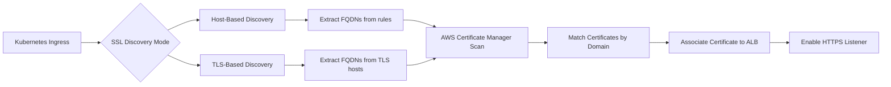

# Section 17: Ingress SSL Discovery

<details open>
<summary><b>Section 17: Ingress SSL Discovery</b></summary>

## Table of Contents
- [17.1 Introduction to Ingress SSL Discovery](#171-introduction-to-ingress-ssl-discovery)
- [17.2 Implement SSL Discovery Host Demo](#172-implement-ssl-discovery-host-demo)
- [17.3 Implement SSL Discovery TLS Demo](#173-implement-ssl-discovery-tls-demo)
- [Summary](#summary)

## 17.1 Introduction to Ingress SSL Discovery

### Overview
This section introduces SSL/TLS certificate discovery mechanisms for Kubernetes Ingress resources using AWS Application Load Balancer (ALB). SSL discovery enables automatic association of SSL certificates from AWS Certificate Manager to ALB listeners without explicit certificate ARN specification.

### Key Concepts

#### SSL Discovery Methods
```diff
+ Host-Based Discovery: Automatically discovers certificates using FQDNs in ingress rules
+ TLS-Based Discovery: Uses certificate domains specified in ingress TLS field
+ Certificate Matching: Matches wildcard certificates (*.domain.com) to specific FQDNs
+ No Manual ARN: Eliminates need for certificate-manager ARN annotations
```

#### Host-Based SSL Discovery
```yaml
apiVersion: networking.k8s.io/v1
kind: Ingress
metadata:
  annotations:
    kubernetes.io/ingress.class: alb
    alb.ingress.kubernetes.io/scheme: internet-facing
    alb.ingress.kubernetes.io/listen-ports: '[{"HTTPS":443}]'
spec:
  rules:
  - host: app1.stacksimplify.com  # Certificate automatically discovered
    http:
      paths:
      - path: /
        pathType: Prefix
        backend:
          service:
            name: app1-service
            port:
              number: 80
  - host: app2.stacksimplify.com  # Certificate automatically discovered
    http:
      paths:
      - path: /
        pathType: Prefix
        backend:
          service:
            name: app2-service
            port:
              number: 80
```

#### TLS-Based SSL Discovery
```yaml
apiVersion: networking.k8s.io/v1
kind: Ingress
metadata:
  annotations:
    kubernetes.io/ingress.class: alb
    alb.ingress.kubernetes.io/scheme: internet-facing
    alb.ingress.kubernetes.io/listen-ports: '[{"HTTPS":443}]'
spec:
  tls:
  - hosts:
    - tls-discovery-101.stacksimplify.com
  rules:
  - host: tls-discovery-101.stacksimplify.com
    http:
      paths:
      - path: /app1
        pathType: Prefix
        backend:
          service:
            name: app1-service
            port:
              number: 80
```

#### Certificate Discovery Flow


### Prerequisites
```diff
+ AWS Load Balancer Controller v2.0+
+ SSL/TLS certificates in AWS Certificate Manager
+ Valid domain names registered in Route 53
+ Ingress configured for HTTPS listener (port 443)
- Explicit certificate ARN annotations (if using discovery)
```

### Discovery Priority
```diff
+ Host-based discovery: Checks all host rules in ingress spec
+ TLS-based discovery: Checks TLS hosts specification
+ Certificate matching: Longest domain match (e.g., *.domain.com vs specific.domain.com)
+ Automatic fallback: Stops at first valid certificate match
```

## 17.2 Implement SSL Discovery Host Demo

### Overview
This section demonstrates SSL discovery using the host-based method where ALB automatically discovers and associates certificates based on the fully qualified domain names (FQDNs) specified in ingress rules.

### Key Concepts

#### Implementation Steps
1. **Prepare Ingress Manifest**: Comment out explicit certificate ARN annotations
2. **Configure Host Rules**: Define FQDNs that match ACM certificates
3. **Deploy Resources**: Apply Kubernetes manifests
4. **Verify Certificate Association**: Check ALB listener configuration
5. **Test SSL Termination**: Validate HTTPS access

#### Ingress Configuration
```yaml
apiVersion: networking.k8s.io/v1
kind: Ingress
metadata:
  name: ingress-cert-discovery-host-demo
  annotations:
    kubernetes.io/ingress.class: alb
    alb.ingress.kubernetes.io/scheme: internet-facing
    alb.ingress.kubernetes.io/target-type: ip
    alb.ingress.kubernetes.io/load-balancer-name: cert-discovery-host-ingress
    alb.ingress.kubernetes.io/listen-ports: '[{"HTTP": 80}, {"HTTPS":443}]'
    alb.ingress.kubernetes.io/ssl-redirect: '443'
    external-dns.alpha.kubernetes.io/hostname: app102.stacksimplify.com,app202.stacksimplify.com,default102.stacksimplify.com
    # alb.ingress.kubernetes.io/certificate-arn: <commented out for auto-discovery>
spec:
  rules:
  - host: app102.stacksimplify.com
    http:
      paths:
      - path: /
        pathType: Prefix
        backend:
          service:
            name: app1-nginx-nodeport-service
            port:
              number: 80
  - host: app202.stacksimplify.com
    http:
      paths:
      - path: /
        pathType: Prefix
        backend:
          service:
            name: app2-nginx-nodeport-service
            port:
              number: 80
  - host: default102.stacksimplify.com
    http:
      paths:
      - path: /
        pathType: Prefix
        backend:
          service:
            name: app3-nginx-nodeport-service
            port:
              number: 80
```

#### Certificate Matching Logic
- **Domain Resolution**: ACM scans certificates for domain matches
- **Wildcard Matching**: `*.stacksimplify.com` matches `app102.stacksimplify.com`
- **Priority Selection**: First valid certificate match is used
- **Validation**: Certificate must be in ISSUED state

#### Verification Process
```bash
# Deploy manifests
kubectl apply -f kube-manifests/

# Check ingress creation
kubectl get ingress ingress-cert-discovery-host-demo

# Verify ALB certificate association in AWS Console
# Navigate to: EC2 > Load Balancers > cert-discovery-host-ingress > Listeners

# Test DNS resolution
nslookup app102.stacksimplify.com

# Verify SSL termination
curl -I https://app102.stacksimplify.com/
# Expected: HTTP/2 200 with valid certificate

# Access applications
open https://app102.stacksimplify.com/  # Should show app1
open https://app202.stacksimplify.com/  # Should show app2
open https://default102.stacksimplify.com/  # Should show app3
```

#### Common Issues
```diff
! Certificate not found: Ensure ACM certificates are issued for domain
! Wrong domain: Verify DNS names in ingress rules match ACM certificates
! Certificate expiration: Check ACM certificate validity (not expired)
! ACM region: Ensure certificates are in same region as ALB
```

## 17.3 Implement SSL Discovery TLS Demo

### Overview
This section demonstrates SSL discovery using the TLS-based method where certificate discovery is specified explicitly in the ingress TLS field, commonly used in context path-based routing scenarios without host rules.

### Key Concepts

#### Implementation Steps
1. **Configure TLS Field**: Add hosts specification to ingress TLS section
2. **Comment Certificate ARN**: Remove explicit certificate annotations
3. **Deploy with Context Paths**: Use path-based routing with TLS discovery
4. **Validate Certificate Matching**: Verify ALB picks correct certificates
5. **Test Path-Based Access**: Ensure SSL works with different paths

#### Ingress Configuration
```yaml
apiVersion: networking.k8s.io/v1
kind: Ingress
metadata:
  name: ingress-cert-discovery-tls-demo
  annotations:
    kubernetes.io/ingress.class: alb
    alb.ingress.kubernetes.io/scheme: internet-facing
    alb.ingress.kubernetes.io/target-type: ip
    alb.ingress.kubernetes.io/load-balancer-name: cert-discovery-tls-ingress
    alb.ingress.kubernetes.io/listen-ports: '[{"HTTP": 80}, {"HTTPS":443}]'
    alb.ingress.kubernetes.io/ssl-redirect: '443'
    external-dns.alpha.kubernetes.io/hostname: cert-discovery-tls101.stacksimplify.com
    # alb.ingress.kubernetes.io/certificate-arn: <commented out>
spec:
  tls:
  - hosts:
    - cert-discovery-tls101.stacksimplify.com
  rules:
  - host: cert-discovery-tls101.stacksimplify.com
    http:
      paths:
      - path: /app1
        pathType: Prefix
        backend:
          service:
            name: app1-nginx-nodeport-service
            port:
              number: 80
      - path: /app2
        pathType: Prefix
        backend:
            name: app2-nginx-nodeport-service
            port:
              number: 80
      - path: /
        pathType: Prefix
        backend:
          service:
            name: app3-nginx-nodeport-service
            port:
              number: 80
```

#### TLS Field Usage
- **Explicit Domain Specification**: Defines FQDNs for certificate discovery
- **Path-Based Routing**: Works with context path rules
- **Single Certificate**: Usually one primary domain per ingress
- **Wildcard Support**: `*.domain.com` entries in TLS hosts field

#### Deployment and Testing
```bash
# Apply Kubernetes manifests
kubectl apply -f kube-manifests/

# Verify resource creation
kubectl get pods        # Application pods running
kubectl get svc         # NodePort services created
kubectl get ingress     # ALB ingress resource

# Check ALB configuration in AWS Console
# Load Balancer > cert-discovery-tls-ingress > Listeners > HTTPS:443
# Verify certificate ARN is auto-populated

# External DNS logs
kubectl logs -f deployment/external-dns
# Should show certificate discovery and association

# DNS verification
nslookup cert-discovery-tls101.stacksimplify.com

# Test path-based access with SSL
curl -k https://cert-discovery-tls101.stacksimplify.com/app1/index.html
curl -k https://cert-discovery-tls101.stacksimplify.com/app2/index.html
curl -k https://cert-discovery-tls101.stacksimplify.com/index.html
```

#### External DNS Integration
```bash
# Monitor DNS record creation
kubectl logs deployment/external-dns

# Verify Route 53 records
aws route53 list-resource-record-sets --hosted-zone-id <zone-id> \
  --query 'ResourceRecordSets[?Name==`cert-discovery-tls101.stacksimplify.com.`]'

# Clean up resources
kubectl delete -f kube-manifests/

# Verify DNS cleanup
kubectl logs deployment/external-dns
```

#### Troubleshooting TLS Discovery
```diff
! TLS field empty: Must specify hosts in spec.tls section
! Certificate mismatch: TLS hosts must match ACM certificate domains
! Path conflicts: Ensure certificate discovery happens before path routing
! DNS caching: Change DNS names to avoid Route 53 cache issues
```

## Summary

### Key Takeaways
```diff
+ Host-based discovery: Automatic SSL for FQDNs in ingress rules
+ TLS-based discovery: Explicit certificate domains in TLS field
+ No ARN annotation needed: Certificates discovered from ACM automatically
+ Wildcard support: *.domain.com matches specific hostnames
+ SSL redirect works: Automatic HTTP to HTTPS redirection
```

### Quick Reference
```yaml
# Host-based SSL discovery (name-based virtual hosting)
spec:
  rules:
  - host: app1.domain.com  # Certificate auto-discovered
  - host: app2.domain.com  # Certificate auto-discovered

# TLS-based SSL discovery (context path routing)
spec:
  tls:
  - hosts:
    - ssl-app.domain.com  # Certificate auto-discovered
  rules:
  - host: ssl-app.domain.com
    http:
      paths:
      - path: /app1  # Path-based routing with TLS
```

```bash
# Verify SSL discovery setup
kubectl get ingress <ingress-name> -o yaml
aws elbv2 describe-listeners --load-balancer-arn <alb-arn>
openssl s_client -connect <domain>:443 -servername <domain>

# Certificate validation
aws acm describe-certificate --certificate-arn <arn>
curl -I https://<domain>/  # Check for valid certificate
```

### Expert Insight

#### Real-world Application
- **Multi-tenant Applications**: Auto-discover tenant-specific SSL certificates
- **CI/CD Integration**: Automated certificate provisioning for deployments
- **Wildcard Management**: Single wildcard certificate protects multiple subdomains
- **Domain Migration**: Simplify certificate management during infrastructure changes
- **Cost Optimization**: Reduce manual certificate ARN management overhead

#### Expert Path
- **Certificate Rotation**: Automate SSL certificate renewal via discovery
- **Multi-region Setup**: Configure cross-region certificate synchronization
- **Advanced Matching**: Complex domain matching patterns and priorities
- **Security Monitoring**: Audit SSL certificate usage and expiration alerts
- **Performance Tuning**: Optimize certificate discovery caching and latency

#### Common Pitfalls
- ❌ Missing certificate in ACM causes discovery failure
- ❌ Domain mismatch between ingress and ACM certificate
- ❌ TLS field not specified for path-based routing scenarios
- ❌ Expired certificates not replaced during discovery
- ❌ Route 53 caching causes domain resolution issues during testing
- ❌ Wildcard certificates not covering required subdomains

</details>