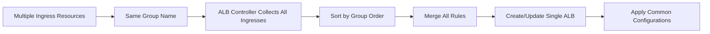

# Section 18: Ingress Groups

<details open>
<summary><b>Section 18: Ingress Groups</b></summary>

## Table of Contents
- [18.1 Introduction to Ingress Groups](#181-introduction-to-ingress-groups)
- [18.2 Implement Ingress Groups Demo with 3 Apps](#182-implement-ingress-groups-demo-with-3-apps)
- [Summary](#summary)

## 18.1 Introduction to Ingress Groups

### Overview
This section introduces Ingress Groups, an advanced feature that enables grouping multiple Kubernetes ingress resources together to create a single Application Load Balancer. The groups feature solves scalability issues with managing large numbers of applications in a single ingress manifest.

### Key Concepts

#### Ingress Groups Feature
```diff
+ Multiple ingress resources grouped together
+ Single ALB shared across multiple ingress manifests
+ Organized management of large application portfolios
+ Independent rule definitions per ingress resource
- Complex maintenance of monolithic ingress manifests
- Rule conflicts and ordering issues
```

#### Architecture Comparison

**Single Ingress (Traditional)**
```yaml
apiVersion: networking.k8s.io/v1
kind: Ingress
metadata:
  name: monolithic-ingress
spec:
  rules:
  - host: app1.domain.com
  - host: app2.domain.com
  - host: app3.domain.com
  # All 50+ apps in one file
```

**Ingress Groups (Scalable)**
```yaml
# App1 Ingress
apiVersion: networking.k8s.io/v1
kind: Ingress
metadata:
  name: app1-ingress
  annotations:
    alb.ingress.kubernetes.io/group.name: my-apps.web
    alb.ingress.kubernetes.io/group.order: 10

# App2 Ingress
apiVersion: networking.k8s.io/v1
kind: Ingress
metadata:
  name: app2-ingress
  annotations:
    alb.ingress.kubernetes.io/group.name: my-apps.web
    alb.ingress.kubernetes.io/group.order: 20

# All create single ALB: ingress-groups-demo
```

#### Ingress Group Annotations
```diff
+ alb.ingress.kubernetes.io/group.name: Defines group membership
+ alb.ingress.kubernetes.io/group.order: Defines rule priority (lower = higher priority)
+ Shared ALB configuration: Annotations from first ingress applied to ALB
- Requires consistent ALB configuration across group members
- Manual ordering management
```

#### Group Processing Flow


### Benefits
```diff
+ Modularity: Independent ingress manifests per application
+ Maintainability: Smaller, focused configuration files
+ Scalability: Support for hundreds of applications
+ Team Ownership: Different teams can own different ingress resources
+ Conflict Avoidance: Clear separation of concerns
- Initial Setup Complexity: Requires understanding of group concepts
- Annotation Management: Must maintain group and order annotations across ingresses
```

## 18.2 Implement Ingress Groups Demo with 3 Apps

### Overview
This section demonstrates practical implementation of ingress groups using three applications (app1, app2, app3) organized into separate ingress resources that collectively create a single Application Load Balancer.

### Key Concepts

#### Directory Structure
```
kube-manifests/
├── app1/
│   ├── 01-Nginx-App1-Deployment.yaml
│   ├── 01-Nginx-App1-Service.yaml
│   └── 02-App1-Ingress.yaml
├── app2/
│   ├── 01-Nginx-App2-Deployment.yaml
│   ├── 01-Nginx-App2-Service.yaml
│   └── 02-App2-Ingress.yaml
└── app3/
    ├── 01-Nginx-App3-Deployment.yaml
    ├── 01-Nginx-App3-Service.yaml
    └── 02-App3-Ingress.yaml
```

#### App1 Ingress Configuration
```yaml
apiVersion: networking.k8s.io/v1
kind: Ingress
metadata:
  name: app1-ingress
  annotations:
    kubernetes.io/ingress.class: alb
    alb.ingress.kubernetes.io/scheme: internet-facing
    alb.ingress.kubernetes.io/target-type: ip
    alb.ingress.kubernetes.io/load-balancer-name: ingress-groups-demo
    alb.ingress.kubernetes.io/group.name: my-apps.web
    alb.ingress.kubernetes.io/group.order: 10
    alb.ingress.kubernetes.io/listen-ports: '[{"HTTP": 80}, {"HTTPS":443}]'
    alb.ingress.kubernetes.io/ssl-redirect: '443'
    alb.ingress.kubernetes.io/certificate-arn: arn:aws:acm:us-east-1:123456789012:certificate/12345678-1234-1234-1234-123456789012
    external-dns.alpha.kubernetes.io/hostname: app1.stacksimplify.com
spec:
  rules:
  - host: app1.stacksimplify.com
    http:
      paths:
      - path: /
        pathType: Prefix
        backend:
          service:
            name: app1-nginx-service
            port:
              number: 80
```

#### App2 Ingress Configuration
```yaml
apiVersion: networking.k8s.io/v1
kind: Ingress
metadata:
  name: app2-ingress
  annotations:
    kubernetes.io/ingress.class: alb
    alb.ingress.kubernetes.io/scheme: internet-facing
    alb.ingress.kubernetes.io/target-type: ip
    alb.ingress.kubernetes.io/load-balancer-name: ingress-groups-demo
    alb.ingress.kubernetes.io/group.name: my-apps.web
    alb.ingress.kubernetes.io/group.order: 20
    external-dns.alpha.kubernetes.io/hostname: app2.stacksimplify.com
  # Common annotations (certificate, ports) inherited from app1
spec:
  rules:
  - host: app2.stacksimplify.com
    http:
      paths:
      - path: /
        pathType: Prefix
        backend:
          service:
            name: app2-nginx-service
            port:
              number: 80
```

#### App3 Ingress Configuration
```yaml
apiVersion: networking.k8s.io/v1
kind: Ingress
metadata:
  name: app3-ingress
  annotations:
    kubernetes.io/ingress.class: alb
    alb.ingress.kubernetes.io/scheme: internet-facing
    alb.ingress.kubernetes.io/target-type: ip
    alb.ingress.kubernetes.io/load-balancer-name: ingress-groups-demo
    alb.ingress.kubernetes.io/group.name: my-apps.web
    alb.ingress.kubernetes.io/group.order: 30
    external-dns.alpha.kubernetes.io/hostname: app3.stacksimplify.com
spec:
  rules:
  - host: app3.stacksimplify.com
    http:
      paths:
      - path: /
        pathType: Prefix
        backend:
          service:
            name: app3-nginx-service
            port:
              number: 80
```

#### Deployment Process
```bash
# Deploy all applications and ingresses
kubectl apply -f app1/
kubectl apply -f app2/
kubectl apply -f app3/

# Verify deployments and ingresses
kubectl get deployments  # All should be running
kubectl get services     # NodePort services created
kubectl get ingress      # Three separate ingress resources

# Check ALB creation in AWS Console
# Load Balancers > ingress-groups-demo
# Should show single ALB with rules from all ingresses
```

#### Rule Priority and Merging
```mermaid
graph TD
    A[ALB Controller] --> B[Collect Ingress Group Members]
    B --> C[Sort by Group Order: 10, 20, 30]
    C --> D[App1 Rules (order: 10)]
    C --> E[App2 Rules (order: 20)]
    C --> F[App3 Rules (order: 30)]
    D --> G[Apply Rules to ALB]
    E --> G
    F --> G
```

#### Verification Steps
```bash
# Check ingress group summary
kubectl get ingress -o wide
# All three ingresses show same ALB DNS name

# Test ALB configuration
aws elbv2 describe-load-balancers --names ingress-groups-demo

# Verify listeners and rules
aws elbv2 describe-listeners --load-balancer-arn <alb-arn>

# Test applications
curl -I https://app1.stacksimplify.com/
curl -I https://app2.stacksimplify.com/
curl -I https://app3.stacksimplify.com/

# Check External DNS logs
kubectl logs -f deployment/external-dns
```

#### Cleanup Process
```bash
# Delete ingresses first (ALB remains until all group members deleted)
kubectl delete ingress app1-ingress app2-ingress app3-ingress

# Delete applications
kubectl delete -f app1/ -f app2/ -f app3/

# Verify ALB deletion (should happen automatically)
aws elbv2 describe-load-balancers --names ingress-groups-demo
# Should return LoadBalancerNotFound or empty
```

### Annotations Inheritance Rules
```diff
+ First ingress (lowest order) provides ALB-level annotations
+ Subsequent ingresses cannot override ALB configuration
+ Path-specific annotations can differ per ingress
! Ensure consistent ALB settings across group members
- Mismatched annotations cause deployment conflicts
```

### Troubleshooting
```diff
! Ingress not joining group: Check group.name annotation spelling
! Wrong rule order: Verify group.order values
! ALB not created: Ensure first ingress has complete ALB configuration
! Rule conflicts: Review path patterns and host rules across ingresses
- Partial cleanup: ALB persists until all group ingresses deleted
```

### Common Issues
```diff
- Group name mismatch causes separate ALBs
- Missing order causes random rule precedence
- Inconsistent ALB names create multiple load balancers
- Annotation conflicts between group members
+ First ingress failure prevents group creation
```

## Summary

### Key Takeaways
```diff
+ Ingress groups enable scalable ingress management with multiple resources
+ Single ALB created from multiple ingress manifests using group.name
+ Rule ordering controlled by group.order annotation (lower = higher priority)
+ First ingress (lowest order) provides ALB-level configuration
+ Independent management and ownership of ingress resources
```

### Quick Reference
```yaml
# Ingress group member template
apiVersion: networking.k8s.io/v1
kind: Ingress
metadata:
  name: myapp-ingress
  annotations:
    # Required group annotations
    alb.ingress.kubernetes.io/group.name: shared-alb
    alb.ingress.kubernetes.io/group.order: 10

    # ALB configuration (first ingress only)
    alb.ingress.kubernetes.io/load-balancer-name: shared-alb-name
    alb.ingress.kubernetes.io/certificate-arn: arn:aws:acm:...

spec:
  rules:
  - host: myapp.domain.com
    http:
      paths:
      - path: /
        pathType: Prefix
        backend:
          service:
            name: myapp-service
            port:
              number: 80
```

```bash
# Deploy ingress group
kubectl apply -f app1-ingress.yaml
kubectl apply -f app2-ingress.yaml
kubectl apply -f app3-ingress.yaml

# Verify group formation
kubectl get ingress -o yaml | grep -A5 -B5 "group\."
aws elbv2 describe-load-balancers --names shared-alb-name

# Cleanup (ALB deleted when last ingress removed)
kubectl delete ingress app1-ingress app2-ingress
kubectl delete ingress app3-ingress  # ALB deleted here
```

### Expert Insight

#### Real-world Application
- **Microservices Architecture**: Separate ingress per microservice with shared ALB
- **Multi-team Development**: Different teams manage their own ingress resources
- **Blue-Green Deployments**: Group ingresses for different deployment environments
- **API Gateways**: Organize API routes across multiple ingress manifests
- **Traffic Splitting**: Advanced routing rules across application groups

#### Expert Path
- **Group Lifecycle Management**: Automated ingress group creation and cleanup
- **Dynamic Ordering**: Programmatic rule priority assignment
- **Cross-namespace Groups**: Advanced group configurations across Kubernetes namespaces
- **Group Monitoring**: Health checks and metrics for ingress group members
- **Group Migration**: Moving applications between ingress groups without downtime

#### Common Pitfalls
- ❌ Inconsistent group names create multiple ALBs instead of shared ALB
- ❌ Missing or duplicate order values cause undefined rule precedence
- ❌ ALB configuration conflicts between first ingress and group members
- ❌ Partial deployment failures leave orphaned ingresses in group
- ❌ Manual rule ordering becomes unmanageable with large application counts
- ❌ Certificate management complexity when shared across group members

</details>