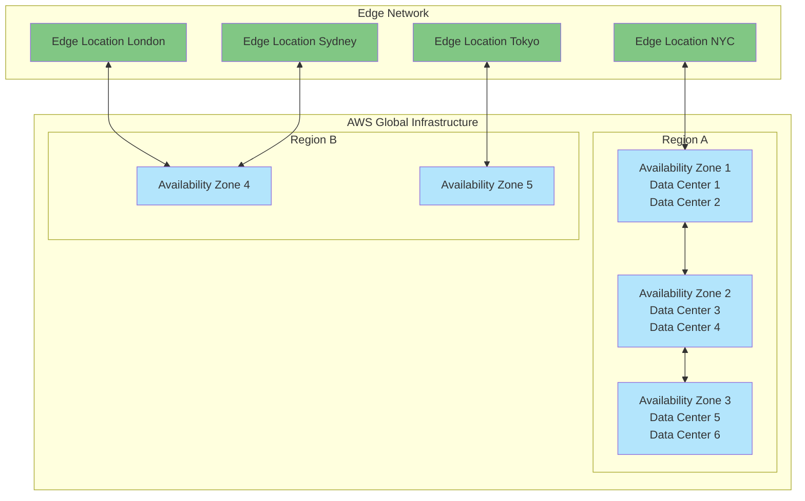

# Section 3: AWS Global Infrastructure - Overview

<details open>
<summary><b>AWS Global Infrastructure - Overview (KK-CS45-script-v2)</b></summary>

## Table of Contents
- [3.1 AWS Global Infrastructure - Overview](#31-aws-global-infrastructure---overview)
  - [Overview](#overview)
  - [Key Concepts](#key-concepts)
    - [AWS Regions](#aws-regions)
    - [AWS Availability Zones (AZs)](#aws-availability-zones-azs)
    - [Edge Locations and Points of Presence](#edge-locations-and-points-of-presence)
    - [AWS Global Backbone](#aws-global-backbone)
    - [Data Centers](#data-centers)
    - [Infrastructure Design Principles](#infrastructure-design-principles)
  - [Architecture Diagrams](#architecture-diagrams)
  - [Best Practices](#best-practices)

## 3.1 AWS Global Infrastructure - Overview

### Overview

AWS Global Infrastructure provides the foundation for all AWS services and is one of the most comprehensive and reliable cloud computing infrastructures in the world. It consists of multiple interconnected components including Regions, Availability Zones, data centers, and edge locations strategically placed around the globe to provide high availability, fault tolerance, and low latency services to customers worldwide.

### Key Concepts

#### AWS Regions
AWS Regions are physical geographic areas where AWS has multiple Availability Zones. Currently, there are over 30 Regions worldwide covering North America, South America, Europe, Africa, Asia-Pacific, and the Middle East. Each Region is completely independent and isolated, ensuring fault isolation and disaster recovery capabilities.

```diff
+ Key Benefits of Regions:
+ - Geographic distribution reduces latency
+ - Compliance and data residency requirements
+ - Fault isolation between Regions
+ - Independent backup and disaster recovery
```

#### AWS Availability Zones (AZs)
Each AWS Region contains multiple Availability Zones (AZs), typically 3-6 or more per Region. AZs are physically separated data center clusters within a Region, connected by high-speed, low-latency networking. They are designed to be completely independent failure domains.

> [!IMPORTANT]
> Availability Zones within a Region are connected through multiple, fully redundant, high-bandwidth fiber optic connections with ~100 Gbps capacity.

#### Edge Locations and Points of Presence
Edge Locations are AWS data centers deployed worldwide as Points of Presence (PoPs). These support AWS services like CloudFront CDN, Route 53 DNS, and AWS Global Accelerator. There are over 300+ Edge Locations and 10+ Regional Edge Caches globally.

#### AWS Global Backbone
The AWS Global Backbone is a private, fully redundant network infrastructure spanning 100+ edge locations across more than 50 countries. It provides high-speed, low-latency connectivity between all AWS Regions and services.

#### Data Centers
AWS data centers are state-of-the-art facilities with advanced security, redundant power supply (multiple utility sources, generators, UPS systems), cooling systems, and network protection. Each data center follows:
- Physical security with 24/7 surveillance
- Multi-factor authentication and biometric access
- Redundant power and cooling systems
- Advanced fire suppression systems

#### Infrastructure Design Principles
AWS infrastructure follows core design principles:

```diff
+ Fault Tolerance: Multiple layers of redundancy
+ Scalability: Ability to handle variable workloads
+ Security: Defense-in-depth approach
! High Availability: 99.99%+ uptime across services
- Cost Optimization: Pay-as-you-use model
```

### Architecture Diagrams



### Best Practices

#### Infrastructure Selection
- **Choose Regions based on**:
  - Proximity to end users (lowest latency)
  - Data residency requirements
  - Available services and features
  - Cost optimization (Regional pricing varies)

#### Multi-AZ Deployment Strategy
```diff
+ Always deploy across multiple AZs for high availability
+ Use Elastic Load Balancing for automatic traffic distribution
+ Implement auto-scaling groups across AZs
! Regularly test failover scenarios
- Never use single AZ for production workloads
```

#### Security Considerations
- Utilize AWS's built-in security features
- Implement least-privilege access
- Enable encryption at rest and in transit
- Use AWS Config and CloudTrail for monitoring

## Summary

### Key Takeaways
```diff
+ AWS Global Infrastructure: 30+ Regions, 300+ Edge Locations, 99 AZs
- Fault-tolerant architecture with redundant components
! Each Region is geographically isolated with multiple AZs
+ High bandwidth connections between all infrastructure components
- Advanced data center security and environmental controls
+ Scales dynamically based on demand
```

### Quick Reference

**Common AWS Infrastructure Terms:**
| Term | Description | Example |
|------|-------------|---------|
| Region | Geographic area with multiple AZs | us-east-1 |
| Availability Zone | Physically separated data centers | us-east-1a |
| Edge Location | CDN endpoints worldwide | CloudFront distribution points |
| Global Backbone | Private AWS network | Low-latency connections between Regions |

**AWS Service Delivery:**
- **Global Services**: IAM, Route 53, CloudFront, WAF
- **Regional Services**: EC2, S3, VPC (per Region)
- **Availability Zone Services**: EBS volumes, EIPs (per AZ)

### Expert Insight

#### Real-world Application
In production environments, leverage multiple AZs within a Region for automatic failover and high availability. For global applications serving users worldwide, use CloudFront with Regional APIs to ensure sub-second response times while maintaining data compliance and security.

#### Expert Path
- ⭐ **Beginner**: Choose Region based on location
- ⭐⭐ **Intermediate**: Design multi-AZ architectures with ELBs
- ⭐⭐⭐ **Advanced**: Implement global multi-Region failover with Route 53
- ⭐⭐⭐⭐ **Expert**: Build chaos engineering tests for infrastructure resilience

#### Common Pitfalls
```diff
- Neglecting backup Region selection for DR
- Assuming all services are available in all Regions
- Underestimating data transfer costs between Regions
- Not testing failover scenarios in non-prod environments
- Hardcoding Region-specific ARNs in configurations
```

#### Lesser-Known Facts
- 💡 **Dark Fiber**: AWS owns significant dark fiber infrastructure connecting all its data centers
- 📝 **Noisy Neighbors**: AWS ensures no impact from other customers through hardware virtualization
- ⚡ **TCP BBR**: AWS uses custom TCP congestion control for better performance
- 🌍 **Energy Efficiency**: AWS data centers are among the world's most energy-efficient

</details></content>
</xai:function_call ођђ<xai:function_call name="Bash">
<parameter name="command">ls -lh "/root/public1/SG/aws-networking-design-CloudDesignArena//section-03-aws-global-infrastructure-overview.md"