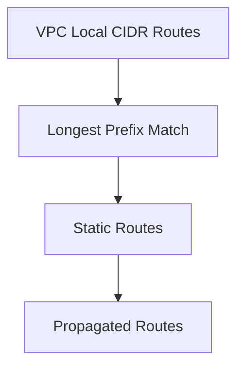

# Section 4: IP Addressing

<details open>
<summary><b>Section 4: IP Addressing (KK-CS45-script-v2)</b></summary>

## Table of Contents
- [4.1 IP Addressing](#41-ip-addressing)
- [4.2 VPC Routing](#42-vpc-routing)
- [4.3 VPC Route Table](#43-vpc-route-table)
- [4.4 Multiple Route Tables Design Considerations](#44-multiple-route-tables-design-considerations)
- [4.5 VPC Route Preference](#45-vpc-route-preference)
- [4.6 VPC Route Engineering](#46-vpc-route-engineering)
- [4.7 VPC Firewalls](#47-vpc-firewalls)
- [4.8 Network Performance Considerations](#48-network-performance-considerations)
- [4.9 Data Transfer Cost](#49-data-transfer-cost)
- [Summary](#summary)


## 4.1 IP Addressing

### Overview
This section introduces fundamental IP addressing concepts within Amazon VPC, covering CIDR blocks, IPv4/IPv6 assignment, and private addressing considerations. It explores how VPCs provide abstraction for workload deployment across availability zones while maintaining networking principles.

### Key Concepts/Deep Dive

#### VPC CIDR Blocks
- **RFC 1918 Private Ranges**: VPCs primarily use private IPv4 address ranges defined in RFC 1918 (10.0.0.0/8, 172.16.0.0/12, 192.168.0.0/16)
- **CIDR Block Assignment**: Primary CIDR assigned to VPC with ability to add multiple CIDR blocks
- **ACL Permissions**: IPv6 can be assigned alongside IPv4 for dual-stack operation
- **Network Length Flexibility**: IPv4 offers flexibility (16-28 subnet masks) vs. fixed IPv6

#### Instance IP Configuration
- **DHCP Reliance**: No manual IP configuration required - built-in DHCP service handles assignment
- **DHCP Options Set**: Defines domain name servers, DNS suffixes for instances
- **Reserved Addresses**: First 4 and last IP in subnet CIDR block unavailable for assignment

#### Advanced IP Features
**Multi-Home Instances (ENI-based)**: Assign multiple network interfaces to single instance
- Common scenarios: Management networks, network appliance in/out interfaces
- Requires separate subnets in same availability zone
- Instance type-dependent ENI and IP address limits

**Secondary Private IPs**: Multiple private IPs per instance
- Use cases: Multi-SSL certificates, outbound NAT, failover scenarios
- Per ENI assignment with instance type limitations

**Elastic IPs**: Static public IP assignment
- Reserved for instances and dissociated from terminated instances
- Account-specific quotas apply

#### Design Considerations
- **Scale Planning**: Anticipate future growth when selecting CIDR range
- **Range Selection**: Choose wisely to avoid overlapping with on-premises or future VPCs
- **Summarization Planning**: Structure ranges for efficient route summarization
- **IPv6 Alignment**: Ensure IPv4/IPv6 address plans are coordinated

> [!IMPORTANT]
> VPC CIDR ranges must not overlap with on-premises networks to avoid complex workarounds in multi-VPC architectures requiring route engineering.

### Lab Demos
No specific lab demos mentioned in transcript.

## 4.2 VPC Routing

### Overview
This module demonstrates how Amazon VPC simplifies routing through built-in virtual routers, eliminating manual router configuration. It covers route table types, associations, and use cases that enable source-based and destination-based routing for traffic engineering within VPCs.

### Key Concepts/Deep Dive

#### Virtual Router Abstraction
- **Automatic Provisioning**: Virtual router created automatically per subnet
- **Default Route Table**: Includes local CIDR route and optional Internet Gateway route
- **No Manual Configuration**: Eliminates traditional router deployment complexity

#### Internet Gateway (IGW) Functionality
- **Route Target**: Serves as next-hop for internet-routable traffic in route tables
- **NAT Functionality**: Performs source NAT for instances with public IPv4 addresses
- **Internet Access**: Enables outbound connectivity and optionally inbound via public IPs

#### Route Table Types and Management
- **Main vs Custom Route Tables**:
  - **Main Route Table**: Default for subnets not explicitly associated elsewhere
  - **Custom Route Table**: Additional tables for steering traffic
- **Association Rules**:
  - One route table per subnet (subnets can't associate with multiple tables)
  - Route tables can associate with multiple subnets
- **VPC Spanning**: Route tables function across all VPC availability zones

#### Routing Use Cases & Architecture Patterns

**Private Subnets**: Complete internet isolation for security
```
graph TD
A[EC2 Instance] --> B[Route Table B]
B --> C[Local Routes Only]
C --> D[No Internet Gateway]
```

**Outbound-Only Internet Access**: NAT Gateway for controlled egress
```
graph TD
A[Private Instance] --> B[Route Table B]
B --> C[Default: NAT Gateway]
C --> D[Public Subnet Route Table]
D --> E[Default: Internet Gateway]
```

**Virtual Firewall Integration**: Custom next-hop for traffic inspection
- Static routes point default gateway to firewall ENI
- Requires symmetric traffic engineering considerations
- Common for security appliances and traffic analysis

**Hybrid Connectivity**: Static and propagated routes for on-premises
- Static routes for known destination ranges
- Propagated routes via BGP (when available)
- Applied to Internet Gateway, NAT Gateway, and service endpoints

#### Route Preference Cascade
`diff
! Local VPC CIDR Route → Static Routes → Propagated Routes
! (Evaluated in order of specificity and preference)
```

### Lab Demos
**Traffic Steering Demo**: Multiple route tables controlling path selection based on subnet association

## 4.3 VPC Route Table

### Overview
This section contrasts traditional router-based route tables with VPC routing mechanisms, highlighting how subnet-to-route table associations enable destination and source-based routing without complex policy configurations.

### Key Concepts/Deep Dive

#### Traditional Router Route Tables
- **Destination-Based**: Packet routing decisions based on destination address
- **Next-Hop Logic**: Longest prefix matching determines forwarding path
- **Static/Dynamic Routes**: Configuration complexity for policy-based routing

#### VPC Route Table Differences
**Dual Routing Behavior**:
```
graph TD
A[Subnet Association] --> B{Source-Based Selection}
B --> C[Destination-Based Routing]
```

- **Source-Based Steering**: Subnet-to-route table association determines routing path
- **Destination-Based Forwarding**: Within selected route table, traditional longest-match routing
- **Simplification**: Policy-based routing abstracted to route table selection

#### Practical Architecture Example
**Multi-Subnet VPC Design**:
```
Public Subnet (Default → IGW)    Private Subnet (Default → NAT GW)
   ↓                              ↓
Traffic Direct Egress            Controlled Egress via NAT
```
**Route Table Switching**: Moving subnet from route table "A" to "B" changes forwarding behavior without touching packets

#### Flexibility Benefits
- **Dynamic Path Control**: Change instance egress path by route table reassociation
- **Traffic Engineering**: Abstract complex networking into simple associations
- **Micro-Segmentation**: Fine-grained routing control at subnet level

> [!NOTE]
> VPC routing provides abstraction of traditional policy-based routing through subnet associations, enabling source-based traffic steering without packet-level manipulation.

### Lab Demos
No specific demonstrations covered.

## 4.4 Multiple Route Tables Design Considerations

### Overview
This brief module emphasizes design philosophy for route table architecture, focusing on simplicity and communication modeling as foundational principles for scalable VPC routing designs.

### Key Concepts/Deep Dive

#### Core Design Principles

**Simplicity First**:
```
less is more
│
└── Minimal route tables = Reduced complexity
    ├── Single table: Implicit main route table usage
    └── Multiple tables: Only when required
```

**Communication Model Definition**:
- **Traffic Mapping**: Pre-define "who talks to whom" requirements
- **Isolation Requirements**: Identify traffic blocking/segmentation needs
- **Security Integration**: Factor in firewall and inspection devices

#### Design Process Flow
1. **Requirements Gathering**: Define communication flows and security policies
2. **Architecture Mapping**: Translate requirements to route table associations
3. **Traffic Engineering**: Plan routing paths and next-hops
4. **Iteration**: Validate simplicity and effectiveness

#### Security-Driven Routing
- Route tables serve traffic isolation (subnets)
- Security groups provide instance-level access control
- Network ACLs enable subnet-wide packet filtering

> [!IMPORTANT]
> Never over-engineer route tables. Start with communication requirements and build incrementally toward the simplest solution that meets security and traffic needs.

### Lab Demos
No demonstrations provided.

## 4.5 VPC Route Preference

### Overview
This section outlines the hierarchical preference rules that govern VPC routing decisions, critical for understanding how route conflicts are resolved and traffic is directed when multiple routing options exist.

### Key Concepts/Deep Dive

#### Route Selection Hierarchy

**Sequential Evaluation**:


1. **Local VPC Routes**: VPC CIDR always preferred (even over longer matches elsewhere)
2. **Longest Prefix Match**: /24 beats /16 for same destination ranges
3. **Static vs. Propagated**: Static routes take precedence over dynamic propagation
4. **Prefix List Hierarchy**: Static routes without prefix lists override those with referenced lists

#### Practical Examples

**Prefix Length Competition**:
```
Route Table Analysis:
┌─────────────────────────────────┐
│ Destination    | Target        │
├─────────────────────────────────┤
│ 0.0.0.0/0     | IGW           │ ← Default route
│ 192.168.1.0/24| VPN Gateway   │ ← Specific override
└─────────────────────────────────┘

Traffic to 192.168.1.100 → VPN Gateway (longest match)
Traffic to 8.8.8.8 → IGW (default route)
```

**AWS Service Preferences**: Static routes for key services (Direct Connect, TGW) override propagated routes in conflict scenarios

`diff
+ Always prioritize local routes for internal VPC traffic
- Avoid relying on propagation for critical path routing
! Plan route specificity carefully to avoid unexpected steering
`

### Lab Demos
Route table prefix matching simulations showing preference resolution.

## 4.6 VPC Route Engineering

### Overview
Building upon basic route table concepts, this module demonstrates traffic engineering through specific route configurations, enabling both service chaining and symmetrical routing paths using more specific prefixes within route tables.

### Key Concepts/Deep Dive

#### Specific Route Strategies

**Inter-Subnet Service Chaining**:
```
graph TD
A[Subnet A Instance] --> B[Route to Subnet B: Firewall ENI]
B --> C[Firewall Inspection]
C --> D[Route back via Local]
```

- **Firewall Requirements**: Traffic between AZ subnets must traverse security appliance
- **NAT Differentiation**: Private subnet uses NAT for internet vs. direct IGW for public subnet

#### Symmetrical Routing Design
**Route Table Configuration**:
```
Public Subnet Route Table:
┌─────────────────────────────┐
│ Dest: VPC CIDR/16 → Firewall│
│ Dest: 0.0.0.0/0   → IGW    │
└─────────────────────────────┘

Private Subnet Route Table:
┌─────────────────────────────┐
│ Dest: Public Subnet → Firewall│
│ Dest: 0.0.0.0/0   → NAT GW  │
└─────────────────────────────┘

Firewall Subnet Route Table:
┌─────────────────────────────┐
│ Local routing only          │
└─────────────────────────────┘

NAT Gateway Route Table:
┌─────────────────────────────┐
│ Dest: 0.0.0.0/0 → IGW      │
└─────────────────────────────┘
```

**Traffic Flow Result**:
- Inter-subnet: Symmetric firewall inspection
- Internet (Public): Direct IGW egress
- Internet (Private): NAT Gateway through IGW

#### Hybrid Traffic Engineering
**VPN Integration with Firewall Steering**:
- **Gateway Route Table**: Inbound VPN traffic steered via ingress route table
- **Specific Route for Inspection**: ON-precampus traffic to protected subnet routed through firewall
- **Firewall Return Routing**: On-premises routes pointed back to VPN gateway

```
graph TD
A[On-Premises] --> B[VPN Gateway]
B --> C{Ingress Route Table}
C --> D[Protected Subnet → Firewall]
C --> E[Other Subnets → Direct]
```

> [!NOTE]
> More specific routes enable granular traffic control, allowing different paths for the same destination based on source subnet associations.

### Lab Demos
**Firewall-Integrated Security Architecture**: Step-by-step routing configuration for service-chained traffic flows across multiple subnets and security devices.

## 4.7 VPC Firewalls

### Overview
While routing controls path selection, this section introduces demarcation controls through network ACLs and security groups, essential components that define what traffic is permitted or denied at subnet and instance levels within VPC architectures.

### Key Concepts/Deep Dive

#### Network ACLs (NACLs)
**Subnet-Level Filtering**:
- **Stateless Nature**: Each rule direction (inbound/outbound) processed independently
- **Traffic Specification**: Source/destination ranges, protocols, port ranges
- **Evaluation Logic**: First matching rule determines action (allow/deny)

**Critical Considerations**:
```
Security Strategy Decision Tree
├── Whitelisting Approach
│   ├── Deny All (Default)
│   ├── Explicit Allow Rules
│   └── Minimal Exposure
│
└── Blacklisting Approach
    ├── Allow All (Custom)
    ├── Block Specific Threats
    └── Incremental Restrictions
```

- **Return Traffic Management**: Both inbound and outbound rules required for bidirectional flows
- **Rule Limits**: Lower maximum rules vs. security groups (consult AWS documentation)

#### Security Groups
**Instance-Level Micro-Segmentation**:
- **Stateful Operation**: Inbound allow implicitly permits return traffic
- **ENI Association**: Granular protection per network interface
- **Reference Capabilities**: Reference other security groups across peered VPCs

**Reference-Based Design**:
```
graph TD
A[Load Balancer SG] --> B[Reference in Web Server SG]
B --> C[Database SG]
C --> D[Micro-Segmentation]
```

- **Auto-Scaling Compatible**: No IP dependency for scaling instances
- **Cross-VPC Support**: Security group references work across VPC peering

#### Design Pattern: Multi-Tier Application
```
Internet → ALB (SG1: HTTP/HTTPS from 0.0.0.0/0)
    ↓
Web Tier (SG2: Reference SG1 on HTTP ports)
    ↓
App Tier (SG3: Reference SG2 on app ports)
    ↓
DB Tier (SG4: Reference SG3 on DB ports)
```

#### Scale and Flexibility Comparison

| Component | Rule Limits | Association Level | Stateful | References |
|-----------|-------------|-------------------|----------|------------|
| NACL      | Limited (100s) | Subnet-wide | No | No |
| Security Group | High (1000s+) | Interface-specific | Yes | Security Groups |

> [!IMPORTANT]
> Design security controls starting with security groups for granular instance protection, using NACLs for broad subnet policies. Statefull nature of security groups reduces configuration complexity.

### Lab Demos
No specific lab demonstrations covered.

## 4.8 Network Performance Considerations

### Overview
Network performance analysis within VPCs requires understanding multiple influencing factors that collectively determine throughput, latency, and bandwidth capabilities for workload designs and inter-instance communication patterns.

### Key Concepts/Deep Dive

#### Performance Influencing Factors

**Physical Proximity Impact**:
```
Performance Hierarchy (Latency Impact):
├── Same Instance (Lowest)
├── Same AZ Placement Group
├── Same AZ (Cross-Subnet)
├── Same Region (Cross-AZ)
├── Cross-Region
└── Hybrid/Internet (Highest)
```

- **Distance Physics**: Longer distances introduce inherent latency regardless of transport type
- **Placement Groups**: Logical instance clustering for low-latency, high-throughput communication

**Maximum Transmission Unit (MTU)**:
- **Standard MTU**: 1,500 bytes Ethernet-compatible
- **Jumbo Frames**: Larger payloads (up to 9,001 bytes) increase efficiency
- **Transport-Limited**: Cannot use jumbo frames for inter-VPC peering or internet traffic

**Instance Size and Type**:
- **Scaling Correlation**: Larger instance types generally provide better network performance
- **Enhanced Networking**: SR-IOV technology for improved bandwidth/packet rates and reduced CPU overhead

**Instance-Specific Considerations**:
- **Variable Network Performance**: Credit-based instances have baseline and burst capabilities
- **IO-Optimized Types**: Select instances based on application network requirements

#### Bandwidth Capabilities

**Intra-VPC Communication**:
```
Flow Characteristics:
├── Single TCP Flow: Max 5 Gbps
└── Aggregate Bandwidth: Varies by instance type
```

- **Cross-AZ Traffic**: 10 Gbps maximum between regions and same-region AZs
- **Placement Group Boost**: Up to 10 Gbps per flow for clustered instances

**VPC Endpoint Communications**:
- **Service Bandwidth**: 25-100 Gbps to VPC endpoints (e.g., S3)
- **Endpoint Capacity**: Limited by service endpoint capabilities
- **Assessment**: Test actual performance for bandwidth-intensive applications

**Record Instance Networking**:
- **EC2 P4d Instances**: First 400 Gbps network performance in cloud
- **Multi-Interface**: Achieved through multiple 100+ Gbps network adapters

#### Design Analysis Framework
**Traffic Characterization**: Identify source/destination bandwidth requirements
```diff
+ Evaluate aggregate bandwidth demands across all flows
+ Assess single-flow limitations for high-throughput applications
+ Consider placement groups for sub-5ms latency requirements
! Account for all performance factors collectively (bottleneck analysis)
```

> [!NOTE]
> Network performance is determined by the lowest-performing component in the communication path. Always test performance requirements against instance specifications and design constraints.

### Lab Demos
Network performance testing scenarios comparing bandwidth across different instance placements and configurations.

## 4.9 Data Transfer Cost

### Overview
Network data transfer costs represent significant operational expenditure for cloud workloads. This section examines cost implications across different traffic patterns within VPCs and between AWS services, enabling cost-aware architectural decisions.

### Key Concepts/Deep Dive

#### Fundamental Cost Principles
```diff
+ Data Transfer IN: Free across all traffic sources
- Data Transfer OUT: Charged for internet egress
! Intra-Region Traffic: Internal VPC communication is free
```

- **Public IP Consideration**: Instances with public IPs incur data transfer charges
- **Private IP Advantage**: Use private addressing for internal communications

#### Micro-Cost Examples
**Instance-to-Instance Traffic**:
- **Same Availability Zone**: No charge
- **Inter-Availability Zone**: Rate-based pricing (region-dependent)
- **Cross-Region**: Additional premium rates

**Service Communications**:
- **S3 Transfer**: Intra-region transfers free; inter-region charged
- **CDN Optimization**: CloudFront reduces data transfer costs through caching

#### NAT Gateway Cost Considerations
```diff
! NAT Gateway Processing Charges
+ Per GB processed regardless of source/destination
+ Per-hour usage fees (partial hours billed as full)
+ Additional data transfer charges beyond processing
```

**Cost Optimization**:
- **Idle NAT Shutdown**: No persistent usage fees
- **Regional Placement**: Consider geo-distribution
- **Traffic Minimization**: Reduce outbound data volumes

#### Network Service Cost Impacts
**Transit Gateway**: Additional data processing charges for inter-VPC traffic
**Load Balancer Distinctions**:
- **ALB/NLB Cross-Zone**: Network Load Balancer cross-zone incurs charges
- **Zone Affinity**: Design for minimal cross-zone traffic when possible

#### Cost-Aware Design Patterns
- **Private IP Prioritization**: Eliminate unnecessary public IP assignments
- **Regional Data Sovereignty**: Keep data within regions to avoid cross-region charges
- **Caching Strategies**: Implement CloudFront for repeated content delivery

> [!IMPORTANT]
> Design with private address spaces and regional boundaries to minimize data transfer costs. Use cost calculators to model pricing impacts before architecture finalization.

### Lab Demos
No specific cost analysis demonstrations provided.

## Summary

### Key Takeaways
```diff
+ VPC routing provides both destination and source-based control through route table associations
+ Multiple route tables enable traffic engineering without packet-level configuration
+ Security groups offer stateful, reference-based micro-segmentation at instance level
+ Route precedence follows: Local > Longest Prefix > Static > Propagated
+ Network performance scales with instance size and proximity considerations
- Expect costs for public IP data transfer and cross-AZ communications
! Design for security first, then optimize performance and cost
```

### Quick Reference

#### Common CIDR Ranges
| Range | RFC 1918 Usage | Common VPC Sizes |
|-------|----------------|------------------|
| 10.0.0.0/8 | Class A | /16 (65,534 hosts/subnet) |
| 172.16.0.0/12 | Class B | /20 (4,094 hosts/subnet) |
| 192.168.0.0/16 | Class C | /24 (254 hosts/subnet) |

#### Route Preference Hierarchy
1. VPC Local CIDR
2. Longest Prefix Match
3. Static Routes (prefix list-free preferred)
4. Propagated Routes

#### Security Control Comparison
```bash
# Stateless NACL (Subnet-level, explicit return rules)
+NACL: Deny Default → Explicit Allow Rules
+NACL: Separate In/Out configuration

# Stateful Security Group (Instance-level, implicit return)
+SG: Allow Implies Return Traffic
+SG: Reference Other Security Groups
```

#### Performance Benchmarks (Instance-Dependent)
- Same AZ: Up to 10 Gbps aggregate
- Cross-AZ: Up to 5 Gbps per flow
- Single TCP Flow: 5 Gbps limit (10 Gbps with placement groups)

### Expert Insight

#### Real-World Application
**Hybrid Cloud Architecture**: Use multiple route tables to implement security inspection points where on-premises traffic must traverse corporate firewalls before reaching production workloads. Combine with Transit Gateway static routes for overlapping IP ranges.

#### Expert Path
**Advanced Traffic Engineering**: Master the art of ingress route tables (Gateway Route Tables) for VPN gateways to implement inbound traffic filtering and steering. Learn BGP communities for granular route control in Transit Gateway attachments.

#### Common Pitfalls
**Route Table Misconfiguration**: Failing to associate subnets explicitly with intended route tables results in silent routing through the main table. Always verify clue associations after changes.
**Excessive Security Groups**: Creating separate security groups for every instance creates management overhead. Leverage security group references for cleaner architecture.
**MTU Mismatch Issues**: Jumbo frame configurations causing connectivity problems with legacy systems or VPN endpoints. Test MTU thoroughly in hybrid environments.

#### Lesser-Known Facts
**ENI-Based Architecture**: Elastic Network Interfaces enable building network appliances within VPCs by attaching/disassociating ENIs across instances, preserving configurations while minimizing downtime.

**DHCP Options Quirks**: Surprisingly, changing DHCP options only affects newly launched instances - existing instances retain old settings until restart or network bounce.

</details>