<details open>
<summary><b>Section 6: Drivers for ELB (KK-CS45-script-v2)</b></summary>

# Section 6: Drivers for ELB

## Table of Contents
- [6.1 Drivers for ELB](#61-drivers-for-elb)
- [6.2 ELB Capabilities Part 1](#62-elb-capabilities-part-1)
- [6.3 ELB Capabilities Part 2](#63-elb-capabilities-part-2)
- [6.4 ELB and API Gateway Design Patterns & Use cases](#64-elb-and-api-gateway-design-patterns--use-cases)
- [6.5 AutoScaling Policies Part 1](#65-autoscaling-policies-part-1)
- [6.6 AutoScaling Policies Part 2](#66-autoscaling-policies-part-2)
- [6.7 AutoScaling Policies Part 3](#67-autoscaling-policies-part-3)
- [6.8 AutoScaling Policies Design Considerations](#68-autoscaling-policies-design-considerations)
- [6.9 Network Load Balancer - NLB](#69-network-load-balancer---nlb)
- [6.10 When to use NLB](#610-when-to-use-nlb)
- [6.11 Application Load Balancer - ALB](#611-application-load-balancer---alb)
- [6.12 Security Filtering Considerations](#612-security-filtering-considerations)
- [6.13 ELB - Migration Design Scenario](#613-elb---migration-design-scenario)
- [6.14 How To Design Multi Region ELB Solution](#614-how-to-design-multi-region-elb-solution)
- [Summary](#summary)

## 6.1 Drivers for ELB

### Overview
This session explores the fundamental reasons for implementing AWS Elastic Load Balancing (ELB) solutions, comparing basic public subnet designs with load-balanced architectures and analyzing key drivers for ELB adoption.

### Key Concepts

#### Basic Public Subnet Design Analysis
Traditional application exposure using public subnets with Internet Gateway routing presents several critical limitations:
- **Resiliency**: Requires self-managed failover and health monitoring
- **Scalability**: Manual scaling lacks elasticity and cost-effectiveness
- **Security**: Direct internet exposure increases attack surface

> [!IMPORTANT]
> Basic designs provide quick setup but lack enterprise-grade resiliency, scalability, and security required for production workloads.

#### Load Balancing Fundamentals
Load balancing distributes requests across multiple application nodes to optimize resource utilization and performance. Key capabilities include:
- SSL/TLS offloading
- DDoS protection
- Header inspection and redirection
- Request routing and health monitoring

#### AWS ELB Service Types
AWS provides three primary load balancing solutions:
- **Classic Load Balancer (CLB)**: Legacy solution for basic EC2 workloads
- **Network Load Balancer (NLB)**: Layer 4 transport layer balancing
- **Application Load Balancer (ALB)**: Layer 7 application layer balancing

All ELBs are fully managed services requiring no infrastructure management while providing powerful load balancing capabilities.

#### Target Groups and Auto Scaling Integration
ELB uses target groups to register EC2 instances with built-in health checks ensuring traffic routes only to healthy resources. Integration with Auto Scaling enables dynamic capacity management based on predefined metrics.

### Deep Dive

#### Design Attributes Comparison

```diff
- Manual Resilience Management: Self-managed health checks and failover
- Static Capacity Planning: Provision for peak loads only
- Direct Internet Exposure: Increased attack surface and complexity
+ Centralized Entry Point: Unified application access regardless of backend scaling
+ Automated Health Monitoring: Built-in checks at multiple layers
+ Dynamic Scaling: Auto Scaling policies respond to demand automatically
```

## 6.2 ELB Capabilities Part 1

### Overview
This session examines core ELB operational principles, multi-AZ architecture patterns, and health check strategies for building resilient load-balanced solutions.

### Key Concepts

#### Target Group Configuration
ELB operates using target groups - pools of resources serving similar requests:
- Listener ports expose applications on specific ports (e.g., TCP 443 for HTTPS)
- Target groups register backend resources (EC2 instances, Lambda functions, etc.)
- DNS alias records enable access via readable names

#### Health Check Mechanisms
ELB performs periodic health checks to determine resource availability:
- **Configuration**: Protocol, port, interval, and timeout settings
- **Layer Support**: Layer 4 (TCP) and Layer 7 (HTTP) health checks
- **Status Assessment**: Instances marked healthy/unhealthy based on check results

#### Multi-AZ Architecture Design
Single AZ designs create single points of failure. Multi-AZ architectures provide:
- **Traffic Distribution**: Equal load across enabled AZs
- **Weighted Routing**: ALB supports percentage-based traffic allocation
- **Automatic Rebalancing**: Failed AZ instances redistributed to healthy zones

#### Auto Scaling Integration
Target groups integrate with EC2 Auto Scaling Groups:
- **Minimum/Maximum Instances**: Define scaling boundaries
- **Metric-Based Scaling**: CPU, memory, or custom metrics trigger scaling
- **Auto-Healing**: Unhealthy instances automatically replaced
- **Health Check Layers**: ELB and EC2 ASG perform complementary checks

### Deep Dive

#### Health Check Architecture Layering

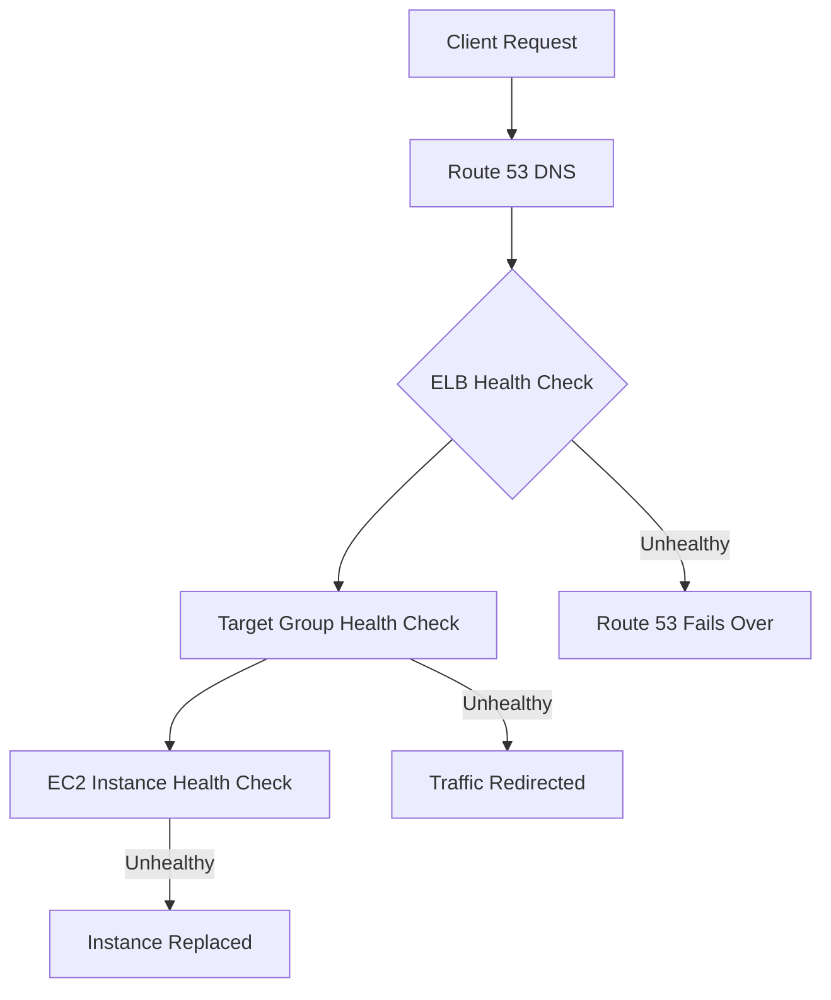

#### Multi-AZ Traffic Flow
- **Equal Distribution**: Default routing balances load across AZs
- **Zone Affinity**: NLB zonal design routes within same AZ
- **Cross-Zone Scaling**: Disabled by default for cost optimization
- **Failure Scenarios**: Auto Scaling launches instances in healthy AZs

> [!NOTE]
> Multi-AZ deployment provides geographic redundancy and improves overall application availability.

#### Stateless Application Design
Optimal ELB utilization requires stateless services:
- **Session Offloading**: Use external storage (ElastiCache, DynamoDB)
- **Horizontal Scaling**: Identical instances support any request
- **Zero Downtime Scaling**: Applications remain available during scaling events

## 6.3 ELB Capabilities Part 2

### Overview
This advanced session covers ELB traffic flow patterns, security group configurations, internal vs. internet-facing load balancers, and integration with AWS security services like Gateway Load Balancer and AWS Network Firewall.

### Key Concepts

#### Traffic Flow and Security Groups
Proper security group configuration is critical for ELB operation:

```bash
# Inbound Rules Required:
# - Allow client traffic to ELB listener ports
# - Allow ELB health checks to target group ports

# Outbound Rules Required:
# - Allow traffic from ELB to backend instances
# - Allow health check responses back to ELB
```

#### Internal vs. Internet-Facing Load Balancers
- **Internet-Facing**: Public IPs, DNS resolvable publicly, routes internet traffic
- **Internal**: Private IPs only, accessible within VPC or connected networks
- **Multi-Tier Applications**: Combine both for secure architecture (web → internal LB → app servers)

### Deep Dive

#### Gateway Load Balancer Integration

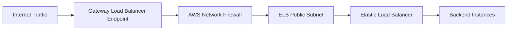

**Routing Configuration:**
- **Outbound Route**: Public subnet IGW → Gateway Load Balancer Endpoint
- **Inbound Route**: Endpoint subnet IGW → ELB subnet (destination: ELB subnet CIDR)

#### AWS Network Firewall Traffic Flow
Similar pattern to Gateway Load Balancer:
- **Security Appliance**: Inspects all traffic before ELB
- **PrivateLink Integration**: Secure communication between components
- **End-to-End Encryption**: Maintains security through inspection layers

> [!IMPORTANT]
> ELB security depends entirely on proper security group configuration. Misconfigurations can block legitimate traffic or expose systems to attack.

#### Hybrid Architecture Considerations
Internal ELBs support on-premises connectivity:
- **Direct Connect/VPN**: Route on-premises traffic to internal ELB
- **Target Registration**: Support IP addresses for hybrid environments
- **Cross-Network Communication**: Maintain private connectivity across networks

## 6.4 ELB and API Gateway Design Patterns & Use cases

### Overview
This session compares AWS ELB and Amazon API Gateway capabilities, providing design patterns for when to use each service independently or in combination for optimal application architectures.

### Key Concepts

#### Service Comparison Matrix

| Capability | Network Load Balancer | Application Load Balancer | API Gateway |
|------------|----------------------|------------------------|-------------|
| OSI Layer | Layer 4 (Transport) | Layer 7 (Application) | Layer 7 (Application) |
| Protocols | TCP, UDP, TLS | HTTP, HTTPS | HTTP, HTTPS, WebSocket |
| Load Balancing | ✓ | ✓ | ✗ (Single endpoint) |
| SSL/TLS Termination | ✓ | ✓ | ✓ |
| Request Routing | ✓ (Port/IP) | ✓ (Path/Header-based) | ✓ (Path/Method-based) |
| Rate Limiting | ✗ | Basic | ✓ (Advanced) |
| Request Validation | ✗ | Basic | ✓ |

#### Design Pattern Decision Tree

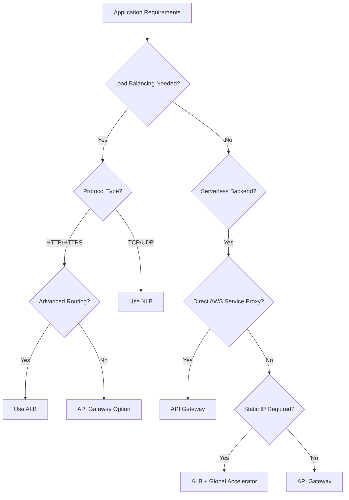

### Deep Dive

#### Common Design Patterns

1. **API Gateway → AWS Services**
   - **Use Case**: Direct proxy to S3, Kinesis, DynamoDB
   - **Architecture**: API Gateway → VPC Endpoint → AWS Service

2. **ALB → Lambda with Static IP**
   - **Use Case**: Lambda backend requiring static IP
   - **Architecture**: Global Accelerator → ALB → Lambda Function

3. **API Gateway + ELB**
   - **Use Case**: Request validation + load balancing
   - **Architecture**: API Gateway → ALB → EC2 Auto Scaling Group

4. **ELB → API Gateway**
   - **Use Case**: Static IP for API Gateway access
   - **Architecture**: Global Accelerator → ALB → VPC Endpoint → API Gateway

#### Containerized Application Patterns

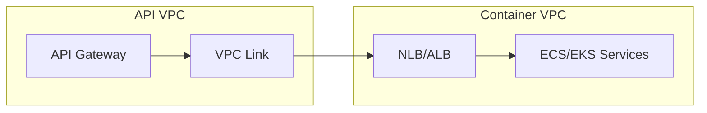

**Design Considerations:**
- **Private Communication**: VPC Link ensures traffic stays within AWS network
- **Compliance Requirements**: End-to-end encryption and private connectivity
- **Load Balancer Selection**: ALB for HTTP, NLB for TCP traffic to containers

> [!EXPERT]
> API Gateway excels at API management features while ELBs provide superior load balancing. Combine them strategically based on application requirements.

## 6.5 AutoScaling Policies Part 1

### Overview
This session introduces Auto Scaling policy types, focusing on Target Tracking Scaling and explaining how metrics and thresholds determine scaling decisions.

### Key Concepts

#### Auto Scaling Boundaries
- **Minimum Capacity**: Floor limit for running instances
- **Maximum Capacity**: Ceiling limit for running instances
- **Desired Capacity**: Target number of instances maintained by Auto Scaling

#### Target Tracking Scaling Policy
Automatically adjusts capacity based on target metric values:

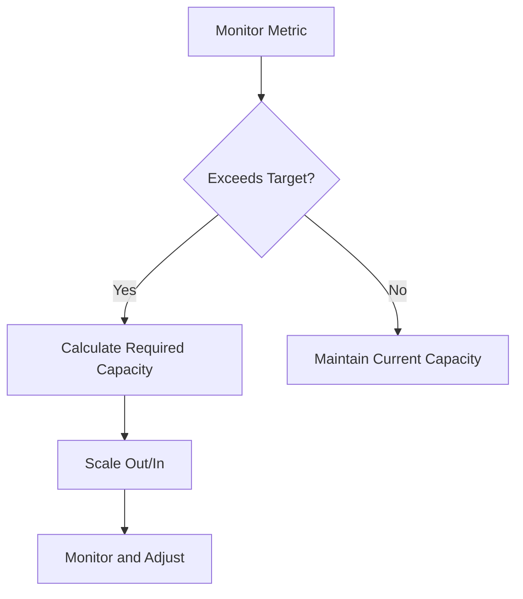

**Example Calculation:**
- Current: 2 instances, 50% average CPU utilization
- Target: 60% CPU utilization
- Auto Scaling determines: Add 1.5 instances (rounded up to 2)

#### Step Scaling Policy
Advanced scaling with multiple threshold tiers:

```yaml
ScalingPolicy:
  - AdjustmentType: PercentChangeInCapacity
    Threshold:
      - LowerBound: 70
        UpperBound: 80
        ScalingAdjustment: 10  # +10% instances
      - LowerBound: 80
        UpperBound: 90
        ScalingAdjustment: 20  # +20% instances
      - LowerBound: 90
        ScalingAdjustment: 30   # +30% instances
```

### Deep Dive

#### Policy Selection Guidelines
- **Target Tracking**: Preferred for most use cases (CPU, ALB request count)
- **Step Scaling**: Complex requirements with multiple thresholds
- **Always Start Simple**: Test basic policies before implementing advanced ones

> [!NOTE]
> Target Tracking policies automatically handle CloudWatch alarm creation and capacity calculations, making them the recommended starting point.

## 6.6 AutoScaling Policies Part 2

### Overview
This session examines combining multiple scaling policies, analyzing potential conflicts, and providing testing strategies for complex Auto Scaling configurations.

### Key Concepts

#### Multiple Policy Behavior
When multiple policies trigger simultaneously:
- **Scale Out**: Auto Scaling selects the policy requiring the **largest capacity increase**
- **Scale In**: Auto Scaling selects the policy requiring the **largest capacity decrease**

Example: Two policies triggered
- Policy A: Add 2 instances
- Policy B: Add 1 instance
- **Result**: Add 2 instances (largest capacity)

#### Policy Conflict Analysis

```diff
+ Pro: Multiple metrics provide comprehensive scaling signals
- Con: Conflicting policies can cause undesirable behavior
- Risk: Policies may override each other unpredictably
```

### Deep Dive

#### Real-World Multi-Policy Scenario

**Application**: Image processing service
- **Policy 1 (Target Tracking)**: Scale based on SQS queue depth
- **Policy 2 (Step Scaling)**: Scale based on CPU utilization (>90%)

**Potential Issues:**
- Queue backlog triggers Policy 1 → Adds 3 instances
- High CPU triggers Policy 2 → Adds 2 more instances
- **Total**: 5 additional instances (over-provisioning)

> [!WARNING]
> Multiple policies require extensive testing. Implement cooldown periods between policy evaluations to prevent over-scaling.

#### Testing Recommendations
- **Load Testing**: Simulate various traffic patterns
- **Monitor Behavior**: Track policy triggers and outcomes
- **Cool-down Periods**: Prevent policies from interfering
- **Documentation**: Record expected vs. actual behavior

## 6.7 AutoScaling Policies Part 3

### Overview
This session covers predictive scaling, scheduled scaling for known traffic patterns, and blueprint architectures showing integration with ELB.

### Key Concepts

#### Scheduled Scaling
For predictable traffic patterns:

```yaml
ScheduledActions:
  - ScheduledActionName: Weekend-ScaleUp
    Recurrence: "0 18 * * THU-SAT"  # Thursdays-Saturdays at 6 PM
    MinSize: 10
    MaxSize: 50
    DesiredCapacity: 30

  - ScheduledActionName: Weekday-ScaleDown
    Recurrence: "0 18 * * SUN"  # Sundays at 6 PM
    MinSize: 5
    MaxSize: 20
    DesiredCapacity: 10
```

#### Predictive Scaling
Uses machine learning for proactive scaling:
- **Training Period**: Minimum 24 hours of historical data
- **Prediction Window**: Forecasts for next 48 hours
- **Re-evaluation**: Daily model updates based on new data
- **Integration**: Creates scaling plans across Auto Scaling Groups

#### ELB + Auto Scaling Integration

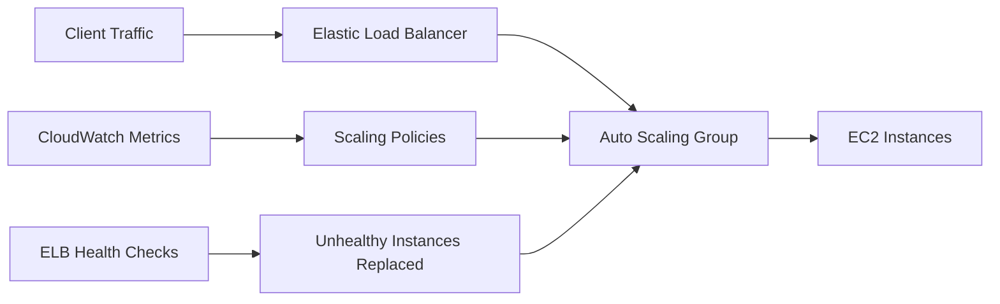

### Deep Dive

#### Scaling Policy Comparison

| Policy Type | Use Case | Complexity | Cost Effectiveness |
|-------------|----------|------------|-------------------|
| Target Tracking | Most applications | Low | High |
| Step Scaling | Custom thresholds | Medium | High |
| Scheduled | Predictable patterns | Low | High |
| Predictive | Variable patterns | High | Highest |

#### One-Time Event Scaling
**Example**: Marketing campaign launch
```yaml
# Scale up for event start
ScheduledActionName: Campaign-ScaleUp
Schedule: "2024-06-15T09:00:00Z"
DesiredCapacity: 100

# Scale down after event ends
ScheduledActionName: Campaign-ScaleDown
Schedule: "2024-06-15T18:00:00Z"
DesiredCapacity: 20
```

> [!EXPERT]
> Combine scheduled scaling with dynamic policies for optimal cost-performance balance.

## 6.8 AutoScaling Policies Design Considerations

### Overview
This session provides design guidelines, best practices, and architectural considerations for implementing Auto Scaling policies with ELB in production environments.

### Key Concepts

#### Recommended Policy Hierarchy
1. **Target Tracking**: Primary choice for most workloads
2. **Step Scaling**: Advanced configurations only
3. **Scheduled**: Supplement dynamic policies
4. **Predictive**: Optimize variable traffic patterns

#### Critical Design Principles

```diff
+ Multi-AZ Deployment: Prevent single points of failure
+ ELB Integration: Unified entry point for traffic
+ Application Requirements: Drive policy metrics and thresholds
- Single AZ Designs: Eliminate unless cost-critical
- Assumption-Based Scaling: Always validate with business requirements
```

#### Resiliency Best Practices
- **Cross-Zone Load Balancing**: Distribute traffic across AZs
- **Health Check Layers**: Multiple validation levels
- **Capacity Planning**: Account for AZ failure scenarios
- **Auto-Healing**: Enable automatic instance replacement

### Deep Dive

#### Business-Driven Policy Design
Understand application patterns before implementing:

**Traffic Analysis:**
- Daily patterns: Peak hours, troughs
- Weekly patterns: Weekends vs. weekdays
- Seasonal patterns: Holiday surges
- Event patterns: Marketing campaigns

**Policy Parameters:**
- Minimum capacity: Baseline requirements
- Maximum capacity: Peak load handling
- Scale-in/out thresholds: Response sensitivity
- Cooldown periods: Prevent thrashing

> [!IMPORTANT]
> Auto Scaling policies must align with business requirements. Poor assumptions lead to over-provisioning or insufficient capacity.

## 6.9 Network Load Balancer - NLB

### Overview
This session explores AWS Network Load Balancer capabilities, operating principles, SSL/TLS handling, static IP features, and cross-zone load balancing design considerations.

### Key Concepts

#### NLB Characteristics
- **OSI Layer**: Layer 4 (Transport layer - TCP/UDP/TLS)
- **Performance**: Ultra-low latency, handles millions of requests/second
- **Protocols**: TCP, UDP, TLS traffic
- **Architecture**: Primarily single-zone with multi-AZ failover options

#### SSL/TLS Termination Options

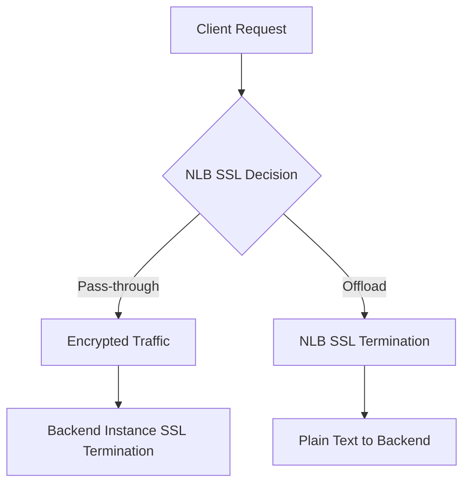

#### Static IP Architecture
Network Load Balancer provides static IPs per AZ:
- **ENI Creation**: Elastic Network Interface per enabled AZ
- **Static Addressing**: Consistent IPs regardless of scaling events
- **EIP Association**: Optional Elastic IP attachment

### Deep Dive

#### Zonal vs. Cross-Zone Load Balancing

**Zonal Load Balancing (Default):**
```diff
+ Cost Optimized: Traffic stays within AZ
+ Predictable Routing: Simple traffic distribution
- Imbalanced Load: DNS caching causes uneven distribution
- Capacity Planning: Must provision for AZ failure
```

**Cross-Zone Load Balancing (Optional):**
```diff
+ Balanced Distribution: Traffic spread across all AZs
+ Automatic Failover: Healthy AZs handle complete load
+ Simplified Management: Auto Scaling handles capacity dynamically
- Additional Cost: Cross-AZ data transfer charges
```

#### Traffic Distribution Example

**Without Cross-Zone:**
- AZ A: 4 instances → ~31% traffic each
- AZ B: 2 instances → ~16% traffic each
- **Issue**: DNS caching amplifies imbalance

**With Cross-Zone:**
- All instances: ~12.5% traffic each
- **Benefit**: Equal distribution regardless of DNS

#### AWS PrivateLink Integration

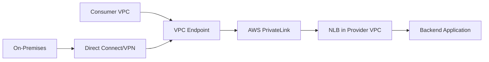

**Use Cases:**
- Service provider applications
- Private API access
- Hybrid cloud connectivity
- Third-party integration

> [!EXPERT]
> NLB provides unmatched Layer 4 performance but requires careful cross-zone configuration for optimal multi-AZ deployments.

## 6.10 When to use NLB

### Overview
This session identifies optimal use cases for Network Load Balancer, focusing on performance-critical applications, protocols requiring Layer 4 balancing, and specific architectural requirements.

### Key Concepts

#### Primary Use Cases

1. **Ultra-Low Latency Applications**
   - Gaming platforms
   - Financial trading systems
   - Real-time bidding platforms

2. **Layer 4 Protocols**
   - TCP-based applications
   - UDP streaming services
   - TLS-encrypted traffic
   - Non-HTTP protocols

3. **Performance-Critical Workloads**
   - Handle millions of requests per second
   - Sub-millisecond response times
   - Minimal latency overhead

#### NLB vs. ALB Selection Criteria

```diff
+ Performance Priority: NLB provides lower latency
+ TCP/UDP Required: ALB limited to HTTP/HTTPS
+ Static IP Needed: NLB supports EIP association per AZ
+ Extreme Scale: NLB scales to millions of connections
- HTTP Processing: NLB lacks advanced routing features
- Advanced Routing: ALB supports path/header-based routing
```

### Deep Dive

#### Protocol-Specific Scenarios

**TCP-Based Services:**
- Database connections (RDS proxy through NLB)
- Legacy applications requiring TCP transport
- Load balancing to backend databases

**UDP Applications:**
- VoIP and video streaming
- DNS servers
- Gaming server distribution

**TLS Pass-Through:**
- End-to-end encryption requirements
- Certificate management at application layer
- Compliance-driven encryption mandates

#### Enterprise Integration Patterns

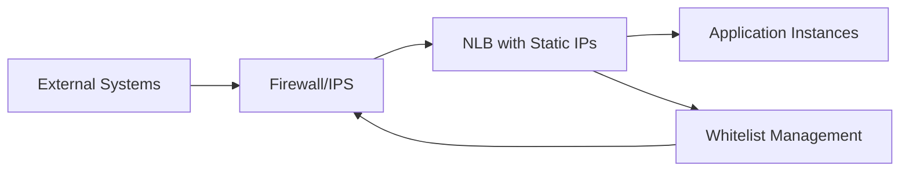

**Security Integration:**
- Static IPs simplify firewall rule management
- Integration with existing security infrastructure
- Compliance with IP-based security policies

> [!IMPORTANT]
> Choose NLB when Layer 4 performance is critical or when HTTP-based routing features aren't required.

## 6.11 Application Load Balancer - ALB

### Overview
This session covers Application Load Balancer capabilities, Layer 7 routing features, content-based distribution, and integration with modern application architectures.

### Key Concepts

#### ALB Core Capabilities
- **OSI Layer**: Layer 7 (Application layer - HTTP/HTTPS)
- **Advanced Routing**: Path, host, header, and method-based routing
- **Content-Based Distribution**: Route traffic based on request content
- **WebSocket Support**: Full-duplex communication channels

#### Routing Rules

```yaml
# Path-based routing
- Path: /api/* -> Target Group: API Servers
- Path: /web/* -> Target Group: Web Servers

# Host-based routing
- Host: api.example.com -> Target Group: API Cluster
- Host: web.example.com -> Target Group: Web Cluster

# Header-based routing
- HTTP-Header: X-API-Version: v2 -> Target Group: V2 API
```

#### Target Type Support
- **Instance**: EC2 instances via target group
- **IP**: Direct IP addresses (on-premises, cross-VPC)
- **Lambda**: Direct integration with serverless functions
- **ALB**: Chain multiple load balancers

### Deep Dive

#### Advanced Features

**Redirect Actions:**
- HTTP to HTTPS redirection
- URL path rewriting
- Response code customization

**Fixed Response:**
- Custom error pages
- Maintenance mode responses
- API versioning notices

**Authentication Integration:**
- OIDC provider integration
- SAML authentication
- Cognito User Pool integration

#### Microservices Architecture

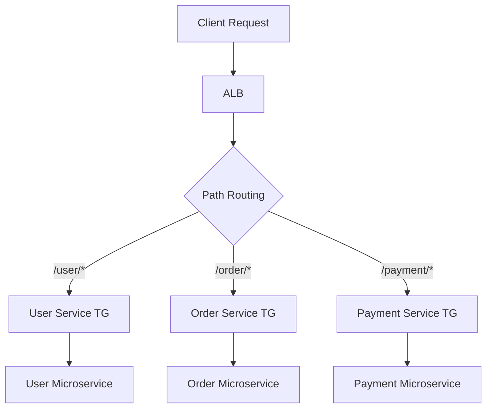

#### Serverless Integration

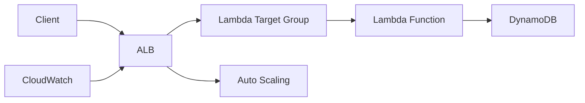

**Benefits:**
- Direct Lambda invocation without API Gateway
- HTTP-based request/response handling
- Built-in authentication and authorization

> [!EXPERT]
> ALB excels in complex routing scenarios and provides seamless integration with modern application architectures including microservices and serverless.

## 6.12 Security Filtering Considerations

### Overview
This session examines security architectures integrating ELB with AWS security services, focusing on traffic filtering, threat protection, and compliance requirements.

### Key Concepts

#### Layered Security Architecture

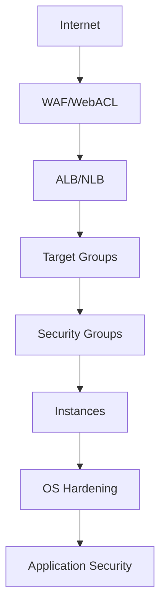

#### AWS Shield Integration
- **Standard**: Included with ELB, protects against Layer 3/4 DDoS
- **Advanced**: Enhanced protection with real-time response

### Deep Dive

#### Security Service Integration

**AWS WAF (Web Application Firewall):**
```yaml
WebACL:
  - Rule: BlockSQLInjection
    Priority: 1
    Action: BLOCK

  - Rule: RateLimit
    Priority: 2
    Limit: 1000 requests/5min
    Action: BLOCK
```

**Integration Points:**
- Associate with ALB for HTTP/HTTPS protection
- CloudFront integration for global protection
- Custom rules for application-specific threats

#### Network Firewall Integration

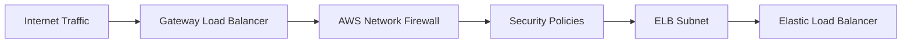

**Traffic Flow:**
1. Traffic enters Gateway Load Balancer endpoint
2. Routes to Network Firewall for inspection
3. Inspected traffic forwards to ELB
4. ELB distributes to backend instances

#### Security Group Essentials

**ELB Security Groups:**
```diff
+ Inbound: Allow client traffic to listener ports
+ Inbound: Allow health check traffic from ELB to targets
+ Outbound: Allow traffic from ELB to target instances
- Missing rules: Break connectivity and health monitoring
```

#### Compliance and Encryption

**End-to-End Encryption Options:**
- **Pass-through**: NLB forwards encrypted traffic
- **Offload**: ALB/NLB terminates SSL/TLS
- **Hybrid**: Combination based on requirements

> [!WARNING]
> Incorrect security group configuration is the most common cause of ELB connectivity issues.

## 6.13 ELB - Migration Design Scenario

### Overview
This session explores strategies for migrating existing load balancers to AWS ELB, including Classic Load Balancer upgrades and third-party load balancer replacements.

### Key Concepts

#### Migration Assessment Framework

1. **Inventory Analysis**
   - Current load balancer configuration
   - Application dependencies
   - Traffic patterns and scaling needs

2. **Compatibility Evaluation**
   - Feature parity comparison
   - SSL/TLS termination requirements
   - Custom routing needs

3. **Implementation Planning**
   - Zero-downtime migration strategies
   - DNS cutover procedures
   - Rollback planning

#### CLB to ALB/NLB Migration Path

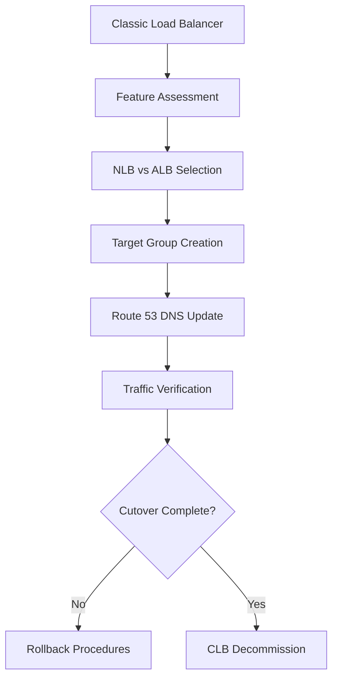

### Deep Dive

#### Feature Mapping

**Classic Load Balancer → Modern ELB:**

| Classic Feature | ELB Equivalent | Migration Notes |
|----------------|----------------|------------------|
| Basic HTTP routing | ALB path-based routing | Enhanced capabilities |
| SSL termination | Both ALB/NLB support | Advanced certificate management |
| Health checks | Target group health checks | More configurable |
| Cross-zone balancing | Cross-zone enabled by default | Different default behavior |

#### Migration Strategies

**Blue-Green Deployment:**
```diff
+ Zero downtime migration
+ Easy rollback capability
+ Parallel environment testing
- Resource overhead during transition
- DNS management complexity
```

**Gradual Cutover:**
```yaml
# Route 53 weighted routing
WeightedRecords:
  - SetIdentifier: CLB
    Weight: 90
    AliasTarget: ClassicLoadBalancer

  - SetIdentifier: ALB
    Weight: 10
    AliasTarget: ApplicationLoadBalancer
```

#### Common Migration Challenges

```diff
- SSL Certificate Management: Different validation methods
- Health Check Configuration: Protocol and threshold adjustments
- Security Group Updates: New source/destination requirements
- Auto Scaling Integration: Policy configuration changes
```

> [!IMPORTANT]
> Migration planning must include detailed rollback procedures and performance validation before full traffic cutover.

## 6.14 How To Design Multi Region ELB Solution

### Overview
This session covers architecting cross-region ELB solutions using Route 53, Global Accelerator, and CloudFront for enhanced availability and performance.

### Key Concepts

#### Multi-Region Architecture Components

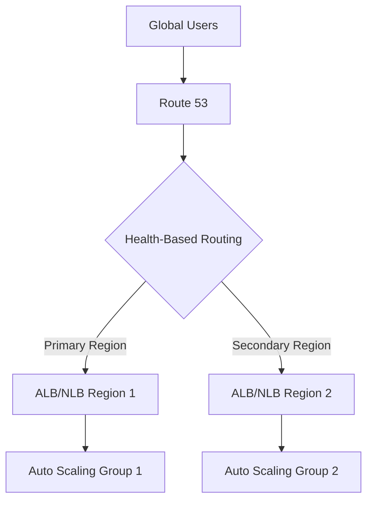

#### Route 53 Routing Policies

**Geolocation Routing:**
```yaml
GeoRoutingPolicy:
  - ContinentCode: EU
    Record: eu-west-1-alb.example.com
  - ContinentCode: NA
    Record: us-east-1-alb.example.com
  - Default: us-east-1-alb.example.com
```

**Latency-Based Routing:**
- Routes traffic to closest region
- Requires routing policies configuration
- Automatic region optimization

#### Global Accelerator Integration

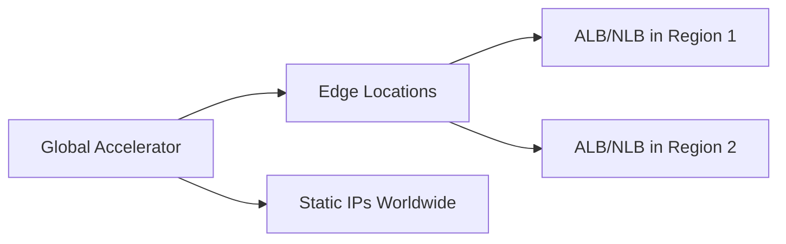

**Benefits:**
- Static anycast IPs globally
- ~30% improved performance
- Built-in health checking
- DDoS protection at edge

### Deep Dive

#### Failover Design Patterns

**Active-Passive Configuration:**
```yaml
Route53:
  Primary:
    - HealthCheck: primary-region-alb
      Failover: true

  Secondary:
    - HealthCheck: secondary-region-alb
      Failover: false
```

**Active-Active with Weighted Routing:**
```yaml
WeightedRouting:
  PrimaryRegion:
    Weight: 80
    HealthCheck: primary-alb

  SecondaryRegion:
    Weight: 20
    HealthCheck: secondary-alb
```

#### Global Load Balancing Considerations

```diff
+ Improved Availability: Regional failure isolation
+ Better Performance: Geographic traffic optimization
+ Enhanced Resilience: Automatic failover capabilities
- Increased Complexity: Cross-region management overhead
- Cost Impact: Data transfer and resource duplication
- Consistency Challenges: State synchronization requirements
```

#### CloudFront Integration for Global Distribution

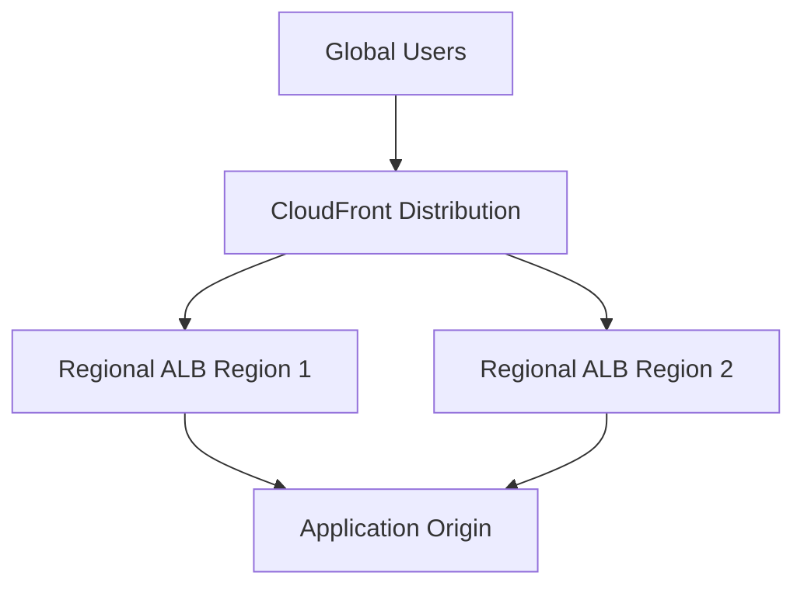

**Integration Benefits:**
- Global CDN acceleration
- Advanced caching strategies
- Real-time logging and analytics
- Custom error pages and redirects

> [!EXPERT]
> Multi-region ELB requires careful planning for data replication, state management, and cost optimization across regions.

## Summary

### Key Takeaways
```diff
+ ELB provides centralized, scalable entry points for distributed applications
+ Multi-AZ deployment ensures high availability and fault tolerance
+ Auto Scaling integration enables automatic resource management
+ NLB excels in Layer 4 performance, ALB in Layer 7 routing
+ Security integration adds comprehensive protection layers
+ Multi-region architectures provide global availability
```

### Quick Reference

#### ELB Types Comparison
| Feature | NLB | ALB | CLB |
|---------|-----|-----|-----|
| Layer | 4 | 7 | 4/7 |
| Performance | Ultra-low latency | Moderate | Basic |
| Scaling | Millions RPS | Thousands RPS | Limited |
| Routing | IP/Port | Advanced | Basic |

#### Common Configuration Commands
```bash
# Create ALB
aws elbv2 create-load-balancer --name my-alb --subnets subnet-123 subnet-456

# Create Target Group
aws elbv2 create-target-group --name my-targets --protocol HTTP --port 80 --vpc-id vpc-123

# Create Auto Scaling policy
aws autoscaling put-scaling-policy --policy-name cpu-policy --scaling-adjustment 1 --adjustment-type ChangeInCapacity
```

### Expert Insight

#### Real-World Application
ELB powers enterprise-scale applications handling millions of requests, from e-commerce platforms distributing traffic across global regions to microservices architectures routing requests based on content and authentication.

#### Expert Path to Mastery
1. **Start Simple**: Begin with single-region, single-AZ ALB deployments
2. **Master Health Checks**: Understand multi-layer health monitoring
3. **Design for Failure**: Always architect for AZ and regional failures
4. **Security First**: Integrate security services from day one
5. **Monitor Everything**: Implement comprehensive monitoring and alerting

#### Common Pitfalls
- **Insufficient Security Groups**: Misconfigured security groups block legitimate traffic
- **Single AZ Deployment**: Creates availability risks in production
- **Improper Health Checks**: Wrong configuration marks healthy instances unhealthy
- **Underestimating Scaling**: Insufficient maximum capacities for traffic spikes
- **DNS Caching Issues**: Ignoring DNS TTL in cross-zone scenarios

#### Lesser-Known Facts
- ELB health checks can be customized per target group with different protocols and paths
- Cross-zone load balancing can be enabled/disabled independently on NLB and ALB
- Global Accelerator provides better performance than Route 53 latency routing for most use cases
- Target groups support IP-based targets, enabling routing to on-premises systems
- ELB preserves client IP addresses through X-Forwarded-For headers (ALB) or proxy protocol (NLB)
</details>