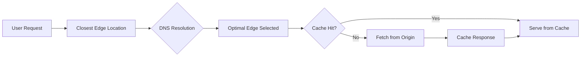

# Section 8: CDN Introduction

<details open>
<summary><b>Section 8: CDN Introduction (KK-CS45-script-v2)</b></summary>

## Table of Contents

- [8.1 CDN Introduction](#81-cdn-introduction)
- [8.2 CDN - Performance part 1](#82-cdn---performance-part-1)
- [8.3 CDN - Performance part 2](#83-cdn---performance-part-2)
- [8.4 CDN - Performance part 3](#84-cdn---performance-part-3)
- [8.5 CDN - Security part 1](#85-cdn---security-part-1)
- [8.6 CDN - Security part 2](#86-cdn---security-part-2)
- [8.7 CDN - Security part 3](#87-cdn---security-part-3)
- [8.8 CDN - Security part 4](#88-cdn---security-part-4)
- [8.9 DDoS Mitigation Considerations](#89-ddos-mitigation-considerations)
- [Summary](#summary)

## 8.1 CDN Introduction

### Overview

This module introduces Amazon CloudFront as AWS's Content Delivery Network (CDN) within the context of AWS global infrastructure. It explains how CloudFront integrates with load balancing and DNS to provide scalable, secure, and performant content delivery solutions. The module covers CloudFront's benefits in performance, security, and cost optimization, setting the foundation for deeper discussions in subsequent modules.

### Key Concepts/Deep Dive

#### AWS Global Infrastructure Revisited

- **Current Scale**: As of recording, AWS spans 81 Availability Zones (AZs) within 25 geographic regions worldwide, with plans for 20 more AZs and 7 additional regions.
- **Important Note**: These numbers frequently increase. Always reference [AWS Global Infrastructure documentation](https://aws.amazon.com/about-aws/global-infrastructure/) for the latest figures when designing solutions.
- **Performance Characteristics**:
  - Low latency
  - Low packet loss
  - High network quality
  - Achieved through fully redundant 100 Gigabit fiber network backbone with terabytes of capacity between regions.

#### Amazon CloudFront Overview

CloudFront serves as the CDN layer on top of AWS global infrastructure:

- **Peer Network**: Peers with Tier 1-3 telecom carriers globally
- **Access Network Connections**: Well-connected with major access networks for optimal performance
- **Capacity**: Hundreds of terabytes of deployed capacity
- **Edge Location Connectivity**: Connected to AWS regions through fully redundant, 100 Gigabit fiber backbone
- **Design Goals**:
  - Low latency delivery
  - High bandwidth delivery
  - Routes end users to edge locations that best serve their requests
- **Architecture**: Worldwide distribution with edge locations across countries and cities

#### Architectural Context for CloudFront

From an architect's perspective, CloudFront should address business-driven design questions:

- **Global User Serving**: How to efficiently serve global users (latency, user experience)?
- **Security**: How to mitigate known and unknown DDoS attacks?
- **Availability**: How to maintain high uptime ratios?
- **Reliability**: How to set the right expectations for customer solutions?

#### Key Benefits of CloudFront

CloudFront's benefits can be categorized into three main areas:

1. **Performance Optimization** (Covered in parts 2-4)
2. **Security Enhancements** (Covered in parts 5-8 and 9)
3. **Cost Optimization** (Integrated throughout)

## 8.2 CDN - Performance part 1

### Overview

This module explores how Amazon CloudFront can be integrated into architectures to solve performance challenges and enable scalability. It focuses on the first three key concepts for performance optimization: static vs. dynamic content, Time to First Byte (TTFB), and protocol-level optimizations including compression.

### Key Concepts/Deep Dive

#### CloudFront Performance Benefits

- **Reduced End-User Latency**: Content is moved closer to users through edge locations, enabling local response delivery for both static and dynamic web content.
- **Origin Server Load Reduction**: Serving content from edge locations significantly reduces load on origin servers, allowing them to handle much higher traffic without additional infrastructure costs.

#### Key Concept 1: Static vs. Dynamic Content

> [!NOTE]
> The distinction between static and dynamic content is not a limiting factor in design flexibility, and dynamic content can often be cached strategically.

- **Static Content**:
  - Files that change infrequently
  - Examples: Images, videos, documents, JavaScript libraries, CSS files
  - Ideal for edge caching

- **Dynamic Content**:
  - Files that change frequently or continuously
  - Examples: API responses, HTML pages generated at runtime
  - Best served from origin servers or nearby compute resources

- **Caching Strategies for Dynamic Content**:
  - Use custom CloudFront caching policies
  - Implement CloudFront origin request policies
  - Leverage Lambda@Edge functions for specialized caching requirements

#### Key Concept 2: Time to First Byte (TTFB) / Network Latency

- **Definition**: TTFB refers to the time from a user's request until the first byte of the response from the server.
- **CloudFront Optimization Mechanism**:
  1. Each edge location continuously measures latency to the origin server.
  2. Comparisons are made across all edge locations connected to the same origin.
  3. Users are automatically routed to the edge location with the best (lowest) TTFB.
- **Benefits**:
  - Improved user experience
  - Better search engine optimization (SEO) due to faster load times
  - Increased user engagement

> [!IMPORTANT]
> This continuous monitoring and routing enables CloudFront to always direct users to the optimal edge location, even as network conditions change.

#### Key Concept 3: Protocol Optimizations

- **TCP Optimizations**:
  - Optimized TCP connections for HTTP/2 requests
  - Support for HTTP/1.1, HTTP/2, and HTTPS with TLS for secure connections
  - Extended TLS support for additional TCP optimizations

- **OCSP Stapling**:
  - Optimized Connection Setup for HTTP over TLS
  - Allows reuse of connection setup information for subsequent TLS connections
  - Reduces initial connection establishment time

- **QUIC Protocol**:
  - Quick UDP Internet Connections
  - Multiplexed UDP-based transport protocol
  - Reduces handshake time from 3-way to 0-round-trip time (0RTT)

#### Content Compression

- **Automatic Compression**: CloudFront can compress responses from the origin server for supported content types:
  - Text files (JavaScript, CSS, etc.)
  - Compression formats: gzip, Brotli
  - Can reduce response size by up to 70%

> [!TIP]
> Compression only occurs when the client request includes `Accept-Encoding` headers specifying gzip or Brotli.

## 8.3 CDN - Performance part 2

### Overview

This module continues exploring CloudFront performance optimizations, focusing on caching mechanisms, policies, and advanced features for both static and dynamic content optimization. It covers how to configure CloudFront to balance performance needs with content freshness and security requirements.

### Key Concepts/Deep Dive

#### CloudFront Caching Fundamentals

- **Cache Behaviors**: Define how CloudFront processes and caches requests based on URL patterns, headers, and query parameters
- **TTL (Time to Live)**: Governs how long content remains cached:
  - Default TTL: 24 hours (86400 seconds)
  - Minimum TTL: 0 seconds (prevents caching completely)
  - Maximum TTL: 31536000 seconds (1 year)

#### Cache Control Strategies

- **Query Strings and Headers**: Can influence caching behavior
  - Include query strings in cache key for page variations
  - Use headers to customize caching for different user scenarios

- **Invalidation vs. Refresh**:
  - **Invalidation**: Immediately removes specified content from cache (useful for urgent updates)
  - **Refresh**: Allows natural expiration based on TTL (preferred for performance)

> [!TIP]
> Use invalidation sparingly as it can increase costs and may impact performance during high-traffic periods.

#### Advanced Caching Policies

- **CloudFront Caching Policies**:
  - Define what to include in cache keys
  - Control TTL settings
  - Optimize for specific use cases

- **Origin Request Policies**:
  - Determine what information is sent to origin servers
  - Can reduce origin load by filtering unnecessary headers/parameters

#### Dynamic Content Caching with Lambda@Edge

- **Use Cases**: Add caching logic for dynamic content that changes based on user characteristics
- **Benefits**: Enables edge-side computation for personalized experiences while maintaining performance
- **Example**: Cache different versions of content based on user location or authentication status

#### Field Level Encryption

- **Purpose**: Protects sensitive data fields during transit
- **How it works**: Encrypts specific fields in requests before forwarding to origins
- **Integrated with AWS Certificate Manager** for key management

#### CloudFront Functions

- **Lightweight Functions**: Execute at CloudFront edge locations
- **Use Cases**: URL rewrites, header modifications, access control
- **Performance**: Lower latency than Lambda@Edge due to JavaScript runtime
- **Limitations**: Cannot access network or file system resources

## 8.4 CDN - Performance part 3

### Overview

This concluding module for CloudFront performance optimization consolidates best practices and provides guidance on ensuring security considerations are maintained while optimizing performance. It emphasizes the interplay between performance enhancements and security requirements.

### Key Concepts/Deep Dive

#### Performance Optimization Best Practices

- **Cache Hit Ratio Optimization**:
  - Analyze CloudWatch metrics for cache hit rates
  - Adjust TTL settings based on content update frequency
  - Use cache behaviors effectively

- **CDN Integration Patterns**:
  - Origin Shield: Single point of entry to AWS origin
  - Multi-region origins with CloudFront for failover

#### Security Integration in Performance Designs

- **Secure Origin Access**:
  - Restrict direct access to origins through security groups
  - Use Origin Access Control (OAC) for S3 buckets

- **TLS Termination**:
  - Terminate SSL/TLS at CloudFront edge for reduced origin load
  - Ensure certificate management is automated via ACM

> [!IMPORTANT]
> Performance optimizations should never compromise security. Always implement appropriate access controls and encryption.

#### Cost-Performance Trade-offs

- **TTL Optimization**: Longer TTLs reduce origin requests but may serve stale content
- **Function Usage**: Lambda@Edge and CloudFront Functions add costs - use judiciously
- **Traffic Monitoring**: Use CloudWatch to monitor costs and adjust configurations

## 8.5 CDN - Security part 1

### Overview

This module introduces CloudFront security capabilities, focusing on protection against common web vulnerabilities and DDoS attacks. It explains how CloudFront integrates with AWS WAF and other security services to create layered defenses.

### Key Concepts/Deep Dive

#### Web Application Firewall Integration

- **AWS WAF**: Provides rule-based web traffic filtering
- **Integration Options**:
  - Associate WAF ACLs directly with CloudFront distributions
  - Use WAF to block malicious requests before reaching origins

#### DDoS Protection Basics

- **Distributed Denial of Service Mitigation**:
  - Network layer: AWS Shield Standard (automatically included)
  - Application layer: AWS Shield Advanced with WAF

- **CloudFront's Role in DDoS Mitigation**:
  - Large-scale mitigation capacity
  - Automatic scaling during attack events
  - No additional configuration required for basic protections

#### Common Attack Protections

- **SQL Injection**: WAF rules can detect and block harmful query patterns
- **XSS (Cross-Site Scripting)**: Header inspection and filtering
- **Malicious Bots**: Rate limiting and bot management

> [!NOTE]
> CloudFront provides the initial layer of security, while origins should maintain additional defenses.

## 8.6 CDN - Security part 2

### Overview

This module delves into authentication and access control mechanisms in CloudFront, including signed URLs, signed cookies, and geographical restrictions. It provides guidance on implementing secure content delivery for restricted audiences.

### Key Concepts/Deep Dive

#### Signed URLs and Signed Cookies

- **Purpose**: Provide temporary access to private content without sharing credentials
- **How it works**:
  - URL/cookie contains signed parameters with expiration and access permissions
  - Signed using AWS account keys or custom keys via CloudFront Key Groups

- **Use Cases**:
  - Premium content delivery
  - Temporary access for external users
  - Software downloads requiring authentication

#### Origin Access Control (OAC)

- **S3 Integration**: Restricts S3 bucket access to only CloudFront origins
- **Benefits**: Eliminates need for public S3 bucket policies while allowing CloudFront to serve content
- **Transition from OAI**: Newer, more secure replacement for Origin Access Identity

#### Geographical Restrictions

- **Geo-Blocking**: Allow or deny access based on user location (country-level)
- **Compliance Benefits**: Meet regulatory requirements like GDPR, CCPA
- **Performance Impact**: Minimal, as restrictions occur at edge

#### Custom Origin Security

- **Client Certificates**: Mutual TLS authentication for custom origins
- **IP Allowlisting**: Restrict origins to accept requests only from CloudFront edge locations
- **VPC Endpoints**: Private connections from CloudFront to origins in VPC

## 8.7 CDN - Security part 3

### Overview

This module covers advanced security features including custom headers, edge-side authentication, and detailed logging capabilities. It explains how to implement comprehensive security monitoring and response mechanisms.

### Key Concepts/Deep Dive

#### CloudFront Custom Headers

- **X-Amz-Cf-Id**: Unique identifier added to every request
- **Custom Headers**: Add security-specific headers for origin processing
- **Security Benefits**: Helps origins verify requests originated from CloudFront

#### Lambda@Edge for Authentication

- **Use Cases**:
  - Custom authentication logic at edge
  - JWT token validation
  - API key verification
  - Single sign-on integration

- **Implementation Pattern**:
  1. Validate credentials
  2. Add authorization headers
  3. Route authenticated requests to protected content

#### Security Monitoring and Logging

- **CloudFront Access Logs**: Detailed request logs for analysis
- **Real-time Logs**: Stream logs to Kinesis for immediate processing
- **WAF Logs**: Integration with CloudWatch for security monitoring

> [!TIP]
> Enable both standard access logs and real-time logs for comprehensive security visibility.

#### Security Headers

- **Security Headers Enforcement**: Configure CloudFront to add security headers like:
  - Strict-Transport-Security
  - X-Frame-Options
  - X-Content-Type-Options
- **Response Modifications**: Use CloudFront Functions or Lambda@Edge to add headers

## 8.8 CDN - Security part 4

### Overview

This module focuses on encryption and certificate management in CloudFront, completing the security discussion. It covers SSL/TLS configurations and field-level security for sensitive data.

### Key Concepts/Deep Dive

#### SSL/TLS Certificate Management

- **AWS Certificate Manager (ACM)**: Automated certificate provisioning and renewal
- **Custom Certificates**: Upload your own certificates for full control
- **SNI vs. Dedicated IP**: SNI (Server Name Indication) is cost-effective for multiple domains

#### Encryption Options

- **HTTPS Only**: Force all connections to use TLS
- **Minimum TLS Version**: Enforce modern TLS versions (1.2+)
- **HSTS (HTTP Strict Transport Security)**: Browser-level HTTPS enforcement

#### Field-Level Encryption (FLE)

- **Advanced Security**: Encrypt specific form fields before sending to origins
- **Integration Points**: Supports payment processing, healthcare data protection
- **Key Management**: Uses CloudFront public keys and customer private keys

#### Security Best Practices Summary

- **Defense in Depth**: Layer multiple security controls
- **Least Privilege**: Grant minimal access required
- **Monitoring**: Continuous logging and alerting
- **Compliance**: Meet industry standards (PCI, HIPAA, etc.)

## 8.9 DDoS Mitigation Considerations

### Overview

This module specifically addresses DDoS protection strategies in CloudFront architectures. It provides detailed guidance on integrating AWS Shield services with CloudFront for comprehensive attack mitigation.

### Key Concepts/Deep Dive

#### AWS Shield Integration

- **Shield Standard**: Automatic protection against common DDoS attacks (free with CloudFront)
- **Shield Advanced**: Enhanced protection for sophisticated attacks
  - $3,000/month subscription
  - 24/7 DDoS Response Team (DRT)
  - Automatic application layer mitigation

#### DDoS Attack Types and Mitigation

- **Volumetric Attacks**: Overwhelm network capacity
  - CloudFront automatically mitigates through large edge capacity

- **Protocol Attacks**: Exploit protocol weaknesses
  - Shield protects against SYN floods, UDP floods

- **Application Layer Attacks**: Target web applications
  - WAF rules block malicious requests
  - Rate-based rules prevent abuse

#### CloudFront DDoS Response Strategy

- **Automated Scaling**: Edge locations scale during attacks without configuration
- **Traffic Monitoring**: Real-time metrics in CloudWatch
- **False Positive Handling**: Shield provides attack forensics

#### Best Practices for DDoS Preparedness

- **Redundant Origins**: Multiple backend systems for failover
- **Global Distribution**: Attack impact limited to affected regions
- **Monitoring and Alerting**: Set up CloudWatch alarms for attack detection

> [!WARNING]
> DDoS protection requires ongoing monitoring. Even with Shield, implement WAF rules and have incident response plans.

## Summary

### Key Takeaways

```diff
+ Amazon CloudFront is AWS's globally distributed CDN that optimizes content delivery through edge locations worldwide
+ Performance benefits include reduced latency, improved TTFB, and automatic protocol optimizations like HTTP/2 and QUIC
+ Security features encompass WAF integration, geo-blocking, signed URLs, and comprehensive DDoS mitigation
+ Caching can be finely tuned with policies, TTL settings, and Lambda@Edge for dynamic content scenarios
- Always pair performance optimizations with security controls like Origin Access Control and proper TLS configurations
! TLS and certificate management should be automated through AWS Certificate Manager to avoid expiration issues
! DDoS protection layers (Shield Standard + Advanced, WAF) provide robust defense but require monitoring
```

### Quick Reference

#### CloudFront Request Flow


#### Security Configuration Checklist
- [ ] Enable HTTPS only
- [ ] Associate WAF ACL
- [ ] Configure geo-restrictions
- [ ] Use Origin Access Control for S3
- [ ] Enable field-level encryption for sensitive fields
- [ ] Set up signed URLs/cookies for private content

#### Common CloudFront Limits
| Component | Limit | Purpose |
|-----------|-------|---------|
| Cache Behaviors | 25 per distribution | Route different content types |
| Custom Headers | 10 per cache behavior | Add metadata to requests |
| Origins | 100 per distribution | Backend endpoints |
| Lambda@Edge Functions | 25 per distribution | Edge processing |

### Expert Insight

#### Real-world Application
In production environments, CloudFront is commonly deployed as the entry point for multi-region applications, with origins behind Application Load Balancers in different AWS regions. For streaming services, implement multiple CDN behaviors to serve different media formats, and use Lambda@Edge for adaptive bitrate streaming logic.

#### Expert Path
Master CloudFront by first understanding basic distribution setup, then progress to advanced features like CloudFront Functions for simple customizations and Lambda@Edge for complex logic. Study CloudWatch metrics deeply, especially cache hit ratios and error rates. Practice with cost optimization by analyzing usage patterns and adjusting TTLs accordingly.

#### Common Pitfalls
- Configuring cache behaviors incorrectly, leading to mixed content issues
- Not accounting for header and cookie forwarding, causing dynamic content problems
- Forgetting to configure proper CORS headers for web applications
- Over-reliance on cache invalidation instead of optimized TTL settings
- Neglecting to monitor WAF logs for emerging threats
- Improper SSL/TLS certificate domain validation

#### Lesser-Known Facts
- CloudFront can serve as an API Gateway alternative for some use cases with lower latency
- Edge locations include specialized compute resources beyond just caching
- CloudFront supports HTTP/3 via QUIC, enabling 0RTT connections for improved performance
- Real-time metrics streaming to Kinesis allows for near-immediate security analysis
- CloudFront can integrate with AWS Elemental MediaStore for low-latency video delivery
- Cross-region CloudFront distributions can share origins while maintaining regional isolation

</details>