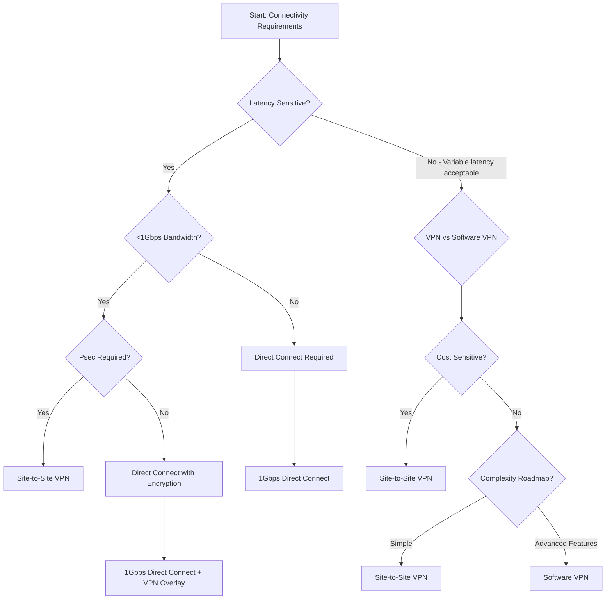

# Section 13: Connectivity Type Considerations

<details open>
<summary><b>Section 13: Connectivity Type Considerations (KK-CS45-script-v2)</b></summary>

## Table of Contents
- [13.1 Connectivity Type Considerations](#131-connectivity-type-considerations)
- [13.2 Selection Decision Tree](#132-selection-decision-tree)
- [13.3 Design Model Considerations](#133-design-model-considerations)
- [Summary](#summary)

## 13.1 Connectivity Type Considerations

### Overview
This module focuses on the different connectivity types available in AWS for connecting on-premises data centers or networks to the cloud. Understanding these connectivity options is crucial for designing secure, scalable, and cost-effective hybrid networking architectures. The main connectivity types discussed include VPN tunnels, Direct Connect connections, and software VPN connections.

### Key Concepts

#### VPN Tunnel Connections
- **Site-to-Site VPN Tunnels**: Provide secure IPsec tunnels between customer gateway and virtual private gateway or transit gateway
- **Static vs. Dynamic Routing**:
  - Static routes require manual configuration of routing tables
  - Dynamic routing uses BGP for automatic route exchange
- **Encryption Protocols**: Standard IPsec encryption with AES-128/256 and SHA-256/384 HMAC
- **High Availability**: Multiple tunnels can be configured for redundancy

#### Direct Connect Connections
- **Dedicated Physical Connection**: Provides a dedicated network connection from customer's router to AWS Direct Connect router
- **Connection Types**:
  - **Dedicated Connections**: Single customer connection (50Mbps-10Gbps)
  - **Hosted Connections**: Third-party provider hosts the connection (50Mbps-10Gbps)
- **Port Speeds**: 1Gbps, 10Gbps, and 100Gbps options available
- **Latency**: Predictable, consistent low latency compared to internet-based connections

#### Software VPN Connections
- **VPN Appliance**: Customer-managed VPN appliance terminating IPsec connections
- **CloudFormation Templates**: AWS provides templates for deploying VPN appliances in EC2
- **Supported Vendors**: Cisco, Palo Alto Networks, Fortinet, etc.
- **Redundancy**: Multiple VPN appliances can be deployed for high availability

### Connectivity Type Comparison

| Characteristic | Site-to-Site VPN | Direct Connect | Software VPN |
|----------------|------------------|---------------|--------------|
| **Encryption** | Yes (IPsec) | No (encrypted overlays can be added) | Yes (IPsec/SSL) |
| **Jitter** | Variable | Consistent/congestion-free | Variable |
| **Scalability** | Good | Excellent | Limited |
| **Cost** | Affordable for low traffic | Higher fixed cost | Variable (based on EC2 instances) |
| **Latency** | Variable | Low/predictable | Variable |

## 14.2 Selection Decision Tree

### Overview
This module provides a systematic approach to selecting the appropriate connectivity type based on specific business requirements and technical constraints. The decision tree helps network architects evaluate factors such as bandwidth requirements, latency sensitivity, security needs, and cost considerations to determine the optimal connectivity solution.

### Key Concepts

#### Decision Criteria

**Bandwidth Requirements** 💡
- `<1Gbps`: VPN solutions typically sufficient
- `1-10Gbps`: Direct Connect becomes more attractive
- `>10Gbps`: Direct Connect required
- Consider future growth and scaling needs

**Latency Sensitivity** ⚡
- **Real-time trading**: Requires Direct Connect for predictable sub-ms latency
- **Voice/Video**: Needs consistent low latency (Direct Connect)
- **Batch processing**: More tolerant of variable latency (VPN acceptable)

**Jitter Tolerance** 📊
- **Sensitive workloads**: Financial trading, VoIP/Video conferencing
- **Non-sensitive workloads**: File transfers, email, standard web applications

**Security Requirements** 🔒
- **IPsec mandatory**: All VPN solutions (Site-to-Site or Software VPN)
- **Physical isolation**: Direct Connect provides private network connectivity
- **Encryption needs**: VPN solutions provide built-in encryption

**Regulatory Compliance** 📋
- **Data sovereignty**: May require specific geographic routing
- **Industry regulations**: Financial sector (PCI DSS), Healthcare (HIPAA)
- **Government requirements**: FedRAMP, ITAR compliance

#### Decision Tree Flow



#### Connectivity Type Selection Matrix

```diff
+ PERFECT FIT scenarios:
+ - High-throughput batch processing: Direct Connect (cost-effective at scale)
+ - Real-time applications: Direct Connect (predictable performance)
+ - Budget-conscious small deployments: Site-to-Site VPN
+ - Advanced security features needed: Software VPN appliances

- AVOID scenarios:
- - Real-time trading on VPN: Too much jitter and latency variation
- - Low-bandwidth applications on Direct Connect: Not cost-effective
- - High availability without redundancy planning: Any single-connection solution
- - Ignoring future growth: Underestimating bandwidth needs
```

## 14.3 Design Model Considerations

### Overview
This module explores different architectural patterns and design models for implementing hybrid networking connectivity in AWS. It covers various deployment models including hub-and-spoke, full mesh, and edge connectivity patterns, along with considerations for high availability, scalability, and operational complexity.

### Key Concepts

#### Architectural Patterns

**Hub-and-Spoke Model** 🔄
- **Central Hub**: Transit Gateway or Virtual Private Gateway
- **Spoke Connections**: Multiple sites connect through central hub
- **Traffic Flow**: All inter-site traffic routes through hub
- **Benefits**: Centralized management, simplified routing
- **Limitations**: Single point of failure, potential bottleneck

**Full Mesh Model** 🌐
- **Direct Connections**: Every site connects to every other site
- **Scalability Challenge**: N×(N-1)/2 connections needed
- **Traffic Flow**: Direct routing between sites
- **Benefits**: Optimal latency, no single point of failure
- **Limitations**: High cost, complex management

**Edge Connectivity Model** 🌍
- **Global Distribution**: Multiple AWS regions used
- **Regional Hubs**: Each region has its own hub infrastructure
- **Inter-Regional Connectivity**: Transit Gateway peering or Direct Connect
- **Benefits**: Geographic redundancy, reduced latency for users

#### Deployment Models

**VPN-First Approach** 🛡️
- **Implementation**: Start with VPN tunnels, upgrade to Direct Connect as needed
- **Advantages**: Low cost, quick deployment, pay-as-you-grow
- **Considerations**: Monitor bandwidth utilization, plan migration path

**Direct Connect-First Approach** ⚡
- **Implementation**: Deploy Direct Connect from the beginning
- **Advantages**: Predictable performance, future-proof bandwidth
- **Considerations**: Higher upfront costs, longer lead times

**Hybrid Approach** ⚖️
- **Implementation**: Use VPN for development/testing, Direct Connect for production
- **Advantages**: Cost-effective development, production-grade performance
- **Considerations**: Consistent configurations across environments

#### High Availability Considerations

**Connection Redundancy** 🔄
- **Multiple Connections**: Use two Direct Connect connections or multiple VPN tunnels
- **Link Aggregation**: Combine multiple connections using LACP (Link Aggregation Control Protocol)
- **BGP Multi-Path**: Route traffic across multiple paths
- **VPN Redundancy**: Deploy multiple VPN appliances in different AZs

**Network Resilience** 🛡️
- **Automatic Failover**: BGP routing provides automatic path selection
- **AS-Path Prepending**: Traffic engineering to prefer certain paths
- **Failover Testing**: Regular testing of failover scenarios
- **Monitoring**: CloudWatch metrics and logs for connection health

#### Scalability Patterns

**Bandwidth Scaling** 📈
- **Direct Connect**: Add additional connections, upgrade port speeds
- **VPN**: Deploy multiple VPN tunnels, increase instance sizes
- **CloudFront**: Use for global content delivery and caching

**Organizational Scaling** 🏢
- **Multi-Account**: AWS Organizations for centralized connectivity
- **Shared Services**: Centralized logging, monitoring, security services
- **Automation**: CloudFormation templates for consistent deployments

```diff
+ BEST PRACTICES for Design Models:
+ - Start with hub-and-spoke for simplicity, evolve to more complex models as needed
+ - Always implement redundancy for production workloads
+ - Use transit gateways for large-scale deployments (100+ VPCs)
+ - Plan for future growth when selecting initial connectivity type

- COMMON PITFALLS to avoid:
- - Single point of failure without redundancy
- - Over-engineering for small deployments
- - Ignoring operational complexity in design decisions
- - Not planning for inter-region connectivity needs
```

## Summary

### Key Takeaways
```diff
+ CONNECTIVITY TYPES:
+ - VPN: Cost-effective, encrypted, variable performance
+ - Direct Connect: Dedicated, predictable, high-performance
+ - Software VPN: Flexible, advanced features, customer-managed

+ DECISION FACTORS:
+ - Bandwidth: Direct Connect for >1Gbps needs
+ - Latency: Critical for real-time workloads
+ - Security: All types support encryption requirements
+ - Cost: Balance upfront investment vs. operational costs

+ DESIGN PATTERNS:
+ - Hub-and-Spoke: Centralized, easy management
+ - Full Mesh: Optimal performance, complex scaling
+ - Start simple, evolve based on requirements

+ HIGH AVAILABILITY:
+ - Implement redundancy across connections
+ - Use BGP for automatic failover
+ - Test failover scenarios regularly
+ - Monitor connection health continuously
```

### Quick Reference

#### Connectivity Options Matrix
| Requirement | VPN | Direct Connect | Software VPN |
|-------------|-----|---------------|--------------|
| Quick Setup | ✅ | ❌ | ⚠️ |
| Predictable Latency | ❌ | ✅ | ❌ |
| Built-in Encryption | ✅ | ❌ | ✅ |
| Bandwidth Scaling | ⚠️ | ✅ | ⚠️ |
| Cost for <1Gbps | ✅ | ❌ | ⚠️ |

#### Key AWS Services
- **VPN Gateway**: Managed VPN termination
- **Direct Connect**: Private network connectivity
- **Transit Gateway**: Centralized connectivity hub
- **CloudWatch**: Connection monitoring and alerts

### Expert Insights

#### Real-World Application 🌐
In production environments, most organizations implement a hybrid approach: using Direct Connect for critical production traffic while maintaining VPN connections for development environments, disaster recovery, and backup operations. This provides the right balance of performance, cost, and flexibility.

#### Expert Path 🛣️
Master connectivity design by understanding BGP routing thoroughly, implementing comprehensive monitoring, and staying updated with AWS networking service releases. Focus on automation through Infrastructure as Code for consistent, repeatable deployments.

#### Common Pitfalls ⚠️
```diff
- NOT planning for bandwidth growth
- Single connection without redundancy
- Ignoring BGP configuration complexities
- Underestimating Direct Connect port costs
- Skipping regular failover testing
```

#### Lesser-Known Facts 🎯
- Direct Connect connections can actually reduce costs for high-bandwidth workloads when compared to internet circuits
- Transit Gateways support up to 20Gbps aggregate bandwidth per VPC attachment
- BGP communities can be used for traffic engineering in hybrid environments
- AWS Direct Connect supports MACsec encryption for additional security layers

</details>