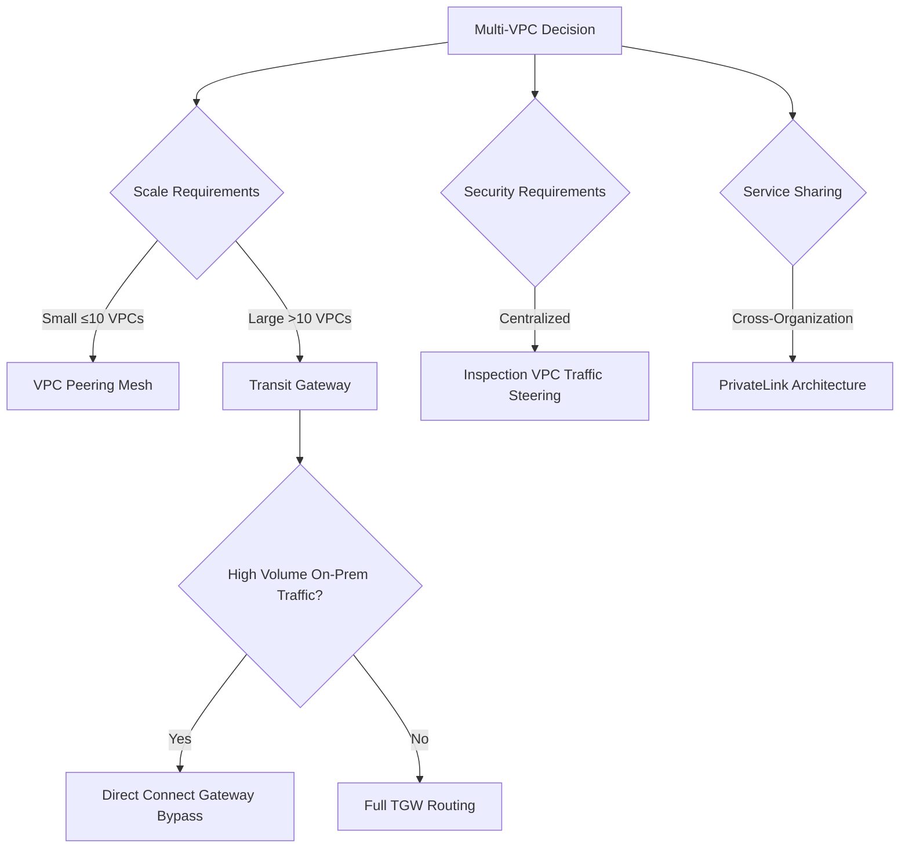

<details open>
<summary><b>Section 15: Architectures (KK-CS45-script-v2)</b></summary>

# Section 15: Architectures

## Table of Contents
- [15.1 Architectures part 1](#151-architectures-part-1)
- [15.2 Architectures part 2](#152-architectures-part-2)
- [15.3 Architectures part 3](#153-architectures-part-3)
- [15.4 Architectures part 4](#154-architectures-part-4)
- [15.5 PrivateLink and TGW](#155-privatelink-and-tgw)
- [15.6 Centralized VPC Endpoint](#156-centralized-vpc-endpoint)
- [15.7 TGW or Transit VPC](#157-tgw-or-transit-vpc)
- [15.8 Centralized Security and Control part 1](#158-centralized-security-and-control-part-1)
- [15.9 Centralized Security and Control part 2](#159-centralized-security-and-control-part-2)
- [15.10 Centralized Security and Control part 3](#1510-centralized-security-and-control-part-3)
- [15.11 Service Chaining - Local and Central](#1511-service-chaining---local-and-central)
- [15.12 NAT Design Options](#1512-nat-design-options)
- [15.13 Design Patterns Considerations](#1513-design-patterns-considerations)

## 15.1 Architectures part 1

### Overview
This section explores multi-VPC architectures starting with basic designs using VPC peering. It examines the hub-and-spoke connectivity model and its limitations regarding scalability and complexity, especially when integrating with hybrid on-premises networks. The discussion highlights the challenges of maintaining full mesh communication patterns and introduces alternatives for larger scale deployments.

### Key Concepts/Deep Dive

#### Basic Multi-VPC Design with VPC Peering
- **Hub-and-Spoke Topology**: VPC A and VPC B connect to VPC C, creating a star-like configuration
- **Transitive Routing Limitation**: VPC peering does not support transitive routing, requiring direct peering between VPC A and VPC B for communication
- **Scale Limitations**: For 10 VPCs, approximately 45 peerings needed using mesh formula (n×(n-1)/2)

#### Hybrid Integration with Transit VPC
- **Architecture Components**:
  - IPsec VPN tunnels connecting VPCs
  - VPC peering for full mesh communication
  - On-premises connectivity via VPN
- **Complexities**:
  - High number of IPsec tunnels to manage
  - Full mesh peering requirements
  - Bandwidth limitations for spoke VPCs through VPN tunnels

#### Design Considerations

**Scalability Limitations:**
- Maximum 125 VPC peering connections per VPC (scalable upon request)
- Complexity increases exponentially with additional VPCs
- Routing table management becomes cumbersome

**Performance Constraints:**
- VPN tunnel bandwidth limitations affect Direct Connect capacity utilization
- Spoke VPCs cannot leverage full Direct Connect bandwidth (e.g., 10Gbps limitation)
- Network load balancer performance capped by VPN throughput

**Flexibility and Management:**
- Reduced flexibility in large-scale hybrid deployments
- Complex routing table updates for network changes
- Increased maintenance overhead with growing infrastructure

```diff
! Multi-VPC Peering Limitations:
- Limited scalability (125 peering connections max)
- Transitive routing not supported
- Complex mesh requirements for full connectivity
+ Suitable for small-scale deployments
+ No additional AWS service costs
- Performance bottlenecks via VPN tunnels
```

## 15.2 Architectures part 2

### Overview
This section demonstrates how AWS Transit Gateway overcomes VPC peering limitations by enabling scalable hub-and-spoke architectures. It covers multi-region connectivity, centralized hybrid connections, and considerations for mixing Direct Connect and VPN connectivity. The discussion includes real-world architectural patterns with multiple transit gateways across regions.

### Key Concepts/Deep Dive

#### Transit Gateway as Scalable Alternative
- **Hub-and-Spoke Scaling**: Supports up to 5000 VPCs per Transit Gateway
- **Centralized Hybrid Connections**: Consolidates VPN, Direct Connect, and VPC attachments
- **Multi-Region Capabilities**: Transit Gateway peering over AWS global infrastructure (encrypted in transit)

#### Flexible Connectivity Patterns
- **Inter-Region Access**: Remote regions without Direct Connect can access on-premises sites via different region's Transit Gateway
- **VPN Termination**: Recommended to terminate VPN in each region requiring VPN connectivity
- **Hybrid Mix Options**: Combining Direct Connect and VPN with careful consideration

#### Design Considerations for Hybrid Connectivity
- **Latency Tolerance**: Applications must accept potential latency impacts
- **Compliance Requirements**: Verify acceptability of internet-based connectivity
- **Resiliency Analysis**: Assess failover capabilities and redundancy needs

**Technology Feasibility:**
```diff
+ Direct Connect + VPN mix is technically possible
+ Cost-effective and resilient design option
+ Large-scale global architectures supported
! Requires careful latency and compliance evaluation
```

#### Large-Scale Global Architecture Pattern
- **Multiple Direct Connect Connections**: Four Direct Connects terminating on two Transit Gateways
- **Direct Connect Gateway Limitations**: Single VIF supports up to 3 Transit Gateways, requiring additional DXG for more connections
- **Inter-DC Communication**: Traffic between on-premises data centers via AWS infrastructure (subject to data transfer charges)
- **QoS Considerations**: May require dedicated telecom provider connections for specific QoS classes

> [!IMPORTANT]
> Each Direct Connect virtual interface supports up to 3 Transit Gateways. Additional DXGs are needed for connecting more than 3 TGWs to a single Direct Connect location.

## 15.3 Architectures part 3

### Overview
This section focuses on optimizing Transit Gateway architecture for cost efficiency while maintaining scalability benefits. It presents strategies to bypass Transit Gateway data processing charges for high-volume traffic between on-premises sites and specific VPCs, using Direct Connect Gateway for direct connections.

### Key Concepts/Deep Dive

#### Cost Optimization Strategy
- **Traffic Pattern Analysis**: Identify high-volume inter-site VPC communications
- **Direct Connect Bypass**: Connect targeted VPCs directly via Direct Connect Gateway to avoid TGW data charges
- **Hybrid Approach Benefits**:
  - Maintain Transit Gateway advantages for inter-VPC routing
  - Reduce costs for high-volume on-premises ↔ VPC traffic
  - Preserve centralized management capabilities

#### Multi-Region Expansion
- **Conditional TGW Peering**: Add Transit Gateway peering only when inter-region VPC communication is required
- **Direct Connect Gateway Scaling**: Maximum 10 VPCs per Direct Connect Gateway
- **Regional Architecture**: Separate direct connections and Transit Gateway routing domains

#### Scaling Beyond Single Direct Connect Gateway
- **Multiple DXG Deployment**: Provision additional Direct Connect Gateways for >10 VPCs
- **VIF Limitations**: Up to 50 Direct Connect Gateways per Direct Connect connection (driven by max private VIFs per connection)
- **Cross-Region Capabilities**: Direct Connect Gateways can connect VPCs across multiple regions

**Cost Optimization Architecture:**
```diff
+ High-volume traffic bypasses TGW data charges
+ Direct Connect Gateway for efficient large transfers
+ Transit Gateway maintains for inter-VPC routing
! Monitoring traffic patterns essential for optimization
! May increase architectural complexity
```

> [!NOTE]
> This design pattern requires careful traffic analysis to identify which VPCs justify direct Direct Connect connections versus Transit Gateway routing.

## 15.4 Architectures part 4

### Overview
This section examines AWS PrivateLink architecture for creating centralized SaaS services across multiple VPCs. It details the integration of AWS PrivateLink with Network Load Balancers to enable secure cross-VPC service access, including overlapping IP address ranges and on-premises connectivity extensions.

### Key Concepts/Deep Dive

#### Service Provider and Consumer Model
- **VPC Types**:
  - Service Consumer VPCs: Sources of service requests
  - Service Provider VPCs: Hosts the actual services
- **Technology Stack**: PrivateLink + Network Load Balancer + Interface Endpoints

#### Network Load Balancer Integration
- **OSI Layer Operation**: Layer 4 (Transport) load balancing
- **Performance Capability**: Millions of requests per second
- **Frontend Representation**: Endpoint network interface in consumer VPC

#### High Availability Design
- **Multi-AZ Deployment**: Interface endpoints in at least 2 availability zones
- **Subnet Distribution**: Spread across different subnets for resiliency

**IP Address Handling:**
```diff
+ Source IP transformation: Consumer IPs become NLB node IPs
! No IP overlap concerns in this architecture
! Overlapping subnets between consumer and provider VPCs supported
+ Flexible IP range assignment across organizations
```

#### Cross-Organization Service Access
- **SaaS Delivery Model**: Services accessible across different AWS accounts/companies
- **Global Reach**: Services available throughout AWS infrastructure
- **No Internet Traffic**: All communications via PrivateLink over AWS global network

#### On-Premises Integration Patterns

**On-Premises as Consumer:**
- Extend VPC endpoint reachability to on-premises sites
- Consumer VPCs bridge connectivity to remote locations

**On-Premises as Provider:**
- NLB backend targets point to on-premises IP addresses
- Migration interim solution for legacy applications
- **Benefits for Overlapping IPs**: Eliminates NAT requirements even with subnet conflicts

**Migration Strategy Applications:**
```diff
+ Interim access solution during cloud migration
+ Seamless service consumption across hybrid environments
! No IP address translation required
+ Supports complex network architectures
```

> [!IMPORTANT]
> PrivateLink architecture enables seamless service access across VPCs regardless of overlapping IP ranges, eliminating traditional networking constraints.

## 15.5 PrivateLink and TGW

### Overview
This section explores the integration possibilities between AWS PrivateLink and Transit Gateway for advanced networking architectures. It discusses how these services can complement each other in shared services and centralized access patterns, providing secure and scalable connectivity options.

### Key Concepts/Deep Dive

#### Shared Services Architecture
- **Centralized Service Provisioning**: PrivateLink endpoints enable shared services access
- **Scalable Connectivity**: Transit Gateway facilitates widespread service distribution
- **Security Boundary Maintenance**: Isolated access through controlled attachment points

#### Network Design Patterns
- **Hub-and-Spoke Enhancement**: Transit Gateway as connectivity hub with PrivateLink endpoints
- **Multi-VPC Service Access**: Centralized services reachable across distributed VPCs
- **Hybrid Integration Points**: Connecting on-premises resources through maintained security postures

#### Operational Considerations
- **Traffic Flow Security**: PrivateLink maintains traffic within AWS network boundaries
- **Endpoint Management**: Interface and Gateway endpoint administration across environments
- **Routing Complexity**: Strategic route table configuration for optimal traffic paths

**Integration Benefits:**
```diff
+ Secure inter-VPC service communication
+ Centralized resource access patterns
+ Enhanced scalability with Transit Gateway routing
! Careful endpoint and routing configuration required
```

## 15.6 Centralized VPC Endpoint

### Overview
This section details centralized VPC endpoint architectures for optimizing AWS service access across multiple VPCs. It covers different endpoint types, connectivity patterns, and cost-effective design approaches using shared networking components.

### Key Concepts/Deep Dive

#### Endpoint Types Overview
- **Interface Endpoints**: PrivateLink connections for most AWS services
- **Gateway Endpoints**: Route table integration for S3 and DynamoDB
- **Gateway Load Balancer Endpoints**: Integration points for third-party appliances

#### Centralized Architecture Benefits
- **Cost Optimization**: Reduce endpoint duplication across VPCs
- **Management Simplification**: Single point of endpoint administration
- **Consistency**: Standardized service access patterns

#### Design Implementation
- **Shared Services VPC**: Consolidated endpoint hosting location
- **Connectivity Methods**: Transit Gateway or VPC peering for access distribution
- **Route Table Configuration**: Strategic routing for service traffic redirection

**Regional Considerations:**
```diff
+ Consolidated management overhead
+ Reduced per-VPC endpoint costs
- Potential single point of failure
+ Simplified update and maintenance procedures
```

## 15.7 TGW or Transit VPC

### Overview
This section compares Transit Gateway and Transit VPC architectures, analyzing their respective strengths, limitations, and appropriate use cases. It provides decision frameworks for selecting the optimal transit mechanism based on scaling requirements, cost considerations, and operational complexity.

### Key Concepts/Deep Dive

#### Architecture Comparison

**Transit Gateway Advantages:**
- Native AWS managed service with automated scaling
- Integrated routing and policy management
- Multi-region connectivity capabilities

**Transit VPC Patterns:**
- Customer-managed infrastructure control
- Custom security appliance integration
- Legacy architecture migration support

#### Decision Criteria Analysis
- **Scale Requirements**: TGW supports 5000+ VPCs vs. VPC operational limits
- **Management Overhead**: TGW reduces operational complexity
- **Customization Needs**: Transit VPC enables advanced networking controls

#### Migration Considerations
- **Gradual Transitions**: Phased migration strategies between architectures
- **Feature Parity**: Ensuring equivalent functionality post-migration
- **Cost Analysis**: Comparing long-term operational expenses

**Selection Framework:**
```diff
+ Transit Gateway: Large-scale, managed AWS environments
+ Transit VPC: Custom networking, security appliance requirements
! Evaluate scaling, management, and compliance needs
```

## 15.8 Centralized Security and Control part 1

### Overview
This section initiates exploration of centralized security architectures in multi-VPC environments. It establishes foundational concepts for implementing unified security controls, threat mitigation strategies, and compliance frameworks across distributed AWS infrastructures.

### Key Concepts/Deep Dive

#### Security Architecture Foundations
- **Centralized Control Planes**: Unified security policy management
- **Threat Detection Infrastructure**: Consolidated monitoring and alerting capabilities
- **Compliance Framework Integration**: Automated policy enforcement mechanisms

#### Multi-VPC Security Patterns
- **Inspection VPC Design**: Dedicated security processing environments
- **Traffic Flow Control**: Centralized ingress/egress security enforcement
- **Identity and Access Management**: Unified user and resource authorization

#### Implementation Strategies
- **Network Security Groups**: VPC-level traffic filtering policies
- **AWS Network Firewall**: Advanced threat protection and inspection
- **AWS Firewall Manager**: Organization-wide security rule management

**Design Principles:**
```diff
+ Centralized visibility and control
- Distributed enforcement complexity
+ Unified security policy application
! Scalability and performance considerations
```

## 15.9 Centralized Security and Control part 2

### Overview
This continuation examines advanced centralized security implementations, focusing on specific architectural patterns, inspection mechanisms, and traffic steering methodologies. It delves into East-West traffic security and North-South protection strategies within complex AWS network topologies.

### Key Concepts/Deep Dive

#### Advanced Security Patterns
- **East-West Traffic Protection**: Inter-VPC communication security controls
- **North-South Security Architecture**: Inbound/outbound traffic inspection
- **Centralized Inspection Zones**: Dedicated security processing VPCs

#### Traffic Steering Mechanisms
- **Transit Gateway Routing**: Policy-based traffic redirection through security VPCs
- **VPC Endpoint Integration**: Secure service access through centralized endpoints
- **Route Table Manipulation**: Dynamic traffic flow control

#### Security Service Integration
- **AWS Network Firewall Configuration**: Deep packet inspection capabilities
- **AWS Gateway Load Balancer**: Third-party security appliance orchestration
- **AWS Firewall Manager**: Multi-account security policy distribution

**Implementation Considerations:**
```diff
+ Comprehensive traffic visibility
+ Centralized security management
- Potential performance impact
+ Enhanced threat detection
```

## 15.10 Centralized Security and Control part 3

### Overview
The final security section completes the centralized control framework by addressing operational aspects, monitoring strategies, and compliance automation. It integrates logging, alerting, and response mechanisms into unified security architectures.

### Key Concepts/Deep Dive

#### Operational Security Integration
- **Logging Aggregation**: Centralized security event collection and analysis
- **Automated Response Systems**: Policy-driven incident mitigation
- **Compliance Monitoring**: Continuous assessment and reporting frameworks

#### Monitoring and Analytics
- **AWS Security Hub**: Consolidated security findings and compliance checks
- **Amazon GuardDuty**: Intelligent threat detection and response
- **AWS Config**: Configuration compliance and change tracking

#### Response and Recovery
- **Automated Remediation**: Policy-based security incident response
- **Backup and Recovery**: Secure data protection and restoration procedures
- **Incident Response Playbooks**: Standardized security event handling processes

**Operational Security Framework:**
```diff
+ Unified monitoring and response
+ Automated compliance management
- Complexity in multi-account environments
+ Enhanced security posture visibility
```

## 15.11 Service Chaining - Local and Central

### Overview
This section analyzes service chaining architectures comparing local service integration within individual VPCs versus centralized service access patterns. It explores the trade-offs between distributed and consolidated service deployment models, focusing on operational efficiency and network optimization.

### Key Concepts/Deep Dive

#### Service Chaining Models

**Local Service Integration:**
- Services deployed within individual VPCs
- Reduced network latency for intra-VPC communications
- Isolated service management and updates

**Centralized Service Access:**
- Shared services in dedicated VPCs
- Transit Gateway or PrivateLink connectivity
- Centralized management and resource optimization

#### Architecture Decision Factors
- **Latency Requirements**: Impact of network hops on application performance
- **Management Complexity**: Operational overhead of distributed vs. centralized models
- **Cost Optimization**: Resource utilization and infrastructure efficiency

#### Implementation Patterns
- **Gateway Load Balancer**: Appliance chaining for traffic inspection
- **VPC Endpoints**: Secure service connectivity patterns
- **Route Table Engineering**: Traffic steering for service consumption

**Chaining Strategy Considerations:**
```diff
+ Local: Reduced latency, isolated operations
+ Central: Resource optimization, unified management
! Evaluate trade-offs based on specific requirements
```

## 15.12 NAT Design Options

### Overview
This section explores Network Address Translation design patterns in complex AWS networking architectures. It examines different NAT implementation strategies, their integration with Transit Gateway and centralized security models, and considerations for hybrid network environments.

### Key Concepts/Deep Dive

#### NAT Implementation Patterns
- **Distributed NAT**: Individual NAT gateways per VPC
- **Centralized NAT**: Shared NAT services for multiple VPCs
- **Transit Gateway NAT**: Integrated address translation capabilities

#### Architecture Integration
- **Spoke VPC Connectivity**: NAT placement for outbound internet access
- **Security Integration**: NAT combination with inspection VPCs
- **Hybrid Connectivity**: Address translation for on-premises integration

#### Traffic Flow Optimization
- **Route Table Configuration**: Efficient traffic routing through NAT services
- **Availability Zone Distribution**: High availability NAT gateway placement
- **Cost vs. Performance**: Evaluating NAT instance vs. NAT Gateway options

**Design Decision Framework:**
```diff
+ Distributed: Isolated control, reduced blast radius
+ Centralized: Cost optimization, simplified management
! Consider traffic patterns and security requirements
```

## 15.13 Design Patterns Considerations

### Overview
This final section synthesizes the architectural patterns discussed throughout Section 15, providing comprehensive design consideration frameworks. It offers decision-making guidance for selecting optimal AWS networking architectures based on specific organizational requirements, scalability needs, and operational constraints.

### Key Concepts/Deep Dive

#### Architectural Decision Framework
- **Scale Assessment**: Evaluating current and future infrastructure requirements
- **Connectivity Analysis**: Determining optimal interconnection patterns
- **Cost Optimization**: Balancing performance and expense considerations

#### Pattern Selection Criteria
- **Hybrid Integration**: Selecting appropriate on-premises connectivity models
- **Security Requirements**: Implementing comprehensive protection strategies
- **Operational Complexity**: Balancing automation and management overhead

#### Implementation Best Practices
- **Gradual Migration**: Phased approach to architectural transformations
- **Monitoring Integration**: Comprehensive observability and alerting
- **Change Management**: Structured processes for architectural modifications

**Strategic Design Principles:**
```diff
+ Scalability-first architectural decisions
+ Security and compliance integration
+ Cost-performance optimization
+ Operational efficiency considerations
! Avoid over-engineering for current needs
```

## Summary

### Key Takeaways
```diff
+ Transit Gateway enables scalable multi-VPC architectures beyond VPC peering limits
+ Direct Connect Gateway bypass optimizes costs for high-volume on-premises traffic
+ PrivateLink facilitates secure cross-VPC service access regardless of IP overlaps
+ Centralized security architectures provide unified threat protection and compliance
+ NAT design choices impact cost, performance, and security integration
+ Choose architectures based on scale, security, and operational requirements
- Complex mesh peering becomes unmanageable at scale
- VPN tunnels limit bandwidth utilization for spoke VPCs
- Cost optimization may require careful traffic pattern analysis
```

### Quick Reference

#### Architecture Selection Guide
- **Small Scale (≤10 VPCs)**: VPC Peering mesh
- **Large Scale (>10 VPCs)**: Transit Gateway hub-and-spoke
- **Cost Sensitive**: Direct Connect Gateway bypass for high-volume traffic
- **Service Focus**: PrivateLink for cross-organizational service access
- **Security Focus**: Centralized inspection VPCs with traffic steering

#### Key Limits and Considerations
- Transit Gateway: 5000 VPCs per TGW
- Direct Connect Gateway: 10 VPCs per DXG, 3 TGWs per VIF
- VPC Peering: 125 connections per VPC
- Network Firewall: Multi-VPC deployment flexibility



### Expert Insight

**Real-World Application**:
In enterprise scenarios requiring global presence with hundreds of VPCs, Transit Gateway becomes essential. Organizations often start with VPC peering and migrate to TGW as complexity grows. Cost optimization through Direct Connect Gateway bypass proves valuable for data-intensive applications like analytics or content distribution.

**Expert Path**:
Master architectural design by understanding trade-offs between complexity and scalability. Focus on traffic pattern analysis for cost optimization, and always design with compliance requirements in mind. Learn to leverage AWS networking services combinatorially rather than individually.

**Common Pitfalls**:
- Underestimating scaling needs; plan for 2-3x growth
- Ignoring Transit Gateway data transfer costs at high volumes
- Not accounting for IP overlap constraints in legacy migrations
- Over-complicating security architectures before establishing baselines
- Failing to monitor and adjust architectures as traffic patterns evolve

**Lesser-Known Facts**:
- Transit Gateway peering enables encrypted inter-region connectivity via AWS backbone
- PrivateLink eliminates IP addressing conflicts across organizations
- Direct Connect virtual interfaces support up to 50 private connections, enabling extensive networking options
- AWS Network Firewall can be centrally managed across accounts via Firewall Manager

</details>