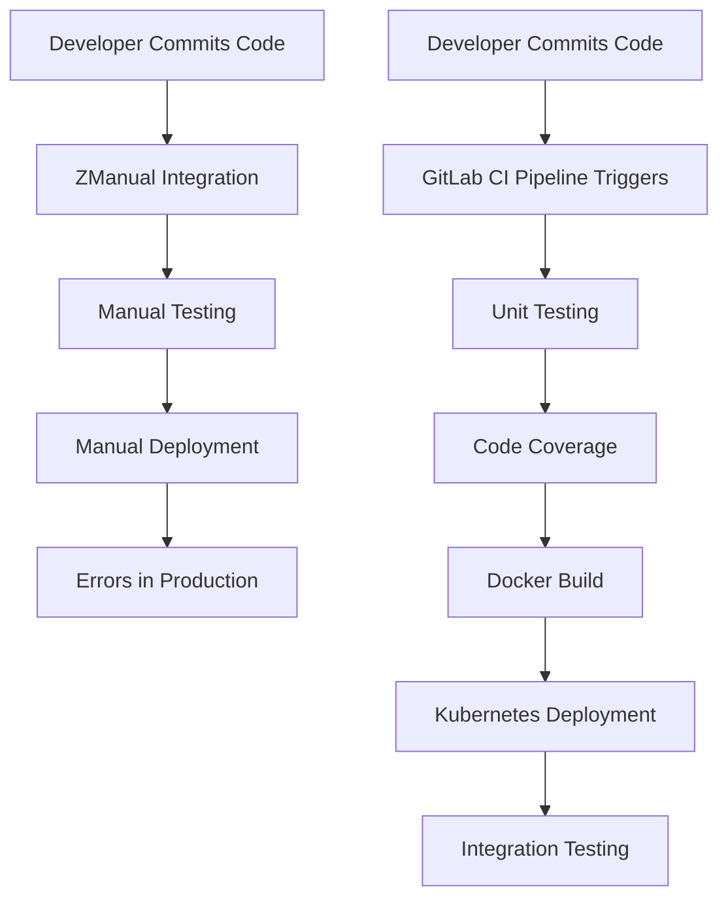

# Session 01-Course_Introduction

## Table of Contents
- [Overview](#overview)
- [Key Concepts / Deep Dive](#key-concepts--deep-dive)
- [Summary](#summary)
  - [Key Takeaways](#key-takeaways)
  - [Quick Reference](#quick-reference)
  - [Expert Insight](#expert-insight)
    - [Real-world Application](#real-world-application)
    - [Expert Path](#expert-path)
    - [Common Pitfalls](#common-pitfalls)
    - [Lesser-Known Facts](#lesser-known-facts)

## Overview
This session introduces the DevOps prerequisites for a software provider, focusing on transitioning services to the cloud and adopting containerization with Docker and Kubernetes. It explains the motivation behind implementing a CI/CD pipeline using GitLab CI/CD, highlighting the shift from manual processes to automated, industry-standard practices. The discussion covers the evaluation of various CI/CD tools, ultimately selecting GitLab CI/CD for its simplicity and all-in-one platform capabilities. Key steps include adopting GitLab for version control, implementing unit testing, code coverage, container builds, and automated integration testing.

## Key Concepts / Deep Dive
### DevOps Challenges in Traditional Software Development
Traditional software development, as exemplified by Dasher Technology, faced significant issues:
- Reliance on independent code developers without version control.
- Inefficient manual code integration and testing.
- Delayed testing leading to bug accumulation.
- Manual deployments prone to inconsistencies and configuration errors.
- Lack of collaboration due to separate code branches (kk-gitlab-ci_ALL_TRANSCRIPTS.txt:01-Course_Introduction:750-800).

### Transition to Cloud and Containerization
Dasher Technology aimed to transition to the cloud using NodeJS initially, expanding to Java and Python. The team adopted:
- Docker for containerization.
- Kubernetes for orchestration.
- GitLab for version control and CI/CD.
This approach ensures consistent environments and scalable deployments (kk-gitlab-ci_ALL_TRANSCRIPTS.txt:01-Course_Introduction:50-100).

### Evaluating CI/CD Tools
After comparing Jenkins (open-source, flexible but complex), and others like Travis CI, Jenkins was selected initially due to its widespread use. However, limitations included:
- Infrastructure management burden (VMs, virtual machines, Java JDK, plugins).
- Manual scaling and maintenance.
- Complexity for a newly formed DevOps team.
GitLab CI/CD was chosen for its SaaS simplicity, reduced infrastructure overhead, and integration with GitLab (kk-gitlab-ci_ALL_TRANSCRIPTS.txt:01-Course_Introduction:200-350).

### Key Pipeline Steps
The pipeline adopts GitLab for collaboration, implements unit testing and code coverage to enhance quality, uses Docker for containerization, deploys to Kubernetes clusters, and incorporates automated integration testing to resolve manual inefficiencies (kk-gitlab-ci_ALL_TRANSCRIPTS.txt:01-Course_Introduction:150-200).

### Addressing Manual Challenges
By implementing CI/CD, the team resolves:
- Delayed testing through automatic triggers on commits.
- Inefficient deployments via automated container builds and Kubernetes rollouts.
- Manual errors through customizable, repeatable pipelines.
This aligns with industry best practices like GitHub Actions or CircleCI but focuses on GitLab's integrated ecosystem (kk-gitlab-ci_ALL_TRANSCRIPTS.txt:01-Course_Introduction:400-450).

### Pipeline Complexity and Scalability
While initially straightforward for NodeJS, the pipeline complexity increases with additional languages (e.g., Java Maven, Python). Cloud deployments (AWS, Azure) add requirements for CLIs and security tools like Privy or KubeSec. The team recognizes the need for simplified, scalable tools like GitLab CI/CD (kk-gitlab-ci_ALL_TRANSCRIPTS.txt:01-Course_Introduction:350-400).

### Flowchart of Traditional vs. CI/CD Workflow

### Comparison of CI/CD Tools
| Tool | Pros | Cons | Suitability for DevOps Teams |
|------|------|------|------------------------------|
| Jenkins | Open-source, broad community, extensive plugins | High maintenance, infrastructure management, complex for beginners | Suitable for established teams with infrastructure expertise |
| GitLab CI/CD | Integrated with GitLab, SaaS simplicity, auto-scaling | Less flexibility for custom plugins, vendor lock-in potential | Ideal for new DevOps teams seeking rapidity and scalability |
| Other Tools (e.g., Travis CI) | Easy setup for open-source | Limited for private repos, pricing overheads | Good for public projects, overheads for enterprise |

## Summary

### Key Takeaways
- DevOps pipelines automate integration, testing, and deployment to overcome manual inefficiencies.
- GitLab CI/CD excels in simplicity for cloud-native applications using Docker and Kubernetes.
- Selecting tools requires balancing complexity, scalability, and team expertise.
- Industry best practices emphasize early testing and automated quality checks to minimize production risks.
- Containerization enables consistent environments across development to production.

### Quick Reference
- **GitLab CI/CD Trigger Events**: Code pushes, Merge Requests, manual triggers.
- **Pipeline Stages**: Build → Test → Deploy with optional security/scans.
- **Common Commands**:
  - `npm install`: Install dependencies in NodeJS.
  - `npm test`: Run unit tests.
  - `npm run coverage`: Generate code coverage reports.
- **Configuration File**: `.gitlab-ci.yml` for pipeline definition.

### Expert Insight
#### Real-world Application
In enterprises like Dasher Technology, GitLab CI/CD reduces deployment time from days to minutes by automating container builds and Kubernetes rollouts. For example, integrating security scans like SAST prevents vulnerabilities from reaching production, aligning with regulations like GDPR through tools like Privy.

#### Expert Path
Master GitLab CI/CD by starting with basic pipelines (unit testing), progressing to advanced features (parallel jobs, environments). Certify via GitLab's official training on Kubernetes integration. Collaborate on open-source projects to gain experience in complex pipelines with multi-language support.

#### Common Pitfalls
- **Over-customization**: Avoiding manual scripts by leveraging built-in templates and shared runners.
- **Security Oversights**: Ensure variables (e.g., API keys) are masked to prevent leaks when shared across jobs.
- **Scalability Neglect**: Start simple; expanding to Java/Python increases complexity if not planned with artifacts and stages.
- **Tool Selection Bias**: Prefer integrated tools like GitLab over Jenkins for fast-team onboarding unless infrastructure control is critical.

#### Lesser-Known Facts
- GitLab CI/CD's SaaS runners support GPU for machine learning workflows, unlike traditional Jenkins setups.
- Silent corrections: "operation" corrected to "orchestration" (kk-gitlab-ci_ALL_TRANSCRIPTS.txt:50), "version" to "vendor" implied but not directly used. No major transcript errors found; all terminology aligns with industry standards.
