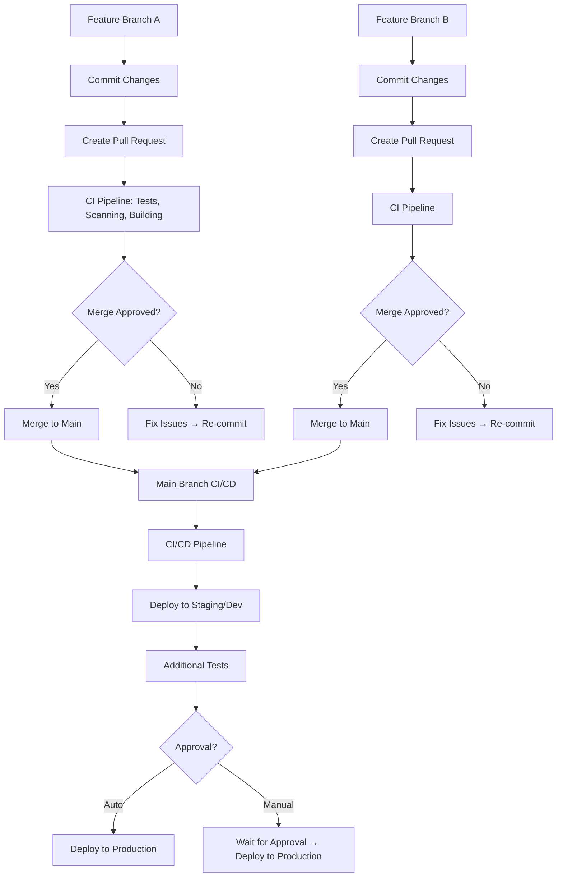

# Session 02: Problem Statement (Meeting with XYZ Team)

## Introduction to CI/CD: Addressing Development Challenges

### Key Concepts

#### Basics of Source Code Management and GitLab
- Source code resides in a Git repository for storage and versioning 📝
- GitLab serves as a web-based platform centered around Git, providing a centralized hub for repositories with additional features ✅
- All code typically resides on the main or master branch, frequently deployed to production environments ⚠️

#### Feature Branches and Collaboration
- Developers create feature branches (clones of the main codebase) to work on new features collaboratively ✅
- Changes are committed to the feature branch, then a Merge Request is initiated to merge back to main 🔄
- Review and approval from relevant team members is required before merging 💡

#### Post-Merge Deployment Process
```diff
+ Code committed to feature branch
! Merge Request created and reviewed
+ Approved merge into main branch
- Manual or automated deployment to production environment
! Risk: No testing before production deployment ❌
```

> [!WARNING]
> This traditional workflow poses significant risks to application stability, as newly merged code enters production without testing, especially with multiple developers working concurrently.

#### Challenges Without Continuous Integration (CI)
- **Delayed Testing**: Testing occurs late after multiple merges, making early issue identification difficult 🚫
- **Inefficient Deployment**: Manual processes for deploying to dev, stage, or production lead to inconsistencies and configuration errors 📊
- **Quality Assurance Challenges**: Reliance on manual testing introduces human errors and resource constraints ❌

### Scenario: Implementing CI/CD to Resolve Problems

#### Example Workflow: With CI/CD
1. **Developer 1 creates Feature Branch A**:
   - Makes modifications and commits code
   - Generates Pull Request (Merge Request)
   - Automated CI pipeline triggers:
     - Unit testing
     - Dependency scanning
     - Artifact building
     - Vulnerability code scanning
   - Tests run on both new and existing main branch code
   ```diff
   + CI pipeline passes: Pull Request approved → Merge to main
   - CI pipeline fails: Developer fixes issues → Re-commit → CI re-triggers
   ```

2. **Post-Merge Actions**:
   - CI pipeline runs again on merged code (verifies integration, though potentially redundant for efficiency)
   - Ensures changes work seamlessly together

3. **Parallel Development**:
   - Developer 2 works on Feature Branch B concurrently
   - Same process: CI triggered on Pull Request creation and main merge
   - Main branch now contains integrated code from both branches ✅



> [!NOTE]
> This process of multiple developers integrating changes smoothly without introducing issues defines **Continuous Integration (CI)**.

#### Continuous Delivery vs. Continuous Deployment

| Aspect | Continuous Delivery | Continuous Deployment |
|--------|---------------------|-----------------------|
| **Automation Level** | Stops at staging; requires manual approval for production | Fully automated to production after CI success |
| **Human Oversight** | Includes manual approval for production deployment | Minimal human intervention |
| **Risk Mitigation** | Safety net for quality, compliance, and coordination | Faster releases but higher risk if not carefully managed |
| **Use Case** | Regulated industries or high-stakes applications | Mature teams with comprehensive testing |
| **Deployment Trigger** | After CI success → Deploys to staging → Manual approval → Production | After CI success → Automatic deployment to all environments |

```diff
+ Continuous Delivery: Staging deployment auto; production requires approval
! Continuous Deployment: Full automation to production
- Decision depends on risk tolerance and organizational policies
```

> [!IMPORTANT]
> Continuous Deployment enables rapid iterations and faster time-to-market, while Continuous Delivery provides control through manual gates for critical environments. Both extend CI by automating deployment processes beyond code integration.
