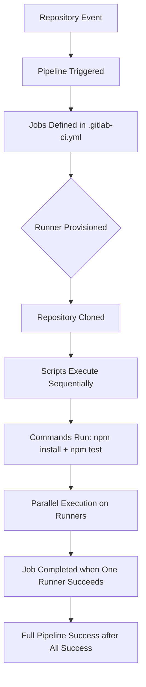

# Session 3: Basics of CI/CD

## Basics of CI/CD

### Key Concepts

**Introduction to GitLab CI/CD**
- GitLab CI/CD automates the software development lifecycle from code commit to deployment
- Enables workflows directly from repositories, building, testing on commits, and deploying merge requests
- Integrates with GitLab as the core repository for comprehensive DevOps platform

**How CI/CD Jobs Execute**
- Runners are agents that execute jobs in pipelines
- GitLab Runner works with GitLab CI/CD to run pipeline jobs

**Types of Runners**
- **SaaS Runners**: Hosted and managed by GitLab, enabled by default for all projects
  - Fully integrated with GitLab.com
  - Support for various operating systems:
    - Linux: Wide range of languages and tools
    - Windows: For Windows-specific tools and testing
    - macOS: For macOS-specific tools and services
    - GPU-enabled SaaS Runners: Accelerate heavy computing workloads (e.g., ModelOps, training large language models)

> [!NOTE]
> GitLab manages infrastructure including servers, scaling, and execution environments for SaaS runners.

**Benefits of SaaS Runners**
- Reduces manual configuration and infrastructure management
- Handles task execution in new VMs for each job, dependency caching, and reporting
- Streamlines development: Faster feature releases, reduced manual errors, early bug detection

**Pipeline Configuration**
- Use `.gitlab-ci.yml` file in project root for pipeline configuration
- Pipelines are automated processes executing one or more jobs
- Jobs run in response to repository events (e.g., commits to main branch)

**Jobs and Scripts**
- Jobs define what to do (e.g., test, deploy)
- Runners are VMs that execute pipeline jobs based on tags

> [!EXAMPLE]
> A job can run on multiple machines (Windows, Ubuntu, macOS) simultaneously, with GitLab provisioning runners accordingly.

**Execution Flow**


- By default, parallel runners execute independently
- Pipeline success requires all jobs to complete successfully
- First successful job triggers early success for that job, but pipeline waits for all

**Accessing Outputs**
- View logs and artifacts via GitLab UI Pipeline tab
- Navigate to stages and job details for debugging
- Individual runner logs available for each machine
- Download artifacts through GitLab interface

**Key Terminology Recap**
- Pipelines: Automated processes with jobs
- Jobs: Individual tasks (e.g., unit testing)
- Scripts: Sequential commands in YAML
- Runners: Execution agents (SaaS managed VMs)

> [!IMPORTANT]
> ```diff
> + Automation Benefits: Faster releases, reduced errors, early bug catching
> + SaaS Runners: Managed infrastructure, no configuration needed
> + Parallel Execution: Multi-platform testing in single pipeline
> ```

### Transcript Corrections
- "SAST Runners" corrected to "SaaS Runners" throughout (contextually referring to Software as a Service, not Static Application Security Testing)
