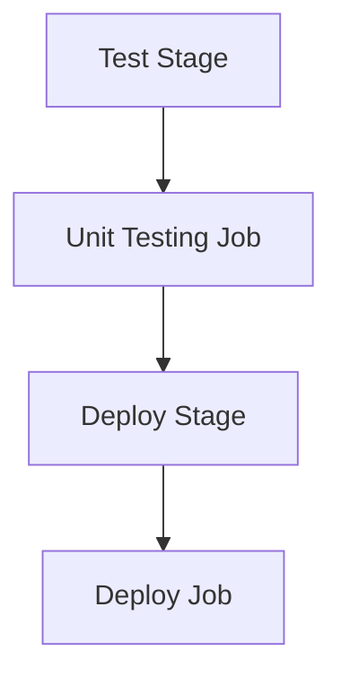

# Session 5: Create GitLab Account

In this session, we will explore the core concepts of a GitLab CI/CD pipeline.
It consists of four key components: pipeline, stages, jobs, and script.
So let's take an example to understand them.

## Pipeline

A pipeline is an automated process capable of executing one or more jobs. It acts as the blueprint for continuous integration and deployment, ensuring code changes flow smoothly through testing, building, and deployment phases.

### Key Concepts
- Definition: Automated process for CI/CD workflows
- Configuration: Defined using a YAML file located beside the codebase in the repository
- Identification: Optional `workflow` named keyword for unique pipeline identification
- Triggers: Events like code pushes, Merge Requests, or manual actions

#### Example Workflow Rules
```yaml
workflow:
  rules:
    - if: $CI_COMMIT_BRANCH == "main"
```

> [!NOTE]
We will talk more about triggers and rules in a later session.

## Job

Jobs are the building blocks of pipelines. You can have one or more jobs within the same pipeline, each associated with a runner.

### Key Concepts
- Runners: GitLab-hosted or self-hosted virtual machines executing job instructions
- Tags: Optional keyword to specify runner (e.g., Linux machine)
- Default Behavior: Jobs run on default runner if no tags specified

#### Example Job with Tags
```yaml
job_example:
  tags:
    - linux
```

> [!NOTE]
We will talk more about tags, runners, and runner configurations in a later session.

## Script

The script contains the commands that need to be executed. It is the heart of the pipeline, defining specific tasks to perform.

### Key Concepts
- Execution: All steps/commands executed sequentially
- Flexibility: Written as individual commands, shell scripts, or supported languages
- Common Tasks:
  - Building code
  - Running tests
  - Deploying artifacts
  - Performing security scans
  - Generating documentation

### Before and After Scripts
Optional scripts running before or after the main script, providing setup and teardown opportunities.

#### Before Script Use Cases
- Install dependencies
- Prepare test environment
- Set up database connections

#### Example Before Script
```yaml
job_example:
  script:
    - echo "Main task"
  before_script:
    - npm install
```

#### After Script Use Cases
- Clean up resources after pipeline execution

#### Example After Script
```yaml
job_example:
  after_script:
    - docker system prune -f
```

💡 **Parallel Execution Default**: If a pipeline has multiple jobs, all execute in parallel by default.

## Stage

Stages provide logical grouping of jobs within a pipeline. They represent distinct phases of the CI/CD process, often aligned with development milestones.

### Key Concepts
- Order: Execute jobs in predetermined order
- Conditional Execution: Allows flexibility based on previous stage outcomes
- Benefits: Optimizes resource usage, prevents unnecessary actions
- Common Stages:
  - Build (compiling code)
  - Test (running automated tests)
  - Deploy (moving code between environments)
  - Scan (vulnerability scanning)

#### Example Stages
```yaml
stages:
  - test
  - deploy
```

💡 In this example, the deploy job starts execution only after the unit testing job successfully completes its execution.

### Stages Execution Flow


## Pipeline Types and Configurations

GitLab CI/CD offers a wide range of pipelines and configurations to tailor the software delivery process.

### Basic Pipeline
- Executes jobs within a stage concurrently
- Moves to next stage only after all jobs in current stage complete

### DAG Pipelines
- Optimize efficiency by running jobs based on dependencies
- Potentially reduce execution time compared to basic pipelines

### Merge Request Pipelines
- Trigger specifically for Merge Requests
- Ensure code quality and consistency before merging branches

### Merge Result Pipelines
- Simulate merge state of a Merge Request
- Provide early insights into potential conflicts/issues

### Merge Train Pipelines
- Enact Merge Requests for sequential execution
- Ensure controlled, orderly integration process

### Parent-Child Pipelines
- Manage complexity by breaking extensive pipelines into parent orchestrating child pipelines
- Often used in monorepo environments

### Multi-Project Pipelines
- Coordinate pipelines across different projects
- Foster collaboration, streamline cross-project dependencies

> [!TIP]
Choose the pipeline type that best suits your workflow, team structure, and project needs for efficient, reliable software delivery.

## Key Takeaways

```diff
+ Pipeline: Blueprint for CI/CD with YAML configuration and automated flow
- Jobs risk failure without proper runner tags configuration
! Stages enforce sequential execution for controlled deployment phases
```

> [!IMPORTANT]
Core components (pipeline, jobs, scripts, stages) work together to ensure smooth CI/CD processes from code changes to deployment.

### Component Hierarchy
```diff
! Pipeline → Stages → Jobs → Scripts (with optional before/after hooks)
``` 💡

**Transcript Corrections**: None identified - content appears accurate with proper terminology usage.
