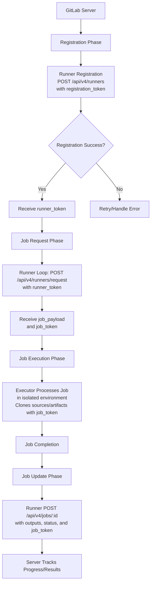

# Session 09: Types of Executors

## GitLab Server Overview
GitLab Server is an open-source DevOps platform that centralizes the software development lifecycle, offering version control, issue tracking, CI/CD pipelines, package registries, and more. It exists in two deployment flavors: GitLab SaaS and GitLab self-managed.

### GitLab SaaS vs. Self-Managed Comparison
A comparison of GitLab SaaS and self-managed deployments highlights their advantages, disadvantages, and use cases.

| Aspect | GitLab SaaS | GitLab Self-Managed |
|--------|-------------|---------------------|
| **Advantages** | - Easy to use with no infrastructure setup<br>- Quick start with minimal expertise<br>- Scalable pay-as-you-go pricing<br>- Managed by GitLab (high uptime, redundancy)<br>- Automatic updates and security patches<br>- Comprehensive security and vulnerability management | - Full control for customization and security<br>- No vendor lock-in; easy migration<br>- Complete data privacy and control<br>- Cost-effective for large teams/high usage |
| **Disadvantages** | - Limited customizations<br>- Complex/costly platform migration<br>- Data privacy concerns (hosted on GitLab infra)<br>- Expensive storage/resources for large teams | - Requires technical expertise for infrastructure<br>- Scaling can be complex/expensive<br>- Manual security patching and vulnerability management |
| **Best For** | Teams needing quick setup, variable usage, and offloaded management | Enterprises requiring customization, compliance, or cost-efficiency at scale |

> [!IMPORTANT]
> Choose based on your team's technical expertise, data privacy needs, and scaling requirements. SaaS is ideal for startups and variable workloads, while self-managed suits large organizations with specific infrastructure control.

> [!NOTE]
> Both variants offer similar core capabilities but differ in operational responsibilities and cost models.

💡 **Key Concept**: GitLab SaaS abstracts infrastructure management, making it accessible for beginners, whereas self-managed provides deep customization for expert-level control.

---

## Component Interaction in CI/CD
Building on Runners and Executors, GitLab CI/CD orchestrates pipelines through three main components: the GitLab Server (coordinator), Runner (job scheduler), and Executor (job runtime). The process unfolds in four phases.

### Diagram: CI/CD Component Flow


### Phase Breakdown: Linear Flow
```diff
! Registration Phase: Runner → POST /api/v4/runners (with registration_token) → Server → Returns runner_token for auth
! Job Request Phase: Runner → POST /api/v4/runners/request (with runner_token) → Server → Returns job_payload + job_token
! Job Execution Phase: Executor → Receives payload → Isolates environment → Executes job → Authenticates clones with job_token
+ Job Update Phase: Executor → Returns outputs/status → Runner → POST updates to server (with job_token) → Tracks results
```

> [!WARNING]
> Authentication tokens (runner_token, job_token) are critical for secure communication—never expose them in logs or repositories.

⚠️ **Warning**: Always ensure executors run in isolated environments to prevent cross-job contamination or security risks.

### Key Concepts Summary
- **Components Roles**: Server handles coordination and APIs; Runner manages job polling and scheduling; Executor ensures isolated, secure runtime.
- **Phases Flow**: Follows a loop: register → request jobs → execute → update results, enabling continuous pipeline processing.
- **Security**: Tokens provide layered auth, with job isolation protecting against failures or breaches.

> [!NOTE]
> This architecture supports scalable CI/CD, separating concerns for reliability and performance.

📝 **Lab Demo Placeholder**: No explicit lab demos in the transcript, but consider setting up a GitLab Runner registration and executing a sample job to observe the phases in action. Ensure proper token management and environment isolation.

> [!IMPORTANT]
> Mastering these interactions is essential for optimizing GitLab pipelines, especially when mixing SaaS and self-managed setups for hybrid workflows.
