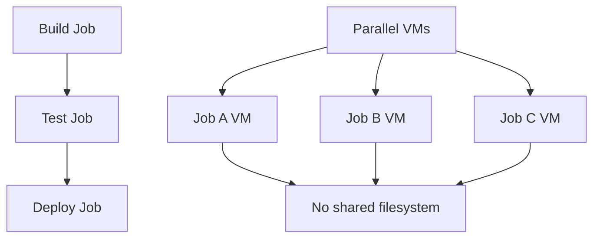

# Session 13: Executing Shell Scripts in a Job

## Job Dependencies and Pipeline Execution

### Key Concepts ⚠️

This session explores the challenges of running dependent jobs in CI/CD pipelines, specifically when multiple jobs need to access shared artifacts or follow a specific execution order.

#### Default Job Behavior in Pipelines
✅ **Parallel Execution**: When defining multiple jobs, they execute simultaneously by default  
✅ **Independent Environments**: Each job runs on its own virtual machine  
❌ **No Shared Filesystem**: Jobs cannot access files generated by other jobs  
❌ **Unpredictable Order**: Jobs start in random order without dependencies

#### The Problem Demonstration

The instructor modifies a single-job pipeline to three dependent jobs:

1. **Build Job**: 
   - Installs K8sgpt library
   - Sleeps for 30 seconds (intentional delay for demo)
   - Generates ASCII artwork and saves to `dragon.txt`

2. **Test Job**:
   - Sleeps for 10 seconds 
   - Checks if `dragon.txt` file exists
   - Validates file content

3. **Deploy Job**:
   - Reads content from `dragon.txt` 
   - Processes the generated file



#### Execution Results
```diff
- ❌ Deploy job fails first - cannot access dragon.txt
- ❌ Test job fails - cannot access dragon.txt  
+ ✅ Build job succeeds - creates dragon.txt locally
```

The pipeline demonstrates that:
- Jobs run concurrently without waiting
- Each job uses isolated VM/container
- File dependencies break due to parallel execution
- Order becomes unpredictable

### Critical Insights

> [!IMPORTANT]
> Pipeline jobs execute independently on separate virtual machines with no shared storage. Files generated in one job are inaccessible to others unless specifically configured through artifacts or shared volumes.

> [!WARNING]
> Parallel execution by default can cause race conditions and dependency failures. Always define job dependencies when order matters or shared resources are required.

> [!NOTE]
> Shell scripts within jobs work normally, but cross-job data sharing requires explicit pipeline configuration (covered in next session).

This session establishes the foundation for understanding job orchestration challenges in CI/CD systems like GitLab CI/CD. The next session will demonstrate solutions using artifacts and dependencies to properly sequence these jobs.
