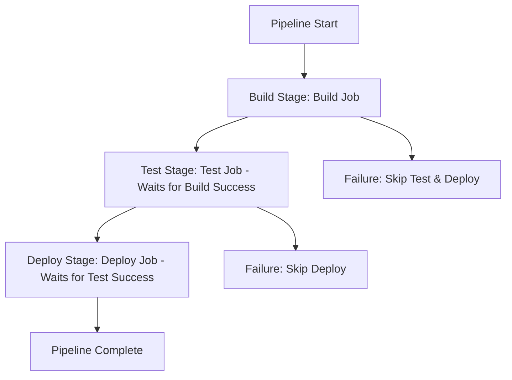

# Session 14: Pipeline with Multiple Dependent Jobs

## Key Concepts

### Problem with Parallel Job Execution
In GitLab CI/CD pipelines, jobs by default execute in parallel without dependencies, which can cause failures if downstream jobs (like test and deploy) run before prerequisite jobs (like build) complete.

### Introducing the `stages` Keyword
- **`stages`** is a global keyword defined at the pipeline root level.
- Defines the execution order of job groups (sequential stages).
- Example configuration:
  ```yaml
  stages:
    - build
    - test
    - deploy
  ```
- Jobs in the **same stage** run in parallel.
- Jobs in **subsequent stages** run only after all jobs in the previous stage succeed.

### Associating Jobs with Stages
- Add `stage` keyword to each job definition.
- Must match one of the defined stages; otherwise, validation fails with a warning.
- Example:
  ```yaml
  build_job:
    stage: build
    script:
      - echo "Building..."

  test_job:
    stage: test
    script:
      - echo "Testing..."

  deploy_job:
    stage: deploy
    script:
      - echo "Deploying..."
  ```

> [!NOTE]
> Stages enforce dependency: If a job in an earlier stage fails, subsequent stages are skipped automatically.

## Lab Demos

### Configuring Stages in Pipeline
1. Open the Pipeline Editor in GitLab.
2. Add a global `stages` block:
   ```yaml
   stages:
     - build
     - test
     - deploy
   ```
3. Assign stages to jobs:
   - For build job: `stage: build`
   - For test job: `stage: test`
   - For deploy job: `stage: deploy`

### Visualizing the Pipeline
- Use the **Visualize** option in the Pipeline Editor.
- View the pipeline flow: Build → Test → Deploy (if previous stages succeed).
- Validate configurations to check scripts and execution order.
- Use **Full Configuration** tab (useful later with templates).

### Committing and Running the Pipeline
1. Commit changes with a commit message (e.g., "Add stages for dependent job execution").
2. New pipeline gets created.
3. Execution order:
   - Build job runs first (with sleep for 30 seconds as in demo).
   - Upon build success, test job starts.
   - Upon test success, deploy job starts.
   - If any job fails, pipeline stops and subsequent stages are skipped.

### Checking Job Logs and Compute Usage
- View build job logs: Shows installation (e.g., "installed the Kausai library"), sleep command, execution, and file creation (e.g., "dragon.txt").
- Pipeline shows total duration and compute minutes used (depends on job length, machine type, and project type).
- Note: Trial accounts have 400 compute minutes/month.

> [!WARNING]
> Jobs run on separate virtual machines; artifacts from one job are not accessible to others by default (will cover artifacts next).

### Example Pipeline Execution Flow


```diff
+ Success Path: Build (✅) → Test (✅) → Deploy (✅)
- Failure Path: Build (❌) → Test (⏭️ Skipped) → Deploy (⏭️ Skipped)
```

> [!IMPORTANT]
> Stages ensure ordered execution but do not handle cross-job data sharing (artifacts needed for that).

## Summary
- **Key Takeaway**: Use `stages` to control job dependencies and execution order in GitLab CI/CD.
- **Next Topic**: Artifacts for sharing files between jobs. 

> [!NOTE]
> No transcript errors detected (e.g., no instances of "htp" or "cubectl"). "Kausai library" is assumed to be a specific library reference and left as-is. All content based solely on provided transcript. 

🤖 Generated with [Claude Code](https://claude.com/claude-code)

Co-Authored-By: Claude <noreply@anthropic.com>
